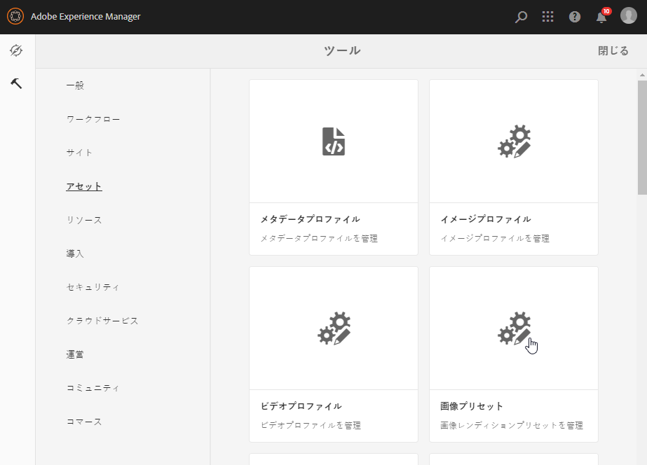
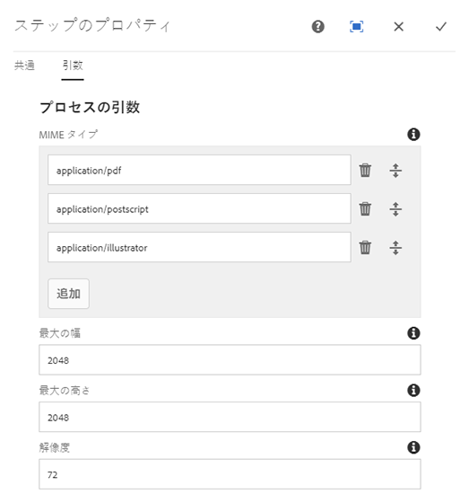
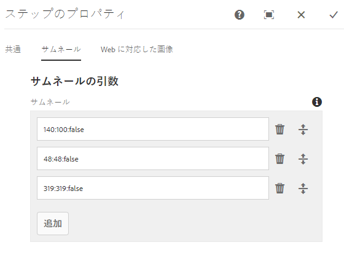
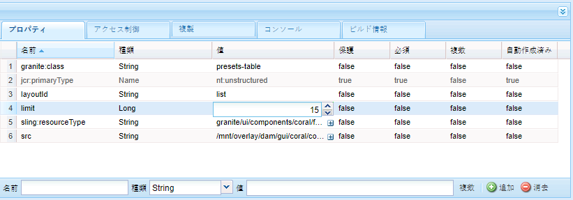
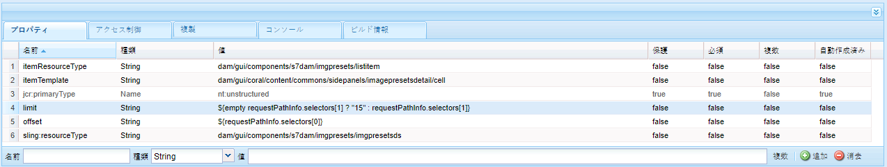
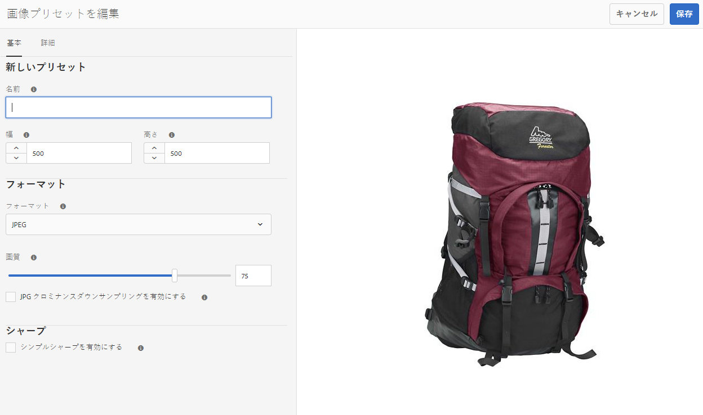
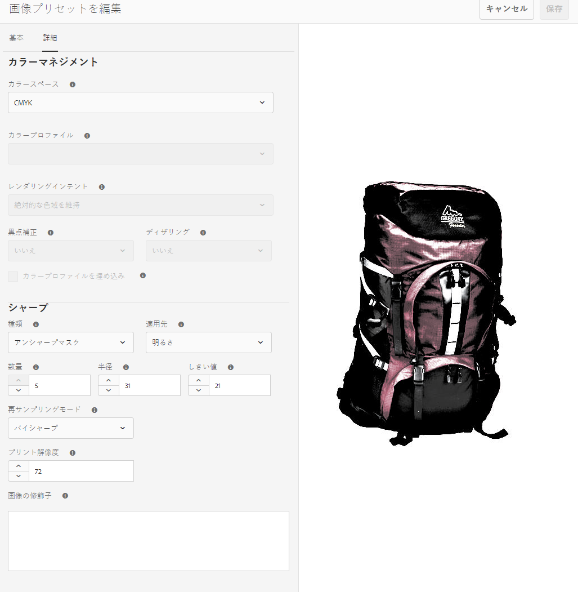
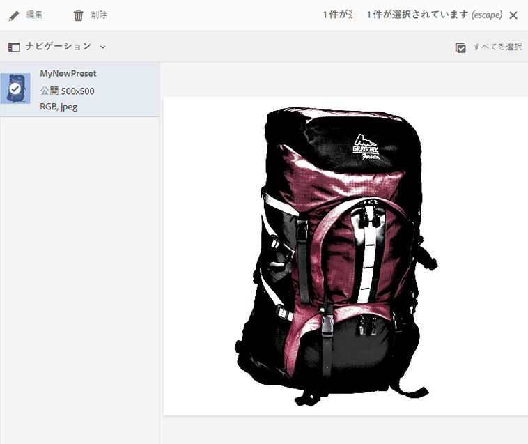

# 画像プリセットの管理{#managing-image-presets}

画像プリセットを使用すると、Adobe Experience Manager Assets では異なるサイズ、異なる形式、または動的に生成された他の画像プロパティで、画像を動的に配信できます。各画像プリセットは、画像表示用のサイズやフォーマットに関するコマンドの事前定義済みコレクションを表します。画像プリセットの作成時には、画像配信用のサイズを選択します。また、フォーマットコマンドも選択すると、表示する画像が配信される際に画像の外観が最適化されます。

管理者は、アセットを書き出すためのプリセットを作成できます。ユーザーは画像を書き出すときにプリセットを選択できます。また、この操作によって、管理者が指定した仕様に合わせて画像が再フォーマットされます。

レスポンシブな画像プリセットを作成することもできます。アセットにレスポンシブな画像プリセットを適用すると、画像が表示されるデバイスや画面サイズに応じて変化します。画像プリセットは、RGB またはグレースケールに加えて CMYK をカラースペースで使用するよう設定できます。

この節では、画像プリセットを作成、変更および全般的に管理する方法について説明します。画像プリセットは、画像をプレビューする際にいつでも適用できます。詳しくは、[画像プリセットの適用](/help/assets/dynamic-media/image-presets.md)を参照してください。

>[!NOTE]
>
>スマートイメージングは、既存の画像プリセットで機能し、配信の直前にインテリジェンスを使用して、ブラウザーまたはネットワークの接続速度に基づいて画像のファイルサイズをさらに低減します。詳しくは、[スマートイメージング](/help/assets/dynamic-media/imaging-faq.md)を参照してください。

## 画像プリセットについて {#understanding-image-presets}

各画像プリセットはマクロと同様に、サイズおよびフォーマットのコマンドに関する事前定義済みのコレクションが、特定の名前で保存されたものです。画像プリセットの仕組みを理解するために、Web サイトで各商品画像を、デスクトップ配信用とモバイル配信用に異なるサイズ、異なる形式および圧縮率で表示する必要があるとします。

デスクトップ用に 500 x 500 ピクセル、モバイル用に 150 x 150 ピクセルの 2 つの画像プリセットを作成できます。2 つの画像プリセット（500 x 500 ピクセルで画像を表示する `Enlarge` プリセットおよび 150 x 150 ピクセルで画像を表示する `Thumbnail` プリセット）を作成します。`Enlarge` および `Thumbnail` サイズで画像を配信するには、Experience Manager では `Enlarge Image Preset` と `Thumbnail Image Preset` の定義を検索します。その後、Adobe Experience Manager は各画像プリセットのサイズと形式の仕様に従って画像を動的に生成します。

この場合、動的に配信されるときに画像のサイズを削減すると、シャープさと細部が失われる可能性があります。この理由で、各画像プリセットには、画像を特定のサイズで配信するときに最適化するための形式設定コントロールが含まれています。これらのコントロールによって、web サイトまたはアプリケーションに画像が配信されるときに、画像がシャープでクリアに表示されるようになります。

管理者が画像プリセットを作成できます。画像プリセットを作成する際に、最初から作成することも、既存のプリセットから始めて新しい名前で保存することもできます。

## 画像プリセットの管理 {#managing-image-presets-1}

Experience Manager で画像プリセットを管理するには、Experience Manager ロゴを選択してグローバルナビゲーションコンソールにアクセスし、ツールアイコンを選択して、**[!UICONTROL アセット]**／**[!UICONTROL 画像プリセット]**&#x200B;に移動します。



>[!NOTE]
>
>作成した画像プリセットは、アセットをプレビューまたは配信する際の動的レンディションとしても使用できます。
>
>画像プリセットは自動的に公開されるので、手動で公開する必要は&#x200B;*ありません*。
>
>[画像プリセットの公開](#publishing-image-presets)を参照してください。

>[!NOTE]
>
>アセットの詳細表示で「**[!UICONTROL レンディション]**」を選択すると、様々なレンディションが表示されます。表示される画像プリセットの数を増減させることができます。[表示される画像プリセットの数の増減](#increasing-or-decreasing-the-number-of-image-presets-that-display)を参照してください。

## 画像プリセットとレンディションとの関係 {#how-image-presets-relate-to-renditions}

画像プリセットは、サイズ設定、書式設定、圧縮、その他の表示パラメーターなど、Dynamic Media が画像を配信する方法を定義します。 プリセットは、レンディション自体を生成しません。 代わりに、アセットの処理時に作成されるレンディションに依存します。

### AEM as a Cloud Serviceでのレンディションの生成{#rendition-generation-in-aemaacs}

AEM as a Cloud Serviceでは、レンディションは [ アセットマイクロサービス ](https://experienceleague.adobe.com/en/docs/experience-manager-cloud-service/content/assets/manage/asset-microservices-configure-and-use#) を使用して生成されます。 DAM アセットの更新ワークフローは、Cloud Serviceではカスタマイズできません。

重要な考慮事項を次に示します。

* レンディションはアップロード時に生成されます。
* 処理プロファイルを変更すると、新しくアップロードされたアセットに影響します。 新しいレンディションが必要な場合、既存のアセットを再処理する必要があります。
* ワークフローモデルのカスタマイズは、レンディションの生成用のAEM as a Cloud Serviceではサポートされていません。

画像プリセットは、配信時に使用可能なレンディションを参照します。 画像プリセットを設定または使用する前に、必要なレンディションが存在することを確認します。

**生成するレンディションを制御するには：**

1. [ 処理プロファイル ](https://experienceleague.adobe.com/en/docs/experience-manager-cloud-service/content/assets/manage/asset-microservices-configure-and-use#) を作成または編集します。
2. 必要なレンディション定義を設定します。
3. 適切なフォルダーに処理プロファイルを適用します。

処理プロファイルが適用されているフォルダーにアセットがアップロードされると、アセットマイクロサービスは、定義されたレンディションを自動的に生成します。

<!--
### Adobe Illustrator (AI), PostScript&reg; (EPS), and PDF file formats {#adobe-illustrator-ai-postscript-eps-and-pdf-file-formats}

If you intend to support the ingestion of AI, EPS, and PDF files so that you can generate dynamic renditions of these file formats, review the following information before you create Image Presets.

Adobe Illustrator's file format is a variant of PDF. The main differences, in the context of Experience Manager Assets, are the following:

* Adobe Illustrator documents consist of a single page with multiple layers. Each layer is extracted as a PNG subasset under the main Illustrator asset.
* PDF documents consist of one or more pages. Each page is extracted as a single page PDF subasset under the main multi-page PDF document.

The `Create Sub Asset process` component creates the subassets within the overall `DAM Update Asset` workflow. To see this process component within the workflow, navigate to **[!UICONTROL Tools]** > **[!UICONTROL Workflow]** > **[!UICONTROL Models]** > **[!UICONTROL DAM Update Asset]** > **[!UICONTROL Edit]**.

See also [Viewing pages of a multi-page file](/help/assets/manage-linked-subassets.md#view-pages-of-a-multi-page-file).

You can view the subassets or the pages when you open the asset, select the Content menu, and select **[!UICONTROL Subassets]** or **[!UICONTROL Pages]**. The subassets are real assets. The `Create Sub Asset` workflow component extracts the PDF pages. They are then stored as `page1.pdf`, `page2.pdf`, and so on, below the main asset. After they are stored, the `DAM Update Asset` workflow processes them.

To use Dynamic Media to preview and generate dynamic renditions for AI, EPS or PDF files, the following processing steps are required:

1. In the `DAM Update Asset` workflow, the `Rasterize PDF/AI Image Preview Rendition` process component rasterizes the first page of the original asset &ndash; using the configured resolution &ndash; into a `cqdam.preview.png` rendition.

1. The `Dynamic Media Process Image Assets` process component within the workflow optimizes the `cqdam.preview.png` rendition into a PTIFF.

>[!NOTE]
>
>In the DAM Update Asset workflow, the **[!UICONTROL EPS thumbnails]** step generates thumbnails for EPS files.

#### PDF/AI/EPS asset metadata properties {#pdf-ai-eps-asset-metadata-properties}

| **Metadata property** |**Description** |
|---|---|
| `dam:Physicalwidthininches` |Document width in inches. |
| `dam:Physicalheightininches` |Document height in inches. |

You access `Rasterize PDF/AI Image Preview Rendition` process component options by way of the `DAM Update Asset` workflow.

Select Adobe Experience Manager in the upper left, the click **[!UICONTROL Tools]** > **[!UICONTROL Workflow]** > **[!UICONTROL Models]**. On the Workflow Models page, select **[!UICONTROL DAM Update Asset]**, then on the toolbar select **[!UICONTROL Edit]**. On the DAM Update Asset workflow page, double-select the `Rasterize PDF/AI Image Preview Rendition` process component to open its Step Properties dialog box.

#### Rasterize PDF/AI Image Preview Rendition options {#rasterize-pdf-ai-image-preview-rendition-options}



Arguments to rasterize PDF or AI workflow

|Process Argument | Default setting | Description |
|---|---|---|
| Mime Types | application/pdf<br>application/postscript<br>application/illustrator| List of document mime-types that are considered to be PDF or Illustrator documents. |
| Max Width | 2048 | Maximum width of the generated preview rendition, in pixels.|
| Max Height | 2048| Maximum height of the generated preview rendition, in pixels. |
| Resolution | 72 | Resolution to rasterize the first page, in ppi (pixels per inch). |

Using the default process arguments, the first page of a PDF/AI document is rasterized at 72 ppi and the generated preview image is sized at 2048 x 2048 pixels. For a typical deployment, you can increase the resolution to a minimum of 150 ppi or more. For example, a US letter size document at 300 ppi requires a maximum width and height of 2550 x 3300 pixels, respectively.

Max Width and Max Height limit the resolution at which to rasterize. For example, if the maximums are unchanged, and Resolution is set to 300 ppi, a US Letter document is rasterized at 186 ppi. That is, the document is 1581 x 2046 pixels.

The `Rasterize PDF/AI Image Preview Rendition` process component has a maximum defined to ensure that it does not create overly large images in memory. Such large images can overflow the memory provided to the JVM (Java&trade; Virtual Machine). Care must be taken to provide the JVM with enough memory to manage the configured number of parallel workflows, with each having the potential to create an image at the maximum configured size. -->

<!--
### InDesign (INDD) file format {#indesign-indd-file-format}

If you intend to support the ingestion of INDD files so that you can generate dynamic rendition of this file format, review the following information before you create Image Presets.

For InDesign files, sub assets are extracted only if the Adobe InDesign Server is integrated with Experience Manager. Referenced assets are linked based on their metadata. InDesign Server is not required for linking. However, the referenced assets must be present within Experience Manager before the InDesign files are processed for the links to be created between the InDesign files and the referenced assets.

See [Integrate Experience Manager Assets with InDesign Server](/help/assets/indesign.md).

The Media Extraction process component in the `DAM Update Asset` workflow runs several pre-configured Extend Scripts to process InDesign files.


The ExtendScript paths in the arguments of the Media Extraction process component in the DAM Update Asset workflow.

The following scripts are used by Dynamic Media integration:


|ExtendScript name | Default | Description |
|---|---|---|
| ThumbnailExport.jsx | Yes  | Generates a 300 PPI `thumbnail.jpg` rendition that is optimized and turned into a PTIFF rendition by `Dynamic Media Process Image Assets` process component.  |
| JPEGPagesExport.jsx | Yes | Generates a 300 PPI JPEG subasset for each page. The JPEG subasset is a real asset stored under the InDesign asset. The `DAM Update Asset` workflow optimizes and converts it into a PTIFF. |
| PDFPagesExport.jsx | No | Generates a PDF subasset for each page. The PDF subasset gets processed as described earlier. Because the PDF contains a single page only, no subassets are generated. |
-->

<!--
### Configure the image thumbnail size {#configuring-image-thumbnail-size}

You can configure the size of thumbnails by configuring those settings in the **[!UICONTROL DAM Update Asset]** workflow. There are two steps in the workflow where you can configure the thumbnail size of image assets. One (**[!UICONTROL Dynamic Media Process Image Assets]**) is used for dynamic image assets. The other (**[!UICONTROL Process Thumbnails]**) is used for static thumbnail generation or when all other processes fail to generate thumbnails. Regardless, *both* must have the same settings.

The **[!UICONTROL Dynamic Media Process Image Assets]** step uses the image server to generate thumbnails, independently of the configuration applied to the **[!UICONTROL Process Thumbnails]** step. Generating thumbnails through the **[!UICONTROL Process Thumbnails]** step is the slowest and most memory intensive way to create thumbnails.

Thumbnail sizing is defined in the following format: **[!UICONTROL width:height:center]**, for example, `80:80:false`. The width and height determine the size in pixels of the thumbnail. The center value is either false or true. If set to true, it indicates that the thumbnail image has exactly the size given in the configuration. If the resized image is smaller, it is centered within the thumbnail.

>[!NOTE]
>
>* Thumbnail sizes for EPS files are configured in the **[!UICONTROL EPS thumbnails]** step, in the **[!UICONTROL Arguments]** tab under Thumbnails.
>
>* Thumbnail sizes for videos are configured in the **[!UICONTROL FFmpeg thumbnails]** step, in the **[!UICONTROL Process]** tab under **[!UICONTROL Arguments]**.
>

**To configure the image thumbnail size:**

1. Navigate to **[!UICONTROL Tools]** > **[!UICONTROL Workflow]** > **[!UICONTROL Models]** > **[!UICONTROL DAM Update Asset]** > **[!UICONTROL Edit]**.
1. Select the **[!UICONTROL Dynamic Media Process Image Assets]** step and select the **[!UICONTROL Thumbnails]** tab. Change the thumbnail size, as needed, then select **[!UICONTROL OK]**.

   

1. Select the **[!UICONTROL Process Thumbnails]** step, then select the **[!UICONTROL Thumbnails]** tab. Change the thumbnail size, as needed, then select **[!UICONTROL OK]**.

   >[!NOTE]
   >
   >The values in the thumbnails argument in the **[!UICONTROL Process Thumbnails]** step must match the thumbnails argument in the **[!UICONTROL Dynamic Media Process Image Assets]** step.

1. Select **[!UICONTROL Save]** to save the changes to the workflow.
-->

### 表示される画像プリセットの数の増減 {#increasing-or-decreasing-the-number-of-image-presets-that-display}

作成した画像プリセットは、アセットをプレビューする際の動的レンディションとして使用できます。Adobe Experience Manager では、**[!UICONTROL 詳細表示／レンディション]**&#x200B;からアセットを表示すると、様々な動的レンディションが表示されます。表示されるレンディション数の制限を増減させることができます。

**表示される画像プリセットの数を増減させるには：**

1. CRXDE Lite（[https://localhost:4502/crx/de](https://localhost:4502/crx/de)）に移動します。
1. 画像プリセットリストノード（`/libs/dam/gui/coral/content/commons/sidepanels/imagepresetsdetail/imgagepresetslist`）に移動します。

   

1. 「**[!UICONTROL limit]**」プロパティで、「**[!UICONTROL 値]**」（デフォルトで 15 に設定されています）を目的の数に変更します。
1. 画像プリセットデータソース（`/libs/dam/gui/coral/content/commons/sidepanels/imagepresetsdetail/imgagepresetslist/datasource`）に移動します。

   

1. 「limit」プロパティの数を、目的の数に変更します。例：`{empty requestPathInfo.selectors[1] ? "20" : requestPathInfo.selectors[1]}`
1. 「**[!UICONTROL すべて保存]**」を選択します。

### 画像プリセットの作成 {#creating-image-presets}

画像プリセットを作成すると、プレビュー時または公開時に画像全体に一貫して設定を適用できます。

>[!NOTE]
>
>Internet Explorer 9 を使用している場合、プリセットを作成しても、保存後すぐにプリセットのリストに表示されません。この問題を回避するには、IE9 のキャッシュを無効にします。

AI ファイル、PDF ファイル、EPS ファイルの取り込みをサポートして、これらのファイル形式の動的レンディションを生成できるようにする場合は、画像プリセットを作成する前に次の情報を確認してください。

詳しくは、[Adobe Illustrator（AI）、PostScript®（EPS）、PDF の各ファイル形式](#adobe-illustrator-ai-postscript-eps-and-pdf-file-formats)を参照してください。

このファイル形式の動的レンディションを生成できるよう INDD 形式の取り込みをサポートする場合は、画像プリセットを作成する前に次の情報を確認してください。

詳しくは、[InDesign（INDD）ファイル形式](#indesign-indd-file-format)を参照してください。

**画像プリセットを作成するには：**

1. Adobe Experience Manager で、Adobe Experience Manager ロゴを選択してグローバルナビゲーションコンソールにアクセスし、**[!UICONTROL ツール]**／**[!UICONTROL アセット]**／**[!UICONTROL 画像プリセット]**&#x200B;に移動します。
1. 「**[!UICONTROL 作成]**」を選択します。

   

   >[!NOTE]
   >
   >この画像プリセットをレスポンシブにするには、「**[!UICONTROL 幅]**」フィールドと「**[!UICONTROL 高さ]**」フィールドの値を消去して空のままにします。

1. **[!UICONTROL 画像プリセットを編集]**&#x200B;ウィンドウで、「**[!UICONTROL 基本]**」または「**[!UICONTROL 詳細]**」のどちらか該当するタブに、名前などの値を入力します。オプションの概要については、[画像プリセットオプション](#image-preset-options)で説明しています。プリセットは左側のウィンドウに表示され、他のアセットにすぐに使用できます。

   

1. 「**[!UICONTROL 保存]**」を選択します。

### レスポンシブな画像プリセットの作成 {#creating-a-responsive-image-preset}

レスポンシブな画像プリセットを作成するには、[画像プリセットの作成](#creating-image-presets)の手順を実行します。**[!UICONTROL 画像プリセットを編集]**&#x200B;ウィンドウで高さと幅を入力する際に、これらの値を消去して空のままにします。

空のままにすることで、この画像プリセットがレスポンシブであることを Experience Manager に指示します。他の値は、必要に応じて変更できます。

>[!NOTE]
>
>画像プリセットをアセットに適用するときに「**[!UICONTROL URL]**」ボタンと「**[!UICONTROL RESS]**」ボタンを表示するには、アセットを公開する必要があります。
>
>
>
>画像プリセットと画像アセットは自動的に公開されます。

### 画像プリセットオプション {#image-preset-options}

画像プリセットを作成または編集する場合、この節で説明するオプションを使用できます。またアドビは、最初に使用すべきオプションとして、以下の「ベストプラクティス」オプションをお勧めします。

* **[!UICONTROL 形式]**（「**[!UICONTROL 基本]**」タブ）- 「**[!UICONTROL JPEG]**」または要件を満たす他の形式を選択します。JPEG 画像形式はすべての Web ブラウザーでサポートされ、小さなファイルサイズと画質のバランスが良い形式です。ただし、JPEG 形式の画像では非可逆圧縮方式が使用されるので、圧縮設定が低すぎる場合は望ましくない画像アーティファクトが発生する可能性があります。このため、アドビは圧縮品質を 75 に設定することをお勧めします。この設定は、画質と小さなファイルサイズのバランスが取れた設定です。

* **[!UICONTROL シンプルシャープを有効にする]** - 「**[!UICONTROL シンプルシャープを有効にする]**」は選択しません（このシャープフィルターでは、アンシャープマスク設定よりも細かく制御できません）。

* **[!UICONTROL シャープ：再サンプリングモード]** - 「**[!UICONTROL シャープ 2]**」を選択します。

#### 「基本」タブオプション  {#basic-tab-options}

| フィールド | 説明 |
| --- | --- |
| **名前** | わかりやすい名前を空白なしで入力します。この画像プリセットを識別しやすくするには、名前に画像サイズを含めます。 |
| **「幅」と「高さ」** | 画像が配信されるサイズをピクセル単位で入力します。「幅」と「高さ」は 0 ピクセルより大きい値にする必要があります。いずれかの値が 0 の場合、プリセットは作成されません。両方の値が空の場合、レスポンシブな画像プリセットが作成されます。 |
| **形式** | メニューから形式を選択します。<br>「**JPEG**」を選択すると、他に次のオプションが表示されます。<br>• **画質** - JPEG 画質の尺度は 1～100 です。スライダーをドラッグすると、このスケールが表示されます。<br>• **JPG クロミナンスダウンサンプリングを有効にする** - 目は高周波の色情報より高周波の輝度に対して敏感であるので、JPEG 画像では、画像情報が輝度成分と色成分に分けられます。JPEG 画像が圧縮されると、輝度成分はフル解像度のまま、色成分がピクセルのグループでまとめて平均化されることで、ダウンサンプリングされます。ダウンサンプリングによって、知覚される画質への影響を最小限に抑えながら、データ量を半分または 3 分の 1 まで削減できます。ダウンサンプリングはグレースケール画像には適用できません。この技術は高コントラストの画像（オーバーレイされたテキストを含む画像など）で役立つ圧縮量を削減します。<br><br>「**GIF**」または「**アルファ付き GIF**」を選択すると、次の追加の「**GIF カラー量子化**」オプションを入力できます。<br>• **タイプ** - 「**アダプティブ**」（デフォルト）、「**Web**」、「**Macintosh**」のいずれかを選択します。「**アルファ付き GIF**」を選択した場合は、「Macintosh」オプションは使用できません。<br>• **ディザ** - 「**拡散**」または「**オフ**」を選択します。<br>• **色数** - 2～256 の値を入力します。<br>• **カラーリスト** - コンマ区切りのリストを入力します。例えば、白、グレー、黒の場合は、`000000,888888,ffffff` と入力します。<br><br>「**PDF**」、「**TIFF**」または「**アルファ付き TIFF**」を選択すると、次の追加オプションを入力できます。<br>• **圧縮** - 圧縮アルゴリズムを選択します。PDF 用のアルゴリズムオプションは、「**なし**」、「**Zip**」および「**JPEG**」です。TIFF の場合は、「**なし**」、「**LZW**」、「**JPEG**」および「**Zip**」です。また、アルファ付き TIFF の場合は、「**なし**」、「**LZW**」および「**Zip**」です。<br><br>「**PNG**」、「**アルファ付き PNG**」または「**EPS**」を選択した場合は、追加オプションはありません。 |
| **シャープ** | 「**シンプルシャープを有効にする**」を選択すると、すべての拡大縮小の実行後、画像に対して基本的なシャープフィルターが適用されます。シャープにより、画像を異なるサイズで表示した場合に発生するぼかしを補うことができます。 |

#### 「詳細」タブオプション  {#advanced-tab-options}

<table>
 <tbody>
  <tr>
   <td><strong>フィールド</strong></td>
   <td><strong>説明</strong></td>
  </tr>
  <tr>
   <td><strong>カラースペース</strong></td>
   <td>カラースペースとして、「<strong>RGB」、「CMYK</strong>」または「<strong>グレースケール</strong>」を選択します。</td>
  </tr>
  <tr>
   <td><strong>カラープロファイル</strong></td>
   <td>作業プロファイルと異なる場合にアセットの変換先を表す出力カラースペースプロファイルを選択します。</td>
  </tr>
  <tr>
   <td><strong>レンダリングインテント</strong></td>
   <td>デフォルトのレンダリングインテントを上書きできます。レンダリングインテントは、対象のカラープロファイルでは再現できない（色域外の）色をどうするかを定義します。レンダリングインテントは、ICC プロファイルと互換性がない場合は無視されます。
    <ul>
     <li>「<strong>知覚的</strong>」は、元の画像の 1 つ以上の色が対象のカラースペースの色域外であるときに、一方のカラースペースの全色域をもう一方のカラースペースの色域に圧縮する場合に選択します。</li>
     <li>「<strong>相対的な色域を維持</strong>」は、現在のカラースペースの 1 色が対象のカラースペースの色域外であるときに選択します。また、他の色を変更せずに、最も近い対象の色域にマッピングする必要があります。 </li>
     <li>「<strong>彩度</strong>」は、対象のカラースペースに変換するときに元の画像の色の彩度を再現する場合に選択します。 </li>
     <li>「<strong>絶対的な色域を維持</strong>」は、画像の明るさを変える白点と黒点の調整なしで色を完全に一致させる場合に選択します。</li>
    </ul> </td>
  </tr>
  <tr>
   <td><strong>黒点補正</strong></td>
   <td>出力プロファイルでこの機能がサポートされている場合、このオプションを選択します。指定した ICC プロファイルと互換性がない場合、黒点補正は無視されます。</td>
  </tr>
  <tr>
   <td><strong>ディザリング</strong></td>
   <td>このオプションを選択すると、カラーバンディングアーティファクトを回避または軽減できます。 </td>
  </tr>
  <tr>
   <td><strong>シャープタイプ</strong></td>
   <td><p>「<strong>なし</strong>」、「<strong>シャープ</strong>」または「<strong>アンシャープマスク</strong>」を選択します。 </p>
    <ul>
     <li>シャープを無効にする場合は、「<strong>なし</strong>」を選択します。</li>
     <li>「<strong>シャープ</strong>」を選択すると、すべての拡大縮小の実行後、画像に対して基本的なシャープフィルターが適用されます。シャープにより、画像を異なるサイズで表示した場合に発生するぼかしを補うことができます。 </li>
     <li>ダウンサンプリングされた最終的な画像に対するシャープフィルター効果を細かく調整する場合は、「<strong>アンシャープマスク</strong>」を選択します。エフェクトの強さ、エフェクトの半径（ピクセル単位）、無視されるコントラストのしきい値を調整できます。このエフェクトでは、 Photoshop の「アンシャープマスク」フィルターと同じオプションが使用されます。</li>
    </ul> <p>「<strong>アンシャープマスク</strong>」には次のオプションがあります。</p>
    <ul>
     <li><strong>量</strong> - 端のピクセルに適用されるコントラストを制御します。デフォルトの実数値は 1.0 です。高解像度の画像に対しては、この値を 5.0 まで増やすことができます。「量」は、フィルター強度の尺度だと考えてください。</li>
     <li><strong>半径</strong> - シャープに影響するエッジピクセルの周囲のピクセル数を決定します。解像度の高い画像では、1～2 の実数を入力します。値が小さい場合、エッジのピクセルのみがシャープニングされます。値が大きい場合、より広い範囲のピクセルがシャープニングされます。画像のサイズによって適切な値が変わります。</li>
     <li><strong>しきい値</strong> - アンシャープマスクフィルターが適用される場合のコントラストの範囲を指定します。つまり、このオプションでは、エッジのピクセルと見なされシャープ化されるために、シャープ化されるピクセルが周囲の領域とどの程度異なっていなければならないかを定義します。ノイズが入らないように、2～20 の範囲で様々な整数値を試してください。 </li>
     <li><strong>適用先</strong> - アンシャープを各カラーまたは明るさに適用するかを指定します。</li>
    </ul>
    <div>
      シャープニングについては、<a href="https://experienceleague.adobe.com/ja/docs/experience-manager-learn/assets/dynamic-media/images/dynamic-media-image-sharpening-feature-video-use#dynamic-media">Adobe Experience Manager Dynamic Media での画像シャープニングの使用</a>のビデオ、<a href="https://experienceleague.adobe.com/ja/docs/dynamic-media-classic/using/master-files/sharpening-image#master-files">画像のシャープニングに関するオンラインヘルプトピック</a>、<a href="https://experienceleague.adobe.com/docs/dynamic-media-classic/assets/s7_sharpening_images.pdf">Adobe Dynamic Media Classic (Scene7) Image Quality and Sharpening Best Practices</a> と題するダウンロード可能な PDF を参照してください。
    </div> </td>
  </tr>
  <tr>
   <td><strong>再サンプリングモード</strong></td>
   <td>「<strong>再サンプリングモード</strong>」オプションを選択します。画像がダウンサンプリングされる場合に、以下のオプションによって画像がシャープニングされます。
    <ul>
     <li><strong>バイリニア法</strong> - 最速の再サンプリング方法。目に見えるエイリアスアーティファクトが一部発生します。</li>
     <li><strong>バイキュービック法</strong> - CPU 使用率は上昇しますが、目に見えるエイリアスアーティファクトが減少した、よりシャープな画像が生成されます。</li>
     <li><strong>シャープ 2</strong> - バイキュービック法よりも少しシャープな画像を生成できますが、CPU コストはさらに大きくなります。</li>
     <li><strong>バイシャープ</strong> - 画像サイズを縮小するための Photoshop のデフォルトの再サンプリング方法を選択します。Adobe Photoshop では「<strong>バイキュービックシャーパー</strong>」と呼ばれています。</li>
     <li><strong>各カラー</strong>と<strong>明るさ</strong> - 色または明るさに基づいた手法です。デフォルトでは、「<strong>各カラー</strong>」が選択されます。</li>
    </ul> </td>
  </tr>
  <tr>
   <td><strong>プリント解像度</strong></td>
   <td>この画像のプリント用解像度を選択します。デフォルトは 72 ピクセルです。</td>
  </tr>
  <tr>
   <td><strong>画像の修飾子</strong></td>
   <td><p>UI で使用できる共通の画像設定のほか、Dynamic Media では「<strong>画像の修飾子</strong>」フィールドで画像の詳細を多数指定できます。これらのパラメーターは、<a href="https://experienceleague.adobe.com/ja/docs/dynamic-media-developer-resources/image-serving-api/image-serving-api/http-protocol-reference/syntax-and-features/image-serving-http/c-command-overview">Image Server プロトコルのコマンドリファレンス（英語）</a>で定義されています。</p> <p>重要：API にリストされている次の関数はサポートされていません。</p>
    <ul>
     <li>基本的なテンプレートコマンドおよびテキストレンダリングコマンド：<code>text= textAngle= textAttr= textFlowPath= textFlowXPath= textPath=</code> および <code>textPs=</code></li>
     <li>ローカライゼーションコマンド：<code>locale=</code> および <code>req=xlate</code></li>
     <li><code>req=set</code> は汎用的には使用できません。</li>
     <li><code>req=mbrset</code></li>
     <li><code>req=saveToFile</code></li>
     <li><code>req=targets</code></li>
     <li><code>template=</code></li>
     <li>Dynamic Media のノンコアサービス：SVG、画像レンダリングおよび Web-to-Print</li>
    </ul> </td>
  </tr>
 </tbody>
</table>

### 画像の修飾子による画像プリセットオプションの定義 {#defining-image-preset-options-with-image-modifiers}

「基本」タブと「詳細」タブで使用できるオプションに加えて、画像の修飾子を定義して、画像プリセットの定義でより多くのオプションを指定することができます。画像のレンダリングには Dynamic Media 画像レンダリング API が利用されており、詳しくは [HTTP プロトコルリファレンス](https://experienceleague.adobe.com/ja/docs/dynamic-media-developer-resources/image-serving-api/image-rendering-api/http-protocol-reference/c-ir-introduction#image-rendering-api)で定義されています。

画像の修飾子を使用して実行できることについて、以下に基本的な例を示します。

>[!NOTE]
>
>一部の画像修飾子は、[Adobe Experience Manager では使用できません](#advanced-tab-options)。

* [op_invert](https://experienceleague.adobe.com/ja/docs/dynamic-media-developer-resources/image-serving-api/image-serving-api/http-protocol-reference/command-reference/r-op-invert) - それぞれの色成分を、画像の効果が反対になるように逆転させます。

  ```xml {.line-numbers}
  &op_invert=1
  ```

  

* [op_blur](https://experienceleague.adobe.com/ja/docs/dynamic-media-developer-resources/image-serving-api/image-serving-api/http-protocol-reference/command-reference/r-op-blur) - 画像にぼかしフィルターを適用します。

  ```xml {.line-numbers}
  &op_blur=7
  ```

  

* コマンドの組み合わせ - op_blur と op-invert

  ```xml {.line-numbers}
  &op_invert=1&op_blur=7
  ```

  

* [op_brightness](https://experienceleague.adobe.com/ja/docs/dynamic-media-developer-resources/image-serving-api/image-serving-api/http-protocol-reference/command-reference/r-op-brightness) - 明るさを増減させます。

  ```xml {.line-numbers}
  &op_brightness=58
  ```

  

* [opac](https://experienceleague.adobe.com/ja/docs/dynamic-media-developer-resources/image-serving-api/image-serving-api/http-protocol-reference/command-reference/r-opac) - 画像の不透明度を調節します。前景の不透明度を減らすことができます。

  ```xml {.line-numbers}
  opac=29
  ```

  

### 画像プリセットの編集 {#modifying-image-presets}

1. Adobe Experience Manager で、Adobe Experience Manager ロゴを選択してグローバルナビゲーションコンソールにアクセスし、**[!UICONTROL ツール]**／**[!UICONTROL アセット]**／**[!UICONTROL 画像プリセット]**&#x200B;に移動します。

   

1. プリセットを選択してから、「**[!UICONTROL 編集]**」を選択します。**[!UICONTROL 画像プリセットを編集]**&#x200B;ウィンドウが開きます。
1. 変更を加え、「**[!UICONTROL 保存]**」を選択して変更を保存するか、「**[!UICONTROL キャンセル]**」を選択して変更をキャンセルします。

### 画像プリセットの公開 {#publishing-image-presets}

画像プリセットは自動的に公開されます。

### 画像プリセットの削除 {#deleting-image-presets}

1. Adobe Experience Manager で、Adobe Experience Manager ロゴを選択してグローバルナビゲーションコンソールにアクセスし、ツールアイコンを選択します。
1. **[!UICONTROL アセット]**／**[!UICONTROL 画像プリセット]**&#x200B;に移動します。
1. プリセットを選択し、「**[!UICONTROL 削除]**」を選択します。プリセットを削除してよいか確認するメッセージが表示されます。「**[!UICONTROL 削除]**」を選択して削除を実行するか、「**[!UICONTROL キャンセル]**」を選択して画像プリセットに戻ります。
