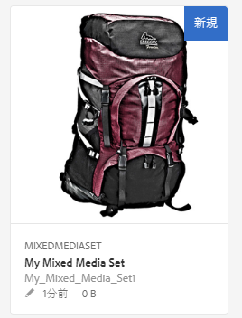
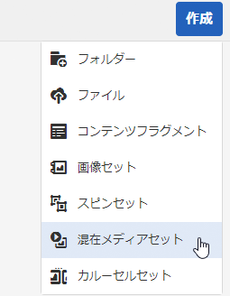
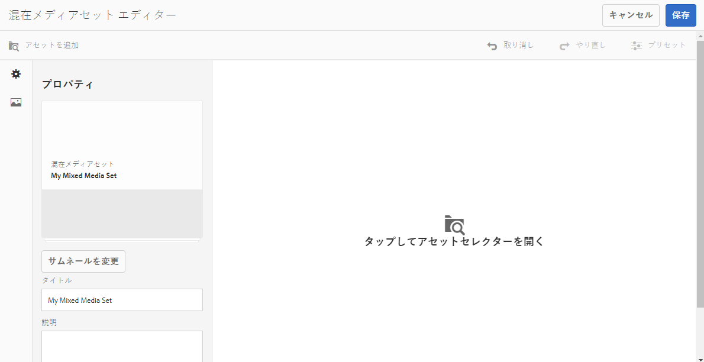
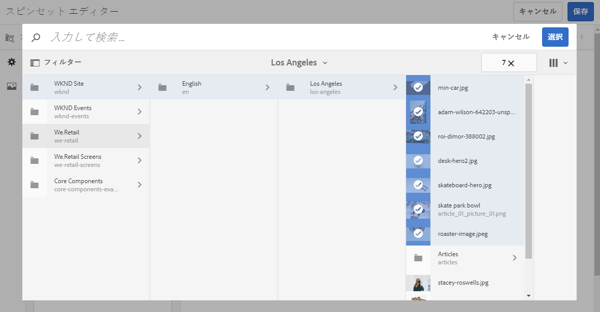
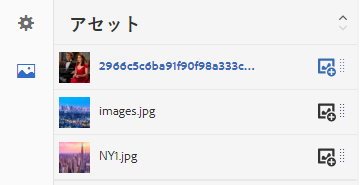

# 混在メディアセット{#mixed-media-sets}

<table>
    <tr>
        <td>
            <i> 新規 </i>Dynamic Media Prime<a href="/help/assets/dynamic-media/dm-prime-ultimate.md"><b>Ultimate</b></a>
        </td>
        <td>
            <i> 新規 </i> <a href="/help/assets/assets-ultimate-overview.md"><b>AEM AssetsUltimate</b></a>
        </td>
        <td>
            <i> 新規 </i> <a href="/help/assets/integrate-aem-assets-edge-delivery-services.md"><b>AEM AssetsとEdge Delivery Servicesの統合 </b></a>
        </td>
        <td>
            <i> 新規 </i><a href="/help/assets/aem-assets-view-ui-extensibility.md"><b>UI 拡張機能 </b></a>
        </td>
          <td>
            <i>Dynamic Media Prime</i>Ultimateの新 <a href="/help/assets/dynamic-media/enable-dynamic-media-prime-and-ultimate.md"><b> 能 </b></a>
        </td>
    </tr>
    <tr>
        <td>
            <a href="/help/assets/search-best-practices.md"><b>検索のベストプラクティス</b></a>
        </td>
        <td>
            <a href="/help/assets/metadata-best-practices.md"><b>メタデータのベストプラクティス</b></a>
        </td>
        <td>
            <a href="/help/assets/product-overview.md"><b>コンテンツハブ</b></a>
        </td>
        <td>
            <a href="/help/assets/dynamic-media-open-apis-overview.md"><b>OpenAPI 機能を備えた Dynamic Media</b></a>
        </td>
        <td>
            <a href="https://developer.adobe.com/experience-cloud/experience-manager-apis/"><b>AEM Assets 開発者向けドキュメント</b></a>
        </td>
    </tr>
</table>

混在メディアセットは、画像、画像セット、スピンセットおよびビデオを 1 つのプレゼンテーションで組み合わせて表示するものです。

混在メディアセットのバナーには、「**[!UICONTROL MixedMediaSet]**」と表示されます。また、混在メディアセットが公開されている場合、公開日が&#x200B;**[!UICONTROL 地球]**&#x200B;アイコン付きでバナーに表示され、最終変更日も&#x200B;**[!UICONTROL 鉛筆]**&#x200B;アイコン付きで表示されます。

>[!NOTE]
>
>アセットユーザーインターフェイスについて詳しくは、[タッチ UI を使用したアセットの管理](/help/assets/manage-digital-assets.md)を参照してください。

## クイックスタート：混在メディアセット {#quick-start-mixed-media-sets}

混在メディアセットをすぐに使い始めるには、次の手順を実行します。

1. [アセットをアップロード](#uploading-assets).

   まずは混在メディアセット用の画像およびビデオをアップロードします。必要に応じて、 [画像セット](/help/assets/dynamic-media/image-sets.md) と [スピンセット](/help/assets/dynamic-media/spin-sets.md) を作成します。ユーザーは混在メディアセットビューアで画像をズームできるので、画像を選択する際には必ずズームを考慮してください。最大サイズで 2,000 ピクセル以上の画像を使用してください。

   混在メディアセットでサポートされる形式のリストについては、 [Dynamic Media - サポートされているラスター画像形式](/help/assets/file-format-support.md#image-support-dynamic-media) を参照してください。

1. [混在メディアセットを作成します](#creating-mixed-media-sets)。

   アセットページで混在メディアセットを作成するには、 **[!UICONTROL 作成]**／**[!UICONTROL 混在メディアセット]** に移動し、セットの名前を付け、アセットを選択し、さらに画像の表示順を選択します。

   [セレクターの操作](/help/assets/dynamic-media/working-with-selectors.md)を参照してください。

1. 必要に応じて[混在メディアビューアプリセット](/help/assets/dynamic-media/managing-viewer-presets.md)を設定します。

   管理者は、混在メディアセットビューアプリセットを作成または編集できます。混在メディアセットを特定のビューアプリセットで表示するには、混在メディアセットを選択し、左パネルのドロップダウンメニューで「**[!UICONTROL ビューア]**」を選択します。

   ビューアプリセットを作成または編集するには、**[!UICONTROL ツール]**／**[!UICONTROL アセット]**／**[!UICONTROL ビューアプリセット]**&#x200B;に移動します。

   詳しくは、[ビューアプリセットの追加と編集](/help/assets/dynamic-media/managing-viewer-presets.md)を参照してください。

1. [混在メディアセットをプレビューします](#previewing-mixed-media-sets)。

   混在メディアセットを選択すると、プレビューできます。選択したビューアでの混在メディアセットの表示を確認するには、サムネールアイコンを選択します。**[!UICONTROL ビューア]**&#x200B;メニューから様々なビューアを選択できます。このメニューは左パネルのドロップダウンメニューにあります。

1. [混在メディアセットを公開します](#publishing-mixed-media-sets)。

   混在メディアセットを公開すると、URL と埋め込み文字列がアクティベートされます。また、[ビューアプリセットを公開](/help/assets/dynamic-media/managing-viewer-presets.md#publishing-viewer-presets)する必要があります。

1. [URL を Web アプリケーションにリンクする](/help/assets/dynamic-media/linking-urls-to-yourwebapplication.md)か、[ビデオビューアまたは画像ビューアを埋め込みます](/help/assets/dynamic-media/embed-code.md)。

   Adobe Experience Manager Assets によって、混在メディアセットの URL コールが作成され、混在メディアセットの公開後にアクティベートされます。アセットをプレビューする際に、これらの URL をコピーできます。または、web サイトに埋め込むこともできます。

   混在メディアセットを選択し、左パネルのドロップダウンメニューで「**[!UICONTROL ビューア]**」を選択します。

   詳しくは、[Web ページへの混在メディアセットのリンク](/help/assets/dynamic-media/linking-urls-to-yourwebapplication.md)および[ビデオビューアまたは画像ビューアの埋め込み](/help/assets/dynamic-media/embed-code.md)を参照してください。

必要に応じて、[混在メディアセット](#editing-mixed-media-sets)を編集できます。また、[混在メディアセットのプロパティ](/help/assets/manage-digital-assets.md#editing-properties)を表示および変更することができます。

>[!NOTE]
>
>セットの作成で問題が発生した場合は、[Dynamic Media のトラブルシューティング](/help/assets/dynamic-media/troubleshoot-dm.md)を参照してください。

## アセットのアップロード {#uploading-assets}

まずは混在メディアセット用の画像およびビデオをアップロードします。混在メディアセットビューアでは画像をズームできることに注意してください。そのため、このズーム機能を念頭に置いて画像を選択します。最大サイズで 2,000 ピクセル以上の画像を使用してください。

また、混在メディアセットにスピンセットまたは画像セットを追加する場合は、それらのセットも作成します。

混在メディアセットでサポートされる形式のリストについては、 [Dynamic Media - サポートされるラスター画像形式](/help/assets/file-format-support.md#image-support-dynamic-media) を参照してください。

## 混在メディアセットの作成 {#creating-mixed-media-sets}

混在メディアセットには、画像、画像セット、スピンセットおよびビデオを追加できます。 ファイル、画像セットおよびスピンセットを混在メディアセットに追加する前に、公開の準備が整っていることを確認します。

画像セットに追加したアセットは、自動的に英数字順で追加されます。追加後に、手動でアセットの順番を変更したり、並べ替えたりすることができます。

**混在メディアセットを作成するには：**

1. Assets で、混在メディアセットを作成する場所に移動し、 **[!UICONTROL 作成]**／**[!UICONTROL 混在メディアセット]** を選択します。アセットを格納しているフォルダー内からセットを作成することもできます。混在メディアセットエディターが表示されます。

   

1. 混在メディアセットエディターで、「**[!UICONTROL タイトル]**」に混在メディアセットの名前を入力します。この名前は、混在メディアセットの横のバナーに表示されます。 必要に応じて、説明を入力します。

   

   >[!NOTE]
   >
   >混在メディアセットを作成するときに、混在メディアセットのサムネールを変更したり、Adobe Experience Manager で混在メディアセット内のアセットに基づいてサムネールを自動的に選択したりすることができます。サムネールを選択するには、「**[!UICONTROL サムネールを変更]**」を選択し、画像を選択します（他のフォルダーに移動して画像を探すこともできます）。サムネールを選択した状態で、混在メディアセットからサムネールを自動的に生成することにした場合は、「**[!UICONTROL 自動サムネールに切り替え]**」を選択します。

1. 混在メディアセットに含めるアセットを選択するには、アセットセレクターを選択します。アセットを選択し、「**[!UICONTROL 選択]**」を選択します。

   アセットセレクターでは、キーワードを入力して **[!UICONTROL Enter]** キーを押すことで、アセットを検索することができます。フィルターを適用して、検索結果を絞り込むこともできます。パス、コレクション、ファイルタイプおよびタグでフィルタリングできます。フィルターを選択してから、ツールバーの&#x200B;**[!UICONTROL フィルター]**&#x200B;アイコンを選択します。**[!UICONTROL 表示]**&#x200B;アイコンを選択し、**[!UICONTROL リスト表示]**、**[!UICONTROL 列表示]**&#x200B;または&#x200B;**[!UICONTROL カード表示]**&#x200B;を選択することで、表示を変更できます。

   [セレクターの操作](/help/assets/dynamic-media/working-with-selectors.md)を参照してください。

   

1. 必要に応じて、アセットをリスト内で上下にドラッグしてアセットを並べ替えます（ドラッグするには、**[!UICONTROL 並べ替え]**&#x200B;アイコンを選択する必要があります）。

   

   サムネールを追加する場合は、画像の横の **+** **[!UICONTROL サムネール]**&#x200B;アイコンを選択し、必要なサムネールに移動します。すべてのサムネール画像の選択が完了したら、「**[!UICONTROL 保存]**」を選択します。

   >[!NOTE]
   >
   >アセットを追加する場合は、「**[!UICONTROL アセットを追加]**」を選択します。

1. アセットを削除するには、対応するチェックボックスを選択して、「**[!UICONTROL アセットを削除]**」を選択します。
1. プリセットを適用するには、右上隅にある「**[!UICONTROL プリセット]**」を選択し、アセットに適用するプリセットを選択します。
1. 「**[!UICONTROL 保存]**」を選択します。作成した混在メディアセットが、作成先のフォルダーに表示されます。

## 混在メディアセットの編集 {#editing-mixed-media-sets}

[Assets 内のアセットの場合と同じように](/help/assets/manage-digital-assets.md)、ユーザーインターフェイスで直接、混在メディアセット内のアセットに対して様々な編集タスクを実行できます。また、混在メディアセットでは次のアクションも実行できます。

* 混在メディアセットにアセットを追加します。
* 混在メディアセット内のアセットの並べ替え
* 混在メディアセット内のアセットの並べ替え
* ビューアプリセットを適用します。
* デフォルト設定の変更.

**混在メディアセットを編集するには：**

1. 次のいずれかの操作を行います。

   * 混在メディアセットアセットの上にマウスポインターを置き、 **[!UICONTROL 編集]** （鉛筆アイコン）を選択します。
   * 混在メディアセットアセットの上にマウスポインターを置き、 **[!UICONTROL 選択]** （チェックマークアイコン）を選択してからツールバーの「**[!UICONTROL 編集]**」を選択します。

   * 混在メディアセットアセットを選択し、ツールバーの「**[!UICONTROL 編集]**」（鉛筆アイコン）を選択します。

1. 混在メディアセットエディターで、次のいずれかを行います。

   * アセットを並べ替えるには - 左側のパネルで「**[!UICONTROL アセット]**」（写真アイコン）を選択し、アセットを新しい位置にドラッグします。
   * アセットを追加するには - ツールバーの「**[!UICONTROL アセットを追加]**」を選択します。アセットに移動します。追加するアセットごとに、（アセットの名前ではなく）アセットの画像の上にマウスポインターを置き、チェックマークアイコンを選択します。右上隅にある「**[!UICONTROL 選択]**」を選択します。

   * アセットを削除するには - 左側のパネルで「**[!UICONTROL アセット]**」（写真アイコン）を選択し、アセットを選択します。ツールバーの「**[!UICONTROL アセットを削除]**」を選択します。

   * アセットを名前の昇順または降順に並べ替えるには、左側のパネルで「**[!UICONTROL アセット]**」（写真アイコン）を選択します。「**[!UICONTROL アセット]**」見出しの右側にある上向きまたは下向きキャレットアイコンを選択します。

     >[!NOTE]
     >
     >* 混在メディアセット全体を削除するには、任意の表示モード（**[!UICONTROL カード表示]**&#x200B;や&#x200B;**[!UICONTROL 列表示]**&#x200B;など）から混在メディアセットに移動します。アセットの上にマウスポインターを置き、チェックマークアイコンを選択して、アセットを選択します。キーボードの **[!UICONTROL Backspace]** キーを押すか、ツールバーの「**[!UICONTROL 詳細]**」（3 つのドット）を選択してから「**[!UICONTROL 削除]**」を選択します。
     >
     >* 混在メディアセット内のアセットを編集するには、混在メディアセットに移動します。左パネルで、「**[!UICONTROL メンバーを設定]**」を選択したあと、個々のアセットの&#x200B;**[!UICONTROL 鉛筆]**&#x200B;アイコンを選択して、編集ウィンドウを開きます。

1. 編集が完了したら、「**[!UICONTROL 保存]**」を選択します。

   >[!NOTE]
   >
   >* 混在メディアセット内のアセットを編集するには - 混在メディアセットに移動します。セットを（選択ではなく）選択して、Experience Manager のプレビューを設定ページで開きます。左パネルで、下向き矢印を選択してドロップダウンリストを開き、「**[!UICONTROL メンバーを設定]**」を選択します。メンバーを設定ページで、アセットの上にマウスポインターを置き、「**[!UICONTROL 編集]**」（鉛筆アイコン）を選択して編集ページを開きます。
   >
   >* 混在メディアセット全体を削除するには - 任意の表示モード（カード表示や列表示など）から混在メディアセットに移動します。セットの上にマウスポインターを置き、「**[!UICONTROL 選択]**」（チェックマークアイコン）を選択します。キーボードの **[!UICONTROL Backspace]** キーを押すか、「**[!UICONTROL 詳細]**」（連続する 3 つのドット）を選択してから「**[!UICONTROL 削除]**」を選択します。

## 混在メディアセットのプレビュー {#previewing-mixed-media-sets}

混在メディアセットのプレビュー方法について詳しくは、[アセットのプレビュー](/help/assets/dynamic-media/previewing-assets.md)を参照してください。

## 混在メディアセットの公開 {#publishing-mixed-media-sets}

混在メディアセットの公開方法について詳しくは、[アセットの公開](/help/assets/dynamic-media/publishing-dynamicmedia-assets.md)を参照してください。

>[!NOTE]
>
>混在メディアセットが最初の公開時に配信サービスに完全に送信されなかった場合は、2 回目の公開を行います。
