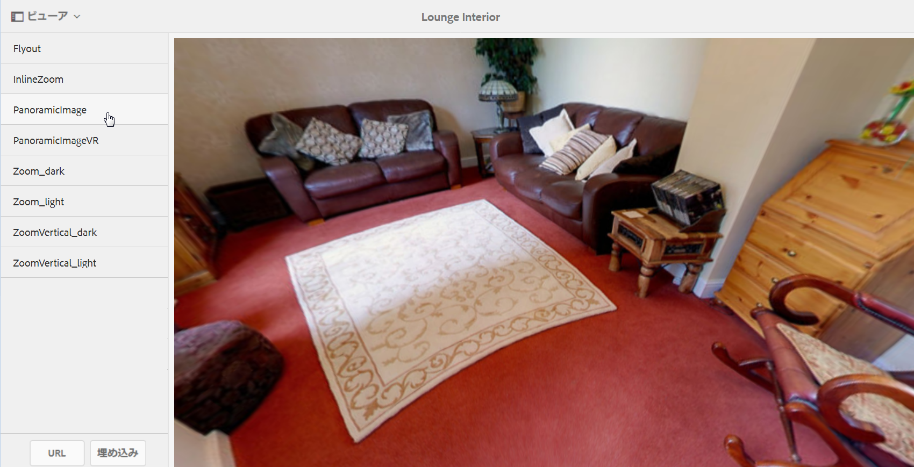

# パノラマ画像{#panoramic-images}

ここでは、パノラマ画像ビューアを使用して球パノラマ画像をレンダリングし、室内、物件、場所、風景などをあらゆる角度から見ることができる臨場感あふれる体験を提供する方法について説明します。

[ビューアプリセットの管理](/help/assets/dynamic-media/managing-viewer-presets.md)も参照してください。

## パノラマ画像ビューアで使用するアセットのアップロード {#uploading-assets-for-use-with-the-panoramic-image-viewer}

アップロードするアセットが、パノラマ画像ビューアで使用する球パノラマ画像として適格となるには、アセットが以下の一方または両方の条件を満たしている必要があります。

* 縦横比が 2 である必要があります。

<!--  You can override the default aspect ratio setting of 2 in CRXDE Lite at the following:
  `/conf/global/settings/cloudconfigs/dmscene7/jcr:content` -->
* キーワード `equirectangular`、または `spherical` と `panorama`、または `spherical` と `panoramic` でタグ付けされている必要があります。[タグの使用](/help/sites-cloud/authoring/features/tags.md)を参照してください。

縦横比とキーワードの両方の条件が、アセットの詳細ページと `Panoramic Media` WCM コンポーネントのパノラマアセットに適用されます。

パノラマ画像ビューアで使用するアセットをアップロードするには、[アセットのアップロード](/help/assets/manage-digital-assets.md#uploading-assets)を参照してください。

<!--  NEED TO CHECK IF DM CLASSIC PART OF SKYLINE 

## Configuring Dynamic Media Classic (Scene7) {#configuring-dynamic-media-classic-scene}

For the Panoramic Image viewer to work properly within AEM, you must synchronize the Panoramic Image viewer presets with Dynamic Media Classic (Scene7) and Dynamic Media Classic (Scene7)-specific metadata so the viewer presets get updated in the JCR. To accomplish this, configure Dynamic Media Classic (Scene7) in the following manner:

1. [Log into your instance of Dynamic Media Classic (Scene7)](https://www.adobe.com/marketing-cloud/experience-manager/scene7-login.html) for each company account.

1. Near the upper-right corner of the page, click **[!UICONTROL Setup > Application Setup > Publish Setup > Image Server]**.
1. On the Image Server Publish page, from the **[!UICONTROL Publish Context]** drop-down menu near the top, select **[!UICONTROL Image Serving]**.

1. On the same Image Server Publish page, locate the heading **[!UICONTROL Request Attributes]**.
1. Under the Request Attributes heading, locate **[!UICONTROL Reply Image Size Limit]**. Then, in the associated Width and Height fields, increase the maximum allowable image size for panoramic images.

   Dynamic Media Classic (Scene7) has a limit of 25,000,000 pixels. The maximum allowable size for images with a 2:1 aspect ratio is 7000 x 3500. However, for typical desktop screens, 4096 x 2048 pixels is sufficient.

   >[!NOTE]
   >
   >Only images that fall within the maximum allowable image size are supported. Requests for images that are above the size limit will result in a 403 response.

1. Under the Request Attributes heading, do the following:

    * Set Request Obfuscation Mode to **[!UICONTROL Disabled]**.
    * Set Request Locking Mode to **[!UICONTROL Disabled]**.

   These settings are necessary for using the `Panoramic Media` WCM component in AEM.

1. At the bottom of the Image Server Publish page, on the left side, click **[!UICONTROL Save]**.

1. In the lower-right corner, click **[!UICONTROL Close]**.

### Troubleshooting the Panoramic Media WCM component {#troubleshooting-the-panoramic-media-wcm-component}

If you dropped an image into the Panoramic Media component in your WCM and the component placeholder collapsed, you may want to troubleshoot the following:

* If you experience a 403 Forbidden error, it may have been caused by the requested image size being too large. Review the **[!UICONTROL Reply Image Size Limit]** settings in [Configuring Dynamic Media Classic (Scene7)](/help/assets/dynamic-media/panoramic-images.md#configuring%20dynamic%20media%20classic%20(scene7)).

* For an "Invalid lock" on the asset or "Parsing error" displayed on the page, check Request Obfuscation Mode and Request Locking Mode to ensure they are disabled.
* For a tainted canvas error, setup a Rule Set Definition File Path and Invalidate CTN for the previous requests for the image asset.
* If image quality becomes very low after an image request with sizing above the supported limit, check that the **[!UICONTROL JPEG Encoding Attributes > Quality]** setting is not empty. A typical setting for the **[!UICONTROL Quality]** field is `95`. You can find the setting on the Image Server Publish page. To access the page, see [Configuring Dynamic Media Classic (Scene7)](/help/assets/dynamic-media/panoramic-images.md#configuring%20dynamic%20media%20classic%20(scene7)).

-->

## パノラマ画像のプレビュー {#previewing-panoramic-images}

詳しくは、[アセットのプレビュー](/help/assets/dynamic-media/previewing-assets.md)を参照してください。

## パノラマ画像の公開  {#publishing-panoramic-images}

[アセットの公開](/help/assets/dynamic-media/publishing-dynamicmedia-assets.md)を参照してください。