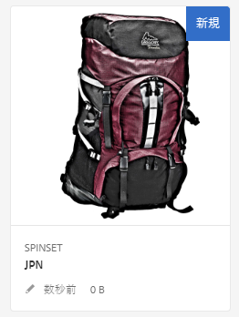
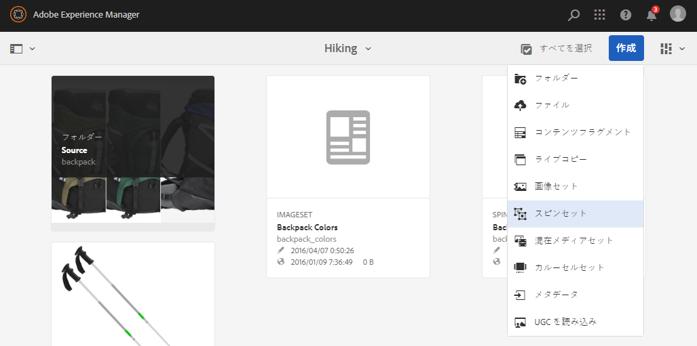
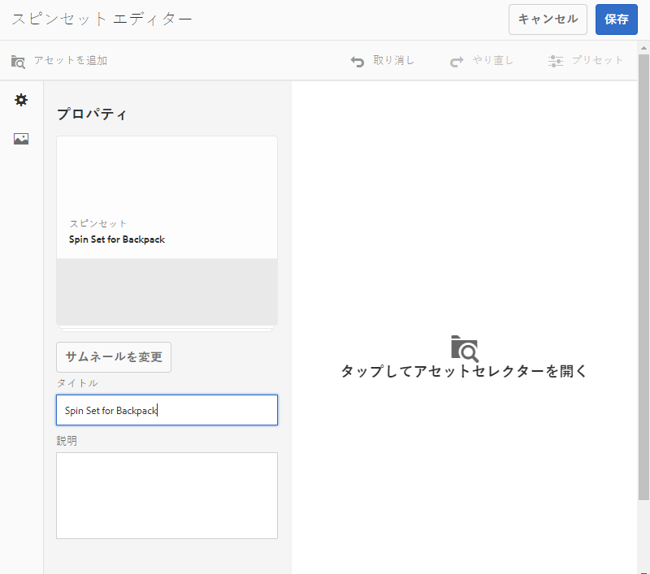
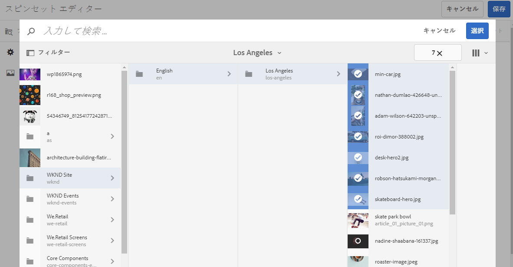
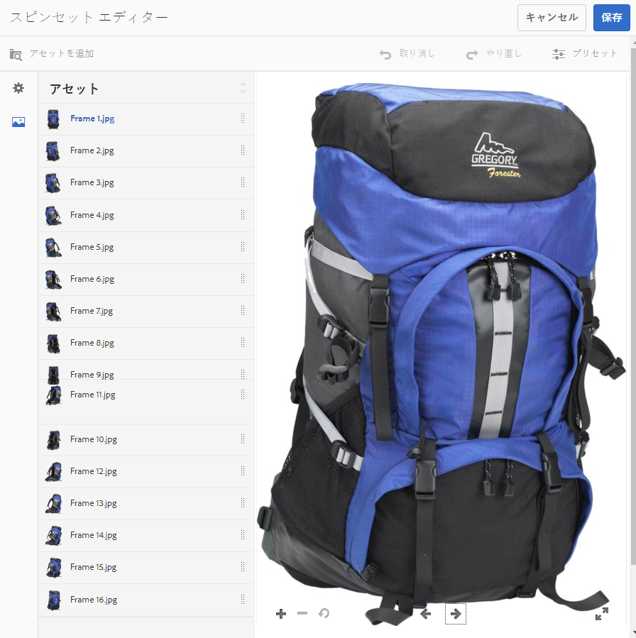
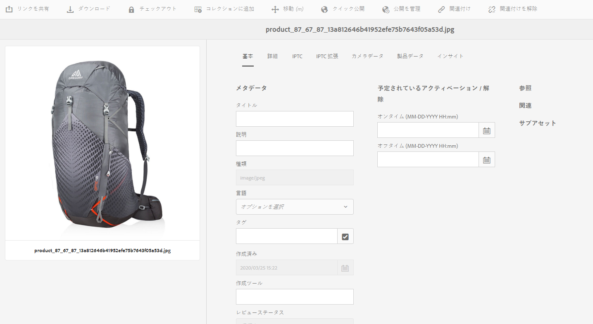
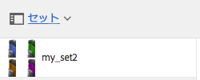
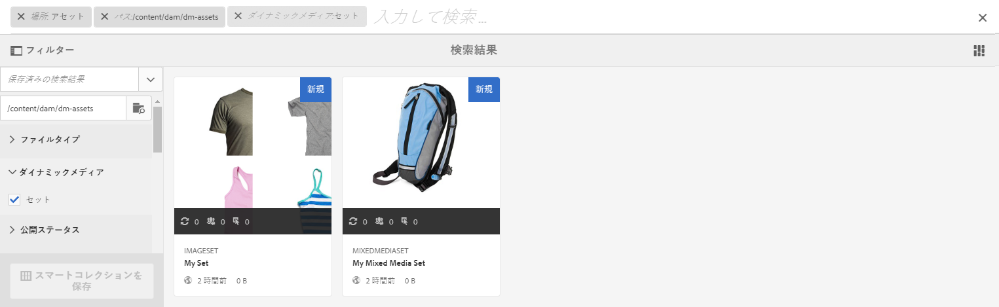

# スピンセット{#spin-sets}

スピンセットは、物体を回転させて調べるという実際の操作をシミュレートするものです。スピンセットを使用すると、あらゆる角度からアイテムを表示し、あらゆる角度から主要な視覚的詳細を確認することができます。

スピンセットは、360 度の閲覧エクスペリエンスをシミュレートします。Dynamic Media は、ビューアがアイテムを回転できる単一軸のスピンセットを提供します。さらに、ユーザーは「自由形式」のズームを実行し、マウスを数回クリックするだけで任意のビューをパンできます。このようにして、ユーザーは特定の視点からアイテムをより詳細に確認できます。

スピンセットのバナーには、「**[!UICONTROL SPINSET]**」と表示されます。また、スピンセットが公開されている場合、公開日が&#x200B;**[!UICONTROL 地球]**&#x200B;アイコン付きでバナーに表示され、最終変更日も&#x200B;**[!UICONTROL 鉛筆]**&#x200B;アイコン付きで表示されます。

>[!NOTE]
>
>アセットユーザーインターフェイスについて詳しくは、[タッチ UI を使用したアセットの管理](/help/assets/manage-digital-assets.md)を参照し、画像セットアセットがアップロードされる新しいフォルダーに適用します。

スピンセットを作成する場合、アドビでは次のベストプラクティスを推奨し、次の制限を適用します。

| 制限タイプ | ベストプラクティス | 適用される制限 |
| --- | --- | --- |
| 2D セットあたりの最大行数と最大列数 | 1 セットあたり 12～18 個の画像 | 1000 |

[Dynamic Media の制限](/help/assets/dynamic-media/limitations.md)も参照してください。

## クイックスタート：スピンセット {#quick-start-spin-sets}

スピンセットをすぐに使い始めるには、次の手順を実行します。

1. オプション. [バッチセットプリセットを作成](/help/assets/dynamic-media/batch-set-presets-dm.md)し、新しいアセットフォルダーに適用します。

   バッチセットプリセットを使用すると、スピンセットの作成を自動化できます。

   >[!IMPORTANT]
   >
   >バッチセットは、アセットの取り込みの一環として IPS（Image Production System）で作成されます。

1. [複数ビュー用の画像をアップロードします](#uploading-assets-for-spin-sets)。

   1 次元スピンセットを使用するには、少なくとも 8～12 枚の写真が必要です。2 次元スピンセットの場合は少なくとも 16～24 枚必要になります。アイテムが回転したり反転したりしているように見せるには、一定の間隔でアイテムを撮影する必要があります。例えば、1 次元スピンセットに 12 個の写真を含める場合、アイテムを 30 度ずつ（360/12）回転させながら写真を撮影します。

   スピンセットでサポートされている形式のリストについては、[Dynamic Media - サポートされているラスター画像形式](/help/assets/file-format-support.md#image-support-dynamic-media)を参照してください。

1. [スピンセットを作成します](#creating-spin-sets)。

   スピンセットを作成するには、 **[!UICONTROL 作成]**／**[!UICONTROL スピンセット]** を選択し、セットの名前を付け、アセットを選択し、画像の表示順を選択します。

   [セレクターの操作](/help/assets/dynamic-media/working-with-selectors.md)を参照してください。

1. 必要に応じて[スピンセットビューアプリセット](/help/assets/dynamic-media/managing-viewer-presets.md)を設定します。

   管理者は、スピンセットビューアプリセットを作成または編集できます。スピンセットを特定のビューアプリセットで表示するには、スピンセットを選択し、左パネルのドロップダウンメニューで「**ビューア**」を選択します。

   ビューアプリセットを作成または編集するには、 **[!UICONTROL ツール]**／**[!UICONTROL アセット]**／**[!UICONTROL ビューアプリセット]** を選択します。

   詳しくは、[ビューアプリセットの追加と編集](/help/assets/dynamic-media/managing-viewer-presets.md)を参照してください。

   バッチセットプリセットを使用して作成したセットを表示したり、それらのセットにアクセスしたりするには、3 つの方法があります（バッチセットプリセットを使用して作成したセットは、ユーザーインターフェイスに表示&#x200B;*されません*）。

1. [スピンセットをプレビューします](/help/assets/dynamic-media/previewing-assets.md)。

   スピンセットを選択すると、プレビューできます。スピンセットを回転させます。**[!UICONTROL ビューア]**&#x200B;メニューから様々なビューアを選択できます。このメニューは左パネルのドロップダウンメニューにあります。

1. [スピンセットを公開します](/help/assets/dynamic-media/publishing-dynamicmedia-assets.md)。

   スピンセットを公開すると、URL と埋め込み文字列がアクティベートされます。また、[ビューアプリセットを公開](/help/assets/dynamic-media/managing-viewer-presets.md)する必要があります。

1. [URL を Web アプリケーションにリンクする](/help/assets/dynamic-media/linking-urls-to-yourwebapplication.md)か、[ビデオビューアまたは画像ビューアを埋め込みます](/help/assets/dynamic-media/embed-code.md)。

   スピンセットの URL 呼び出しが作成され、スピンセットの公開後にそれらの URL 呼び出しがアクティベートされます。アセットをプレビューする際に、これらの URL をコピーできます。または、web サイトに埋め込むこともできます。

   スピンセットを選択し、左パネルのドロップダウンメニューで「**[!UICONTROL ビューア]**」を選択します。

   詳しくは、[Web ページへのスピンセットのリンク](/help/assets/dynamic-media/linking-urls-to-yourwebapplication.md)と[ビデオビューアまたは画像ビューアの埋め込み](/help/assets/dynamic-media/embed-code.md)を参照してください。

必要に応じて、[スピンセットを編集](#editing-spin-sets)できます。また、[スピンセットのプロパティ](/help/assets/manage-digital-assets.md#editing-properties)を表示および変更することもできます。

## スピンセット用のアセットのアップロード {#uploading-assets-for-spin-sets}

1 次元スピンセットを使用するには、少なくとも 8 ～ 12 枚の写真が必要です。アイテムが回転したり反転したりしているように見せるには、一定の間隔でアイテムを撮影する必要があります。例えば、1 次元スピンセットに 12 個の写真を含める場合、アイテムを 30 度ずつ（360/12）回転させながら写真を撮影します。

スピンセットでサポートされる形式のリストについては、 [Dynamic Media - サポートされているラスターイメージ形式](/help/assets/file-format-support.md#image-support-dynamic-media) を参照してください。

スピンセットの画像は、 [Experience Manager Assets で他のアセットをアップロード](/help/assets/manage-digital-assets.md) するのと同じようにアップロードできます。

### スピンセット用の画像のキャプチャに関するガイドライン {#guidelines-for-shooting-spin-set-images}

スピンセット画像に関するベストプラクティスを以下に示します。一般的に、スピンセット内の画像が多いほど、画像の回転効果が高くなります。ただし、セットに多くの画像を含めると、画像の読み込みに要する時間も長くなります。Experience Manager では、スピンセットで使用する画像の撮影について、次のガイドラインに従うことをお勧めします。

* 最低でも、1 次元スピンセットで 8～12 枚、2 次元スピンセットで 16～24 枚の画像を使用するようにします。360 度回転できるようにするには、少なくともで 8 枚の画像が必要になります。2 次元スピンセットの作成には多大な労力がかかるので、1 次元スピンセットのほうが一般的です。
* 可逆圧縮形式を使用します（TIFF および PNG をお勧めします）。
* すべての画像をマスクして、アイテムが純粋な白または他の高コントラストの背景に表示されるようにします。必要に応じて、シャドウを追加します。
* 製品の詳細に十分な照明があり、焦点が合っていることを確認します。
* マネキンやモデルを使って、ファッション衣料用のスピン画像を撮影します。多くの場合、ガラス製のマネキンを使用してマネキンをマスクするか、画像内に定型化されたマネキンを表示します。角度を定義することで、モデルによるスピンセットを作成できます。床にテープを貼って角度をマークし、モデルが撮影ごとに動いて向きを変える際の補助にします。

## スピンセットの作成 {#creating-spin-sets}

ここでは、スピンセットを作成する方法について説明します。

>[!NOTE]
>
>[バッチセットプリセット](/help/assets/dynamic-media/config-dm.md)を使用してスピンセットを自動的に作成することもできます。**重要：**&#x200B;バッチセットは、アセットの取り込みの一環として IPS（Image Production System）で作成されます。
>
>[Dynamic Media の設定](/help/assets/dynamic-media/config-dm.md)の「画像セットおよびスピンセットを自動生成するためのバッチセットプリセットの作成」を参照してください。

>[!NOTE]
>
>スピンセット内での画像の表示順は重要です。スピンがスムーズに 360 度のビューを描くように画像を並べ替えてください。

スピンセットを作成する場合、アドビでは次のベストプラクティスを推奨し、次の制限を適用します。

| 制限タイプ | ベストプラクティス | 適用される制限 |
| --- | --- | --- |
| 2D セットあたりの最大行数と最大列数 | 1 セットあたり 12～18 個の画像 | 1000 |

[Dynamic Media の制限](/help/assets/dynamic-media/limitations.md)も参照してください。

**スピンセットを作成するには：**

1. アセットで、スピンセットを作成する場所に移動し、「**[!UICONTROL 作成]**」を選択し、「**[!UICONTROL スピンセット]**」を選択します。アセットを格納しているフォルダー内からセットを作成することもできます。

   

1. スピンセットエディターの「**[!UICONTROL タイトル]**」フィールドにスピンセットの名前を入力します。この名前はスピンセットのバナーに表示されます。必要に応じて、説明を入力します。

   

   >[!NOTE]
   >
   >スピンセットを作成するときに、スピンセットのサムネールを変更したり、Experience Manager でスピンセット内のアセットに基づいてサムネールを自動的に選択したりすることができます。サムネールを選択するには、「**[!UICONTROL サムネールを変更]**」を選択し、画像を選択します（他のフォルダーに移動して画像を探すこともできます）。サムネールを選択した状態で、スピンセットからサムネールを自動的に生成する場合は、「**[!UICONTROL 自動サムネールに切り替え]**」を選択します。

1. 次のいずれかの操作を行います。

   * スピンセットエディターページの左上隅にある「**[!UICONTROL アセットを追加]**」を選択します。

   * スピンセットエディターページの中央付近にある「**[!UICONTROL 選択してアセットセレクターを開く]**」を選択します。

   スピンセットに含めるアセットを選択しします。選択済みのアセットにはチェックマークアイコンが付いています。作業が完了したら、ページの右上隅付近にある「**[!UICONTROL 選択]**」を選択します。

   アセットセレクターでは、キーワードを入力して **[!UICONTROL Enter]** キーをタップすることで、アセットを検索することができます。フィルターを適用して、検索結果を絞り込むこともできます。パス、コレクション、ファイルタイプおよびタグでフィルタリングできます。フィルターを選択してから、ツールバーの **[!UICONTROL フィルター]** アイコンを選択します。表示アイコンをタップし、**[!UICONTROL 列表示]**、**[!UICONTROL カード表示]**、**[!UICONTROL リスト表示]**&#x200B;のいずれかを選択してビューを変更します。

   [セレクターの操作](/help/assets/dynamic-media/working-with-selectors.md)を参照してください。

   

1. 画像セットに追加したアセットは、自動的に英数字順で追加されます。追加後に、手動でアセットの順番を変更したり、並べ替えたりすることができます。

   必要に応じて、アセットのファイル名の右にあるアセットの並べ替えアイコンをドラッグして、画像をセットリスト内で上下に並べ替えます。

   

   スピンセットのフレーム 11 を新しい位置にドラッグして並べ替えます。

1. （オプション）次のいずれかの操作を行います。

   * 画像を削除するには、画像を選択し、「**[!UICONTROL アセットを削除]**」を選択します。

   * ページの右上隅付近にプリセットを適用するには、「]**プリセット**[!UICONTROL 」を選択した後、すべてのアセットに一度に適用するプリセットを選択します。

1. 「**[!UICONTROL 保存]**」を選択します。作成したスピンセットが、作成先のフォルダーに表示されます。

## スピンセットの表示 {#viewing-spin-sets}

スピンセットは、ユーザーインターフェイスで作成することも、[バッチセットプリセット](/help/assets/dynamic-media/config-dm.md)を使用して自動的に作成することもできます。ただし、バッチセットプリセットを使用して作成したセットは、ユーザーインターフェイスに表示&#x200B;*されません*。バッチセットプリセットを使用して作成したセットには、3 つの方法でアクセスできます（これらの方法は、スピンセットをユーザーインターフェイスで作成した場合も使用できます）。

>[!NOTE]
>
>[スピンセットの編集](#editing-spin-sets)の説明に従って、ユーザーインターフェイスを使用してセットを表示することもできます。

**スピンセットを表示するには:**

1. 個々のアセットのプロパティを開く場合。プロパティは、選択したアセットがどのセットのメンバーであるかを示します（**[!UICONTROL セットのメンバー]**&#x200B;の下）。セット全体を表示するには、セットの名前を選択します。

   

1. 任意のセットのメンバー画像で、**[!UICONTROL セット]**&#x200B;メニューを選択して、アセットがメンバーとして含まれているセットを表示します。

   

1. 検索で、「**[!UICONTROL フィルター]**」を選択し、「**[!UICONTROL ダイナミックメディア]**」を展開して「**[!UICONTROL セット]**」を選択します。

   検索結果として、UI で手動で作成した一致するセットか、バッチセットプリセットを使用して自動的に作成した一致するセットが返されます。自動セットの場合、検索クエリは、Experience Manager での検索とは異なる「`Starts with`」検索条件を使用して実行されます。Experience Manager での検索は、「`Contains`」検索条件に基づいて実行されます。フィルターを「**[!UICONTROL セット]**」に設定するのが、自動セットを検索する唯一の方法です。

   

## スピンセットの編集 {#editing-spin-sets}

スピンセットには、次のような様々な編集タスクを実行できます。

* スピンセットへの画像の追加
* スピンセット内の画像の並べ替え
* スピンセットのアセットの削除
* ビューアプリセットを適用します。
* スピンセットを削除します。

**スピンセットを編集するには：**

1. 次のいずれかの操作を行います。

   * スピンセットアセット上にマウスポインターを置き、 **[!UICONTROL 編集]** （鉛筆アイコン）を選択します。
   * スピンセットアセット上にマウスポインターを置き、 **[!UICONTROL 選択]** （チェックマークアイコン）を選択した後、ツールバーの「**[!UICONTROL 編集]**」を選択します。

   * スピンセットアセットを選択してから、ツールバーの **[!UICONTROL 編集]** （鉛筆アイコン）を選択します。

1. スピンセットを編集するには、次のいずれかの操作を行います。

   * 画像を並べ替えるには、画像を新しい場所までドラッグします（並べ替えアイコンを選択してアイテムを移動します）。
   * 項目を昇順または降順に並べ替えるには、列の見出しを選択します。
   * アセットを追加するか既存のアセットを更新するには、「**[!UICONTROL アセットを追加]**」を選択します。アセットに移動して選択し、右上隅の「**[!UICONTROL 選択]**」を選択します。Experience Manager でサムネール用に使用されている画像を別の画像に置き換えて削除しても、元のアセットは表示されたままになります。
   * アセットを削除するには、アセットを選択して、「**[!UICONTROL アセットを削除]**」を選択します。
   * プリセットを適用するには、「プリセット」アイコンを選択し、プリセットを選択します。
   * スピンセット全体を削除するには、スピンセットに移動して選択し、「**[!UICONTROL 削除]**」を選択します

   >[!NOTE]
   >
   >スピンセットの画像を編集するには、スピンセットに移動し、左パネルの「**[!UICONTROL メンバーを設定]**」を選択してから、個々のアセットの鉛筆アイコンを選択して編集ウィンドウを開きます。

1. 編集が完了したら、「**[!UICONTROL 保存]**」を選択します。

## スピンセットのプレビュー {#previewing-spin-sets}

[アセットのプレビュー](/help/assets/dynamic-media/previewing-assets.md)を参照してください。

## スピンセットの公開 {#publishing-spin-sets}

[アセットの公開](/help/assets/dynamic-media/publishing-dynamicmedia-assets.md)を参照してください。
