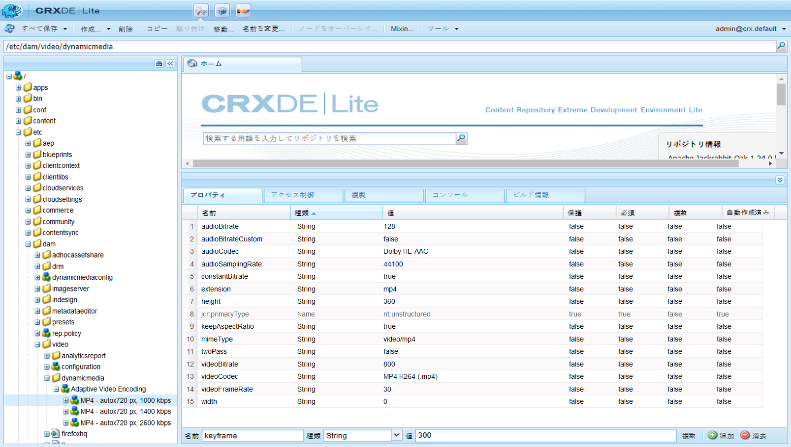
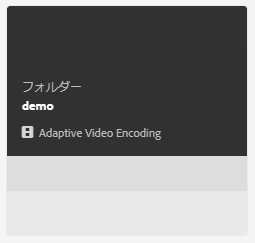
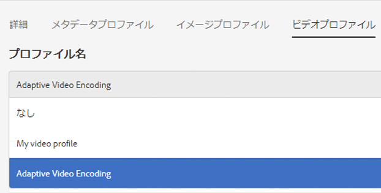
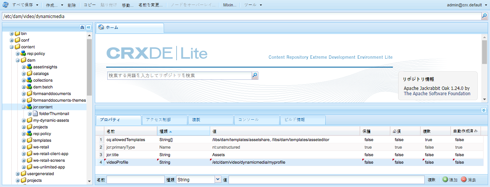

# Dynamic Media のビデオプロファイル{#video-profiles}

Dynamic Media には、事前定義済みのアダプティブビデオエンコーディングプロファイルが最初から付属しています。この標準提供プロファイルの設定は、ユーザーができる限り最高の閲覧エクスペリエンスを得られるように最適化されています。アダプティブビデオエンコーディングプロファイルを使用してプライマリソースビデオをエンコーディングすると、再生中、ビデオプレーヤーは顧客のインターネット接続速度に応じて、ビデオストリームの品質を自動的に調整します。これがアダプティブストリーミングと呼ばれるものです。

ビデオの品質を決めるその他の要因には、次のようなものがあります。

* **アップロードされたプライマリソースビデオの解像度**

   MP4 ビデオが 240p、360p などの低い解像度で録画された場合、高画質でストリーミングすることはできません。

* **ビデオプレーヤーのサイズ**

   デフォルトでは、アダプティブビデオエンコーディングプロファイルの「幅」は「自動」に設定されています。再生中は、プレーヤーのサイズに応じた最適な品質が使用されます。

[ビデオエンコーディングのベストプラクティス](/help/assets/dynamic-media/video.md#best-practices-for-encoding-videos)を参照してください。

[処理プロファイルを使用するためのデジタルアセットの編成のベストプラクティス](/help/assets/dynamic-media/best-practices-for-file-management.md)を参照してください。

>[!NOTE]
>
>ビデオのメタデータと関連するビデオ画像サムネールを生成するためには、ビデオ自体に対して Dynamic Media のエンコーディングプロセスを実行する必要があります。AEM では、Dynamic Media を有効にしていて、ビデオ Cloud Services を設定している場合は、**[!UICONTROL Dynamic Media エンコーディングビデオ]**&#x200B;ワークフローによってビデオがエンコードされます。このワークフローは、ワークフローの処理履歴とエラー情報を取り込みます。詳しくは、[ビデオエンコーディングと YouTube への公開の進行状況の監視](/help/assets/dynamic-media/video.md#monitoring-video-encoding-and-youtube-publishing-progress)を参照してください。Dynamic Media を有効にし、ビデオクラウドサービスを設定済みの場合、ビデオをアップロードすると、**[!UICONTROL Dynamic Media エンコードビデオ]**&#x200B;ワークフローが自動的に有効になります（Dynamic Media を使用していない場合は、**[!UICONTROL DAM アセットの更新]**&#x200B;ワークフローが有効になります）。
>
>メタデータは、アセットの検索時に役に立ちます。サムネールは、エンコーディング中に生成される静的なビデオ画像です。サムネールは AEM システムによって必要とされ、ユーザーインターフェイス内のカード表示、検索結果表示およびアセットのリスト表示でビデオを視覚的に識別するために使用されます。エンコードされたビデオのレンディションアイコン（絵画用パレット）をタップすれば、生成されたサムネールを確認できます。

ビデオプロファイルの作成が完了したら、フォルダまたは複数のフォルダにビデオフォルダを適用します。 See [Applying a Video Profile to folders.](#applying-a-video-profile-to-folders)

他のアセットタイプへの高度な処理パラメーターの定義については、[アセット処理の設定](/help/assets/dynamic-media/config-dm.md#configuring-asset-processing)を参照してください。

[メタデータ、画像およびビデオを処理するためのプロファイル](/help/assets/dynamic-media/about-image-video-profiles.md)も参照してください。

## アダプティブビデオエンコーディングプリセット {#adaptive-video-encoding-presets}

次の表に、モバイルデバイス、タブレットデバイスおよびデスクトップコンピューターへのアダプティブビデオストリーミングにおけるベストプラクティスとなるエンコーディングプロファイルを示します。これらのプリセットは、任意の縦横比のビデオで使用できます。

<table>
 <tbody>
  <tr>
   <td><strong>ビデオ形式のコーデック</strong></td>
   <td><strong>ビデオサイズ - 幅（px）</strong></td>
   <td><strong>ビデオサイズ - 高さ（px）</strong></td>
   <td><strong>縦横比を保持しますか？</strong></td>
   <td><strong>ビデオビットレート（Kbps）</strong></td>
   <td><strong>ビデオフレームレート（fps）</strong></td>
   <td><strong>オーディオコーデック</strong></td>
   <td><strong>オーディオビットレート（Kbps）</strong></td>
  </tr>
  <tr>
   <td>
MP4 H.264（mp4）
 </td>
   <td>auto</td>
   <td>360</td>
   <td>はい</td>
   <td>730</td>
   <td>30</td>
   <td>Dolby HE-AAC</td>
   <td>128</td>
  </tr>
  <tr>
   <td>
MP4 H.264（mp4）
 </td>
   <td>auto</td>
   <td>540</td>
   <td>はい</td>
   <td>2,000  </td>
   <td>30</td>
   <td>Dolby HE-AAC</td>
   <td>128</td>
  </tr>
  <tr>
   <td>
MP4 H.264（mp4）
 </td>
   <td>auto</td>
   <td>720  </td>
   <td>はい</td>
   <td>3000  </td>
   <td>30</td>
   <td>Dolby HE-AAC</td>
   <td>128</td>
  </tr>
 </tbody>
</table>

## About using smart crop in Video Profiles {#about-smart-crop-video}

ビデオのスマート切り抜き（ビデオプロファイルで使用できるオプション機能）は、Adobe Sensei の人工知能機能を使用して、サイズに関係なく、アップロードしたアダプティブビデオやプログレッシブビデオの重要な部分を自動的に検出して切り抜くツールです。

スマート切り抜きでサポートされているビデオ形式には、MP4、MKV、MOV、AVI、FLV、WMV などがあります。

スマート切り抜きでサポートされるビデオファイルの最大サイズは、次の条件になります。

* 再生時間が 5 分間。
* 30 フレーム/秒（fps）。
* ファイルサイズが 300 MB。

現在、Adobe Sensei は 9,000 フレームに制限されていることに注意してください。つまり、30 fps で 5 分間です。ビデオの fps が高いと、サポートされるビデオの最大再生時間が短くなります。例えば、60 fps のビデオが、Adobe Sensei とスマート切り抜きでサポートされるには、2 分半の長さにする必要があります。

>[!IMPORTANT]
>
>ビデオスマート切り抜きを機能させるには、ビデオプロファイルに1つ以上のビデオエンコーディングプリセットを含める必要があります。

ビデオのスマート切り抜きを使用するには、アダプティブビデオエンコーディングプロファイルまたはプログレッシブビデオエンコーディングプロファイルを作成します。プロファイルの一部として、**[!UICONTROL スマート切り抜き率]**&#x200B;ツールを使用して、事前定義済みの縦横比を選択します。例えば、ビデオエンコーディングプリセットを定義した後、縦横比が 16 x 9 の「モバイル横置き」定義と、縦横比が 9 x 16 の「モバイル縦置き」定義を追加できます。他に、1 x 1、4 x 3、4 x 5 の縦横比つまり切り抜き率も選択できます。

Note that you can toggle video smart crop in the Video Profile to either on or off using the slider to the far right of **[!UICONTROL Smart Crop Ratio]** in the user interface.

ビデオプロファイルを作成して保存した後、目的のフォルダに適用できます。

See [Applying Video Profiles to specific folders](#applying-video-profiles-to-specific-folders) or [Applying a Video Profile globally](#applying-a-video-profile-globally).

[画像のスマート切り抜き](image-profiles.md)も参照してください。

## Creating a Video Profile for adaptive streaming {#creating-a-video-encoding-profile-for-adaptive-streaming}

Dynamic Media には、最高の閲覧エクスペリエンスを実現できるよう最適化された、事前定義済みのアダプティブビデオエンコーディングプロファイル（MP4 H.264 向けのビデオアップロード設定のグループ）が付属しています。ビデオのアップロード時にこのプロファイルを使用できます。

この事前定義済みプロファイルがニーズに合わない場合は、独自のアダプティブビデオエンコーディングプロファイルを作成することもできます。「**[!UICONTROL アダプティブストリーミング用にエンコーディング]**」という設定をベストプラクティスとして使用すると、プロファイルに追加されるすべてのエンコーディングプリセットが検証され、すべてのビデオが同じ縦横比であることが確認されます。さらに、エンコーディングされたビデオは、ストリーミング向けの複数ビットレート設定として扱われます。

ビデオエンコーディングプロファイルの作成時に、ユーザー補助の目的で、ほとんどのエンコーディングオプションに対して推奨されるデフォルト設定があらかじめ入力されます。ただし、推奨されるデフォルト値以外の値を選択する場合は、再生中にビデオ品質が低下したり、その他のパフォーマンス問題が発生したりする可能性があることに注意してください。

プロファイル内のすべての MP4 H.264 ビデオエンコーディングプリセットで、次の値について、プロファイル内の個々のエンコーディングプリセットで同じ値が使用され、アダプティブストリーミングを実行できることが検証されます。

* ビデオ形式のコーデック - MP4 H.264（.mp4）
* オーディオコーデック
* オーディオビットレート
* 縦横比を保持
* 2 パスエンコーディング
* 固定ビットレート
* H264 プロファイル
* オーディオのサンプリングレート

値が異なる場合も、プロファイルの作成をそのまま続行できますが、アダプティブストリーミングは実行できなくなることに注意してください。ユーザーには単一ビットレートのストリーミングが示されます。プロファイル内の個々のエンコーディングプリセットで同じ値を使用するようにエンコーディング設定を編集することをお勧めします(「アダプティブストリーミング用にエンコード」が有効になっている場合、ビデオプロファイル/プリセットエディターでアダプティブビデオエンコーディング設定のパリティが強制される必要があります)。

[プログレッシブストリーミング用のビデオエンコーディングプロファイルの作成](#creating-a-video-encoding-profile-for-progressive-streaming)も参照してください。

[ビデオエンコーディングのベストプラクティス](/help/assets/dynamic-media/video.md#best-practices-for-encoding-videos)も参照してください。

他のアセットタイプへの高度な処理パラメーターの定義については、[アセット処理の設定](/help/assets/dynamic-media/config-dm.md#configuring-asset-processing)を参照してください。

**アダプティブストリーミング用のビデオプロファイルを作成するには**、

1. AEM のロゴをタップし、**[!UICONTROL ツール]**／**[!UICONTROL Assets]**／**[!UICONTROL ビデオプロファイル]**&#x200B;に移動します。
1. Click or tap **[!UICONTROL Create]** to add a new Video Profile.

1. プロファイルの名前と説明を入力します。
1. ビデオエンコーディングプリセットを作成ページまたはビデオエンコーディングプリセットを編集ページで、「**[!UICONTROL ビデオエンコーディングプリセットを追加]**」をタップします。
1. 「**[!UICONTROL 基本]**」タブで、ビデオとオーディオのオプションを設定します。各オプションの横にある情報アイコンをタップすると、追加の説明や、選択したビデオ形式のコーデックに応じた推奨設定が表示されます。
1. 「ビデオサイズ」ヘッダーの下で、「**[!UICONTROL 縦横比を保持]**」チェックボックスがオンになっていることを確認します。
1. ビデオフレームサイズの解像度をピクセル単位で設定します。**[!UICONTROL auto]** 値を使用すると、ソースの縦横比（幅と高さの比率）に合わせて自動的に拡大／縮小されます。例えば、「auto x 480」や「640 x auto」のようになります。

1. 次のいずれかの操作をおこないます。

   * 「**[!UICONTROL 幅]**」フィールドに「**[!UICONTROL auto]**」と入力します。「**[!UICONTROL 高さ]**」フィールドに値をピクセル単位で入力します。

   * ビデオのサイズを目で確認できるようにするには、「**[!UICONTROL 高さ]**」の右にある情報アイコン（「i」）をタップして、サイズ計算ツールページを開きます。**[!UICONTROL サイズ計算ツール]**&#x200B;を使用して、必要なビデオサイズ（青のボックスで表示）を設定します。完了したら、右上隅の「**[!UICONTROL X]**」をタップします。

1. （オプション）「**[!UICONTROL 詳細]**」タブをタップし、「**[!UICONTROL デフォルト値を使用]**」チェックボックスがオンになっている（推奨）ことを確認します。または、ビデオおよびオーディオの詳細設定を変更します。
1. ページの右上隅の「**[!UICONTROL 保存]**」をタップして、プリセットを保存します。
1. 次のいずれかの操作をおこないます。
   * 手順 4～10 を繰り返して、その他のエンコーディングプリセットを作成します（アダプティブビデオストリーミングの場合は、複数のビデオプリセットが必要です）。
   * 続行して次の手順に進みます。

1. （オプション）このプロファイルを適用するビデオにビデオスマート切り抜きを追加するには、以下をおこないます。
   * ビデオプロファイルを編集ページで、「スマート切り抜き率」の見出しの右側にある「**[!UICONTROL 新規追加]**」をタップします。
   * 切り抜き率を容易に識別できるように、切り抜き率の名前を「名前」フィールドに入力します。
   * 「**[!UICONTROL 切り抜き率]**」ドロップダウンリストで、使用する比率を選択します。

1. 次のいずれかの操作をおこないます。

   * 必要に応じて、新しい切り抜き率の追加を続けます。
   * 続行して次の手順に進みます。

1. ページの右上隅の「**[!UICONTROL 保存]**」をもう一度タップして、プロファイルを保存します。

これで、ビデオを含んだフォルダーにプロファイルを適用できるようになりました。See [Applying a Video Profile to folders](#applying-a-video-profile-to-folders) or [Applying a Video Profile globally](#applying-a-video-profile-globally).

## Creating a Video Profile for progressive streaming {#creating-a-video-encoding-profile-for-progressive-streaming}

「**[!UICONTROL アダプティブストリーミング用にエンコーディング]**」オプションを使用しない場合は、プロファイルに追加されるすべてのエンコーディングプリセットが、単一ビットレートのストリーミングまたはプログレッシブビデオ配信用の個々のビデオレンディションとして扱われることに注意してください。また、すべてのビデオレンディションが同じ縦横比であることを確認するための検証は実行されません。

サポートされるビデオ形式のコーデックは H.264（.mp4）および WebM です。

[アダプティブストリーミング用のビデオエンコーディングプロファイルの作成](#creating-a-video-encoding-profile-for-adaptive-streaming)も参照してください。

[ビデオエンコーディングのベストプラクティス](/help/assets/dynamic-media/video.md#best-practices-for-encoding-videos)も参照してください。

他のアセットタイプへの高度な処理パラメーターの定義については、[アセット処理の設定](/help/assets/dynamic-media/config-dm.md#configuring-asset-processing)を参照してください。

**プログレッシブストリーミング用のビデオプロファイルを作成するには：**

1. AEM のロゴをタップし、**[!UICONTROL ツール]**／**[!UICONTROL Assets]**／**[!UICONTROL ビデオプロファイル]**&#x200B;に移動します。
1. Tap **[!UICONTROL Create]** to add a new Video Profile.
1. プロファイルの名前と説明を入力します。
1. ビデオエンコーディングプリセットを作成ページまたはビデオエンコーディングプリセットを編集ページで、「**[!UICONTROL ビデオエンコーディングプリセットを追加]**」をタップします。
1. 「**[!UICONTROL 基本]**」タブで、ビデオとオーディオのオプションを設定します。各オプションの横にある情報アイコンをタップすると、追加の説明や、選択したビデオ形式のコーデックに応じた推奨設定が表示されます。
1. （オプション）「ビデオサイズ」ヘッダーの下で、「**[!UICONTROL 縦横比を保持]**」チェックボックスをオフにします。
1. 以下の操作を実行してください。
   * 「**[!UICONTROL 幅]**」フィールドに「**[!UICONTROL auto]**」と入力します。
   * 「**[!UICONTROL 高さ]**」フィールドに値をピクセル単位で入力します。ビデオのサイズを目で確認できるようにするには、「高さ」の情報アイコンをタップして、**[!UICONTROL サイズ計算ツール]**&#x200B;ページを開きます。**[!UICONTROL サイズ計算ツール]**&#x200B;ページを使用して、必要なビデオのサイズ（青いボックス）を設定します。完了したら、ダイアログボックスの右上隅にある「**[!UICONTROL X]**」をタップします。
1. （オプション）次のいずれかの操作をおこないます。

   * 「**[!UICONTROL 詳細]**」タブをタップし、「**[!UICONTROL デフォルト値を使用]**」チェックボックスがオンになっている（推奨）ことを確認します。

   * 「**[!UICONTROL デフォルト値を使用]**」チェックボックスをオフにして、必要なビデオ設定とオーディオ設定を指定します。各オプションの横にある情報アイコンをタップすると、追加の説明や、選択したビデオ形式のコーデックに応じた推奨設定が表示されます。

1. ページの右上隅の「**[!UICONTROL 保存]**」をタップして、プリセットを保存します。
1. 次のいずれかの操作をおこないます。

   * 手順 4～9 を繰り返して、その他のエンコーディングプリセットを作成します。
   * 続行して次の手順に進みます。

1. （オプション）このプロファイルを適用するビデオにビデオスマート切り抜きを追加するには、以下をおこないます。

   * ビデオプロファイルを編集ページで、「スマート切り抜き率」の見出しの右側にある「**[!UICONTROL 新規追加]**」をタップします。
   * 切り抜き率を容易に識別できるように、切り抜き率の名前を「名前」フィールドに入力します。
   * 「**[!UICONTROL 切り抜き率]**」ドロップダウンリストで、使用する比率を選択します。

1. 次のいずれかの操作をおこないます。

   * 必要に応じて、新しい切り抜き率の追加を続けます。
   * 続行して次の手順に進みます。

1. ページの右上隅の「**[!UICONTROL 保存]**」をタップして、プロファイルを保存します。

これで、ビデオを含んだフォルダーにプロファイルを適用できるようになりました。See [Applying a Video Profile to folders](#applying-a-video-profile-to-folders) or [Applying a Video Profile globally](#applying-a-video-profile-globally).

## カスタムで追加するビデオエンコーディングパラメーターの使用 {#using-custom-added-video-encoding-parameters}

AEM でビデオプロファイルを作成または編集する際にはユーザーインターフェイスに表示されない、高度なビデオエンコーディングパラメーターを利用して、既存のビデオエンコーディングプロファイルを編集できます。既存のプロファイルに、minBitrate や maxBitrate などの 1 つ以上の高度なパラメーターをカスタムで追加できます。

**カスタムで追加するビデオエンコーディングパラメーターを使用するには**：

1. AEM のロゴをタップして、**[!UICONTROL ツール]**／**[!UICONTROL 一般]**／**[!UICONTROL CRXDE Lite]** に移動します。
1. CRXDE Lite ページの左側にあるエクスプローラーパネルで、以下の場所に移動します。

   `/conf/global/settings/dam/dm/presets/video/*name_of_video_encoding_profile_to_edit`

1. ページの右下にあるパネルの「プロパティ」タブで、使用するパラメーターの「**[!UICONTROL 名前]**」、「**[!UICONTROL タイプ]**」および「**[!UICONTROL 値]**」を指定します。

   以下の高度なパラメーターを使用できます。

<table>
 <tbody>
  <tr>
   <td><strong>名前</strong></td>
   <td><strong>説明</strong>  </td>
   <td><strong>タイプ</strong>  </td>
   <td><strong>値</strong></td>
  </tr>
  <tr>
   <td><code>h264Level</code></td>
   <td>エンコーディングに使用する H.264 レベル。通常、この値は、使用しているエンコーディング設定に基づいて自動的に決定されます。</td>
   <td><code>String</code></td>
   <td>
H.264 レベルの 10 倍の数値
 
（例えば、3.0 の場合は 30、1.3 の場合は 13 のように指定します）
 
デフォルト値はありません。
 </td>
  </tr>
  <tr>
   <td><code>keyframe</code></td>
   <td>キーフレーム間のターゲットフレーム数。2～10 秒ごとにキーフレームが生成されるようにこの値を計算します。例えば、1 秒あたり 30 フレームの場合、キーフレーム間隔は 60～300 にします。  キーフレーム間隔を短くすると、アダプティブビデオエンコーディングでストリームのシークと切り替えの動作が向上し、動きの多いビデオの画質も向上します。ただし、キーフレームが増えるとファイルのサイズも増えるので、通常、キーフレーム間隔を短くすると、特定のビットレートでの全体的なビデオの画質は低下します。</td>
   <td><code>String</code></td>
   <td>
正の数。
 
初期設定は 300 です。
 
HLS（HTTP ライブストリーミング）の推奨値は 60～90 です。
 </td>
  </tr>
  <tr>
   <td><code>minBitrate</code></td>
   <td>
可変ビットレートエンコーディングに可能な最小ビットレート（Kbps）。
 
このパラメーターは、ビデオエンコーディングプロファイルを作成または編集するときに「詳細」タブで「<strong>固定ビットレートを使用</strong>」の選択をオフにした場合にのみ適用されます。
 
<a href="/help/assets/dynamic-media/video.md#bitrate">ビットレート</a>も参照してください。
 </td>
   <td><code>String</code></td>
   <td>
正の数（Kbps）。
 
デフォルト値はありません。
 </td>
  </tr>
  <tr>
   <td><code>maxBitrate</code></td>
   <td>
可変ビットレートエンコーディングに可能な最大ビットレート（Kbps）。
 
このパラメーターは、ビデオエンコーディングプロファイルを作成または編集するときに「詳細」タブで「<strong>固定ビットレートを使用</strong>」の選択をオフにした場合にのみ適用されます。
 
<a href="/help/assets/dynamic-media/video.md#bitrate">ビットレート</a>も参照してください。
 </td>
   <td><code>String</code></td>
   <td>
正の数（Kbps）。
 
デフォルト値はありません。ただし、推奨値は、エンコーディングのビットレートの最大 2 倍です。
 </td>
  </tr>
  <tr>
   <td><code>audioBitrateCustom</code></td>
   <td>オーディオコーデックでサポートされている場合、オーディオストリームに固定ビットレートを強制的に適用するには、値を <code>true</code> に設定します。</td>
   <td><code>String</code></td>
   <td>
<code>true</code>／<code>false</code>
 
デフォルトは <code>false</code> です。
 
HLS（HTTP ライブストリーミング）の推奨値は <code>false</code> です。
 
 
 </td>
  </tr>
 </tbody>
</table>

1. ページの右下隅付近にある「**[!UICONTROL 追加]**」をタップします。
1. 次のいずれかの操作をおこないます。

   * 手順 3 および 4 を繰り返して、ビデオエンコーディングプロファイルに別のパラメーターを追加します。
   * ページの左上隅付近にある「**[!UICONTROL すべて保存]**」をタップします。

1. CRXDE Lite ページの左上隅にある「**[!UICONTROL ホームに戻る]**」アイコンをタップして、AEM に戻ります。

### Editing a Video Profile {#editing-a-video-encoding-profile}

作成したビデオプロファイルを編集して、そのプロファイル内のビデオプリセットを追加、編集または削除できます。

デフォルトでは、Dynamic Media に付属している定義済みの既製&#x200B;**[!UICONTROL アダプティブビデオエンコーディング]**&#x200B;プロファイルを編集することはできません。代わりに、プロファイルを手軽にコピーし、新しい名前で保存することができます。その後、コピーしたプロファイルで目的のプリセットを編集できます。

[ビデオエンコーディングのベストプラクティス](/help/assets/dynamic-media/video.md#best-practices-for-encoding-videos)も参照してください。

他のアセットタイプへの高度な処理パラメーターの定義については、[アセット処理の設定](/help/assets/dynamic-media/config-dm.md#configuring-asset-processing)を参照してください。

**ビデオプロファイルを編集するには**:

1. AEM のロゴをタップし、**[!UICONTROL ツール]**／**[!UICONTROL Assets]**／**[!UICONTROL ビデオプロファイル]**&#x200B;に移動します。
1. ビデオプロファイルページで、1つのビデオプロファイル名をチェックします。
1. ツールバーの「**[!UICONTROL 編集]**」をタップします。
1. ビデオエンコーディングプロファイルページで、必要に応じて名前と説明を編集します。
1. ベストプラクティスとしては、「**[!UICONTROL アダプティブストリーミング用にエンコーディング]**」チェックボックスは必ずオンにします。アダプティブストリーミングの説明を参照するには、情報アイコンをタップします(プログレッシブビデオプロファイルを編集する場合は、このチェックボックスを選択しないでください)。
1. 「ビデオエンコーディングプリセット」ヘッダーの下で、プロファイルを構成するビデオエンコーディングプリセットを追加、編集または削除します。

   「**[!UICONTROL 基本]**」タブと「**[!UICONTROL 詳細]**」タブの各オプションの横にある情報アイコンをタップすると、追加の説明や、選択したビデオ形式のコーデックに応じた推奨設定が表示されます。

1. ページの右上隅にある「**[!UICONTROL 保存]**」をタップします。

### Copying a Video Profile {#copying-a-video-encoding-profile}

1. AEM のロゴをタップし、**[!UICONTROL ツール]**／**[!UICONTROL Assets]**／**[!UICONTROL ビデオプロファイル]**&#x200B;に移動します。
1. ビデオプロファイルページで、1つのビデオプロファイル名をチェックします。
1. ツールバーの「**[!UICONTROL コピー]**」をタップします。
1. ビデオエンコーディングプロファイルページで、プロファイルの新しい名前を入力します。
1. ベストプラクティスとしては、「**[!UICONTROL アダプティブストリーミング用にエンコーディング]**」チェックボックスは必ずオンにします。アダプティブストリーミングの説明を参照するには、情報アイコンをタップします(プログレッシブビデオプロファイルをコピーする場合は、このチェックボックスをオンにしないでください)。

   In Dynamic Media - Hybrid mode, if a WebM video preset is part of the Video Profile, then **[!UICONTROL Encode for adaptive streaming]** is not possible because all presets must be MP4.
1. 「ビデオエンコーディングプリセット」ヘッダーの下で、プロファイルを構成するビデオエンコーディングプリセットを追加、編集または削除します。

   「基本」タブと「詳細」タブの各オプションの横にある情報アイコンをタップすると、推奨設定と説明が表示されます。

1. ページの右上隅にある「**[!UICONTROL 保存]**」をタップします。

### Deleting a Video Profile {#deleting-a-video-encoding-profile}

1. AEM のロゴをタップし、**[!UICONTROL ツール]**／**[!UICONTROL Assets]**／**[!UICONTROL ビデオプロファイル]**&#x200B;に移動します。
1. ビデオプロファイルページで、1つ以上のビデオプロファイル名を確認します。
1. ツールバーの「**[!UICONTROL 削除]**」をタップします。
1. 「**[!UICONTROL OK]**」をタップします。

## Applying a Video Profile to folders {#applying-a-video-profile-to-folders}

ビデオプロファイルをフォルダに割り当てると、サブフォルダは自動的にそのプロファイルを親フォルダから継承します。 つまり、1つのフォルダに割り当てるビデオプロファイルは1つだけです。 アセットのアップロード、保存、使用およびアーカイブを行う場所のフォルダ構造は慎重に検討してください。

フォルダに別のビデオプロファイルを割り当てた場合、新しいプロファイルが以前のプロファイルよりも優先されます。 以前に存在したフォルダーアセットは変更されません。 新しいプロファイルは、後でフォルダーに追加されるアセットに適用されます。

プロファイルが割り当てられているフォルダーは、ユーザーインターフェイスでカード名にプロファイルの名前が表示されます。

ビデオプロファイルは、特定のフォルダーに適用することも、すべてのアセットにグローバルに適用することもできます。

後で変更した既存のビデオプロファイルが既に存在するフォルダー内のアセットを再処理できます。 詳しくは、[フォルダー内のアセットの再処理](/help/assets/dynamic-media/about-image-video-profiles.md#reprocessing-assets)を参照してください。

### Applying a Video Profile to specific folders {#applying-video-profiles-to-specific-folders}

You can apply a Video Profile to a folder from within the **[!UICONTROL Tools]** menu or if you are in the folder, from the **[!UICONTROL Properties]**. この節では、ビデオプロファイルをフォルダに両方の方法で適用する方法について説明します。

既にプロファイルが割り当てられているフォルダーには、フォルダー名のすぐ下にプロファイルの名前が表示されます。

[処理プロファイルを編集した後のフォルダー内のアセットの再処理](/help/assets/dynamic-media/about-image-video-profiles.md#reprocessing-assets)も参照してください。

#### Applying a Video Profile to folders by way of the Profiles user interface {#applying-video-profiles-to-folders-by-way-of-the-profiles-user-interface}

1. AEM のロゴをタップし、**[!UICONTROL ツール]**／**[!UICONTROL Assets]**／**[!UICONTROL ビデオプロファイル]**&#x200B;に移動します。
1. 1つまたは複数のフォルダに適用するビデオプロファイルを選択します。
1. 「**[!UICONTROL プロファイルをフォルダーに適用]**」をタップし、新たにアップロードされたアセットを受け取る 1 つまたは複数のフォルダーを選択して、「**[!UICONTROL 適用]**」をタップします。**[!UICONTROL カード表示]**&#x200B;の場合、既にプロファイルが割り当てられているフォルダーには、フォルダー名のすぐ下にプロファイルの名前が表示されます。You can [monitor the progress of a Video Profile processing job](#monitoring-the-progress-of-an-encoding-job).

#### Applying a Video Profile to folders from Properties {#applying-video-profiles-to-folders-from-properties}

1. Tap or click the AEM logo and navigate to **[!UICONTROL Assets]** and then to the folder that you want to apply a Video Profile to.
1. チェックマークをタップして対象のフォルダーを選択し、「**[!UICONTROL プロパティ]**」をタップします。
1. 「**[!UICONTROL ビデオプロファイル]**」タブを選択し、ドロップダウンメニューからプロファイルを選択して、「**[!UICONTROL 保存して閉じる]**」をクリックします。既にプロファイルが割り当てられているフォルダーには、フォルダー名のすぐ下にプロファイルの名前が表示されます。

   ビデオプロファイルの処理ジョブの進行状況を [監視できます](#monitoring-the-progress-of-an-encoding-job)。

### Applying a Video Profile globally {#applying-a-video-profile-globally}

特定のフォルダーにプロファイルを適用できるだけでなく、グローバルにプロファイルを適用することもできます。これにより、AEM Assets にアップロードされている、すべてのフォルダー内にあるすべてのコンテンツに、選択したプロファイルを適用できます。

[フォルダー内のアセットの再処理](/help/assets/dynamic-media/about-image-video-profiles.md#reprocessing-assets)も参照してください。

**ビデオプロファイルをグローバルに適用するには**、

* CRXDE Lite で、`/content/dam/jcr:content` ノードに移動します。プロパティ `videoProfile:/libs/settings/dam/video/dynamicmedia/<name of video encoding profile>` を追加し、「**[!UICONTROL すべて保存]**」をタップします。

   
* You can [monitor the progress of a Video Profile processing job](#monitoring-the-progress-of-an-encoding-job).

## Monitoring the progress of a Video Profile processing job {#monitoring-the-progress-of-an-encoding-job}

処理インジケーター（またはプログレスバー）が表示され、ビデオプロファイル処理ジョブの進行状況を視覚的に監視できます。

`error.log` ファイルで、エンコーディングジョブの進行状況を監視し、エンコーディングが完了したか、またはジョブのエラーが発生したかを確認することもできます。`error.log` は、AEM インスタンスのインストール先の `logs` フォルダーにあります。

## Removing a Video Profile from folders {#removing-a-video-profile-from-folders}

フォルダーからビデオプロファイルを削除すると、すべてのサブフォルダーは、その親プロファイルーから削除されたフォルダーを自動的に継承します。 ただし、フォルダー内で行われたファイルの処理はすべて元のままです。

You can remove a Video Profile from a folder from within the **[!UICONTROL Tools]** menu or if you are in the folder, from the **[!UICONTROL Folder Settings]**. This section describes how to remove Video Profiles from folders both ways.

### Removing a Video Profile from folders by way of the Profiles user interface {#removing-video-profiles-from-folders-by-way-of-the-profiles-user-interface}

1. AEM のロゴをタップし、**[!UICONTROL ツール]**／**[!UICONTROL Assets]**／**[!UICONTROL ビデオプロファイル]**&#x200B;に移動します。
1. フォルダーまたは複数のプロファイルーから削除するビデオフォルダーを選択します。
1. 「**[!UICONTROL フォルダーからプロファイルを削除]**」をタップし、プロファイルを削除する 1 つまたは複数のフォルダーを選択して、「**[!UICONTROL 削除]**」をタップします。

   フォルダー名の下にビデオプロファイルが表示されなくなったので、ビデオフォルダーがフォルダーに適用されなくなったことを確認できます。

### Removing a Video Profile from folders by way of Properties {#removing-video-profiles-from-folders-by-way-of-properties}

1. Tap or click the AEM logo and navigate to **[!UICONTROL Assets]** and then to the folder that you want to remove a Video Profile from.
1. チェックマークをタップまたはクリックして対象のフォルダーを選択した後、「**プロパティ**」をタップまたはクリックします。
1. 「**[!UICONTROL ビデオプロファイル]**」タブを選択し、ドロップダウンメニューから「**[!UICONTROL なし]**」を選択して、「**[!UICONTROL 保存して閉じる]**」をクリックします。既にプロファイルが割り当てられているフォルダーには、フォルダー名のすぐ下にプロファイルの名前が表示されます。

