# ビデオ{#video}

ここでは、Dynamic Media でのビデオの操作方法について説明します。

## クイックスタート：ビデオ {#quick-start-videos}

次の順を追ったワークフローに従って、ダイナミックメディアのアダプティブビデオセットをすばやく習得できます。各手順の後に、詳細を参照できるトピックの見出しへの相互参照を示します。

>[!NOTE]
>
>ダイナミックメディアのビデオを操作する前に、AEM 管理者が既にダイナミックメディアクラウドサービスを有効にして設定を完了していることを確認してください。
>
>* See [Configuring Dynamic Media Cloud Services](/help/assets/dynamic-media/config-dm.md#configuring-dynamic-media-cloud-services) in Configuring Dynamic Media and [Troubleshooting Dynamic Media](/help/assets/dynamic-media/troubleshoot-dm.md).
>


1. 次の手順を実行して、**Dynamic Media ビデオをアップロードします**。

   * 独自のビデオエンコーディングプロファイルを作成します。または、ダイナミックメディアに付属の定義済みのアダプ _ティブビデオエンコーディング_ (AVE)プロファイルを使用するだけでもかまいません。

      * [ビデオエンコーディングプロファイルの作成](/help/assets/dynamic-media/video-profiles.md#creating-a-video-encoding-profile-for-adaptive-streaming)
      * Learn more about [Best practices for video encoding](#best-practices-for-encoding-videos).
   * マスタービデオをアップロードする1つ以上のフォルダーにビデオ処理プロファイルを関連付けます。

      * [ビデオプロファイルのフォルダーへの適用](/help/assets/dynamic-media/video-profiles.md#applying-a-video-profile-to-folders)
      * [処理プロファイルを使用するためのデジタルアセットの整理におけるベストプラクティス](/help/assets/dynamic-media/best-practices-for-file-management.md)に関する詳細
      * [デジタルアセットの整理](/help/assets/organize-assets.md)に関する詳細
   * フォルダーにマスタービデオをアップロードします。20 GB までのビデオファイルをアップロードできます。フォルダーにビデオを追加すると、フォルダーに割り当てたビデオ処理プロファイルに従ってエンコードされます。

      * [ビデオのアップロード](/help/assets/manage-video-assets.md#upload-and-preview-video-assets)
      * [サポートされる入力ファイル形式](/help/assets/file-format-support.md)に関する詳細 
   * アセットまたはワークフロー表示から[ビデオ処理の進行状況](#monitoring-video-encoding-and-youtube-publishing-progress)を監視します。


1. 次のいずれかの操作をおこなって、**Dynamic Media ビデオを管理します。**

   * ビデオアセットを整理、参照および検索します。

      * [デジタルアセットの整理](/help/assets/organize-assets.md)[
処理プロファイルを使用するためのデジタルアセットの整理におけるベストプラクティス](/help/assets/dynamic-media/best-practices-for-file-management.md)に関する詳細

      * [ビデオアセットの検索](/help/assets/search-assets.md#custompredicates) 、ア [セットの検索](/help/assets/manage-digital-assets.md#search-assets)
   * ビデオアセットをプレビューして公開します。

      * ソースビデオとビデオのエンコードされたレンディションを、関連するサムネールと共に表示します。
         [ビデオのプレビュー](/help/assets/manage-video-assets.md#upload-and-preview-video-assets) /アセット [のプレビュー](/help/assets/dynamic-media/previewing-assets.md)
         [ビデオレンディションの管理](/help/assets/manage-digital-assets.md#managing-renditions)


<!-- Commented video-renditions.md as the file is not published yet and will lead to broken link.
        * View the source video and encoded renditions of the video along with its associated thumbnails:
          [Previewing videos](/help/assets/manage-video-assets.md#upload-and-preview-video-assets) or [Previewing assets](/help/assets/dynamic-media/previewing-assets.md)
          [Viewing video renditions](/help/assets/video-renditions.md)
          [Managing video renditions](/help/assets/manage-digital-assets.md#managing-renditions) -->

    * [ビューアプリセットを管理](/help/assets/dynamic-media/managing-viewer-presets.md)
    * [アセットの公開](/help/assets/dynamic-media/publishing-dynamicmedia-assets.md)
    
    *ビデオメタデータの操作

<!--      * View the properties of an encoded video rendition such as frame rate, audio and video bitrate, and codec:
          [Viewing video rendition properties](/help/assets/video-renditions.md) -->

    *タイトル、説明、タグ、カスタムメタデータフィールドなどのビデオのプロパティを編集：
    [Editing video properties](/help/assets/manage-digital-assets.md#editing-properties)
    
    * [Managing metadata for digital assets](/help/assets/manage-metadata.md)
    * [Metadata schemas](/help/assets/metadata-schemas.md)
    
    *ビデオをレビュー、承認、注釈を付け、完全なバージョン管理* [Annotating videos](/help/assets/manage-video-assets.md#annotate-video-ate-ated-a-a-assets)または[Annotating assets]/help/assets/manage-digital-assets.md#annotating)
    
    * [バージョンの作成](/help/assets/manage-digital-assets.md#asset-versioning)
    
    
    * [アセットでのワークフローの開始](/help/assets/manage-digital-assets.md#starting-a-workflow-on-an-asset)

<!-- Removing assets-workflow.md file link as it is not applicable anymore. Workflows are replaced by processing profiles.
        * [Creating a version](/help/assets/manage-digital-assets.md#asset-versioning)
        * [Applying workflows to assets](/help/assets/assets-workflow.md) or see [Starting a workflow on an asset](/help/assets/manage-digital-assets.md#starting-a-workflow-on-an-asset)
-->

    * [Review folder assets](/help/assets/bulk-approval.md)
    * [Projects](/help/sites-cloud/authoring/projects/overview.md)

1. 次のいずれかの操作をおこなって、**Dynamic Media ビデオを公開します。**

   * WCM(Web Content Management)システムとしてAdobe Experience Managerを使用している場合は、Webページにビデオを直接追加できます。

      * [Web ページへのビデオの追加](/help/assets/dynamic-media/adding-dynamic-media-assets-to-pages.md)
   * サードパーティのWebコンテンツ管理システムを使用している場合は、Webページにビデオをリンクまたは埋め込むことができます。

      * URLを使用したビデオの統合：
         [Web アプリケーションへの URL のリンク](/help/assets/dynamic-media/linking-urls-to-yourwebapplication.md).

      * Webページの埋め込みコードを使用したビデオの統合：
         [Webページへのビデオビューアの埋め込み](/help/assets/dynamic-media/embed-code.md)。
   * [YouTube にビデオを公開します](#publishing-videos-to-youtube)。
   * [ビデオレポートを生成します](#viewing-video-reports)。

   * [ビデオにキャプションを追加します](#adding-captions-to-video)。


## Dynamic Media でのビデオの操作 {#working-with-video-in-dynamic-media}

ダイナミックメディアのビデオは、デスクトップ、iOS、Android、Blackberry、Windows携帯端末など複数の画面にストリーミング用の高品質なアダプティブビデオを簡単に公開できるエンドツーエンドのソリューションです。アダプティブビデオセットは、同じビデオを異なるビットレート（400 kbps、800 kbps、1000 kbpsなど）やフォーマットでエンコードしたバージョンをグループ化します。デスクトップコンピューターまたはモバイルデバイスは、使用可能な帯域幅を検出します。

例えば、iOS モバイルデバイスでは、3G、4G、Wi-Fi などの帯域幅が検出されます。次に、アダプティブビデオセット内の様々なビデオのビットレートの中から、適切なエンコード済みビデオが自動的に選択されます。そのビデオが、デスクトップ、モバイルデバイスまたはタブレットにストリーミングされます。

さらに、デスクトップまたはモバイルデバイスでネットワーク状況が変化した場合に、ビデオ品質が自動的に、動的に切り替えられます。また、デスクトップが全画面表示モードに切り替わった場合、アダプティブビデオセットがより高い解像度を使用するように応答するので、ユーザーの閲覧エクスペリエンスが向上します。アダプティブビデオセットを使用すると、Dynamic Media ビデオを複数の画面とデバイスで再生するユーザーにとって最適な再生方法が提供されます。

再生または再生時に選択するエンコード済みビデオの決定に、ビデオプレーヤーが使用するロジックは、次のアルゴリズムに基づきます。

1. ビデオプレーヤーは、プレーヤー自体の「初期ビットレート」に設定されている値に最も近いビットレートで、初期ビデオフラグメントを読み込みます。
1. ビデオプレーヤーは、帯域幅の速度の変化に応じて、次の条件に従って切り替わります。

   1. プレーヤーは、見積もり帯域幅を超えない範囲内で、最も高い帯域幅でのストリームを選択します。
   1. プレーヤーは、使用可能な帯域幅の 80％ほどを見積もります。ただし、使用可能な帯域幅が上昇した場合は、帯域幅を大きく見積もりすぎてすぐに元の帯域幅に戻ることを防ぐために、より控えめな 70％ほどの見積もりとなります。

For detailed technical information about the algorithm, see [https://android.googlesource.com/platform/frameworks/av/+/master/media/libstagefright/httplive/LiveSession.cpp](https://android.googlesource.com/platform/frameworks/av/+/master/media/libstagefright/httplive/LiveSession.cpp)

1 つのビデオおよびアダプティブビデオセットの管理では、次の方法がサポートされています。

* サポートされる各種ビデオ形式およびオーディオ形式のビデオをアップロードして、複数の画面での再生用にビデオを MP4 H.264 形式へとエンコードすること。事前定義済みのアダプティブビデオセット、1 つのビデオのエンコーディングプリセットを使用するか、独自のエンコーディングをカスタマイズしてビデオの品質とサイズを制御することができます。

   * アダプティブビデオセットが生成される場合、そのセットには MP4 ビデオが含まれます。
   * **注意**：マスター／ソースビデオはアダプティブビデオセットには追加されません。

* すべての HTML5 ビデオビューアでのビデオキャプション。
* 効率的なビデオアセット管理のための、メタデータが完全にサポートされたビデオの整理、参照および検索。
* Web やデスクトップおよびモバイルデバイス（iPhone、iPad、Android、Blackberry および Windows Phone を含む）へのアダプティブビデオセットの配信。

アダプティブビデオのストリーミングは、各種 iOS プラットフォームでサポートされています。詳しくは、[Scene7 ビューアリファレンスガイド](https://marketing.adobe.com/resources/help/en_US/s7/viewers_ref/c_html5_video_reference.html)を参照してください。

ダイナミックメディアでは、MP4 H.264 ビデオのモバイルビデオ再生がサポートされています。このビデオ形式をサポートする Blackberry デバイスについては、[Blackberry でサポートされているビデオ形式](https://support.blackberry.com/kb/articleDetail?ArticleNumber=000005482)のページで確認できます。

このビデオ形式をサポートする Windows デバイスについては、[Windows Phone でサポートされているビデオ形式](https://msdn.microsoft.com/library/windows/apps/ff462087%28v=vs.105%29.aspx)で確認できます。

* Dynamic Media ビデオビューアプリセットを使用してビデオを再生します。このビューアプリセットには、次のビューアが含まれます。

   * 1 つのビデオのビューア
   * ビデオコンテンツと画像コンテンツの両方を組み合わせた混在メディアビューア

* 自社ブランドのニーズに合わせてビデオプレーヤーを設定します。
* 単純な URL か埋め込みコードを使用して、ビデオを Web サイト、モバイルサイトまたはモバイルアプリケーションに統合します。

詳しくは、[動的なビデオ再生](https://s7d9.scene7.com/s7/uvideo.jsp?asset=GeoRetail/Mop_AVS&config=GeoRetail/Universal_Video1&stageSize=640,480)の例を参照してください。

『Adobe Scene7 ビューアリファレンスガイド』の[AEM および Scene7 のビューア](https://marketing.adobe.com/resources/help/en_US/s7/viewers_ref/c_html5_s7_aem_asset_viewers.html)および [AEM Assets 専用のビューア](https://marketing.adobe.com/resources/help/en_US/s7/viewers_ref/c_html5_aem_asset_viewers.html)も参照してください。

## ベストプラクティス：HTML5 ビデオビューアの使用 {#best-practice-using-the-html-video-viewer}

ダイナミックメディアHTML5ビデオビューアは堅牢なビデオプレーヤーです。HTML5ビデオ再生に関連する多くの一般的な問題や、アダプティブストリーミング配信の不足、デスクトップブラウザーの利用範囲の制限など、モバイルデバイスに関連する問題を回避するために使用できます。

プレーヤーのデザイン側から見れば、ビデオプレーヤーの全機能を、標準の Web 開発ツールでデザインできます。例えば、HTML5 と CSS を使用して、ボタン、コントロールおよびカスタムのポスター画像背景をデザインして、カスタマイズした表示によって顧客に対応することができます。

ビューアの再生側から見れば、ビューアによってブラウザーのビデオ機能が自動的に検出されます。その後、HLS（HTTP ライブストリーミング）を使用してビデオが配信されます。HLS はアダプティブビデオストリーミングとも呼ばれます。または、これらの配信方法が使用できない場合は、HTML5 プログレッシブが代わりに使用されます。

HTML5 と CSS を使用して再生コンポーネントをデザインできる機能、埋め込み再生の機能、ブラウザーの機能に応じてアダプティブストリーミングまたはプログレッシブストリーミングを使用できる機能を 1 つのプレーヤーにまとめることで、リッチメディアコンテンツを配信する範囲をデスクトップユーザーとモバイルユーザーの両方に拡大して、ビデオエクスペリエンスを効率化することができます。

『Adobe Scene7 ビューアリファレンスガイド』の[HTML5 ビューアについて](https://marketing.adobe.com/resources/help/en_US/s7/viewers_ref/c_html5_viewers_about.html)も参照してください。

### HTML5 ビデオビューアを使用した、デスクトップコンピューターおよびモバイルデバイス上でのビデオ再生 {#playback-of-video-on-desktop-computers-and-mobile-devices-using-the-html-video-viewer}

デスクトップおよびモバイルへのアダプティブビデオストリーミングの場合、ビットレートの切り替えに使用されるビデオは、アダプティブビデオセット内のすべての MP4 ビデオに基づいています。

ビデオ再生は、HLSまたはプログレッシブビデオのダウンロードを使用して発生します。 6.0、6.1、6.2 など以前の AEM バージョンでは、ビデオは HTTP 上でストリーミングされました。

一方、AEM 6.3 以降では、DM ゲートウェイサービスの URL が常に HTTPS も使用するので、ビデオは HTTPS でストリーミングされるようになりました（つまり HLS）。このデフォルトの動作はユーザーに影響しません。つまり、ブラウザーでサポートされていない場合を除き、ビデオストリーミングは常に HTTPS 上でおこなわれます（以下の表を参照してください）。したがって、次のようになります。

* HTTPS Web サイトが HTTPS ビデオストリーミングに対応している場合は、ストリーミングが適しています。
* HTTP Web サイトが HTTPS ビデオストリーミングに対応している場合は、ストリーミングが適しており、Web ブラウザーから混合コンテンツに関する問題は発生しません。

HLS は、アダプティブビデオストリーミングの Apple 標準で、ネットワーク帯域幅のキャパシティに応じて再生を自動的に調整します。また、HLS では、ビデオの残りのダウンロードを待たずに、ビデオ内の任意のポイントを「シーク」できます。

プログレッシブビデオは、ユーザーのデスクトップシステムやモバイルデバイスにダウンロードしてローカルに保存することで配信されます。

次の表に、デバイス、ブラウザー、およびデスクトップコンピューターやモバイルデバイスでの Scene7 ビデオビューアによるビデオの再生方法を示します。

<table>
 <tbody>
  <tr>
   <td><strong>デバイス</strong></td>
   <td><strong>ブラウザー</strong></td>
   <td><strong>ビデオ再生モード</strong></td>
  </tr>
  <tr>
   <td>デスクトップ</td>
   <td>Internet Explorer 9 および 10</td>
   <td>プログレッシブダウンロード。</td>
  </tr>
  <tr>
   <td>デスクトップ</td>
   <td>Internet Explorer 11+</td>
   <td>Windows 8 および Windows 10 では、HLS が要求されるたびに HTTPS を強制的に使用します。既知の制約事項：このブラウザー／オペレーティングシステムの組み合わせでは、HLS での HTTP は機能しません。<br /><br />Windows 7 - プログレッシブダウンロード。HTTP プロトコルと HTTPS プロトコルの選択には標準的なロジックが使用されます。</td>
  </tr>
  <tr>
   <td>デスクトップ</td>
   <td>Firefox 23～44</td>
   <td>プログレッシブダウンロード。</td>
  </tr>
  <tr>
   <td>デスクトップ</td>
   <td>Firefox 45 以降</td>
   <td>HLS</td>
  </tr>
  <tr>
   <td>デスクトップ</td>
   <td>Chrome</td>
   <td>HLS</td>
  </tr>
  <tr>
   <td>デスクトップ</td>
   <td>Safari（Mac）</td>
   <td>HLS</td>
  </tr>
  <tr>
   <td>Mobile</td>
   <td>Chrome（Android 6 以前）</td>
   <td>プログレッシブダウンロード。</td>
  </tr>
  <tr>
   <td>Mobile</td>
   <td>Chrome（Android 7 以降）</td>
   <td>HLS</td>
  </tr>
  <tr>
   <td>Mobile</td>
   <td>Android（デフォルトブラウザー）</td>
   <td>プログレッシブダウンロード。</td>
  </tr>
  <tr>
   <td>Mobile</td>
   <td>Safari（iOS）</td>
   <td>HLS</td>
  </tr>
  <tr>
   <td>Mobile</td>
   <td>Chrome（iOS）</td>
   <td>HLS</td>
  </tr>
  <tr>
   <td>Mobile</td>
   <td>Blackberry</td>
   <td>HLS</td>
  </tr>
 </tbody>
</table>

## Dynamic Media ビデオソリューションのアーキテクチャ {#architecture-of-dynamic-media-video-solution}

次の図に、DMGateway（ダイナミックメディアハイブリッドモード）を使用してアップロードおよびエンコードされ、一般消費で使用できるビデオのオーサリングワークフローを示します。

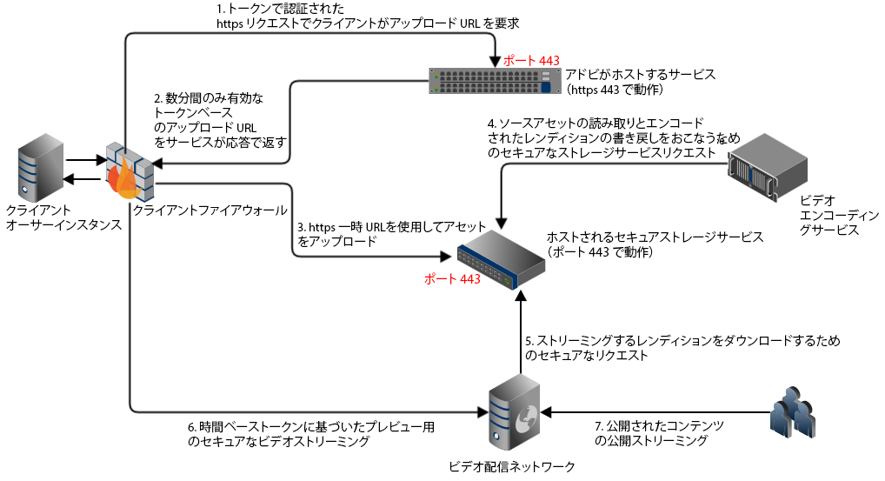

## ビデオのハイブリッド公開アーキテクチャ {#hybrid-publishing-architecture-for-videos}

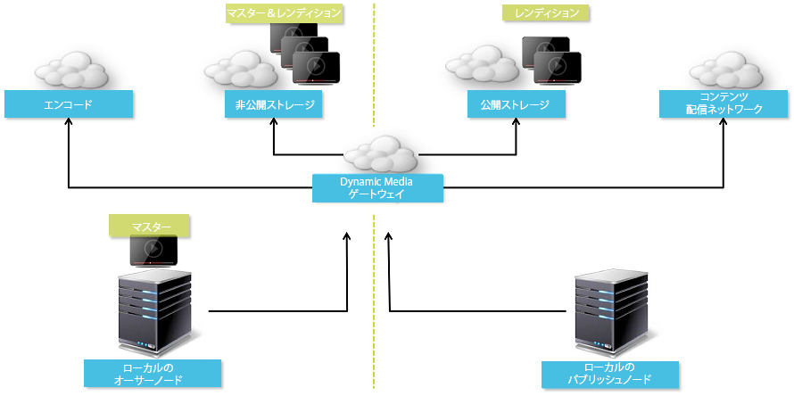

## ビデオエンコーディングのベストプラクティス {#best-practices-for-encoding-videos}

Dynamic Media を有効にし、ビデオクラウドサービスを設定済みの場合、**Dynamic Media エンコードビデオ**&#x200B;ワークフローがビデオをエンコードします。このワークフローは、ワークフローの処理履歴およびエラー情報を捕捉します。詳しくは、[ビデオエンコーディングと YouTube への公開の進行状況の監視](#monitoring-video-encoding-and-youtube-publishing-progress)を参照してください。Dynamic Media を有効にし、ビデオクラウドサービスを設定済みの場合、ビデオをアップロードすると、**[!UICONTROL Dynamic Media エンコードビデオ]**&#x200B;ワークフローが自動的に有効になります（Dynamic Media を使用していない場合は、**[!UICONTROL DAM アセットの更新]**&#x200B;ワークフローが有効になります）。

ここでは、ソースビデオファイルのエンコードにおけるベストプラクティスのヒントを説明します。

ビデオエンコーディングに関するアドバイスについては、以下を参照してください。

* [ストリーミング101:基礎 — コーデック、帯域幅、データレートおよび解像度](https://www.adobe.com/go/learn_s7_streaming101_en)。
* [ビデオエンコーディングの基本](https://www.adobe.com/go/learn_s7_encoding_en)。

### ソースビデオファイル {#source-video-files}

ビデオファイルをエンコードするときは、可能な限り最高品質のソースビデオファイルを使用します。以前にエンコードされたビデオファイルの使用は避けてください。そのようなファイルは既に圧縮済みで、さらにエンコードすると標準を下回る品質のビデオが作成されるからです。

次の表に、ソースビデオファイルのエンコード前の推奨サイズ、縦横比および最小ビットレートを示します。

| サイズ | 縦横比 | 最小ビットレート |
|--- |--- |--- |
| 1,024 X 768 | 4:3 | 4,500 kbps（ほとんどのビデオ） |
| 1,280 X 720 | 16:9 | 3,000～6,000 kbps（ビデオ内のモーションの量に応じて調整） |
| 1,920 X 1,080 | 16:9 | 6,000～8,000 kbps（ビデオ内のモーションの量に応じて調整） |

### ファイルのメタデータの取得 {#obtaining-a-file-s-metadata}

ビデオ編集ツールを使用してメタデータを参照するか、メタデータ取得用のアプリケーションを使用して、ファイルのメタデータを取得することができます。以下は、サードパーティアプリケーションの MediaInfo を使用してビデオファイルのメタデータを取得する手順です。

1. Go to this web page: [https://mediainfo.sourceforge.net/en/Download](https://mediainfo.sourceforge.net/en/Download).
1. GUI バージョンのインストーラーを選択してダウンロードし、インストール手順に従って操作します。
1. インストールの完了後、ビデオファイルを右クリックして（Windows のみ）MediaInfo を選択するか、MediaInfo を開いてビデオファイルをアプリケーションにドラッグします。ビデオの幅、高さ、fps を含む、ビデオファイルに関連するすべてのメタデータが表示されます。

### 縦横比 {#aspect-ratio}

マスタービデオファイルのビデオエンコーディングプリセットを選択または作成するときには、マスタービデオファイルと同じ縦横比をプリセットに使用してください。縦横比とは、ビデオの高さに対する幅の比率のことです。

ビデオファイルの縦横比を決定するには、ファイルのメタデータを取得し、ファイルの幅と高さをメモしておきます（上記のファイルのメタデータの取得を参照）。 次の式を使用して縦横比を決定します。

幅/高さ = 縦横比

次の表に、この式の解を一般的な縦横比に変換した結果を示します。

| 式の解 | 縦横比 |
|--- |--- |
| 1.33 | 4:3 |
| 0.75 | 3:4 |
| 1.78 | 16:9 |
| 0.56 | 9:16 |

例えば、幅 1,440、高さ 1,080 のビデオの縦横比は 1,440/1,080、つまり 1.33 になります。このビデオファイルをエンコードするには、縦横比 4:3 のビデオエンコーディングプリセットを選択します。

### ビットレート {#bitrate}

ビットレートとは、1 秒間のビデオ再生を作成するためにエンコードされるデータの量です。ビットレートは、1 秒あたりのキロビット数（Kbps）の単位で測定します。

>[!NOTE]
>
>すべてのコーデックで非可逆圧縮が使用されるので、ビットレートは、ビデオ品質における最も重要な要素となります。非可逆圧縮では、ビデオファイルの圧縮率が高いほど、ビデオの品質は低下します。したがって、他の特性（解像度、フレームレートおよびコーデック）がすべて等しい場合は、ビットレートが低いほど、圧縮ファイルの品質は低下します。

ビットレートエンコーディングは 2 種類あり、そのどちらかを選択できます。

* **[!UICONTROL 固定ビットレートエンコーディング]**（CBR） - CBR エンコーディングでは、ビットレートまたは 1 秒あたりのビット数が、エンコーディングプロセス全体で同じ数値に維持されます。CBR エンコーディングでは、設定されているデータレートが、ビデオ全体での設定値として使用されます。また、CBR エンコーディングでは、メディアファイルの品質は最適化されませんが、その分、空き容量の節約になります。ビデオ全体に同じようなモーションレベルが含まれている場合は、CBR を使用します。CBR は、ビデオコンテンツのストリーミングに最も一般的に使用されています。[カスタムで追加するビデオエンコーディングパラメーターの使用](/help/assets/dynamic-media/video-profiles.md#using-custom-added-video-encoding-parameters)も参照してください。

* **[!UICONTROL 可変ビットレートエンコーディング]**（VBR） - VBR エンコーディングでは、圧縮形式で必要となるデータに基づいて、データのレートが設定した下限から上限の範囲内で調整されます。つまり、VBR エンコーディングプロセスでは、メディアファイルのビットレートが、そのニーズに応じて動的に増減します。VBR は、CBR よりエンコードに時間がかかりますが、生成されるメディアファイルは最高品質となります。VBR は、ビデオコンテンツの HTTP プログレッシブ配信に最も一般的に使用されます。

VBR と CRB のどちらを使用するべきかVBR と CBR のどちらを選択するべきかという話になると、ほとんどの場合、メディアファイルには VBR を使用することをお勧めします。VBR は、優位性のあるビットレートで CBR より高品質のファイルを生成します。VBR を使用するときは、2 パスエンコーディングを使用し、最大ビットレートをターゲットビデオのビットレートの 1.5 倍に設定してください。

ビデオエンコーディングプリセットを選択するときには、ターゲットのエンドユーザーの接続速度を考慮してください。その速度の 80 ％のデータレートを持つプリセットを選択してください。例えば、ターゲットのエンドユーザーの接続速度が 1,000 Kbps の場合の最適なプリセットは、ビデオデータレートが 800 Kbps のプリセットです。

次の表に、一般的な接続速度のデータレートを示します。

| 速度（Kbps） | 接続タイプ |
|--- |--- |
| 256 | ダイアルアップ接続。 |
| 800 | 一般的なモバイル接続。この接続では、3G エクスペリエンス向けに 400～800 の範囲のデータレートがターゲットとなります。 |
| 2,000 | 一般的なブロードバンドデスクトップ接続。この接続では、データレートを800 ～ 2000 Kbpsの範囲でターゲットにします。ほとんどのターゲットは平均1200 ～ 1500 Kbpsです。 |
| 5,000 | 一般的な高帯域幅接続。この高帯域幅の範囲でのエンコードは推奨されません。ほとんどのユーザーに対して、この速度でビデオを配信することはできません。 |

### 解像度 {#resolution}

**解像度**は、ビデオファイルの高さと幅をピクセル単位で表します。ほとんどのソースビデオは高解像度で保存されます（例：1920 x 1080）。 ストリーミング用に、ソースビデオは低い解像度（640 x 480以下）に圧縮されます。

解像度とデータレートは、ビデオの品質を決める、一体的な関連を持つ 2 つの要素です。同じビデオ品質を維持するには、ビデオファイル内のピクセル数が多いほど（解像度が高いほど）、データレートを高くする必要があります。例えば、320 x 240 の解像度と 640 x 480 の解像度のビデオファイルにおけるフレームあたりピクセル数を考察すると、次のようになります。

| 解像度 | フレームあたりピクセル数 |
|--- |--- |
| 320x240 | 76,800 |
| 640 x 480 | 307,200 |

640 x 480 のファイルのフレームあたりピクセル数は 4 倍あります。これら 2 つの解像度例で同じデータレートを達成するには、640 x 480 のファイルに対して 4 倍の圧縮率を適用します。その結果、ビデオの品質が低下する可能性があります。つまり、250 Kbps のビデオデータレートの場合、320 x 240 の解像度では高品質の表示が可能ですが、640 x 480 の解像度では高品質の表示は期待できません。

一般に、高いデータレートを使用するほど、ビデオの画質は良くなり、高い解像度を使用するほど、その画質を維持するために必要になるデータレートも（解像度が低い場合と比較して）増加します。

解像度とデータレートには関連があるので、ビデオをエンコードする際には次の 2 つの方法から選択できます。

* データレートを選択してから、選択したデータレートできれいに表示される最高の解像度でエンコードします。
* 解像度を選択してから、選択した解像度で高品質のビデオを配信するために必要になるデータレートでエンコードします。

マスタービデオファイルのビデオエンコーディングプリセットを選択（または作成）する場合は、次の表を使用して正しい解像度をターゲットにします。

| 解像度 | 高さ（ピクセル） | 画面サイズ |
|--- |--- |--- |
| 240p | 240 | ごく小さな画面 |
| 300p | 300 | 小型の画面（一般にモバイルデバイス用） |
| 360p | 360 | 小型の画面 |
| 480p | 480 | 中型の画面 |
| 720p | 720 | 大型の画面 |
| 1080p | 1080 | 高画質の大型の画面 |

### Fps (Frames per second) {#fps-frames-per-second}

日本および米国では、ほとんどのビデオは 1 秒あたりのフレーム数（fps）が 29.97 で撮影されます。また、ヨーロッパでは、ほとんどのビデオが 25 fps で撮影されます。映画は 24 fps で撮影されます。

マスタービデオファイルの fps レートに一致するビデオエンコーディングプリセットを選択します。例えば、マスタービデオが 25 fps の場合は、25 fps のエンコーディングプリセットを選択します。デフォルトでは、すべてのカスタムエンコーディングでマスタービデオファイルの fps が使用されます。そのため、ビデオエンコーディングプリセットを作成するときに、fps 設定を明示的に指定する必要はありません。

### ビデオエンコーディングのサイズ {#video-encoding-dimensions}

最適化の理由で、ソースビデオのサイズがエンコードされるすべてのビデオの整数倍になるようなエンコーディングのサイズを選択してください。

この比率を計算するために、ソースの幅をエンコードの幅で割って幅の比率を求めます。次に、ソースの高さをエンコードの高さで割って高さの比率を求めます。

結果の比率が整数の場合は、ビデオが最適なサイズで縮小されます。結果の比率が整数でない場合は、ディスプレイに圧縮による副作用のピクセルが残存して、ビデオの品質に影響を及ぼします。この影響は、ビデオにテキストが含まれる場合に特に目立ちます。

例として、1,920 x 1,080 のソースビデオを取り上げます。次の表の 3 つのエンコードされたビデオは、使用すべき最適なエンコーディング設定です。

| ビデオタイプ | 幅 x 高さ | 幅の比率 | 高さの比率 |
|--- |--- |--- |--- |
| ソース | 1920 x 1080 | 1 | 1 |
| エンコード | 960 x 540 | 2 | 2 |
| エンコード | 640 x 360 | 3 | 3 |
| エンコード | 480 x 270 | 4 | 4 |

### エンコードされたビデオのファイル形式 {#encoded-video-file-format}

Dynamic Media では、MP4 H.264 ビデオエンコーディングプリセットの使用を推奨しています。MP4 ファイルでは H.264 ビデオコーデックが使用されるので、高品質のビデオを圧縮されたファイルサイズで作成することができます。

## YouTube へのビデオの公開 {#publishing-videos-to-youtube}

以前作成した YouTube チャンネルに、オンプレミス AEM ビデオアセットを直接公開できます。

ビデオアセットを YouTube に公開するには、タグを使用して AEM Assets をセットアップします。これらのタグを YouTube チャンネルに関連付けます。ビデオアセットのタグがYouTubeチャネルのタグと一致する場合、ビデオはYouTubeに公開されます。 YouTube への公開は、関連するタグが使用されている限り、ビデオの通常公開と一緒におこなわれます。

YouTube は独自のエンコーディングをおこないます。そのため、AEM にアップロードされた元のビデオファイルは、Dynamic Media のエンコードで作成されたビデオレンディションではなく YouTube に公開されます。Dynamic Media を使用してビデオを処理する必要はありませんが、再生にビューアプリセットが必要な場合は、それがおこなわれます。

ビデオ処理プロファイルをスキップして YouTube に直接公開すると、AEM Assets のビデオアセットに対して、表示可能なサムネールが作成されない可能性があります。また、エンコードされていないビデオは、ダイナミックメディアのアセットタイプのいずれでも動作しないことを意味します。

YouTubeサーバーにビデオアセットを公開するには、YouTubeでの安全で安全なサーバー間認証を確実に行うために、次のタスクを実行する必要があります。

1. [Google Cloud 設定](#configuring-google-cloud-settings)
1. [YouTube チャンネルの作成](#creating-a-youtube-channel)
1. [公開用タグの追加](#adding-tags-for-publishing)
1. [YouTube への公開のレプリケーションエージェントの有効化](#enabling-the-youtube-publish-replication-agent)
1. [AEM での YouTube の設定](#setting-up-youtube-in-aem)
1. [（オプション）アップロードしたビデオのデフォルト YouTube プロパティ設定の自動化](#optional-automating-the-setting-of-default-youtube-properties-for-your-uploaded-videos)
1. [YouTube チャンネルへのビデオの公開](#publishing-videos-to-your-youtube-channel)
1. [（オプション）YouTube での公開済みビデオの確認](/help/assets/dynamic-media/video.md#optional-verifying-the-published-video-on-youtube)
1. [Web アプリケーションへの YouTube URL のリンク](#linking-youtube-urls-to-your-web-application)

また、[ビデオを非公開にして YouTube から削除する](#unpublishing-videos-to-remove-them-from-youtube)こともできます。

### Google Cloud 設定 {#configuring-google-cloud-settings}

YouTubeに投稿するには、Googleアカウントが必要です。GMAILアカウントをお持ちの場合は、既にGoogleアカウントをお持ちです。googleアカウントを持っていない場合は、簡単に作成できます。YouTubeにビデオアセットを公開するには資格情報が必要なので、アカウントが必要です。 既にアカウントを作成済みの場合は、このタスクをスキップして [YouTube チャンネルの作成](#creating-a-youtube-channel)タスクに進んでください。

Google Cloud で使用するアカウントと YouTube に使用する Google アカウントは、必ずしも同じである必要はありません。

Google ではユーザーインターフェイスが定期的に変更されることに注意してください。そのため、YouTube にビデオを公開する手順は、以下の手順とは少し異なる場合があります。これは、ビデオが YouTube にアップロードされるかどうかを確認する場合にも当てはまります。

>[!NOTE]
>
>以下の手順は、このドキュメントを執筆している時点で正確なものです。Google は、Web サイトを予告なく定期的に更新します。そのため、以下の手順は、最新の手順とは少し異なる場合もあります。

Google Cloud を設定するには：

1. 新しい Google アカウントを作成します。
   [https://accounts.google.com/SignUp?service=mail](https://accounts.google.com/SignUp?service=mail)

   既に Google アカウントを持っている場合は、次のステップに進んでください。

1. Go to [https://cloud.google.com/](https://cloud.google.com/).
1. Google Cloud ページの右上隅付近にある、「**[!UICONTROL コンソール]**」をクリックします。

   必要に応じて、Google アカウントの資格情報を使用して&#x200B;**[!UICONTROL ログイン]**&#x200B;し、「]**コンソール**[!UICONTROL 」オプションの確認が必要になる場合があります。

1. ダッシュボードページで、**[!UICONTROL Google Cloud Platform]** の右側にある「プロジェクト」ドロップダウンリストをクリックして、プロジェクトの選択ダイアログボックスを開きます。
1. プロジェクトの選択ダイアログボックスで、「**[!UICONTROL 新しいプロジェクト]**」をタップします。

   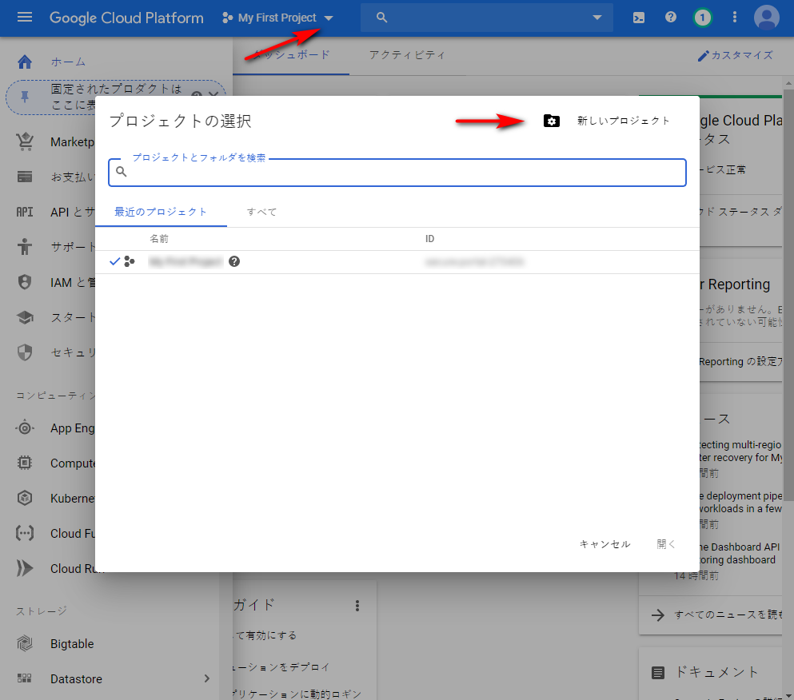

1. 新しいプロジェクトダイアログボックスで、「プロジェクト名」フィールドに新しいプロジェクトの名前を入力します。

   プロジェクト ID は、プロジェクト名に基づいて付けられます。そのため、プロジェクト名は慎重に選んでください。プロジェクト名を後で変更することはできません。また、後でAEMでYouTubeを設定する際に、同じプロジェクトIDを再入力する必要があります。書き留めておきたいかもしれません

1. 「**[!UICONTROL 作成]**」をクリックします。

1. 次のいずれかの操作をおこないます。

   * プロジェクトのダッシュボードの「スタートガイド」カードで、「]**API を確認して有効化**[!UICONTROL 」をタップします。
   * プロジェクトのダッシュボードの 「API」カードで「]**API の概要に移動**[!UICONTROL 」をタップします。
   

1. API とサービスページの上部にある「]**API とサービスの有効化**[!UICONTROL 」をタップします。
1. API ライブラリページの左側の「**[!UICONTROL カテゴリー]**」で、「**[!UICONTROL YouTube]**」をタップします。ページの右側で、「**[!UICONTROL YouTube Data API]**」をタップします。
1. YouTube Data API v3 ページで、「**[!UICONTROL 有効に切り替える]**」をタップします。

   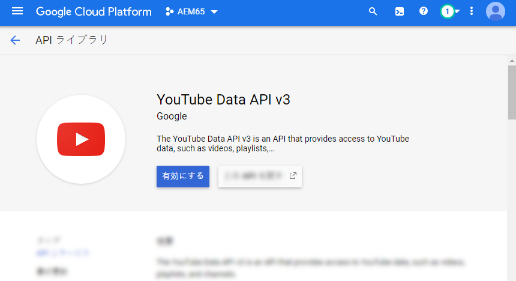

1. この API を使用するために資格情報が必要となる場合があります。その場合は、「**[!UICONTROL 認証情報を作成]**」をクリックします。

   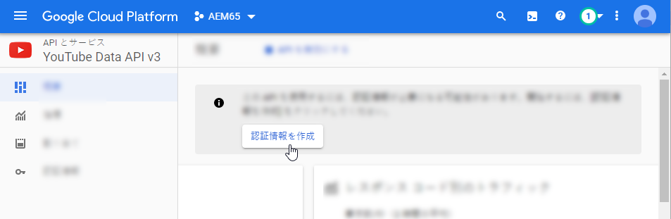

1. **[!UICONTROL プロジェクトへの認証情報の追加]**&#x200B;ページの手順 1 で以下をおこないます。

   * 「**[!UICONTROL 使用する API]**」ドロップダウンリストから、「**[!UICONTROL YouTube Data API v3]**」を選択します。

   * 「**[!UICONTROL API を呼び出す場所]**」ドロップダウンリストから、「**[!UICONTROL ウェブサーバー（node.js、Tomcat など）]**」を選択します

   * 「**[!UICONTROL アクセスするデータの種類]**」ドロップダウンリストから、「**[!UICONTROL ユーザーデータ]**」を選択します。
   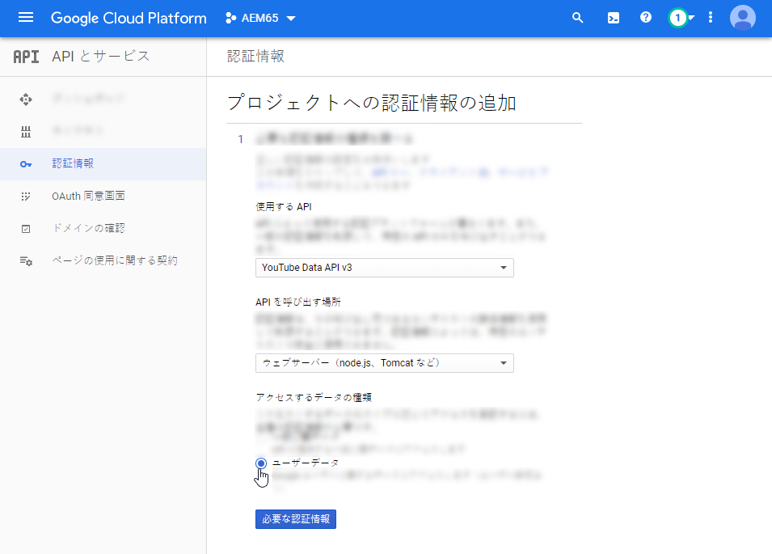

1. 「**[!UICONTROL 必要な認証情報]**」をタップします。
1. **[!UICONTROL プロジェクトへの認証情報の追加]**&#x200B;ページの手順 2 で、「**[!UICONTROL OAuth 2.0 クライアント ID を作成する]**」の下の「名前」フィールドに、必要に応じて一意の名前を入力します。または、Google で指定されるデフォルトの名前を使用することもできます。
1. Under the **[!UICONTROL Authorized Javascript origins]** heading, in the text field, enter the following path, substituting your own domain and port number in the path, then press **[!UICONTROL Enter]** to add the path to the list:

   `https://<servername.domain>:<port_number>`

   例：`https://1a2b3c.mycompany.com:4321`

   **注意**：上記のパスは入力例です。

   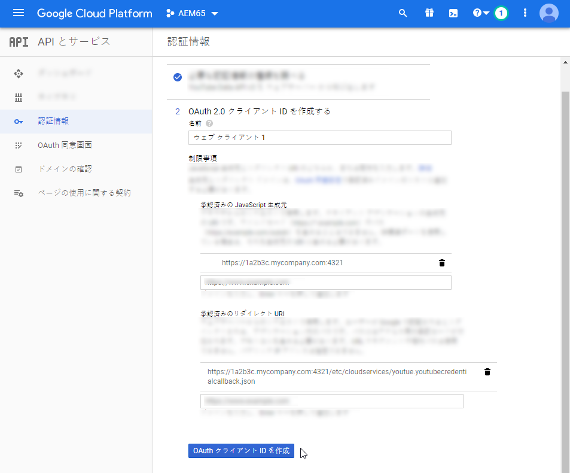

1. Under the **[!UICONTROL Authorized redirect URIs]** heading, in the text field, enter the following path, substituting your own domain and port number in the path, then press **[!UICONTROL Enter]** to add the path to the list:

   `https://<servername.domain>:<port_number>/etc/cloudservices/youtube.youtubecredentialcallback.json`

   例：`https://1a2b3c.mycompany.com:4321/etc/cloudservices/youtube.youtubecredentialcallback.json`

   **注意**：上記のパスは入力例です。

1. 「**[!UICONTROL OAuth クライアント ID の作成]**」をクリックします。
1. **[!UICONTROL プロジェクトへの認証情報の追加]**&#x200B;ページの手順 3 で、「**[!UICONTROL OAuth 2.0 同意画面を設定する]**」の下で、現在使用している Gmail 電子メールアドレスを選択します。

   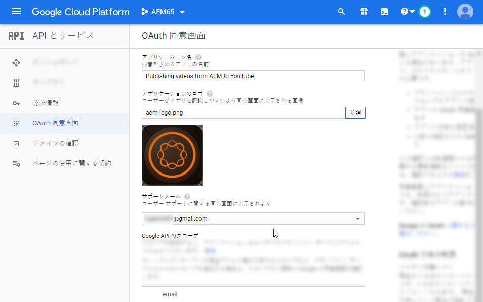

1. 「**[!UICONTROL ユーザーに表示される製品名]**」の下のテキストフィールドに、同意画面に表示する内容を入力します。

   同意画面は、AEM 管理者が YouTube の認証をおこなう際に表示され、AEM は YouTube に権限を要求します。

1. 「**[!UICONTROL 次へ]**」をクリックします。
1. プロジェクトへの認証情報の追加ページの手順 4 で、「**[!UICONTROL 認証情報のダウンロード]**」の下の「**[!UICONTROL ダウンロード]**」をタップします。

   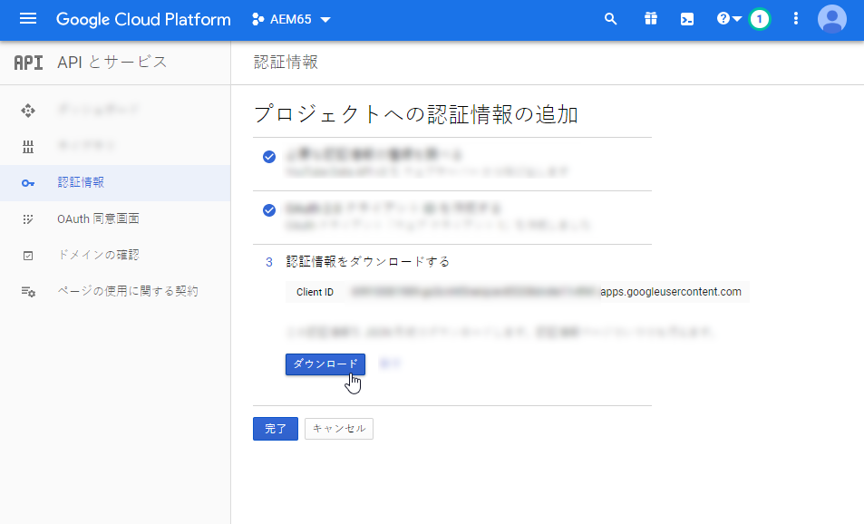

1. Save the `client_id.json` file.

   このダウンロードした JSON ファイルは、後で Adobe Experience Manager で YouTube をセットアップするときに必要になります。


1. 「**[!UICONTROL 完了]**」をクリックします。

   Google アカウントからログアウトします。次に、YouTube チャンネルを作成します。

### YouTube チャンネルの作成 {#creating-a-youtube-channel}

YouTube にビデオを公開するには、1 つ以上のチャネルが必要です。既に YouTube チャンネルを作成している場合は、このタスクをスキップして、次の「[公開用タグの追加](/help/assets/dynamic-media/video.md#adding-tags-for-publishing)」タスクに進んでください。

>[!CAUTION]
>
>Be sure you have already set up one or more channels in YouTube *before* you add channels under YouTube Settings in AEM (see [Setting up YouTube in AEM](#setting-up-youtube-in-aem) below). この操作に失敗した場合、既存のチャネルが存在しないという警告は表示されません。 ただし、チャネルを追加してもGoogle認証は引き続き発生しますが、ビデオを送信するチャネルを選択するオプションはありません。

YouTube チャンネルを作成するには：

1. [https://www.youtube.com](https://www.youtube.com/) にアクセスし、Google アカウントの資格情報を使用してログインします。
1. YouTube ページの右上隅にあるプロファイル写真（内側に文字が表示された、べた塗りの円が表示されている場合はその円）をクリックし、「**[!UICONTROL 設定]**」（丸い歯車アイコン）をクリックします。
1. 概要ページの「その他の機能」で、「**[!UICONTROL チャネルをすべて表示するか、新しいチャネルを作成する]**」をクリックします。
1. On the Channels page, click **[!UICONTROL Create a new channel]**.
1. ブランドアカウントページで、「ブランドアカウント名」フィールドに、ビジネス名や、ビデオアセットの公開先となる他のチャネル名を入力し、「**[!UICONTROL 作成]**」をクリックします。

   この名前は、AEM で YouTube をセットアップするときに入力する必要があるので、覚えておいてください。

1. （オプション）必要に応じて、さらにチャネルを追加します。

     次は、公開用タグを追加します。

### 公開用タグの追加 {#adding-tags-for-publishing}

AEM で、YouTube にビデオを公開するには、1 つ以上の YouTube チャンネルにタグを関連付けます。公開用タグの追加については、[タグの管理](/help/sites-cloud/authoring/features/tags.md)を参照してください。

Or, if you intend to use the default tags in AEM, you can skip this task and go to [Enabling the YouTube Publish replication agent](#enabling-the-youtube-publish-replication-agent).

### YouTube への公開のレプリケーションエージェントの有効化 {#enabling-the-youtube-publish-replication-agent}

YouTube への公開のレプリケーションエージェントを有効化した後、Google Cloud アカウントへの接続をテストする場合は、「]**接続をテスト**[!UICONTROL 」をタップします。ブラウザーのタブに接続結果が表示されます。YouTube チャンネルを追加した場合は、それらの一覧がテストの一部として表示されます。

1. AEM の左上隅にある AEM ロゴをクリックし、左側のレールで&#x200B;**[!UICONTROL ツール]**／**[!UICONTROL 導入]**／**[!UICONTROL レプリケーション]**／**[!UICONTROL 作成者のエージェント]**&#x200B;をクリックします。
1. 作成者のエージェントページで、「**[!UICONTROL YouTube の公開（YouTube）]**」をクリックします。
1. ツールバーで、「設定」の右側にある「**[!UICONTROL 編集]**」をクリックします。
1. 「**[!UICONTROL 有効]**」チェックボックスをオンにして、レプリケーションエージェントをオンにします。
1. 「**[!UICONTROL OK]**」をクリックします。

   次は、AEM で YouTube をセットアップします。

### AEM での YouTube の設定 {#setting-up-youtube-in-aem}

AEM 6.4 以降では、AEM で YouTube への公開をセットアップするための新しいタッチ対応ユーザーインターフェイスが導入されました。使用している AEM のインストール済みインスタンスに応じて、次のいずれかをおこないます。

* 6.4 以前の AEM で YouTube を設定するには、](/help/assets/dynamic-media/video.md#setting-up-youtube-in-aem-before)6.4 以前の AEM での YouTube の設定[を参照してください。
* AEM 6.4 以降で YouTube を設定するには、](#setting-up-youtube-in-aem-and-later)AEM 6.4 以降での YouTube の設定[を参照してください。

#### AEM 6.4 以降での YouTube の設定 {#setting-up-youtube-in-aem-and-later}

1. Dynamic Media のインスタンスに管理者としてログインしてください。
1. AEM の左上隅にある AEM ロゴをタップし、左のレールで&#x200B;**[!UICONTROL ツール]**（ハンマーのアイコン）／**[!UICONTROL クラウドサービス]**／**[!UICONTROL YouTube 公開設定]**&#x200B;をタップします。
1. 「**[!UICONTROL グローバル]**」をタップします（選択しないでください）。

1. グローバルページの右上隅にある「**[!UICONTROL 作成]**」をタップします。
1. YouTube 設定を作成ページの「Google Cloud Platform 設定」で、「**[!UICONTROL アプリケーション名]**」フィールドに Google プロジェクト ID を入力します。

   このプロジェクト ID は、先ほど Google Cloud 設定をおこなったときに指定したものです。YouTube 設定を作成ページを開いたままにしておきます。このページには後で戻ります。

   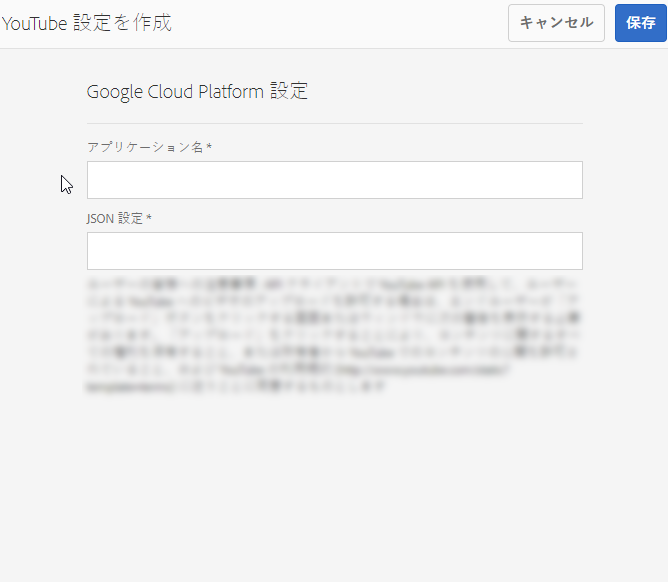

1. 任意のテキストエディターを使用して、「[Google Cloud 設定](/help/assets/dynamic-media/video.md#configuring-google-cloud-settings)」のタスクでダウンロードして保存しておいた JSON ファイルを開きます。
1. この JSON テキスト全体を選択してコピーします。
1. YouTube アカウント設定ダイアログボックスに戻ります。「**[!UICONTROL JSON 設定]**」フィールドに JSON テキストを貼り付けます。
1. ページの右上隅にある「**[!UICONTROL 保存]**」をタップします。

   次は、AEM で YouTube チャンネルをセットアップします。

1. 「**[!UICONTROL チャンネルを追加]**」をタップします。
1. 「チャネル名」フィールドに、前に「**[!UICONTROL YouTube への 1 つ以上のチャネルの追加]**」タスクで作成したチャネルの名前を入力します。

   必要に応じて、説明を追加することもできます。

1. 「**[!UICONTROL 追加]**」をタップします。
1. YouTube／Google 認証が表示されます。Google Cloud アカウントにまだログインしていない場合は、この手順をスキップしてください。

   * 前述の Google プロジェクト ID と JSON テキストに関連付けられた Google ユーザー名とパスワードを入力します。
   * アカウントに存在するチャネルの数によっては、2 つ以上の項目が表示されます。チャネルを選択してください。電子メールアドレスはチャネルではないので、選択しないでください。
   * 次のページで、「**[!UICONTROL 確定]**」をタップして、このチャネルへのアクセスを許可します。

1. 「**[!UICONTROL 許可]**」をタップします。

   次は、公開用タグを設定します。

1. **[!UICONTROL 投稿用のタグの設定]** — クラウドサービス/YouTubeページで、鉛筆アイコンをタップして、使用するタグのリストを編集します。
1. ドロップダウンリストアイコン（上下逆のキャレット）をタップして、AEM で利用可能なタグのリストを表示します。
1. 1 つ以上のタグをタップして追加します。

   追加したタグを削除するには、そのタグを選択して、「**[!UICONTROL X]**」をタップします。

1. When you are finished adding the tags you want, tap **[!UICONTROL Save]**.

   これで、YouTubeチャンネルにビデオを投稿します。

#### 6.4 以前の AEM での YouTube の設定 {#setting-up-youtube-in-aem-before}

1. Dynamic Media のインスタンスに管理者としてログインしてください。

1. AEM の左上隅にある AEM ロゴをタップしてから、左側のレールで&#x200B;**[!UICONTROL ツール]**（ハンマーのアイコン）／**[!UICONTROL 導入]**／**[!UICONTROL クラウドサービス]**&#x200B;をタップします。
1. 「サードパーティのサービス」ヘッダーの下の「YouTube」で、「**[!UICONTROL 今すぐ設定]**」をタップします。
1. 設定を作成ダイアログボックスで、タイトル（必須）と名前（オプション）をそれぞれのフィールドに入力します。
1. 「**[!UICONTROL 作成]**」をタップします。
1. YouTube アカウント設定ダイアログボックスで、「**[!UICONTROL アプリケーション名]**」フィールドに Google プロジェクト ID を入力します。

   このプロジェクト ID は、先ほど [Google Cloud 設定をおこなった](/help/assets/dynamic-media/video.md#configuring-google-cloud-settings)ときに指定したものです。YouTube アカウント設定ダイアログボックスを開いたままにしておきます。このダイアログボックスには後で戻ります。

1. 任意のテキストエディターを使用して、「Google Cloud 設定」のタスクでダウンロードして保存しておいた JSON ファイルを開きます。
1. この JSON テキスト全体を選択してコピーします。
1. YouTube アカウント設定ダイアログボックスに戻ります。「**[!UICONTROL JSON 設定]**」フィールドに JSON テキストを貼り付けます。
1. 「**[!UICONTROL OK]**」をタップします。

   次は、AEM で YouTube チャンネルをセットアップします。

1. 「**[!UICONTROL 利用可能なチャネル]**」の右にある「**+**」（プラス記号のアイコン）をタップします。
1. YouTube チャンネル設定ダイアログボックスの「タイトル」フィールドに、前の「**[!UICONTROL YouTube への 1 つ以上のチャネルの追加]**」タスクで作成したチャネルの名前を入力します。

   必要に応じて、説明を追加することもできます。

1. 「**[!UICONTROL OK]**」をタップします。
1. YouTube／Google 認証が表示されます。Google Cloud アカウントにまだログインしていない場合は、この手順をスキップしてください。

   * 前述の Google プロジェクト ID と JSON テキストに関連付けられた Google ユーザー名とパスワードを入力します。
   * アカウントに存在するチャネルの数によっては、2 つ以上の項目が表示されます。チャネルを選択してください。電子メールアドレスはチャネルではないので、選択しないでください。
   * 次のページで、「**[!UICONTROL 確定]**」をタップして、このチャネルへのアクセスを許可します。

1. 「**[!UICONTROL 許可]**」をタップします。

   次は、公開用タグを設定します。

1. **[!UICONTROL 投稿用のタグの設定]** — クラウドサービス/YouTubeページで、鉛筆アイコンをタップして、使用するタグのリストを編集します。
1. ドロップダウンリストアイコン（上下逆のキャレット）をタップして、AEM で利用可能なタグのリストを表示します。
1. 1 つ以上のタグをタップして追加します。

   追加したタグを削除するには、そのタグを選択して、「**X**」をタップします。

1. When you are finished adding the tags you want, tap **[!UICONTROL OK]**.

   これで、YouTubeチャンネルにビデオを投稿します。

### （オプション）アップロードしたビデオのデフォルト YouTube プロパティ設定の自動化{#optional-automating-the-setting-of-default-youtube-properties-for-your-uploaded-videos}

ビデオをアップロードする際に YouTube プロパティの設定を自動化することもできます。これをおこなうためには、メタデータ処理プロファイルを AEM で作成します。

メタデータ処理プロファイルを作成するには、まず「**[!UICONTROL フィールドラベル]**」、「**[!UICONTROL プロパティにマッピング]**」、「**[!UICONTROL 選択肢]**」の各フィールドの値をコピーします。これらはすべてビデオのメタデータスキーマで見つかります。次に、これらの値を追加して、YouTube ビデオメタデータ処理プロファイルを作成します。

アップロードしたビデオのデフォルト YouTube プロパティの設定を自動化するには：

1. In the upper-left corner of AEM, click the AEM logo, then in the left rail, click **[!UICONTROL Tools]** (hammer icon) > **[!UICONTROL Assets]** > **[!UICONTROL Metadata Schemas]**.
1. Click **[!UICONTROL default]**. （「デフォルト値」の左側にある選択ボックスにチェックマークを追加しないでください）。
1. On the **[!UICONTROL default]** page, check the box to the left of **[!UICONTROL video]**, then click **Edit]**.
1. メタデータスキーマエディターページで、「**[!UICONTROL 詳細]**」タブをクリックします。
1. Under the YouTube Publishing heading, click **[!UICONTROL YouTube Category]**.
1. ページの右側の「**[!UICONTROL 設定]**」タブで次の手順を実行します。

   * 「**[!UICONTROL プロパティにマッピング]**」テキストフィールドで、値を選択してコピーします。 コピーした値を、開いているテキストエディターに貼り付けます。後でメタデータ処理プロファイルを作成するときにこの値が必要になります。テキストエディターは開いたままにしておきます。

   * 「**[!UICONTROL 選択肢]**」の下で、使用するデフォルト値（「人とブログ」または「科学と技術」など）を選択してコピーします。 コピーした値を、開いているテキストエディターに貼り付けます。後でメタデータ処理プロファイルを作成するときにこの値が必要になります。テキストエディターは開いたままにしておきます。

1. Under the YouTube Publishing heading, click **[!UICONTROL YouTube Privacy]**.
1. ページの右側の「**[!UICONTROL 設定]**」タブで次の手順を実行します。

   * 「**[!UICONTROL プロパティにマッピング]**」テキストフィールドで、値を選択してコピーします。 コピーした値を、開いているテキストエディターに貼り付けます。後でメタデータ処理プロファイルを作成するときにこの値が必要になります。テキストエディターは開いたままにしておきます。

   * 「**[!UICONTROL 選択肢]**」の下で、使用するデフォルト値を選択してコピーします。選択肢は 2 つが 1 組になっています。1 組の下のフィールドは、コピーするデフォルト値（公開、非公開またはプライベート）です。 コピーした値を、開いているテキストエディターに貼り付けます。後でメタデータ処理プロファイルを作成するときにこの値が必要になります。テキストエディターは開いたままにしておきます。

1. Near the upper-right corner of the Metadata Schema Editor page, click **[!UICONTROL Cancel]**.
1. In the upper-left corner of AEM, tap the AEM logo, then in the left rail, click **[!UICONTROL Tools]** (hammer icon) > **[!UICONTROL Assets]** > **[!UICONTROL Metadata Profiles]**.

1. メタデータプロファイルページの右上隅にある「**[!UICONTROL 作成]**」をクリックします。
1. In the Add Metadata Profile dialog box, in the **[!UICONTROL Profile title]** text field, enter the name `YouTube Video` then click **[!UICONTROL Create]**.
1. メタデータプロファイルエディターページで、「**[!UICONTROL 詳細]**」タブをクリックします。
1. 次の手順を実行して、コピーした「YouTube への公開」の値を、プロファイルに追加します。

   * ページの右側にある「**[!UICONTROL フォームを作成]**」タブをクリックします。
   * (Optional) Drag the component labeled **[!UICONTROL Section Header]** to the left and drop it in the form area.
   * (Optional) Click **[!UICONTROL Field Label]** to select the component.
   * (Optional) On the right side of the page, under the Settings tab, in the Field Label text field, enter `YouTube Publishing`.
   * Click the **[!UICONTROL Build Form]** tab, then drag the component labeled **[!UICONTROL Multi Value Text]** and drop it below the **[!UICONTROL YouTube Publishing]** heading that you just created.

   * Click **[!UICONTROL Field Label** to select the component.
   * ページの右側の「設定」タブで、前にコピーしたYouTube Publishingの値（フィールドラベルの値およびプロパティの値にマップ）を、フォーム上のそれぞれのフィールドに貼り付けます。 選択肢値を「デフォルト値」フィールドに貼り付けます。

1. 次の手順を実行して、コピーした「YouTube のプライバシー」の値を、プロファイルに追加します。

   * ページの右側にある「**[!UICONTROL フォームを作成]**」タブをクリックします。
   * (Optional) Drag the component labeled **[!UICONTROL Section Header]** to the left and drop it in the form area.
   * (Optional) Click **[!UICONTROL Field Label]** to select the component.
   * (Optional) On the right side of the page, under the Settings tab, in the Field Label text field, enter `YouTube Privacy`.
   * Click the **[!UICONTROL Build Form]** tab, then drag the component labeled **[!UICONTROL Multi Value Text]** and drop it below the **[!UICONTROL YouTube Privacy]** heading you just created.

   * Click **[!UICONTROL Field Label]** to select the component.
   * ページの右側の「設定」タブで、前にコピーしたYouTube Publishingの値（フィールドラベルの値およびプロパティの値にマップ）を、フォーム上のそれぞれのフィールドに貼り付けます。 選択肢値を「デフォルト値」フィールドに貼り付けます。

1. ページの右上隅にある「**[!UICONTROL 保存]**」をクリックします。
1. YouTube への公開メタデータプロファイルを、ビデオのアップロード先フォルダーに適用します。メタデータプロファイルとビデオプロファイルを設定する必要があります。

   詳しくは、[メタデータプロファイル](/help/assets/metadata-profiles.md)と[ビデオプロファイル](/help/assets/dynamic-media/video-profiles.md)を参照してください。

### YouTube チャンネルへのビデオの公開 {#publishing-videos-to-your-youtube-channel}

次は、前の手順で追加したタグを、ビデオアセットに関連付けます。このプロセスにより、AEMはYouTubeチャネルに投稿するアセットを知ることができます。

>[!NOTE]
>
>ただちに投稿しても、YouTubeには自動的には投稿されません。 When Dynamic Media is set up, there are two publish options to choose from: **[!UICONTROL Immediately]** or **[!UICONTROL Upon Activation]**.
>
>**[!UICONTROL 即時公開する]**&#x200B;の場合、アップロードされたアセットは、IPS と同期された後、配信システムに自動的に公開されます。これは Dynamic Media には当てはまりますが、YouTube には当てはまりません。YouTube に公開するには、AEM オーサーを介して公開する必要があります。

>[!NOTE]
>
>To publish content from YouTube, AEM uses the **[!UICONTROL Publish to YouTube]** workflow, which lets you monitor progress and view any failure information.
>
>詳しくは、[ビデオエンコーディングと YouTube への公開の進行状況の監視](#monitoring-video-encoding-and-youtube-publishing-progress)を参照してください。
>
>詳細な進行状況については、レプリケーション下の YouTube ログを監視できます。ただし、このような監視には管理者アクセスが必要です。

YouTube チャンネルにビデオを公開するには：

1. AEM で、YouTube チャンネルに公開するビデオアセットの場所に移動します。
1. ビデオアセット（アダプティブビデオセット）を選択します。
1. On the toolbar, click **[!UICONTROL Properties]**.
1. 「基本」タブの「メタデータ」で、「タグ」フィールドの右側にある「**[!UICONTROL 選択ダイアログを開く]**」をクリックします。
1. タグを選択ページで、使用するタグに移動し、1 つ以上のタグを選択します。

   タグは YouTube チャンネルに関連付ける必要があります。

1. ページの右上隅にある「**[!UICONTROL 選択]**」をクリックします。
1. ビデオのプロパティページの右上隅にある「**[!UICONTROL 保存して閉じる]**」をクリックします。
1. ツールバーの「**[!UICONTROL クイック公開]**」をクリックします。

   [AEM Sites での公開管理の使用](https://helpx.adobe.com/experience-manager/kt/sites/using/publication-management-feature-video-use.html)も参照してください。

   必要に応じて、YouTubeチャネルに公開されたビデオを検証できます。

### （オプション）YouTube での公開済みビデオの確認{#optional-verifying-the-published-video-on-youtube}

オプションで、YouTube への公開（または非公開）の進行状況を監視できます。

詳しくは、[ビデオエンコーディングと YouTube への公開の進行状況の監視](#monitoring-video-encoding-and-youtube-publishing-progress)を参照してください。

公開にかかる時間は、マスタービデオの形式、ファイルサイズ、アップロードトラフィックなどの多数の要因により左右されます。公開プロセスにかかる時間は、数分から数時間までの幅があります。また、高解像度の形式では、レンダリングの時間がかかることにも注意してください。例えば、720p や 1080p の場合、表示されるまでの時間が 480p よりも大幅に長くなります。

8 時間経っても「**[!UICONTROL アップロード済み（処理中、お待ちください）]**」というステータスメッセージが表示される場合は、サイトからビデオを削除して再度アップロードしてみてください。

### Web アプリケーションへの YouTube URL のリンク {#linking-youtube-urls-to-your-web-application}

ビデオの公開後にダイナミックメディアによって生成されるYouTube URL文字列を取得できます。YouTube URLをコピーすると、そのURLはクリップボードに格納されるので、Webサイトやアプリケーションのページに必要に応じて貼り付けることができます。

>[!NOTE]
>
>YouTube URL は、ビデオアセットを YouTube に公開するまではコピーできません。

Web アプリケーションに YouTube URL をリンクするには：

1. Navigate to the *YouTube published* video asset whose URL you want to copy, then select it.

   Remember that YouTube URLs are only available to copy *after* you have first *published* the video assets to YouTube.

1. On the toolbar, click **[!UICONTROL Properties]**.
1. 「**[!UICONTROL 詳細]**」タブをクリックします。
1. 「YouTube への公開」の「YouTube URL リスト」で、URL テキストを選択し、Web ブラウザーにコピーしてアセットをプレビューするか、Web コンテンツページに追加します。

### ビデオを非公開にして YouTube から削除 {#unpublishing-videos-to-remove-them-from-youtube}

AEM でビデオアセットを非公開にすると、そのビデオは YouTube から削除されます。

>[!CAUTION]
>
>YouTube 内からビデオを直接削除すると、AEM にはそのことがわかりません。そのため、AEM は、そのビデオがまだ YouTube に公開されているかのように機能を続けます。ビデオアセットを YouTube で非公開にするときは、必ず AEM からおこなってください。

>[!NOTE]
>
>AEM では、YouTube からのコンテンツの削除に **[!UICONTROL YouTube で非公開]**&#x200B;ワークフローを使用します。このワークフローでは、進行状況を監視して、エラー情報を表示できます。
>
>詳しくは、[ビデオエンコーディングと YouTube への公開の進行状況の監視](#monitoring-video-encoding-and-youtube-publishing-progress)を参照してください。

ビデオを非公開にして YouTube から削除するには：

1. YouTube チャンネルで非公開にするビデオアセットの場所に移動します。
1. アセット選択モードで、1 つ以上の公開済みビデオアセットを選択します。
1. ツールバーで「**[!UICONTROL 公開を管理]**」をクリックします。場合によっては、ツールバーの 3 つのドット（...）アイコンをタップして、]**公開を管理**[!UICONTROL &#x200B;を表示する必要があります。
1. 「公開を管理」ページで、「]**非公開**[!UICONTROL 」をタップします。
1. ページの右上隅にある「**[!UICONTROL 次へ]**」をタップします。
1. ページの右上隅にある「**[!UICONTROL 非公開]**」をタップします。

## ビデオエンコーディングと YouTube への公開の進行状況の監視 {#monitoring-video-encoding-and-youtube-publishing-progress}

ビデオエンコーディングが適用されたフォルダーに新しいビデオをアップロードしたり、YouTube にビデオを公開したりする場合は、ビデオエンコーディング／YouTube への公開の進行状況（エラー状況）を様々な方法で監視できます。YouTube への公開の実際の進行状況は、ログを介してのみ把握できますが、YouTube への公開が失敗したか成功したかは、別の方法で示されます（以下の手順で説明します）。また、YouTube の公開ワークフローやビデオエンコーディングが完了するか中断されると、そのことを知らせる電子メール通知を受け取ることもできます。

### 進行状況の監視 {#monitoring-progress}

進行状況を監視するには（エンコーディング／YouTube の公開の失敗を含む）：

1. アセットフォルダー内のビデオエンコーディングの進行状況を表示します。

   * カード表示では、ビデオエンコーディングの進行状況は、アセットにパーセントで表示されます。エラーがある場合、エラー情報はアセットにも表示されます。
   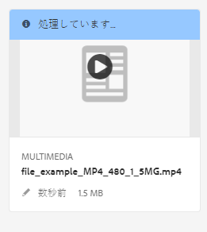

   * In list view, video encoding progress displays in the **[!UICONTROL Processing Status]** column. エラーが発生した場合は、このメッセージが同じ列に表示されます。
   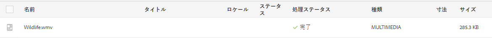

   この列は、デフォルトでは表示されません。To enable the column, select **[!UICONTROL View Settings]** from the views drop-down menu, and add the **[!UICONTROL Processing Status]** column and tap or click **[!UICONTROL Update]**.

   

1. アセット詳細の進行状況を表示します。アセットをタップまたはクリックしたら、ドロップダウンメニューを開き、「**[!UICONTROL タイムライン]**」を選択します。タイムラインを、エンコーディングや YouTube への公開などのワークフローアクティビティに絞り込むには、「**[!UICONTROL ワークフロー]**」を選択します。

   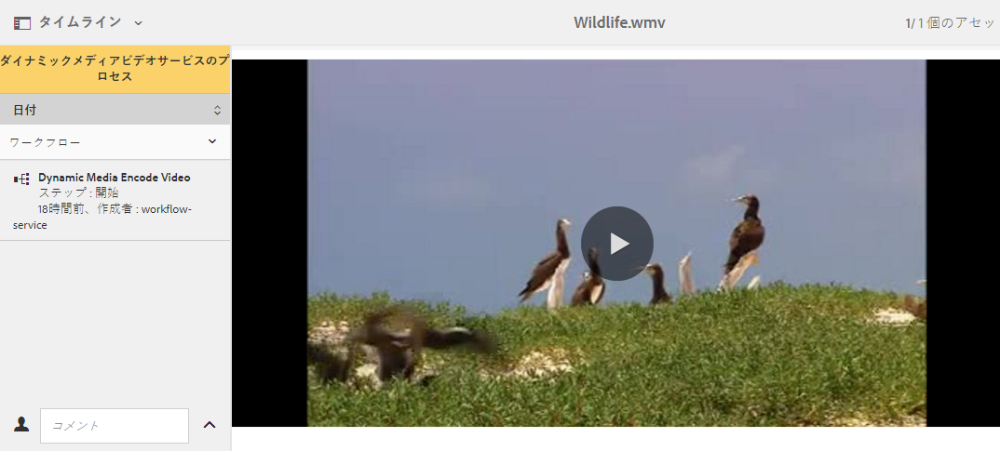

   エンコーディングなどのワークフロー情報がタイムラインに表示されます。YouTube の公開の場合、ワークフロータイムラインには、YouTube チャンネルの名前と YouTube ビデオの URL も含まれます。さらに、パブリッシュが完了すると、ワークフロータイムラインには、エラー通知も表示されます。

   >[!NOTE]
   >
   >It may take a long time for failure/error messages to finally be recorded due to multiple workflow configurations on **[!UICONTROL retries]**, **[!UICONTROL retry delay]**, and **[!UICONTROL timeout]** from [https://localhost:4502/system/console/configMgr](https://localhost:4502/system/console/configMgr), for example:
   >
   >    * Apache Sling Job Queue Configuration
   >    * Adobe Granite Workflow External Process Job Handler
   >    * Granite Workflow Timeout Queue
   >
   >これらの設定の&#x200B;**[!UICONTROL 再試行]**、**[!UICONTROL 再試行遅延]**&#x200B;および&#x200B;**[!UICONTROL タイムアウト]**&#x200B;プロパティは調整できます。

1. For workflows in progress, see Workflow Instances available from **[!UICONTROL Tools]** > **[!UICONTROL Workflow]** > **[!UICONTROL Instances]**.

   >[!NOTE]
   >
   >**[!UICONTROL ツール]**&#x200B;メニューにアクセスするには、管理者権限が必要となる場合があります。

   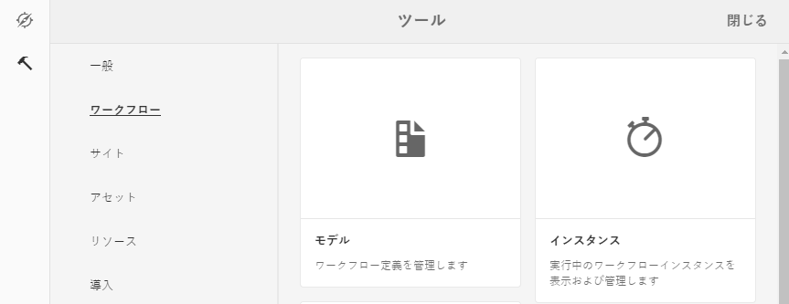

   インスタンスを選択し、「**[!UICONTROL 履歴を開く]**」をタップまたはクリックします。

   

   ワークフローインスタンス領域から、ワークフローを休止、終了または名前変更できます。See [Administering workflows](/help/sites-cloud/authoring/workflows/overview.md) for more information.

1. エラーが発生したジョブについては、**[!UICONTROL ツール]**／**[!UICONTROL ワークフロー]**／**[!UICONTROL エラー]**&#x200B;からワークフローエラーを表示します。**[!UICONTROL ワークフローエラー]**&#x200B;に、エラーが発生したすべてのワークフローアクティビティが表示されます。

   >[!NOTE]
   >
   >**[!UICONTROL ツール]**&#x200B;メニューにアクセスするには、管理者権限が必要となる場合があります。

   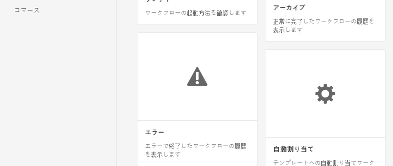

   >[!NOTE]
   >
   >It may take a long time for the error message to finally be recorded due to multiple workflow configurations on **[!UICONTROL retries]**, **[!UICONTROL retry delay]**, and **[!UICONTROL timeout]** from [https://localhost:4502/system/console/configMgr](https://localhost:4502/system/console/configMgr), for example:
   >
   >
   >
   >    * Apache Sling Job Queue Configuration
   >    * Adobe Granite Workflow External Process Job Handler
   >    * Granite Workflow Timeout Queue
   >
   >
   >これらの設定の&#x200B;**[!UICONTROL 再試行]**、**[!UICONTROL 再試行遅延]**&#x200B;および&#x200B;**[!UICONTROL タイムアウト]**&#x200B;プロパティは調整できます。

1. For completed workflows, see Workflow Archive available from **[!UICONTROL Tools]** > **[!UICONTROL Workflow]** > **[!UICONTROL Archive]**. The **[!UICONTROL Workflow Archive]** lists all completed workflow activities.

   >[!NOTE]
   >
   >**[!UICONTROL ツール]**&#x200B;メニューにアクセスするには、管理者権限が必要となる場合があります。

   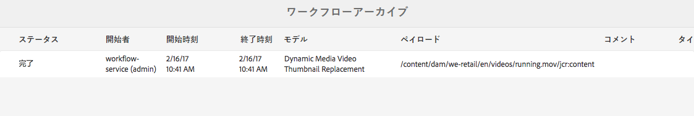

1. 中止またはエラーが発生したワークフロージョブに関する電子メール通知を受け取ることができます。これらの電子メール通知は、管理者が設定できます。詳しくは、[電子メール通知の設定](#configuring-e-mail-notifications)を参照してください。

<!-- EMAIL NOT AVAILABLE IN SKYLINE

#### Configuring e-mail notifications {#configuring-e-mail-notifications}

>[!NOTE]
>
>You may need administrative rights to access the **[!UICONTROL Tools]** menu.

How you configure notification depends on whether you want notifications for YouTube publishing jobs.

* For encoding jobs, you can access the configuration page for all AEM workflow email notifications at **[!UICONTROL Tools]** &gt; **[!UICONTROL Operations]** &gt; **[!UICONTROL Web Console]** and by searching for **[!UICONTROL Day CQ Workflow Email Notification Service]**. You can select or clear the check boxes for **[!UICONTROL Notify on Abort]** or **[!UICONTROL Notify on Complete]** accordingly.

For YouTube publishing jobs, do the following:

1. In AEM, tap **[!UICONTROL Tools]** &gt; **[!UICONTROL Workflow]** &gt; **[!UICONTROL Models]**.
1. On the Workflow Models page, select **[!UICONTROL Publish to YouTube]**, then tap **[!UICONTROL Edit]** on the toolbar.
1. Near the upper-right corner of the Publish to YouTube workflow page, tap **[!UICONTROL Edit]**.
1. Hover the mouse pointer on the YouTube Upload component, then tap once to display the inline toolbar.

   

1. On the inline toolbar, tap the Configuration icon (wrench). Click the **[!UICONTROL Arguments]** tab.

   

1. In the YouTube Upload Process - Step Properties dialog box, tap the **[!UICONTROL Arguments]** tab.

   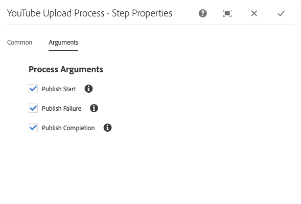

1. You can select or clear the following check boxes:

    * Publish Start
    * Publish Failure
    * Publish Completion - includes information on channels and URLs

   Clearing a check box means that you will not receive the specified email notification from the YouTube Publish workflow.

   >[!NOTE]
   >
   >These emails are specific to YouTube and are in addition to the generic workflow email notifications. As a result, you may receive two sets of email notification - the generic notification available in the **[!UICONTROL Day CQ Workflow Email Notification Service]** and one specific to YouTube depending on your configuration settings.

1. When you are finished, near the upper-right corner of the dialog box, tap the **[!UICONTROL Done]** icon (check mark).
1. On the Publish to YouTube workflow page, near the upper-right corner, tap **[!UICONTROL Sync]**.

-->

## ビデオレポートの表示 {#viewing-video-reports}

>[!NOTE]
>
>ビデオレポートを使用できるのは、Dynamic Media - ハイブリッドモードを実行している場合のみです。

ビデオレポートには、指定した期間に複数の集計指標が表示され、*公開された*個々のビデオと集計されたビデオが期待どおりに動作しているかを監視できます。以下のトップ指標データは、Webサイト全体で公開されたすべてのビデオに関して集計されます。

* ビデオ開始
* 完了率
* ビデオの平均視聴時間
* ビデオの合計視聴時間
* 訪問別ビデオ数

すべての公開済みビデオの表も表示されるので、ビデオ開始数の合計に基づいて、Web サイトで視聴された上位のビデオを追跡できます。**

リストのビデオ名をタップすると、ビデオのオーディエンス保持（ドロップオフ）レポートが折れ線グラフの形式で表示されます。このグラフには、ビデオ再生中の特定の瞬間におけるビュー数が表示されます。ビデオを再生すると、プレーヤーの時間インジケーターと同期して縦棒が表示されていきます。この折れ線グラフのデータが急激に下るところは、オーディエンスが関心をなくして再生を終了したところです。

ビデオが Adobe Experience Manager Dynamic Media 以外でエンコードされた場合、オーディエンス保持（ドロップオフ）グラフおよび表内の再生率データは利用できません。

>[!NOTE]
>
>トラッキングおよびレポートのデータは、Dynamic Media 独自のビデオプレーヤーと関連するビデオプレーヤープリセットの使用状況のみに基づいています。そのため、他のビデオプレーヤーによって再生されたビデオを追跡およびレポートすることはできません。

デフォルトでは、ビデオレポートを初めて入力すると、現在の月の最初から現在の月の日付で終わるビデオデータがレポートに表示されます。ただし、独自の日付範囲を指定することで、デフォルトの日付範囲を上書きできます。次にビデオレポートを開くと、指定した日付範囲が使用されます。

ビデオレポートの正常動作のために、ダイナミックメディアクラウドサービスの設定時に、レポートスイート ID が自動的に作成されます。そのときに、そのレポートスイート ID が発行サーバーにプッシュされ、アセットのプレビューの際に URL コピー機能で使用できるようになります。ただし、そのためには発行サーバーを事前にセットアップしておく必要があります。発行サーバーがセットアップされていない場合も、発行してビデオレポートを確認することはできますが、その際にはダイナミックメディアクラウド設定に戻って「**[!UICONTROL OK]**」をタップする必要があります。

ビデオレポートを表示するには：

1. AEM の左上隅にある AEM ロゴをタップしてから、左側のレールで&#x200B;**[!UICONTROL ツール]**（ハンマーのアイコン）／**[!UICONTROL アセット]**／**[!UICONTROL ビデオレポート]**&#x200B;をタップします。
1. ビデオレポートページで、次のいずれかの操作をおこないます。

   * Near the upper-right corner, tap the **[UICONTROL Refresh Video Report]** icon.
「更新」を使用する必要があるのは、レポートの最終日が今日の日付である場合のみです。これにより、前回レポートを実行した後に発生したビデオ追跡を確実に確認できます。

   * Near the upper-right corner, tap the **[UICONTROL Date Picker]** icon.
ビデオデータを表示する開始日と終了日の範囲を指定し、「**[!UICONTROL レポートを実行]**」をタップします。
   [トップの指標]グループボックスは、サイト全体の*公開済み*ビデオすべてに関する様々な集計測定値を識別します。

1. 上位の公開済みビデオを示した表で、ビデオ名をタップしてビデオを再生し、そのビデオのオーディエンス保持（ドロップオフ）レポートを表示します。

### Scene7 HTML5 ビューア SDK を使用して作成したビデオビューアに基づくビデオレポートの表示 {#viewing-video-reports-based-on-a-video-viewer-that-you-created-using-the-scene-hmtl-viewer-sdk}

ダイナミックメディアが提供する標準搭載のビデオビューアを使用している場合、または標準搭載のビデオビューアを基にカスタムビューアプリセットを作成した場合、ビデオレポートを表示するために追加の手順は必要ありません。ただし、Scene7 HTML5ビューアSDKに基づいて独自のビデオビューアを作成した場合は、次の手順を使用して、ビデオビューアがダイナミックメディアビデオレポートにトラッキングイベントを送信するようにします。

独自のビデオビューアを作成するには、Scene7 ビューアリファレンスと Scene7 HTML5 ビューア SDK を使用します。

詳しくは、[Scene7 ビューアリファレンスガイド](https://marketing.adobe.com/resources/help/en_US/s7/viewers_ref/index.html)を参照してください。

<!-- 

SDK ONLY AVAILABLE INTERNALLY NOW

Download the Scene7 HTML Viewer SDK from Adobe Developer Connection.

See [Adobe Developer Connection](https://help.adobe.com/en_US/scene7/using/WSef8d5860223939e2-43dedf7012b792fc1d5-8000.html).

-->

Scene7 HTML5 ビューア SDK を使用して作成したビデオビューアに基づいてビデオレポートを表示するには：

1. 公開済みビデオアセットの場所に移動します。
1. アセットのページの左上隅付近にある、ドロップダウンリストで「**[!UICONTROL ビューア（Vierwers）]**」を選択します。
1. 任意のビデオビューアプリセットを選択し、埋め込みコードをコピーします。
1. 埋め込みコード内の次の行を探します。

   `videoViewer.setParam("config2", "<value>");`

   このパラ `config2` メーターは、HTML5ビューアでの追跡を有効にします。 また、ビデオレポートの設定情報や、お客様固有のAdobe Analytics設定を含む、会社固有のプリセットでもあります。

   The correct value for the config2 parameter is found in both the **[!UICONTROL Embed Code]** and in the copy **[UICONTROL URL]** function. In the URL from the copy **[UICONTROL URL]** command, the parameter to look for is `&config2=<value>` . The value is almost always `companypreset`, but in some instances it can also be `companypreset-1`, `companypreset-2`, and so forth.

1. カスタムのビデオビューアコードで、次の操作をおこなって、ビューアページに AppMeasurementBridge.jsp を追加します。

   * 最初に、パラメータが必要かどうかを判断 `&preset` します。
パラメータ `config2` ーがで `companypreset`ある場合は、*不要です `&preset=parameter`。
その他 `config2` の場合は、プリセットパラメータをパラメータと同じに設定し `config2` ます。 例えば、AppMeasurmentBridge.jsp `config2=companypreset-2`のURL `&param2=companypreset-2` にを追加します。

   * 次に、AppMeasurementBridge.jspスクリプトを追加します。
      `<script language="javascript" type="text/javascript" src="https://s7d1.scene7.com/s7viewers/AppMeasurementBridge.jsp?company=robindallas&preset=companypreset-2"></script>`

1. 次の操作をおこなって、TrackingManager コンポーネントを作成します。

   * After calling `s7sdk.Utils.init();` create a TrackingManager instance to track events by adding the following:
      `var trackingManager = new s7sdk.TrackingManager();`

   * 次の操作を行って、コンポーネントを TrackingManager に接続します。
`s7sdk.Event.SDK_READY` イベントハンドラーで、追跡するコンポーネントを TrackingManager に関連付けます。例えば、コンポーネントが `videoPlayer`
      `trackingManager.attach(videoPlayer);`
を使用して、コンポーネントをtrackingManagerにアタッチします。 ページ上の複数のビューアを追跡するには、複数のトラッキングマネージャーコンポーネントを使用します。

   * 次を追加して、AppMeasurementBridgeオブジェクトを作成します。

      ```
      var appMeasurementBridge = new AppMeasurementBridge(); appMeasurementBridge.setVideoPlayer(videoPlayer);
      ```

   * 次を追加して、トラッキング関数を追加します。

      ```
      trackingManager.setCallback(appMeasurementBridge.track,
       appMeasurementBridge);
      ```
   appMeasurementBridge オブジェクトには組み込みのトラッキング関数があります。ただし、複数のトラッキングシステムやその他の機能をサポートするために、独自のトラッキング関数を作成することもできます。

   For more information, see *Using the TrackingManager Component* in the *Scene7 HTML5 Viewer SDK User Guide* available for download from [Adobe Developer Connection](https://help.adobe.com/en_US/scene7/using/WSef8d5860223939e2-43dedf7012b792fc1d5-8000.html).

## ビデオへのキャプションの追加 {#adding-captions-to-video}

キャプションを 1 つのビデオまたはアダプティブビデオセットに追加することにより、ビデオの提供先をグローバルマーケットまで広げることができます。キャプションを追加すると、言語ごとの音声の吹き替えの必要性、つまりネイティブスピーカーを使って音声を再録音する必要性がなくなります。ビデオは録画された言語で再生されます。外国語のサブタイトルが表示されるので、違う言語の視聴者も音声部分を理解できます。

聴覚障害者のためのクローズドキャプションを使用することで、キャプションによってアクセシビリティを大幅に向上させることもできます。

>[!NOTE]
>
>使用するビデオプレーヤーがキャプションの表示に対応する必要があります。

Dynamic Media には、キャプションファイルを JSON（JavaScript Object Notation）形式に変換する機能があります。このように変換できるので、JSON テキストを、ビデオの完全なトランスクリプトとして表示せずに Web ページに埋め込むことができます。この後、検索エンジンがコンテンツをクロールしてインデックスを作成できます。これにより、ビデオを検索しやすくなり、ビデオコンテンツの詳細がユーザーに提供されます。

URL で JSON 機能を使用する方法について詳しくは、Scene7 画像サービング API ヘルプの[静的コンテンツ（画像以外）の提供（英語）](https://marketing.adobe.com/resources/help/en_US/s7/is_ir_api/is_api/c_serving_static_nonimage_contents.html)を参照してください。**

**ビデオにキャプションまたはサブタイトルを追加するには**

1. サードパーティアプリケーションまたはサービスを使用して、ビデオキャプション／サブタイトルのファイルを作成します。

   WebVTT（Web Video Text Tracks）標準に従ってファイルを作成してください。キャプションファイルの拡張子は .vtt です。WebVTT キャプション標準をよく確認してください。

   [WebVTT：Web Video Text Tracks 形式（英語）](https://dev.w3.org/html5/webvtt/)を参照してください。

   Dynamic Media の外部でキャプション／サブタイトルのファイルを作成するための無料ツールや有料ツールがあります。例えば、スタイル設定なしの単純なビデオキャプションファイルを作成するには、次に示すキャプションの作成および編集用の無償オンラインツールを使用できます。

   [WebVTT Caption Maker](https://testdrive-archive.azurewebsites.net/Graphics/CaptionMaker/Default.html)

   よい結果を得るためには、このツールを Explorer 9 以上、Google Chrome、または Safari で使用してください。

   In the tool, in the **[!UICONTROL Enter URL of video file]** field, paste the copied URL of your video file and then click **[!UICONTROL Load**. See [Obtaining a URL for an Asset](/help/assets/dynamic-media/linking-urls-to-yourwebapplication.md#obtaining-a-url-for-an-asset) to get the URL to the video file itself which you can then paste into the **[!UICONTROL Enter URL of video file field]**. その後、Internet Explorer、Chrome、または Safari で、ビデオを再生できます。

   ここで、サイトの画面に表示される指示に従って、WebVTT ファイルを作成して保存します。終了したら、キャプションファイルの内容をコピーし、空のテキストエディターに貼り付けて、ファイル拡張子 .vtt を付けて保存します。

   >[!NOTE]
   >
   >複数言語のビデオサブタイトルを用意してグローバル対応する場合、WebVTT 標準では、サポート対象の言語ごとに個別の .vtt ファイルを作成して呼び出す必要があります。

   通常、VTT ファイルの名前はビデオファイルと同じにして、言語ロケール（-EN、-FR、-DE など）を追加します。そうしておくと、既存の Web コンテンツ管理システムを使用してビデオの URL を自動的に生成する際に役立ちます。

1. AEMで、WebVTTキャプションファイルをDAMにアップロードします。
1. Navigate to the *published* video asset that you want to associate with the caption file that you uploaded.

   URL をコピーするには、その前にアセットを公開しておく必要があります。****

   [アセットの公開](/help/assets/dynamic-media/publishing-dynamicmedia-assets.md)を参照してください。

1. 次のいずれかの操作をおこないます。

   * ポップアップビデオビューアエクスペリエンスの場合、「**[!UICONTROL URL]**」をタップします。URL ダイアログボックスで、URL を選択してクリップボードにコピーし、その URL を単純なテキストエディターに貼り付けます。コピーしたビデオのURLを次の構文で追加します。

      `&caption=<server_path>/is/content/<path_to_caption.vtt_file,1>`

      キャプション `,1` パスの末尾にあるをメモしておきます。 Immediately following the .vtt filename extension in the path, you have the option to enable (turn on) or disable (turn off) the closed caption button on the video player bar by setting to `,1` or `,0`, respectively.

   * For an embedded video viewer experience, tap **[!UICONTROL Embed Code]**. 埋め込みコードダイアログボックスで、埋め込みコードを選択してクリップボードにコピーし、単純なテキストエディターに貼り付けます。 コピーした埋め込みコードを次の構文で追加します。

      `videoViewer.setParam("caption","<path_to_caption.vtt_file,1>");`

      キャプション `,1` パスの末尾にあるをメモしておきます。 Immediately following the .vtt filename extension in the path, you have the option to enable (turn on) or disable (turn off) the closed caption button on the video player bar by setting to `,1` or `,0`, respectively.

## ビデオへのチャプターマーカーの追加 {#adding-chapter-markers-to-video}

1 つのビデオまたはアダプティブビデオセットにチャプターマーカーを追加すると、長編ビデオの視聴と操作が簡単になります。ビデオの再生中に、ビデオのタイムライン（ビデオスクラバーとも呼ばれる）上のチャプターマーカーをクリックするだけで、関心があるポイントや、新しいコンテンツ、デモ、チュートリアルなどにすぐに移動できます。

>[!NOTE]
>
>ビデオプレーヤーが、チャプターマーカーの使用をサポートしている必要があります。Dynamic Media ビデオプレーヤーは、チャプターマーカーをサポートしていますが、サードパーティのビデオプレーヤーは、チャプターマーカーを必ずしもサポートしているとは限りません。

必要であれば、ビデオビューアプリセットを使用するのではなく、チャプター機能を備えた独自のカスタムビデオビューアを作成して、ブランディングできます。チャプターナビゲーション機能を備えた独自の HTML5 ビューアの作成方法について詳しくは、『Adobe Scene Viewer SDK for HTML5』の「Customizing Behavior Using Modifiers」で `s7sdk.video.VideoPlayer` クラスと `s7sdk.video.VideoScrubber`7 クラスの説明を参照してください。Adobe Scene7 Viewer SDK は、[Adobe Developer Connection](https://help.adobe.com/en_US/scene7/using/WSef8d5860223939e2-43dedf7012b792fc1d5-8000.html) からダウンロードして入手できます。

 ビデオのチャプターリストを作成する方法は、キャプションを作成する方法とほとんど同じです。つまり、WebVTT ファイルを作成します。ただし、WebVTT キャプションファイルも使用する場合は、WebVTT ファイルと分けておく必要があります。キャプションとチャプターを 1 つの WebVTT ファイルにまとめることはできません。

 チャプターナビゲーション機能を備えた WebVTT ファイルを作成する際に使用するフォーマットの例として、次のサンプルを使用できます。

### ビデオチャプターナビゲーション機能を備えた WebVTT ファイル {#webvtt-file-with-video-chapter-navigation}

```xml
WEBVTT
Chapter 1
00:00.000 --> 01:04.364
The bicycle store behind it all.
Chapter 2
01:04.364 --> 02:00.944
Creative Cloud.
Chapter 3
02:00.944 --> 03:02.937
Ease of management for a working solution.
Chapter 4
03:02.937 --> 03:35.000
Cost-efficient access to rapidly evolving technology.
```

上記の例では、`Chapter 1` はキュー識別子で、オプションです。`00:00:000 --> 01:04:364` のキュー時間は、チャプターの開始時間と終了時間を、`00:00:000` という形式で指定しています。最後の 3 桁はミリ秒で、`000` のまま残しておくこともできます。The chapter title of `The bicycle store behind it all` is the actual description of the chapter’s contents. ユーザーが、ビデオのタイムラインのビジュアルキューポイントにマウスポインターを置くと、キュー識別子、開始キュー時間およびチャプタータイトルが、ビデオプレーヤー内にポップアップ表示されます。

 HTML5 ビデオビューアを使用するので、作成するチャプターファイルが WebVTT（Web Video Text Tracks）標準に準拠していることを確認してください。チャプターファイルの拡張子は .vtt です。WebVTT キャプション標準をよく確認してください。

 詳しくは、[WebVTT: The Web Video Text Tracks Format](https://dev.w3.org/html5/webvtt/) を参照してください。

**ビデオにチャプターマーカーを追加するには：**

1. この .vtt ファイルを UTF8 エンコーディングで保存して、チャプタータイトルテキストの文字レンディションに関する問題を回避します。

    一般に、チャプター VTT ファイルの名前には、ビデオファイルと同じ名前を付けて、名前の末尾にチャプターを追加します。そうしておくと、既存の Web コンテンツ管理システムを使用してビデオの URL を自動的に生成する際に役立ちます。
1. AEMで、WebVTTチャプターファイルをアップロードします。

   [アセットのアップロード](/help/assets/manage-digital-assets.md#uploading-assets)を参照してください。

1. 次のいずれかの操作をおこないます。

   <table>
     <tbody>
      <tr>
       <td>ポップアップビデオビューアの操作</td>
       <td>
       <ol>
       <li>Navigate to the <i>published </i>video asset that you want to associate with the chapter file that you uploaded. URL をコピーするには、その前にアセットを公開しておく必要があります。<i></i><i></i><a href="/help/assets/dynamic-media/publishing-dynamicmedia-assets.md">アセットの公開</a>を参照してください。</li>
       <li>ドロップダウンメニューで「ビューア」をクリックまたはタッ <strong>プします</strong>。</li>
       <li>左側のレールで、ビデオビューアプリセット名をタップまたはクリックします。 ビデオのプレビューが別のページで開きます。</li>
       <li>In the left rail, at the bottom, click <strong>URL</strong>.</li>
       <li>URLダイアログボックスで、URLを選択してクリップボードにコピーし、URLを単純なテキストエディターに貼り付けます。</li>
       <li><br /> コピーしたビデオのURLを次の構文と共に追加し、コピーしたURLとチャプターファイルに関連付けます。 <br /> <code>&navigation=<<i>full_copied_URL_path_to_chapter_file</i>.vtt></code><br /> </li>
       </ol> </td>
      </tr>
      <tr>
       <td>埋め込みビデオビューアの操作<br /> </td>
       <td>
       <ol>
       <li>Navigate to the <i>published </i>video asset that you want to associate with the chapter file that you uploaded. URL をコピーするには、その前にアセットを公開しておく必要があります。<i></i><i></i><a href="/help/assets/dynamic-media/publishing-dynamicmedia-assets.md">アセットの公開</a>を参照してください。</li>
       <li>ドロップダウンメニューで「ビューア」をクリックまたはタッ <strong>プします</strong>。</li>
       <li>左側のレールで、ビデオビューアプリセット名をタップまたはクリックします。 ビデオのプレビューが別のページで開きます。</li>
       <li>In the left rail, at the bottom, click <strong>Embed</strong>.</li>
       <li>埋め込みコードダイアログボックスで、コード全体を選択してクリップボードにコピーし、単純なテキストエディターに貼り付けます。</li>
       <li>ビデオの埋め込みコードを次の構文と共に追加し、コピーしたチャプターファイルのURLに関連付けます。<br /> <br /> <code>videoViewer.setParam("navigation","&lt;<i>full_copied_URL_path_to_chapter_file</i>.vtt&gt;"</code></li>
       </ol> </td>
      </tr>
     </tbody>
   </table>

<!--

## About video thumbnails {#about-video-thumbnails}

A video thumbnail is a reduced-size version of a video frame or an image asset representing the video to the customer. The thumbnail should serve to encourage a customer to click on the video.

All videos in AEM must have an associated thumbnail; you cannot delete a thumbnail without replacing it. By default, when you upload a video to AEM, the first frame is used as the thumbnail. However, you can customize the thumbnail for branding purposes or visual search, for example. When you customize a video thumbnail, you can either play the video and pause on the frame you want to use, or you can select an image asset that you have already uploaded and *published* in your digital asset manager.

Note that a custom video thumbnail image that you select from a video is not extracted and saved in the DAM as a separate and distinct asset. However, a custom video thumbnail that you select from an existing image asset is saved to the JCR. The path of the selected asset gets stored under the video asset's node as in the following example path:

`/content/dam/*<folder_name*>/<*video_name*>/jcr:content/manualThumbnail`

The ability to customize a video thumbnail is only available after you have applied a video profile to the folder where the video is located.

### Adding a custom video thumbnail {#adding-a-custom-video-thumbnail}

1. Be sure you have already done the following:

    * Created a folder for your video assets.
    * [Applied a video profile to the folder](/help/assets/dynamic-media/video-profiles.md#applying-a-video-profile-to-folders).

    * [Uploaded your videos to the folder](/help/assets/manage-video-assets.md#upload-and-preview-video-assets).

1. Navigate to an uploaded video asset whose thumbnail image you want to change.
1. In asset selection mode either from **[!UICONTROL List View]** or **[!UICONTROL Card View]**, tap the video asset.
1. On the toolbar, tap the **[!UICONTROL Properties** icon (a circle with an "i" in it).
1. On the video's Properties page, tap **[!UICONTROL Change Thumbnail]**.
1. On the Change Thumbnail page, do one of the following:

    * To use a frame from the video as the new thumbnail:

        * On the toolbar, tap **[!UICONTROL Select Frame from video]**.
        * Tap the Play button, then tap the Pause button on the frame you want to capture as the video's new thumbnail.

    * To use an image asset as the new thumbnail:

        * On the toolbar, tap **[!UICONTROL Select Thumbnail from Assets]**.
        * Tap **[!UICONTROL Select Thumbnail]**.
        * Navigate to a previously uploaded and published image asset you want to use. Note that the asset will automatically be resized to serve as a thumbnail image for the video.
        * Select the image asset, then tap **[!UICONTROL Select]**.

1. On the Change Thumbnail page, tap **[!UICONTROL Save Change]**.
1. On the video's Properties page, in the upper-right corner, tap **[!UICONTROL Save & Close]**.

-->

<!--

## About video thumbnails in Dynamic Media Hybrid mode{#about-video-thumbnails-in-dynamic-media-hybrid-mode}

You can choose from one of ten thumbnail images automatically generated by Dynamic Media to add to your video. The video player displays your selected thumbnail when a video asset is used with the Dynamic Media component in the authoring environment of AEM Sites, AEM Mobile, or AEM Screens. The thumbnail serves as a static picture that best represents the contents of your entire video and further encourages users to click the Play button.

Based on the total time of the video, Dynamic Media captures ten (default) thumbnail images at 1%, 11%, 21%, 31%, 41%, 51%, 61%, 71%, 81%, and 91% into the video. The ten thumbnails persist meaning that if you decide to choose a different thumbnail later on, you do not need to regenerate the series. You preview the ten thumbnail images and then select the one you want to use with your video. If you want to change to default you can use CRXDE Lite to configure the time interval that thumbnail images are generated. For example, if you only wanted to generate a series of four evenly spaced thumbnail images from your video, you can configure the interval time at 24%, 49%, 74%, and 99%.

Ideally, you can add a video thumbnail anytime after you upload your video but before you publish the video on your website.

If you prefer, you can choose to upload a custom thumbnail to represent your video instead of using a thumbnail generated by Dynamic Media. For example, you could create a custom thumbnail image that has the title of your video, an eye-catching opening image, or a very specific image captured from your video. The custom video thumbnail image that you upload should have a maximum resolution of 1280 x 720 pixels (minimum width of 640 pixels) and be no larger than 2MB.

See also [About video thumbnails](/help/assets/dynamic-media/video.md#about-video-thumbnails-in-dynamic-media-scene-mode).

-->

<!--

### Adding a video thumbnail {#adding-a-video-thumbnail}

1. Navigate to an uploaded video asset that you want to add a video thumbnail.
1. In asset selection mode either from the List View or the Card View, tap the video asset.
1. On the toolbar, tap the **[!UICONTROL View Properties]** icon (a circle with an "i" in it).
1. On the video's Properties page, tap **[!UICONTROL Change Thumbnail]**.
1. On the Change Thumbnail page, on the toolbar, tap **[!UICONTROL Select Frame]**.

   Dynamic Media generates a series thumbnail images from your video, based on the default time interval or time interval you customized.

1. Preview the generated thumbnail images, then select the one you want to add to your video.
1. Tap **[!UICONTROL Save Change]**.

   The video's thumbnail image is updated to use the thumbnail you selected. If you later decide to change the thumbnail image, you can return to the **[!UICONTROL Change Thumbnail]** page and select a new one.

   If you configured new default time intervals, or you uploaded a new video to replace the existing video, you will need to have Dynamic Media regenerate the thumbnails.

   See [Configuring the default time interval that video thumbnails are generated](#configuring-the-default-time-interval-that-video-thumbnails-are-generated).

-->

<!--

#### Configuring the default time interval that video thumbnails are generated {#configuring-the-default-time-interval-that-video-thumbnails-are-generated}

When you configure and save the new default time interval, your change automatically applies only to videos that you upload in the future. It does not automatically apply the new default to videos that you previously uploaded. For existing videos, you must regenerate the thumbnails.

See [Adding a video thumbnail](#adding-a-video-thumbnail).

**To configure the default time interval that video thumbnails are generated,**

1. In AEM, tap **[!UICONTROL Tools]** &gt; **[!UICONTROL General]** &gt; **[!UICONTROL CRXDE Lite]**.

1. In the CRXDE Lite page, in the directory panel on the left, navigate t `o etc/dam/imageserver/configuration/jcr:content/settings.`

   if the directory panel is not visible, you may need to tap the &gt;&gt; icon to the left of the Home tab.

1. On the lower-right panel, in the Properties tab, double-tap `thumbnailtime`.
1. In the Edit thumbnailtime dialog box, use the text fields to enter interval values as percentages.

    * Tap the plus sign (+) icon to add one or more interval value fields. You may need to scroll to the bottom of the dialog box to see the icon.
    * Tap the minus sign (-) icon to the right of an interval value field to delete it from the list.
    * Tap the up arrow icon and the down arrow icon to reorder the interval values.

1. Tap **[!UICONTROL OK]** to return to the Properties tab.
1. Near the upper-left corner of the CRXDE Lite page, tap **[!UICONTROL Save All]**, then tap the Back Home icon in the upper-left corner to return to AEM.

   See [Adding a video thumbnail.](#adding-a-video-thumbnail)

-->

<!--

### Adding a custom video thumbnail {#adding-a-custom-video-thumbnail-1}

These steps apply only to Dynamic Media running in Hybrid mode.

T**o add a custom video thumbnail**,

1. Navigate to an uploaded video asset that you want to add a custom video thumbnail.
1. In asset selection mode either from the List View or the Card View, tap the video asset.
1. On the toolbar, tap the **[!UICONTROL View Properties]** icon (a circle with an "i" in it).
1. On the video's Properties page, tap **[!UICONTROL Change Thumbnail]**.
1. On the Change Thumbnail page, on the toolbar, tap **[!UICONTROL Upload New Thumbnail]**.
1. Navigate to a thumbnail image you want to use, select it, then tap **[!UICONTROL Open]** to begin uploading the image into AEM. Following the upload, be sure you publish the image.
1. After you have successfully uploaded and published the image, in the Change Thumbnail page, tap **[!UICONTROL Save Changes]**.

   The custom thumbnail is added to your video.

-->
