# Dynamic Media でのセレクターの操作 {#working-with-selectors}

インタラクティブ画像、インタラクティブビデオ、カルーセルバナーを操作するときは、アセットを選択し、ホットスポットや画像マップのリンク先となるサイトや商品を選択します。画像セット、スピンセット、マルチメディアセットを操作するときは、アセットセレクターでアセットも選択します。

ここでは、商品、サイト、アセットのセレクターの使用方法について説明し、セレクターでの参照、フィルター処理、ソートの機能についても説明します。

セレクターを使用するのは、カルーセルセットを作成し、ホットスポットと画像マップを追加し、インタラクティブビデオとインタラクティブ画像を作成するときです。

例えば、このカルーセルバナーでは、商品セレクターを使用するのは、ホットスポットまたは画像マップをクイックビューページにリンクする場合です。サイトセレクターを使用するのは、ホットスポットまたは画像マップをハイパーリンクにリンクする場合です。アセットセレクターを使用するのは新しいスライドを作成する場合です。

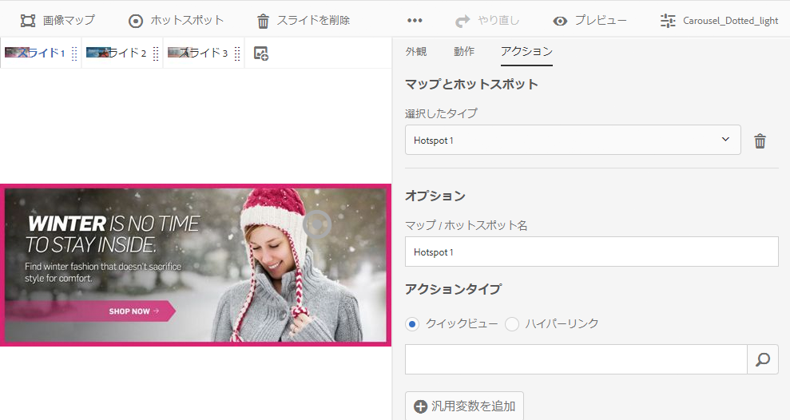

ホットスポットまたは画像マップのリンク先を（手動で入力せずに）選択するときに、セレクターを使用します。サイトセレクターを使用できるのは AEM Sites ユーザーのみです。商品セレクターには AEM Commerce も必要です。

## Dynamic Media での商品の選択 {#selecting-products}

商品セレクターを使用して商品を選択するのは、ホットスポットまたは画像マップで商品カタログの特定の商品のクイックビューを提供しようとするときです。

1. カルーセルセット、インタラクティブ画像、インタラクティブビデオのいずれかに移動し、「**[!UICONTROL アクション]**」タブ（ホットスポットまたは画像マップを定義した場合のみ選択できる）をタップします。

   商品セレクターは、「**[!UICONTROL アクションタイプ]**」領域にあります。

   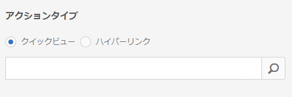

1. **[!UICONTROL 商品セレクター]**&#x200B;アイコン（虫眼鏡）をタップし、カタログの商品に移動します。

   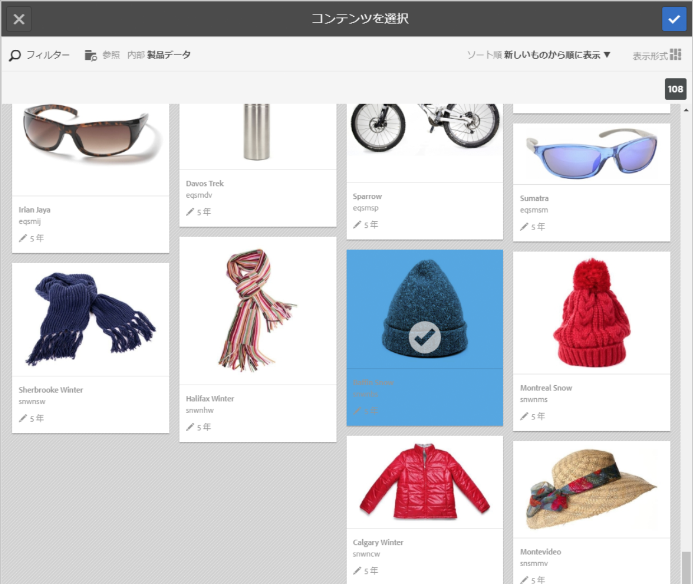

   「**[!UICONTROL フィルター]**」をタップして、キーワードを入力したりタグを選択したりすると、キーワードまたはタグでフィルター処理することもできます。

   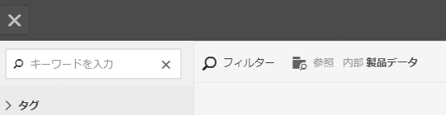

   「**[!UICONTROL 参照]**」をタップして別のフォルダーに移動することで、AEM が商品データを参照する場所を変更できます。

   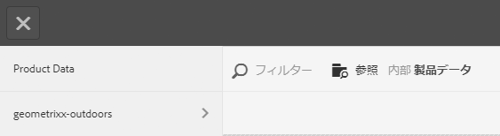

   「**[!UICONTROL ソート順]**」をタップして、AEM で新しい順に表示するか古い順に表示するかを変更します。

   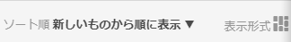

   「**[!UICONTROL 表示形式]**」をタップして、商品の表示形式（**[!UICONTROL リスト表示]**&#x200B;または&#x200B;**[!UICONTROL カード表示]**）を変更します。

   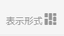

1. 商品が選択されると、商品のサムネールと名前がフィールドに設定されます。

   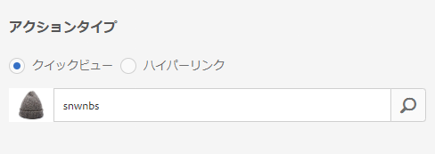

1. **[!UICONTROL プレビュー]**&#x200B;モードでは、ホットスポットか画像マップをタップして、クイックビューの表示内容を確認できます。

   

## Dynamic Media でのサイトの選択 {#selecting-sites}

サイトセレクターを使用して Web ページを選択するのは、ホットスポットまたは画像マップを、AEM Sites で管理される Web ページにリンクしようとするときです。

1. カルーセルセット、インタラクティブ画像、インタラクティブビデオのいずれかに移動し、「**[!UICONTROL アクション]**」タブ（ホットスポットまたは画像マップを定義した場合のみ選択できる）をタップします。

   サイトセレクターは、「**[!UICONTROL アクションタイプ]**」領域にあります。

   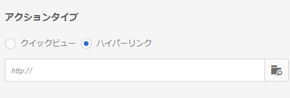

1. **[!UICONTROL サイトセレクター]**&#x200B;アイコン（フォルダーと虫眼鏡）をタップし、ホットスポットまたは画像マップのリンク先となる AEM Sites 内のページに移動します。

   

1. サイトが選択されると、そのパスがフィールドに設定されます。

   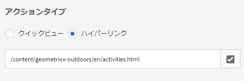

1. **[!UICONTROL プレビュー]**&#x200B;モードでは、ホットスポットまたは画像マップをタップすると、指定した AEM サイトページに移動します。

## Dynamic Media でのアセットの選択 {#selecting-assets}

このセレクターで、カルーセルバナー、インタラクティブビデオ、画像セット、混在メディアセット、スピンセットで使用する画像を選択します。インタラクティブビデオでは、「**[!UICONTROL コンテンツ]**」タブの「**[!UICONTROL アセットを選択]**」をタップすると、アセットセレクターを使用できます。カルーセルセットでは、新しいスライドを作成するときにアセットセレクターを使用できます。画像セット、混在メディアセット、スピンセットでは、新しい画像セット、混在メディアセット、スピンセットをそれぞれ作成するときに、アセットセレクターを使用できます。

詳しくは、[アセットピッカー](/help/assets/search-assets.md#assetselector)を参照してください。

1. カルーセルセットに移動して、新しいスライドを作成します。または、インタラクティブビデオに移動して、「**[!UICONTROL コンテンツ]**」タブでアセットを選択します。あるいは、混在メディアセット、画像セット、スピンセットのいずれかを作成します。
1. **[!UICONTROL アセットセレクター]**&#x200B;アイコン（フォルダーと虫眼鏡）をタップし、アセットに移動します。

   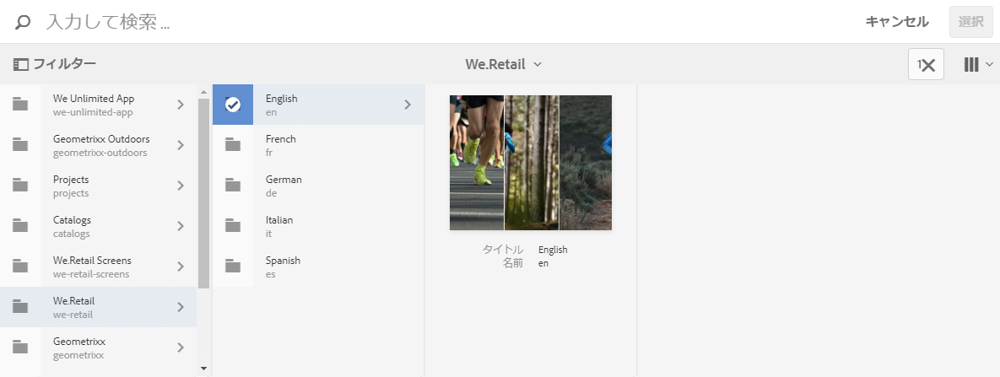

   「**[!UICONTROL フィルター]**」をタップして、キーワードを入力したり条件を追加したりすると、キーワードまたはタグでフィルター処理することもできます。

   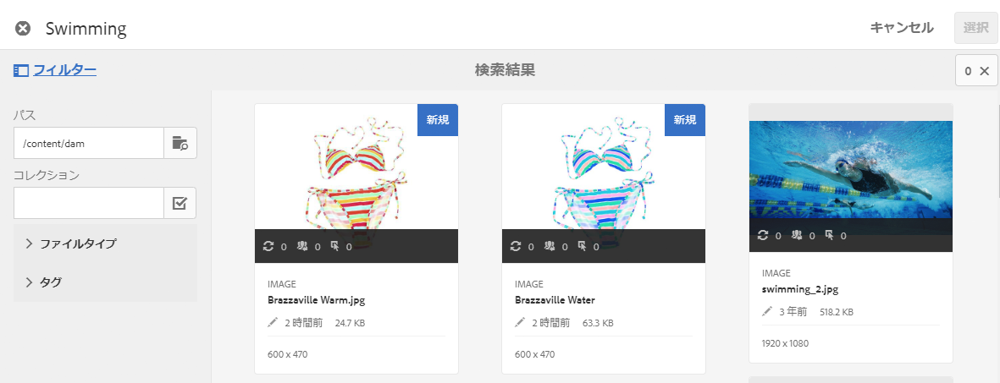

   「**[!UICONTROL パス]**」フィールドで別のフォルダーに移動して、アセットを参照する場所を変更できます。

   コレクション内のアセットのみを検索するには、「**[!UICONTROL コレクション]**」をタップします。

   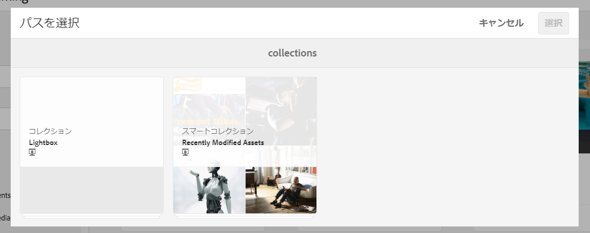

   「**[!UICONTROL 表示形式]**」をタップして、商品の表示形式（**[!UICONTROL リスト表示]**、**[!UICONTROL 列表示]**、**[!UICONTROL カード表示]**&#x200B;のいずれか）を変更します。

   

1. チェックマークをタップしてアセットを選択します。アセットが表示されます。

   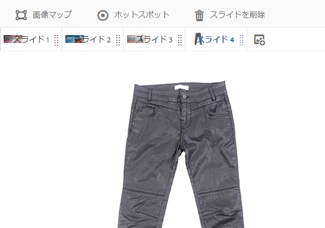
-->
