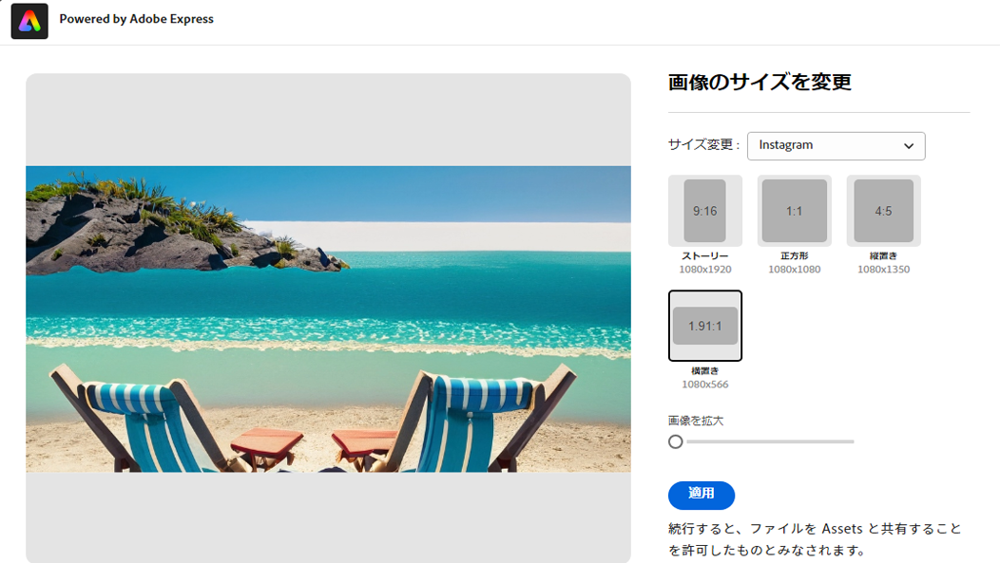
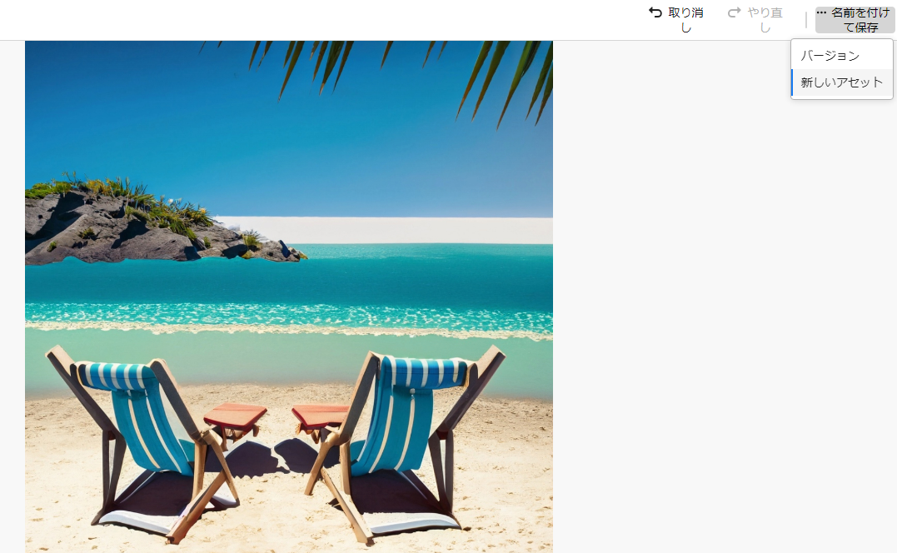
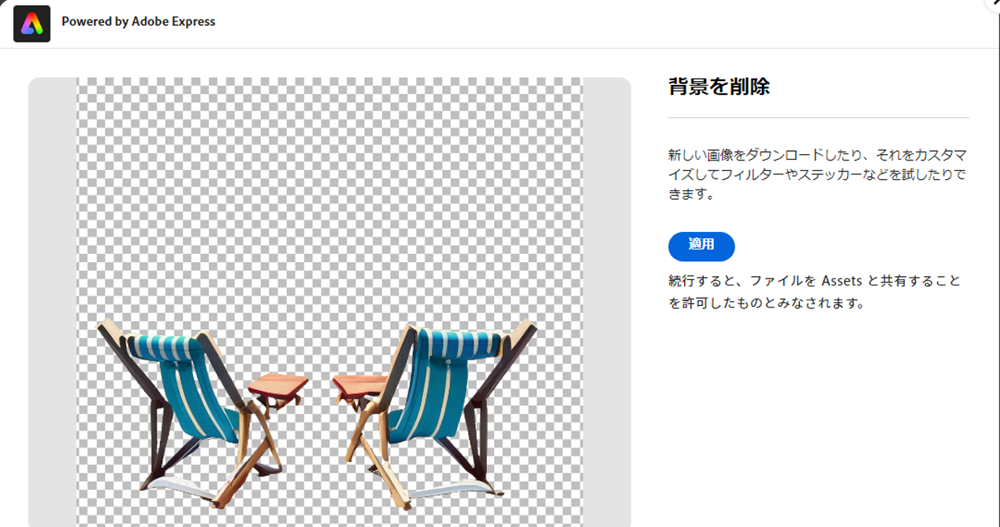
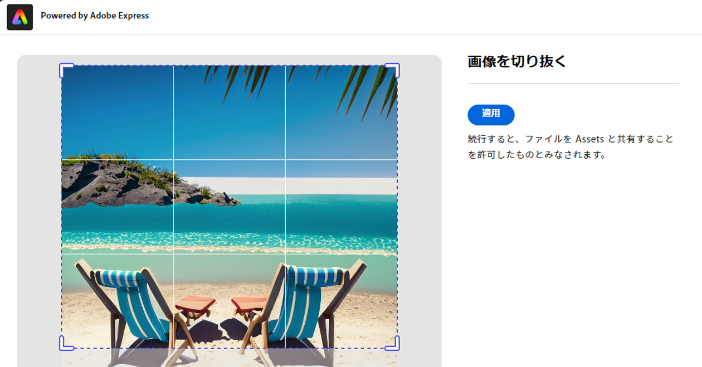
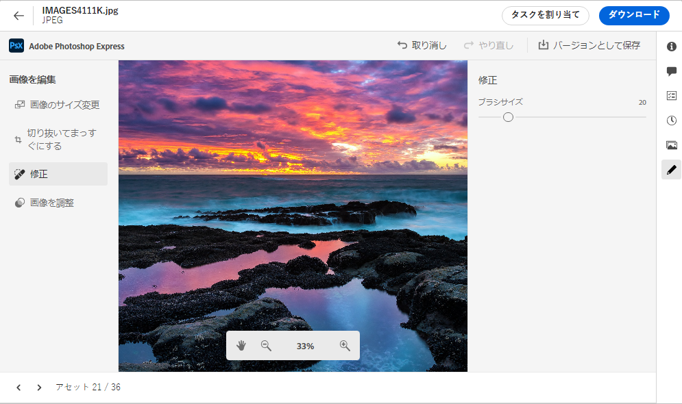
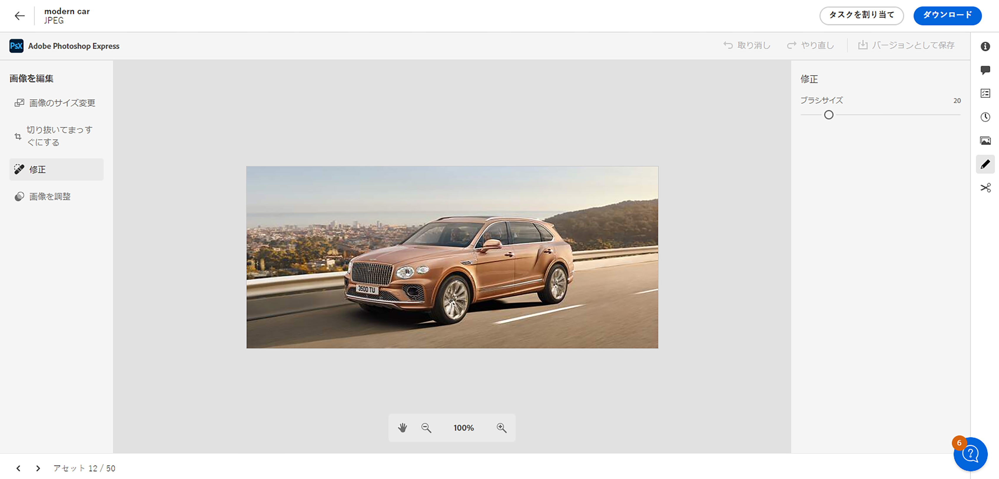
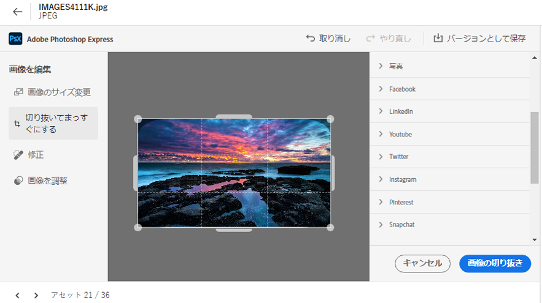
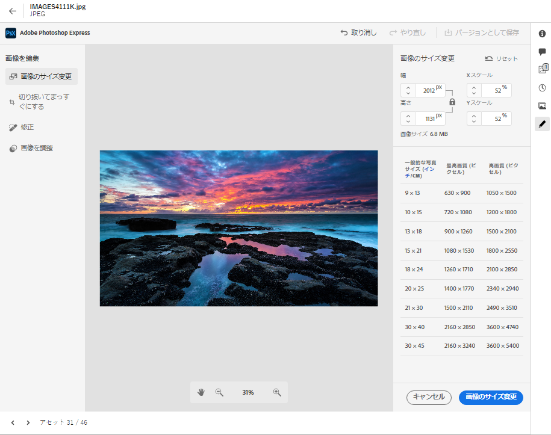
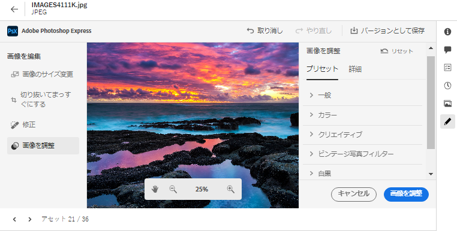

# [!DNL Assets view] での画像の編集 {#edit-images-in-assets-view}

アセットビュー UI では、UI に統合された Adobe Express を活用した基本的な画像編集が可能です。この編集には、サイズ変更、背景の削除、切り抜き、JPEG 形式と PNG 形式間の変換が含まれます。また、アセットビュー UI に埋め込まれた Adobe Express インターフェイスを通じて高度な編集を行うこともできます。

画像の編集後、新しい画像を新しいバージョンとして保存できます。 バージョン管理により、必要に応じて後で元のアセットに戻すことができます。 画像を編集するには、[プレビューを開き](https://experienceleague.adobe.com/ja/docs/experience-manager-assets-essentials/help/navigate-view#preview-assets)、「**画像を編集**」をクリックします。

>[!NOTE]
>
>[!DNL Adobe Express] を使用すると、PNG および JPEG ファイルタイプの画像を編集できます。

<!--The editing actions that are available are Spot healing, Crop and straighten, Resize image, and Adjust image.-->

## 画像の編集 {#edit-image}

[アセットビュー](https://experience.adobe.com/#/assets)のリンクを使用して適切なリポジトリを選択し、アセットビュー UI に移動します。アクセス権を取得するには、組織の管理者にお問い合わせください。
その他の参照情報については、[Adobe Experience Manager Assets ビューの基本を学ぶ](https://experienceleague.adobe.com/ja/docs/experience-manager-cloud-service/content/assets/assets-view/get-started-assets-view)、[アセットビューのユーザーインターフェイスについて](https://experienceleague.adobe.com/ja/docs/experience-manager-cloud-service/content/assets/assets-view/navigate-assets-view#understand-interface-navigation)、および [アセットビューのユースケース](https://experienceleague.adobe.com/ja/docs/experience-manager-cloud-service/content/assets/assets-view/get-started-assets-view#use-cases)を参照してください。
<!--
>[!CONTEXTUALHELP]
>id="assets_express_integration"
>title="Adobe Express Integration"
>abstract="Easy and intuitive image-editing tools powered by Adobe Express available directly within AEM Assets to increase content reuse and accelerate content velocity."-->

### Adobe Express を使用したアセットビューでの画像編集 {#edit-image-on-assets-view-using-adobe-express}

アセットビューに移動したら、「**アセット**」をクリックし、画像を選択して、上部のパネルから「**編集**」をクリックします。新しい画面には、サイズ変更、背景の削除、切り抜き、JPEG 形式と PNG 形式間の変換など、Adobe Express を活用した使用可能な編集オプションが表示されます。

#### 画像のサイズ変更 {#resize-image-using-express}

画像を特定のサイズに変更するのが一般的なユースケースです。 アセットビューでは、特定の写真サイズに対応する新しい解像度を事前に計算し、一般的な写真サイズに合わせて画像サイズをすばやく変更できます。 アセットビューを使用して画像サイズを変更するには、次の手順に従います。

1. 左側のパネルから「**画像サイズを変更**」をクリックします。ダイアログボックスに、Adobe Express を活用した画像のサイズ変更機能が表示されます。
1. サイズ変更ドロップダウンリストから適切なソーシャルメディアプラットフォームを選択し、表示されるオプションから画像サイズを選択します。
1. 必要に応じて、「**画像の拡大・縮小**」フィールドを使用して画像を拡大・縮小します。
1. 「**[!UICONTROL 適用]**」をクリックし、変更を適用します。
   

   編集した画像はダウンロードできます。 編集したアセットを同じアセットの新しいバージョンとして保存するか、新しいアセットとして保存することができます。
   

#### 背景を削除 {#remove-background-using-express}

次の手順に従って、画像から背景を削除できます。

1. 左側のパネルから「**背景を削除**」をクリックします。 Experience Manager Assets では、背景のない画像が表示されます。
1. 「**[!UICONTROL 適用]**」をクリックし、変更を適用します。
   

   編集した画像はダウンロードできます。 編集したアセットを同じアセットの新しいバージョンとして保存するか、新しいアセットとして保存することができます。

#### 画像を切り抜き {#crop-image-using-express}

埋め込まれた [!DNL Adobe Express] クイックアクションを使用すると、画像を完璧なサイズに簡単に変換できます。

1. 左側のパネルから「**[!UICONTROL 画像の切り抜き]**」をクリックします。
2. 画像の隅にあるハンドルをドラッグして、目的の切り抜きを作成します。
3. 「**[!UICONTROL 適用]**」をクリックします。
   
切り抜いた画像はダウンロードできます。 編集したアセットを同じアセットの新しいバージョンとして保存するか、新しいアセットとして保存することができます。

#### JPEG を PNG に変換 {#convert-image-types-using-express}

Adobe Express を使用すると、JPEG 画像形式と PNG 画像形式間ですばやく変換できます。 以下の手順を実行します。

1. 左側のペインで「**JPEG から PNG**」または「**PNG から JPEG**」をクリックします。
   <!---->
1. 「**[!UICONTROL ダウンロード]**」をクリックします。

#### 制限事項 {#limitations-adobe-express}

* サポートされる画像解像度：最小 - 50 ピクセル、最大 - ディメンションあたり 6000 ピクセル。
* サポートされるファイルの最大サイズ：17 MB。

### Adobe Express 埋め込みエディターでの画像編集 {#edit-images-in-adobe-express-embedded-editor}

Express の使用権限を持つユーザーは、アセットビュー内の Express 埋め込みエディターを使用して、コンテンツを簡単に編集し、Adobe Firefly から GenAI を使用して新しいコンテンツを作成できます。 この機能により、コンテンツの再利用が高まり、コンテンツベロシティが加速されます。また、定義済みの要素を使用して、アセットの見栄えを良くしたり、数回クリックするだけで画像を編集するクイックアクションを実行したりすることもできます。

[!DNL Adobe Express] 埋め込みエディターを使用して画像を編集するには、次の手順に従います。

1. [AEM Assets ビュー](https://experience.adobe.com/#/assets)のリンクを使用し、適切なリポジトリを選択し、AEM Assets ビューに移動します。
1. 「**Assets**」をクリックし、フォルダーを入力して画像を選択します。
1. 「**Adobe Express で開く**」をクリックします。 画像が Express キャンバスで開きます。
1. 画像に必要な編集を行います。
1. プロジェクトでさらにページを追加する必要がある場合は、「**追加**」をクリックし、アセットを選択します。次に、フォルダーを入力し、キャンバスページに取り込む画像を選択して、画像に必要な編集を行います。
1. 1 つ以上のアセットを保存するには、「**保存**」をクリックします。保存ダイアログボックスに、保存オプションが表示されます。保存オプションを選択するには、要件に合わせて、次のいずれかの手順に従います。
   1. 単一ページを保存するには、「**バージョンとして保存**」をクリックして、画像を新しいバージョンとして（元の形式を保持して）書き出し、同じフォルダーに保存します。

   1. 単一ページを保存するには、「**新しいアセットとして保存**」をクリックして、アセットを異なる形式に書き出し、新しいアセットとして任意のフォルダーに保存します。

   1. 複数のページから単一ページを保存するには、「**バージョンとして保存**」をクリックして、元の形式で元の場所にアセットを保存します。

   1. 複数のページを保存する場合または複数のページの中から単一ページを保存するには、「**新しいアセットとして保存**」をクリックします。このアクションにより、単一または複数のアセットを任意のフォルダーに書き出し、元の形式または別の形式で新しいアセットとして保存できます。

1. 保存ダイアログボックスで、次の手順を実行します。
   1. 「**名前を付けて保存**」フィールドにファイルの名前を入力します。
   1. 宛先フォルダーを選択します。
   1. オプション：プロジェクトまたはキャンペーンの名前、キーワード、チャネル、時間枠、地域などの詳細を指定します。
1. 「**バージョンとして保存**」または「**新しいアセットとして保存**」をクリックしてアセットを保存します。

#### Express エディターでの画像編集の制限事項 {#limitations-of-editing-images-in-the-express-editor}

* サポートされているファイルタイプ：JPEG または PNG。
* サポートされるファイルの最大サイズ：40 MB。
* サポートされている幅と高さの範囲：50～8000 ピクセル。
* ページをリロードすると、ソースフォルダーに最新の保存済みアセットが表示されます。

### Adobe Express を使用した新しいアセットの作成 {#create-new-embedded-editor}

[!DNL Assets view] では、[!DNL Adobe Express] 埋め込みエディターを使用して、新しいテンプレートを最初から作成できます。 [!DNL Adobe Express] を使用して新しいアセットを作成するには、次の手順を実行します。

1. **[!UICONTROL マイワークスペース]**&#x200B;に移動し、上部に表示される Adobe Express バナー内の「**[!UICONTROL 作成]**」をクリックします。 [!DNL Adobe Express] の空白のキャンバスが [!DNL Assets view] ユーザーインターフェイス内に表示されます。
1. [テンプレート](https://helpx.adobe.com/jp/express/using/work-with-templates.html)を使用してコンテンツを作成します。 それ以外の場合は、**[!UICONTROL 自分のアイテム]**&#x200B;に移動して既存のコンテンツを変更します。
1. 編集が完了したら、「**[!UICONTROL 保存]**」をクリックします。
1. 作成したアセットの宛先パスを指定し、「**[!UICONTROL 新しいアセットとして保存]**」をクリックします。

#### 制限事項 {#limitations}

* 変更できるのは、`JPEG` および `PNG` 形式タイプの画像のみです。
* アセットサイズは 40 MB 未満にする必要があります。
* 画像は、`PDF`、`JPEG` または `PNG` 形式で保存できます。

<!--
## Edit images using [!DNL Adobe Photoshop Express] {#edit-using-photoshop-express}

<!--
After editing an image, you can save the new image as a new version. Versioning helps you to revert to the original asset later, if needed. To edit an image, [open its preview](navigate-assets-view.md#preview-assets) and click **[!UICONTROL Edit Image]**  from the rail on the right.

*Figure: The options to edit images are powered by [!DNL Adobe Photoshop Express].*
-->
<!--
### Touch up images {#spot-heal-images-using-photoshop-express}

If there are minor spots or small objects on an image, you can edit and remove the spots using the spot healing feature provided by Adobe Photoshop.

The brush samples the retouched area and makes the repaired pixels blend seamlessly into the rest of the image. Use a brush size that is only slightly larger than the spot you want to fix.

<!-- 
TBD: See if we should give backlinks to PS docs for these concepts.
For more information about how Spot Healing works in Photoshop, see [retouching and repairing photos](https://helpx.adobe.com/jp/photoshop/using/retouching-repairing-images.html). 
-->
<!-- 
### Crop and straighten images {#crop-straighten-images-using-photoshop-express}

Using the crop and straighten option that you can do basic cropping, rotate image, flip it horizontally or vertically, and crop it to dimensions suitable for popular social media websites.

To save your edits, click **[!UICONTROL Crop Image]**. After editing, you can save the new image as a version.

Many default options let you crop your image to the best proportions that fit various social media profiles and posts.

### Resize image {#resize-image-using-photoshop-express}

You can view the common photo sizes in centimeters or inches to know the dimensions. By default, the resizing method retains the aspect ratio. To manually override the aspect ratio, click .

Enter the dimensions and click **[!UICONTROL Resize Image]** to resize the image. Before you save the changes as a version, you can either undo all the changes done before saving by clicking [!UICONTROL Undo] or you can change the specific step in the editing process by clicking [!UICONTROL Revert].

### Adjust image {#adjust-image-using-photoshop-express}

[!DNL Assets view] lets you adjust the color, tone, contrast, and more, with just a few clicks. Click **[!UICONTROL Adjust image]** in the edit window. The following options are available in the right sidebar:

* **Popular**: [!UICONTROL High Contrast & Detail], [!UICONTROL Desaturated Contrast], [!UICONTROL Aged Photo], [!UICONTROL B&W Soft], and [!UICONTROL B&W Sepia Tone].
* **Color**: [!UICONTROL Natural], [!UICONTROL Bright], [!UICONTROL High Contrast], [!UICONTROL High Contrast & Detail], [!UICONTROL Vivid], and [!UICONTROL Matte].
* **Creative**: [!UICONTROL Desaturated Contrast], [!UICONTROL Cool Light], [!UICONTROL Turquoise & Red], [!UICONTROL Soft Mist], [!UICONTROL Vintage Instant], [!UICONTROL Warm Contrast], [!UICONTROL Flat & Green], [!UICONTROL Red Lift Matte], [!UICONTROL Warm Shadows], and [!UICONTROL Aged Photo].
* **B&W**: [!UICONTROL B&W Landscape], [!UICONTROL B&W High Contrast], [!UICONTROL B&W Punch], [!UICONTROL B&W Low Contrast], [!UICONTROL B&W Flat], [!UICONTROL B&W Soft], [!UICONTROL B&W Infrared], [!UICONTROL B&W Selenium Tone], [!UICONTROL B&W Sepia Tone], and [!UICONTROL B&W Split Tone].
* **Vignetting**: [!UICONTROL None], [!UICONTROL Light], [!UICONTROL Medium], and [!UICONTROL Heavy].

<!--
TBD: Insert a video of the available social media options.
-->

### 次の手順 {#next-steps}

* アセットビューのユーザーインターフェイスの「[!UICONTROL フィードバック]」オプションを使用して製品に関するフィードバックを提供する。

* 右側のサイドバーにある「[!UICONTROL このページを編集]」  または「[!UICONTROL イシューを記録]」  を使用してドキュメントのフィードバックを提供する。

* [カスタマーケア](https://experienceleague.adobe.com/ja?support-solution=General&lang=ja#support)に問い合わせる

>[!MORELIKETHIS]
>
>* [Adobe Express のクイックアクション](https://helpx.adobe.com/jp/express/using/resize-image.html)
>* [アセットのバージョン履歴を表示](navigate-assets-view.md)
