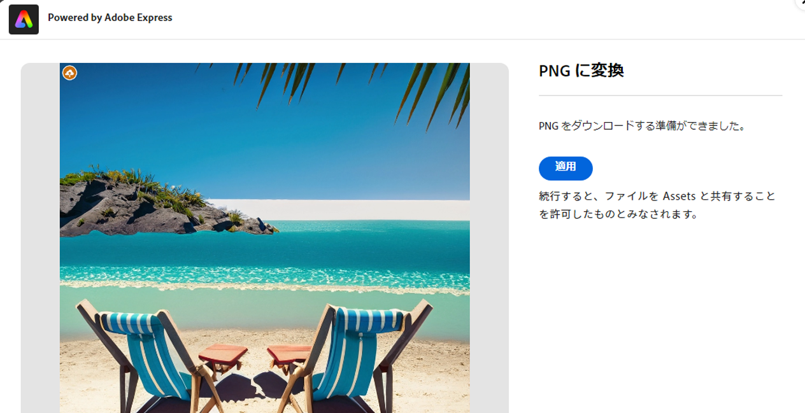

# [!DNL Assets view] での画像の編集  {#edit-images}

[!DNL Assets view] は、を利用してわかりやすい編集オプションを提供します。 [!DNL Adobe Express] および [!DNL Adobe Photoshop Express]. 次を使用して使用可能な編集アクション： [!DNL Adobe Express] は、画像のサイズ変更、背景の削除、画像の切り抜き、およびJPEGの PNG への変換です。

画像の編集後、新しい画像を新しいバージョンとして保存できます。バージョン管理を使用すると、必要に応じて後で元のアセットに戻すことができます。画像を編集するには、 [プレビューを開く](/help/assets/navigate-assets-view.md) をクリックします。 **[!UICONTROL 画像を編集]**.

>[!NOTE]
>
>PNG および画像ファイルタイプの画像は、次を使用してJPEGできます。 [!DNL Adobe Express].

<!--The editing actions that are available are Spot healing, Crop and straighten, Resize image, and Adjust image.-->

## 「編集」Adobe Express {#edit-using-express}

>[!CONTEXTUALHELP]
>id="assets_express_integration"
>title="Adobe Express の統合"
>abstract="AEM Assets 内で直接使用できる Adobe Express を活用した、簡単で直感的な画像編集ツールにより、コンテンツの再利用性を高め、コンテンツの速度を向上させます。"

### 画像のサイズ変更 {#resize-image-using-express}

画像を特定のサイズに変更するのが一般的なユースケースです。[!DNL Assets view] では、特定の写真サイズに対応する新しい解像度を事前に計算しておくことで、一般的な写真サイズに合わせて画像のサイズをすばやく変更できます。を使用して画像のサイズを変更するには [!DNL Assets view]、次の手順に従います。

1. 画像を選択し、 **編集**.
2. クリック **[!DNL Resize Image]** 左側のウィンドウで使用できるクイックアクションから。
3. 次の中から適切なソーシャルメディアプラットフォームを選択します。 **[!UICONTROL サイズ変更]** 」ドロップダウンリストから選択し、表示されるオプションから画像サイズを選択します。
4. 必要に応じて、 **[!UICONTROL 画像の拡大・縮小]** フィールドに入力します。
5. クリック **[!DNL Apply]** 変更を適用します。
   

   編集した画像をダウンロードできます。 編集したアセットを同じアセットの新しいバージョンとして保存するか、新しいアセットとして保存することができます。
   

### 背景を削除 {#remove-background-using-express}

以下に示すように、簡単な手順で画像から背景を削除できます。

1. 画像を選択し、 **編集**.
2. クリック **[!DNL Remove Background]** 左側のウィンドウで使用できるクイックアクションから。 Experience Manager Assetsは、背景のない画像を表示します。
3. クリック **[!DNL Apply]** 変更を適用します。
   

   編集した画像をダウンロードできます。 編集したアセットを同じアセットの新しいバージョンとして保存するか、新しいアセットとして保存することができます。

### 画像の切り抜き {#crop-image-using-express}

埋め込み機能を使用すると、画像を最適なサイズに簡単に変換できます [!DNL Adobe Express] クイックアクション。

1. 画像を選択し、 **編集**.
2. クリック **[!DNL Crop Image]** 左側のウィンドウで使用できるクイックアクションから。
3. 画像の隅にあるハンドルをドラッグして、目的の切り抜きを作成します。
4. 「**[!DNL Apply]**」をクリックします。
   
切り抜いた画像をダウンロードできます。 編集したアセットを同じアセットの新しいバージョンとして保存するか、新しいアセットとして保存することができます。

### JPEGを PNG に変換 {#convert-jpeg-to-png-using-express}

Adobe Expressを使用すると、JPEG画像を PNG 形式にすばやく変換できます。 以下の手順を実行します。

1. 画像を選択し、 **編集**.
2. クリック **[!DNL JPEG to PNG]** 左側のウィンドウで使用できるクイックアクションから。
   
3. 「**[!UICONTROL ダウンロード]**」をクリックします。

### 制限事項 {#limitations-adobe-express}

* サポートされる画像解像度：最小 — 50 ピクセル、最大 — 6000 ピクセル/サイズ

* サポートされる最大ファイルサイズ： 17 MB

## 次を使用して画像を編集： [!DNL Adobe Photoshop Express] {#edit-using-photoshop-express}

<!--
After editing an image, you can save the new image as a new version. Versioning helps you to revert to the original asset later, if needed. To edit an image, [open its preview](//help/navigate-assets-view.md#preview-assets) and click **[!UICONTROL Edit Image]**  from the rail on the right.

*Figure: The options to edit images are powered by [!DNL Adobe Photoshop Express].*
-->

### 画像のスポット修復 {#spot-heal-images-using-photoshop-express}

画像に小さな欠点や小さなオブジェクトがある場合は、Adobe Photoshop のスポット修復機能を利用して、その欠点を編集および削除できます。

ブラシが、リタッチした領域をサンプリングし、修復したピクセルを画像の残りの部分にシームレスにブレンドします。修正する部分よりもわずかに大きいブラシサイズを使用します。

<!-- 
TBD: See if we should give backlinks to PS docs for these concepts.
For more information about how Spot Healing works in Photoshop, see [retouching and repairing photos](https://helpx.adobe.com/photoshop/using/retouching-repairing-images.html). 
-->

### 画像の切り抜きと角度補正 {#crop-straighten-images-using-photoshop-express}

基本的な切り抜き、画像の回転、水平方向または垂直方向の反転、人気のある Social メディア Web サイトに適したサイズに切り抜くことができる切り抜きと直線化オプションを使用します。

編集内容を保存するには、「**[!UICONTROL 画像を切り抜き]**」をクリックします。編集後、新しい画像をバージョンとして保存できます。

多くのデフォルトオプションを使用すると、様々なソーシャルメディアのプロファイルや投稿に合わせて画像を最適な比率に切り抜くことができます。

### 画像のサイズ変更 {#resize-image-using-photoshop-express}

一般的な写真サイズをセンチまたはインチ単位で表示して、サイズを確認できます。デフォルトでは、サイズ変更時に縦横比が保持されます。縦横比を手動で上書きするには、 をクリックします。

サイズを入力し、「**[!UICONTROL イメージをサイズ変更]**」をクリックして画像のサイズを変更します。変更内容をバージョンとして保存する前に、「[!UICONTROL 取り消し]」をクリックして保存前に行ったすべての変更を取り消すか、「[!UICONTROL 元に戻す]」をクリックして編集プロセスの特定のステップを変更することができます。

### 画像の調整 {#adjust-image-using-photoshop-express}

[!DNL Assets view] では、数回クリックするだけでカラー、トーン、コントラストなどを調整できます。編集ウィンドウで「**[!UICONTROL 画像を調整]**」をクリックします。右側のサイドバーでは、次のオプションを使用できます。

* **一般的**：[!UICONTROL コントラスト (高) とディテール]、[!UICONTROL コントラスト (低彩度)]、[!UICONTROL 古い写真]、[!UICONTROL 白黒 ソフト]、[!UICONTROL 白黒 セピア調]
* **カラー**：[!UICONTROL ナチュラル]、[!UICONTROL 鮮明]、[!UICONTROL コントラスト (高)]、[!UICONTROL コントラスト (高) とディテール]、[!UICONTROL ビビッド]、[!UICONTROL マット]
* **クリエイティブ**：[!UICONTROL コントラスト (低彩度)]、[!UICONTROL クールライト]、[!UICONTROL ターコイズとレッド]、[!UICONTROL ソフトミスト]、[!UICONTROL ヴィンテージインスタント]、[!UICONTROL コントラスト (暖色系)]、[!UICONTROL フラットとグリーン]、[!UICONTROL レッドリフトマット]、[!UICONTROL 暖色シャドウ]、[!UICONTROL 古い写真]
* **白黒**：[!UICONTROL 白黒 風景]、[!UICONTROL 白黒 コントラスト (高)]、[!UICONTROL 白黒 型抜き]、[!UICONTROL 白黒 コントラスト (低)]、[!UICONTROL 白黒 フラット]、[!UICONTROL 白黒 ソフト]、[!UICONTROL 白黒 赤外線]、[!UICONTROL 白黒 セレン調]、[!UICONTROL 白黒 セピア調]、[!UICONTROL 白黒 明暗別色補正]
* **周辺光量補正**：[!UICONTROL なし]、[!UICONTROL 軽度]、[!UICONTROL 中度]、[!UICONTROL 重度]

<!--
TBD: Insert a video of the available social media options.
-->

### 次の手順 {#next-steps}

* アセットビューユーザーインターフェイスの「[!UICONTROL フィードバック]」オプションを使用して、製品に関するフィードバックを提供する

* 右側のサイドバーにある「[!UICONTROL このページを編集]」（）または「[!UICONTROL 問題を記録] 」（）を使用してドキュメントに関するフィードバックを提供する

* [カスタマーケア](https://experienceleague.adobe.com/?support-solution=General&amp;lang=ja#support)に問い合わせる

>[!MORELIKETHIS]
>
>* [アセットのバージョン履歴の表示](/help/assets/navigate-assets-view.md)
