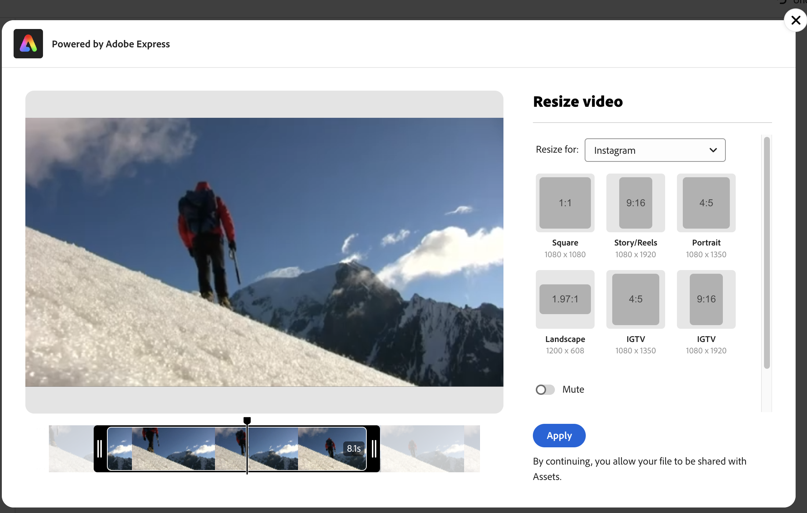

# でビデオを編集する [!DNL Assets Essentials] {#edit-videos}

を組み込んだ Assets ユーザーは、ビデオコンテンツのバリエーションを簡単に作成できます [!DNL Adobe Express] ビデオのクイックアクション。 でのクイックアクション [!DNL Assets Essentials] powered by [!DNL Adobe Express] には、ビデオの切り抜き、ビデオのサイズ変更、ビデオのトリミング、ビデオのGIFへの変換など、使いやすいビデオ編集オプションが用意されています。

ビデオを編集するには、ビデオの詳細に移動して、 [!UICONTROL ビデオを編集]. または、アセットを選択して「詳細」をクリックし、をクリックします  アイコンは右側のパネルに表示されます。 ビデオの編集後、新しいビデオを新しいバージョンまたは新しいアセットとして保存できます。

## 前提条件 {#prerequisites}

アクセスする権限 [!DNL Adobe Express] およびAEM Assets内の少なくとも 1 つの環境が対象となります。 内の任意のリポジトリを環境にすることができます [!DNL Assets as a Cloud Service] または [!DNL Assets Essentials].

## Adobe Expressを使用したビデオの編集 {#edit-video-using-express}

埋め込みを使用すると、ビデオを最適なサイズと向きに簡単に変換できます [!DNL Adobe Express] クイックアクション。

### ビデオを切り抜く {#crop-video-using-express}

埋め込みを使用して、ビデオから不要な部分を削除できます [!DNL Adobe Express] クイックアクション。 これを行うには、以下の手順を実行します。

1. ビデオを選択し、 **[!UICONTROL 編集]**.
2. クリック **[!UICONTROL 切り抜きビデオ]** 左側のペインで使用可能なクイックアクションから。
3. ビデオの隅にあるハンドルをドラッグして目的の切り抜きを作成するか、必要に応じて既存の画面サイズから選択します。
4. ビデオのミュートまたはミュート解除を選択できます。
5. 「**[!UICONTROL 適用]**」をクリックします。
   

   切り抜いたビデオはダウンロードできます。 編集したアセットは、同じアセットの新しいバージョンとして保存するか、新しいアセットとして保存できます。 

### ビデオのサイズ変更 {#resize-video-using-express}

特定のチャネルに配信するために、DAM の最終的なビデオコンテンツのサイズを変更する必要が出ることがよくあります。 [!DNL Assets Essentials] では、一般的なソーシャルチャネルで必要とされるサイズに合わせてビデオのサイズを簡単に変更できます。また、カスタム解像度に合わせてサイズを変更することもできます。 次を使用してビデオのサイズを変更します [!DNL Assets Essentials]を設定するには、次の手順を実行します。

1. ビデオを選択し、 **[!UICONTROL 編集]**.
2. クリック **[!UICONTROL ビデオのサイズ変更]** 左側のペインで使用可能なクイックアクションから。
3. の下のソーシャルメディアプラットフォームから適切なディメンションを選択します **[!UICONTROL のサイズ変更]** ドロップダウンリスト。 または、ビデオの隅にあるハンドルをドラッグして、目的の切り抜きを作成します。
4. 必要に応じて、 **[!UICONTROL ビデオスケール]** フィールド。
5. ビデオのミュートまたはミュート解除を選択できます。
6. 「**[!UICONTROL 適用]**」をクリックし、変更を適用します。
   

サイズを変更したビデオはダウンロードできます。 編集したアセットを同じアセットの新しいバージョンとして保存するか、新しいアセットとして保存することができます。

### ビデオをトリミング {#trim-video-using-express}

大きなビデオのクリップを使用する必要がある場合は、 **[!UICONTROL ビデオをトリミング]** ビデオのセクションを選択してトリミングする機能。 以下の手順を実行します。

1. ビデオを選択し、 **[!UICONTROL 編集]**.
2. クリック **[!UICONTROL ビデオをトリミング]** 左側のペインで使用可能なクイックアクションから。
3. ビデオの特定の部分をトリミングするには、ビデオの開始時間と終了時間を指定します。 または、ビデオの隅にあるハンドルをドラッグして、目的のトリミングを作成します。
4. 「」から適切なディメンションを選択します **[!UICONTROL サイズ]** ドロップダウンリスト。
5. ビデオのミュートまたはミュート解除を選択できます。
6. 「**[!UICONTROL 適用]**」をクリックし、変更を適用します。
   

トリミングしたビデオをダウンロードできます。 編集したアセットを同じアセットの新しいバージョンとして保存するか、新しいアセットとして保存することができます。

### ビデオをGIFに変換 {#convert-mp4-to-gif-using-express}

Adobe Expressを使用して、MP4 ビデオをGIF形式にすばやく変換できます。 以下の手順を実行します。

1. ビデオを選択し、 **[!UICONTROL 編集]**.
2. クリック **[!UICONTROL GIFに変換]** 左側のペインで使用可能なクイックアクションから。
3. 画質に応じて適切なファイルサイズを選択します。 さらに、横、縦、正方形の向きを選択します。
4. ビデオの隅にあるハンドルをドラッグして、目的の切り抜きを作成します。
5. 「**[!UICONTROL 適用]**」をクリックします。

   

ビデオは、GIF形式でダウンロードできます。 編集したアセットを同じアセットの新しいバージョンとして保存するか、新しいアセットとして保存することができます。

## 制限事項 {#limitations-video-adobe-express}

* 編集には MP4 形式のビデオのみがサポートされます。

* サポートされるソースファイルの最大サイズは 200 MB です。

* サポートされるビデオは、どの側も 46 ピクセルを超え、3840 ピクセル未満です。

* サポートされている web ブラウザーは、Google Chrome、Firefox、Safari および Edge です。

* 機能は、web ブラウザーの匿名モードでは開けません。

### 次の手順 {#next-steps}

* Assets Essentials ユーザーインターフェイスの「[!UICONTROL フィードバック]」オプションを使用して製品に関するフィードバックを提供する

* 右側のサイドバーにある「[!UICONTROL このページを編集]」（）または「[!UICONTROL 問題を記録] 」（）を使用してドキュメントに関するフィードバックを提供する

* [カスタマーケア](https://experienceleague.adobe.com/ja?support-solution=General#support)に問い合わせる

>[!MORELIKETHIS]
>
>* [Assets Essentialsでの画像の編集](edit-images-assets-view.md)
>* [アセットのプレビュー](navigate-assets-view.md)
