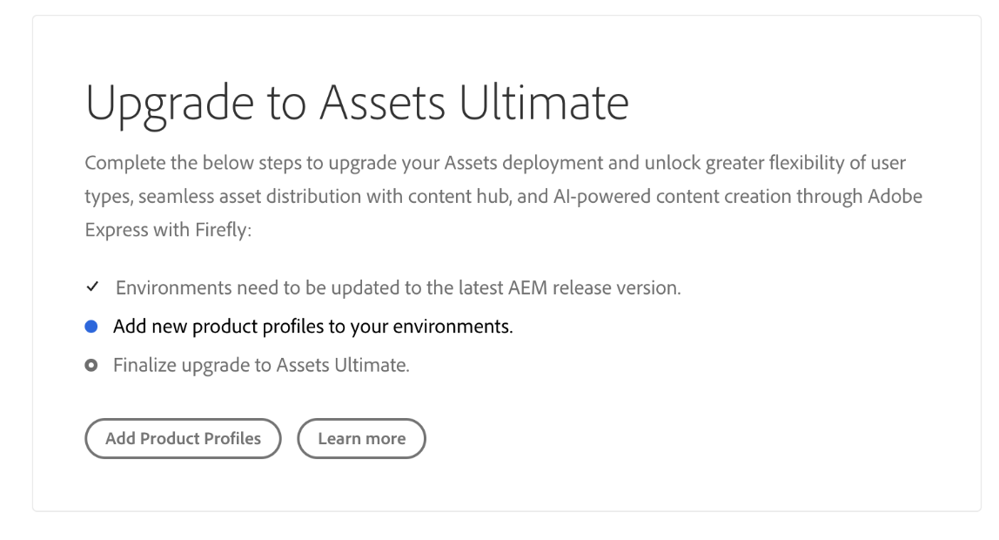
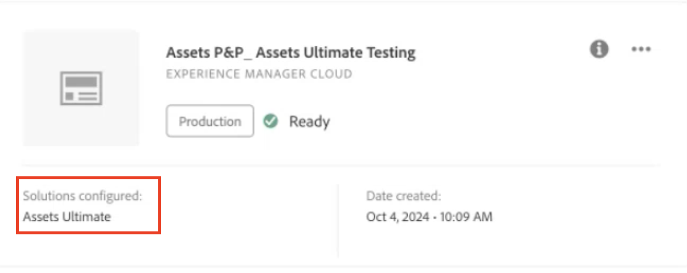
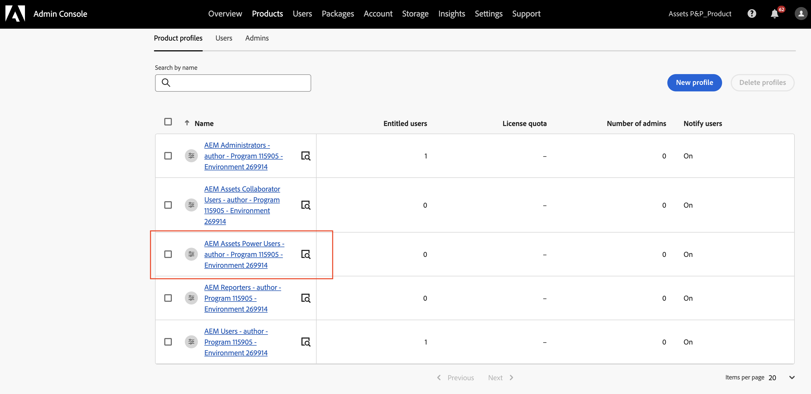

# [!DNL Assets] as a Cloud Service Ultimate の有効化 {#enable-assets-cloud-service-ultimate}

Assets as a Cloud Service Ultimate を使用すると、アセット管理とライブラリサービス、セキュリティと権限管理、Creative Cloud と Experience Cloud の接続、UI の拡張性、API 駆動型の自動化、アドビアプリケーションとアドビ以外のアプリケーションとの統合、カスタムコードのデプロイメントなど、様々な主要な DAM 機能を実行できます。 完全なリストについては、[Assets as a Cloud Service Ultimate の概要](/help/assets/assets-ultimate-overview.md)を参照してください。

## Assets Ultimate の有効化 {#enable-assets-ultimate}

新規の Assets as a Cloud Service のお客様は、まず Cloud Manager を使用して新しいプログラムを作成し、Assets Ultimate を有効にする必要があります。

次の手順を実行します。

1. システム管理者として、Cloud Manager にログオンします。 ログイン時に正しい組織を選択していることを確認します。

   >[!NOTE]
   >
   >新しいプログラムを追加するには、適切な Cloud Manager 製品プロファイルに追加されていることを確認します。 詳しくは、[Cloud Manager での役割に基づく権限](/help/onboarding/cloud-manager-introduction.md#role-based-permissions)を参照してください。

1. [新しいプログラムを作成](/help/journey-onboarding/create-program.md)し、それに[環境を追加](/help/journey-onboarding//create-environments.md)します。

   新しいプログラムの作成中に、「**[!UICONTROL ソリューションとアドオン]**」タブで「**[!UICONTROL Assets Ultimate]**」を選択します。 また、**[!UICONTROL Assets Ultimate]** を展開し、「**[!UICONTROL コンテンツハブ]**」を選択して、アセット配布用の[コンテンツハブ](/help/assets/product-overview.md)を有効にすることもできます。

   

1. 「**[!UICONTROL 作成]**」をクリックしてプログラムを作成します。 これで、Assets Ultimate が Experience Manager Assets as a Cloud Service で有効になります。

システム管理者は、Assets Ultimate で AEM 管理者としての資格が自動的に付与され、使用可能な製品プロファイルを管理するために Admin Console に移動するためのメールを受信します。

Admin Console 上の AEM as a Cloud Service インスタンスは、次の製品プロファイルで構成されます。

* AEM 管理者

* AEM ユーザー

* [AEM Assets 共同作業者ユーザー](#onboard-collaborator-users)

* [AEM Assets パワーユーザー](#onboard-power-users)

  

Assets as a Cloud Service 用のコンテンツハブを有効にしている場合は、Admin Console の AEM Assets as a Cloud Service 内に、サフィックスとして `delivery` が付いた新しいインスタンスが作成されます。

>[!NOTE]
>
>2024年8月14日（PT）より前にコンテンツハブをプロビジョニングした場合、新しいインスタンスはサフィックスとして `contenthub` を付けて作成されます。

コンテンツハブのインスタンス名には、`author` または `publish` がありません。

インスタンス名をクリックすると、`AEM Assets Limited Users` コンテンツハブ製品プロファイルが表示されます。

この製品プロファイルへのユーザーまたはユーザーグループの追加を開始して、コンテンツハブへのアクセス権を付与できます。

>[!NOTE]
>
>2024年8月14日（PT）より前にコンテンツハブをプロビジョニングした場合、コンテンツハブ製品プロファイルには、`delivery` の代わりに、`Limited Users` の後に `contenthub` と表示されます。

## 既存のお客様に対する Assets Ultimate の有効化 {#enable-assets-ultimate-existing-customers}

既存の Assets as a Cloud Service のお客様は、2 つの簡単な手順を実行して Assets Ultimate にアップグレードできます。 Cloud Manager で Assets as a Cloud Service プログラムに移動し、Assets Ultimate クレジットの可用性に基づいてプログラムカードでアップグレードステータスを確認できます。 Assets Ultimate へのアップグレードに十分なクレジットがある場合は、次の画像に示すように、ステータスが `Assets license upgrade required` と表示されます。

既存のお客様が Assets Ultimate の新しいライセンスを購入した場合は、アップグレードステータスが `Assets license upgrade available` と表示されます。

### アップグレードの前提条件 {#prerequisites-assets-upgrade}

すべての環境を最新の AEM as a Cloud Service リリースバージョンまたは最低でも `2024.10.18175` リリースバージョンにアップグレードする必要があります。 最小要件を満たしていない場合は、アドビ担当者に連絡して、必要な AEM リリースバージョンに切り替えてください。

### Assets Ultimate にアップグレード {#upgrade-assets-ultimate}

次の手順を実行します。

1. AEM リリースバージョンの最小要件に切り替えた後、プログラム名をクリックします。 次の画像に示すように、「**[!UICONTROL 環境]**」セクションのすぐ上にアップグレードカードが表示されます。

   

1. 「**[!UICONTROL 製品プロファイルを追加]**」をクリックします。 Cloud Manager には、プログラムで使用可能なすべての環境または個別の環境に新しい製品プロファイルを追加するオプションが表示されます。

   

1. 「**[!UICONTROL すべての環境]**」をクリックしてプログラム内のすべての環境に新しい製品プロファイルを追加するか、「**[!UICONTROL 個別の環境]**」をクリックして新しい製品プロファイルを選択した環境に追加します。

   「**[!UICONTROL 個別の環境]**」をクリックすると、プログラムで使用可能なすべての環境のリストが表示されます。

1. 環境に対応するその他のオプションアイコンをクリックし、「**[!UICONTROL 製品プロファイルを追加]**」を選択して、選択した環境に新しい製品プロファイルを追加します。

   

   また、「**[!UICONTROL 環境]**」セクションに移動し、環境に対応するその他のオプションアイコンをクリックし、「**[!UICONTROL 製品プロファイルを追加]**」を選択して、選択した環境に製品プロファイルを追加することもできます。

   新しい製品プロファイルが追加されている間は、環境のステータスに `Adding Product Profiles` と表示され、プロセスが完了すると `Running` と表示されます。

   次の手順を実行する前に、プログラムで使用可能なすべての環境に、個別に、またはすべての環境にまとめて製品プロファイルを追加する必要があります。

1. 「**[!UICONTROL アップグレード]**」をクリックします。 「**[!UICONTROL アップグレード]**」オプションは、使用可能なすべての環境に製品プロファイルを追加した場合にのみ表示されます。

   

   アップグレードプロセスが完了し、Assets as a Cloud Service が Assets Ultimate に正常にアップグレードされました。 プログラムのステータスには `Assets Ultimate` と表示されます。

   

これで、Admin Console 上の AEM as a Cloud Service インスタンスは、次の製品プロファイルで構成されます。

* AEM 管理者

* AEM ユーザー

* [AEM Assets 共同作業者ユーザー](#onboard-collaborator-users)

* [AEM Assets パワーユーザー](#onboard-power-users)

Content Hubを有効にする必要がある場合は、その他のオプション（。..）をクリックします。 Cloud Managerのプログラム名に「**[!UICONTROL プログラムを編集]**」アイコンを選択します。 **[!UICONTROL Assets Ultimate]** を展開し、「**[!UICONTROL コンテンツハブ]**」をクリックします。 この手順により、Assets Ultimate のコンテンツハブが有効になります。 Admin Console の AEM Assets as a Cloud Service 内に、サフィックスとして `delivery` が付いた新しいインスタンスが作成されます。

>[!NOTE]
>
>2024年8月14日（PT）より前にコンテンツハブをプロビジョニングした場合、新しいインスタンスはサフィックスとして `contenthub` を付けて作成されます。

コンテンツハブのインスタンス名には、`author` または `publish` がありません。

インスタンス名をクリックすると、`AEM Assets Limited Users` コンテンツハブ製品プロファイルが表示されます。

この製品プロファイルへのユーザーまたはユーザーグループの追加を開始して、コンテンツハブへのアクセス権を付与できます。

>[!NOTE]
>
>2024年8月14日（PT）より前にコンテンツハブをプロビジョニングした場合、コンテンツハブ製品プロファイルには、`delivery` ではなく、`Limited Users` の後に `contenthub` が表示されます。

## AEM Assets 共同作業者ユーザーのオンボード {#onboard-collaborator-users}

AEM Assets 共同作業者ユーザーは、他のアドビ製品やアドビ以外のアプリケーションで組織が使用できる Assets の統合を通じて Experience Manager のアセットを操作することや、ビルトインの Adobe Express および Firefly を使用してプロフェッショナルがデザインしたテンプレート、ブランドキット、Adobe Stock アセットなどを活用したアセットを作成および編集することや、AEM Assets コンテンツハブポータルを使用して組織の承認済みアセットにアクセスして活用できます。

共同作業者ユーザーをオンボードするには：

1. Admin Console の製品のリストで AEM as a Cloud Service 製品名をクリックして、Experience Manager Assets 製品プロファイルにアクセスします。

1. AEM as a Cloud Service の実稼動オーサーインスタンスをクリックします。
   

1. 共同作業者ユーザーの製品プロファイルをクリックし、「**[!UICONTROL ユーザーを追加]**」をクリックして、製品プロファイルにユーザーまたはユーザーグループを追加します。
   

1. 「**[!UICONTROL 保存]**」をクリックして、変更を保存します。

また、次の画像に示すように、共同作業者ユーザーに割り当てられたサービスにアクセスして表示することもできます。

`Adobe Express` および `AEM Assets Collaborator Users` サービスは、デフォルトで有効になっています。

>[!NOTE]
>
>必要に応じて、切替スイッチをオフ／オンにして使用可能なサービスを有効または無効にすることができますが、アドビでは、製品プロファイルに対して有効になっているデフォルトのサービスを使用することをお勧めします。

## AEM Assets パワーユーザーのオンボード {#onboard-power-users}

AEM Assets パワーユーザーは、アセット、権限、メタデータ、デジタルアセットに関する全体的なガバナンスと自動化の管理を含むすべての AEM Assets 機能にアクセスすることや、他のアドビアプリケーションやアドビ以外のアプリケーションで組織が使用できる Assets の統合を通じて Experience Manager のアセットを操作することや、ビルトインの Adobe Express および Firefly を使用してプロフェッショナルがデザインしたテンプレート、ブランドキット、Adobe Stock アセットなどを活用したアセットを作成および編集することや、AEM Assets コンテンツハブポータルを使用して組織の承認済みアセットにアクセスして活用できます。

パワーユーザーをオンボードするには：

1. Admin Console の製品のリストで AEM as a Cloud Service 製品名をクリックして、Experience Manager Assets 製品プロファイルにアクセスします。

1. AEM as a Cloud Service の実稼動オーサーインスタンスをクリックします。
   

1. パワーユーザーの製品プロファイルをクリックし、「**[!UICONTROL ユーザーを追加]**」をクリックして、製品プロファイルにユーザーまたはユーザーグループを追加します。
   

1. 「**[!UICONTROL 保存]**」をクリックして、変更を保存します。

また、次の画像に示すように、パワーユーザーに割り当てられたサービスにアクセスして表示することもできます。

`Adobe Express` および `AEM Assets Power Users` サービスは、デフォルトで有効になっています。

>[!NOTE]
>
>必要に応じて、切替スイッチをオフ／オンにして使用可能なサービスを有効または無効にすることができますが、アドビでは、製品プロファイルに対して有効になっているデフォルトのサービスを使用することをお勧めします。

## よくある質問 {#frequently-asked-questions-enable-assets-ultimate}

### 新規のお客様がAEM Assets Ultimateを有効にするにはどうすればよいですか？ {#enable-assets-ultimate-new-customers}

AEM Assets as a Cloud Serviceの新規のお客様は、Cloud Managerで新しいプログラムを作成することで、Assets Ultimateを有効にします。 Cloud Managerにシステム管理者としてログインし、新しいプログラムを作成し、「ソリューションとアドオン」タブで「Assets Ultimate」を選択します。 必要に応じて、Assets Ultimateを展開し、「Content Hub」を選択してアセット配信を有効にします。 「作成」をクリックして、プログラムの設定を完了します。 その後、Assets UltimateがAEM Assets as a Cloud Service インスタンスに対して有効になり、システム管理者はAdmin Consoleで製品プロファイルを管理するためのメールを受け取ります。

### Content HubをAEM Assets Ultimateと同時に有効にして、新規のお客様を対象にすることはできますか？ {#enable-content-hub-new-customers}

Content Hubは、Cloud ManagerでのAssets Ultimate プログラムの初期設定時に有効にすることができます。 新しいプログラムを作成する際に、「ソリューションとアドオン」タブで「Assets Ultimate」を選択し、「Assets Ultimate」オプションを展開して、「Content Hub」を選択します。 プログラム作成を完了すると、Assets UltimateとContent Hubの両方を同時に使用できるようになります。 配信サフィックスを持つ新しいインスタンスがAdmin Consoleで作成され、AEM Assets限定ユーザーContent Hub製品プロファイルが含まれています。このプロファイルは、ユーザーにContent Hubへのアクセス権を付与するために使用されます。

### AEM Assets Ultimateを有効にした後、Admin Consoleで使用できる製品プロファイルは何ですか？ {#product-profiles-assets-ultimate}

AEM Assets Ultimateを有効にした後、Adobe Admin ConsoleのAEM as a Cloud Service インスタンスには、AEM Administrators、AEM Users、AEM Assets Collaborator Users、AEM Assets Power Usersの4つの製品プロファイルが含まれます。 Content Hubも有効になっている場合は、AEM Assets Limited Users製品プロファイルを含む個別の配信インスタンスがAdmin Consoleに作成されます。 AEM Assets Ultimate内では、対応するアクセスレベルを付与するために、各製品プロファイルにユーザーとユーザーグループが追加されます。

### 既存のお客様がAEM Assets Ultimateにアップグレードするための前提条件は何ですか？ {#upgrade-assets-ultimate-prerequisites}

既存のAEM Assets as a Cloud Serviceのお客様は、Assets Ultimateにアップグレードする前に、すべての環境で最新のAEM as a Cloud Service リリースバージョンまたは少なくともリリースバージョン 2024.10.18175が実行されていることを確認する必要があります。 最小リリースバージョン要件を満たさない場合は、アップグレードを続行する前に、Adobe担当者に連絡して、必要なAEM リリースバージョンに切り替えてください。

### 既存のお客様がAEM Assets Ultimateにアップグレードする資格があるかどうかを確認するにはどうすればよいですか？ {#check-upgrade-eligibility-assets-ultimate}

既存のAEM Assets as a Cloud Serviceのお客様は、Cloud ManagerのAssets as a Cloud Service プログラムに移動し、プログラムカードでステータスを表示することで、アップグレードの実施要件を確認できます。 十分なAssets Ultimate クレジットが利用可能な場合、ステータスは「Assets ライセンスのアップグレードが必要」と表示されます。 Assets Ultimateの新しいライセンスが購入された場合、ステータスは「利用可能なAssetsライセンスのアップグレード」と表示されます。 どちらのステータスも、アップグレードパスがプログラムで使用可能であることを示します。

### 既存のお客様がAEM Assets Ultimateにアップグレードする方法 {#upgrade-steps-assets-ultimate}

AEMの最小リリースバージョン要件を満たしたら、Cloud Managerのプログラム名をクリックして、「環境」セクションの上にアップグレードカードを表示します。 「製品プロファイルを追加」をクリックし、すべての環境または個々の環境に新しい製品プロファイルを追加することを選択します。 続行する前に、製品プロファイルをすべての利用可能な環境に追加する必要があります。 すべての環境に「実行中」ステータスが表示されたら、「アップグレード」をクリックしてプロセスを完了します。 アップグレードが完了したことを確認するAssets Ultimateへのプログラムステータスの更新。

### 既存のプログラムをAEM Assets Ultimateにアップグレードした後、Content Hubを有効にするにはどうすればよいですか？ {#enable-content-hub-existing-customers}

既存のプログラムをCloud ManagerのAEM Assets Ultimateにアップグレードした後、プログラム名の「その他のオプション」アイコンをクリックし、「プログラムを編集」を選択します。 Assets Ultimateを展開し、「Content Hub」をクリックして有効にします。 新しい配信インスタンスがAdobe Admin Consoleで作成され、AEM Assets Limited Users Content Hub製品プロファイルが含まれます。 次に、この製品プロファイルにユーザーとユーザーグループを追加して、Content Hub ポータルにアクセスできるようにします。

### AEM Assets Ultimateで共同作業者ユーザーをオンボーディングするにはどうすればよいですか？ {#onboard-collaborator-users-aem-assets}

AEM Assets Ultimateで共同作業者ユーザーをオンボーディングするには、Adobe Admin Consoleにアクセスし、商品リストのAEM as a Cloud Service商品名をクリックします。 実稼動オーサーインスタンスをクリックし、AEM Assets Collaborator Users製品プロファイルを選択し、Add Usersをクリックしてユーザーまたはユーザーグループを追加します。 「保存」をクリックして、変更を適用します。 Adobe ExpressおよびAEM Assets Collaborator Users サービスは、この製品プロファイルに対してデフォルトで有効になっており、必要に応じてオンまたはオフに切り替えることができます。Adobeでは、デフォルトのサービス設定を維持することをお勧めします。

### AEM Assets Collaborator ユーザーに対してデフォルトで有効になっているサービスは何ですか？ {#collaborator-user-default-services}

Adobe Admin ConsoleのAEM Assets Collaborator Users製品プロファイルでは、Adobe ExpressとAEM Assets Collaborator Usersの2つのサービスがデフォルトで有効になっています。 これらのサービスにより、共同作業者のユーザーは、Adobe ExpressとFireflyを使用したアセットの作成と編集、AdobeおよびAdobe以外のアプリケーションとの統合、AEM Assets Content Hub ポータルを介した承認済みアセットへのアクセスが可能になります。 Admin Consoleでは個々のサービスのオンとオフを切り替えることができますが、Adobeではデフォルト設定を使用することをお勧めします。

### AEM Assets UltimateでPower Usersをオンボーディングするにはどうすればよいですか？ {#onboard-power-users-aem-assets}

AEM Assets UltimateでPower Usersをオンボーディングするには、Adobe Admin Consoleにアクセスし、製品の一覧でAEM as a Cloud Serviceの製品名をクリックします。 実稼動オーサーインスタンスをクリックし、AEM Assets Power Users製品プロファイルを選択し、「ユーザーを追加」をクリックしてユーザーまたはユーザーグループを追加します。 「保存」をクリックして、変更を適用します。 Adobe ExpressおよびAEM Assets Power Users サービスは、この製品プロファイルに対してデフォルトで有効になっており、オンまたはオフに切り替えることができます。Adobeでは、デフォルトのサービス設定を維持することをお勧めします。

### AEM Assets Power Usersでデフォルトで有効になっているサービスは何ですか？ {#power-user-default-services}

Adobe Admin ConsoleのAEM Assets Power Users製品プロファイルでは、Adobe ExpressとAEM Assets Power Usersの2つのサービスがデフォルトで有効になっています。 これらのサービスにより、Power Usersは、アセット管理、メタデータガバナンス、権限、自動化などのAEM Assets DAM機能に完全にアクセスできるだけでなく、Adobe ExpressおよびFireflyを活用したコンテンツ制作、AdobeおよびAdobe以外のアプリケーションとの統合、AEM Assets Content Hubポータルへのアクセスも可能になります。 Admin Consoleでは個々のサービスのオンとオフを切り替えることができますが、Adobeではデフォルト設定を使用することをお勧めします。

### Content Hub Admin Console インスタンスの配信とcontenthub サフィックスの違いは何ですか？ {#content-hub-suffix-difference}

Content HubのContent Hub インスタンスの接尾辞は、Adobe Admin Consoleがプロビジョニングされた日時によって異なります。 2024年8月14日以降にContent Hubをプロビジョニングしたお客様には、配信サフィックス付きのインスタンスがあります。 2024年8月14日（PT）より前にContent Hubをプロビジョニングしたお客様には、contenthub サフィックス付きのインスタンスがあります。 以前のプロビジョニングの場合、Content Hub製品プロファイルには、配信ではなく制限付きユーザーの後にcontenthubも表示されます。 どちらの設定も、Content Hubへのアクセスを許可するために、同じAEM Assets Limited Users製品プロファイルを提供します。

**関連情報**

* [アセットを翻訳](/help/assets/translate-assets.md)
* [Assets HTTP API](/help/assets/mac-api-assets.md)
* [AEM Assets as a Cloud Service でサポートされているファイル形式](/help/assets/file-format-support.md)
* [アセットを検索](/help/assets/search-assets.md)
* [接続されたアセット](/help/assets/use-assets-across-connected-assets-instances.md)
* [アセットレポート](/help/assets/asset-reports.md)
* [メタデータスキーマ](/help/assets/metadata-schemas.md)
* [アセットをダウンロード](/help/assets/download-assets-from-aem.md)
* [メタデータを管理](/help/assets/manage-metadata.md)
* [Dynamic Media テンプレートの管理](/help/assets/dynamic-media/manage-dynamic-media-templates.md)
* [レポートの管理](/help/assets/manage-reports-assets-view.md)
* [検索ファセット](/help/assets/search-facets.md)
* [コレクションを管理](/help/assets/manage-collections.md)
* [メタデータの一括読み込み](/help/assets/metadata-import-export.md)
* [AEM および Dynamic Media へのアセットの公開](/help/assets/publish-assets-to-aem-and-dm.md)
