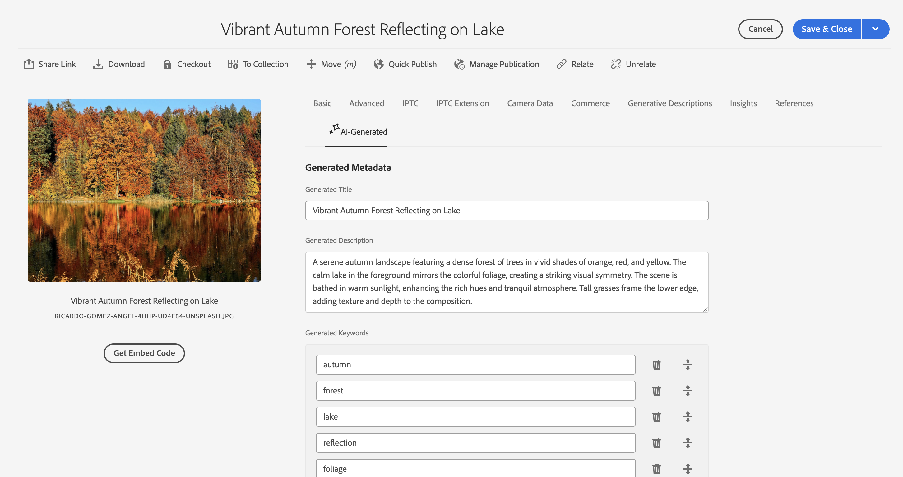
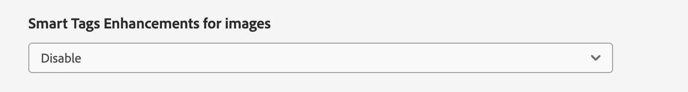

# AI で生成されたメタデータによるコンテンツ検出の強化 {#ai-smart-tags}

| UI | 記事リンク |
| -------- | ---------------------------- |
| アセットビュー | [ここをクリックしてください](/help/assets/ai-generated-metadata-assets-view.md) |
| 管理ビュー | この記事 |

AI は、手動の入力に依存するのではなく、デジタルアセットに説明的なタグを自動的に割り当てます。これらの AI で生成されたタグは、メタデータの品質を向上させ、アセットの検索、分類および推奨を容易にします。このアプローチでは、手動でのタグ付けが不要なために効率が向上するだけでなく、大量のデジタルコンテンツ間の一貫性とスケーラビリティも確保できます。例えば、アセットが画像の場合、AI はアセット内のオブジェクト、シーン、感情、さらにはブランドロゴを識別し、「夕日」、「ビーチ」、「休暇」、「笑顔」など、関連するタグを生成できます。 AI が生成するコンテンツは、セマンティック検索とレキシカル検索の両方の技術を活用することで、アセットの検索精度を向上させることができます。詳しくは、[Assets の検索](search-assets.md)を参照してください。<!--If the asset is a document, AI reads and interprets the text to assign meaningful keywords that summarize its content—such as "climate change," "policy," or "renewable energy.-->

## AI で生成されたメタデータを有効にする方法 {#enable-ai-generated-metadata}

AI で生成されたメタデータを有効にするには：

* AEM のリリースバージョン `20626` 以上が必要です。

* GenAI Rider 契約に署名する必要があります。詳しくは、アドビ担当者にお問い合わせください。

## AI で生成されたタイトルの設定 {#configure-ai-generated-titles}

AEM では、アセットの参照ページのカード表示またはリスト表示でのアセットタイトルの表示を設定できます。自分で定義したアセットタイトル、AI を使用して生成されたタイトルを表示するか、アセットに既存のタイトルがない場合にのみ AI が生成されたタイトルを使用するかを選択できます。

AI で生成されたタイトルを設定するには：

1. **[!UICONTROL ツール／アセット／アセット設定／スマートタグ機能強化の設定]**&#x200B;に移動します。

1. 次のいずれかのオプションを選択します。

   * **DC タイトルを表示（デフォルト）**：アセットプロパティで使用可能な「**[!UICONTROL タイトル]**」フィールドにタイトルを指定して、カード表示またはリスト表示で表示します。アセットタイトルが定義されていない場合、AEM Assets にはファイル名が表示されます。

   * **AI で生成されたタイトルを表示**：AI で生成されたタイトルを表示し、アセットプロパティで指定したタイトルを無視します。AI で生成されたタイトルがアセットに使用できない場合、AEM Assets にはそのプロパティで使用できるデフォルトのアセットタイトルが表示されます。

   * **DC タイトルが存在しない場合にのみ AI で生成されたタイトルを表示**：AEM Assets には、アセットにアセットタイトルが定義されていない場合にのみ AI で生成されたタイトルが表示されます。

     

## AI で生成されたメタデータの使用 {#using-ai-generated-smart-tags}

<!--[!NOTE]
>
>The enhanced smart tags capability is available only for the newly uploaded assets.
-->

拡張スマートタグ機能を使用するには、次の手順を実行します。

1. [!DNL Experience Manager] インターフェイスで、目的のフォルダーに移動し、「**[!UICONTROL Assets を追加]**」をクリックします。<!--Alternatively, to update enhanced smart tags in an existing content, click **[!UICONTROL reprocess]**.-->互換性のある画像ファイル形式は、`png`、`jpg`、`jpeg`、`psd`、`tiff`、`gif`、`webp`、`crw`、`cr2`、`3fr`、`nef`、`arw` および `bmp` です。

1. 新しくアップロードされたアセットが処理されるまで待ちます。完了したら、「アセットプロパティ」に移動します。

1. **[!UICONTROL AI 生成]**&#x200B;タブに移動します。[!DNL Experience Manager] バージョンに互換性がないか更新されていない場合、このタブは表示されません。次のフィールドがあります。

   * **[!UICONTROL 生成されたタイトル]：**&#x200B;このタイトルは、アップロードされたアセットの中核となるアイデアを捉えた明確で簡潔な見出しとなり、一目でわかりやすくなります。アセットを追加する際に、（`dc:title` で）タイトルを指定すると、アセットの参照ビューに表示されます。空白のままにすると、AIによって生成されたタイトルが自動的に割り当てられます。
   * **[!UICONTROL 生成された説明]：**&#x200B;説明には、アセットの内容に関する簡潔でわかりやすい概要が記載されており、ユーザーや検索モジュールがその関連性をすばやく把握できるようにします。
   * **[!UICONTROL 生成されたキーワード]：**&#x200B;キーワードは、アセットの主なテーマを表すターゲット用語で、タグ付けやコンテンツのフィルタリングに役立ちます。

1. [オプション]：関連するタグが欠落していると思われる場合は、追加のタグを追加するか、独自のタグを作成できます。これを行うには、「**[!UICONTROL 生成されたキーワード]**」フィールドにタグを入力し、「**[!UICONTROL 保存]**」をクリックします。

## AI で生成されたメタデータを無効にする {#disable-ai-generated-metadata}

AI で生成されたメタデータは、フォルダーレベルで無効にすることができます。すべての子フォルダーは、親フォルダーからプロパティを継承します。

フォルダーレベルで AI で生成されたメタデータを無効にするには：

1. **[!UICONTROL Adobe Experience Manager／Assets／ファイル]**&#x200B;に移動します。

1. フォルダーを選択し、「**[!UICONTROL プロパティ]**」をクリックします。

1. 「**[!UICONTROL アセット処理]**」タブで、**[!UICONTROL 画像のスマートタグ拡張機能]**&#x200B;フォルダーに移動します。ドロップダウンリストから次のいずれかの値を選択します。

   * 継承 - フォルダーは親フォルダーから有効または無効のオプションを継承します。

   * 有効 - 選択したフォルダーの AI で生成されたメタデータを有効にします。

   * 無効 - 選択したフォルダーの AI で生成されたメタデータを無効にします。

     