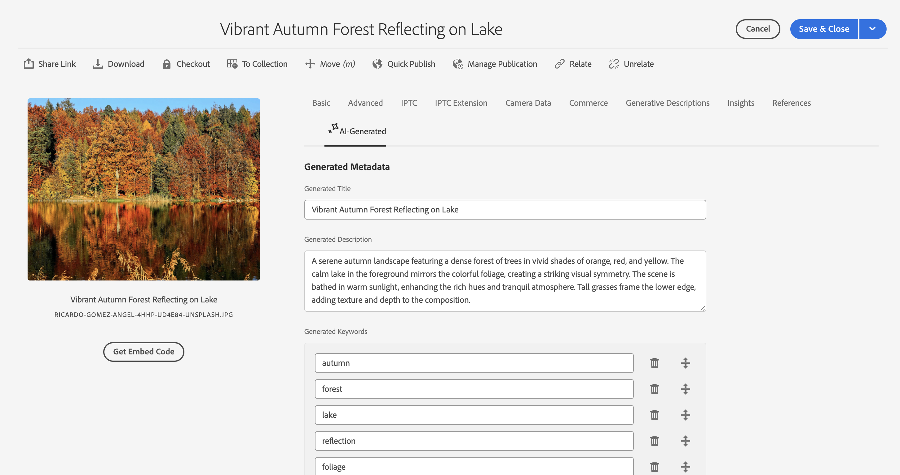
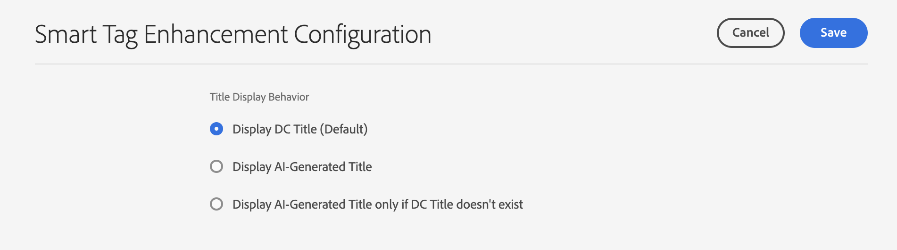

# AI で生成されたメタデータによるコンテンツ検出の強化 {#ai-smart-tags}

| UI | 記事リンク |
| -------- | ---------------------------- |
| アセットビュー | [ここをクリックしてください](/help/assets/ai-generated-metadata-assets-view.md) |
| 管理者ビュー | この記事 |

AI は、手動の入力に依存するのではなく、デジタルアセットに説明的なタグを自動的に割り当てます。 これらの AI で生成されたタグは、メタデータの品質を向上させ、アセットの検索、分類および推奨を容易にします。 このアプローチでは、手動でのタグ付けが不要なために効率が向上するだけでなく、大量のデジタルコンテンツ間の一貫性とスケーラビリティも確保できます。 例えば、アセットが画像の場合、AI はアセット内のオブジェクト、シーン、感情、さらにはブランドロゴを識別し、「夕日」、「ビーチ」、「休暇」、「笑顔」など、関連するタグを生成できます。 AI が生成するコンテンツは、セマンティック検索とレキシカル検索の両方の技術を活用することで、アセットの検索精度を向上させることができます。 詳しくは、[Assets の検索](search-assets.md)を参照してください。<!--If the asset is a document, AI reads and interprets the text to assign meaningful keywords that summarize its content—such as "climate change," "policy," or "renewable energy.-->

## AI で生成されたメタデータを有効にする方法 {#enable-ai-generated-metadata}

AI で生成されたメタデータを有効にするには：

* AEM のリリースバージョン `20626` 以上が必要です。

## AI で生成されたタイトルの設定 {#configure-ai-generated-titles}

AEM では、アセットの参照ページのカード表示またはリスト表示でのアセットタイトルの表示を設定できます。 自分で定義したアセットタイトル、AI を使用して生成されたタイトルを表示するか、アセットに既存のタイトルがない場合にのみ AI が生成されたタイトルを使用するかを選択できます。

AI で生成されたタイトルを設定するには：

1. **[!UICONTROL ツール/Assets/Assets設定/スマートタグ拡張機能の設定]**&#x200B;に移動します。

1. 次のいずれかのオプションを選択します。

   * **DC タイトルを表示（デフォルト）**：アセットプロパティで使用可能な「**[!UICONTROL タイトル]**」フィールドにタイトルを指定して、カード表示またはリスト表示で表示します。 アセットタイトルが定義されていない場合、AEM Assets にはファイル名が表示されます。

   * **AI で生成されたタイトルを表示**：AI で生成されたタイトルを表示し、アセットプロパティで指定したタイトルを無視します。 AI で生成されたタイトルがアセットに使用できない場合、AEM Assets にはそのプロパティで使用できるデフォルトのアセットタイトルが表示されます。

   * **DC タイトルが存在しない場合にのみ AI で生成されたタイトルを表示**：AEM Assets には、アセットにアセットタイトルが定義されていない場合にのみ AI で生成されたタイトルが表示されます。

     

## AI で生成されたメタデータの使用 {#using-ai-generated-smart-tags}

<!--
[!NOTE]
>
>The enhanced smart tags capability is available only for the newly uploaded assets.
-->

拡張スマートタグ機能を使用するには、次の手順を実行します。

1. [!DNL Experience Manager] インターフェイスで、目的のフォルダーに移動し、**[!UICONTROL Assetsを追加]**&#x200B;をクリックします。<!--Alternatively, to update enhanced smart tags in an existing content, click **[!UICONTROL reprocess]**.--> 互換性のある画像ファイル形式は、`png`、`jpg`、`jpeg`、`psd`、`tiff`、`gif`、`webp`、`crw`、`cr2`、`3fr`、`nef`、`arw`および`bmp`です。

1. 新しくアップロードされたアセットが処理されるまで待ちます。 完了したら、「アセットプロパティ」に移動します。

1. **[!UICONTROL AI 生成]**&#x200B;タブに移動します。 [!DNL Experience Manager] のバージョンが非対応または更新されていない場合、このタブは表示されません。 次のフィールドがあります。

   * **[!UICONTROL 生成されたタイトル]：**&#x200B;このタイトルは、アップロードされたアセットの中核となるアイデアを捉えた明確で簡潔な見出しとなり、一目でわかりやすくなります。 アセットを追加する際に、（`dc:title` で）タイトルを指定すると、アセットの参照ビューに表示されます。 空白のままにすると、AIによって生成されたタイトルが自動的に割り当てられます。
   * **[!UICONTROL 生成された説明]：**&#x200B;説明には、アセットの内容に関する簡潔でわかりやすい概要が記載されており、ユーザーや検索モジュールがその関連性をすばやく把握できるようにします。
   * **[!UICONTROL 生成されたキーワード]：**&#x200B;キーワードは、アセットの主なテーマを表すターゲット用語で、タグ付けやコンテンツのフィルタリングに役立ちます。

1. [オプション]：関連するタグが欠落していると思われる場合は、追加のタグを追加するか、独自のタグを作成できます。 これを行うには、「**[!UICONTROL 生成されたキーワード]**」フィールドにタグを入力し、「**[!UICONTROL 保存]**」をクリックします。

## AI で生成されたメタデータを無効にする {#disable-ai-generated-metadata}

AEM as a Cloud Service環境のAI生成メタデータを無効にすることも、フォルダーレベルで無効にすることもできます。

AEM as a Cloud Service環境のAI生成メタデータを無効にするには：

1. **[!UICONTROL ツール/Assets/Assets設定/スマートタグ拡張機能の設定]**&#x200B;に移動します。

1. 「**[!UICONTROL スマートタグの機能強化を無効にする]**」を選択します。

1. 「**[!UICONTROL 保存]**」をクリックします。

AEM Assetsにアップロードした新しいアセットまたはフォルダーに対して、AIが生成したメタデータが無効になります。 AI生成のメタデータフィールドが既に生成されている既存のアセットやフォルダーには、これらのフィールドが引き続き表示されます。

### フォルダーのAI生成メタデータを無効にする {#disable-ai-generated-metadata-folder-level}

AIが生成したメタデータをフォルダーレベルで無効にするには：

1. フォルダーを選択し、「**[!UICONTROL プロパティ]**」をクリックします。

1. 「**[!UICONTROL アセット処理]**」タブを選択します。

1. 「**[!UICONTROL 画像のスマートタグの機能強化]**」セクションで、ドロップダウンメニューから「**[!UICONTROL 無効化]**」を選択します。

1. 選択したフォルダーのAI生成メタデータを無効にするには、**[!UICONTROL 保存して閉じる]**&#x200B;をクリックします。

**関連情報**

* [アセットを翻訳](/help/assets/translate-assets.md)
* [Assets HTTP API](/help/assets/mac-api-assets.md)
* [AEM Assets as a Cloud Service でサポートされているファイル形式](/help/assets/file-format-support.md)
* [アセットを検索](/help/assets/search-assets.md)
* [接続されたアセット](/help/assets/use-assets-across-connected-assets-instances.md)
* [アセットレポート](/help/assets/asset-reports.md)
* [メタデータスキーマ](/help/assets/metadata-schemas.md)
* [アセットをダウンロード](/help/assets/download-assets-from-aem.md)
* [メタデータを管理](/help/assets/manage-metadata.md)
* [Dynamic Media テンプレートの管理](/help/assets/dynamic-media/manage-dynamic-media-templates.md)
* [レポートの管理](/help/assets/manage-reports-assets-view.md)
* [検索ファセット](/help/assets/search-facets.md)
* [コレクションを管理](/help/assets/manage-collections.md)
* [メタデータの一括読み込み](/help/assets/metadata-import-export.md)
* [AEM および Dynamic Media へのアセットの公開](/help/assets/publish-assets-to-aem-and-dm.md)
