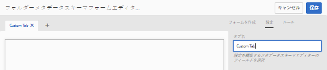
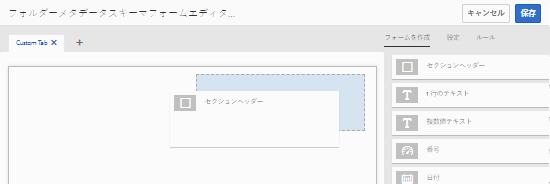
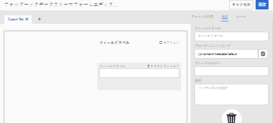
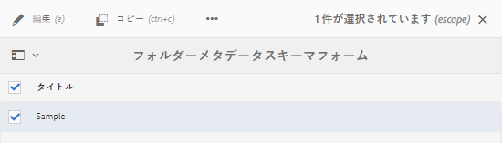
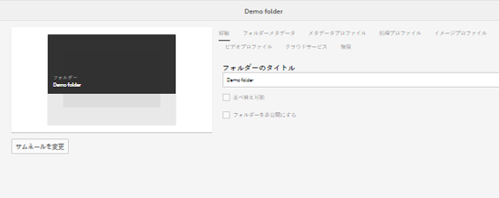
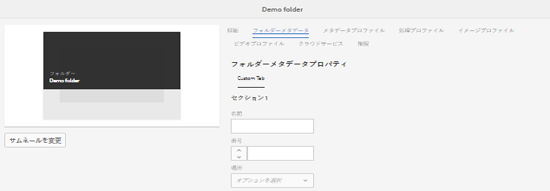
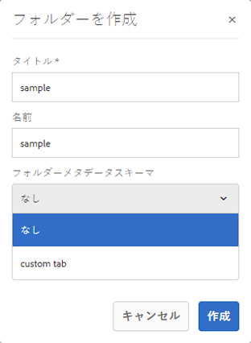

# フォルダーメタデータスキーマ {#folder-metadata-schema}

Adobe Experience Manager（AEM）Assets では、フォルダープロパティページに表示されるレイアウトとメタデータを定義する、アセットフォルダーのメタデータスキーマを作成できます。

## フォルダーメタデータスキーマフォームの追加  {#add-a-folder-metadata-schema-form}

フォルダーメタデータスキーマフォームエディターを使用して、フォルダーのメタデータスキーマを作成および編集します。

1. AEM のロゴをタップまたはクリックし、**[!UICONTROL ツール]**／**[!UICONTROL アセット]**／**[!UICONTROL フォルダーメタデータスキーマ]**&#x200B;に移動します。
1. フォルダーメタデータスキーマフォームページで、「**[!UICONTROL 作成]**」をタップまたはクリックします。
1. フォームの名前を指定し、「**[!UICONTROL 作成]**」をタップまたはクリックします。新しいスキーマフォームがスキーマフォームページにリストされます。

## フォルダーメタデータスキーマフォームの編集  {#edit-folder-metadata-schema-forms}

以下を含む、新しく追加された、または既存のメタデータスキーマフォームを編集できます。

* タブ
* タブ内のフォーム項目

これらのフォーム項目を CRX リポジトリのメタデータノード内のフィールドにマップしたり、フォーム項目を設定したりできます。新しいタブまたはフォーム項目をメタデータスキーマフォームに追加できます。

1. スキーマフォームページで、作成したフォームを選択し、ツールバーの「**[!UICONTROL 編集]**」アイコンをタップまたはクリックします。
1. フォルダーメタデータスキーマエディターページで、**[!UICONTROL +]** アイコンをタップまたはクリックして、フォームにタブを追加します。タブの名前を変更するには、デフォルト名をタップまたはクリックし、「**[!UICONTROL 設定]**」に新しい名前を指定します。

   

   タブを追加するには、**[!UICONTROL +]** アイコンをタップまたはクリックします。タブを削除するには、「**[!UICONTROL X]**」をタップまたはクリックします。

1. アクティブになっているタブで、「**[!UICONTROL フォームを作成]**」タブから 1 つ以上のコンポーネントを追加します。

   

   複数のタブを作成する場合は、コンポーネントを追加する特定のタブをタップまたはクリックします。

1. コンポーネントを設定するには、コンポーネントを選択して、「**[!UICONTROL 設定]**」タブでそのプロパティを変更します。

   必要に応じて、「**[!UICONTROL 設定]**」タブからコンポーネントを削除します。

   

1. ツールバーの「**[!UICONTROL 保存]**」をタップまたはクリックして変更内容を保存します。

### フォームを作成するコンポーネント  {#components-to-build-forms}

「**[!UICONTROL フォームを作成]**」タブには、フォルダーメタデータスキーマフォーム内で使用するフォーム項目が一覧表示されます。「**[!UICONTROL 設定]**」タブには、「**[!UICONTROL フォームを作成]**」タブで選択した各項目の属性が表示されます。以下は、「**[!UICONTROL フォームを作成]**」タブで使用可能なフォーム項目のリストです。

<table>
 <tbody>
  <tr>
   <td>
<strong>コンポーネント名</strong>
 </td>
   <td>
<strong>説明</strong>
 </td>
  </tr>
  <tr>
   <td>
セクションヘッダー
 </td>
   <td>
 共通コンポーネントのリストに対してセクションヘッダーを追加します。
 </td>
  </tr>
  <tr>
   <td>
1 行のテキスト
 </td>
   <td>
 1 行のテキストのプロパティを追加します。これは文字列として保存されます。
 </td>
  </tr>
  <tr>
   <td>
複数値テキスト
 </td>
   <td>
 複数値テキストプロパティを追加します。これは文字列の配列として保存されます。
 </td>
  </tr>
  <tr>
   <td>
番号
 </td>
   <td>
 数値コンポーネントを追加します。
 </td>
  </tr>
  <tr>
   <td>
日付
 </td>
   <td>
 日付コンポーネントを追加します。
 </td>
  </tr>
  <tr>
   <td>
ドロップダウン
 </td>
   <td>
 ドロップダウンリストを追加します。
 </td>
  </tr>
  <tr>
   <td>
標準タグ
 </td>
   <td>
 タグを追加します。 
 </td>
  </tr>
  <tr>
   <td>
非表示のフィールド
 </td>
   <td>
 非表示のフィールドを追加します。このフィールドは、アセットの保存時に POST パラメーターとして送信されます。
 </td>
  </tr>
 </tbody>
</table>

### フォーム項目の編集 {#editing-form-items}

フォーム項目のプロパティを編集するには、コンポーネントをタップまたはクリックし、「**[!UICONTROL 設定]**」タブで次のプロパティのすべてまたは一部を編集します。

**[!UICONTROL フィールドラベル]**：フォルダーのプロパティページに表示されるメタデータプロパティの名前。

**[!UICONTROL プロパティにマッピング]**：このプロパティは、フォルダーノードが保存されている CRX リポジトリ内でのフォルダーノードの相対パスを指定します。この値は、パスがフォルダーのノードの下にあることを示す「**./**」で始まります。

このプロパティの有効な値は次のとおりです。

* `./jcr:content/metadata/dc:title`：フォルダーのメタデータノードにある値を、プロパティ `dc:title` として格納します。

* `./jcr:created`:アセットの作成日時が格納されます。これは保護プロパティーです。これらのプロパティを設定する場合は、「[!UICONTROL 編集を無効にする]」とマークすることをお勧めします。

プロパティパスにスペースを含めないでください。コンポーネントがメタデータスキーマフォームに適切に表示されなくなります。

**[!UICONTROL JSON パス]**：オプションのキーと値のペアを指定する JSON ファイルのパスを指定します。

**[!UICONTROL プレースホルダー]**：このプロパティを使用して、メタデータプロパティに関連するプレースホルダーテキストを指定します。

**[!UICONTROL 選択肢]**：リストの選択肢を指定するには、このプロパティを使用します。

**[!UICONTROL 説明]**：メタデータコンポーネントの短い説明を追加するには、このプロパティを使用します。

**[!UICONTROL クラス]**：プロパティに関連付けられているオブジェクトクラス。

## フォルダーメタデータスキーマフォームの削除  {#delete-folder-metadata-schema-forms}

フォルダーメタデータスキーマフォームページから、フォルダーメタデータスキーマフォームを削除できます。フォームを削除するには、フォームを選択し、ツールバーの「削除」アイコンをタップまたはクリックします。

## フォルダーメタデータスキーマの割り当て {#assign-a-folder-metadata-schema}

フォルダーメタデータスキーマフォームページから、またはフォルダーの作成時に、フォルダーにフォルダーメタデータスキーマを割り当てることができます。

フォルダーのメタデータスキーマを設定すると、スキーマフォームのパスは、フォルダーノードの `folderMetadataSchema` プロパティ（.*/jcr:content* 下）に保存されます。

### フォルダーメタデータスキーマページからのスキーマへの割り当て  {#assign-to-a-schema-from-the-folder-metadata-schema-page}

1. AEM のロゴをタップまたはクリックし、**[!UICONTROL ツール]**／**[!UICONTROL アセット]**／**[!UICONTROL フォルダーメタデータスキーマ]**&#x200B;に移動します。
1. フォルダーメタデータスキーマフォームページから、フォルダーに適用するスキーマフォームを選択します。
1. ツールバーの「**[!UICONTROL フォルダーに適用]**」をタップまたはクリックします。

1. スキーマを適用するフォルダーを選択し、「**[!UICONTROL 適用]**」をクリックまたはタップします。既にフォルダーにメタデータスキーマが適用されている場合は、既存のメタデータスキーマを上書きするかどうかを確認する警告メッセージが表示されます。「**[!UICONTROL 上書き]**」をタップまたはクリックします。
1. メタデータスキーマを適用したフォルダーのメタデータプロパティを開きます。

   

   フォルダーメタデータフィールドを表示するには、「**[!UICONTROL フォルダーメタデータ]**」タブをタップまたはクリックします。

   

### フォルダー作成時のスキーマの割り当て {#assign-a-schema-when-creating-a-folder}

フォルダーを作成するときに、フォルダーメタデータスキーマを割り当てることができます。システムに 1 つ以上のフォルダーメタデータスキーマが存在する場合は、**[!UICONTROL フォルダーを作成]**&#x200B;ダイアログに追加リストが表示されます。希望のスキーマを選択できます。デフォルトではスキーマは選択されていません。

1. AEM Assets ユーザーインターフェイスで、ツールバーの「**[!UICONTROL 作成]**」をタップまたはクリックします。
1. フォルダーのタイトルと名前を指定します。
1. フォルダーメタデータスキーマリストから希望のスキーマを選択します。次に、「**[!UICONTROL 作成]**」をタップまたはクリックします。

   

1. メタデータスキーマを適用したフォルダーのメタデータプロパティを開きます。
1. フォルダーメタデータフィールドを表示するには、「**[!UICONTROL フォルダーメタデータ]**」タブをタップまたはクリックします。

## フォルダーメタデータスキーマの使用 {#use-the-folder-metadata-schema}

フォルダーメタデータスキーマが設定されたフォルダーのプロパティを開きます。フォルダープロパティページに「**[!UICONTROL フォルダーメタデータ]**」タブが表示されます。フォルダーメタデータスキーマフォームを表示するには、このタブを選択します。

各種フィールドにメタデータ値を入力し、「**[!UICONTROL 保存]**」をタップまたはクリックして値を保存します。指定した値は、CRX リポジトリ内のフォルダーノードに保存されます。

