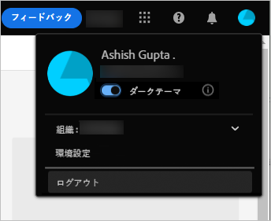

# アセットビューの概要 {#assets-view-get-started}

<!-- TBD: Make links for these steps. -->

[!DNL Assets View] を使用したデジタルアセットの管理に必要なのは、次の 3 つの簡単な手順だけです。

* **手順 1**：アセットを[アップロード](/help/assets/add-delete-assets-view.md)し[表示](/help/assets/navigate-assets-view.md)する。
* **手順 2**：アセットを[検索](/help/assets/search-assets-view.md)し[ダウンロード](/help/assets/manage-organize-assets-view.md#download)する。
* **手順 3**：アセットを[管理および整理](/help/assets/manage-organize-assets-view.md)する。

[!DNL Assets View] を使用するには、[https://experience.adobe.com/#/assets](https://experience.adobe.com/#/assets) でログインします。ログイン時に、`Company or School Account` を選択します。アクセス権を受け取るには、組織の管理者に問い合わせてください。

<!--In addition, more reference information that can be helpful is [understanding of the user interface](/help/assets/navigate-assets-view.md), [list of use cases](#use-cases), [supported file types](/help/assets/supported-file-formats-assets-view.md), and [known issues](/help/assets/release-notes.md#known-issues).
-->

## アセットビューへのアクセス {#access-assets-view}

アセットビューへのアクセス方法について詳しくは、[アセットビューへのアクセス方法](/help/assets/assets-view-introduction.md#how-to-access-assets-view)を参照してください。

## [!DNL Assets View] の設定 {#configuration}

環境設定を開くには、ユーザーインターフェイスの右上隅にあるアバターをクリックします。ソリューションの環境設定で、明るいテーマと暗いテーマを切り替えることができます。

複数の異なる組織に属している場合は、組織を変更し、様々な組織のアカウントにアクセスすることもできます。

[!UICONTROL Experience Cloud の環境設定]を変更するには、「[!UICONTROL 環境設定]」をクリックします。

>[!NOTE]
>
>アセットビューに移動して `Network Error` メッセージが表示される場合は、[クロスオリジンリソース共有（CORS）設定](/help/headless/deployment/cross-origin-resource-sharing.md)の記事に記載される手順を実行する必要があります。

## [!DNL Assets View] のユースケース {#use-cases}

[!DNL Assets View] を使用すると、次のような様々なデジタルアセット管理（DAM）タスクを実行できます。

| ユーザータスク | 機能とハウツー情報 |
|-----|------|
| アセットの参照と表示 | <ul> <li>[リポジトリーの参照](/help/assets/navigate-assets-view.md#view-assets-and-details) </li> <li> [アセットのプレビュー](/help/assets/navigate-assets-view.md#preview-assets) <li> [アセットのレンディションの表示](/help/assets/add-delete-assets-view.md#renditions) </li> <li>[アセットのバージョンの表示](/help/assets/manage-organize-assets-view.md#view-versions)</li></ul> |
| 新しいアセットの追加 | <ul> <li>[新しいアセットやフォルダーのアップロード](/help/assets/add-delete-assets-view.md)</li> <li>[アップロードの進行状況の監視とアップロードの管理](/help/assets/add-delete-assets-view.md#upload-progress)</li> <li>[重複の解決](/help/assets/add-delete-assets-view.md)</li> </ul> |
| アセットまたは関連情報の更新 | <ul> <li>[画像の編集](/help/assets/edit-images-assets-view.md)</li> <li>[バージョンの作成](/help/assets/manage-organize-assets-view.md#create-versions)と[バージョンの表示](/help/assets/manage-organize-assets-view.md#view-versions)</li> <li>[画像の編集](/help/assets/edit-images-assets-view.md)</li> </ul> |
| アセットの編集 | <ul> <li>[Adobe Photoshop Express を使用したブラウザー内編集](/help/assets/edit-images-assets-view.md)</li> <li>[ソーシャルメディアプロファイルの切り抜き](/help/assets/edit-images-assets-view.md#crop-straighten-images)</li> <li>[バージョンの表示と管理](/help/assets/manage-organize-assets-view.md#view-versions)</li></ul></ul> |
| リポジトリー内のアセットの検索 | <ul> <li>[特定のフォルダー内での検索](/help/assets/search-assets-view.md#refine-search-results)</li> <li>[保存済みの検索](/help/assets/search-assets-view.md#saved-search)</li> <li>[最近表示されたアセットの検索](/help/assets/search-assets-view.md)</li> <li>[フルテキスト検索](/help/assets/search-assets-view.md) |
| アセットのダウンロード | <ul> <li> [アセットのプレビュー](/help/assets/navigate-assets-view.md#preview-assets) </li> <li> [アセットのダウンロード](/help/assets/manage-organize-assets-view.md#download) <li> [レンディションのダウンロード](/help/assets/add-delete-assets-view.md#renditions) </li></ul> |
| メタデータ操作 | <ul> <li>[詳細なメタデータの表示](/help/assets/metadata-assets-view.md) </li> <li> [メタデータを更新](/help/assets/metadata-assets-view.md#update-metadata)</li> <li> [新しいメタデータフォームの作成](/help/assets/metadata-assets-view.md#metadata-forms) </li> </ul> |

## 次の手順 {#next-steps}

* [ビデオを視聴してアセットビューの基本を学ぶ](https://experienceleague.adobe.com/docs/experience-manager-learn/assets-essentials/getting-started.html?lang=ja)

* アセットビューのユーザーインターフェイスの「[!UICONTROL フィードバック]」オプションを使用して製品に関するフィードバックを提供する

* 右側のサイドバーにある「[!UICONTROL このページを編集]」（）または「[!UICONTROL 問題を記録] 」（）を使用してドキュメントに関するフィードバックを提供する

* [カスタマーケア](https://experienceleague.adobe.com/?support-solution=General&lang=ja#support)に問い合わせる

<!--TBD: Merge the below rows in the table when the use cases are documented/available.

| How do I delete assets? | <ul> <li>[Delete assets](/help/assets/manage-organize.md)</li> <li>Recover deleted assets</li> <li>Permanently delete assets</li> </ul> |
| How do I share assets or find shared assets? | <ul> <li>Shared by me</li> <li>Shared with me</li> <li>Share for comments and review</li> <li>Unshare assets</li> </ul> |
| How do I collaborate with others and get my assets reviewed | <ul> <li>Share for review</li> <li>Provide comments. Resolve and filter comments</li> <li>Annotations on images</li> <li>Assign tasks to specific users and prioritize</li> </ul> |

-->

<!-- 

##  Provide product feedback {#provide-feedback}

Adobe welcomes feedback about the solution. To provide feedback without even switching your working application, use the [!UICONTROL Feedback] option in the user interface. It also lets you attach files such as screenshots or video recording of an issue.

  

To provide feedback for documentation, click [!UICONTROL Edit this page]  or [!UICONTROL Log an issue]  from the right sidebar. You can do one of the following: 

* Make the content updates and submit a GitHub pull request.
* Create an issue or ticket in GitHub. Retain the automatically populated article name when creating an issue.

-->
<!--
>[!MORELIKETHIS]
>
>* [Understand the user interface](/help/assets/navigate-asssets-view.md).
>* [Release notes and known issues](/help/assets/release-notes.md).
>* [Supported file types](/help/assets/supported-file-formats.md).
-->
