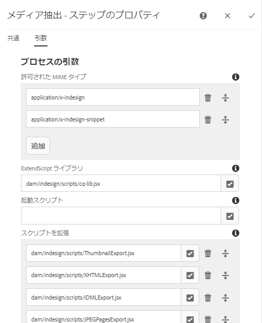
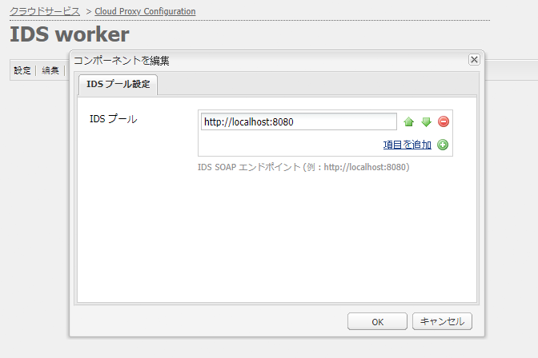
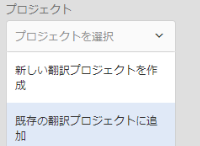

# AEM Assets と InDesign Server の統合 {#integrating-aem-assets-with-indesign-server}

Adobe Experience Manager (AEM) Assets では、次のものが使用されます。

* プロキシ：特定の処理タスクのロードを分配するために使用します。プロキシとは、プロキシワーカーと通信して特定のタスクを実行し、他の AEM インスタンスと通信して結果を送信する AEM インスタンスです。
* プロキシワーカー：特定のタスクを定義し管理するために使用します。これらは幅広いタスクを取り扱うことができます。例えば、InDesign Server を使用してファイルを処理することができます。

Adobe InDesign で作成したファイルを AEM Assets に完全にアップロードするために、プロキシが使用されます。このプロキシはプロキシワーカーを使用して Adobe InDesign Server と通信します。Adobe InDesign Server ではメタデータを抽出し、AEM Assets 用の様々なレンディションを生成するための[スクリプト](https://www.adobe.com/jp/devnet/indesign/documentation.html#idscripting)が実行されます。プロキシワーカーは、クラウド構成での InDesign Server と AEM インスタンスとの双方向通信を実現します。

>[!NOTE]
>
>Adobe InDesign は次の 2 製品で構成されます。
>
>* [InDesign](https://www.adobe.com/jp/products/indesign.html)
   >  印刷やデジタル配信のためのページレイアウトをデザインできます。
   >
   >
* [InDesign Server](https://www.adobe.com/jp/products/indesignserver.html)
   >  このエンジンを使用すれば、InDesign での作成物に基づいてドキュメントをプログラムによって自動生成できます。このエンジンは、[ExtendScript](https://www.adobe.com/jp/devnet/scripting.html) エンジンへのインターフェイスを提供するサービスとして動作します。
   >  このスクリプトは JavaScript によく似た ExtendScript で記述します。Indesign のスクリプトについて詳しくは、[https://www.adobe.com/jp/devnet/indesign/documentation.html#idscripting](https://www.adobe.com/jp/devnet/indesign/documentation.html#idscripting) を参照してください。
>

## 抽出の仕組み {#how-the-extraction-works}

Adobe InDesign Server と AEM Assets を統合して、InDesign で作成された INDD ファイルのアップロードやレンディションの生成のほか、すべてのメディアを抽出（ビデオなど）したり、アセットとして保存したりできます。

>[!NOTE]
>
>以前のバージョンの AEM では XMP とサムネールを抽出できましたが、現在はすべてのメディアを抽出できるようになりました。

1. INDD ファイルを AEM Assets にアップロードします。
1. フレームワークにより、コマンドスクリプトが SOAP（Simple Object Access Protocol）経由で InDesign Server に送信されます。このコマンドスクリプトは、次のことを実行します。

   * INDD ファイルを取得します。
   * InDesign Server コマンドを実行します。

      * 構造、テキストおよびすべてのメディアファイルが抽出されます。
      * PDF と JPG のレンディションが生成されます。
      * HTML と IDML のレンディションが生成されます。
   * 生成されたファイルを AEM Assets に送り返します。
   >[!NOTE]
   >
   >IDML は、InDesign ファイル内のすべての要素をレンダリングする XML ベースの形式です。**[Zip](https://www.techterms.com/definition/zip) 圧縮を使用した圧縮パッケージとして保存されます。
   >
   >
   >詳しくは、[Adobe Press -InDesign のデータ交換形式 INX および IDML](https://www.adobepress.com/articles/article.asp?p=1381880&amp;seqNum=8) を参照してください。

   >[!CAUTION]
   >
   >InDesign Server をインストールしていない場合や設定していない場合でも、INDD ファイルを AEM にアップロードすることは可能です。ただし、この場合に生成されるレンディションは、PNG と JPEG に限定されます。HTML、IDML またはページのレンディションを生成することはできません。

1. 抽出およびレンダリング生成後：

   * 構造が `cq:Page`（レンディションタイプ）に複製されます。
   * 抽出されたテキストとファイルが AEM Assets に保存されます。
   * すべてのレンディションが AEM Assets のアセット自体に保存されます。

## InDesign Server と AEM の統合{#integrating-the-indesign-server-with-aem}

プロキシの設定の後に、InDesign Server を AEM Assets と連携させて使用するには、次の手順を実行する必要があります。

1. [InDesign Server をインストールします](#installing-the-indesign-server)。
1. 必要に応じて、[AEM Assets ワークフロー](#configuring-the-aem-assets-workflow)を設定します。これは、デフォルト値がインスタンスに適さない場合にのみ必要です。

1. [InDesign Server のプロキシワーカー](#configuring-the-proxy-worker-for-indesign-server)を設定します。

### InDesign Server のインストール{#installing-the-indesign-server}

InDesign Server をインストールして AEM と連携して使用を開始するには：

1. Adobe InDesign Server をダウンロードしてインストールします。

   >[!NOTE]
   >
   >InDesign Server（CS6 以降）。

1. 必要に応じて、InDesign Server インスタンスの設定をカスタマイズできます。

1. コマンドラインから、サーバーを起動します。

   `<*ids-installation-dir*>/InDesignServer.com -port 8080`

   SOAP プラグインがポート 8080 でリスンする状態でサーバーが起動されます。すべてのログメッセージと出力がコマンドウィンドウに直接書き込まれます。

   >[!NOTE]
   >
   >ファイルに出力メッセージを保存してリダイレクトを使用する場合は、例えば Windows の場合は次のように実行します。
   >
   >
   >`<ids-installation-dir>/InDesignServer.com -port 8080 > ~/temp/INDD-logfile.txt 2>&1`

### AEM Assets ワークフローの設定 {#configuring-the-aem-assets-workflow}

AEM Assets には事前設定済みの **DAM アセットの更新**&#x200B;というワークフローがあります。このワークフローは、InDesign 向けの次の複数のプロセスステップで構成されます。

* [メディア抽出](#media-extraction)
* [ページ抽出](#page-extraction)

<!--
BROKEN LINK This workflow is setup with default values that can be adapted for your setup on the various author instances (this is a standard workflow, so further information is available under [Editing a Workflow](/help/sites-developing/workflows-models.md#configuring-a-workflow-step)). If you are using the default values (including the SOAP port), then no configuration is needed. BROKEN LINK
-->

設定後、通常の方法のいずれかによって InDesign ファイルを AEM Assets にアップロードすると、そのアセットを処理して各種レンディションを準備するのに必要となるワークフローが実行されます。`.indd` ファイルを AEM Assets にアップロードし、IDS で作成された各種レンディションが `<*your_asset*>.indd/Renditions` の下にあることを確認して、設定をテストしてください。

#### メディア抽出 {#media-extraction}

このステップでは、INDD ファイルからのメディアの抽出を制御します。

カスタマイズするには、**メディア抽出**&#x200B;ステップの「**引数**」タブを編集します。

メディア抽出の引数とスクリプトパス

* **ExtendScript ライブラリ**&#x200B;これは、他のスクリプトに必要とされる単純な http get/post メソッドライブラリです。

* **スクリプトを拡張**：ここで複数のスクリプトの組み合わせを指定できます。InDesign サーバーで独自のスクリプトを実行する場合は、`/apps/settings/dam/indesign/scripts` にスクリプトを保存します。Indesign スクリプトについて詳しくは、次のページを参照してください。
   [https://www.adobe.com/jp/devnet/indesign/documentation.html#idscripting](https://www.adobe.com/jp/devnet/indesign/documentation.html#idscripting)

>[!CAUTION]
>
>**ExtendScript ライブラリ**&#x200B;は変更&#x200B;**しないで**&#x200B;ください。

>このライブラリは Sling との通信に必要になる HTTP 機能を提供するものです。この設定では、InDesign Server で使用するために送信するライブラリを指定します。
>
メディア抽出ワークフローステップで実行される `ThumbnailExport.jsx` スクリプトにより、サムネールのレンディションを .jpg 形式で生成します。このレンディションはサムネールを処理ワークフローステップによって使用され、AEM で要求される静的レンディションを生成します。

サムネールを処理ワークフローステップは、異なるサイズの静的レンディションを生成するように設定できます。デフォルトの設定は AEM Assets UI によって要求されるので、削除しないでください。最後に、画像プレビューレンディションを削除ワークフローステップで不要になった .jpg 形式のサムネールレンディションが削除されます。

#### ページ抽出{#page-extraction}

抽出された要素から AEM ページを作成します。抽出ハンドラーが、レンディション（現時点では HTML または IDML）からデータを抽出するために使用されます。このデータを元に、PageBuilder を使用してページが作成されます。

カスタマイズするには、**ページ抽出**&#x200B;ステップの「**引数**」タブを編集します。

* **ページ抽出ハンドラー**：ドロップダウンリストから、使用するハンドラーを選択します。抽出ハンドラーは、関連する `RenditionPicker`（`ExtractionHandler` API を参照）によって選択された特定のレンディションに対して動作します。標準の AEM インストールでは、次の抽出ハンドラーを使用できます。

   *  IDML 書き出し抽出ハンドラー：
MediaExtract ステップで生成された `IDML` レンディションに対して動作します。

* **ページ名**：
生成されるページに割り当てる名前を指定します。空白にした場合、名前は「page」（「page」が既に存在する場合は、その派生形）になります。

* **ページタイトル**：
生成されるページに割り当てるタイトルを指定します。

* **ページルートのパス**：
生成されるページのルート位置を示すパス。空白にした場合、アセットのレンディションを保持しているノードが使用されます。

* **ページテンプレート**：
ページの生成時に使用するテンプレート。

* **ページデザイン**：
ページの生成時に使用するページデザイン。

### InDesign Server のプロキシワーカーの設定 {#configuring-the-proxy-worker-for-indesign-server}

>[!NOTE]
ワーカーは、プロキシインスタンス上にあります。

1. 「ツール」コンソールの左側のウィンドウで、「**クラウドサービス設定**」を展開します。次に、「**クラウドプロキシ設定**」を展開します。

1. 「**IDS ワーカー**」をダブルクリックして設定用に開きます。

1. 「**[!UICONTROL 編集]**」をクリックして設定ダイアログを開き、必要な設定を定義します。

   

   * **IDS プール**：
InDesign Server との通信に使用する SOAP エンドポイント。必要になる項目の追加、削除および並べ替えをおこなうことができます。

1. 「OK」をクリックして保存します。

### Day CQ Link Externalizer の設定 {#configuring-day-cq-link-externalizer}

InDesign Server と AEM が別のホストで実行されている、またはどちらかまた両方のアプリケーションがデフォルトのポートで実行されていない場合は、**Day CQ Link Externalizer** で InDesign Server のホスト名、ポートおよびコンテンツを設定します。

1. `https://[aem_server]:[port]/system/console/configMgr` の URL で Configuration Manager にアクセスします。
1. **Day CQ Link Externalizer** 設定を探し、**編集**&#x200B;アイコンをクリックして開きます。
1. InDesign Server のホスト名とコンテンツパスを指定し、「**Save**」をクリックします。

   

### InDesign Server の並列ジョブ処理の有効化 {#enabling-parallel-job-processing-for-indesign-server-s}

IDS の並列ジョブ処理を有効にすることができます。

まず、InDesign Server が処理できる並列ジョブの最大数（`x`）を決定する必要があります。

* 単一のマルチプロセッサーマシンでは、InDesign Server が処理できる並列ジョブの最大数（x）は、IDS を実行するプロセッサー数から 1 を減算した数です。
* 複数のマシンで IDS を実行する場合は、すべてのマシンで使用可能なプロセッサーの総数を把握して、そこからマシン総数を減算する必要があります。

IDS 並列ジョブ数を設定するには：

1. Felix Console の「**Configurations**」タブを開きます。次に URL の例を挙げます。`https://[aem_server]:[port]/system/console/configMgr`

1. 次の場所で IDS 処理キューを選択します。

   `Apache Sling Job Queue Configuration`

1. 次のように設定します。

   * **Type** - `Parallel`
   * **Maximum Parallel Jobs** - `<*x*>`（上で計算した値）

1. これらの変更を保存します。
1. 次のチェックボックスをオンにして、CS6（およびそれ以降）のマルチセッションサポートを有効にします。

   `enable.multisession.name` チェックボックス

   このチェックボックスは次の場所にあります。

   `com.day.cq.dam.ids.impl.IDSJobProcessor.name configuration`

1. [IDS ワーカー設定](#configuring-the-proxy-worker-for-indesign-server)に SOAP エンドポイントを追加して、`<*x*>` 個の IDS ワーカーから成るプールを作成します。

   複数のマシンで InDesign Server を実行している場合は、マシンあたりのプロセッサー数から 1 を減算した数の SOAP エンドポイントを各マシンに追加します。

   >[!NOTE]
   ワーカーのプールを操作するときに、IDS ワーカーのブラックリスト設定を有効にすることもできます。
   それには、`com.day.cq.dam.ids.impl.IDSJobProcessor.name` 設定の下にある「enable.retry.name」チェックボックスをオンにします。これにより、IDS ジョブ再試行が有効になります。
   また、`com.day.cq.dam.ids.impl.IDSPoolImpl.name``max.errors.to.blacklist` 設定の下のパラメーターに正の値を設定します。このパラメーターは、IDS をジョブハンドラーリストから除外するまでのジョブ再試行回数を指定します。
   デフォルトでは、設定可能な（retry.interval.to.whitelist.name）時間（分）が経過した後で、IDS ワーカーが再検証されます。ワーカーがオンラインである場合は、ブラックリストから削除されます。

## InDesign Server 10.0 以降のサポートの有効化 {#enabling-support-for-indesign-server-or-higher}

InDesign Server 10.0 以降では、次の手順を実行してマルチセッションサポートを有効化します。

1. AEM Assets インスタンス `https://[aem_server]:[port]/system/console/configMgr` から Configuration Manager を開きます。
1. 設定 `com.day.cq.dam.ids.impl.IDSJobProcessor.name` を編集します。
1. **[!UICONTROL ids.cc.enable]** オプションを選択し、「**[!UICONTROL 保存]**」をクリックします。

>[!NOTE]
AEM Assets に InDesign Server を統合する場合、統合に必要なセッションサポート機能はシングルコアのシステムではサポートされていないので、マルチコアのプロセッサーを使用してください。

## AEM 資格情報の設定{#configure-aem-credentials}

AEM インスタンスから InDesign サーバーにアクセスするためのデフォルトの管理者資格情報（ユーザー名とパスワード）を、InDesign サーバーとの統合を中断することなく、変更できます。

1. `/etc/cloudservices/proxy.html` にアクセスします。
1. ダイアログで、新しいユーザー名とパスワードを指定します。
1. この資格情報を保存します。
