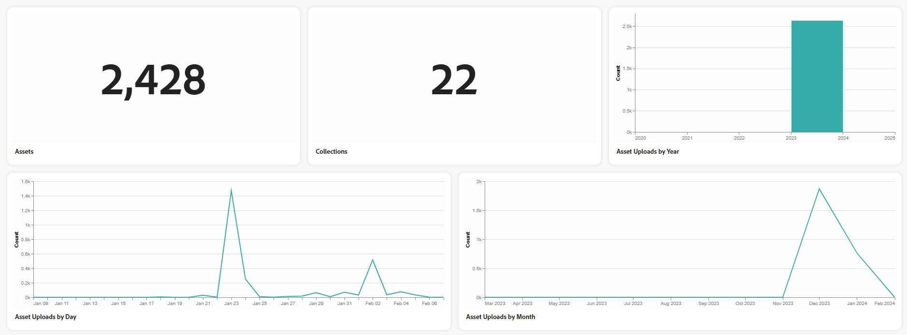

# [!DNL Content Hub] のアセットインサイト {#assets-insights}

<table>
    <tr>
        <td>
            <i> 新規 </i>Dynamic Media Prime<a href="/help/assets/dynamic-media/dm-prime-ultimate.md"><b>Ultimate</b></a>
        </td>
        <td>
            <i> 新規 </i> <a href="/help/assets/assets-ultimate-overview.md"><b>AEM AssetsUltimate</b></a>
        </td>
        <td>
            <i> 新規 </i> <a href="/help/assets/integrate-aem-assets-edge-delivery-services.md"><b>AEM AssetsとEdge Delivery Servicesの統合 </b></a>
        </td>
        <td>
            <i> 新規 </i><a href="/help/assets/aem-assets-view-ui-extensibility.md"><b>UI 拡張機能 </b></a>
        </td>
          <td>
            <i>Dynamic Media Prime</i>Ultimateの新 <a href="/help/assets/dynamic-media/enable-dynamic-media-prime-and-ultimate.md"><b> 能 </b></a>
        </td>
    </tr>
    <tr>
        <td>
            <a href="/help/assets/search-best-practices.md"><b>検索のベストプラクティス</b></a>
        </td>
        <td>
            <a href="/help/assets/metadata-best-practices.md"><b>メタデータのベストプラクティス</b></a>
        </td>
        <td>
            <a href="/help/assets/product-overview.md"><b>コンテンツハブ</b></a>
        </td>
        <td>
            <a href="/help/assets/dynamic-media-open-apis-overview.md"><b>OpenAPI 機能を備えた Dynamic Media</b></a>
        </td>
        <td>
            <a href="https://developer.adobe.com/experience-cloud/experience-manager-apis/"><b>AEM Assets 開発者向けドキュメント</b></a>
        </td>
    </tr>
</table>

>[!AVAILABILITY]
>
>コンテンツハブガイドを PDF 形式で利用できるようになりました。ガイド全体をダウンロードし、Adobe Acrobat AI アシスタントを使用して質問に答えてください。
>
>[!BADGE コンテンツハブガイドの PDF]{type=Informative url="https://helpx.adobe.com/content/dam/help/en/experience-manager/aem-assets/content-hub.pdf"}

[!DNL Content Hub] は、アセットに関する貴重なインサイトを提供し、マーケティング関係者が頻繁に直面する一般的な課題点、つまりマーケティングキャンペーン、チャネル、様々な地域で使用されるアセットの使用状況統計に対処します。アセットのパフォーマンスと人気を明確に把握することで、ユーザーエクスペリエンスの向上に不可欠な実用的なインサイトが得られます。

## 前提条件 {#prerequisites}

[コンテンツハブユーザー](deploy-content-hub.md#onboard-content-hub-users)は、この記事で説明されているアクションを実行できます。

## アップロードしたアセットの統計の表示{#view-statistics-for-uploaded-assets}

「**[!UICONTROL インサイト]**」タブに移動すると、アップロードしたアセットとコレクションの統計を表示できます。年別、月別、日別のアセットアップロード数のビューを使用して、アセットのアップロード履歴を追跡します。

<!-- You can track the upload history of your assets over the past 30 days or gain a more comprehensive view with data spanning the last 12 months. This feature enables you to evaluate the upload count of assets.  -->

<!-- Go to the **[!UICONTROL [!DNL Insights]]** tab.

2. Select the desired time frame to view the statistics; you can opt for either last 30 days or last 12 months.

Data for the selected time frame is displayed, including the upload count for the specified duration. -->

## 詳細な統計的な分析の表示{#view-detailed-statistical-analysis}

コンテンツハブを使用すると、ファイル形式、キャンペーン、チャネル、地域に基づいてアセット数の統計を表示できます。アセット配布に関する貴重なインサイトを得ることができ、十分な情報に基づいた意思決定と戦略的計画が促進されます。

テーブルには、リポジトリ内のアセットの数とそれぞれの割合を含む、様々なアセットの詳細な概要が表示されます。列のサイズを調整したり、アセット名、数、割合でアセットを並べ替えたりできます。

円グラフは、ファイル形式別のアセットの合計数を視覚的に表し、個々のアセット数とその割合を明確に示します。

また、以下を表示することもできます。

* **日別と月別のアクティブユーザー数**：折れ線グラフを使用して表される日別または月別のアクティブユーザー数。
* **[!UICONTROL キャンペーン別アセット数]**：キャンペーンに基づくアセット数とそれぞれの割合。
* **[!UICONTROL チャネル別アセット数]**：使用されているチャネルに基づくアセット数とそれぞれの割合。
* **[!UICONTROL 地域別アセット数]**：アセットの使用状況の地域に基づくアセット数とそれぞれの割合。
