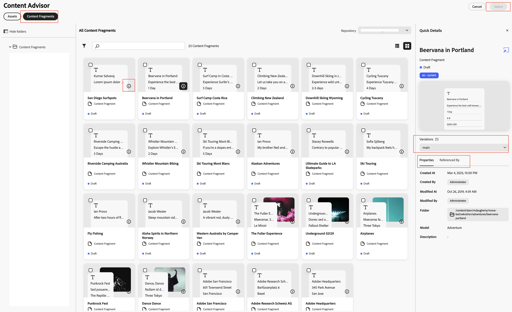

# Content Advisorを使用して、AdobeおよびAdobe以外のアプリケーションでAEM コンテンツにアクセスする{#content-advisor-aem-assets-adobe-non-Adobe-applications}

Content Advisorは、AdobeおよびAdobe以外のアプリケーションをまたいで、統合されたコンテンツ発見体験を提供します。 Adobe Workfront、AJO B2C （近日リリース予定）、AEM Sites、Adobe以外のアプリケーションなど、アプリケーションとネイティブに統合されたContent Advisorは、コンテンツ（アセットとコンテンツフラグメント）を単一のインテリジェントなインターフェイスで統合します。 これにより、ワークフロー内で最も関連性の高いコンテンツを簡単に見つけ、参照、再利用できるようになり、コンテキストを損なうことなく、迅速に移動できます。

Content Advisorは、コンテキストに即したインテリジェントな発見をオーサリングエクスペリエンスに直接提供し、意図にもとづいて承認済みの適切なコンテンツを迅速に検索するのに役立ちます。 スマート提案、ダイナミックメディアのレンディション、詳細なアセットメタデータなどの機能を使用して、アプリケーションのインターフェイスから離れることなく、コンテンツを効率的に評価および再利用できます。これにより、ブランドの一貫性を維持しながら、コンテンツ制作を高速化できます。

Adobe Experience Manager（AEM）Assetsは、Adobe Expressともネイティブで統合されているため、コンテンツアドバイザーを使用して、AEM AssetsからアセットをExpress インターフェイス内で直接検索、アクセス、使用できます。 詳しくは、[&#x200B; コンテンツアドバイザーを使用してAdobe ExpressのAEM Assetsにアクセス &#x200B;](/help/assets/native-integration-adobe-express.md)を参照してください。

## 前提条件 {#prerequisites}

* AEM Assets as a Cloud Serviceへのアクセス。

* オーサリングされたコンテンツフラグメントを含むAEM Sites環境へのアクセス（コンテンツフラグメントの操作に対してのみ必要）。 これは、バイナリアセットまたはAEM Assetsへのアクセスには必要ありません。

## Content Advisorによるインテリジェントなアセット発見 {#intelligent-asset-discovery-content-advisor}

Content Advisorは、ホストのAdobeアプリケーションのコンテンツやキャンペーン概要にもとづいて、コンテキストに即したインテリジェントなレコメンデーションを使用して、関連性の高いコンテンツを発見するのに役立ちます。 また、ユースケースに最適化された、チャネル対応のDynamic Media レンディションを選択することもできます。

>[!IMPORTANT]
> 
>**リポジトリ** ドロップダウンリストから&#x200B;**作成者** リポジトリを選択してください。 **配信** リポジトリにContent Advisor機能が表示されません。
>
> また、**配信** リポジトリには、フォルダーとコレクションで整理されたコンテンツがありません。 コンテンツは、フラット構造でルートレベルに表示されます。

Content Advisorには、次の主な機能が用意されています。

* [AI 検索を活用し、よりスマートなアセットの発見を実現](#content-advisor-ai-search)

* [コンテキストと意図にもとづくスマートな提案](#smart-suggestions-content-advisor)

* [適切なアセットを見つけるためのキャンペーン概要](#campaign-briefs-content-advisor)

* [使用できるDynamic Media アセットのレンディション](#dynamic-media-renditions-content-advisor)

* [コンテンツフラグメントとのシームレスな統合](#content-fragments-integration-content-advisor)

* [Assetsのビューと一致したアセットのメタデータへのアクセス](#asset-metadata-content-advisor)

* [Assets ビューと一致したフィルターへのアクセス](#filters-content-advisor)

* [最近の検索と保存した検索にアクセスして再利用](#saved-searches-content-advisor)

* [コレクション間およびコレクション内のアセットの検索](#search-collections-content-advisor)

### AI 検索を活用し、よりスマートなアセットの発見を実現 {#content-advisor-ai-search}

Content Advisorは、正確なキーワード一致に依存するのではなく、ユーザーのクエリの背後にある意味と意図を理解する高度な検索機能を使用します。 AI （人工知能）とマシンラーニング（機械学習）を利用して、より正確でコンテキストに即した結果を提供します。

従来のキーワードベースの検索では、正確な用語を検索しますが、AI 検索は、単語、概念、ユーザーの意図の間の関係を解釈します。 これにより、クエリの表現が異なる場合や、入力ミスが含まれる場合、別の言語である場合でも、ユーザーが探しているものを確実に見つけることができます。

Content AdvisorのアセットのAI 検索

主なメリットには、次のようなものがあります。

* 多言語サポート：正確な翻訳を必要とせずに、複数の言語を検索できます。 ユーザーは、クエリ言語に関係なく、関連するコンテンツを見つけることができます。

* 誤字の処理：タイプミスやスペルミスを解釈して、入力に不備がある場合でも正確な結果を得ることができます。

* 類義語の理解：関連する用語やフレーズに対して結果を提供するため、ユーザーは適切なキーワードを推測する必要がありません。

* コンテキストに応じた検索：正確な単語だけでなく、クエリの背後にある意図を認識します。

>[!IMPORTANT]
> 
>* Content Advisor内のAI 検索にアクセスするために必要なAEM リリースの最小バージョンは`21994`です
>* コンテンツフラグメントのAI 検索サポートは近日リリース予定です。

### コンテキストと意図にもとづくスマートな提案 {#smart-suggestions-content-advisor}

Content Advisorは、ホスト Adobe アプリケーションのコンテキストに基づいてスマート提案を表示します。 これにより、時間のかかる手作業での検索をおこなうことなく、コンテンツニーズに即したアセットをすばやく見つけ出して使用できます。

>[!IMPORTANT]
> 
>* Content Advisor内でこの機能にアクセスするには、GenAI ライダーに署名する必要があります。 GenAI ライダーに署名するには、Adobe担当者にお問い合わせください。
>* この機能にアクセスするために必要なAEM リリースの最小バージョンは`21994`です。
>* Content Advisorは、ホスト Adobe アプリケーション内で使用可能なコンテンツのコンテキストと意図に基づいて、スマート提案を表示します。 画像に基づく結果は表示されません。 この機能をサポートするサポートされているAdobe アプリケーションの一覧については、[Adobe アプリケーション全体でのContent Advisor機能のサポート &#x200B;](#content-advisor-feature-support-adobe-applications)を参照してください。

### 適切なアセットを見つけるためのキャンペーン概要 {#campaign-briefs-content-advisor}

Content Advisorを使用すると、検索キーワードを手動で入力しなくても、キャンペーン概要ドキュメントをアップロードして関連アセットを見つけることができます。 Content Advisorは、施策概要の情報を分析し、施策の意図を把握して、AEM Assetsで利用可能な関連アセットを提案します。

>[!IMPORTANT]
>
>* コンテンツアドバイザーは、キャンペーン概要のテキストとして利用できる情報を分析し、関連するアセットを提案します。 キャンペーン概要で画像として利用できる情報は分析されません。
>* キャンペーン概要としてアップロードできるサポートされているファイルタイプには、PDF、DOCX、TXT ドキュメントがあります。
>* Content Advisor内でこの機能にアクセスするには、GenAI ライダーに署名する必要があります。 GenAI ライダーに署名するには、Adobe担当者にお問い合わせください。
>* この機能にアクセスするために必要なAEM リリースの最小バージョンは`21994`です。
>* コンテンツフラグメントのキャンペーン概要のアップロードに関するサポートは、近日提供開始予定です。

### 使用できるDynamic Media アセットのレンディション {#dynamic-media-renditions-content-advisor}

Dynamic Mediaのレンディションは、[画像プリセット &#x200B;](/help/assets/dynamic-media/managing-image-presets.md)、[&#x200B; スマート切り抜き](/help/assets/dynamic-media/image-profiles.md)、形式タイプ、カラープロファイルなど、チャネルに合わせて最適化された、すぐに使用できるバージョンのアセットを提供します。 これらのレンディションにより、選択したアセットが手作業による編集やアセットの複製を必要とせずに、チャネルやデザイン要件を満たしていることを確認できます。

また、ホストのAdobe アプリケーションのレンディションを選択する前に、Dynamic Media修飾子をリアルタイムでプレビューして、アセットの一貫性と品質を維持しながら、最も適切なレンディションをより迅速に選択できます。

アセットカードの アイコンをクリックし、**[!UICONTROL Dynamic Media]** タブを選択して、アセットで使用可能なレンディションを表示します。 [Dynamic Media Scene7](/help/assets/dynamic-media/dynamic-media.md) レンディションまたは[Dynamic Media with OpenAPI](/help/assets/dynamic-media-open-apis-overview.md) レンディションを表示するように選択できます。 アセットに&#x200B;**[!UICONTROL OpenAPI]**&#x200B;を選択すると、使用可能なレンディションは、アセットが承認され、OpenAPIを使用してDynamic Mediaで使用可能な場合にのみ表示されます。

Dynamic Media タブを表示するには、有効なAEM Dynamic Media ライセンスが必要です。

 アイコンをクリックしてレンディションをプレビューするか、レンディション名をクリックして&#x200B;**[!UICONTROL 選択]**&#x200B;をクリックして、レンディションをホストアプリケーションで使用できるようにします。

「**[!UICONTROL 修飾子を追加]**」をクリックし、テキストボックスに修飾子を指定してEnter キーを押し、すべてのアセットレンディションにリアルタイムで変換を適用します。 同様に、複数の修飾子をレンディションに追加し、それらの変換をプレビューできます。 レンディション名をクリックし、**[!UICONTROL 選択]**&#x200B;をクリックして、レンディションをホストアプリケーションで使用できるようにします。 これらの修飾子を適用した後のレンディションは保存されません。 [Dynamic Media Scene7](https://experienceleague.adobe.com/ja/docs/dynamic-media-developer-resources/image-serving-api/image-serving-api/http-protocol-reference/command-reference/c-command-reference)および[Dynamic Media with OpenAPI](https://developer.adobe.com/experience-cloud/experience-manager-apis/api/stable/assets/delivery/#operation/getAssetSeoFormat)でサポートされている修飾子の一覧を参照してください。

Dynamic Media パネルとContent Advisorの統合方法について詳しくは、[Dynamic Mediaとの統合](/help/assets/integration-with-dynamic-media.md)を参照してください。

### コンテンツフラグメントの検出 {#content-fragments-discovery-content-advisor}

Content Advisorは、コンテンツフラグメントを検出し、サポート対象のAdobe アプリケーションにフラグメントを簡単に参照して組み込むことができるようにします。 コンテンツフラグメントのリストを検索し、現在のワークフローから離れることなく、最も関連性の高いコンテンツを選択します。

各コンテンツフラグメントは、コンテンツから生成されたライブサムネールプレビューを含むカードとして表され、適切なフラグメントをすばやく特定するのに役立ちます。 また、タイトルやステータス（ドラフト、変更、公開済み）などの詳細情報も表示されます。 詳細なインサイトを得るには、 アイコンをクリックして、詳細なプロパティ、他のコンテンツフラグメントへの参照、使用可能なバリエーションを表示し、情報に基づいたコンテンツの選択と再利用を確保します。

コンテンツアドバイザーの コンテンツフラグメント

>[!IMPORTANT]
> 
>* Content Advisorのコンテンツフラグメントでは、AI 検索、スマート提案、キャンペーン概要のアップロード、プレビュー機能はまだサポートされていません。

### Assetsのビューと一致したアセットのメタデータへのアクセス {#asset-metadata-content-advisor}

Content Advisorでは、Assets ビューで使用可能なメタデータを含む、AEM Assetsで定義されたアセットプロパティにアクセスできます。 Content Advisorは、Assets ビューと同じメタデータ設定を使用し、Assets ビューアセットの詳細ページのメタデータタブとコンテンツのリストをレプリケートします。 これにより、アセットを選択する前に、タイトル、説明、形式、サイズ、その他のメタデータなどの主要なアセットの詳細を確認できます。 アセットのプロパティにアクセスすることで、コンテンツに適した承認済みアセットを選択できます。

のAssets ビューメタデータ

アセットカードの アイコンをクリックし、**[!UICONTROL 基本]** タブを選択して、アセットのメタデータを表示します。 Assets ビューに存在するアセットメタデータと一致して、他のアセットメタデータタブ（製品、キャンペーン、タグなど）を表示することもできます。

Content Advisorは、ファイルのプロパティ（メタデータ）を読み取り専用ビューで表示します。 コレクションとフォルダーのプロパティは表示されません。

### Assets ビューと一致したフィルターへのアクセス {#filters-content-advisor}

Content Advisorには、Assets ビューで利用可能なホスト Adobe アプリケーション内と同じフィルタリング機能が用意されており、定義済みのフィルターを使用してアセットを絞り込むことができます。 Assets ビューと同じフィルタリング機能が、ファイル、フォルダー、コレクションなど、コンテンツタイプに固有のフィルターにも適用されます。 これにより、アセットの一貫した検索が可能になり、ホストのAdobeアプリケーション内で関連アセットを効率的に検索できます。

フィルタースキーマを使用してAssets ビューでフィルターを設定していない場合、Content Advisorには、ファイルタイプ、ファイル形式、アセットステータス、ファイルサイズ、画像サイズ、画像の高さ、変更日、作成日など、すぐに使用できるフィルターが表示されます。

カスタムフィルタースキーマはAssets（ファイル）でサポートされていますが、フォルダーとコレクションではまだサポートされていません。

### 最近の検索と保存した検索にアクセスして再利用 {#saved-searches-content-advisor}

Assets ビューで作成された保存済みの検索も使用できるので、定義済みの検索条件を再利用できます。 保存済み検索は、ブラウザー間でAssets ビューとContent Advisorの間で一貫して機能します。 これにより、AEM Assetsやその他のAdobeアプリケーションで一貫した検索パターンを使用して、アセットを効率的に見つけることができます。

コンテンツアドバイザーを使用して頻繁に使用する検索を保存するには：

1. 検索語（オプション）を指定し、フィルターアイコンをクリックし、要件に基づいてオプションを選択して検索クエリを作成します。

1. **保存済み検索を管理** > **新しい保存済み検索を作成**&#x200B;をクリックします。

1. 検索の名前を指定し、をクリックして保存します。 検索が項目のリストに表示されます。

   

保存した検索項目のいずれかを適用するには、**[!UICONTROL 保存済み検索項目]** ドロップダウンリストから検索項目を選択します。 コンテンツアドバイザーは、検索クエリに基づいて結果を表示します。

Content Advisorは、最近検索した項目を保存し、頻繁に使用する項目を保存して、後ですばやくアクセスできるようにします。 Assets ビューとContent Advisorの間で、最近検索した内容のリストが一致しません。 同じユーザーが、Assets ビューとContent Advisorで異なる最近検索セットを持つことができます。 シークレットモードを使用してContent Advisorにアクセスする場合、最近検索した項目のリストは使用できません。 また、最近検索した内容は、同じユーザーに対して異なるブラウザー間で共有されず、AEM環境に固有です。

Assets ビューで使用できるデフォルトの保存済み検索機能は、コンテンツアドバイザーではまだ使用できません。

### コレクション間およびコレクション内のアセットの検索 {#search-collections-content-advisor}

Content Advisorを使用すると、すべてのコレクション間でアセットまたはコレクションを検索したり、特定のコレクションに検索を制限したりできます。 これにより、組織のコンテキストを維持しながら、厳選されたコレクションからアセットをすばやく見つけ出して使用することができます。

## Content Advisor機能のサポートをAdobeアプリケーション全体で提供 {#content-advisor-feature-support-adobe-applications}

次の表に、Adobe アプリケーション全体でのContent Advisor機能のサポートを示します。

>[!IMPORTANT]
> 
> Content Advisorが他のAdobe アプリケーションに拡張されると、このテーブルが更新され、最新のサポートが反映されます。

| アプリケーション | Assetsでのブリーフのアップロードのサポート | Assetsの検索中に表示されるコンテンツパネルのサポート | Assetsの検索時のDynamic Media パネルのサポート | コンテンツフラグメントの検索のサポート |
|--------------------------------------|----------------------------------------------|-----------------------------------------------------------|--------------------------------------------------------|------------------------------------------|
| [Adobe Express](/help/assets/native-integration-adobe-express.md) | ✓ | ✓ | ✓ | − |
| [AEM Sites - ドキュメント作成](https://www.aem.live/docs/authoring-guide#document-authoring) | ✓ | ✓ | ✓ | − |
| [AEM Sites - ユニバーサルエディター](https://www.aem.live/docs/authoring-guide#universal-editor-in-aem-sites) | ✓ | ✓ | ✓ | − |
| AEM Sites - [GoogleDrive](https://www.aem.live/docs/authoring-guide#google-drive)/[Sharepoint オーサリング &#x200B;](https://www.aem.live/docs/authoring-guide#microsoft-sharepoint) | ✓ | − | ✓ | − |
| AEM Sites - コンテンツフラグメントエディター（コンテンツリファレンスフィールドのみ） | ✓ | ✓ | ✓ | − |
| Adobe Workfront Workflow | ✓ | ✓ | − | ✓ |
| Adobe Workfront Planning | ✓ | ✓ | − | ✓ |
| [AEM Assets ビュー](/help/assets/assets-view-introduction.md) | ✓ | − | − | − |
| [AEM Content Hub](/help/assets/product-overview.md) | ✓ | ✓ | − | − |
| B2C[&#128279;](http://experienceleague.adobe.com/en/docs/journey-optimizer/using/ajo-home)のAdobe Journey Optimizer （AJO） | ✓ | ✓ | ✓ | ✓ |

## Content Advisor機能のサポートをAdobe以外のアプリケーションにも対応 {#content-advisor-feature-support-non-adobe-applications}

Content Advisorは、Adobe以外（サードパーティ）のアプリケーションとの統合も可能で、Adobeのアプリケーションに留まらず、インテリジェントなアセット検索を実現します。 AIを活用した検索、コンテキストに応じたレコメンデーション、キャンペーン概要ベースの検索、Dynamic Media レンディションへのアクセス、コンテンツフラグメントの検索、フィルター、アセットメタデータなど、同じ豊富な機能セットをサードパーティ統合でサポートしています。

これにより、Adobe Expressやその他のAdobeアプリケーションで利用できるエクスペリエンスの一貫性を保ちながら、AEM Assetsからの承認済みアセットを外部アプリケーション内で直接検索、評価、使用できます。

統合、プロパティおよびカスタマイズについて詳しくは、次の記事を参照してください。

* [Content Advisorの統合例](https://github.com/adobe/aem-assets-selectors-mfe-examples/tree/consolidate-docs-to-experience-league/examples)

* [Content Advisor プロパティ](/help/assets/content-advisor-properties.md)

* [Content Advisor カスタマイズ](/help/assets/content-advisor-customization.md)

