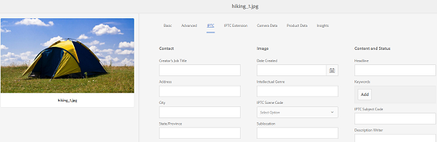

# IPTC メタデータのサポート {#support-for-iptc-metadata}

Adobe Experience Manager（AEM）Assets で、Adobe Bridge やその他のクリエイティブアプリを通じてアセットに追加された IPTC メタデータ、クリエイティブの評価、キーワードをサポートする方法について説明します。

Adobe Experience Manager (AEM) Assetsは、アセットの記述に広く使用されるIPTCメタデータ標準をサポートしています。 このように AEM Assets では、フォトグラファー、クリエイティブエージェンシー、ライブラリ、ミュージアムなど、様々な関係者間で AEM Asset 画像を受け入れる仕組みを強化しています。

包括的なメタデータプロパティを定義するための IPTC コアおよび IPTC 拡張のメタデータスキーマが、アセット用のデフォルトのメタデータスキーマに組み込まれました。これにより、画像に示されている人、場所、製品に関して、正確で信頼性の高いデータを追加できます。また、画像作成に関する日付、名前および識別子に加え、著作権情報を表示する柔軟な方法もサポートされています。

アセットのプロパティページに新たなタブが組み込まれていて、編集可能なフィールドに IPTC コアと IPTC 拡張のメタデータが個別に表示されます。

1. Assets ユーザーインターフェイスで画像を選択します。
1. ツールバーの「**[!UICONTROL プロパティ]**」アイコンをクリックまたはタップします。
1. In the Properties page, click/tap the **[!UICONTROL IPTC]** tab to view IPTC metadata for the asset.
1. 必要に応じて、IPTC メタデータのプロパティを編集します。

   

1. Click/tap the **[!UICONTROL IPTC Extension]** tab to view IPTC Extension metadata for the asset.
1. 必要に応じて、IPTC 拡張メタデータのプロパティを編集します。
1. Tap/click **[!UICONTROL Save &amp; Close]** to save the changes.

## クリエイティブの評価のサポート {#creative-rating-support}

プロパティページには、個々のユーザーの評価と総評価が表示されるほか、Adobe Bridge およびその他のクリエイティブアプリを通じてアセットに割り当てられた評価も表示されるようになりました。

These ratings are available under **[!UICONTROL Creative Rating]** section within the **[!UICONTROL Advanced]** tab.

この評価は読み取り専用プロパティであり、評価値は 1～5 です。検索パネルで、クリエイティブの評価に基づいてアセットを検索できます。

ただし、ユーザーがおこなったカスタムの変更との競合を避けるため、このプロパティには現在のところインデックスは付けられません。

## キーワードのサポート {#keyword-support}

プロパティページの「**[!UICONTROL IPTC]**」タブには、Adobe Bridge およびその他のクリエイティブアプリを通じてアセットに追加されたキーワードも表示されます。これらのキーワードの編集や、キーワードの追加も「**[!UICONTROL IPTC]**」タブでおこなえます。

