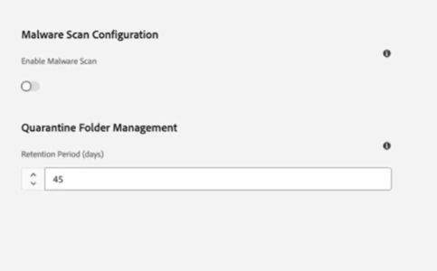
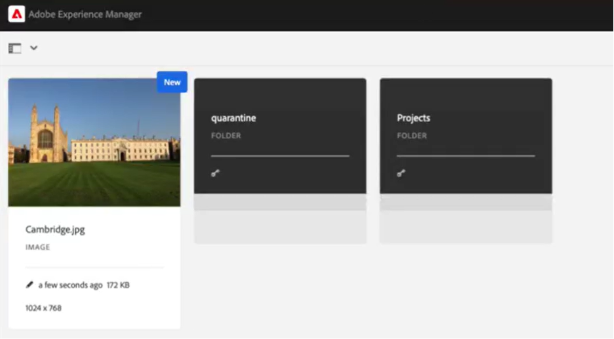

# マルウェアの検出 {#malware-detection-overview}

アセットのアップロード中のマルウェア検出は、デジタルアセット管理（DAM）システムのセキュリティを維持するために重要です。 画像、ビデオ、ドキュメント、その他のファイルなどのアセットをアップロードすると、処理する前に潜在的な脅威がないかスキャンされます。 AEM Assetsは、アップロードされたファイルを自動的にスキャンして、マルウェアがないか確認し、疑わしいアセットを隔離して、安全でないコンテンツが DAM に入るのを防ぎます。 [ 一括読み込み ](/help/assets/bulk-import-assets-view.md)、[Assets ビュー ](/help/assets/assets-view-introduction.md)、[Content Hub](/help/assets/product-overview.md) のAssetsは前処理の間にスキャンされ、すべてのアップロード方法で一貫したマルウェア対策が行われます。 管理者は [ 強制隔離設定と保持ポリシーを管理 ](#malware-detection-configuration) して、セキュリティを [ 維持 ](#quarantine-folder-actions) できます。

## 主な機能 {#key-capabilities-malware-detection}

アセットの保護には、次の機能が含まれます。

* **アップロード前のチェック：** ファイルタイプ、サイズ、整合性を検証して、破損したファイルや互換性のないファイルを防ぎます。
* **リアルタイムスキャン：** マルウェアを示す可能性のある疑わしいファイル構造や異常なファイル構造を検出します。
* **インシデント対応：** マルウェアが検出された場合、アセットは DAM にアップロードされないように分離されたフォルダーで隔離されます。

## 前提条件 {#prerequisites-malware-detection}

AEM Assetsでのマルウェア検出には、AEM管理者権限が必要です。 さらに、[Assets Ultimate](https://helpx.adobe.com/jp/enterprise/using/support-for-experience-cloud.html) または [AEM Assets as a Cloud Service} のいずれかの有効なライセンスが必要 ](/help/assets/assets-ultimate-overview.md) す。

## マルウェア検出設定 {#malware-detection-configuration}

AEM Assetsでマルウェア検出を設定するには、次の手順に従います。

1. AEM Assetsの管理者ビューにログインします。

1. **[!UICONTROL ツール]**/**[!UICONTROL Assets]**/**[!UICONTROL Assets設定]** に移動し、「**[!UICONTROL マルウェア スキャンの設定]**」を選択します。 [Malware Scan configuration] （マルウェアのスキャン）画面が表示されます。

1. マルウェア スキャンを有効にするには、[ マルウェア スキャンを有効にする **[!UICONTROL の切り替え]** をオンにします。

1. 「**[!UICONTROL 強制隔離フォルダー管理]**」セクションの **[!UICONTROL 保持期間]** 設定を使用して、アセットが自動的に削除されるまでの強制隔離期間の日数を指定します。 デフォルトでは、アセットは 30 日間保持されます。 [ 強制隔離フォルダー管理 ](#quarantine-folder-management) を参照してください。

1. 「**[!UICONTROL 保存]**」をクリックして、設定を適用します。

   

## AEM Assetsのマルウェア検出プロセス {#process-of-malware-detection}

AEM Assetsは、以下の手順に従って、アップロードされたすべてのファイルをスキャンし、潜在的な脅威がないか確認します。

1. アセットを DAM にアップロードします。

1. マルウェアのスキャン処理は、前処理状態で自動的に開始されます。

1. 疑わしいまたは感染しているとフラグ付けされたAssetsは **[!UICONTROL 強制隔離]** フォルダーに配置されます。それ以外の場合は、保存および処理のために DAM に進みます。  管理者は保持設定に基づいて [ 強制隔離されたアセットを確認し ](#quarantine-folder-management) クリーンアップを管理することができます。

   

1. 次の通知が、アセットをアップロードしたユーザーおよび強制隔離管理者に送信されます。

   * **強制隔離されたアセット：** アップロードされたアセットが感染していると検出され、強制隔離フォルダーに移動されたときにトリガーされます。
   * **強制隔離されていないアセット：** 管理者が強制隔離からアセットを復元した場合。
   * **スキャンをスキップ：** アセットが 2GB のファイルサイズ制限を超えると送信され、スキャナーによる安全性の判断が妨げられます。
   * **スキャン失敗：** スキャナで予期しないエラーが発生し、アセットの安全性を確認できない場合。

### 強制隔離フォルダー管理 {#quarantine-folder-management}

マルウェア検出プロセス中に、感染したアセットや疑わしいアセットは自動的に **[!UICONTROL 強制隔離]** フォルダーに移動され、DAM にアップロードされなくなります。 ま [!DNL Experience Manager Assets]、強制隔離されたアセットを削除するまでの保持期間を [ 設定 ](#malware-detection-configuration) することができます。 さらに、強制隔離フォルダーは、管理者にのみ表示されます。

#### フォルダーの強制隔離アクション {#quarantine-folder-actions}

強制隔離フォルダー内のAssetsは変更できず、フォルダーに新しいアセットをアップロードまたは作成することはできません。 ただし、管理者は、強制隔離フォルダー内のアセットを選択して、次のアクションを実行できます。

* **メタデータを表示：** アセットのプロパティやメタデータを確認して、適切な次の手順を決定します。
* **強制隔離解除アセット：** 強制隔離されたアセットを選択し、「**[!UICONTROL 強制隔離解除]**」を選択して元の場所に復元します。 管理者は、強制隔離されていないアセットの詳細を表示することもできます。
* **アセットを削除：** 強制隔離フォルダーからアセットを完全に削除します。 削除したアセットは復元できません。

## マルウェア スキャンの制限 {#malware-scan-limitations}

次に、アセットのマルウェア スキャン プロセスの制限事項を示します。

* このスキャナーは、最大 2 GB までのアセットを効率的に処理し、この制限内のファイルに対して信頼性の高い処理を提供します。

* Assetsはアップロード時にスキャンされます。DAM 内の既存のアセットはスキャンされません。

