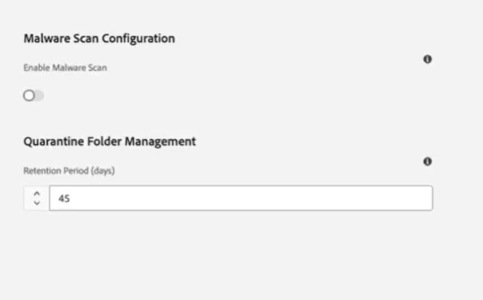
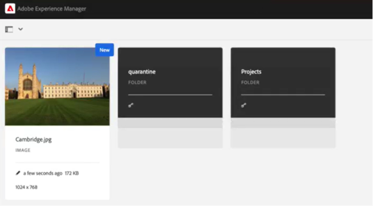

# マルウェア検出 {#malware-detection-overview}

アセットのアップロード中にマルウェアを検出することは、DAM （デジタルアセット管理）システムのセキュリティを維持するために重要です。 画像、ビデオ、ドキュメント、その他のファイルなどのアセットをアップロードすると、処理される前に潜在的な脅威がないかスキャンされます。 AEM Assetsは、アップロードされたファイルを自動的にスキャンしてマルウェアを検出し、疑わしいアセットを隔離することで、安全でないコンテンツがDAMに侵入するのを防ぎます。 Assetsから[一括インポート ](/help/assets/bulk-import-assets-view.md)、[Assets ビュー](/help/assets/assets-view-introduction.md)、[Content Hub](/help/assets/product-overview.md)は、前処理中にスキャンされ、すべてのアップロード方法で一貫したマルウェア保護が保証されます。 管理者は、[強制隔離の設定と保持ポリシーを管理](#malware-detection-configuration)して、[ セキュリティを維持](#quarantine-folder-actions)できます。

## 主な機能 {#key-capabilities-malware-detection}

アセットの保護には、次の機能が含まれます。

* **アップロード前のチェック：** ファイルの種類、サイズ、整合性を検証して、破損したファイルや互換性のないファイルを防ぎます。
* **リアルタイム スキャン：** マルウェアを示す可能性のある疑わしいファイル構造または通常と異なるファイル構造を検出します。
* **インシデント応答：** マルウェアが検出された場合、アセットは隔離されたフォルダーに隔離され、DAMにアップロードされません。

## 前提条件 {#prerequisites-malware-detection}

AEM Assetsでのマルウェア検出には、AEM Administrator権限が必要です。 さらに、[AEM Assets Ultimate](https://helpx.adobe.com/jp/enterprise/using/support-for-experience-cloud.html)または[Assets as a Cloud Service](/help/assets/assets-ultimate-overview.md)の有効なライセンスが必要です。

## マルウェア検出設定 {#malware-detection-configuration}

AEM Assetsでマルウェア検出を設定するには、次の手順に従います。

1. AEM Assets管理者ビューにログインします。

1. **[!UICONTROL ツール]** > **[!UICONTROL Assets]** > **[!UICONTROL Assets Configurations]**&#x200B;に移動し、**[!UICONTROL Malware Scan Configuration]**&#x200B;を選択します。 マルウェアスキャン設定画面が表示されます。

1. 「**[!UICONTROL マルウェアスキャンを有効にする]**」切替スイッチをオンにして、マルウェアスキャンを有効にします。

1. **[!UICONTROL 強制隔離フォルダー管理]** セクションでは、**[!UICONTROL 保持期間]**&#x200B;の設定を使用して、アセットが自動的に削除されるまでに強制隔離のままにする日数を指定します。 デフォルトでは、アセットは30日間保持されます。 [強制隔離フォルダー管理](#quarantine-folder-management)を参照してください。

1. **[!UICONTROL 保存]**&#x200B;をクリックして、設定を適用します。

   

## AEM Assetsのマルウェア検出プロセス {#process-of-malware-detection}

AEM Assetsは、以下の手順に従って、アップロードされたすべてのファイルをスキャンし、潜在的な脅威を検出します。

1. アセットをDAMにアップロード。

1. マルウェアスキャンプロセスは、前処理状態で自動的に開始されます。

1. 疑わしいまたは感染のフラグが付けられたAssetsは、**[!UICONTROL 強制隔離]** フォルダーに配置されます。それ以外の場合は、保存と処理のためにDAMに進みます。  管理者は[強制隔離されたアセットを確認し、保持設定に基づいてクリーンアップ ](#quarantine-folder-management)を管理できます。

   

1. アセットをアップロードしたユーザーと強制隔離の管理者には、次の通知が送信されます。

   * **アセットの強制隔離：** アップロードされたアセットが感染していることが検出され、強制隔離フォルダーに移動されたときにトリガーされます。
   * **アセットの強制隔離なし：**&#x200B;管理者がアセットを強制隔離から復元する場合。
   * アセットが2 GBのファイルサイズ制限を超えた場合、**スキャンをスキップしました：**&#x200B;が送信され、スキャナーが安全性を判断できなくなります。
   * **スキャンに失敗しました：** スキャナーで予期しないエラーが発生し、アセットの安全性を検証できません。

### 強制隔離フォルダー管理 {#quarantine-folder-management}

マルウェア検出プロセス中、感染したアセットや疑わしいアセットは、自動的に&#x200B;**[!UICONTROL 強制隔離]** フォルダーに移動され、DAMにアップロードされなくなります。 [!DNL Experience Manager Assets]では、これらの強制隔離されたアセットを削除する前に保持する期間を[設定](#malware-detection-configuration)できます。 さらに、強制隔離フォルダーは管理者のみが表示できます。

#### 強制隔離フォルダーのアクション {#quarantine-folder-actions}

強制隔離フォルダー内のAssetsは変更できず、フォルダー内に新しいアセットをアップロードしたり作成したりすることはできません。 ただし、管理者は、強制隔離フォルダー内のアセットを選択して、次のアクションを実行できます。

* **メタデータの表示：** アセットのプロパティまたはメタデータを確認して、適切な次の手順を決定します。
* **強制隔離されていないアセット：**&#x200B;強制隔離されたアセットを選択し、**[!UICONTROL 強制隔離されていない]**&#x200B;を選択して、元の場所に復元します。 管理者は、強制隔離されていないアセットの詳細を表示することもできます。
* **アセットを削除：**&#x200B;強制隔離フォルダーからアセットを完全に削除します。 削除されたアセットは復元できません。

## マルウェアスキャンの制限 {#malware-scan-limitations}

アセットのマルウェアスキャンプロセスの制限は次のとおりです。

* スキャナーは最大2 GBのアセットを効率的に処理し、この制限内のファイルに対して信頼性の高い処理を提供します。

* Assetsはアップロード時にスキャンされます。DAM内の既存のアセットはスキャンされません。

**関連情報**

* [アセットを翻訳](/help/assets/translate-assets.md)
* [Assets HTTP API](/help/assets/mac-api-assets.md)
* [AEM Assets as a Cloud Service でサポートされているファイル形式](/help/assets/file-format-support.md)
* [アセットを検索](/help/assets/search-assets.md)
* [接続されたアセット](/help/assets/use-assets-across-connected-assets-instances.md)
* [アセットレポート](/help/assets/asset-reports.md)
* [メタデータスキーマ](/help/assets/metadata-schemas.md)
* [アセットをダウンロード](/help/assets/download-assets-from-aem.md)
* [メタデータを管理](/help/assets/manage-metadata.md)
* [Dynamic Media テンプレートの管理](/help/assets/dynamic-media/manage-dynamic-media-templates.md)
* [レポートの管理](/help/assets/manage-reports-assets-view.md)
* [検索ファセット](/help/assets/search-facets.md)
* [コレクションを管理](/help/assets/manage-collections.md)
* [メタデータの一括読み込み](/help/assets/metadata-import-export.md)
* [AEM および Dynamic Media へのアセットの公開](/help/assets/publish-assets-to-aem-and-dm.md)

