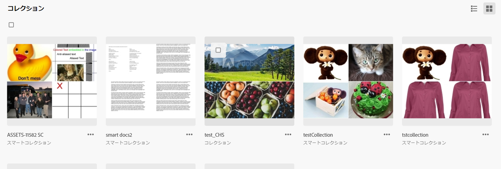
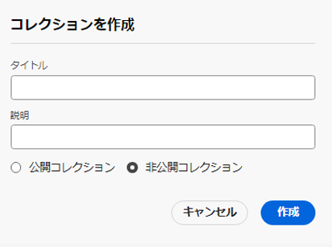
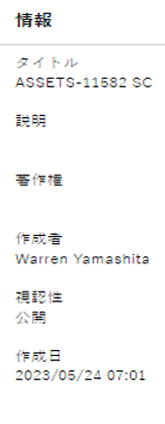
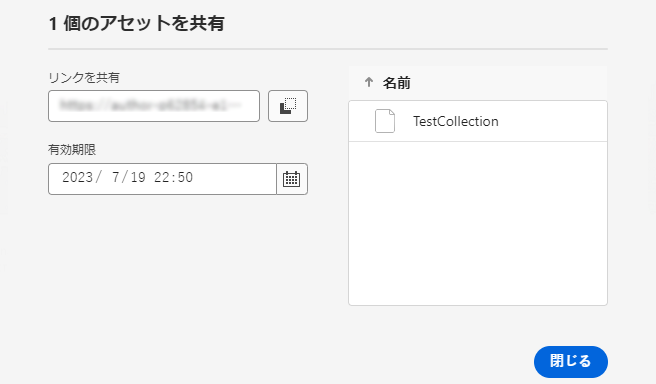

# コレクションの管理 {#manage-collections}

>[!CONTEXTUALHELP]
>id="assets_collections"
>title="コレクションを管理"
>abstract="コレクションとは、Assets ビュー内のアセット、フォルダーまたは他のコレクションのセットです。 コレクションを使用して、ユーザー間でアセットを共有します。フォルダーとは異なり、1 つのコレクションに異なる複数の場所のアセットを含めることができます。1 人のユーザーと複数のコレクションを共有できます。各コレクションには、アセットへの参照が含まれます。アセットの参照整合性はコレクション間で維持されます。"

コレクションとは、Adobe Experience Manager Assets ビュー内のアセット、フォルダーまたはその他のコレクションのセットです。 コレクションを使用して、ユーザー間でアセットを共有します。

フォルダーとは異なり、1 つのコレクションに異なる複数の場所のアセットを含めることができます。

<!--
You can share collections with various users that are assigned different levels of privileges, including viewing, editing, and so on.
-->

1 人のユーザーと複数のコレクションを共有できます。各コレクションには、アセットへの参照が含まれます。アセットの参照整合性はコレクション間で維持されます。

コレクションを管理および使用するには、次のタスクを実行します。

* [コレクションの作成](#create-collection)

* [コレクションへのアセットの追加](#add-assets-to-collection)

* [コレクションからのアセットの削除](#remove-assets-from-collection)

* [スマートコレクションを作成](#create-smart-collection)

* [スマートコレクションを編集](#edit-smart-collection)

* [コレクションのメタデータの表示と編集](#view-edit-collection-metadata)

* [コレクションのリンクの共有](#share-collection-links)

* [コレクションのダウンロード](#download-collection)

* [コレクションの削除](#delete-collection)

## コレクションの作成 {#create-collection}

コレクションを作成する手順は次のとおりです。

1. 左側のパネルから、「**[!UICONTROL コレクション]**」をクリックし、「**[!UICONTROL コレクションを作成]**」をクリックします。

1. コレクションのタイトルと、オプションで説明を指定します。

1. 非公開コレクションまたは公開コレクションを作成する必要があるかどうかを選択します。公開コレクションは、すべてのユーザーが表示および編集できます。一方、非公開コレクションは、作成者と管理者権限を持つユーザーが利用できます。

1. 「**[!UICONTROL 作成]**」をクリックして、コレクションを作成します。

<!--
   
   for viewing and editing only to users with the appropriate [permissions](#manage-collection-access).

-->

## コレクションへのアセットの追加 {#add-assets-to-collection}

コレクションにアセットを追加する手順は次のとおりです。

1. 左側のパネルで「**[!UICONTROL Assets]**」をクリックし、コレクションに追加する必要のあるアセットを選択します。

1. 「**[!UICONTROL コレクションに追加]**」をクリックします。

1. [!UICONTROL コレクション]ダイアログボックスで、選択したアセットを追加するコレクションを選択します。

1. 「**[!UICONTROL 追加]**」をクリックして、選択したコレクションにアセットを追加します。

## コレクションからのアセットの削除 {#remove-assets-from-collection}

コレクションからアセットを削除する手順は次のとおりです。

1. 左側のパネルから、「**[!UICONTROL コレクション]**」をクリックして、コレクションのリストを表示します。

1. コレクションをクリックし、コレクションから削除する必要がある項目を選択します。

1. 「**[!UICONTROL 削除]**」をクリックします。

## スマートコレクションの管理 {#manage-smart-collection}

検索結果をスマートコレクションとして保存して、コレクションのコンテンツを動的に更新します。アセット表示リポジトリに追加されているアセットが、スマートコレクションの作成時に定義した検索条件に適合する場合、スマートコレクションを開くと、スマートコレクションの内容が自動的に更新されます。

### スマートコレクションを作成 {#create-smart-collection}

スマートコレクションを作成するには、次の手順を実行します。

1. 「**[!UICONTROL フィルター]**」をクリックして、[検索条件を定義します](search-assets-view.md#refine-search-results)。

1. 「**[!UICONTROL 名前を付けて保存]**」をクリックして、その後「**[!UICONTROL スマートコレクション]**」を選択します。

   

1. [!UICONTROL スマートコレクションを作成]ダイアログボックスで、スマートコレクションのタイトルと説明を指定します。

1. すべてのユーザーがコレクションにアクセスする必要がある場合、「**[!UICONTROL 公開コレクション]**」を選択します。限られたユーザーのグループがコレクションにアクセスする必要がある場合、「**[!UICONTROL 非公開コレクション]**」を選択します。

1. 「**[!UICONTROL 作成]**」をクリックして、スマートコレクションを作成します。

### スマートコレクションを編集 {#edit-smart-collection}

スマートコレクションを編集するには：

1. 左側のパネルで「**[!UICONTROL コレクション]**」をクリックし、編集するコレクションの名前をダブルクリックします。

1. 「**[!UICONTROL スマートコレクションを編集]**」をクリックします。

1. [!UICONTROL スマートコレクションフィルターを編集]ダイアログボックスで、スマートコレクションの[検索条件を更新](search-assets-view.md#refine-search-results)します。

1. 「**[!UICONTROL 保存]**」をクリックします。

<!--

## Manage access to a Private collection {#manage-collection-access}

The permission management for collections function in the same manner as folders in [!DNL Assets view]. Administrators can manage the access levels for collections available in the repository. As an administrator, you can create user groups and assign permissions to those groups to manage access levels. You can also delegate the permission management privileges to user groups at the collection-level.

For more information, see [Manage permissions for folders and collections](manage-permissions.md).

-->

<!--

## Search a collection {#search-collections}

Click **[!UICONTROL Collections]** in the left rail and use the Search box to specify a text as the criteria to search for a collection. [!DNL Assets view] uses the specified text to search collection names, metadata including tags defined for a collection and returns appropriate results.

>[!NOTE]
>
>Assets view performs search in collections available at the root level. It does not perform search in assets and folders available in collections.

-->

## コレクションのメタデータの表示と編集 {#view-edit-collection-metadata}

コレクションのメタデータは、タイトルや説明など、コレクションに関するデータで構成されています。

コレクションのメタデータの表示と編集を行う手順は次のとおりです。

1. 左側のパネルから、「**[!UICONTROL コレクション]**」をクリックし、コレクションを選択して「**[!UICONTROL 詳細]**」をクリックします。
1. 「**[!UICONTROL 基本]**」タブを使用して、コレクションのメタデータを表示します。
1. 必要に応じてメタデータのフィールドを変更します。「[!UICONTROL タイトル]」および「[!UICONTROL 説明]」フィールドを変更できます。

## コレクションのリンクの共有 {#share-collection-links}

[!DNL Assets view] を使用すると、リンクを生成して、[!DNL Assets view] アプリケーションに対するアクセス権を持たない外部の関係者と、コレクションやコレクション内のアセットを共有できます。リンクの有効期限を定義し、メールやメッセージングサービスなどの好みの通信方法を使用して、他のユーザーとリンクを共有できます。リンクの受信者は、アセットをプレビューし、ダウンロードできます。

外部の関係者とコレクションのリンクを共有する方法について詳しくは、 [アセットへのリンクを共有](/help/assets/share-links-for-assets-view.md).

## コレクションのダウンロード {#download-collection}

コレクションをダウンロードするには：

1. 左側のパネルで「**[!UICONTROL コレクション]**」をクリックします。

1. ダウンロードするコレクションを選択し、「**[!UICONTROL ダウンロード]**」をクリックします。

1. [!UICONTROL アセットのダウンロード]ダイアログボックスで、「**[!UICONTROL OK]**」をクリックします。

コレクションは、ローカルマシン上に .ZIP ファイルとしてダウンロードされます。

## コレクションの削除 {#delete-collection}

コレクションを削除する手順は次のとおりです。

1. 左側のパネルから、「**[!UICONTROL コレクション]**」をクリックします。

1. 削除するコレクションを選択します。

1. 「**[!UICONTROL 削除]**」をクリックします。

## 次の手順 {#next-steps}

* 次を使用して製品に関するフィードバックを提供： [!UICONTROL フィードバック] Assets ビューユーザーインターフェイスで使用できるオプション

* 右側のサイドバーにある「[!UICONTROL このページを編集]」（）または「[!UICONTROL 問題を記録] 」（）を使用してドキュメントに関するフィードバックを提供する

* [カスタマーケア](https://experienceleague.adobe.com/?support-solution=General&amp;lang=ja#support)に問い合わせる
