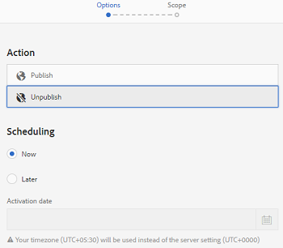

# アセットの管理 {#manage-assets}

ここでは、Adobe Experience Manager Assets でアセットを管理および編集する方法について説明します。コンテンツフラグメントを管理するには、[コンテンツフラグメント](content-fragments/content-fragments.md)アセットを参照してください。

## フォルダーの作成 {#creating-folders}

`Nature` に関するすべての画像などの、アセットのコレクションを構成する場合に、それらを保存するフォルダーを作成できます。フォルダーを使用すると、アセットを分類および整理できます。ただし、効率向上のためには必ずアセットをフォルダーで整理しなければならないということではありません。

>[!NOTE]
>
>* `sling:OrderedFolder` タイプの Assets フォルダーの共有は、Marketing Cloud との共有時はサポートされません。フォルダーを共有する場合は、フォルダーを作成するときに [!UICONTROL Ordered] を選択しないでください。
>* Experience Manager では、`subassets` をフォルダーの名前として使用することはできません。これは、複合アセットのサブアセットを含むノード用に予約されているキーワードです


1. 新しいフォルダーを作成するデジタルアセットフォルダーの場所に移動します。メニューで、「**[!UICONTROL 作成]**」をクリックします。「**[!UICONTROL 新規フォルダ]**」を選択します。
1. 「**[!UICONTROL タイトル]**」フィールドにフォルダー名を入力します。デフォルトでは、フォルダー名として指定したタイトルが使用されます。フォルダーが作成されると、デフォルトのフォルダー名を上書きして、別のフォルダー名を指定できます。
1. 「**[!UICONTROL 作成]**」をクリックします。作成したフォルダーがデジタルアセットフォルダーに表示されます。

以下の文字（スペース区切りリスト）はサポートされません。

* アセットファイル名に次の文字を含めることはできません。`* / : [ \\ ] | # % { } ? &`
* アセットフォルダー名に次の文字を含めることはできません。`* / : [ \\ ] | # % { } ? \" . ^ ; + & \t`

## アセットのアップロード {#uploading-assets}

[Adobe Experience Manager へのデジタルアセットの追加](add-assets.md)を参照してください。

## 重複アセットの検出 {#detect-duplicate-assets}

<!-- TBD: This feature may not work as documented. See CQ-4283718. Get PM review done. -->

DAM ユーザーがリポジトリに既に存在する 1 つ以上のアセットをアップロードした場合、[!DNL Experience Manager] は重複を検出し、ユーザーに通知します。重複の検出は、リポジトリのサイズとアップロードされたアセットの数に応じてパフォーマンスに影響を与える可能性があるので、デフォルトで無効になっています。この機能を有効にするには、[!UICONTROL Adobe AEM Cloud Asset Duplication Detector を設定します]。[OSGi 設定の実行方法](https://experienceleague.adobe.com/docs/experience-manager-cloud-service/implementing/deploying/configuring-osgi.html)を参照してください。複製検出は、`jcr:content/metadata/dam:sha1` に保存された一意の `dam:sha1` 値に基づきます。つまり、ファイル名が異なる場合でも重複アセットが検出されます。


設定ファイルをカスタムコード `/apps/example/config.author/com.adobe.cq.assetcompute.impl.assetprocessor.AssetDuplicationDetector.cfg.json` で追加し、ファイルに次の内容を含めることができます。

```json
{
  "enabled":true,
  "detectMetadataField":"dam:sha1"
}
```

有効にすると、Experience Manager は重複アセットの通知をインボックスに送信します。これは、複数の重複の集計結果です。ユーザーは、結果に基づいてアセットを削除することを選択できます。


## アセットのプレビュー {#previewing-assets}

アセットをプレビューするには、次の手順に従います。

1. Assets ユーザーインターフェイスで、プレビューするアセットの場所に移動します。
1. 目的のアセットをタップして開きます。

1. プレビューモードでは、[サポートされている画像タイプ](/help/assets/file-format-support.md)で（インタラクティブ編集中に）ズームオプションを使用できます。

   アセットにズームインするには、`+` をタップまたはクリック（またはアセット上の虫眼鏡アイコンをタップまたはクリック）します。ズームアウトするには、`-` をタップまたはクリックします。ズームインすると、パンニングによって画像の任意の場所を詳細に確認できます。「ズームをリセット」矢印をクリックすると、元の表示に戻ります。

   **[!UICONTROL リセット]**&#x200B;をタップすると、表示を元のサイズに戻すことができます。

## プロパティの編集 {#editing-properties}

1. メタデータを編集するアセットの場所に移動します。

1. アセットを選択し、ツールバーの「**[!UICONTROL プロパティ]**」をタップまたはクリックして、アセットのプロパティを表示します。または、アセットカードで&#x200B;**[!UICONTROL プロパティ]**&#x200B;クイックアクションを選択します。

   

1. [!UICONTROL プロパティ]ページの様々なタブで、メタデータのプロパティを編集します。例えば、「**[!UICONTROL 基本]**」タブでは、タイトルや説明などを編集します。

   >[!NOTE]
   >
   >[!UICONTROL プロパティ]ページのレイアウトと編集できるメタデータのプロパティは、基になるメタデータスキーマによって変わります。[!UICONTROL プロパティ]ページのレイアウトを変更する方法については、[メタデータスキーマ](/help/assets/metadata-schemas.md)を参照してください。

1. アセットをアクティベートする特定の日付と時間をスケジュールするには、「**[!UICONTROL オンタイム]**」フィールドの横にある日付選択を使用します。

   

1. 特定の期間の後にアセットのアクティベートを解除するには、「**[!UICONTROL オフタイム]**」フィールドの横にある日付選択を使用して、アクティベートを解除する日付と時間を選択します。アクティベートを解除する日付は、アセットに設定されたアクティベート日より後の日付にしてください。[!UICONTROL オフタイム]の経過後、アセットとそのレンディションは、Assets Web インターフェイスでも HTTP API でも使用できません。

   

1. 「**[!UICONTROL タグ]**」フィールドで、タグを 1 つ以上選択します。カスタムタグを追加するには、ボックスにタグの名前を入力し、Enter キーを押します。新しいタグが AEM に保存されます。

   YouTube で公開して YouTube へのリンクを張る（適切なリンクがある場合）には、タグが必要です。

   >[!NOTE]
   >
   >タグを作成するには、CRX リポジトリの `/content/cq:tags/default` パスでの書き込み権限が必要です。

1. アセットの使用状況の統計を確認するには、「**[!UICONTROL インサイト]**」タブをタップまたはクリックします。

   使用状況の統計には、次の情報が含まれています。

   * アセットが表示またはダウンロードされた回数
   * アセットが使用されたチャネルまたはデバイス
   * アセットが最近使用されたクリエイティブソリューション

   詳しくは、[アセットインサイト](assets-insights.md)を参照してください。

1. 「**[!UICONTROL 保存して閉じる]**」をタップまたはクリックします。

1. Assets ユーザーインターフェイスに移動します。編集済みのメタデータのプロパティ（タイトル、説明、タグなど）は、カード表示のアセットカードまたはリスト表示の関連する列に表示されます。

## アセットのコピー {#copying-assets}

アセットやフォルダーをコピーすると、そのアセットやフォルダーがコンテンツ構造と共にコピーされます。コピーされたアセットやフォルダーはコピー先に複製されます。コピー元にあるアセットは変更されません。

アセットの特定のコピーに一意に関連付けられる属性は継承されません。例えば、以下のものが該当します。

* アセット ID、作成日時、バージョン、バージョン履歴。これらのプロパティの一部は、`jcr:uuid`、`jcr:created`、`cq:name` プロパティによって示されます。

* 作成時間と参照パスは、各アセットとその各レンディションに対して一意です。

その他のプロパティとメタデータ情報は保持されます。アセットをコピーするときに、部分的なコピーが作成されることはありません。

1. Assets UI から 1 つ以上のアセットを選択し、ツールバーの「**[!UICONTROL コピー]**」アイコンをタップまたはクリックします。または、アセットカードから&#x200B;**[!UICONTROL コピー]**  クイックアクションを選択します。

   >[!NOTE]
   >
   >[!UICONTROL コピー]クイックアクションを使用した場合、一度にコピーできるアセットは 1 つだけです。

1. アセットをコピーする場所に移動します。

   >[!NOTE]
   >
   >同じ場所でアセットをコピーすると、AEM は自動的に名前のバリエーションを生成します。例えば、「`Square`」というタイトルのアセットをコピーすると、AEM は自動的にそのコピーのタイトルを「`Square1`」として生成します。

1. ツールバーの&#x200B;**[!UICONTROL 貼り付け]**&#x200B;アセットアイコンをクリックします。アセットがこの場所にコピーされます。

   

   >[!NOTE]
   >
   >ツールバーの&#x200B;**[!UICONTROL 貼り付け]**&#x200B;アイコンが使用できるのは、貼り付け操作が完了するまでです。

### アセットの移動または名前変更 {#moving-or-renaming-assets}

1. 移動するアセットの場所に移動します。

1. アセットを選択し、ツールバーの&#x200B;**[!UICONTROL 移動]**&#x200B;アイコン  をタップまたはクリックします。

1. アセットを移動ウィザードで、次のいずれかの操作をおこないます。

   * 移動後のアセットの名前を指定します。その後、「**[!UICONTROL 次へ]**」をタップまたはクリックして先に進みます。

   * 「**[!UICONTROL キャンセル]**」をタップまたはクリックして、プロセスを停止します。
   >[!NOTE]
   >
   >* 新しい場所に同じ名前のアセットがない場合は、同じ名前を指定できます。ただし、アセットの移動先に同じ名前のアセットが既に存在する場合は、別の名前を使用する必要があります。同じ名前を使用すると、その名前のバリエーションが自動的に生成されます。例えば、「Square」という名前のアセットの場合、自動的にそのコピーの名前が「Square1」として生成されます。
   >* 名前の変更時に、ファイル名に空白は使用できません。


1. **[!UICONTROL 宛先を選択]**&#x200B;ダイアログで、次のいずれかの操作をおこないます。

   * アセットの移動先に移動し、「**[!UICONTROL 次へ]**」をタップまたはクリックして次に進みます。

   * 「**[!UICONTROL 戻る]**」をタップまたはクリックして、**[!UICONTROL 名前を変更]**&#x200B;画面に戻ります。

1. 移動されるアセットに参照ページ、アセット、コレクションがある場合は、「**[!UICONTROL 宛先を選択]**」タブの横に「**[!UICONTROL 参照を調整]**」タブが表示されます。

   **[!UICONTROL 参照を調整]**&#x200B;画面で次のいずれかの操作を実行します。

   * 新しい情報に基づいて調整する参照を指定し、「**[!UICONTROL 移動]**」をタップまたはクリックして次に進みます。

   * 「**[!UICONTROL 調整]**」列で、アセットへの参照を選択／選択解除します。
   * 「**[!UICONTROL 戻る]**」をタップまたはクリックして、**[!UICONTROL 宛先を選択]**&#x200B;画面に戻ります。

   * 「**[!UICONTROL キャンセル]**」をタップまたはクリックして、移動操作を停止します。

   参照を更新しなければ、引き続きアセットの以前のパスが示されます。参照を調整すると、更新され、アセットの新しいパスが反映されます。

### レンディションの管理 {#managing-renditions}

1. アセットのレンディション（オリジナルを除く）を追加または削除できます。レンディションを追加または削除するアセットの場所に移動します。

1. アセットをタップまたはクリックして、そのアセットページを開きます。

   

1. グローバルナビゲーションアイコンをタップまたはクリックし、リストから「**[!UICONTROL レンディション]**」を選択します。

   

1. **[!UICONTROL レンディション]**&#x200B;パネルで、アセットに生成されたレンディションのリストを表示します。

   

   >[!NOTE]
   >
   >デフォルトで、AEM Assets はプレビューモードでアセットのオリジナルレンディションを表示しません。管理者の場合、オーバーレイを使用して AEM Assets を設定し、プレビューモードでもオリジナルレンディションを表示できます。

1. 表示または削除するレンディションを選択します。

   **レンディションの削除**

   **[!UICONTROL レンディション]**&#x200B;パネルからレンディションを選択し、ツールバーの「**[!UICONTROL レンディションを削除]**」アイコンをタップまたはクリックします。アセット処理の完了後は、レンディションを一括削除することはできません。個々のアセットについては、ユーザーインターフェイスからレンディションを手動で削除できます。複数のアセットについては、特定のレンディションを削除するか、アセットを削除して削除したアセットを再度アップロードするように、[!DNL Experience Manager] をカスタマイズできます。

   

   **新しいレンディションのアップロード**

   アセットの詳細ページに移動し、ツールバーの「**[!UICONTROL レンディションを追加]**」アイコンをタップまたはクリックして、アセットの新しいレンディションをアップロードします。

   

   >[!NOTE]
   >
   >**[!UICONTROL レンディション]**&#x200B;パネルからレンディションを選択する場合、ツールバーのコンテキストが変わり、レンディションに関連するアクションのみが表示されます。レンディションをアップロードアイコンなどのオプションは表示されません。これらのオプションをツールバーに表示するには、アセットの詳細ページに移動します。

   画像またはビデオアセットの詳細ページに表示するレンディションのサイズを設定できます。指定するサイズに基づいて、AEM Assets はレンディションを正確なサイズまたは最も近いサイズで表示します。

   アセットの詳細レベルで画像のレンディションのサイズを設定するには、`renditionpicker` ノード（`libs/dam/gui/content/assets/assetpage/jcr:content/body/content/content/items/assetdetail/items/col1/items/assetview/renditionpicker`）をオーバーレイして、幅のプロパティの値を設定します。画像サイズに基づいてアセットの詳細ページでレンディションをカスタマイズするには、幅の代わりに **[!UICONTROL size (Long) in KB]** プロパティを設定します。サイズベースのカスタマイズの場合、`preferOriginal` プロパティを使用すると、一致するレンディションのサイズがオリジナルより大きい場合でも、オリジナルが優先されます。

   同様に、`libs/dam/gui/content/assets/annotate/jcr:content/body/content/content/items/content/renditionpicker` をオーバーレイして注釈ページの画像をカスタマイズできます。

   

   ビデオアセットのレンディションサイズを設定するには、CRX リポジトリ内の `videopicker` ノード（`/libs/dam/gui/content/assets/assetpage/jcr:content/body/content/content/items/assetdetail/items/col1/items/assetview/videopicker`）に移動し、ノードをオーバーレイし、該当するプロパティを編集します。

   >[!NOTE]
   >
   >ビデオの注釈は、HTML5 互換のビデオ形式に対応したブラウザーでのみサポートされます。また、ブラウザーによってサポートされるビデオ形式が異なります。

## アセットの削除 {#delete-assets}

他のページからの入力参照を解決または削除するには、アセットを削除する前に、関連する参照を更新します。

また、オーバーレイを使用して「削除を強制」ボタンを無効にすることで、参照元のアセットの削除と壊れたリンクの放置を禁止します。

1. 削除するアセットの場所に移動します。

1. アセットを選択し、ツールバーの「**[!UICONTROL 削除]**」アイコンをタップまたはクリックします。

   

1. 確認ダイアログで、次のいずれかをクリックします。

   * **[!UICONTROL キャンセル]**：アクションを停止します。
   * **[!UICONTROL 削除]**：アクションの実行を確定します。

      * アセットに参照がない場合は、アセットが削除されます。
      * アセットに参照がある場合は、「**1 つ以上のアセットが参照されています。**」というエラーメッセージが表示されます。「**[!UICONTROL 削除を強制]**」または「**[!UICONTROL キャンセル]**」を選択できます。

   >[!NOTE]
   >
   >アセットを削除するには、dam/asset で削除権限が必要です。変更権限のみ付与されている場合、アセットのメタデータの編集とアセットへの注釈の追加のみが可能で、アセットやそのメタデータの削除は実行できません。

   >[!NOTE]
   >
   >他のページからの入力参照を解決または削除するには、アセットを削除する前に、関連する参照を更新します。
   >
   >
   >また、オーバーレイを使用して「削除を強制」ボタンを無効にすることで、参照元のアセットの削除と壊れたリンクの放置を禁止します。

## アセットのダウンロード {#download-assets}

[AEM からのアセットのダウンロード](/help/assets/download-assets-from-aem.md)を参照してください。

## アセットの公開 {#publish-assets}

<!--
>[!NOTE]
>
>For more information specific to Dynamic Media, see [Publishing Dynamic Media Assets.](/help/assets/dynamic-media/publishing-dynamicmedia-assets.md)
-->

1. 公開するアセットまたはフォルダーの場所に移動します。

1. アセットカードで&#x200B;**[!UICONTROL 公開]**&#x200B;クイックアクションを選択するか、アセットを選択し、ツールバーの「**[!UICONTROL クイック公開]**」アイコンをタップまたはクリックします。
1. アセットが他のアセットを参照する場合は、その参照がウィザードに表示されます。表示されるのは、非公開の参照か、最後に公開または非公開にされた後に変更された参照だけです。公開する参照を選択します。

   

   >[!NOTE]
   >
   >公開したいフォルダーに空のフォルダーが含まれる場合、空のフォルダーは公開されません。

1. 「**[!UICONTROL 公開]**」をタップまたはクリックして、アセットのアクティベートを確認します。

>[!CAUTION]
>
>処理中のアセットを公開した場合は、オリジナルのコンテンツのみが公開されます。処理中のレンディションは失われます。処理が完了するまで待ってから公開するか、処理の完了後にアセットを公開し直してください。

## アセットの非公開 {#unpublishing-assets}

1. パブリッシュ環境から削除する（非公開にする）アセットまたはアセットフォルダーの場所に移動します。

1. 非公開にするアセットまたはフォルダーを選択し、ツールバーの「**[!UICONTROL 公開を管理]**」アイコンをタップまたはクリックします。

   

1. リストから「**[!UICONTROL 非公開]**」アクションを選択します。

   

1. 後でアセットを非公開にするには、「**[!UICONTROL 後で非公開にする]**」を選択して、アセットを非公開にする日付を選択します。
1. パブリッシュ環境でアセットを非公開にする日付をスケジュールします。
1. アセットが他のアセットを参照する場合は、非公開にする参照を選択します。「**[!UICONTROL 非公開]**」をタップまたはクリックします。
1. 確認ダイアログで、次のいずれかをタップまたはクリックします。

   * **[!UICONTROL キャンセル]**：アクションを停止します。
   * **[!UICONTROL 非公開]**：指定された日付にアセットを非公開にします（パブリッシュ環境では使用できません）。

   >[!NOTE]
   >
   >複雑なアセットを非公開にする場合は、アセットだけを非公開にします。参照は他の公開済みアセットから参照されている可能性があるので、非公開にしないでください。

## 閉じられたユーザーグループ {#closed-user-group}

閉じられたユーザーグループ（CUG）は、AEM から公開された特定のアセットフォルダーへのアクセスを制限するために使用します。フォルダーに対して CUG を作成すると、そのフォルダー（フォルダーのアセットとサブフォルダーを含む）へのアクセスは、割り当てられたメンバーまたはグループのみに制限されます。フォルダーにアクセスするには、セキュリティ資格情報を使用してログインする必要があります。

CUG は、アセットへのアクセスを制限する追加の方法です。また、フォルダーのログインページを設定することもできます。

1. Assets UI からフォルダーを選択し、ツールバーの「プロパティ」アイコンをタップまたはクリックして、プロパティページを表示します。
1. 「**[!UICONTROL 権限]**」タブで、「**[!UICONTROL 閉じられたユーザーグループ]**」の下でメンバーまたはグループを追加します。

   

1. ユーザーがフォルダーにアクセスしたときにログイン画面を表示するには、「**[!UICONTROL 有効]**」オプションを選択します。次に、AEM 内のログインページへのパスを選択し、変更を保存します。

   

   >[!NOTE]
   >
   >ログインページへのパスを指定しないと、AEM はパブリッシュインスタンスでデフォルトのログインページを表示します。

1. フォルダーを公開し、パブリッシュインスタンスからアクセスすると、ログイン画面が表示されます。
1. CUG メンバーの場合は、自分のセキュリティ資格情報を入力します。AEM によって認証されると、フォルダーが表示されます。

## アセットの検索 {#search-assets}

アセットの検索は、デジタルアセット管理システムの利用の中核を成します。用途は、クリエイティブ担当者によるさらなる利用、ビジネスユーザーやマーケティング担当者によるアセットの堅牢な管理、DAM 管理者による管理などです。

最も適切なアセットを検出し使用するためのシンプル検索、アドバンス検索、カスタム検索については、[AEM でのアセットの検索](/help/assets/search-assets.md)を参照してください。

## クイックアクション {#quick-actions}

クイックアクションのアイコンは、一度に 1 つのアセットに対してのみ利用できます。デバイスに応じて、次の操作を実行してクイックアクションアイコンを表示します。

* タッチデバイス：タッチ＆ホールド。例えば iPad では、アセットをタップ＆ホールドするとクイックアクションが表示されます。
* 非タッチデバイス：マウスポインターで指す。例えばデスクトップデバイスでは、アセットのサムネールをマウスポインターで指すとクイックアクションバーが表示されます。

## 画像の編集 {#editing-images}

AEM Assets インターフェイスの編集ツールを使用すると、画像アセットで細かい編集ジョブを実行できます。画像に対して切り抜き、回転、反転などの編集ジョブを実行できます。アセットに画像マップを追加することもできます。

>[!NOTE]
>
>一部のコンポーネントでは、全画面表示モードで追加のオプションも使用できます。

1. 編集モードでアセットを開くには、次のいずれかの操作をおこないます。

   * アセットを選択し、ツールバーの「**[!UICONTROL 編集]**」アイコンをクリックまたはタップします。
   * カード表示で、アセットに表示される「**[!UICONTROL 編集]**」アイコンをタップまたはクリックします。
   * アセットページで、ツールバーの「**[!UICONTROL 編集]**」アイコンをタップまたはクリックします。

   

1. 画像を切り抜くには、**切り抜き**&#x200B;アイコンをタップまたはクリックします。

   

1. リストから必要なオプションを選択します。選択したオプションに基づいて、画像に切り抜き領域が表示されます。「**フリーハンド**」オプションを使用すると、縦横比の制限に関係なく画像を切り抜くことができます。

   

1. 切り抜く領域を選択し、画像上でそのサイズまたは位置を変更します。
1. **完了**&#x200B;アイコン（右上隅）を使用して、画像を切り抜きます。**完了**&#x200B;アイコンをクリックすると、レンディションの再生成もおこなわれます。

   

1. 切り抜く前の画像に戻すには、右上の&#x200B;**取り消し**&#x200B;アイコンを使用します。切り抜いた画像を保持するには、右上の&#x200B;**やり直し**&#x200B;アイコンを使用します。

   

1. 適切な回転アイコンをタップまたはクリックして、画像を時計回りまたは反時計回りに回転します。

   

1. 適切な反転アイコンをタップまたはクリックして、画像を水平方向または垂直方向に反転します。

   

1. **完了**&#x200B;アイコンをタップまたはクリックして変更を保存します。

   

>[!NOTE]
>
>BMP、GIF、PNG、JPEG の各ファイル形式については、画像編集がサポートされています。

<!-- You can also add image maps using the image editor. For details, see [Adding Image Maps](/help/assets/image-maps.md). -->

>[!NOTE]
>
>TXT ファイルを編集するには、Configuration Manager で **Day CQ Link Externalizer** を設定します。

## タイムライン {#timeline}

タイムラインを使用すると、アセットのアクティブなワークフロー、コメントや注釈、アクティビティログ、バージョンなど、選択した項目の様々なイベントを表示できます。


**&#x200B;図：アセットのタイムラインエントリの並べ替え

>[!NOTE]
>
>[コレクションコンソール](/help/assets/manage-collections.md#navigate-the-collections-console)の&#x200B;**[!UICONTROL すべて表示]**&#x200B;リストには、コメントとワークフローだけを表示するオプションがあります。さらに、タイムラインはコンソールにリストされているトップレベルのコレクションについてのみ表示されます。これらのコレクション内を移動する場合、タイムラインは表示されません。

>[!NOTE]
>
>タイムラインには、[コンテンツフラグメントに固有のオプション](content-fragments/content-fragments.md)がいくつか含まれています。

## 注釈 {#annotating}

注釈とは、画像やビデオに追加するコメントまたは注記です。マーケティング担当者は、注釈により、アセットについてコラボレーションし、フィードバックを残すことができます。

ビデオの注釈は、HTML5 互換のビデオ形式に対応したブラウザーでのみサポートされます。AEM Assets がサポートするビデオの形式は、ブラウザーによって異なります。

>[!NOTE]
>
>コンテンツフラグメントの場合、[注釈はフラグメントエディターで作成されます](content-fragments/content-fragments.md)。

1. 注釈を追加するアセットの場所に移動します。
1. 以下のいずれかから&#x200B;**[!UICONTROL 注釈]**&#x200B;アイコンをタップまたはクリックします。

   * [クイックアクション](#quick-actions)
   * アセットを選択した後またはアセットページに移動した後に、ツールバーから

   

1. タイムラインの一番下の&#x200B;**[!UICONTROL コメント]**&#x200B;ボックスにコメントを追加します。または、画像内の任意の領域をマークアップし、**[!UICONTROL 注釈を追加]**&#x200B;ダイアログに注釈を追加します。

   

<!--
1. To notify a user about an annotation, specify the email address of the user and add the comment. For example, to notify Aaron MacDonald about an annotation, enter @aa. Hints for all matching users is displayed in a list. Select Aaron's email address from the list to tag her with the comment. Similarly, you can tag more users anywhere within the annotation or before or after it.
-->

>[!NOTE]
>
>管理者以外のユーザーには、CRXDE で `/home` に読み取り権限がある場合にのみ候補が表示されます。


1. 注釈を追加したら、「**[!UICONTROL 追加]**」をクリックして注釈を保存します。注釈に関する通知が Aaron に送信されます。

   

   >[!NOTE]
   >
   >複数の注釈を追加してから、それらを保存できます。

1. 「**[!UICONTROL 閉じる]**」をタップまたはクリックして注釈モードを終了します。
1. 通知を表示するには、Aaron MacDonald の資格情報を使用して AEM Assets にログインし、「**[!UICONTROL 通知]**」アイコンをクリックします。

   >[!NOTE]
   >
   >注釈はビデオアセットにも追加できます。ビデオに注釈を追加する際は、ユーザーがフレームに注釈を追加できるようにプレーヤーが一時停止します。詳しくは、[ビデオアセットの管理](manage-video-assets.md)を参照してください。

1. 別の色を選択してユーザーを区別できるようにするには、プロファイルアイコンをクリックまたはタップし、「**[!UICONTROL 環境設定]**」をクリックまたはタップします。

   

   **[!UICONTROL 注釈カラー]**&#x200B;ボックスに必要な色を指定し、**[!UICONTROL 確定]**&#x200B;をクリックまたはタップします。

   

>[!NOTE]
>
>コレクションにも注釈を追加できます。ただし、コレクションに子コレクションが含まれる場合、親コレクションに対してのみ注釈／コメントを追加できます。「注釈」オプションは子コレクションでは使用できません。

### 保存された注釈の表示 {#viewing-saved-annotations}

1. アセットに対して保存された注釈を表示するには、アセットの場所に移動して、そのアセットのアセットページを開きます。

1. グローバルナビゲーションアイコンをタップまたはクリックし、リストから「**[!UICONTROL タイムライン]**」を選択します。

   

1. タイムラインの「**[!UICONTROL すべて表示]**」のリストから「**[!UICONTROL コメント]**」を選択し、注釈に基づいて結果にフィルターを適用します。

   

   **[!UICONTROL タイムライン]**&#x200B;パネルでコメントをタップまたはクリックし、対応する画像の注釈を表示します。

   

   特定のコメントを削除するには、「**[!UICONTROL 削除]**」をタップまたはクリックします。

### 注釈の印刷 {#printing-annotations}

アセットに注釈がある場合や、レビューワークフローの対象になっている場合は、オフラインでのレビュー用に注釈とレビューステータス付きでアセットを PDF ファイルとして印刷できます。

注釈またはレビューステータスのみ印刷することも選択できます。

注釈とレビューステータスを印刷するには、**[!UICONTROL 印刷]**&#x200B;アイコンをタップまたはクリックし、ウィザードの指示に従ってください。**[!UICONTROL 印刷]**&#x200B;アイコンは、アセットに注釈またはレビューステータスが少なくとも 1 つ割り当てられている場合にのみ、ツールバーに表示されます。

1. Assets UI から、アセットのプレビューページを開きます。
1. 次のいずれかの操作をおこないます。

   * すべての注釈とレビューステータスを印刷するには、手順 3 をスキップして手順 4 に直接進みます。
   * 特定の注釈やレビューステータスを印刷するには、[タイムライン](/help/assets/manage-digital-assets.md#timeline)を開き、手順 3 に進みます。

1. 特定の注釈を印刷するには、タイムラインから注釈を選択します。

   

   レビューステータスのみを印刷するには、タイムラインからレビューステータスを選択します。

   

1. ツールバーの&#x200B;**[!UICONTROL 印刷]**&#x200B;アイコンをタップまたはクリックします。

   

1. 印刷ダイアログから、注釈／レビューステータスを PDF のどこに表示したいかを選択します。例えば、印刷する画像が含まれるページの右上に注釈／ステータスを印刷したい場合は、「**左上**」設定を使用します。デフォルトで選択されています。

   

   印刷する PDF のどこに注釈／ステータスを表示するかに応じて、別の設定も選択できます。印刷されるアセットとは別のページに注釈／ステータスを表示したい場合、「**[!UICONTROL 次のページ]**」を選択します。

   >[!NOTE]
   >
   >長い注釈は PDF ファイルに適切にレンダリングされない可能性があります。最適なレンダリングのために、注釈を 50 語以内に制限することをお勧めします。

1. 「**[!UICONTROL 印刷]**」をタップまたはクリックします。手順 2 で選択したオプションに応じて、生成される PDF の特定の位置に注釈／ステータスが表示されます。例えば、注釈とレビューステータスの両方を「**左上**」設定を使用して印刷することを選択した場合、生成される PDF ファイルは次のようになります。

   

1. 右上のオプションを使用して PDF をダウンロードまたは印刷します。

   

   レンダリングされた PDF ファイルの外観を変更するには、Configuration Manager から&#x200B;**[!UICONTROL 注釈 PDF の設定]**&#x200B;を開き、必要なオプションを変更します。例えば、コメントとステータスのフォントカラー、サイズ、スタイル、背景色を変更できます。例えば、承認済みステータスの表示色を変更したり、対応フィールドのカラーコードを変更したりします。注釈のフォントカラーの変更について詳しくは、[注釈](/help/assets/manage-digital-assets.md#annotating)を参照してください。

   

   レンダリングされた PDF ファイルに戻り、更新します。更新された PDF に、変更が反映されています。

## アセットのバージョン管理 {#asset-versioning}

バージョン管理では、特定の時点でのデジタルアセットのスナップショットが作成されます。バージョン管理を使用すると、後で、以前の状態にアセットを復元できます。例えば、アセットに対しておこなった変更を取り消したい場合、バージョン管理を使用して未編集のバージョンにアセットを復元できます。

バージョンを作成するシナリオは次のとおりです。

* 別のアプリケーションで画像を変更し、AEM Assets にアップロードします。元の画像が上書きされないように画像のバージョンが作成されます。
* アセットのメタデータを編集します。
* 既存のアセットをチェックアウトしたり変更を保存したりするには、AEM デスクトップアプリケーションを使用します。アセットが保存されるたびに、新しいバージョンが作成されます。

また、ワークフローを使用して、自動バージョン管理を有効にすることもできます。アセットのバージョンを作成すると、バージョンと共にメタデータとレンディションが保存されます。レンディションによって、同じ画像の代替となる画像が表示されます（例えば、アップロードされた JPEG ファイルの PNG レンディション）。

バージョン管理機能を使用すると、次の操作を実行できます。

* アセットのバージョンを作成する。
* アセットの現在のリビジョンを表示する。
* 以前のバージョンにアセットを復元する。

1. バージョンを作成するアセットの場所に移動し、アセットをタップまたはクリックしてそのアセットのページを開きます。

1. グローバルナビゲーションアイコンをタップまたはクリックし、メニューから「**[!UICONTROL タイムライン]**」を選択します。

   

1. 下にある&#x200B;**[!UICONTROL アクション]**（矢印）アイコンをタップまたはクリックして、アセットで実行できるアクションを表示します。

   

1. 「**[!UICONTROL 保存するバージョン]**」をタップまたはクリックして、アセットのバージョンを作成します。

   

1. ラベルとコメントを追加し、「**[!UICONTROL 作成]**」をクリックしてバージョンを作成します。または、「**キャンセル**」をタップまたはクリックして操作を終了します。

   

1. 新しいバージョンを表示するには、アセットの詳細ページまたは Assets UI からタイムラインの「**[!UICONTROL すべて表示]**」リストを開き、「**[!UICONTROL バージョン]**」を選択します。アセット用に作成したすべてのバージョンが「タイムライン」タブに表示されます。リストにフィルターを適用して「バージョン」表示できます。そのためには、下向きの矢印をクリックして、リストから「**[!UICONTROL バージョン]**」を選択します。

   

1. アセットの特定のバージョンを選択してプレビューするか、Assets UI に表示されるように設定します。

   

1. Assets UI で特定のバージョンに戻すバージョンに、ラベルとコメントを追加します。

   

1. バージョンのプレビューを生成するには、「**[!UICONTROL バージョンをプレビュー]**」をタップまたはクリックします。
1. Assets UI でこのバージョンを表示するには、「**[!UICONTROL このバージョンに戻す]**」を選択します。
1. 2 つのバージョンを比較するには、アセットのアセットページに移動し、現在のバージョンと比較するバージョンをタップまたはクリックします。

   

1. タイムラインで、比較するバージョンを選択し、スライダーを左にドラッグして、現在のバージョンの上にこのバージョンを重ねて表示して比較します。

   

### アセットでのワークフローの開始 {#starting-a-workflow-on-an-asset}

1. ワークフローを開始するアセットの場所に移動し、アセットをタップまたはクリックしてそのアセットのページを開きます。
1. グローバルナビゲーションアイコンをタップまたはクリックし、メニューから「**[!UICONTROL タイムライン]**」を選択してタイムラインを表示します。

   

1. 下にある&#x200B;**[!UICONTROL アクション]**（矢印）アイコンをタップまたはクリックして、アセットで使用可能なアクションのリストを表示します。

   

1. リストの「**[!UICONTROL ワークフローを開始]**」をタップまたはクリックします。

   

1. **[!UICONTROL ワークフローを開始]**&#x200B;ダイアログで、リストからワークフローモデルを選択します。

   

1. （オプション）ワークフローインスタンスを参照するために使用するワークフローのタイトルを指定します。

   

1. ダイアログで、「**[!UICONTROL 開始]**」をタップまたはクリックし、次に「**[!UICONTROL 続行]**」をタップまたはクリックして確定します。ワークフローの各ステップは、タイムラインにイベントとして表示されます。

   

## コレクション {#collections}

コレクションとは、一連のアセットを順序よく並べたものです。コレクションを使用して、ユーザー間でアセットを共有します。

* 1 つのコレクションにはアセットへの参照のみが含まれるので、様々な場所のアセットを含めることができます。各コレクションは、アセットの参照整合性を維持します。
* コレクションは、特権レベル（編集、表示など）の異なる複数のユーザー間で共有できます。

コレクションの管理について詳しくは、[コレクションの管理](/help/assets/manage-collections.md)を参照してください。
