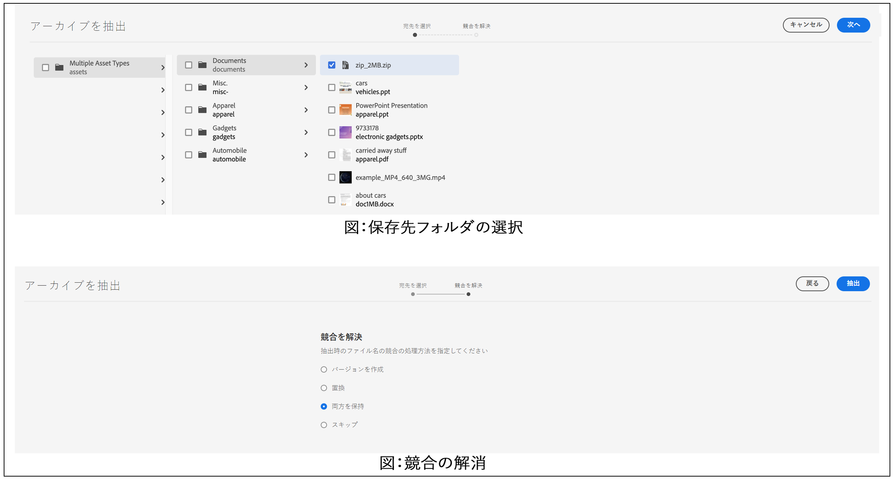

# アセットの管理 {#manage-assets}

<table>
    <tr>
        <td>
            <sup style= "background-color:#008000; color:#FFFFFF; font-weight:bold"><i> 新規 </i></sup>Dynamic Media Prime<a href="/help/assets/dynamic-media/dm-prime-ultimate.md"><b>Ultimate</b></a>
        </td>
        <td>
            <sup style= "background-color:#008000; color:#FFFFFF; font-weight:bold"><i> 新規 </i></sup> <a href="/help/assets/assets-ultimate-overview.md"><b>AEM AssetsUltimate</b></a>
        </td>
        <td>
            <sup style= "background-color:#008000; color:#FFFFFF; font-weight:bold"><i> 新規 </i></sup> <a href="/help/assets/integrate-aem-assets-edge-delivery-services.md"><b>AEM AssetsとEdge Delivery Servicesの統合 </b></a>
        </td>
        <td>
            <sup style= "background-color:#008000; color:#FFFFFF; font-weight:bold"><i> 新規 </i></sup><a href="/help/assets/aem-assets-view-ui-extensibility.md"><b>UI 拡張機能 </b></a>
        </td>
          <td>
            <sup style= "background-color:#008000; color:#FFFFFF; font-weight:bold"><i>Dynamic Media Prime</i></sup>Ultimateの新 <a href="/help/assets/dynamic-media/enable-dynamic-media-prime-and-ultimate.md"><b> 能 </b></a>
        </td>
    </tr>
    <tr>
        <td>
            <a href="/help/assets/search-best-practices.md"><b>検索のベストプラクティス</b></a>
        </td>
        <td>
            <a href="/help/assets/metadata-best-practices.md"><b>メタデータのベストプラクティス</b></a>
        </td>
        <td>
            <a href="/help/assets/product-overview.md"><b>コンテンツハブ</b></a>
        </td>
        <td>
            <a href="/help/assets/dynamic-media-open-apis-overview.md"><b>OpenAPI 機能を備えた Dynamic Media</b></a>
        </td>
        <td>
            <a href="https://developer.adobe.com/experience-cloud/experience-manager-apis/"><b>AEM Assets 開発者向けドキュメント</b></a>
        </td>
    </tr>
</table>

| バージョン | 記事リンク |
| -------- | ---------------------------- |
| AEM 6.5 | [ここをクリックしてください](https://experienceleague.adobe.com/docs/experience-manager-65/assets/managing/manage-assets.html?lang=ja) |
| AEM as a Cloud Service | この記事 |

ここでは、[!DNL Adobe Experience Manager Assets] でアセットを管理および編集する方法を説明します。[!DNL Content Fragments] を管理するには、[[!DNL Content Fragments]](content-fragments/content-fragments.md) アセットを参照してください。

## フォルダーの作成 {#creating-folders}

`Nature` に関するすべての画像などの、アセットのコレクションを構成する場合に、それらを保存するフォルダーを作成できます。フォルダーを使用すると、アセットを分類および整理できます。ただし、[!DNL Experience Manager Assets] では、効率向上のために必ずアセットをフォルダーで整理しなければならないということではありません。

>[!NOTE]
>
>* `sling:OrderedFolder` タイプのアセットフォルダーの共有は、Experience Cloud との共有時はサポートされません。フォルダーを共有する場合は、フォルダーを作成するときに [!UICONTROL Ordered] を選択しないでください。
>* Experience Manager では、`subassets` をフォルダーの名前として使用することはできません。これは、複合アセットのサブアセットを含むノード用に予約されているキーワードです

1. 新しいフォルダーの作成先となるデジタルアセットフォルダー内の場所に移動します。メニューで、「**[!UICONTROL 作成]**」をクリックします。「**[!UICONTROL 新規フォルダー]**」を選択します。
1. 「**[!UICONTROL タイトル]**」フィールドにフォルダー名を入力します。デフォルトで、DAM ではフォルダー名として指定したタイトルが使用されます。フォルダーが作成されると、デフォルトのフォルダー名を上書きして、別のフォルダー名を指定できます。
1. 「**[!UICONTROL 作成]**」をクリックします。作成したフォルダーがデジタルアセットフォルダーに表示されます。

以下の文字（スペース区切りリスト）はサポートされません。

* アセットファイル名に次の文字を含めることはできません。`* / : [ \\ ] | # % { } ? &`
* アセットフォルダー名に次の文字を含めることはできません。`* / : [ \\ ] | # % { } ? \" . ^ ; + & \t`

## アセットのアップロード {#uploading-assets}

[Adobe Experience Manager へのデジタルアセットの追加](add-assets.md)を参照してください。

## ZIP アーカイブの抽出 {#extract-zip-archives}

Experience Manager で管理されている ZIP アーカイブを選択し、ファイルをダウンロードせずに Experience Manager に直接抽出します。

ZIP ファイルを抽出するには、次の手順を実行します。

1. ZIP ファイルタイプを選択します。
1. アクションバーで利用可能な「**[!UICONTROL アーカイブを抽出]**」オプションをクリックします。
1. 圧縮フォルダー内で使用可能な、抽出済みアセットを保存する必要があるフォルダーを選択します。
1. 「**[!UICONTROL 次へ]**」をクリックします。
1. 抽出時にファイル名の競合を処理するための、適切な動作を選択します。既存のアセットのバージョンの作成、アセットの置き換え、両方のアセットの保存先フォルダーでの保持、または新しいアセットの抽出のスキップを選択できます。
1. 「**[!UICONTROL 抽出]**」をクリックします。ZIP 抽出プロセスが開始されます。処理が完了したら、抽出したアセットを保存先フォルダーに表示できます。

   

>[!NOTE]
>
>* サポートされる ZIP ファイルの最大サイズは 15 GB です。
>* 一度に抽出できる ZIP ファイルは最大 3 つです。

## アセットのプレビュー {#previewing-assets}

アセットをプレビューするには、次の手順に従います。

1. Assets ユーザーインターフェイスで、プレビューするアセットの場所に移動します。
1. 目的のアセットを選択して開きます。

1. プレビューモードでは、[サポートされている画像タイプ](/help/assets/file-format-support.md)で（インタラクティブ編集中に）ズームオプションを使用できます。

   アセットを拡大するには、`+` を選択（またはアセット上の虫眼鏡を選択）します。縮小するには、`-` を選択します。ズームインすると、パンニングによって画像の任意の場所を詳細に確認できます。「ズームをリセット」矢印をクリックすると、元の表示に戻ります。

   「**[!UICONTROL リセット]**」を選択すると、表示を元のサイズに戻すことができます。

## プロパティの編集 {#editing-properties}

1. メタデータを編集するアセットの場所に移動します。

1. アセットを選択し、ツールバーの「**[!UICONTROL プロパティ]**」を選択して、アセットのプロパティを表示します。または、アセットカードで **[!UICONTROL プロパティ]** クイックアクションを選択します。

   

1. [!UICONTROL プロパティ] ページの様々なタブで、メタデータのプロパティを編集します。例えば、「**[!UICONTROL 基本]**」タブでは、タイトルや説明などを編集します。

   >[!NOTE]
   >
   >[!UICONTROL プロパティ] ページのレイアウトと編集できるメタデータのプロパティは、基になるメタデータスキーマによって変わります。[!UICONTROL プロパティ] ページのレイアウトを変更する方法については、 [メタデータスキーマ](/help/assets/metadata-schemas.md) を参照してください。

1. アセットをアクティベートする特定の日付と時間をスケジュールするには、「**[!UICONTROL オンタイム]**」フィールドの横にある日付選択を使用します。

   

1. 特定の期間の後にアセットのアクティベートを解除するには、「**[!UICONTROL オフタイム]**」フィールドの横にある日付選択を使用して、アクティベートを解除する日付と時間を選択します。アクティベートを解除する日付は、アセットに設定されたアクティベート日より後の日付にしてください。[!UICONTROL オフタイム]の経過後、アセットとそのレンディションは、Assets Web インターフェイスでも HTTP API でも使用できません。

   <!--
1. 「**[!UICONTROL タグ]**」フィールドで、タグを 1 つ以上選択します。カスタムタグを追加するには、ボックスにタグの名前を入力し、`Enter` キーを押します。新しいタグが [!DNL Experience Manager] に保存されます。

   YouTube で公開して YouTube へのリンクを張る（適切なリンクがある場合）には、タグが必要です。

   >[!NOTE]
   >
   > タグを作成するには、CRX リポジトリーの `/content/cq:tags/default` パスでの書き込み権限が必要です。

1. 「**[!UICONTROL 保存して閉じる]**」を選択します。

1. Assets ユーザーインターフェイスに移動します。編集済みのメタデータのプロパティ（タイトル、説明、タグなど）は、カード表示のアセットカードまたはリスト表示の関連する列に表示されます。

<!-- TBD: Uncomment after verification for Dec release.

## View asset usage and references {#usage-and-references}

[!DNL Experience Manager] lets you track statistics about usage of a digital asset. The usage statistics include the following:

    * Number of times the asset was viewed or downloaded
    * Channels/devices through which the asset was used
    * Creative solutions where the asset was recently used

To view usage statistics for an asset, in the [!UICONTROL Properties] page, click the **[!UICONTROL Insights]** tab. For more details, see [Assets Insights](assets-insights.md).

[!DNL Experience Manager] also lets you check all the incoming references to an asset, that is, the usage of an asset in remote [!DNL Sites] and in compound assets. Authors of webpages on [!DNL Experience Manager Sites] deployment can use an asset on a remote [!DNL Assets] deployment using the Connected Assets functionality. The [!UICONTROL References] tab in an asset's [!UICONTROL Properties] page lists the local and remote references of the asset. That is, the use of assets in compound assets in [!DNL Assets] and its use in remote [!DNL Sites] pages.

-->

## アセットのコピー {#copying-assets}

アセットやフォルダーをコピーすると、アセット全体またはフォルダー全体が、そのコンテンツ構造と共にコピーされます。コピーされたアセットやフォルダーはターゲットの場所に複製されます。ソースの場所にあるアセットは変更されません。

アセットの特定のコピーに固有のいくつかの属性は繰り越されません。次に例を示します。

* アセット ID、作成日時、バージョン、バージョン履歴。これらのプロパティの一部は、`jcr:uuid`、`jcr:created`、`cq:name` プロパティによって示されます。

* 作成時間と参照パスは、アセットとそのレンディションごとに一意です。

その他のプロパティとメタデータ情報は保持されます。アセットをコピーする際に、部分的なコピーが作成されることはありません。

1. Assets UI から 1 つ以上のアセットを選択し、ツールバーの「**[!UICONTROL コピー]**」アイコンを選択します。または、アセットカードから&#x200B;**[!UICONTROL コピー]**  クイックアクションを選択します。

   >[!NOTE]
   >
   >[!UICONTROL コピー]クイックアクションを使用した場合、一度にコピーできるアセットは 1 つだけです。

1. アセットをコピーする場所に移動します。

   >[!NOTE]
   >
   >同じ場所でアセットをコピーすると、[!DNL Experience Manager] は自動的に名前のバリエーションを生成します。例えば、「`Square`」というタイトルのアセットをコピーすると、[!DNL Experience Manager] は自動的にそのコピーのタイトルを「`Square1`」として生成します。

1. ツールバーの&#x200B;**[!UICONTROL 貼り付け]**&#x200B;アセットアイコンをクリックします。アセットがこの場所にコピーされます。

   <!---->

   >[!NOTE]
   >
   >ツールバーの「**[!UICONTROL 貼り付け]**」アイコンを使用できるのは、貼り付け操作が完了するまでです。

### アセットの移動または名前変更 {#moving-or-renaming-assets}

1. 移動するアセットの場所に移動します。

1. アセットを選択し、ツールバーの「**[!UICONTROL 移動]**」アイコン  を選択します。

1. アセットを移動ウィザードで、次のいずれかの操作を行います。

   * 移動後のアセットの名前を指定します。その後、「**[!UICONTROL 次へ]**」を選択して先に進みます。

   * 「**[!UICONTROL キャンセル]**」を選択して、プロセスを停止します。

   >[!NOTE]
   >
   >* 新しい場所に同じ名前のアセットがない場合は、アセットに同じ名前を指定できます。ただし、アセットの移動先に同じ名前のアセットが既に存在する場合は、別の名前を使用する必要があります。同じ名前を使用すると、システムによってその名前のバリエーションが自動的に生成されます。例えば、アセットの名前が「Square」である場合、そのコピーの名前は自動的に「Square1」になります。
   >* 名前を変更する場合、ファイル名に空白は使用できません。

1. **[!UICONTROL 宛先を選択]**&#x200B;ダイアログで、次のいずれかの操作を行います。

   * アセットの新しい場所に移動し、「**[!UICONTROL 次へ]**」を選択して次に進みます。

   * 「**[!UICONTROL 戻る]**」を選択して、**[!UICONTROL 名前を変更]**&#x200B;画面に戻ります。

1. 移動されるアセットに参照ページ、アセット、コレクションがある場合は、「**[!UICONTROL 宛先を選択]**」タブの横に「**[!UICONTROL 参照を調整]**」タブが表示されます。

   **[!UICONTROL 参照を調整]**&#x200B;画面で次のいずれかの操作を実行します。

   * 新しい詳細に基づいて適応させる参照を指定し、「**[!UICONTROL 移動]**」を選択して次に進みます。

   * 「**[!UICONTROL 調整]**」列で、アセットへの参照を選択／選択解除します。
   * 「**[!UICONTROL 戻る]**」を選択して、**[!UICONTROL 宛先を選択]**&#x200B;画面に戻ります。

   * 「**[!UICONTROL キャンセル]**」を選択して、移動操作を停止します。

   参照を更新しなければ、引き続きアセットの以前のパスが示されます。参照を調整すると、更新され、アセットの新しいパスが反映されます。

### レンディションの管理 {#managing-renditions}

1. アセットのレンディション（オリジナルを除く）を追加または削除できます。レンディションを追加または削除するアセットの場所に移動します。

1. アセットを選択して、そのアセットページを開きます。

   <!---->

1. 「グローバルナビゲーション」アイコンを選択し、リストから「**[!UICONTROL レンディション]**」を選択します。

   

1. **[!UICONTROL レンディション]**&#x200B;パネルで、アセットに生成されたレンディションのリストを表示します。

   

   >[!NOTE]
   >
   >デフォルトでは、[!DNL Experience Manager Assets] はプレビューモードでアセットのオリジナルレンディションを表示しません。管理者の場合、オーバーレイを使用して、プレビューモードでもオリジナルレンディションを表示するように [!DNL Assets] を設定できます。

1. 表示または削除するレンディションを選択します。

   **レンディションの削除**

   **[!UICONTROL レンディション]**&#x200B;パネルからレンディションを選択し、ツールバーの「**[!UICONTROL レンディションを削除]**」アイコンを選択します。アセット処理の完了後は、レンディションを一括削除することはできません。個々のアセットについては、ユーザーインターフェイスからレンディションを手動で削除できます。複数のアセットについては、特定のレンディションを削除するか、アセットを削除して削除したアセットを再度アップロードするように、[!DNL Experience Manager] をカスタマイズできます。

   

   **新しいレンディションのアップロード**

   アセットの詳細ページに移動し、ツールバーの「**[!UICONTROL レンディションを追加]**」アイコンを選択して、アセットの新しいレンディションをアップロードします。

   <!---->

   >[!NOTE]
   >
   >**[!UICONTROL レンディション]**&#x200B;パネルからレンディションを選択する場合、ツールバーのコンテキストが変わり、レンディションに関連するアクションのみが表示されます。レンディションをアップロードアイコンなどのオプションは表示されません。これらのオプションをツールバーに表示するには、アセットの詳細ページに移動します。

   画像またはビデオアセットの詳細ページに表示するレンディションのサイズを設定できます。Assets では、指定される寸法に基づいてレンディションを正確なサイズまたは最も近いサイズで表示します。

   次のプレフィックスが付いたレンディションは、アドビ内部にあるので、作成できません。

   * cq5

   * cqdam

   * cq5dam

   アセットの詳細レベルで画像のレンディションのサイズを設定するには、`renditionpicker` ノード（`libs/dam/gui/content/assets/assetpage/jcr:content/body/content/content/items/assetdetail/items/col1/items/assetview/renditionpicker`）をオーバーレイして、幅のプロパティの値を設定します。画像サイズに基づいてアセットの詳細ページでレンディションをカスタマイズするには、幅の代わりに **[!UICONTROL size (Long) in KB]** プロパティを設定します。サイズベースのカスタマイズの場合、`preferOriginal` プロパティを使用すると、一致するレンディションのサイズがオリジナルより大きい場合でも、オリジナルが優先されます。

   同様に、`libs/dam/gui/content/assets/annotate/jcr:content/body/content/content/items/content/renditionpicker` をオーバーレイして注釈ページの画像をカスタマイズできます。

   <!---->

   ビデオアセットのレンディションサイズを設定するには、CRX リポジトリー内の `videopicker` ノード（`/libs/dam/gui/content/assets/assetpage/jcr:content/body/content/content/items/assetdetail/items/col1/items/assetview/videopicker`）に移動し、ノードをオーバーレイし、該当するプロパティを編集します。

   >[!NOTE]
   >
   >ビデオの注釈は、HTML5 互換のビデオ形式に対応したブラウザーでのみサポートされます。また、ブラウザーによってサポートされるビデオ形式が異なります。ただし、MXF ビデオ形式は、ビデオの注釈ではまだサポートされていません。

## アセットの削除 {#delete-assets}

他のページからの入力参照を解決または削除するには、アセットを削除する前に、関連する参照を更新します。

また、オーバーレイを使用して「削除を強制」ボタンを無効にすることで、参照元のアセットの削除と壊れたリンクの放置を禁止します。

1. 削除するアセットの場所に移動します。

1. アセットを選択し、ツールバーの「**[!UICONTROL 削除]**」 をクリックします。

1. 確認ダイアログで、次のいずれかをクリックします。

   * **[!UICONTROL キャンセル]**：アクションを停止します。
   * **[!UICONTROL 削除]**：アクションの実行を確定します。

      * アセットに参照がない場合は、アセットが削除されます。
      * アセットに参照がある場合は、「**[!UICONTROL 1 つ以上のアセットが参照されています]**」というエラーメッセージが表示されます。「**[!UICONTROL 削除を強制]**」または「**[!UICONTROL キャンセル]**」を選択できます。

   >[!NOTE]
   >
   >アセットを削除するには、dam/asset で削除権限が必要です。変更権限のみが付与されている場合、アセットのメタデータの編集とアセットへの注釈の追加のみが可能です。アセットやそのメタデータを削除することはできません。

   >[!NOTE]
   >
   >他のページからの入力参照を解決または削除するには、アセットを削除する前に、関連する参照を更新します。参照元のアセットを削除するとリンクが壊れるので、この操作を禁止できます。オーバーレイを使用して「削除を強制」ボタンを無効にします。

## アセットをダウンロード {#download-assets}

「[ [!DNL Experience Manager]](/help/assets/download-assets-from-aem.md) からのアセットのダウンロード」を参照してください。

## アセットの公開または非公開 {#publish-assets}

1. 公開するアセットまたはアセットフォルダーの場所、またはパブリッシュ環境から削除する（非公開にする）アセットフォルダーに移動します。

1. 公開または非公開にするアセットまたはフォルダーを選択し、ツールバーの「**[!UICONTROL 公開を管理]** オプションを選択します。また、すばやく公開するには、ツールバーの「**[!UICONTROL クイック公開]**」オプションを選択します。公開したいフォルダーに空のフォルダーが含まれる場合、空のフォルダーは公開されません。

1. 必要に応じて「**[!UICONTROL 公開]**」オプションまたは「**[!UICONTROL 非公開]**」オプションを選択します。

   
   *図：公開および非公開のオプションとスケジュールオプション。*

1. すぐにアセットに対処するには「**[!UICONTROL 今すぐ]**」を選択し、アクションをスケジュールするには「**[!UICONTROL 後で]**」を選択します。「**[!UICONTROL 後で]**」オプションを選択した場合は、日時を選択します。「**[!UICONTROL 次へ]**」をクリックします。

1. パブリッシングの際、アセットが他のアセットを参照する場合は、その参照がウィザードに表示されます。非公開になっているか、前回の公開以降に変更された参照のみが表示されます。公開する参照を選択します。

1. 非公開にする際に、アセットが他のアセットを参照する場合は、非公開にする参照を選択します。**[!UICONTROL 非公開]**&#x200B;をクリックします。確認ダイアログで、「**[!UICONTROL キャンセル]**」をクリックしてアクションを停止するか、「**[!UICONTROL 非公開]**」をクリックして、指定した日付にアセットを非公開にすることを確認します。

アセットやフォルダーの公開または非公開に関する以下の制限事項とヒントを理解します。

* 「[!UICONTROL 公開を管理]」のオプションは、レプリケーション権限を持つユーザーアカウントでのみ使用できます。
* 複雑なアセットを非公開にする場合は、アセットだけを非公開にします。参照は他の公開済みアセットから参照されている可能性があるので、非公開にしないでください。
* 空のフォルダーは公開されません。
* 処理中のアセットを公開すると、オリジナルのコンテンツのみが公開されます。処理中のレンディションは失われます。処理が完了するまで待ってからアセットを公開するか、処理が完了した後でアセットを再公開してください。

## 閉じられたユーザーグループ {#closed-user-group}

閉じられたユーザーグループ（CUG）は、[!DNL Experience Manager] から公開された特定のアセットフォルダーへのアクセスを制限するために使用します。フォルダーに対して CUG を作成すると、そのフォルダー（フォルダーのアセットとサブフォルダーを含む）へのアクセスは、割り当てられたメンバーまたはグループのみに制限されます。フォルダーにアクセスするには、セキュリティ資格情報を使用してログインする必要があります。

CUG は、アセットへのアクセスを制限する追加の方法です。また、フォルダーのログインページを設定することもできます。

1. Assets UI からフォルダーを選択し、ツールバーの「プロパティ」アイコンを選択して、プロパティページを表示します。
1. 「**[!UICONTROL 権限]**」タブで、「**[!UICONTROL 閉じられたユーザーグループ]**」の下でメンバーまたはグループを追加します。

   

1. ユーザーがフォルダーにアクセスしたときにログイン画面を表示するには、「**[!UICONTROL 有効にする]**」オプションを選択します。次に、[!DNL Experience Manager] 内のログインページへのパスを選択し、変更を保存します。

   

   >[!NOTE]
   >
   >ログインページへのパスを指定しないと、[!DNL Experience Manager] はパブリッシュインスタンスでデフォルトのログインページを表示します。

1. フォルダーを公開し、パブリッシュインスタンスからアクセスします。ログイン画面が表示されます。
1. CUG メンバーの場合は、自分のセキュリティ資格情報を入力します。[!DNL Experience Manager] によって認証されると、フォルダーが表示されます。

## アセットを検索 {#search-assets}

アセットの検索は、デジタルアセット管理システムの利用の中核を成します。用途は、クリエイティブ担当者によるさらなる利用、ビジネスユーザーやマーケターによるアセットの堅牢な管理、DAM 管理者による管理などです。

最も適切なアセットを検出し使用するためのシンプル検索、アドバンス検索、カスタム検索については、[ でのアセットの検索 [!DNL Experience Manager]](/help/assets/search-assets.md)を参照してください。

## クイックアクション {#quick-actions}

クイックアクションのアイコンは、一度に 1 つのアセットに対してのみ利用できます。デバイスに応じて、次の操作を実行してクイックアクションアイコンを表示します。

* タッチデバイス：タッチ＆ホールド。例えば iPad では、アセットを選択＆ホールドするとクイックアクションが表示されます。
* 非タッチデバイス：マウスポインターで指す。例えばデスクトップデバイスでは、アセットのサムネールをマウスポインターで指すとクイックアクションバーが表示されます。

<!-- Hiding this topic via cqdoc-18707

## Edit images {#editing-images}

The editing tools in the [!DNL Experience Manager Assets] interface let you perform small editing jobs on image assets. You can crop, rotate, flip, and perform other editing jobs on images. You can also add image maps to assets.

>[!NOTE]
>
>For some components, the Full Screen mode has additional options available.

1. Do one of the following to open an asset in edit mode:

    * Select the asset and then select the **[!UICONTROL Edit]** icon in the toolbar.
    * Select the **[!UICONTROL Edit]** icon that appears on an asset in the Card view.
    * In the asset page, select the **[!UICONTROL Edit]** icon in the toolbar.

   

1. To crop the image, select the **Crop** icon.

   

1. Select the desired option from the list. The crop area appears on the image based on the option you choose. The **Free Hand** option lets you crop the image without any aspect ratio restrictions.

   

1. Select the area to be cropped, and resize or reposition it on the image.
1. Use the **Finish** icon (top right corner) to crop the image. Clicking the **Finish** icon also triggers the regeneration of renditions.

   

1. Use the **Undo** and **Redo** icons on the top right to revert to the uncropped image or retain the cropped image, respectively.

   

1. Select the appropriate Rotate icon to rotate the image clockwise or anti-clockwise.

   

1. Select the appropriate Flip icon to flip the image horizontally or vertically.

   

1. Select the **Finish** icon to save the changes.

   

>[!NOTE]
>
>Image editing is supported for BMP, GIF, PNG, and JPEG files formats.

>[!NOTE]
>
>To edit a TXT file, set **Day CQ Link Externalizer** from Configuration Manager.
-->

## タイムライン {#timeline}

タイムラインを使用すると、アセットのアクティブなワークフロー、コメントや注釈、アクティビティログ、バージョンなど、選択した項目の様々なイベントを表示できます。


*図：アセットのタイムラインエントリの並べ替え*

>[!NOTE]
>
>[コレクションコンソール](/help/assets/manage-collections.md#navigate-the-collections-console)の&#x200B;**[!UICONTROL すべて表示]**&#x200B;リストには、コメントとワークフローだけを表示するオプションがあります。さらに、タイムラインはコンソールにリストされているトップレベルのコレクションについてのみ表示されます。これらのコレクション内を移動する場合、タイムラインは表示されません。

>[!NOTE]
>
>タイムラインには、[コンテンツフラグメントに固有のオプション](content-fragments/content-fragments.md)がいくつか含まれています。

## アセットに注釈を付ける {#annotating}

注釈とは、画像やビデオに追加するコメントまたは注記です。マーケターは、注釈により、アセットについてコラボレーションし、フィードバックを残すことができます。

ビデオの注釈は、HTML5 互換のビデオ形式に対応したブラウザーでのみサポートされます。Assets がサポートするビデオ形式は、ブラウザーによって異なります。ただし、MXF ビデオ形式は、ビデオの注釈ではまだサポートされていません。

>[!NOTE]
>
>コンテンツフラグメントの場合、[注釈はフラグメントエディターで作成されます](content-fragments/content-fragments.md)。

1. 注釈を追加するアセットの場所に移動します。
1. 以下のいずれかから「**[!UICONTROL 注釈]**」アイコンを選択します。

   * [クイックアクション](#quick-actions)
   * アセットを選択した後、またはアセットページに移動した後のツールバーから

   <!---->

1. タイムラインの一番下の&#x200B;**[!UICONTROL コメント]**&#x200B;ボックスにコメントを追加します。または、画像内の任意の領域をマークアップし、**[!UICONTROL 注釈を追加]**&#x200B;ダイアログに注釈を追加します。

<!-- -->

<!--
1. To notify a user about an annotation, specify the email address of the user and add the comment. For example, to notify Aaron MacDonald about an annotation, enter @aa. Hints for all matching users is displayed in a list. Select Aaron's email address from the list to tag her with the comment. Similarly, you can tag more users anywhere within the annotation or before or after it.
-->

>[!NOTE]
>
>管理者以外のユーザーには、CRXDE で `/home` に読み取り権限がある場合にのみ候補が表示されます。

<!---->

1. 注釈を追加したら、「**[!UICONTROL 追加]**」をクリックして注釈を保存します。注釈に関する通知が Aaron に送信されます。

   <!---->

   >[!NOTE]
   >
   >複数の注釈を追加してから、それらを保存できます。

1. 「**[!UICONTROL 閉じる]**」を選択して注釈モードを終了します。
1. 通知を表示するには、Aaron MacDonald の資格情報を使用して Assets にログインし、「**[!UICONTROL 通知]**」アイコンをクリックします。

   >[!NOTE]
   >
   >注釈はビデオアセットにも追加できます。ビデオに注釈を追加する際は、ユーザーがフレームに注釈を追加できるようにプレーヤーが一時停止します。詳しくは、 [ビデオアセットの管理](manage-video-assets.md) を参照してください。ただし、MXF ビデオ形式は、ビデオの注釈ではまだサポートされていません。

1. 別の色を選択してユーザーを区別できるようにするには、「プロファイル」アイコンを選択し、「**[!UICONTROL 環境設定]**」を選択します。

   <!---->

   **[!UICONTROL 注釈カラー]**&#x200B;ボックスで必要な色を指定し、「**[!UICONTROL 確定]**」を選択します。

<!-- -->

>[!NOTE]
>
>注釈はコレクションにも追加できます。ただし、コレクションに子コレクションが含まれている場合、注釈／コメントを追加できるのは親コレクションに対してのみです。「注釈」オプションを子コレクションで使用することはできません。

### 保存された注釈の表示 {#viewing-saved-annotations}

一度に 1 つの注釈のみ表示できます。

>[!NOTE]
>
>複数の注釈を選択すると、最新の注釈がユーザーインターフェイスに表示されます。
>
>複数選択は、注釈付きアセットを PDF で印刷する場合にのみサポートされます。

1. アセットに対して保存された注釈を表示するには、アセットの場所に移動して、そのアセットのアセットページを開きます。

1. 「グローバルナビゲーション」アイコンを選択し、リストから「**[!UICONTROL タイムライン]**」を選択します。

   <!---->

1. タイムラインの&#x200B;**[!UICONTROL すべて表示]**&#x200B;リストから「**[!UICONTROL コメント]**」を選択し、注釈に基づいて結果にフィルターを適用します。

   <!---->

    **[!UICONTROL タイムライン]**&#x200B;パネルでコメントを選択し、対応する画像の注釈を表示します。

   <!---->

   特定のコメントを削除するには、「**[!UICONTROL 削除]**」を選択します。

### 注釈の印刷 {#printing-annotations}

アセットに注釈がある場合や、レビューワークフローの対象になっている場合は、オフラインでのレビュー用に注釈とレビューステータス付きでアセットを PDF ファイルとして印刷できます。

注釈またはレビューステータスのみ印刷することも選択できます。

>[!NOTE]
>
>注釈付きアセットを PDF 形式で印刷する際に、複数の注釈を選択できます。

注釈とレビューステータスを印刷するには、「**[!UICONTROL 印刷]**」アイコンを選択し、ウィザードの指示に従ってください。**[!UICONTROL 印刷]**&#x200B;アイコンは、アセットに注釈またはレビューステータスが少なくとも 1 つ割り当てられている場合にのみ、ツールバーに表示されます。

1. Assets UI から、アセットのプレビューページを開きます。
1. 次のいずれかの操作を行います。

   * すべての注釈とレビューステータスを印刷するには、手順 3 をスキップして手順 4 に直接進みます。
   * 特定の注釈やレビューステータスを印刷するには、[タイムライン](/help/assets/manage-digital-assets.md#timeline)を開き、手順 3 に進みます。

1. 特定の注釈を印刷するには、タイムラインから注釈を選択します。

   <!---->

   レビューステータスのみを印刷するには、タイムラインからレビューステータスを選択します。

   <!---->

1. ツールバーの「**[!UICONTROL 印刷]**」アイコンを選択します。

   <!---->

1. 印刷ダイアログから、注釈／レビューステータスを PDF のどこに表示したいかを選択します。例えば、印刷する画像が含まれるページの右上に注釈／ステータスを印刷したい場合は、「**左上**」設定を使用します。デフォルトで選択されています。

   <!---->

   印刷する PDF のどこに注釈／ステータスを表示するかに応じて、別の設定も選択できます。印刷されるアセットとは別のページに注釈／ステータスを表示したい場合、「**[!UICONTROL 次のページ]**」を選択します。

1. 「**[!UICONTROL 印刷]**」をクリックします。手順 2 で選択したオプションに応じて、生成される PDF の特定の位置に注釈／ステータスが表示されます。例えば、注釈とレビューステータスの両方を「**左上**」設定を使用して印刷することを選択した場合、生成される PDF ファイルは次のようになります。

   <!---->

1. 右上のオプションを使用して PDF をダウンロードまたは印刷します。

   <!---->

   レンダリングされた PDF ファイルの外観を変更するには、Configuration Manager から&#x200B;**[!UICONTROL 注釈 PDF の設定]**&#x200B;を開き、必要なオプションを変更します。例えば、コメントとステータスのフォントカラー、サイズ、スタイル、背景色を変更できます。例えば、承認済みステータスの表示色を変更するには、対応するフィールドのカラーコードを変更します。注釈のフォントカラーの変更について詳しくは、[注釈](/help/assets/manage-digital-assets.md#annotating)を参照してください。

   レンダリングされた PDF ファイルに戻り、更新します。更新された PDF に、変更が反映されています。

## アセットのバージョン管理 {#asset-versioning}

バージョン管理では、特定の時点でのデジタルアセットのスナップショットが作成されます。バージョン管理は、後でアセットを以前の状態に復元するのに役立ちます。例えば、アセットに対して行った変更を取り消したい場合、バージョン管理を使用して未編集のバージョンにアセットを復元できます。

バージョンを作成するシナリオは次のとおりです。

* 別のアプリケーションで画像を変更し、 Assets にアップロードします。元の画像が上書きされないように、画像のバージョンが作成されます。
* アセットのメタデータを編集します。
* 既存のアセットをチェックアウトしたり変更を保存したりするには、[!DNL Experience Manager] デスクトップアプリケーションを使用します。アセットが保存されるたびに、新しいバージョンが作成されます。

また、ワークフローを使用して、自動バージョン管理を有効にすることもできます。アセットのバージョンを作成すると、バージョンと共にメタデータとレンディションが保存されます。レンディションによって、同じ画像の代替となる画像が表示されます（例えば、アップロードされた JPEG ファイルの PNG レンディション）。

バージョン管理機能を使用すると、次の操作を実行できます。

* アセットのバージョンを作成します。
* アセットの現在のリビジョンを表示します。
* アセットを以前のバージョンに復元します。

1. バージョンを作成するアセットの場所に移動し、アセットを選択してそのアセットのページを開きます。

1. 「グローバルナビゲーション」アイコンを選択し、メニューから「**[!UICONTROL タイムライン]**」を選択します。

   

1. 下にある「**[!UICONTROL アクション]**」（矢印）アイコンを選択して、アセットで実行できるアクションを表示します。

   <!---->

1. 「**[!UICONTROL バージョンとして保存]**」を選択して、アセットのバージョンを作成します。

<!---->

1. ラベルとコメントを追加し、「**[!UICONTROL 作成]**」をクリックしてバージョンを作成します。または、「**キャンセル**」を選択して操作を終了します。

   <!---->

1. 新しいバージョンを表示するには、アセットの詳細ページまたは Assets UI からタイムラインの「**[!UICONTROL すべて表示]**」リストを開き、「**[!UICONTROL バージョン]**」を選択します。アセット用に作成したすべてのバージョンが「タイムライン」タブに表示されます。リストにフィルターを適用して「バージョン」表示できます。そのためには、下向きの矢印をクリックして、リストから「**[!UICONTROL バージョン]**」を選択します。

   

1. アセットの特定のバージョンを選択してプレビューするか、Assets UI に表示されるように設定します。

   

1. Assets UI で特定のバージョンに戻すバージョンに、ラベルとコメントを追加します。

   

1. バージョンのプレビューを生成するには、「**[!UICONTROL バージョンをプレビュー]**」を選択します。
1. Assets UI でこのバージョンを表示するには、「**[!UICONTROL このバージョンに戻る]**」を選択します。
1. 2 つのバージョンを比較するには、アセットのアセットページに移動して現在のバージョンと比較するバージョンを選択します。

   

1. タイムラインで、比較するバージョンを選択し、スライダーを左にドラッグして、現在のバージョンの上にこのバージョンを重ねて表示して比較します。

   

### アセットでのワークフローの開始 {#starting-a-workflow-on-an-asset}

1. ワークフローを開始するアセットの場所に移動し、アセットを選択してアセットのページを開きます。
1. 「グローバルナビゲーション」アイコンを選択し、メニューから「**[!UICONTROL タイムライン]**」を選択してタイムラインを表示します。

   

1. 下にある「**[!UICONTROL アクション]**」（矢印）アイコンを選択して、アセットで使用可能なアクションのリストを開きます。

   <!---->

1. リストの「**[!UICONTROL ワークフローを開始]**」を選択します。

   <!---->

1. **[!UICONTROL ワークフローを開始]**&#x200B;ダイアログで、リストからワークフローモデルを選択します。

   <!---->

1. （オプション）ワークフローインスタンスを参照するために使用するワークフローのタイトルを指定します。

   <!---->

1. ダイアログで、「**[!UICONTROL 開始]**」を選択し、次に「**[!UICONTROL 続行]**」を選択して確定します。ワークフローの各ステップは、タイムラインにイベントとして表示されます。

   <!---->

## コレクション {#collections}

コレクションとは、一連のアセットを順序よく並べたものです。コレクションを使用して、ユーザー間でアセットを共有します。

* 1 つのコレクションにはアセットへの参照のみが含まれるので、様々な場所のアセットを含めることができます。各コレクションでは、アセットの参照整合性が維持されます。
* コレクションは、特権レベル（編集、表示など）の異なる複数のユーザー間で共有できます。

コレクション管理について詳しくは、「[コレクションの管理](/help/assets/manage-collections.md)」を参照してください。

## デスクトップアプリケーションまたは Adobe Asset Link で期限切れアセットを表示しない {#hide-expired-assets-via-acp-api}

[!DNL Experience Manager] デスクトップアプリケーションを使用すると、Windows または Mac デスクトップから DAM リポジトリーにアクセスできます。Adobe Asset Link を使用すると、サポートされている[!DNL Creative Cloud]デスクトップアプリケーション内からアセットにアクセスできます。

[!DNL Experience Manager] ユーザーインターフェイス内からアセットを参照すると、期限切れのアセットは表示されません。デスクトップアプリと Assets リンクからアセットを参照する際に、期限切れのアセットが表示、検索、および取得される防ぐために、管理者は次の設定を行うことができます。この設定は、管理者権限に関係なく、すべてのユーザーで機能します。

次の CURL コマンドを実行します。アセットにアクセスするユーザーの `/conf/global/settings/dam/acpapi/` に対する読み取りアクセス権を確保します。`dam-user` グループに属するユーザーは、デフォルトで権限を持っています。

```curl
curl -v -u admin:admin --location --request POST 'http://localhost:4502/conf/global/settings/dam/acpapi/configuration/_jcr_content' \
--header 'Content-Type: application/x-www-form-urlencoded' \
--data-urlencode 'jcr:title=acpapiconfig' \
--data-urlencode 'hideExpiredAssets=true' \
--data-urlencode 'hideExpiredAssets@TypeHint=Boolean' \
--data-urlencode 'jcr:primaryType=nt:unstructured' \
--data-urlencode '../../jcr:primaryType=sling:Folder'
```

詳しくは、「[デスクトップアプリケーションを使用して DAM アセットに参照する方法](https://experienceleague.adobe.com/docs/experience-manager-desktop-app/using/using.html?lang=ja#browse-search-preview-assets)」と「[Adobe Asset Link を使用する方法](https://helpx.adobe.com/jp/enterprise/admin-guide.html/enterprise/using/manage-assets-using-adobe-asset-link.ug.html)」を参照してください。

**関連情報**

* [アセットを翻訳](translate-assets.md)
* [Assets HTTP API](mac-api-assets.md)
* [AEM Assets as a Cloud Service でサポートされているファイル形式](file-format-support.md)
* [アセットを検索](search-assets.md)
* [接続されたアセット](use-assets-across-connected-assets-instances.md)
* [アセットレポート](asset-reports.md)
* [メタデータスキーマ](metadata-schemas.md)
* [アセットをダウンロード](download-assets-from-aem.md)
* [メタデータを管理](manage-metadata.md)
* [検索ファセット](search-facets.md)
* [コレクションを管理](manage-collections.md)
* [メタデータの一括読み込み](metadata-import-export.md)
* [AEM および Dynamic Media へのアセットの公開](/help/assets/publish-assets-to-aem-and-dm.md)
