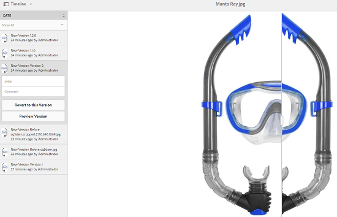

# Manage assets {#manage-assets}

この記事では、Adobe Experience Manager(AEM)Assetsでアセットを管理および編集する方法について説明します。 コンテンツフラグメントを管理するには、「コンテンツフラグメ [ントアセット](content-fragments/content-fragments.md) 」を参照してください。

## フォルダーの作成 {#creating-folders}

When organizing a collection of assets, for example, all `Nature` images, you can create folders to keep them together. フォルダーを使用すると、アセットを分類および整理できます。ただし、効率向上のためには必ずアセットをフォルダーで整理しなければならないということではありません。

>[!NOTE]
>
>`sling:OrderedFolder` タイプの Assets フォルダーの共有は、Marketing Cloud との共有時はサポートされません。If you want to share a folder, do not select [!UICONTROL Ordered] when creating a folder.

1. 新しいフォルダーを作成するデジタルアセットフォルダーの場所に移動します。メニューで、「**[!UICONTROL 作成]**」をクリックします。Select **[!UICONTROL New Folder]**.
1. In the **[!UICONTROL Title]** field, provide a folder name. デフォルトでは、フォルダー名として指定したタイトルが使用されます。フォルダーが作成されると、デフォルトのフォルダー名を上書きして、別のフォルダー名を指定できます。
1. 「**[!UICONTROL 作成]**」をクリックします。作成したフォルダーがデジタルアセットフォルダーに表示されます。

以下の文字（スペース区切りリスト）はサポートされません。

* アセットファイル名に次の文字を含めることはできません。 `* / : [ \\ ] | # % { } ? &`
* アセットフォルダ名には、次の文字を含めることはできません。 `* / : [ \\ ] | # % { } ? \" . ^ ; + & \t`

## Upload assets {#uploading-assets}

詳しくは [、Experience Managerへのデジタルアセットの追加](add-assets.md)（英語のみ）を参照してください。

## アセットのプレビュー {#previewing-assets}

アセットをプレビューするには、次の手順に従います。

1. アセットユーザーインターフェイスから、プレビューするアセットの場所に移動します。
1. 目的のアセットをタップして開きます。

1. プレビューモードでは、[サポートされている画像タイプ](/help/assets/file-format-support.md)で（インタラクティブ編集中に）ズームオプションを使用できます。

   To zoom into an asset, tap/click `+` (or tap/click the magnifying glass on the asset). To zoom out, tap/click `-`. ズームインすると、パンニングによって画像の任意の場所を詳細に確認できます。ズームのリセット矢印を使用すると、元のビューに戻ります。

   Tap **[!UICONTROL Reset]** to reset the view to the original size.

## プロパティを編集 {#editing-properties}

1. メタデータを編集するアセットの場所に移動します。

1. Select the asset, and tap/click **[!UICONTROL Properties]** from the toolbar to view asset properties. または、アセットカードで&#x200B;**[!UICONTROL プロパティ]**&#x200B;クイックアクションを選択します。

   

1. In the [!UICONTROL Properties] page, edit the metadata properties under various tabs. 例えば、「**[!UICONTROL 基本]**」タブでは、タイトルや説明などを編集します。

   >[!NOTE]
   >
   >The layout of the [!UICONTROL Properties] page and the metadata properties available depend on the underlying metadata schema. To learn how to modify the layout of the [!UICONTROL Properties] page, see [Metadata Schemas](/help/assets/metadata-schemas.md).

1. アセットをアクティベートする特定の日付と時間をスケジュールするには、「**[!UICONTROL オンタイム]**」フィールドの横にある日付選択を使用します。

   

1. To deactivate the asset after a particular duration, choose the deactivation date/time from the date picker beside the **[!UICONTROL Off Time]** field. アクティベートを解除する日付は、アセットに設定されたアクティベート日より後の日付にしてください。オフ時間の後 [!UICONTROL は]、アセットとそのレンディションは、アセットWebインターフェイスまたはHTTP API経由では使用できません。

   

1. 「**[!UICONTROL タグ]**」フィールドで、タグを 1 つ以上選択します。カスタムタグを追加するには、ボックスにタグの名前を入力し、Enterキーを押します。 新しいタグが AEM に保存されます。

   YouTube で公開して YouTube へのリンクを張る（適切なリンクがある場合）には、タグが必要です。

   >[!NOTE]
   >
   >タグを作成するには、CRXリポジトリのパスでの書き込み権 `/content/cq:tags/default` 限が必要です。

1. To view usage usage statistics for the asset, click/tap the **[!UICONTROL Insights]** tab.

   使用状況の統計には、次の情報が含まれています。

   * アセットが表示またはダウンロードされた回数
   * アセットが使用されたチャネルまたはデバイス
   * アセットが最近使用されたクリエイティブソリューション
   詳しくは、[アセットインサイト](assets-insights.md)を参照してください。

1. 「**[!UICONTROL 保存して閉じる]**」をタップまたはクリックします。

1. アセットユーザーインターフェイスに移動します。 タイトル、説明、タグなど、編集されたメタデータプロパティは、カード表示のアセットカードと、リスト表示の関連する列の下に表示されます。

## アセットのコピー {#copying-assets}

アセットやフォルダーをコピーすると、そのアセットやフォルダーがコンテンツ構造と共にコピーされます。コピーされたアセットやフォルダーはコピー先に複製されます。コピー元にあるアセットは変更されません。

アセットの特定のコピーに一意に関連付けられる属性は継承されません。例えば、以下のものが該当します。

* 相対パス、アセット ID、作成日時、バージョン、バージョン履歴。Some of these properties are indicated by the properties `dam:relativePath`, `jcr:uuid`, `jcr:created`, and `cq:name`.

* 作成時間と参照パスは、各アセットとその各レンディションに対して一意です。

その他のプロパティとメタデータ情報は保持されます。アセットをコピーするときに、部分的なコピーが作成されることはありません。

1. From the Assets UI, select one or more assets, and then tap/click the **[!UICONTROL Copy]** icon from the toolbar. または、アセットカ **[!UICONTROL ードから]** Copy  copy_iconクイックアクションを選択します。

   >[!NOTE]
   >
   >If you use the [!UICONTROL Copy] quick action, you can only copy one asset at a time.

1. アセットをコピーする場所に移動します。

   >[!NOTE]
   >
   >同じ場所でアセットをコピーすると、AEM は自動的に名前のバリエーションを生成します。For example, if you copy an asset titled `Square`, AEM automatically generates the title for its copy as `Square1`.

1. Click the **[!UICONTROL Paste]** asset icon from the toolbar. アセットはこの場所にコピーされます。

   

   >[!NOTE]
   >
   >The **[!UICONTROL Paste]** icon is available in the toolbar until the paste operation is completed.

### アセットの移動または名前の変更 {#moving-or-renaming-assets}

1. 移動するアセットの場所に移動します。

1. Select the asset, and tap/click the **[!UICONTROL Move]** icon  from the toolbar.

1. アセットを移動ウィザードで、次のいずれかの操作をおこないます。

   * 移動後のアセットの名前を指定します。Then tap/click **[!UICONTROL Next]** to proceed.

   * Tap/click **[!UICONTROL Cancel]** to stop the process.
   >[!NOTE]
   >
   >* 新しい場所に同じ名前のアセットがない場合は、同じ名前を指定できます。ただし、アセットの移動先に同じ名前のアセットが既に存在する場合は、別の名前を使用する必要があります。同じ名前を使用すると、その名前のバリエーションが自動的に生成されます。例えば、「Square」という名前のアセットの場合、自動的にそのコピーの名前が「Square1」として生成されます。
   >* 名前の変更時に、ファイル名に空白は使用できません。

1. On the **[!UICONTROL Select Destination]** dialog, do one of the following:

   * Navigate to the new location for the assets, and then tap/click **[!UICONTROL Next]** to proceed.

   * Tap/click **[!UICONTROL Back]** to return to the **[!UICONTROL Rename]** screen.

1. If the assets being moved have any referencing pages, assets, or collections, the **[!UICONTROL Adjust References]** tab appears beside the **[!UICONTROL Select Destination]** tab.

   Do one of the following in the **[!UICONTROL Adjust References]** screen:

   * Specify the references to be adjusted based on the new details, and then tap/click **[!UICONTROL Move]** to proceed.

   * 「**[!UICONTROL 調整]**」列で、アセットへの参照を選択／選択解除します。
   * Tap/click **[!UICONTROL Back]** to return to the **[!UICONTROL Select Destination]** screen.

   * Tap/click **[!UICONTROL Cancel]** to stop the move operation.
   参照を更新しない場合、参照は引き続きアセットの前のパスを指します。 参照を調整すると、更新され、アセットの新しいパスが反映されます。

### レンディションの管理 {#managing-renditions}

1. アセットのレンディション（オリジナルを除く）を追加または削除できます。レンディションを追加または削除するアセットの場所に移動します。

1. アセットをタップまたはクリックして、そのアセットページを開きます。

   

1. Tap/click the GlobalNav icon, and select **[!UICONTROL Renditions]** from the list.

   

1. **[!UICONTROL レンディション]**&#x200B;パネルで、アセットに生成されたレンディションのリストを表示します。

   

   >[!NOTE]
   >
   >デフォルトで、AEM Assets はプレビューモードでアセットのオリジナルレンディションを表示しません。管理者の場合、オーバーレイを使用して AEM Assets を設定し、プレビューモードでもオリジナルレンディションを表示できます。

1. 表示または削除するレンディションを選択します。

   **レンディションの削除**

   Select a rendition from the **[!UICONTROL Renditions]** panel, and then tap/click the **[!UICONTROL Delete Rendition]** icon from the toolbar.

   

   **新しいレンディションのアップロード**

   Navigate to the asset details page for the asset, and tap/click the **[!UICONTROL Add Rendition]** icon in the toolbar to upload a new rendition for the asset.

   

   >[!NOTE]
   >
   >If you select a rendition from the **[!UICONTROL Renditions]** panel, the toolbar changes context and displays only those actions that are relevant to the rendition. レンディションをアップロードアイコンなどのオプションは表示されません。これらのオプションをツールバーに表示するには、アセットの詳細ページに移動します。

   画像またはビデオアセットの詳細ページに表示するレンディションのサイズを設定できます。指定するサイズに基づいて、AEM Assets はレンディションを正確なサイズまたは最も近いサイズで表示します。

   To configure rendition dimensions of an image at the asset detail level, overlay the `renditionpicker` node (`libs/dam/gui/content/assets/assetpage/jcr:content/body/content/content/items/assetdetail/items/col1/items/assetview/renditionpicker`) and configure the value of the width property. 画像サイズに基づいてアセットの詳細ページでレンディションをカスタマイズするには、幅の代わりに **[!UICONTROL size (Long) in KB]** プロパティを設定します。サイズベースのカスタマイズの場合、`preferOriginal` プロパティを使用すると、一致するレンディションのサイズがオリジナルより大きい場合でも、オリジナルが優先されます。

   同様に、Annotationページの画像をオーバーレイしてカスタマイズできま `libs/dam/gui/content/assets/annotate/jcr:content/body/content/content/items/content/renditionpicker`す。

   

   To configure rendition dimensions for a video asset, navigate to the `videopicker` node in the CRX repository at the location `/libs/dam/gui/content/assets/assetpage/jcr:content/body/content/content/items/assetdetail/items/col1/items/assetview/videopicker`, overlay the node, and then edit the appropriate property.

   >[!NOTE]
   >
   >ビデオの注釈は、HTML5 互換のビデオ形式に対応したブラウザーでのみサポートされます。また、ブラウザーによってサポートされるビデオ形式が異なります。

## アセットを削除する {#delete-assets}

他のページからの入力参照を解決または削除するには、アセットを削除する前に、関連する参照を更新します。

また、オーバーレイを使用して「削除を強制」ボタンを無効にすることで、参照されているアセットの削除と壊れたリンクの放置を禁止します。

1. 削除するアセットの場所に移動します。

1. Select the asset, and tap/click the **[!UICONTROL Delete]** icon from the toolbar.

   

1. 確認ダイアログで、次のいずれかをクリックします。

   * **[!UICONTROL キャンセル]**：アクションを停止します。
   * **[!UICONTROL 削除]**：アクションの実行を確定します。

      * アセットに参照がない場合は、アセットが削除されます。
      * アセットに参照がある場合は、「**1 つ以上のアセットが参照されています。**」というエラーメッセージが表示されます。「**[!UICONTROL 削除を強制]**」または「**[!UICONTROL キャンセル]**」を選択できます。
   >[!NOTE]
   >
   >アセットを削除するには、dam/assetに対する削除権限が必要です。 変更権限のみ付与されている場合、アセットのメタデータの編集とアセットへの注釈の追加のみが可能で、アセットやそのメタデータの削除は実行できません。

   >[!NOTE]
   >
   >他のページからの入力参照を解決または削除するには、アセットを削除する前に、関連する参照を更新します。
   >
   >
   >また、オーバーレイを使用して「削除を強制」ボタンを無効にすることで、参照されているアセットの削除と壊れたリンクの放置を禁止します。

## アセットのダウンロード {#download-assets}

[AEM からのアセットのダウンロード](/help/assets/download-assets-from-aem.md)を参照してください。

## Publish assets {#publish-assets}

<!--
>[!NOTE]
>
>For more information specific to Dynamic Media, see [Publishing Dynamic Media Assets.](/help/assets/dynamic-media/publishing-dynamicmedia-assets.md)
-->

1. 公開するアセットまたはフォルダーの場所に移動します。

1. Either select the **[!UICONTROL Publish]** quick action from the asset card, or select the asset and tap/click the **[!UICONTROL Quick Publish]** icon from the toolbar.
1. アセットが他のアセットを参照する場合は、その参照がウィザードに表示されます。表示されるのは、非公開の参照か、最後に公開または非公開にされた後に変更された参照だけです。公開する参照を選択します。

   

   >[!NOTE]
   >
   >公開したいフォルダーに空のフォルダーが含まれる場合、空のフォルダーは公開されません。

1. 「**[!UICONTROL 公開]**」をタップまたはクリックして、アセットのアクティベートを確認します。

>[!CAUTION]
>
>処理中のアセットを公開した場合は、オリジナルのコンテンツのみが公開されます。処理中のレンディションは失われます。処理が完了するまで待ってから公開するか、処理の完了後にアセットを公開し直してください。

## アセットの非公開 {#unpublishing-assets}

1. パブリッシュ環境から削除する（非公開にする）アセットまたはアセットフォルダーの場所に移動します。

1. Select the asset/folder to unpublish, and tap/click the **[!UICONTROL Manage Publication]** icon from the toolbar.

   

1. Select the **[!UICONTROL Unpublish]** action from the list.

   

1. 後でアセットを非公開にするには、「**[!UICONTROL 後で非公開にする]**」を選択して、アセットを非公開にする日付を選択します。
1. パブリッシュ環境でアセットを非公開にする日付をスケジュールします。
1. アセットが他のアセットを参照する場合は、非公開にする参照を選択します。Tap/click **[!UICONTROL Unpublish]**.
1. 確認ダイアログで、次のいずれかをタップまたはクリックします。

   * **[!UICONTROL キャンセル]**：アクションを停止します。
   * **[!UICONTROL 「非公開]** 」を選択すると、指定した日にアセットが非公開（公開環境で使用できなくなった）になることを確認できます。
   >[!NOTE]
   >
   >複雑なアセットの公開を取り消す場合は、アセットのみ公開を取り消します。 参照は、他の公開済みアセットによって参照される可能性があるので、公開を取り消さないでください。

## Closed user group {#closed-user-group}

閉じられたユーザーグループ（CUG）は、AEM から公開された特定のアセットフォルダーへのアクセスを制限するために使用します。フォルダーに対して CUG を作成すると、そのフォルダー（フォルダーのアセットとサブフォルダーを含む）へのアクセスは、割り当てられたメンバーまたはグループのみに制限されます。フォルダーにアクセスするには、セキュリティ資格情報を使用してログインする必要があります。

CUG は、アセットへのアクセスを制限する追加の方法です。また、フォルダーのログインページを設定することもできます。

1. Assets UI からフォルダーを選択し、ツールバーの「プロパティ」アイコンをタップまたはクリックして、プロパティページを表示します。
1. 「**[!UICONTROL 権限]**」タブで、「**[!UICONTROL 閉じられたユーザーグループ]**」の下でメンバーまたはグループを追加します。

   

1. ユーザーがフォルダーにアクセスしたときにログイン画面を表示するには、「**[!UICONTROL 有効]**」オプションを選択します。次に、AEM 内のログインページへのパスを選択し、変更を保存します。

   

   >[!NOTE]
   >
   >ログインページへのパスを指定しないと、AEM はパブリッシュインスタンスでデフォルトのログインページを表示します。

1. フォルダーを公開し、パブリッシュインスタンスからアクセスすると、ログイン画面が表示されます。
1. CUG メンバーの場合は、自分のセキュリティ資格情報を入力します。AEM によって認証されると、フォルダーが表示されます。

## アセットの検索 {#search-assets}

アセットの検索は、デジタルアセット管理システムの利用の中核を成します。用途は、クリエイティブ担当者によるさらなる利用、ビジネスユーザーやマーケティング担当者によるアセットの堅牢な管理、DAM 管理者による管理などです。

最も適切なアセットを検出し使用するためのシンプル検索、アドバンス検索、カスタム検索については、[AEM でのアセットの検索](/help/assets/search-assets.md)を参照してください。

## クイックアクション {#quick-actions}

クイックアクションのアイコンは、一度に 1 つのアセットに対してのみ利用できます。デバイスに応じて、次の操作を実行してクイックアクションアイコンを表示します。

* タッチデバイス：タッチ＆ホールド。例えば、iPadでは、アセットをタップ&amp;ホールドして、クイックアクションを表示することができます。
* 非タッチデバイス：マウスポインターで指す。例えば、デスクトップデバイスで、アセットのサムネールにポインターを合わせると、クイックアクションバーが表示されます。

## 画像の編集 {#editing-images}

AEM Assets インターフェイスの編集ツールを使用すると、画像アセットで細かい編集ジョブを実行できます。画像に対して切り抜き、回転、反転などの編集ジョブを実行できます。アセットに画像マップを追加することもできます。

>[!NOTE]
>
>一部のコンポーネントでは、フルスクリーンモードで追加のオプションも使用できます。

1. 編集モードでアセットを開くには、次のいずれかの操作をおこないます。

   * Select the asset and then click/tap the **[!UICONTROL Edit]** icon in the toolbar.
   * Tap/click the **[!UICONTROL Edit]** icon that appears on an asset in the Card view.
   * In the asset page, tap/click the **[!UICONTROL Edit]** icon in the toolbar.
   

1. To crop the image, tap/click the **Crop** icon.

   

1. リストから必要なオプションを選択します。選択したオプションに基づいて、画像に切り抜き領域が表示されます。「**フリーハンド**」オプションを使用すると、縦横比の制限に関係なく画像を切り抜くことができます。

   

1. 切り抜く領域を選択し、画像上でそのサイズまたは位置を変更します。
1. **完了**&#x200B;アイコン（右上隅）を使用して、画像を切り抜きます。「**完了**」アイコンをクリックすると、レンディションの再生成もおこなわれます。

   

1. Use the **Undo** and **Redo** icons on the top right to revert to the uncropped image or retain the cropped image, respectively.

   

1. 適切な回転アイコンをタップまたはクリックして、画像を時計回りまたは反時計回りに回転します。

   

1. 適切な反転アイコンをタップまたはクリックして、画像を水平方向または垂直方向に反転します。

   

1. Tap/click the **Finish** icon to save the changes.

   

>[!NOTE]
>
>BMP、GIF、PNG、JPEG の各ファイル形式については、画像編集がサポートされています。

<!-- You can also add image maps using the image editor. For details, see [Adding Image Maps](/help/assets/image-maps.md). -->

>[!NOTE]
>
>To edit a TXT file, set **Day CQ Link Externalizer** from Configuration Manager.

## タイムライン {#timeline}

タイムラインを使用すると、アセットのアクティブなワークフロー、コメントや注釈、アクティビティログ、バージョンなど、選択した項目の様々なイベントを表示できます。

*えます。アセットのタイムラインエントリの並べ替え*

>[!NOTE]
>
>[コレクションコンソール](/help/assets/manage-collections.md#navigate-the-collections-console)の&#x200B;**[!UICONTROL すべて表示]**&#x200B;リストには、コメントとワークフローだけを表示するオプションがあります。さらに、タイムラインはコンソールにリストされているトップレベルのコレクションについてのみ表示されます。これらのコレクション内を移動する場合、タイムラインは表示されません。

>[!NOTE]
>
>タイムラインには、[コンテンツフラグメントに固有のオプション](content-fragments/content-fragments.md)がいくつか含まれています。

## 注釈 {#annotating}

注釈とは、画像やビデオに追加するコメントまたは注記です。注釈を使用すると、マーケターはアセットに関する共同作業やフィードバックの送信を行うことができます。

ビデオの注釈は、HTML5 互換のビデオ形式に対応したブラウザーでのみサポートされます。AEM Assetsがサポートするビデオ形式は、ブラウザーによって異なります。

>[!NOTE]
>
>コンテンツフラグメントの場合、[注釈はフラグメントエディターで作成されます](content-fragments/content-fragments.md)。

1. 注釈を追加するアセットの場所に移動します。
1. Tap/click the **[!UICONTROL Annotate]** icon from one of the following:

   * [クイックアクション](#quick-actions)
   * アセットを選択した後またはアセットページに移動した後に、ツールバーから
   

1. Add a comment in the **[!UICONTROL Comment]** box at the bottom of the timeline. または、画像内の任意の領域をマークアップし、**[!UICONTROL 注釈を追加]**&#x200B;ダイアログに注釈を追加します。

   

1. 注釈についてユーザーに通知するには、ユーザーの電子メールアドレスを指定して、コメントを追加します。例えば、注釈について Aaron MacDonald というユーザーに通知するには、@aa と入力します。一致するすべてのユーザーに関するヒントがリストに表示されます。Aaron の電子メールアドレスをリストから選択し、コメントを使用してタグ付けします。同様に、注釈内の任意の場所、またはコメントの前後で追加のユーザーにタグ付けできます。

   >[!NOTE]
   >
   >For a non-administrator user, suggestions appear only if the user has Read permissions at */home* in Crx-de.

   

1. 注釈を追加したら、「**[!UICONTROL 追加]**」をクリックして注釈を保存します。注釈に関する通知が Aaron に送信されます。

   

   >[!NOTE]
   >
   >複数の注釈を追加してから、それらを保存できます。

1. 「**[!UICONTROL 閉じる]**」をタップまたはクリックして注釈モードを終了します。
1. To view the notification, log in to AEM Assets with Aaron MacDonald&#39;s credentials and click the **[!UICONTROL Notifications]** icon to view the notification.

   >[!NOTE]
   >
   >注釈はビデオアセットにも追加できます。ビデオに注釈を追加する際は、ユーザーがフレームに注釈を追加できるようにプレーヤーが一時停止します。For details, see [managing video assets](manage-video-assets.md).

1. 別の色を選択してユーザーを区別できるようにするには、プロフィールアイコンをクリックまたはタップし、「**[!UICONTROL 環境設定]**」をクリックまたはタップします。

   

   Specify the desired color in the **[!UICONTROL Annotation Color]** box and then click/tap **[!UICONTROL Accept]**.

   

>[!NOTE]
>
>コレクションにも注釈を追加できます。ただし、コレクションに子コレクションが含まれる場合、親コレクションに対してのみ注釈／コメントを追加できます。「注釈」オプションは子コレクションでは使用できません。

### 保存された注釈の表示 {#viewing-saved-annotations}

1. アセットに対して保存された注釈を表示するには、アセットの場所に移動して、そのアセットのアセットページを開きます。

1. Tap/click the GlobalNav icon, and choose **[!UICONTROL Timeline]** from the list.

   

1. From the **[!UICONTROL Show All]** list in the timeline, select **[!UICONTROL Comments]** to filter the results based on annotations.

   

   **[!UICONTROL タイムライン]**&#x200B;パネルでコメントをタップまたはクリックし、対応する画像の注釈を表示します。

   

   特定のコメントを削除するには、「**[!UICONTROL 削除]**」をタップまたはクリックします。

### 注釈の印刷 {#printing-annotations}

アセットに注釈が含まれている場合や、アセットがレビューワークフローの対象となっている場合は、注釈と共にアセットを印刷し、オフラインレビュー用のPDFファイルとしてステータスをレビューできます。

注釈またはレビューステータスのみ印刷することも選択できます。

注釈とレビューステータスを印刷するには、**[!UICONTROL 印刷]**&#x200B;アイコンをタップまたはクリックし、ウィザードの指示に従ってください。The **[!UICONTROL Print]** icon appears in the toolbar only when the asset has at least one annotation or review status assigned to it.

1. Assets UI から、アセットのプレビューページを開きます。
1. 次のいずれかの操作をおこないます。

   * すべての注釈とレビューステータスを印刷するには、手順 3 をスキップして手順 4 に直接進みます。
   * To print specific annotations and review status, open the [timeline](/help/assets/manage-digital-assets.md#timeline) and then go to step 3.

1. 特定の注釈を印刷するには、タイムラインから注釈を選択します。

   

   レビューステータスのみを印刷するには、タイムラインからレビューステータスを選択します。

   

1. ツールバーの&#x200B;**[!UICONTROL 印刷]**&#x200B;アイコンをタップまたはクリックします。

   

1. 印刷ダイアログから、「注釈／レビューステータス」を PDF のどこに表示したいかを選択します。For example, if you want the annotations/status to be printed at the top-right of the page that contains the printed image, use the **Top-Left** setting. デフォルトで選択されています。

   

   印刷する PDF のどこに「注釈／ステータス」を表示するかに応じて、別の設定も選択できます。If you want the annotations/status to appear in a page that is separate from the printed asset, choose **[!UICONTROL Next Page]**.

   >[!NOTE]
   >
   >長い注釈は PDF ファイルに適切にレンダリングされない可能性があります。最適なレンダリングのために、注釈を 50 語以内に制限することをお勧めします。

1. Tap/click **[!UICONTROL Print]**. 手順 2 で選択したオプションに応じて、生成される PDF の特定の位置に注釈／ステータスが表示されます。For example, if you choose to print both annotations and the review status using the **Top-Left** setting, the generated output resembles the PDF file depicted here.

   

1. 右上のオプションを使用して PDF をダウンロードまたは印刷します。

   

   レンダリングされた PDF ファイルの外観を変更するには、Configuration Manager から&#x200B;**[!UICONTROL 注釈 PDF の設定]**&#x200B;を開き、必要なオプションを変更します。例えば、コメントとステータスのフォントカラー、サイズ、スタイル、背景色を変更できます。例えば、承認済みステータスの表示色を変更したり、対応フィールドのカラーコードを変更したりします。注釈のフォントカラーの変更について詳しくは、[注釈](/help/assets/manage-digital-assets.md#annotating)を参照してください。

   

   レンダリングされた PDF ファイルに戻り、更新します。更新された PDF に、変更が反映されています。

## Asset versioning {#asset-versioning}

バージョン管理では、特定の時点でのデジタルアセットのスナップショットが作成されます。バージョン管理を使用すると、後で、以前の状態にアセットを復元できます。例えば、アセットに対しておこなった変更を取り消したい場合、バージョン管理を使用して未編集のバージョンにアセットを復元できます。

バージョンを作成するシナリオは次のとおりです。

* 別のアプリケーションで画像を変更し、AEM Assets にアップロードします。元の画像が上書きされないように画像のバージョンが作成されます。
* アセットのメタデータを編集します。
* AEMデスクトップアプリを使用して、既存のアセットをチェックアウトし、変更を保存します。 アセットが保存されるたびに、新しいバージョンが作成されます。

また、ワークフローを使用して、自動バージョン管理を有効にすることもできます。アセットのバージョンを作成すると、メタデータとレンディションがバージョンと共に保存されます。 レンディションによって、同じ画像の代替となる画像が表示されます（例えば、アップロードされた JPEG ファイルの PNG レンディション）。

バージョン管理機能を使用すると、次の操作を実行できます。

* アセットのバージョンを作成する。
* アセットの現在のリビジョンを表示する。
* 以前のバージョンにアセットを復元する。

1. バージョンを作成するアセットの場所に移動し、アセットをタップまたはクリックしてそのアセットのページを開きます。

1. グローバルナビゲーションアイコンをタップまたはクリックし、メニューから「**[!UICONTROL タイムライン]**」を選択します。

   

1. Tap/click the **[!UICONTROL Actions]** (arrow) icon at the bottom to view the available actions you can perform on the asset.

   

1. 「**[!UICONTROL 保存するバージョン]**」をタップまたはクリックして、アセットのバージョンを作成します。

   

1. Add a label and comment, and then click **[!UICONTROL Create]** to create a version. Alternatively, tap/click **Cancel** to exit the operation.

   

1. To view the new version, open the **[!UICONTROL Show All]** list in the timeline from the asset details page or the Assets UI, and choose **[!UICONTROL Versions]**. All versions created for an asset are listed under the timeline tab. You can filter the list to show Versions, by clicking the drop arrow and selecting **[!UICONTROL Versions]** from the list.

   

1. アセットの特定のバージョンを選択してプレビューするか、Assets UI に表示されるように設定します。

   

1. Assets UI で特定のバージョンに戻すバージョンに、ラベルとコメントを追加します。

   

1. To generate a preview for the version, tap/click **[!UICONTROL Preview Version]**.
1. To display this version in the Assets UI, select **[!UICONTROL Revert to this Version]**.
1. 2 つのバージョンを比較するには、アセットのアセットページに移動し、現在のバージョンと比較するバージョンをタップまたはクリックします。

   

1. タイムラインで、比較するバージョンを選択し、スライダーを左にドラッグして、現在のバージョンの上にこのバージョンを重ねて表示して比較します。

   

### Starte a workflow on an asset {#starting-a-workflow-on-an-asset}

1. ワークフローを開始するアセットの場所に移動し、アセットをタップまたはクリックしてそのアセットのページを開きます。
1. Tap/click the GlobalNav icon, and the choose **[!UICONTROL Timeline]** from the menu to display the timeline.

   

1. Tap/click the **[!UICONTROL Actions]** (arrow) icon at the bottom to open the list of actions available for the asset.

   

1. Tap/click **[!UICONTROL Start Workflow]** from the list.

   

1. **[!UICONTROL ワークフローを開始]**&#x200B;ダイアログで、リストからワークフローモデルを選択します。

   

1. （オプション）ワークフローインスタンスを参照するために使用するワークフローのタイトルを指定します。

   

1. Tap/click **[!UICONTROL Start]** and then tap/click **[!UICONTROL Proceed]** in the dialog to confirm. ワークフローの各ステップは、タイムラインにイベントとして表示されます。

   

## コレクション {#collections}

コレクションとは、一連のアセットを順序よく並べたものです。コレクションを使用して、ユーザー間でアセットを共有します。

* 1 つのコレクションにはアセットへの参照のみが含まれるので、様々な場所のアセットを含めることができます。各コレクションは、アセットの参照整合性を維持します。
* コレクションは、権限レベル（編集、表示など）の異なる複数のユーザー間で共有できます。

See [Managing Collections](/help/assets/manage-collections.md) for details on collection management.
