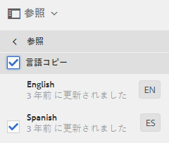
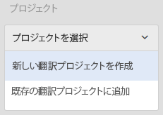
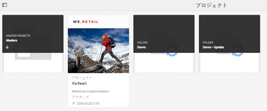
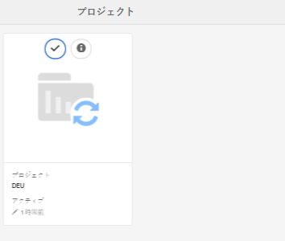
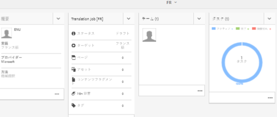
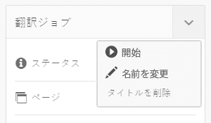
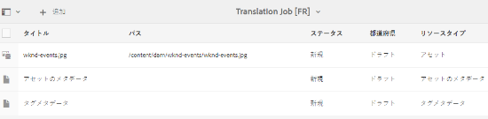
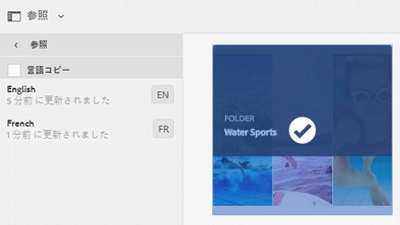
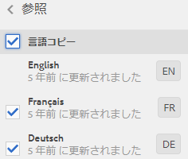

# 複合アセットの管理 {#managing-compound-assets}

Adobe Experience Manager (AEM) Assets では、アップロードされたファイルに、リポジトリ内の既存のアセットへの参照が含まれているかどうかを確認できます。この機能は、サポート対象のファイル形式でのみ使用できます。アップロードされたアセットに AEM アセットへの参照が含まれている場合、アップロードされたアセットと参照元のアセットの間に双方向のリンクが作成されます。

Adobe Creative Cloud アプリケーションで AEM アセットを参照することで、冗長性を排除するだけでなく、コラボレーションを強化し、ユーザーの作業効率と生産性を高めることができます。

AEM Assets では&#x200B;**双方向の参照**&#x200B;をサポートしています。参照元のアセットは、アップロードされたファイルのアセットの詳細ページで確認できます。さらに、AEM アセットの参照先のファイルは、参照元アセットのアセット詳細ページで確認できます。

参照は、参照元のアセットのパス、ドキュメント ID およびインスタンス ID に基づいて解決されます。

## Adobe Illustrator 内で AEM アセットを参照として追加{#refai}

既存の AEM アセットを、Adobe Illustrator ファイル内から参照できます。

1. [AEM デスクトップアプリケーション](https://docs.adobe.com/content/help/ja-JP/experience-manager-desktop-app/using/using.html)を使用して、AEM Assets リポジトリをローカルコンピューター上のドライブとしてマウントします。マウントしたドライブ内で、参照するアセットの場所に移動します。
1. マウントしたドライブから Illustrator ファイルにアセットをドラッグします。
1. Illustrator ファイルをマウントしたドライブに保存するか、AEM リポジトリに[アップロード](/help/assets/manage-digital-assets.md#uploading-assets)します。
1. ワークフローが完了したら、そのアセットのアセットの詳細ページに移動します。既存の AEM アセットへの参照は、「**参照**」列の「**依存関係**」に一覧表示されます。

   

1. 「**依存関係**」に表示される参照元のアセットは、現在のファイルとは異なるファイルからも参照できます。参照先のファイルのリストを表示するには、「**依存関係**」にあるアセットをクリックします。

   

1. ツールバーの「**プロパティを表示**」アイコンをクリックします。プロパティページで、現在のアセットを参照しているファイルのリストが「**基本**」タブの「**参照**」列に表示されます。

   

## Adobe InDesign 内で AEM アセットを参照として追加 {#add-aem-assets-as-references-in-adobe-indesign}

InDesign ファイル内から AEM アセットを参照するには、AEM アセットを InDesign ファイルにドラッグするか、InDesign ファイルを ZIP ファイルとして書き出します。

参照元のアセットは AEM Assets に既に存在します。<!-- You can extract subassets by [configuring InDesign server](/help/assets/indesign.md). Embedded assets in an InDesign file are extracted as subassets. -->

>[!NOTE]
>
>InDesign サーバーにプロキシが設定されている場合、InDesign のファイルのプレビューが XMP メタデータ内に組み込まれています。この場合、サムネールの抽出は明示的には必要ありません。ただし、InDesign にプロキシが設定されていない場合、InDesign のファイルでサムネールを明示的に抽出する必要があります。

### AEM アセットをドラッグして参照を作成{#create-references-by-dragging-aem-assets}

この手順は、[Adobe Illustrator で AEM アセットを参照として追加する](#refai)場合の手順と同様です。

### ZIP ファイルに書き出して AEM アセットの参照を作成 {#create-references-to-aem-assets-by-exporting-a-zip-file}

1. 新しいワークフローモデルを作成します。
1. Adobe InDesign のパッケージ機能を使用して、ドキュメントを書き出します。
Adobe InDesign ではドキュメントおよびリンクされたアセットを 1 つのパッケージとして書き出すことができます。この場合、書き出されたフォルダーには、InDesign ファイル内のサブアセットを格納するための Links フォルダーが含まれます。
1. ZIP ファイルを作成し、このファイルを AEM リポジトリにアップロードします。
1. 解凍ワークフローを開始します。
1. ワークフローが完了すると、リンクフォルダー内の参照がサブアセットとして自動的に参照されます。参照元のアセットのリストを表示するには、InDesign アセットのアセットの詳細ページに移動して、[パネル](/help/sites-cloud/authoring/getting-started/basic-handling.md#rail-selector)を閉じます。

## Adobe Photoshop 内で AEM アセットを参照として追加 {#refps}

1. WebDav クライアントを使用して、AEM Assets をドライブとしてマウントします。
1. Photoshop ファイルに AEM アセットへの参照を作成するには、Photoshop のリンクを配置機能を使用して、マウントしたドライブで対応するアセットに移動します。

   

1. Photoshop ファイルをマウントしたドライブに保存するか、AEM リポジトリに[アップロード](/help/assets/manage-digital-assets.md#uploading-assets)します。
1. ワークフローが完了したら、既存の AEM アセットへの参照がアセットの詳細ページに一覧表示されます。

   参照元のアセットを表示するには、アセットの詳細ページで[パネル](/help/sites-cloud/authoring/getting-started/basic-handling.md#rail-selector)を閉じます。

1. 参照元のアセットには、参照元のアセットのリストも含まれています。参照元のアセットのリストを表示するには、アセットの詳細ページに移動して、[パネル](/help/sites-cloud/authoring/getting-started/basic-handling.md#rail-selector)を閉じます。

>[!NOTE]
>
>複合アセット内のアセットも、ドキュメント ID とインスタンス ID に基づいて参照できます。この機能は、Adobe Illustrator と Adobe Photoshop のバージョンでのみ使用できます。その他の場合、AEM の以前のバージョンと同様に、メインの複合アセット内でリンクされたアセットの相対パスに基づいて参照が実行されます。

## 複数ページファイルのページの表示{#view-pages-of-a-multi-page-file}

AEM Assets のページビューア機能を使用すると、複数ページファイルの個々のページ（PDF、INDD、PPT、PPTX、Ai ファイルなど）を表示できます。InDesign では、InDesign サーバーを使用してページを抽出できます。InDesign ファイルの作成中にページのプレビューが保存されている場合は、ページを抽出するために InDesign サーバーを使用する必要はありません。

アセットページからファイルの個々のページを閲覧できます。ツールバーのオプションを使用してファイルの個々のページに注釈を追加できます。また、「**ページ概要**」オプションを使用してすべてのページを同時に表示することもできます。

1. 複数ページファイルが含まれる AEM Assets のフォルダーに移動します。
1. アセットをクリックして、そのアセットのページを開きます。

   

1. グローバルナビゲーションアイコンをクリックし、メニューから「**ページ**」を選択します。

   

1. 画像の下の左右アイコンをクリックしてファイルの個々のページに移動します。

   

1. ページに注釈を追加するには、ツールバーの「**注釈**」アイコンをクリックしてコメントを追加します。

   

1. ファイルをダウンロードするには、「**ダウンロード**」アイコンをクリックします。

   

1. ファイルのすべてのページを同時に表示するには、**ページ概要**&#x200B;アイコンをクリックします。

   

1. ファイルのアクティビティストリーム（注釈、ダウンロードなど）を表示するには、グローバルナビゲーションアイコンをクリックしてメニューから「**タイムライン**」を選択します。

   

1. ページのメタデータのプロパティを表示して編集するには、ツールバーの「**プロパティを表示**」アイコンをクリックします。

   
