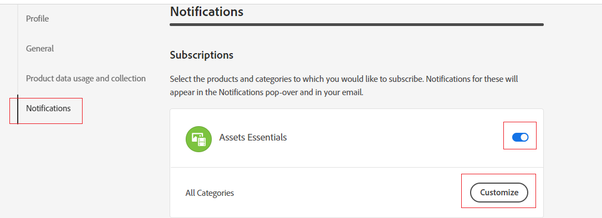
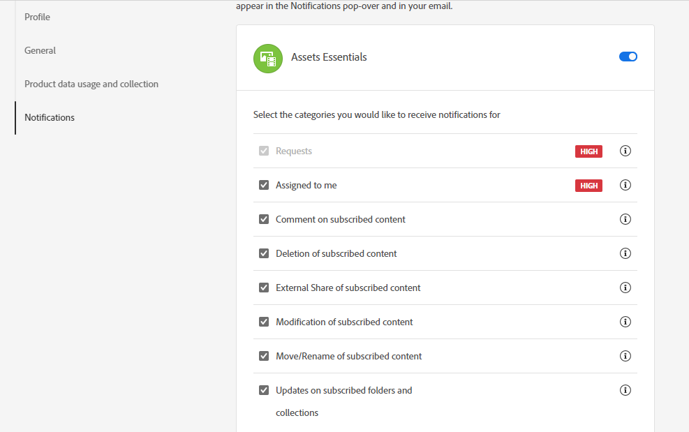
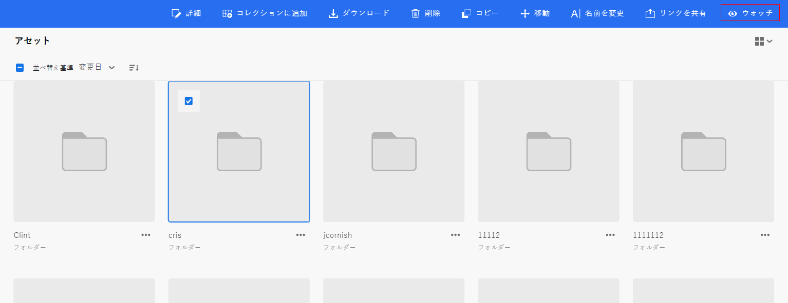
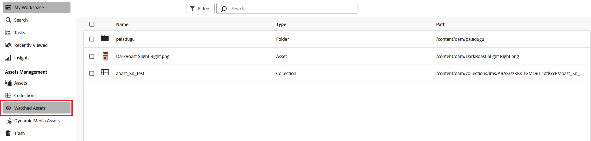
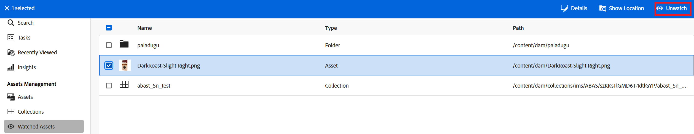

# アセット、フォルダー、コレクションの監視 {#watch-assets-folders}

アセットビュー通知を使用すると、リポジトリで使用可能なアセット、フォルダーまたはコレクションで実行された操作を監視できます。 通知を送信するコンテンツを選択し、購読する必要があります。 また、通知を受け取るカテゴリを設定することもできます。

## 通知カテゴリの購読 {#subscribe-to-notification-categories}

カテゴリのリストから選択して購読すると、通知を受け取ることができます。 アセットビューは、使用可能なオプションから選択したカテゴリに対してのみ通知を送信します。

<table>
    <tbody>
     <tr>
      <th><strong>通知カテゴリ</strong></th>
      <th><strong>説明</strong></th>
     </tr>
     <tr>
      <td>リクエスト</td>
      <td>あるタスクをユーザーに割り当てると、そのユーザーがそのタスクでアクションを実行したときに通知が届きます。</td>
     </tr>
     <tr>
      <td>自分に割り当て済み</td>
      <td>別のユーザーから自身にタスクが割り当てられると通知が届きます。</td>
     </tr>
     <tr>
      <td>購読しているコンテンツにコメント</td>
      <td>購読しているアセットにユーザーがコメントすると、通知が届きます。</td>
     </tr>
     <tr>
      <td>購読しているコンテンツの削除</td>
      <td>購読しているアセット、フォルダーまたはコレクションをユーザーが削除すると、通知が届きます。</td>
     </tr>
     <tr>
      <td>購読しているコンテンツの外部共有</td>
      <td>購読しているアセット、フォルダーまたはコレクションの公開リンクをユーザーが生成すると、通知が届きます。</td>
     </tr>
     <tr>
      <td>購読しているコンテンツの変更</td>
      <td>購読しているアセットの新しいバージョンをユーザーが作成すると、通知が届きます。</td>
     </tr>
     <tr>
      <td>購読しているコンテンツの移動／名前変更</td>
      <td>購読しているアセットまたはフォルダーの名前をユーザーが移動または変更すると、通知が届きます。</td>
     </tr>
     <tr>
      <td>購読しているフォルダーおよびコレクションの更新</td>
      <td>購読しているフォルダーまたはコレクションで、ユーザーがアセットを追加または削除すると、通知が届きます。</td>
     </tr>    
    </tbody>
   </table>

通知カテゴリを購読するには：

1. アセットビューユーザーインターフェイスのメニューバーの右端にあるをクリックします。

1.  をクリックして、[!UICONTROL Experience Cloud の環境設定]ページを表示します。

1. 左側のウィンドウで使用可能な「**[!UICONTROL 通知]**」オプションをクリックします。

1. 「**[!UICONTROL 通知]**」セクションで、「[!UICONTROL アセットビュー]」セクションに移動し、切り替えオプションがオンの状態に切り替えられていることを確認します。

   

1. 「**[!UICONTROL カスタマイズ]**」をクリックし、通知カテゴリを表示します。
   

1. 通知を受信する必要のある通知カテゴリを選択します。

## フォルダー、アセットまたはコレクションのウォッチとウォッチ解除 {#watch-unwatch-assets}

フォルダー、アセット、コレクションを監視および監視して、常に情報を得ることができ、監視中のアセットに関するコラボレーションを強化できます。

[通知カテゴリを購読](#subscribe-to-notification-categories)した後に、通知の受信を開始するには、コンテンツを購読する必要があります。

>[!NOTE]
>
>* 通知カテゴリが&#x200B;**[!UICONTROL リクエスト]**&#x200B;および&#x200B;**[!UICONTROL 自分に割り当て済み]**&#x200B;の場合、通知カテゴリを購読した後にコンテンツを購読する必要はありません。 自身が作成したリクエストに対し、および自身にタスクが割り当てられると、自動的に通知が送信されます。
>* アセットビューは、他のユーザーが購読しているコンテンツに対してアクションを実行した場合にのみ、通知を送信します。 購読しているコンテンツに対して実行するアクションについての通知は受け取りません。

### コンテンツを購読 {#subscribe-to-content}

フォルダー、アセットまたはコレクションを購入するには、次の手順に従います。

1. 購読するフォルダー、アセットまたはコレクションを参照し、**[!UICONTROL 監視]**&#x200B;をクリックします。

1. Assets ビューには、成功メッセージが表示されます。 成功メッセージの「**[!UICONTROL 通知設定に移動]**」をクリックして、通知カテゴリ [&#128279;](#subscribe-to-notification-categories)に対する サブスクリプションを編集できます。

   

Assets ビューでは、購読しているカテゴリに関する通知が送信されるようになりました。 複数のアセット、フォルダーまたはコレクションを選択し、「**[!UICONTROL ウォッチ]**」をクリックして時間を節約することもできます。 ただし、複数の項目を選択し、一部の項目が既に購読されている場合、**[!UICONTROL 監視]** オプションは表示されません。

### 購読したコンテンツを表示 {#view-subscribed-content}

購読したコンテンツを表示するには、次の手順に従います。

1. [!UICONTROL Asset Management]の下の&#x200B;**[!UICONTROL Watched Assets]**&#x200B;に移動します。

1. Assets ビューには、購読済みアセットのリスト（名前、種類、パスなど）が表示されます。 リストからアセット、フォルダー、またはコレクションを選択して、その詳細、場所を表示するか、[登録解除](#unsubscribe-to-content)します。

   

### コンテンツ登録者の表示 {#view-content-subscribers}

コンテンツのサブスクライバーを表示するには、次の手順に従います。

1. フォルダー、アセット、またはコレクションに移動し、**[!UICONTROL Details]**&#x200B;を選択します。

1. 右側のパネルから「目」をクリックすると、コンテンツの視聴者のリストが表示されます。

   または、右側のペインのをクリックして、コンテンツウォッチャーを表示します。

### コンテンツの購読を解除 {#unsubscribe-to-content}

登録解除するには：

1. [!UICONTROL Asset Management]の下の&#x200B;**[!UICONTROL Watched Assets]**&#x200B;に移動します。

1. 購読を解除するアセット、フォルダー、またはコレクションを選択し、**[!UICONTROL 監視の解除]**&#x200B;をクリックします。

   

または、[!UICONTROL &#x200B; アセット管理]の下にあるフォルダー、アセット、またはコレクションを参照します。 [購読アセット &#x200B;](#subscribe-to-content)を選択し、**[!UICONTROL 監視しない]**&#x200B;をクリックします。

## 通知を表示 {#view-notifications}

通知は、アセットビューユーザーインターフェイスのメニューバーの右端に表示されます。

通知をクリックすると、アセットビューは、通知で参照されている適切なアセットまたはフォルダーに移動します。

**関連情報**

* [アセットを翻訳](/help/assets/translate-assets.md)
* [Assets HTTP API](/help/assets/mac-api-assets.md)
* [AEM Assets as a Cloud Service でサポートされているファイル形式](/help/assets/file-format-support.md)
* [アセットを検索](/help/assets/search-assets.md)
* [接続されたアセット](/help/assets/use-assets-across-connected-assets-instances.md)
* [アセットレポート](/help/assets/asset-reports.md)
* [メタデータスキーマ](/help/assets/metadata-schemas.md)
* [アセットをダウンロード](/help/assets/download-assets-from-aem.md)
* [メタデータを管理](/help/assets/manage-metadata.md)
* [Dynamic Media テンプレートの管理](/help/assets/dynamic-media/manage-dynamic-media-templates.md)
* [レポートの管理](/help/assets/manage-reports-assets-view.md)
* [検索ファセット](/help/assets/search-facets.md)
* [コレクションを管理](/help/assets/manage-collections.md)
* [メタデータの一括読み込み](/help/assets/metadata-import-export.md)
* [AEM および Dynamic Media へのアセットの公開](/help/assets/publish-assets-to-aem-and-dm.md)

