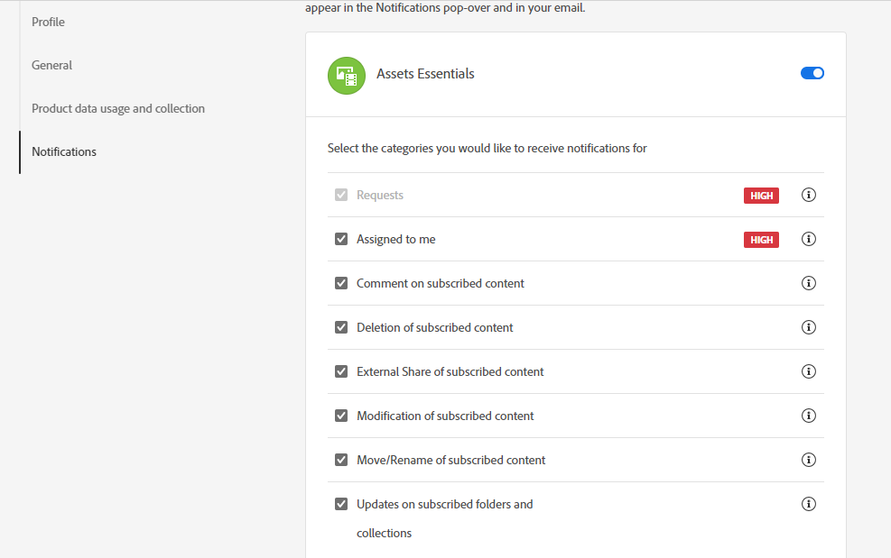

# アセット、フォルダー、コレクションの監視 {#watch-assets-folders}

アセットビュー通知を使用すると、リポジトリで使用可能なアセット、フォルダーまたはコレクションで実行された操作を監視できます。通知を送信するコンテンツを選択し、購読する必要があります。また、通知を受け取るカテゴリを設定することもできます。

## 通知カテゴリの購読 {#subscribe-to-notification-categories}

カテゴリのリストから選択して購読すると、通知を受け取ることができます。 アセットビューは、使用可能なオプションから選択したカテゴリに対してのみ通知を送信します。

<table>
    <tbody>
     <tr>
      <th><strong>通知カテゴリ</strong></th>
      <th><strong>説明</strong></th>
     </tr>
     <tr>
      <td>リクエスト</td>
      <td>あるタスクをユーザーに割り当てると、そのユーザーがそのタスクでアクションを実行したときに通知が届きます。</td>
     </tr>
     <tr>
      <td>自分に割り当て済み</td>
      <td>別のユーザーから自身にタスクが割り当てられると通知が届きます。</td>
     </tr>
     <tr>
      <td>購読しているコンテンツにコメント</td>
      <td>購読しているアセットにユーザーがコメントすると、通知が届きます。</td>
     </tr>
     <tr>
      <td>購読しているコンテンツの削除</td>
      <td>購読しているアセット、フォルダーまたはコレクションをユーザーが削除すると、通知が届きます。</td>
     </tr>
     <tr>
      <td>購読しているコンテンツの外部共有</td>
      <td>購読しているアセット、フォルダーまたはコレクションの公開リンクをユーザーが生成すると、通知が届きます。</td>
     </tr>
     <tr>
      <td>購読しているコンテンツの変更</td>
      <td>購読しているアセットの新しいバージョンをユーザーが作成すると、通知が届きます。</td>
     </tr>
     <tr>
      <td>購読しているコンテンツの移動／名前変更</td>
      <td>購読しているアセットまたはフォルダーの名前をユーザーが移動または変更すると、通知が届きます。</td>
     </tr>
     <tr>
      <td>購読しているフォルダーおよびコレクションの更新</td>
      <td>購読しているフォルダーまたはコレクションで、ユーザーがアセットを追加または削除すると、通知が届きます。</td>
     </tr>    
    </tbody>
   </table>

通知カテゴリを購読するには：

1. アセットビューユーザーインターフェイスのメニューバーの右端にあるをクリックします。

1.  をクリックして、[!UICONTROL Experience Cloud の環境設定]ページを表示します。

1. 左側のウィンドウで使用可能な「**[!UICONTROL 通知]**」オプションをクリックします。

1. 「**[!UICONTROL 通知]**」セクションで、「[!UICONTROL アセットビュー]」セクションに移動し、切り替えオプションがオンの状態に切り替えられていることを確認します。

   

1. 「**[!UICONTROL カスタマイズ]**」をクリックし、通知カテゴリを表示します。
   

1. 通知を受信する必要のある通知カテゴリを選択します。

## フォルダー、アセットまたはコレクションのウォッチとウォッチ解除 {#watch-unwatch-assets}

[通知カテゴリを購読](#subscribe-to-notification-categories)した後に、通知の受信を開始するには、コンテンツを購読する必要があります。

>[!NOTE]
>
>* 通知カテゴリが&#x200B;**[!UICONTROL リクエスト]**&#x200B;および&#x200B;**[!UICONTROL 自分に割り当て済み]**&#x200B;の場合、通知カテゴリを購読した後にコンテンツを購読する必要はありません。自身が作成したリクエストに対し、および自身にタスクが割り当てられると、自動的に通知が送信されます。
>* アセットビューは、他のユーザーが購読しているコンテンツに対してアクションを実行した場合にのみ、通知を送信します。購読しているコンテンツに対して実行するアクションについての通知は受け取りません。

コンテンツを購読するには、購読する必要があるフォルダー、アセットまたはコレクションを選択し、「**[!UICONTROL ウォッチ]**」をクリックします。

アセットビューに成功メッセージが表示されます。成功メッセージで利用可能な「**[!UICONTROL 通知環境設定に移動]**」をクリックし、[通知カテゴリの購読](#subscribe-to-notification-categories)を編集できます。

アセットビューは購読しているカテゴリの通知を送信するようになりました。複数のアセット、フォルダーまたはコレクションを選択し、「**[!UICONTROL ウォッチ]**」をクリックして時間を節約することもできます。ただし、一部が既に購読されている複数のエンティティを選択した場合、「**[!UICONTROL ウォッチ]**」オプションは表示されません。

同様に、購読解除するには、購読しているアセット、フォルダー、またはコレクションを選択し、「**[!UICONTROL ウォッチ解除]**」をクリックします。

## 通知を表示 {#view-notifications}

通知は、アセットビューユーザーインターフェイスのメニューバーの右端に表示されます。

通知をクリックすると、アセットビューは、通知で参照されている適切なアセットまたはフォルダーに移動します。
