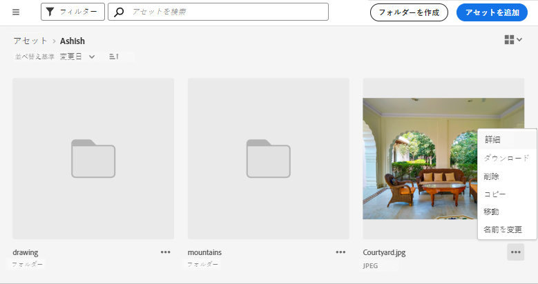
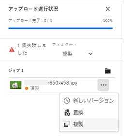
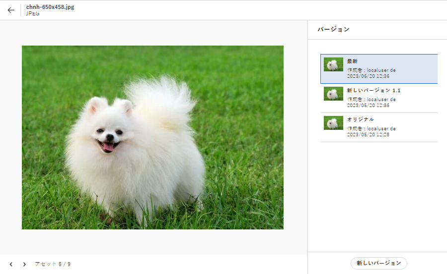
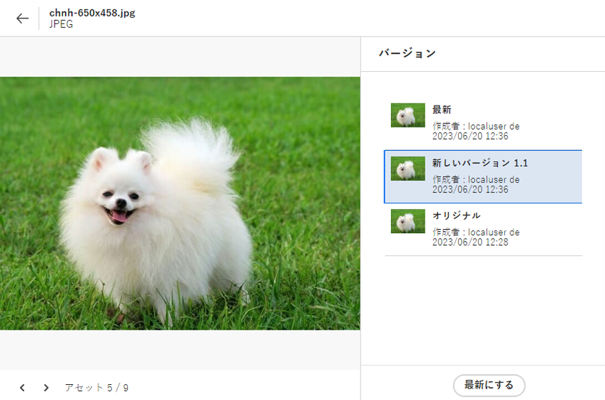

# アセットの管理 {#manage-assets}

| [検索のベストプラクティス](/help/assets/search-best-practices.md) | [メタデータのベストプラクティス](/help/assets/metadata-best-practices.md) | [コンテンツハブ](/help/assets/product-overview.md) | [OpenAPI 機能を備えた Dynamic Media](/help/assets/dynamic-media-open-apis-overview.md) | [AEM Assets 開発者向けドキュメント](https://developer.adobe.com/experience-cloud/experience-manager-apis/) |
| ------------- | --------------------------- |---------|----|-----|

[!DNL Assets view] の操作しやすいインターフェイスを使用して、様々なデジタルアセット管理（DAM）タスクを簡単に実行できます。 アセットを追加した後は、アセットの検索、ダウンロード、移動、コピー、名前変更、削除、更新および編集を行うことができます。

[!DNL Assets view] を使用すると、次のアセット管理タスクを実行できます。 アセットを選択すると、上部のツールバーに次のオプションが表示されます。

*図：選択した画像に対してツールバーで使用できるオプション*

*  選択を解除します。

*  Assets UI で、メタデータとスマートタグに基づいて類似の画像アセットを検索します。

*  アセットをプレビューし、詳細なメタデータを表示します。 プレビュー時に、バージョンを表示して画像を編集できます。

*  選択したアセットをローカルファイルシステムにダウンロードします。

*  選択したアセットをコレクションに追加します。

*  アセットをピン留めすると、後で必要になった際に、すばやくアクセスできるようになります。 ピン留めしたすべての項目は、マイワークスペースの「**クイックアクセス**」セクションに表示されます。

*  Adobe Experience Manager Assets 内に統合された Adobe Express で画像を編集します。

*  Adobe Express を使用して画像を編集します。

*  他のユーザーとアセットのリンクを共有して、アセットにアクセスしてダウンロードできるようにします。

*  選択したアセットまたはフォルダーを削除します。

*  選択したファイルまたはフォルダーをコピーします。

*  選択したアセットまたはフォルダーをリポジトリ階層内の別の場所に移動します。

*  選択したアセットまたはフォルダーの名前を変更します。 一意の名前を使用しないと、名前を変更しても警告が表示されて失敗します。 その場合は、新しい名前でもう一度やり直すことができます。
また、アセットまたはフォルダーのタイトルをクリックして名前を変更することもできます。 「**アセット名を変更**」テキストボックスに新しいテキストを入力し、「**保存**」をクリックします。 この機能は、グリッド、ギャラリー、ウォーターフォール、リストの各表示で利用できます。

*  [!UICONTROL ウォーターフォール表示]。

*  アセットをライブラリに追加します。

*  他のユーザーにタスクを割り当てて、アセットに関する作業を共同で行えるようにします。

*  アセットに対して実行される操作を監視します。

アセットのサムネールにも同じオプションが表示されます。

[!DNL Assets view] では、選択したアセットのタイプに応じた関連オプションのみツールバーに表示されます。

*図：選択したフォルダーに対してツールバーで使用できるオプション。*

*図：選択した PDF ファイルに対してツールバーで使用できるオプション。*

## アセットのダウンロードと配布 {#download}

1 つ以上のアセットまたはフォルダー、またはその両方を選択し、選択したものをローカルファイルシステムにダウンロードできます。 アセットを編集して再度アップロードするか、[!DNL Assets view] の外部にアセットを配布することができます。 また、アセットの[レンディションをダウンロード](/help/assets/add-delete-assets-view.md#renditions)することもできます。

## アセットのバージョン管理 {#versions-of-assets}

<!-- 
TBD: query for engineering: How many versions are maintained. What happens when we reach that limit? Are old versions automatically removed? -->

[!DNL Assets view] では、更新または編集されたアセットが再度アップロードされたとき、そのアセットのバージョンを管理します。 バージョン履歴や過去のバージョンを表示したり、必要に応じて過去のバージョンのアセットを最新のバージョンとして復元したりできます（後者の場合は、以前のバージョンに戻すことになります）。 アセットのバージョンは、次のシナリオで作成されます。

* 既存のアセットと同じファイル名を持つ新しいアセットを、既存のアセットと同じフォルダーにアップロードする。 [!DNL Assets view] では、前のアセットを上書きするか、新しいアセットをバージョンとして保存するかを確認するプロンプトを表示します。 [重複したアセットのアップロード](/help/assets/add-delete-assets-view.md)を参照してください。

  

  *図：既存のアセットと同じ名前のアセットをアップロードする場合、そのアセットのバージョンを作成できる。*

* 画像を編集し、「**[!UICONTROL バージョンとして保存]**」をクリックする。 [画像の編集](/help/assets/edit-images-assets-view.md)を参照してください。

  

  *図：編集した画像をバージョンとして保存する。*

* 既存のアセットのバージョンを開く。 「**[!UICONTROL 新しいバージョン]**」をクリックし、アセットの新しいバージョンをリポジトリにアップロードします。

  

### アセットのバージョンの表示 {#view-versions}

アセットの複製コピーや変更済みコピーをアップロードする際に、そのコピーのバージョンを作成できます。 バージョン管理を使用すると、過去のアセットをレビューしたり、必要に応じて以前のバージョンに戻したりすることができます。

バージョンを表示するには、アセットのプレビューを開き、右側のサイドバーで&#x200B;**[!UICONTROL バージョン]**&#x200B;アイコン（）をクリックします。 特定のバージョンをプレビューするには、目的のバージョンを選択します。 そのバージョンに戻すには、「**[!UICONTROL 最新にする]**」をクリックします。

バージョンタイムラインからバージョンを作成することもできます。 最新バージョンを選択し、「**[!UICONTROL 新しいバージョン]**」をクリックして、アセットの新しいコピーをローカルファイルシステムからアップロードします。

*図：アセットのバージョンを表示、以前のバージョンに戻す、または別の新しいバージョンをアップロード。*

## アセットステータスの管理 {#manage-asset-status}

**必要な権限：** `Can Edit`、`Owner` またはアセットに対する管理者権限。

アセットビューでは、リポジトリで使用可能なアセットのステータスを設定できます。デジタルアセットのダウンストリーム使用をより適切に制御および管理するためのアセットステータスを設定します。

アセットに対して次のステータスを設定できます。

* 承認済み

* 却下

* ステータスなし

### アセットステータスの設定 {#set-asset-status}

アセットのステータスを設定する手順は次のとおりです。

1. アセットを選択し、ツールバーの「**[!UICONTROL 詳細]**」をクリックします。

1. 「**[!UICONTROL 基本]**」タブで、**[!UICONTROL ステータス]**ドロップダウンリストからアセットのステータスを選択します。可能な値は、「承認済み」、「却下」、「ステータスなし」（デフォルト）です。
環境用に OpenAPI 機能を備えた Dynamic Media がプロビジョニングされている場合、アセットを `Approved` としてマークするとすぐに、Experience Manager Assets によって公開 URL が生成されます。

   >[!VIDEO](https://video.tv.adobe.com/v/342495)

### 承認ターゲットの設定 {#set-approval-target}

アセットビューでは、アセットの詳細ページの「**承認ターゲット**」フィールドに設定した値に基づいて、承認済みアセットを OpenAPI 機能を備えた Dynamic Media、コンテンツハブ、またはその両方に公開できます。

承認ターゲットを設定するには：

1. アセットを選択し、ツールバーの「**[!UICONTROL 詳細]**」をクリックします。

1. 「**[!UICONTROL 基本]**」タブで、**[!UICONTROL ステータス]**&#x200B;ドロップダウンリストからアセットのステータスを選択します。可能な値は、「承認済み」、「却下」、「ステータスなし」（デフォルト）です。

1. 手順 2 で「**承認済み**」を選択した場合は、承認ターゲットを選択します。可能な値には、配信とコンテンツハブが含まれます。

   * 「**配信**」は、ドロップダウンメニューで選択されるデフォルトのオプションであり、[OpenAPI を備えた Dynamic Media](/help/assets/dynamic-media-open-apis-overview.md) と[コンテンツハブ](/help/assets/product-overview.md)の両方に（Experience Manager Assets で両方が有効になっている場合）アセットを公開します。

   * 「**コンテンツハブ**」を選択すると、アセットはコンテンツハブにのみ公開されます。コンテンツハブは、Experience Manager Assets で有効になっている場合にのみオプションとして表示されます。

   * ドロップダウンリストからオプションを選択しない場合は、AEM as a Cloud Service 環境で有効になっているデフォルトのオプションがアセットに自動的に適用されます。

   使用できるオプションについて詳しくは、[承認済みアセットのデフォルトの承認ターゲットと公開先](#default-approval-target-options-publish-destinations)を参照してください。

   >[!NOTE]
   >
   >承認ターゲットの設定は、使用できる機能が制限されています。サポートチケットを作成して、有効または無効にすることができます。OpenAPI を備えた Dynamic Media が有効になっている場合は、デフォルトで有効になります。

   

1. 他のアセットプロパティを指定し、「**[!UICONTROL 保存]**」をクリックします。

その他の注意点を次に示します。

* デフォルトのメタデータフォームを使用しておらず、「**[!UICONTROL 承認ターゲット]**」フィールドを表示できない場合は、[メタデータフォームを編集](/help/assets/metadata-assets-view.md#metadata-forms)して、「**[!UICONTROL 承認対象]**」フィールドを使用できるコンポーネントからメタデータフォームにドラッグし、「**[!UICONTROL 保存]**」をクリックします。

* アセットビューを使用して承認ターゲットを `Content Hub` として選択すると、アセットは同じ組織に属するユーザーがコンテンツハブで使用できるようになります。

#### 承認済みアセットのデフォルトの承認ターゲットと公開先 {#default-approval-target-options-publish-destinations}

次の表に、AEM as a Cloud Service 環境での OpenAPI を備えた DM とコンテンツハブのイネーブルメントに基づいて、`Approval Target` ドロップダウンリストとデフォルトの承認ターゲットを表示する前提条件を示します。

| OpenAPI を備えた Dynamic Media | コンテンツハブ | 承認ターゲットドロップダウンリストが表示されますか？ | 承認済みアセットのデフォルトの承認ターゲット | 公開先 |
| --- | --- | --- | --- |---|
| 有効になっています | 有効になっています | はい | 配信 | OpenAPI を備えた Dynamic Media とコンテンツハブ |
| 有効になっていません | 有効になっています | はい | コンテンツハブ | コンテンツハブ |
| 有効になっています | 有効になっていません | はい | 配信 | OpenAPI を備えた Dynamic Media |
| 有効になっていません | 有効になっていません | いいえ | 該当なし | 該当なし |

### アセットの有効期限を設定 {#set-asset-expiration-date}

また、アセットビューでは、リポジトリで使用可能なアセットの有効期限を設定することもできます。その後、アセットの `Expired` ステータスに基づいて[検索結果をフィルタリング](search-assets-view.md#refine-search-results)できます。 また、アセットの有効期限の日付範囲を指定して、検索結果をさらにフィルタリングすることもできます。

アセットの有効期限を設定するには：

1. アセットを選択し、ツールバーの「**[!UICONTROL 詳細]**」をクリックします。

1. 「**[!UICONTROL 基本]** 」タブで、「**[!UICONTROL 有効期限]**」フィールドを使用しているアセットの有効期限を設定します。

`Expired` アセットカードインジケーターが、アセットに設定された `Approved` または `Rejected` インジケーターを上書きします。

アセットのステータスに基づいてアセットをフィルタリングすることもできます。詳しくは、[アセットビューでのアセットの検索](search-assets-view.md)を参照してください。

## アセットステータスフィールドを含めるためのメタデータフォームのカスタマイズ {#customize-asset-status-metadata-form}

**必要な権限：**&#x200B;管理者

アセットビューには、多数の標準メタデータフィールドがデフォルトで用意されています。組織には、追加のメタデータニーズがあり、ビジネス固有のメタデータを追加するために、さらに多くのメタデータフィールドが必要です。 メタデータフォームを使用すると、ビジネスごとにアセットの[!UICONTROL 詳細]ページにカスタムメタデータフィールドを追加できます。 ビジネス固有のメタデータにより、アセットのガバナンスと検出が向上します。

メタデータフォームにメタデータフィールドを追加する方法について詳しくは、[メタデータフォーム](metadata-assets-view.md#metadata-forms)を参照してください。

**アセットステータスメタデータフィールドのフォームへの追加**

アセットステータスメタデータフィールドをフォームに追加するには、左側のパネルから、**[!UICONTROL アセットステータス]**&#x200B;コンポーネントをドラッグします。 マッピングプロパティは自動的に事前入力されます。 フォームを保存して、変更を確定します。

**アセットステータスメタデータフィールドのフォームへの追加**

アセットステータスメタデータフィールドをフォームに追加するには、左側のパネルから、**[!UICONTROL 日付]**&#x200B;コンポーネントをフォームにドラッグします。 **有効期限**&#x200B;をラベル、`pur:expirationDate` をマッピングプロパティとして指定します。 フォームを保存して、変更を確定します。

## 次の手順 {#next-steps}

* [ビデオを視聴してアセットビューでのアセットの管理を学ぶ](https://experienceleague.adobe.com/ja/docs/experience-manager-learn/assets-essentials/basics/managing)

* アセットビューのユーザーインターフェイスの「[!UICONTROL フィードバック]」オプションを使用して製品に関するフィードバックを提供する

* 右側のサイドバーにある「[!UICONTROL このページを編集]」（）または「[!UICONTROL 問題を記録] 」（）を使用してドキュメントに関するフィードバックを提供する

* [カスタマーケア](https://experienceleague.adobe.com/ja?support-solution=General#support)に問い合わせる

