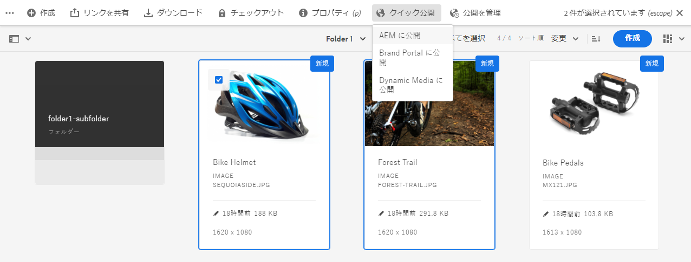

# Experience Manager Assets での公開の管理 {#manage-publication-in-aem}

[!DNL Adobe Experience Manager Assets] 管理者は、アセットやアセットを含んだフォルダーをオーサーインスタンスから [!DNL Experience Manager Assets]、[!DNL Dynamic Media] および [!DNL Brand Portal] に公開できます。また、アセットやフォルダーを後の日時に公開するようにスケジューリングすることもできます。公開すると、ユーザーはアセットにアクセスでき、さらに他のユーザーにアセットを配布できます。デフォルトでは、アセットやフォルダーを [!DNL Experience Manager Assets] に公開できます。ただし、[!DNL Experience Manager Assets] を設定して [[!DNL Dynamic Media]](https://experienceleague.adobe.com/docs/experience-manager-cloud-service/content/assets/dynamicmedia/config-dm.html?lang=ja) と [[!DNL Brand Portal]](https://experienceleague.adobe.com/docs/experience-manager-cloud-service/content/assets/brand-portal/configure-aem-assets-with-brand-portal.html?lang=ja) への公開を有効にすることができます。

[!DNL Experience Manager Assets] インターフェイスで使用できる「**[!UICONTROL クイック公開]**」または「**[!UICONTROL 公開を管理]**」オプションを使用して、アセットレベルまたはフォルダーレベルでアセットを公開または非公開にすることができます。その後、[!DNL Experience Manager Assets] で元のアセットやフォルダーに変更を加えても、その変更は、[!DNL Experience Manager Assets] から再公開するまでパブリッシュインスタンスには反映されません。これにより、処理中の変更はパブリッシュインスタンスでは使用できなくなります。管理者が公開した承認済みの変更のみがパブリッシュインスタンスで提供されます。

* [「クイック公開」を使用したアセットの公開](#quick-publish)
* [「公開を管理」を使用したアセットの公開](#manage-publication)
* [後からのアセットの公開](#publish-assets-later)
* [Dynamic Media へのアセットの公開](#publish-assets-to-dynamic-media)
* [Brand Portal へのアセットの公開](#publish-assets-to-brand-portal)
* [公開をリクエスト](#request-publication)
* [制限事項とヒント](#limitations-and-tips)

## 「クイック公開」を使用したアセットの公開 {#quick-publish}

「クイック公開」を使用すると、選択した宛先にコンテンツを直ちに公開できます。[!DNL Experience Manager Assets] コンソールで、親フォルダーに移動し、公開するアセットまたはフォルダーをすべて選択します。ツールバーの「**[!UICONTROL クイック公開]**」オプションをクリックし、アセットの公開先をドロップダウンリストから選択します。

## 「公開を管理」を使用したアセットの公開 {#manage-publication}

「公開を管理」では、選択した宛先間でのコンテンツの公開または非公開、DAM リポジトリ全体から公開リストに[コンテンツの追加](#add-content)、[フォルダー設定を含めて](#include-folder-settings)選択したフォルダーのコンテンツを公開およびフィルターの適用、後の日時に[公開のスケジュール](#publish-assets-later)を行うことできます。

[!DNL Experience Manager Assets] コンソールで、親フォルダーに移動し、公開するアセットまたはフォルダーをすべて選択します。ツールバーの「**[!UICONTROL 公開を管理]**」オプションをクリックします。[!DNL Experience Manager Assets] インスタンスに [!DNL Dynamic Media] や [!DNL Brand Portal] が設定されていない場合は、アセットやフォルダーを [!DNL Experience Manager Assets] にのみ公開できます。

[!UICONTROL 公開を管理]インターフェイスでは次のオプションが使用可能です。

* [!UICONTROL アクション]
   * `Publish`：選択した宛先にアセットやフォルダーを公開します
   * `Unpublish`：宛先からアセットやフォルダーを非公開にします

* [!UICONTROL 宛先]
   * `Publish`：アセットやフォルダーを [!DNL Experience Manager Assets]（`AEM`）に公開します
   * `Dynamic Media`：アセットを [!DNL Dynamic Media] に公開します
   * `Brand Portal`：アセットやフォルダーを [!DNL Brand Portal] に公開します

* [!UICONTROL スケジュール設定]
   * `Now`：アセットを直ちに公開します
   * `Later`：アセットを `Activation` 日時に基づいて公開します

続行するには、「**[!UICONTROL 次へ]**」をクリックします。選択した項目に応じて、「**[!UICONTROL 範囲]**」タブには異なるオプションが表示されます。「**[!UICONTROL コンテンツを追加]**」および「**[!UICONTROL フォルダー設定を含む]**」オプションは、アセットやフォルダーを [!DNL Experience Manager Assets] に公開する場合（`Destination: Publish`）にのみ使用できます。

### コンテンツの追加 {#add-content}

[!DNL Experience Manager Assets] に公開する場合は、公開リストにさらにコンテンツ（アセットやフォルダー）を追加できます。DAM リポジトリ全体からリストにアセットやフォルダーをさらに追加できます。コンテンツをさらに追加するには、「**[!UICONTROL コンテンツを追加]**」ボタンをクリックします。

フォルダーから複数のアセットを一度に追加したり、複数のフォルダーを一度に追加したりできます。しかし、複数のフォルダーからアセットを一度に追加することはできません。

### フォルダー設定を含む {#include-folder-settings}

デフォルトでは、[!DNL Experience Manager Assets] にフォルダーを公開すると、その中のすべてのアセット、サブフォルダーおよびそれらの参照が公開されます。

公開するフォルダー内容をフィルタリングする場合は、「**[!UICONTROL フォルダー設定を含む]**」をクリックします。

* `Include folder contents`

   * 有効：選択したフォルダーのすべてのアセット、サブフォルダー（サブフォルダーのすべてのアセットを含む）および参照が公開されます。
   * 無効：選択したフォルダー（空）と参照のみ公開されます。選択したフォルダーのアセットは公開されません。

* `Include folder contents` および `Include only immediate folder contents`

  両方のオプションを選択した場合は、選択したフォルダーのすべてのアセット、サブフォルダー（空）および参照が公開されます。サブフォルダーのアセットは公開されません。

<!--
* [!UICONTROL Include only immediate folder contents]: Only the subfolders content and references are published. 

Only the selected folder content and references are published.
-->

フィルターの適用後、「**[!UICONTROL OK]**」をクリックしてから「**[!UICONTROL 公開]**」をクリックします。「公開」ボタンをクリックすると、「`Resource(s) have been scheduled for publication`」という確認メッセージが表示されます。確認後、定義した宛先に、スケジュール（「`Now`」または「`Later`」）に基づいて、選択したアセットやフォルダーが公開されます。使用しているパブリッシュインスタンスにログインして、アセットやフォルダーが正常に公開されていることを確かめます。

上図で、「**[!UICONTROL 公開ターゲット]**」属性の値が異なることがわかります。[!DNL Experience Manager Assets] への公開（`Destination: Publish`）を選択したことを思い出してください。表示では、フォルダーと 1 つのアセットのみ `AEM` に公開され、他の 2 つのアセットは `AEM` と `Dynamic Media` の両方に公開されますが、これはなぜでしょうか。

ここで、フォルダープロパティの役割を理解しておく必要があります。フォルダーの **[!UICONTROL Dynamic Media パブリッシングモード]**&#x200B;プロパティは、公開において重要な役割を果たします。フォルダーのプロパティを表示するには、フォルダーを選択し、ツールバーの「**[!UICONTROL プロパティ]**」をクリックします。アセットの場合は、アセットの親フォルダーのプロパティを参照します。

定義されている&#x200B;**[!UICONTROL 宛先]**&#x200B;と **[!UICONTROL Dynamic Media 公開モード]**&#x200B;に応じて公開がどのように行われるかを次の表に示します。

| [!UICONTROL 宛先] | [!UICONTROL Dynamic Media 公開モード] | [!UICONTROL 公開ターゲット] | 公開できる内容 |
| --- | --- | --- | --- |
| 公開 | 選択的公開 | `AEM` | アセットやフォルダー |
| 公開 | 即時 | `AEM` および `Dynamic Media` | アセットやフォルダー |
| 公開 | アクティベーション時 | `AEM` および `Dynamic Media` | アセットやフォルダー |
| Dynamic Media | 選択的公開 | `Dynamic Media` | アセット |
| Dynamic Media | 即時 | `None` | アセットを公開できない |
| Dynamic Media | アクティベーション時 | `None` | アセットを公開できない |

>[!NOTE]
>
>[!DNL Dynamic Media] にはアセットのみ公開されます。
>
>[!DNL Dynamic Media] へのフォルダーの公開はサポートされていません。
>
>フォルダー（`Selective Publish`）を選択し、公開先として [!DNL Dynamic Media] を選んだ場合、「[!UICONTROL 公開ターゲット]」属性には `None` が表示されます。

次に、上記のユースケースで&#x200B;**[!UICONTROL 宛先]**&#x200B;を **[!UICONTROL Dynamic Media]** に変更して、結果を確かめてみましょう。この場合は、`Selective Publish` フォルダーのアセットのみ [!DNL Dynamic Media].に公開されます。`Immediate` および `Upon Activation` フォルダーのアセットは公開されず、前述の属性には `None` が表示されます。

>[!NOTE]
>
>[!DNL Experience Manager Assets] インスタンスで [!DNL Dynamic Media] が設定されておらず、「**[!UICONTROL 宛先]**」が「**[!UICONTROL 公開]**」の場合、アセットやフォルダーは常に `AEM` に公開されます。
>
>[!DNL Brand Portal] への公開はフォルダープロパティとは無関係です。Brand Portal には、すべてのアセット、フォルダーおよびコレクションを公開できます。[Brand Portal へのアセットの公開](#publish-assets-to-brand-portal)を参照してください。

>[!NOTE]
>
>[!DNL Manage Publication] ウィザードをカスタマイズしてある場合、カスタマイズ部分は既存の機能で引き続き動作します。
>
>ただし、既存のカスタマイズ部分を削除して、新しい [!DNL Manager Publication] 機能を使用することができます。

## 後からのアセットの公開 {#publish-assets-later}

アセットの公開ワークフローを後の日時にスケジューリングするには：

1. [!UICONTROL Experience Manager Assets] コンソールで、親フォルダーに移動し、公開スケジュールを設定するアセットまたはフォルダーをすべて選択します。
1. ツールバーの「**[!UICONTROL 公開を管理]**」オプションをクリックします。
1. 「**[!UICONTROL アクション]**」の「**[!UICONTROL 公開]**」をクリックしたあと、コンテンツを公開するル「**[!UICONTROL 宛先]**」を選択します。
1. 「**[!UICONTROL スケジュール]**」から「**[!UICONTROL 後で]**」を選択します。
1. 「**[!UICONTROL アクティベート日]**」を選択し、日時を指定します。「**[!UICONTROL 次へ]**」をクリックします。

   

1. 「**[!UICONTROL 範囲]**」タブで、「**[!UICONTROL コンテンツを追加]**」をクリックします（必要な場合）。「**[!UICONTROL 次へ]**」をクリックします。
1. 「**[!UICONTROL ワークフロー]**」タブで、ワークフロータイトルを指定します。「**[!UICONTROL 後で公開する]**」をクリックします。

   

   公開先のインスタンスにログインして、公開されたアセットを確認します（スケジュールを設定した日時によって異なります）。

## Dynamic Media へのアセットの公開 {#publish-assets-to-dynamic-media}

[!DNL Dynamic Media] にはアセットのみ公開されます。ただし、公開動作はフォルダープロパティによって異なります。フォルダーの **[!UICONTROL Dynamic Media 公開モード]**&#x200B;を選択的公開向けに設定することができます。設定できるのは次のいずれかです。

* `Selective Publish`
* `Immediate`
* `Upon Activation`

公開プロセスは、「**[!UICONTROL 即時]**」および「**[!UICONTROL アクティベーション時]**」モードの場合は一致していますが、「**[!UICONTROL 選択的公開]**」の場合は異なります。詳しくは、[Dynamic Media のフォルダーレベルでの選択的公開の設定](https://experienceleague.adobe.com/docs/experience-manager-cloud-service/content/assets/dynamicmedia/selective-publishing.html?lang=ja)を参照してください。フォルダーで選択的公開を設定した後、次の操作を行うことができます。

* [「公開を管理」を使用した、Dynamic Media または Experience Manager へのアセットの選択的公開](https://experienceleague.adobe.com/docs/experience-manager-cloud-service/content/assets/dynamicmedia/selective-publishing.html?lang=ja#selective-publish-manage-publication)
* [「公開を管理」を使用した、Dynamic Media または Experience Manager からのアセットの選択的非公開 ](https://experienceleague.adobe.com/docs/experience-manager-cloud-service/content/assets/dynamicmedia/selective-publishing.html?lang=ja#selective-unpublish-manage-publication)
* [「クイック公開」を使用した、Dynamic Media または Experience Manager へのアセットの公開](https://experienceleague.adobe.com/docs/experience-manager-cloud-service/content/assets/dynamicmedia/selective-publishing.html?lang=ja#quick-publish-aem-dm)
* [検索結果を使用して、アセットを選択的に公開または非公開にする](https://experienceleague.adobe.com/docs/experience-manager-cloud-service/content/assets/dynamicmedia/selective-publishing.html?lang=ja#selective-publish-unpublish-search-results)

## Brand Portal へのアセットの公開 {#publish-assets-to-brand-portal}

アセット、フォルダーおよびコレクションを [!DNL Experience Manager Assets Brand Portal] インスタンスに公開できます。

* [Brand Portal へのアセットの公開](https://experienceleague.adobe.com/docs/experience-manager-cloud-service/content/assets/brand-portal/publish-to-brand-portal.html?lang=ja#publish-assets-to-bp)
* [Brand Portal へのフォルダーの公開](https://experienceleague.adobe.com/docs/experience-manager-cloud-service/content/assets/brand-portal/publish-to-brand-portal.html?lang=ja#publish-folders-to-brand-portal)
* [Brand Portal へのコレクションの公開](https://experienceleague.adobe.com/docs/experience-manager-cloud-service/content/assets/brand-portal/publish-to-brand-portal.html?lang=ja#publish-collections-to-brand-portal)

## 公開をリクエスト {#request-publication}

`Request Publication` オプションは、[!DNL AEM] Assets 環境で公開する前に、アセットのワークフローを認証する際に役立ちます。[!DNL AEM] は、様々なユーザーに異なるレベルの権限を提供します。アセットをアップロードする&#x200B;*投稿者*&#x200B;になることもできますが、アップロードが確認されるまでアセットを公開できません。また、*管理者*&#x200B;であれば、アセットの読み取りワークフローと書き込みワークフローを管理できます。

「公開をリクエスト」オプションは、次のユーザーが使用できます。

* **投稿者：**[!DNL AEM] Assets に投稿できるユーザーの場合、[!DNL AEM] Assets ワークフローへのアクセスが制限されています。「`Manage publication`」ボタンが非表示になっています。投稿者は、アセットを追加することによって投稿のみできますが、アセットを公開したり、ワークフローへの読み取りアクセス権を持つことはできません。

* **ワークフローユーザー：**&#x200B;このユーザーはアセットを公開できませんが、ワークフローに対する読み取りアクセス権があります。ワークフローユーザーは、次の操作を実行できます。
   * 公開をリクエスト
   * 「`Manage publication`」ボタンを表示
   * ワークフローのスケジュールを設定し、オプション `schedule now` と `schedule later` を確認

* **管理者：**&#x200B;管理者タイプのユーザーは、アセットの全体的なワークフローステップを管理できます。「`Manage publication`」ボタンが表示されます。宛先 `publish` が選択されている場合、後でアセットをワークフローステップ用にスケジュールできます。

>[!NOTE]
>
>[!DNL Dynamic Media] が宛先として選択されている場合、**ワークフローユーザー**&#x200B;および&#x200B;**管理者**&#x200B;ユーザーではワークフローステップは無効になります。
>

## 制限事項とヒント {#limitations-and-tips}

* `Manage publication` は、ワークフローに対して少なくとも読み取り権限を持つユーザーが使用できます。
* 空のフォルダーは公開されません。
* 処理中のアセットを公開した場合は、オリジナルのコンテンツのみが公開されます。処理中のレンディションは失われます。処理が完了するまで待ってから公開するか、処理の完了後にアセットを公開し直してください。
* 複雑なアセットを非公開にする場合は、アセットだけを非公開にします。参照は他の公開済みアセットから参照されている可能性があるので、非公開にしないでください。
