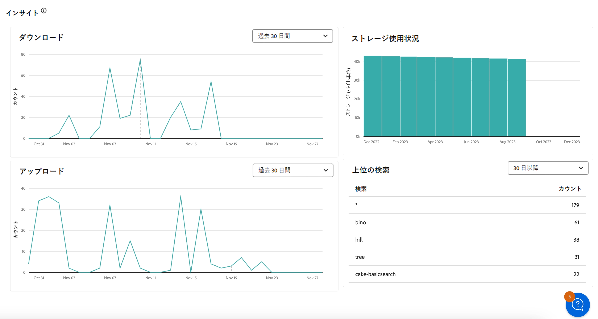
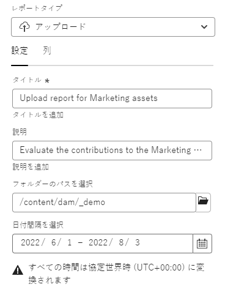

# レポートの管理 {#manage-reports}

>[!CONTEXTUALHELP]
>id="assets_reports"
>title="レポート"
>abstract="アセットレポートを使用すると、管理者は Adobe Experience Manager Assets 表示環境のアクティビティを視覚的に確認できます。このデータは、ユーザーがコンテンツや製品とどのようにやり取りするかについての有用な情報を提供します。管理者製品プロファイルに割り当てられているユーザーはすべて、インサイトダッシュボードにアクセスしたり、ユーザー定義のレポートを作成したりできます。"

アセットレポートを使用すると、管理者は Adobe Experience Manager Assets 表示環境のアクティビティを視覚的に確認できます。このデータは、ユーザーがコンテンツや製品とどのようにやり取りするかについての有用な情報を提供します。

## レポートへのアクセス {#access-reports}

アセットビューの管理者の製品プロファイルに割り当てられているユーザーはすべて、アセットビューでインサイトダッシュボードにアクセスしたり、ユーザー定義のレポートを作成したりできます。

## インサイトの表示 {#view-live-statistics}

アセットビューを使用すると、アセットビュー環境のリアルタイムデータをインサイトダッシュボードで表示できます。過去 30 日間または過去 12 か月間のリアルタイムイベント指標を表示できます。

<!---->

左側のナビゲーションパネルにある「**[!UICONTROL インサイト]**」をクリックすると、自動生成された以下のグラフを表示できます。

* **ダウンロード**：過去 30 日間または 12 か月間にアセットビュー環境からダウンロードされたアセットの数が、折れ線グラフで表されます。

* **アップロード**：過去 30 日間または 12 か月間にアセットビュー環境にアップロードされたアセットの数が、折れ線グラフで表されます。

<!--* **Asset Count by Size**: The division of count of assets based on their range of various sizes from 0 MB to 100 GB.-->

* **ストレージ使用量**：棒グラフで表される Assets ビュー環境のストレージ使用量（バイト単位）。

<!--* **Delivery**: The graph depicts the count of assets as the delivery dates.-->

<!--* **Asset Count by Asset Type**: Represents count of various MIME types of the available assets. For example, application/zip, image/png, video/mp4, application/postscripte.-->

* **上位の検索**：過去 30 日間または 12 ヶ月間にアセットビュー環境で検索された上位の検索用語と共に検索回数が、表形式で表されます。

<!--

* **Storage usage**: The storage usage, in gigabytes (GB), for the Assets view environment, for the last 30 days or 12 months represented using a bar chart.

-->

## ダウンロードレポートの作成 {#create-download-report}

ダウンロードレポートを作成するには：

1. **[!UICONTROL 設定]**／**[!UICONTROL レポート]**&#x200B;に移動して、「**[!UICONTROL レポートを作成]**」をクリックします。

1. 「[!UICONTROL 設定]」タブで、レポートタイプを&#x200B;**[!UICONTROL ダウンロード]**&#x200B;に指定します。

1. レポートのタイトルとオプションの説明を指定します。

1. 「**[!UICONTROL フォルダーパスを選択]**」フィールドを使用して、レポートを実行するアセットを含むフォルダーパスを選択します。

1. レポートの日付間隔を選択します。

   >[!NOTE]
   >
   > アセットビューは、すべてのローカルタイムゾーンを協定世界時（UTC）に変換します。

1. 「[!UICONTROL 列]」タブで、レポートに表示する列名を選択します。

1. 「**[!UICONTROL 作成]**」をクリックします。

   

次の表に、レポートに追加できるすべての列の使用方法を示します。

<table>
    <tbody>
     <tr>
      <th><strong>列名</strong></th>
      <th><strong>説明</strong></th>
     </tr>
     <tr>
      <td>タイトル</td>
      <td>アセットのタイトル。</td>
     </tr>
     <tr>
      <td>パス </td>
      <td>アセットビューでアセットを使用できるフォルダーパス。</td>
     </tr>
     <tr>
      <td>MIME タイプ</td>
      <td>アセットの MIME タイプ。</td>
     </tr>
     <tr>
      <td>サイズ</td>
      <td>アセットのサイズ（バイト単位）。</td>
     </tr>
     <tr>
      <td>ダウンロードしたユーザー</td>
      <td>アセットをダウンロードしたユーザーのメール ID。</td>
     </tr>
     <tr>
      <td>ダウンロード日</td>
      <td>アセットのダウンロードアクションが実行された日付。</td>
     </tr>
     <tr>
      <td>作成者</td>
      <td>アセットの作成者。</td>
     </tr>
     <tr>
      <td>作成日時</td>
      <td>アセットがアセットビューにアップロードされた日付。</td>
     </tr>
     <tr>
      <td>変更日</td>
      <td>アセットの最終変更日付。</td>
     </tr>
     <tr>
      <td>期限切れ</td>
      <td>アセットの有効期限切れステータス。</td>
     </tr>
     <tr>
      <td>ユーザー名によりダウンロード</td>
      <td>アセットをダウンロードしたユーザーの名前。</td>
     </tr>           
    </tbody>
   </table>

## アップロードレポートの作成 {#create-upload-report}

アップロードレポートを作成するには：

1. **[!UICONTROL 設定]**／**[!UICONTROL レポート]**&#x200B;に移動して、「**[!UICONTROL レポートを作成]**」をクリックします。

1. 「[!UICONTROL 設定]」タブで、レポートタイプを&#x200B;**[!UICONTROL アップロード]**&#x200B;として指定します。

1. レポートのタイトルとオプションの説明を指定します。

1. 「**[!UICONTROL フォルダーパスを選択]**」フィールドを使用して、レポートを実行するアセットを含むフォルダーパスを選択します。

1. レポートの日付間隔を選択します。

1. 「[!UICONTROL 列]」タブで、レポートに表示する列名を選択します。

1. 「**[!UICONTROL 作成]**」をクリックします。

   

次の表に、レポートに追加できるすべての列の使用方法を示します。

<table>
    <tbody>
     <tr>
      <th><strong>列名</strong></th>
      <th><strong>説明</strong></th>
     </tr>
     <tr>
      <td>タイトル</td>
      <td>アセットのタイトル。</td>
     </tr>
     <tr>
      <td>パス </td>
      <td>アセットビューでアセットを使用できるフォルダーパス。</td>
     </tr>
     <tr>
      <td>MIME タイプ</td>
      <td>アセットの MIME タイプ。</td>
     </tr>
     <tr>
      <td>サイズ</td>
      <td>アセットのサイズ。</td>
     </tr>
     <tr>
      <td>作成者</td>
      <td>アセットの作成者。</td>
     </tr>
     <tr>
      <td>作成日時</td>
      <td>アセットがアセットビューにアップロードされた日付。</td>
     </tr>
     <tr>
      <td>変更日</td>
      <td>アセットの最終変更日付。</td>
     </tr>
     <tr>
      <td>期限切れ</td>
      <td>アセットの有効期限切れステータス。</td>
     </tr>              
    </tbody>
   </table>

## 既存のレポートの表示 {#view-report-list}

[レポートを作成](#create-download-report)した後、既存のレポートのリストを表示して、CSV 形式でダウンロードしたり削除したりできます。

レポートのリストを表示するには、**[!UICONTROL 設定]**／**[!UICONTROL レポート]**&#x200B;に移動します。

各レポートには、レポートのタイトル、レポートのタイプ、レポートの作成時に指定した説明、レポートのステータス、レポートの作成者のメール ID、レポートの作成日が表示されます。

レポートの `Completed ` ステータスは、レポートのダウンロード準備ができたことを表します。

## CSV レポートのダウンロード {#download-csv-report}

レポートを CSV 形式でダウンロードするには：

1. **[!UICONTROL 設定]**／**[!UICONTROL レポート]**&#x200B;に移動します。

1. レポートを選択し、「**[!UICONTROL CSV をダウンロード]**」をクリックします。

選択したレポートが CSV 形式でダウンロードされます。CSV レポートに表示される列は、[レポートの作成](#create-download-report)時に選択する列に依存します。

## レポートの削除 {#delete-report}

レポートを削除するには：

1. **[!UICONTROL 設定]**／**[!UICONTROL レポート]**&#x200B;に移動します。

1. レポートを選択し、「**[!UICONTROL 削除]**」をクリックします。

1. もう一度「**[!UICONTROL 削除]**」をクリックして確認します。
