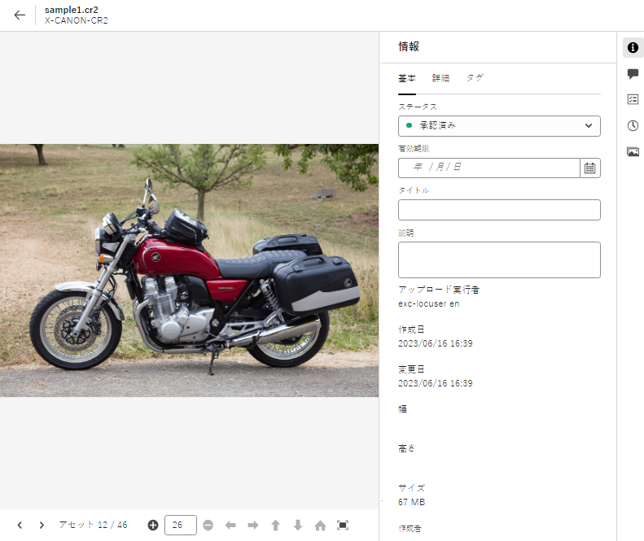

# アセット表示のメタデータ {#metadata}

メタデータとは、データに関するデータまたは説明のことです。例えば、アセットとしての画像には、撮影されたカメラに関する情報や著作権情報などを含めることができます。こうした情報が画像のメタデータです。メタデータは、効率的なアセット管理を行うために重要です。メタデータは、対象のアセットに使用できるすべてのデータのコレクションですが、必ずしもそのアセットに含まれているとは限りません。

メタデータは、アセットをより細かく分類するのに役立ち、デジタル情報量が多くなるにつれてさらに有用になります。数百個のファイルをファイル名、サムネールおよびメモリだけに基づいて管理することは可能です。ただし、このアプローチは拡張性に欠けます。関係者の数や管理するアセットの数が増えると、十分な管理ができなくなります。

メタデータを追加すると、以下の理由からデジタルアセットの価値が大きくなります。

* アクセスが容易になる - システムやユーザーが簡単に見つけることができます。
* 管理しやすくなる - 一連の同じプロパティを持つアセットを容易に検索し、これらのアセットに変更を適用できます。
* 完全 - アセットは、より多くの情報とコンテキスト、より多くのメタデータを保持します。

このような理由から、Assets ではデジタルアセットのメタデータの作成、管理および交換を行う適切な手段を提供します。

## メタデータの表示 {#view-metadata}

アセットのメタデータを表示するには、目的のアセットを参照するか検索し、アセットを選択して、ツールバーの「**[!UICONTROL 詳細]**」をクリックします。

*図：アセットとそのメタデータを表示するには、**[!UICONTROL 詳細]**ツールバーから、またはアセットをダブルクリックします。*

タイトル、説明、アップロード日などの基本的なメタデータは、「[!UICONTROL 基本]」タブに表示されます。「[!UICONTROL 詳細]」タブには、カメラのモデル、レンズの詳細、ジオタグなど、より詳細なメタデータが表示されます。「[!UICONTROL タグ]」タブには、画像の内容に基づいて自動的に適用されたタグが表示されます。

## メタデータを更新 {#update-metadata}

管理者がメタデータフォームを設定すると、他のフィールドを手動で更新できます。 標準搭載のメタデータフォームに基づいてのみ読み取るので、この値を変更できます。

## スマートタグ {#smart-tags}

[!DNL Experience Manager Assets] では、[Adobe Sensei](https://www.adobe.com/jp/sensei.html) の人工知能機能を使用して、アップロードされたすべてのアセットに適切なタグを自動的に適用します。スマートタグと呼ばれるこれらのタグは、関連性の高いアセットをすばやく見つけるうえで役に立つので、プロジェクトのコンテンツベロシティ（コンテンツ創出の速度）が向上します。スマートタグは、画像に含まれないメタデータの例です。

スマートタグは、ほぼリアルタイムで適用され、画像の内容に基づいて生成されます。アセットをアップロードすると、ユーザーインターフェイスでアセットのサムネールに[!UICONTROL 処理中]としばらく表示されます。処理が完了したら、スマートタグと[メタデータを表示](#view-metadata)できます。

*図：アセットのスマートタグを表示するには、**[!UICONTROL 詳細]**ツールバーから、またはアセットをダブルクリックします。*

スマートタグには、信頼性スコア（パーセント）も含まれます。これは、適用されたタグに伴う信頼性を示します。自動的に適用されたスマートタグをモデレートできます。

## キーワードを追加または更新 {#manually-tag}

[!DNL Adobe Sensei] スマートサービスを使用して自動的に追加されるスマートタグに加えて、アセットにさらにタグを追加できます。アセットをプレビュー用に開き、「[!UICONTROL タグ]」をクリックして、「[!UICONTROL キーワード]」フィールドに目的のキーワードを入力します。タグを追加するには、Return キーを押します。[!DNL Assets view] により、ほぼリアルタイムでキーワードのインデックスが作成されるので、チームは新しいキーワードを使用して更新済みのアセットをすぐに検索できます。

アップロードされたすべてのアセットに [!DNL Assets view] で自動的に追加されたタグを、「[!UICONTROL スマートタグ]」セクションから削除することもできます。

## 分類管理 {#taxonomy-management}

また、タグを階層にネストして、カテゴリやサブカテゴリなどの関係をサポートすることもできます。 階層タグを挿入する必要がある場合は、管理者が、 [!UICONTROL 分類管理] セクション [!UICONTROL 設定]. すべてのユーザーがコンテンツを記述する際に使用できる名前空間とタグの集まりを、管理されるように作成できます。 タグ階層を [!UICONTROL 分類マネージャ] 値が一貫して制御され、使用されていることを確認する。

## メタデータフォームの設定 {#metadata-forms}

>[!CONTEXTUALHELP]
>id="assets_metadata_forms"
>title="メタデータフォーム"
>abstract="[!DNL Experience Manager Assets] には、多数の標準メタデータフィールドがデフォルトで用意されています。組織には、メタデータに対するさらなるニーズがあり、ビジネス固有のメタデータを追加するために、さらに多くのメタデータフィールドが必要です。メタデータフォームを使用すると、ビジネスごとにアセットの詳細ページにカスタムメタデータフィールドを追加できます。ビジネス固有のメタデータにより、アセットのガバナンスと検出が向上します。"

アセットビューには、デフォルトで多数の標準メタデータフィールドが用意されています。 組織には、追加のメタデータニーズがあり、ビジネス固有のメタデータを追加するために、さらに多くのメタデータフィールドが必要です。メタデータフォームを使用すると、ビジネスごとにアセットの[!UICONTROL 詳細]ページにカスタムメタデータフィールドを追加できます。ビジネス固有のメタデータにより、アセットのガバナンスと検出が向上します。フォームは、ゼロから作成することも、既存のフォームを再利用することもできます。

各種アセット（様々な MIME タイプ）のメタデータフォームを設定できます。ファイルの MIME タイプと同じフォーム名を使用します。アセットビューでは、アップロードされたアセットの MIME タイプが自動的にフォーム名に一致し、フォームフィールドに基づいて、アップロードされたアセットのメタデータが更新されます。

例えば、`PDF` または `pdf` という名前のメタデータフォームが存在する場合、アップロードされた PDF ドキュメントには、そのフォームで定義されたメタデータフィールドが含まれています。

アセットビューでは、次の順序に従って既存のメタデータフォーム名を検索し、特定のタイプのアップロードされたアセットにメタデータフィールドを適用します。

MIME サブタイプ／MIME タイプ／`default` フォーム／標準フォーム

例えば、`PDF` または `pdf` という名前のメタデータフォームが存在する場合、アップロードされた PDF ドキュメントには、そのフォームで定義されたメタデータフィールドが含まれています。メタデータフォームが `PDF` または `pdf` が存在しない場合、名前のメタデータフォームがある場合、アセットビューは一致します `application`. 名前のメタデータフォームがある場合 `application`を指定すると、アップロードされたPDFドキュメントには、フォームで定義されたメタデータフィールドが含まれます。 一致するメタデータフォームが見つからない場合、 `default` フォームで定義されたメタデータフィールドをアップロードされたPDFドキュメントに適用するメタデータフォーム。 これらの手順がいずれも機能しない場合、Assets ビューでは、標準フォームで定義されたメタデータフィールドが、アップロードされたすべてのPDFドキュメントに適用されます。

>[!IMPORTANT]
>
>特定のファイルタイプの新しいメタデータフォームは、[!DNL Assets view] に用意されているデフォルトのメタデータフォームを完全に置き換えます。メタデータフォームを削除または名前変更すると、新しいアセットに対して、デフォルトのメタデータフィールドが再び使用可能になります。

メタデータフォームを作成するには、次の手順に従います。

1. 左側のパネルで、**[!UICONTROL 設定]**／**[!UICONTROL メタデータフォーム]**&#x200B;をクリックします。

   

1. ユーザーインターフェイスの右上にある「**[!UICONTROL 作成]**」をクリックします。
1. フォームの名前を指定し、「**[!UICONTROL 作成]**」をクリックします。
1. 右側の&#x200B;**[!UICONTROL 設定]**&#x200B;パネルでタブの名前を指定します。
1. 左側の&#x200B;**[!UICONTROL コンポーネント]**&#x200B;パネルから、必要なコンポーネントをフォームのタブにドラッグします。必要な順序でコンポーネントをドラッグします。

   

   *図：コンポーネントを追加するオプションとフォームをプレビューするオプションを備えたメタデータフォーム作成インターフェイス*

1. 各コンポーネントに、 **[!UICONTROL 設定]** 右側のレールで、サポートされているプロパティとのマッピングを提供します。
1. オプションで、コンポーネントに対して、「**[!UICONTROL 必須]**」を選択してメタデータフィールドを必須にしたり、「**[!UICONTROL 読み取り専用]**」を選択してアセットの[!UICONTROL 詳細]ページでフィールドを編集できないようにしたりします。
1. 必要に応じて、「**[!UICONTROL プレビュー]**」をクリックして、作成するフォームをプレビューします。
1. オプションで、タブと、各タブで必要なコンポーネントを追加します。
1. フォームが完成したら、「**[!UICONTROL 保存]**」をクリックします。

手順のシーケンスを表示するには、このビデオをご覧ください。

>[!VIDEO](https://video.tv.adobe.com/v/341275)

作成したフォームは、一致する MIME タイプのアセットをユーザーがアップロードすると自動的に適用されます。

既存のフォームを再利用して新しいフォームを作成するには、メタデータフォームを選択し、ツールバーの「**[!UICONTROL コピー]**」をクリックし、名前を指定して、「**[!UICONTROL 確認]**」をクリックします。メタデータフォームを編集して変更することができます。変更したフォームは、変更後にアップロードされたアセットに対して使用されます。既存のアセットは変更されません。

## プロパティコンポーネント {#property-components}

メタデータフォームは、次のプロパティコンポーネントのいずれかを使用してカスタマイズできます。 必要な場所にフォーム上のコンポーネントタイプをドラッグ&amp;ドロップし、コンポーネント設定を変更するだけです。
以下に、各プロパティのタイプと保存方法の概要を示します。

| コンポーネント名 | 説明 |
|---|---|
| アコーディオンコンテナ | 折りたたみ可能な見出しを追加して、共通のコンポーネントやプロパティのリストを表示します。 デフォルトでは、展開または折りたたむことができます。 |
| 1 行のテキスト | 1 行のテキストのプロパティを追加します。 |
| 複数行テキスト | 複数行のテキストまたは段落を追加します。 ユーザータイプに応じて拡張され、すべてのコンテンツが含まれます。 |
| 複数値テキスト | 複数値テキストプロパティを追加します。 |
| 数値 | 数値コンポーネントを追加します。 |
| チェックボックス | ブール値を追加します。 値が保存されると、TRUE または FALSE として保存されます。 |
| 日付 | 日付コンポーネントを追加します。 |
| ドロップダウン | ドロップダウンリストを追加します。 |
| State | リポジトリの状態プロパティを追加します（repo:state にマッピング）。 |
| アセットのステータス | デフォルトの Asset Status プロパティを追加します（dam:assetStatus にマッピング）。 |
| タグ | Taxonomy Management に格納された値（xcm:tags にマッピングされた値）からタグを追加します。 |
| キーワード | フリーフォームキーワードを追加します（dc:subject にマッピング）。 |
| スマートタグ | メタデータタグを自動的に追加して、検索機能を強化します。 |

## 次の手順 {#next-steps}

* [Assets ビューでのメタデータフォームの管理に関するビデオの視聴](https://experienceleague.adobe.com/docs/experience-manager-learn/assets-essentials/configuring/metadata-forms.html?lang=ja)

* 次を使用して製品に関するフィードバックを提供： [!UICONTROL フィードバック] Assets ビューユーザーインターフェイスで使用できるオプション

* 右側のサイドバーにある「[!UICONTROL このページを編集]」（）または「[!UICONTROL 問題を記録] 」（）を使用してドキュメントに関するフィードバックを提供する

* [カスタマーケア](https://experienceleague.adobe.com/?support-solution=General&amp;lang=ja#support)に問い合わせる

<!-- TBD: Cannot create a form using the second option. Documenting only the first option for now.
To reuse an existing form to create a new form, do one of these:

* Select a metadata form and click **[!UICONTROL Copy]** from the toolbar, provide a name, and click **[!UICONTROL Confirm]**.

* Click **[!UICONTROL Create]**, select **[!UICONTROL Use existing form structure as template]** option, and select an existing form. 
-->

<!-- TBD: Queries for PM and engg.

Can we edit the existing metadata in any form?

How to moderate smart tags?

Allow or deny list for smart tags?

What about Tags displayed just above Smart Tags in the UI?

Is there a detailed metadata tab. Where do the other details of an asset go?

How can one search based strictly on the metadata. Similar to AEM Assets GQL queries.
-->

<!-- TBD: Link to related articles if any.

>[!MORELIKETHIS]
>
>* [Search assets](search.md).
-->
