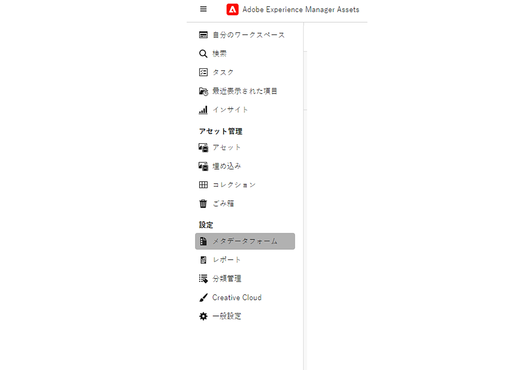

# アセットビューのメタデータ {#metadata}

メタデータとは、データに関するデータまたは説明のことです。例えば、アセットとしての画像には、撮影されたカメラに関する情報や著作権情報などを含めることができます。こうした情報が画像のメタデータです。メタデータは、効率的なアセット管理を行うために重要です。メタデータは、対象のアセットに使用できるすべてのデータのコレクションですが、必ずしもそのアセットに含まれているとは限りません。

メタデータは、アセットをより細かく分類するのに役立ち、デジタル情報量が多くなるにつれてさらに有用になります。数百個のファイルをファイル名、サムネールおよびメモリだけに基づいて管理することは可能です。ただし、このアプローチは拡張性に欠けます。関係者の数や管理するアセットの数が増えると、十分な管理ができなくなります。

メタデータを追加すると、以下の理由からデジタルアセットの価値が大きくなります。

* アクセスが容易になる - システムやユーザーが簡単に見つけることができます。
* 管理しやすくなる - 一連の同じプロパティを持つアセットを容易に検索し、これらのアセットに変更を適用できます。
* 完全 - アセットは、より多くの情報とコンテキスト、より多くのメタデータを保持します。

このような理由から、Assets ではデジタルアセットのメタデータの作成、管理および交換を行う適切な手段を提供します。

## メタデータの表示 {#view-metadata}

アセットのメタデータを表示するには、目的のアセットを参照するか検索し、アセットを選択して、ツールバーの「**[!UICONTROL 詳細]**」をクリックします。

*図：アセットとそのメタデータを表示するには、ツールバーの「**[!UICONTROL 詳細]**」をクリックするか、アセットをダブルクリックします。*

タイトル、説明、アップロード日などの基本的なメタデータは、「[!UICONTROL 基本]」タブに表示されます。「[!UICONTROL 詳細]」タブには、カメラのモデル、レンズの詳細、ジオタグなど、より詳細なメタデータが表示されます。「[!UICONTROL タグ]」タブには、画像の内容に基づいて自動的に適用されたタグが表示されます。

## メタデータを更新 {#update-metadata}

管理者がメタデータフォームを設定したら、他のフィールドを手動で更新できるようになります。これは、標準のメタデータフォームに基づいてのみ読み取るので、変更するほうがいい場合があります。

## スマートタグ {#smart-tags}

[!DNL Experience Manager Assets] では、[Adobe Sensei](https://www.adobe.com/jp/sensei.html) の人工知能機能を使用して、アップロードされたすべてのアセットに適切なタグを自動的に適用します。スマートタグと呼ばれるこれらのタグは、関連性の高いアセットをすばやく見つけるうえで役に立つので、プロジェクトのコンテンツベロシティ（コンテンツ創出の速度）が向上します。スマートタグは、画像に含まれないメタデータの例です。

スマートタグは、ほぼリアルタイムで適用され、画像の内容に基づいて生成されます。アセットをアップロードすると、ユーザーインターフェイスでアセットのサムネールに[!UICONTROL 処理中]としばらく表示されます。処理が完了したら、スマートタグと[メタデータを表示](#view-metadata)できます。

*図：アセットのスマートタグを表示するには、ツールバーの「**[!UICONTROL 詳細]**」をクリックするか、アセットをダブルクリックします。*

スマートタグには、信頼性スコア（パーセント）も含まれます。これは、適用されたタグに伴う信頼性を示します。自動的に適用されたスマートタグをモデレートできます。

## キーワードの追加または更新 {#manually-tag}

[!DNL Adobe Sensei] スマートサービスを使用して自動的に追加されるスマートタグに加えて、アセットにさらにタグを追加できます。アセットをプレビュー用に開き、「[!UICONTROL タグ]」をクリックして、「[!UICONTROL キーワード]」フィールドに目的のキーワードを入力します。タグを追加するには、Return キーを押します。[!DNL Assets view] により、ほぼリアルタイムでキーワードのインデックスが作成されるので、チームは新しいキーワードを使用して更新済みのアセットをすぐに検索できます。

アップロードされたすべてのアセットに [!DNL Assets view] で自動的に追加されたタグを、「[!UICONTROL スマートタグ]」セクションから削除することもできます。

## 分類の管理 {#taxonomy-management}

タグは、階層にネストして、カテゴリやサブカテゴリなどの関係をサポートすることも可能です。階層タグを挿入する必要がある場合は、管理者が[!UICONTROL 設定]の「[!UICONTROL 分類管理]」セクションで簡単に管理できます。すべてのユーザーがコンテンツの記述中にアクセスして使用できる、管理対象の名前空間とタグのセットを作成できます。管理者のみが[!UICONTROL 分類マネージャー]でタグ階層を設定できるので、値が一貫して制御および使用されるようになります。

## メタデータフォームの設定 {#metadata-forms}

>[!CONTEXTUALHELP]
>id="assets_metadata_forms"
>title="メタデータフォーム"
>abstract="[!DNL Experience Manager Assets] には、多数の標準メタデータフィールドがデフォルトで用意されています。組織には、メタデータに対するさらなるニーズがあり、ビジネス固有のメタデータを追加するために、さらに多くのメタデータフィールドが必要です。メタデータフォームを使用すると、ビジネスごとにアセットの詳細ページにカスタムメタデータフィールドを追加できます。ビジネス固有のメタデータにより、アセットのガバナンスと検出が向上します。"

アセットビューには、多数の標準メタデータフィールドがデフォルトで用意されています。組織には、追加のメタデータニーズがあり、ビジネス固有のメタデータを追加するために、さらに多くのメタデータフィールドが必要です。 メタデータフォームを使用すると、ビジネスごとにアセットの[!UICONTROL 詳細]ページにカスタムメタデータフィールドを追加できます。 ビジネス固有のメタデータにより、アセットのガバナンスと検出が向上します。フォームは、ゼロから作成することも、既存のフォームを再利用することもできます。

各種アセット（様々な MIME タイプ）のメタデータフォームを設定できます。ファイルの MIME タイプと同じフォーム名を使用します。アセットビューは、アップロードされたアセットの MIME タイプをフォームの名前と自動的に照合し、フォームフィールドに基づいて、アップロードされたアセットのメタデータを更新します。
<!--
For example, if a metadata form by the name `PDF` or `pdf` exists, then the uploaded PDF documents contain metadata fields as defined in the form.
-->
アセットビューでは、次のシーケンスを使用して、既存のメタデータフォーム名を検索し、特定タイプのアップロード済みアセットにメタデータフィールドを適用します。

MIME サブタイプ／MIME タイプ／`default` フォーム／標準フォーム

例えば、`PDF` または `pdf` という名前のメタデータフォームが存在する場合、アップロードされた PDF ドキュメントには、そのフォームで定義されたメタデータフィールドが含まれています。`PDF` または `pdf` という名前のメタデータフォームが存在しない場合、`application` という名前のメタデータフォームがあればアセットビューは照合します。`application` という名前のメタデータフォームがある場合、アップロードされた PDF ドキュメントには、そのフォームで定義されたメタデータフィールドが含まれています。それでも、一致するメタデータフォームが見つからない場合、アセットビューは `default` メタデータフォームを検索して、そのフォームで定義されたメタデータフィールドを、アップロードされた PDF ドキュメントに適用します。これらの手順がいずれも機能しない場合、アセットビューは、標準フォームで定義されたメタデータフィールドを、アップロードされたすべての PDF ドキュメントに適用します。
ただし、メタデータフォームをフォルダーに割り当てる場合は、[こちら](#assign-metadata-form-folder)をご覧ください。

>[!IMPORTANT]
>
>特定のファイルタイプの新しいメタデータフォームは、[!DNL Assets view] に用意されているデフォルトのメタデータフォームを完全に置き換えます。メタデータフォームを削除または名前変更すると、新しいアセットに対して、デフォルトのメタデータフィールドが再び使用可能になります。

メタデータフォームを作成するには、次の手順に従います。

1. 左側のパネルで、**[!UICONTROL 設定]**／**[!UICONTROL メタデータフォーム]**&#x200B;をクリックします。

   

1. ユーザーインターフェイスの右上にある「**[!UICONTROL 作成]**」をクリックします。
1. フォームの名前を指定し、「**[!UICONTROL 作成]**」をクリックします。
1. 右側の&#x200B;**[!UICONTROL 設定]**&#x200B;パネルでタブの名前を指定します。
1. 左側の&#x200B;**[!UICONTROL コンポーネント]**&#x200B;パネルから、必要なコンポーネントをフォームのタブにドラッグします。必要な順序でコンポーネントをドラッグします。

   

   *図：コンポーネントを追加するオプションとフォームをプレビューするオプションを備えたメタデータフォーム作成インターフェイス*

1. コンポーネントごとに、右側のパネルの&#x200B;**[!UICONTROL 設定]**&#x200B;で名前を指定し、サポートされているプロパティとのマッピングを指定します。
1. オプションで、コンポーネントに対して、「**[!UICONTROL 必須]**」を選択してメタデータフィールドを必須にしたり、「**[!UICONTROL 読み取り専用]**」を選択してアセットの[!UICONTROL 詳細]ページでフィールドを編集できないようにしたりします。
1. 必要に応じて、「**[!UICONTROL プレビュー]**」をクリックして、作成するフォームをプレビューします。
1. オプションで、タブと、各タブで必要なコンポーネントを追加します。
1. フォームが完成したら、「**[!UICONTROL 保存]**」をクリックします。

手順のシーケンスを表示するには、このビデオをご覧ください。

>[!VIDEO](https://video.tv.adobe.com/v/341275)

作成したフォームは、一致する MIME タイプのアセットをユーザーがアップロードすると自動的に適用されます。

既存のフォームを再利用して新しいフォームを作成するには、メタデータフォームを選択し、ツールバーの「**[!UICONTROL コピー]**」をクリックし、名前を指定して、「**[!UICONTROL 確認]**」をクリックします。メタデータフォームを編集して変更することができます。変更したフォームは、変更後にアップロードされたアセットに対して使用されます。既存のアセットは変更されません。

### プロパティコンポーネント {#property-components}

メタデータフォームは、次のプロパティコンポーネントのいずれかを使用してカスタマイズできます。コンポーネントタイプを目的の場所のフォームにドラッグ＆ドロップして、コンポーネントの設定を変更します。
各プロパティタイプの概要とその保存方法を以下に示します。

| コンポーネント名 | 説明 |
|---|---|
| アコーディオンコンテナ | 共通のコンポーネントとプロパティのリストに対して折りたたみ可能な見出しを追加します。デフォルトで展開または折りたたむことができます。 |
| 1 行のテキスト | 1 行のテキストのプロパティを追加します。 |
| 複数行テキスト | 複数行のテキストまたは段落を追加します。ユーザーが入力すると拡張され、すべてのコンテンツが含まれます。 |
| 複数値テキスト | 複数値テキストプロパティを追加します。 |
| 数値 | 数値コンポーネントを追加します。 |
| チェックボックス | ブール値を追加します。値を保存すると、TRUE または FALSE として保存されます。 |
| 日付 | 日付コンポーネントを追加します。 |
| ドロップダウン | ドロップダウンリストを追加します。 |
| State | リポジトリの状態プロパティを追加します（repo:state にマッピング）。 |
| アセットのステータス | デフォルトのアセットステータスプロパティを追加します（dam:assetStatus にマッピング）。 |
| タグ | 分類管理に保存されている値からタグを追加します（xcm:tags にマッピング）。 |
| キーワード | フリーフォームキーワードを追加します（dc:subject にマッピング）。 |
| スマートタグ | メタデータタグを自動的に追加して、検索機能を強化します。 |

### フォルダーにメタデータフォームの割り当て {#assign-metadata-form-folder}

アセットビューデプロイメント内のフォルダーにメタデータフォームを割り当てることもできます。メタデータフォームをフォルダーに手動で適用する際、MIME タイプに従ってフォルダーに割り当てられたメタデータフォームが上書きされます。サブフォルダー内のアセットを含むフォルダー内のすべてのアセットには、メタデータフォームで定義されたプロパティが表示されます。

フォルダーにメタデータフォームを割り当てるには、次の手順に従います。

1. **[!UICONTROL 設定]**／**[!UICONTROL メタデータフォーム]**&#x200B;に移動し、メタデータフォームを選択します。

2. 「**[!UICONTROL フォルダーに割り当て]**」をクリックします。

3. フォルダーを選択し、「**[!UICONTROL 割り当て]**」をクリックします。フォルダー名をクリックするとフォルダーを選択できます。

   

   フォルダーの詳細ページに移動し、右側のパネルにあるフォルダーのプロパティからメタデータフォームを選択して、そのメタデータフォームをフォルダーに割り当てることもできます。

   

### フォルダーからメタデータフォームの削除 {#remove-metadata-form-folder}

メタデータフォームを 1 つまたは複数のフォルダーに割り当てた後、Experience Manager Assets では、選択したフォルダーからメタデータフォームを削除することもできます。

フォルダーからメタデータフォームを削除するには、次の手順に従います。

1. **[!UICONTROL 設定]**／**[!UICONTROL メタデータフォーム]**&#x200B;に移動し、メタデータフォームを選択します。

1. 「**[!UICONTROL フォルダーから削除]**」をクリックします。メタデータフォームに割り当てられたフォルダーのリストが表示されます。

1. フォルダーを選択し、「**[!UICONTROL 削除]**」をクリックします。また、リストから複数のフォルダーを選択することもできます。

また、フォルダーの詳細ページに移動し、「**[!UICONTROL メタデータフォーム]**」フィールドから「**[!UICONTROL システムマッピングされたメタデータフォーム]**」を選択して、割り当てられたメタデータフォームをフォルダーから削除することもできます。

### メタデータフォームでのリンクコンポーネントの操作 {#link-component-metadata-form}

リンクコンポーネントを使用して、ストレージリンク、著作権情報、お問い合わせフォームなどの外部 URL を有効にします。メタデータフォームでリンクコンポーネントを使用するには、[メタデータフォームを設定する](#metadata-forms)必要があります。

メタデータフォームでリンクコンポーネントを使用するには、次の手順に従います。

1. アセット詳細ページに移動し、**[!UICONTROL リンク URL]** に移動します。
1. 選択したアセットのリダイレクトに使用する URL を追加します。
1. 「**[!UICONTROL リンクを追加]**」をクリックします。次のいずれかの操作を行います。
   *  をクリックして、URL をコピーします。
   *  をクリックして、URL を編集します。
1. 「**[!UICONTROL 保存]**」をクリックして、変更を保存します。

### メタデータフォームでのタグコンポーネントの操作 {#tag-component-metadata-form}

ルート要素は、アセットに関連付けることができるタグのツリー構造を表し、割り当てられたタグに基づいてアセットを識別するのに役立ちます。さらに、メタデータエディターでメタデータフォームを設定する際に、特定の分類のアクセスを制限できます。

#### タグコンポーネントの設定 {#tags-component-configuration}

タグコンポーネントを設定するには、次の手順を実行します。

1. メタデータエディターに移動し、**[!UICONTROL タグ]**&#x200B;に移動して、キャンバスに配置します。
1. キャンバス上のコンポーネントの名前を変更します。これを行うには、設定パネルの「[!UICONTROL メタデータプロパティ]」の下にある「**[!UICONTROL ラベル]**」に移動し、識別用のテキストを追加します。
1. 設定パネルの「[!UICONTROL メタデータプロパティ]」で、コンポーネントに割り当てるメタデータプロパティを検索します。
1. 「**[!UICONTROL 特定の分類に制限]**」をクリックして、分類のルートパスを制限します。これを行うには、タグを参照して、特定のパスに対する分類を選択します。
1. 「**[!UICONTROL 保存]**」をクリックして、変更を保存します。

   

1. [フォルダーにメタデータフォームを割り当てます](#assign-metadata-form-folder)。

<!--
#### Mapping between assets and taxonomy {#asset-taxonomy-mapping}

See [Assign metadata form to folders](#assign-metadata-form-folder). Follow the steps below to perform mapping between folder and taxonomy:

1. Go back to the Settings and click **[!UICONTROL Metadata forms]** 
1. Select a Metadata form that needs mapping. 
1. Click **[!UICONTROL Assign to folder(s)]**. **[!UICONTROL Select Folder(s)]** screen appears. 
1. Navigate to the folder that you want to assign to the metadata form. You can select multiple folders.
1. Click **[!UICONTROL Assign]**.
-->

設定済みのルートタグを表示するには、メタデータフォームとルートタグ間のマッピングが実行されるアセットの詳細ページに移動します。

## メタデータフォームの編集 {#edit-metadata-forms}

メタデータフォームを編集するには、次の手順を実行します。

1. [!DNL Assets View] ホームページに移動し、**[!DNL Metadata Forms]** を選択してメタデータフォームのリストを表示します。
1. フォームを選択し、「**[!UICONTROL 編集]**」をクリックして [!DNL Metadata Form Editor] ページを開きます。このページには、左側のパネルにメタデータフォームのコンポーネント、中央のパネルに「基本」、「詳細」、「タグ」などのタブ、右側のパネルにメタデータのプロパティを編集するための設定パネルが表示されます。
1. タブ（**[!DNL Basic]**、**[!DNL Advanced]** または **[!DNL Tags]**）を開きます。
1. メタデータプロパティを選択し、**[!UICONTROL 設定]**&#x200B;パネルでその設定を編集します。**[!UICONTROL 設定]**&#x200B;パネルでは、プロパティマッピングの更新、ラベルの名前変更、プロパティ値の変更または追加、その他の編集の実行を行うできます。
1. 変更を保存する前に、「**[!UICONTROL プレビュー]**」をクリックして、フォームへの変更を確認します。
1. 「**[!UICONTROL 保存]**」をクリックして、変更内容を適用します。

## 次の手順 {#next-steps}

* [ビデオを視聴してアセットビューでのメタデータフォームの管理を学ぶ](https://experienceleague.adobe.com/docs/experience-manager-learn/assets-essentials/configuring/metadata-forms.html?lang=ja)

* アセットビューのユーザーインターフェイスの「[!UICONTROL フィードバック]」オプションを使用して製品に関するフィードバックを提供する

* 右側のサイドバーにある「[!UICONTROL このページを編集]」（）または「[!UICONTROL 問題を記録] 」（）を使用してドキュメントに関するフィードバックを提供する

* [カスタマーケア](https://experienceleague.adobe.com/ja?support-solution=General#support)に問い合わせる

<!-- TBD: Cannot create a form using the second option. Documenting only the first option for now.
To reuse an existing form to create a form, do one of these:

* Select a metadata form and click **[!UICONTROL Copy]** from the toolbar, provide a name, and click **[!UICONTROL Confirm]**.

* Click **[!UICONTROL Create]**, select **[!UICONTROL Use existing form structure as template]** option, and select an existing form. 
-->

<!-- TBD: Queries for PM and engg.

Can we edit the existing metadata in any form?

How to moderate smart tags?

Allow or deny list for smart tags?

What about Tags displayed just above Smart Tags in the UI?

Is there a detailed metadata tab. Where do the other details of an asset go?

How can one search based strictly on the metadata. Similar to AEM Assets GQL queries.
-->

<!-- TBD: Link to related articles if any.

>[!MORELIKETHIS]
>
>* [Search assets](search.md).
-->