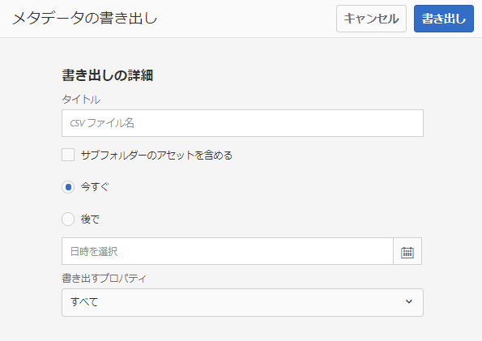
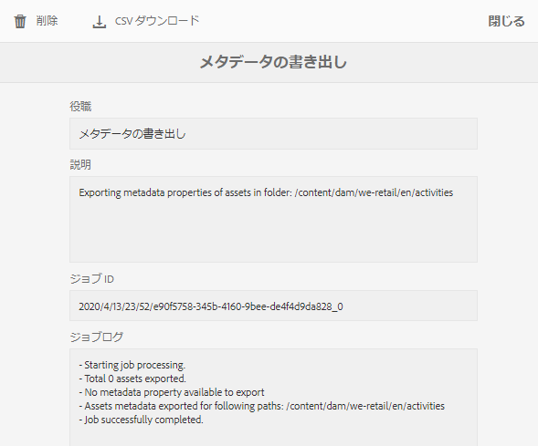

# アセットメタデータの一括読み込みおよび書き出し {#import-and-export-asset-metadata-in-bulk}

Adobe Experience Manager Assets では、CSV ファイルを使用して、アセットのメタデータを一括で読み込むことができます。CSV ファイルを読み込むことで、最近アップロードされたアセットや既存のアセットの一括更新を行うことができます。また、サードパーティシステムから CSV 形式でアセットメタデータを一括で取り込むこともできます。

## メタデータの読み込み {#import-metadata}

メタデータの読み込みは非同期であり、システムのパフォーマンスに影響はありません。アセットマイクロサービスを使用するメタデータの書き戻しアクティビティが原因で、複数のアセットのメタデータを同時にアップデートすると、リソースが大量に消費される可能性があります。他のユーザーのパフォーマンスに影響を与えないように、サーバーの使用率が低いときに一括操作を計画することをお勧めします。

>[!NOTE]
>
>カスタム名前空間にメタデータをインポートするには、まず、その名前空間を登録します。

1. [!DNL Assets] ユーザインタフェースに移動して、ツールバーから「**[!UICONTROL 作成]**」を選択し、メニューから「**[!UICONTROL メタデータ]**」を選択します。
1. **[!UICONTROL メタデータのインポート]** ページで、「**[!UICONTROL ファイルを選択]**」をクリックします。メタデータを格納した CSV ファイルを選択します。
1. 次のパラメーターを入力します。

   | パラメーター | 説明 |
   | ---------------------- | ------- |
   | バッチサイズ | メタデータを読み込むバッチ内のアセット数。デフォルト値は 50 です。最大値は 100 です。 |
   | フィールドセパレーター | デフォルト値は `,`（コンマ）です。他の文字も指定できます。 |
   | 複数の値の区切り文字 | メタデータ値のセパレーター。デフォルト値は `|` です。 |
   | ワークフローを開始 | デフォルトでは false です。`true` に設定すると、（メタデータをバイナリ XMP データに書き込む）DAM メタデータ書き戻しワークフローでデフォルト設定が有効になります。ワークフローを有効にすると、システムの反応が遅くなります。 |
   | アセットパス列名 | アセットが含まれている、CSV ファイルの列名を定義します。 |

1. ツールバーの「**[!UICONTROL インポート]**」を選択します。メタデータが読み込まれると、通知が通知インボックスに送信されます。アセットのプロパティページに移動し、メタデータ値がアセットに正常に読み込まれたかどうかを確認します。

1. メタデータをインポートした日付とタイムスタンプを追加するには、日付と時刻に `YYYY-MM-DDThh:mm:ss.fff-00:00` 形式を使用します。日付と時刻は `T` で区切られ、`hh` は 24 時間形式の時間、`fff` はナノ秒、`-00:00` はタイムゾーンオフセットです。例えば、`2020-03-26T11:26:00.000-07:00` は 2020年3月26日の午前 11:26:00.000（PT）です。

   * 日付の形式は、列見出しとその中の形式によって異なります。 例えば、日付が形式 `yyyy-MM-dd'T'HH:mm:ssXXX` に準拠している場合、それぞれの列ヘッダーは `Date: DateFormat: yyyy-MM-dd'T'HH:mm:ssXXX` である必要があります。
   * デフォルトの日付形式は `yyyy-MM-dd'T'HH:mm:ss.SSSXXX` です。

<!-- Hidden via cqdoc-17869>

>[!CAUTION]
>
>If the date format does not match `YYYY-MM-DDThh:mm:ss.fff-00:00`, the date values are not set. The date formats of exported metadata CSV file is in the format `YYYY-MM-DDThh:mm:ss-00:00`. If you want to import it, convert it to the acceptable format by adding the nanoseconds value denoted by `fff`.
-->

## メタデータの書き出し {#export-metadata}

複数のアセットのメタデータを CSV 形式で書き出すことができます。メタデータは非同期的に書き出され、システムのパフォーマンスに影響を及ぼしません。メタデータを書き出すため、Experience Manager はアセットノード `jcr:content/metadata` とその子ノードのプロパティを走査し、メタデータプロパティを CSV ファイルに書き出します。

メタデータの一括書き出しの使用例は次のとおりです。

* アセットの移行時にサードパーティシステムにメタデータを読み込む。
* より広範なプロジェクトチームとアセットメタデータを共有する。
* メタデータをテストまたは監査してコンプライアンスを確保する。
* メタデータを外部化して個別にローカライズできるようにする。

1. メタデータを書き出すアセットを含んだアセットフォルダーを選択します。ツールバーの「**[!UICONTROL メタデータを書き出し]**」を選択します。
1. メタデータの書き出しダイアログで、CSV ファイルの名前を指定します。サブフォルダー内のアセットのメタデータを書き出すには、「**[!UICONTROL サブフォルダーのアセットを含める]**」を選択します。

   

1. 目的のオプションを選択します。ファイル名を指定し、必要に応じて日付を指定します。

1. 「**[!UICONTROL 書き出すプロパティ]**」フィールドで、すべてのプロパティを書き出すか、特定のプロパティを書き出すかを指定します。書き出すプロパティを選択する場合は、目的のプロパティを追加します。

1. ツールバーの「**[!UICONTROL 書き出し]**」をタップまたはクリックします。メタデータが書き出されることを確認するメッセージが表示されます。メッセージを閉じます。
1. 書き出しジョブのインボックス通知を開きます。ジョブを選択し、ツールバーの「**[!UICONTROL 開く]**」をクリックします。メタデータが含まれている CSV ファイルをダウンロードするには、ツールバーの「**[!UICONTROL CSV ダウンロード]**」をタップまたはクリックします。「**[!UICONTROL 閉じる]**」をクリックします。

   

   *図：一括で書き出したメタデータを格納した CSV ファイルをダウンロードするためのダイアログ.*

>[!MORELIKETHIS]
>
>* [アセットを一括でインポートする際のメタデータのインポート](/help/assets/add-assets.md#asset-bulk-ingestor)

