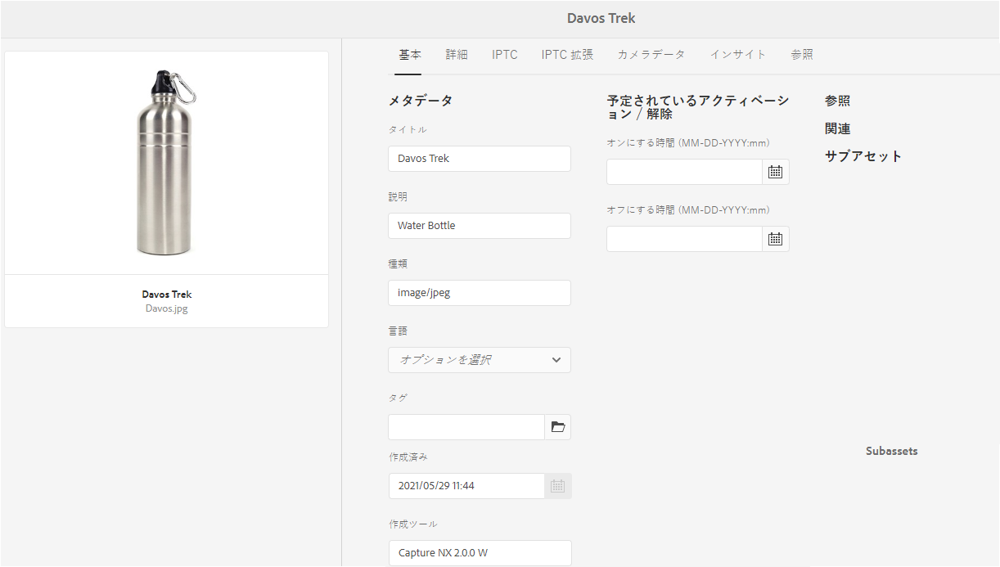
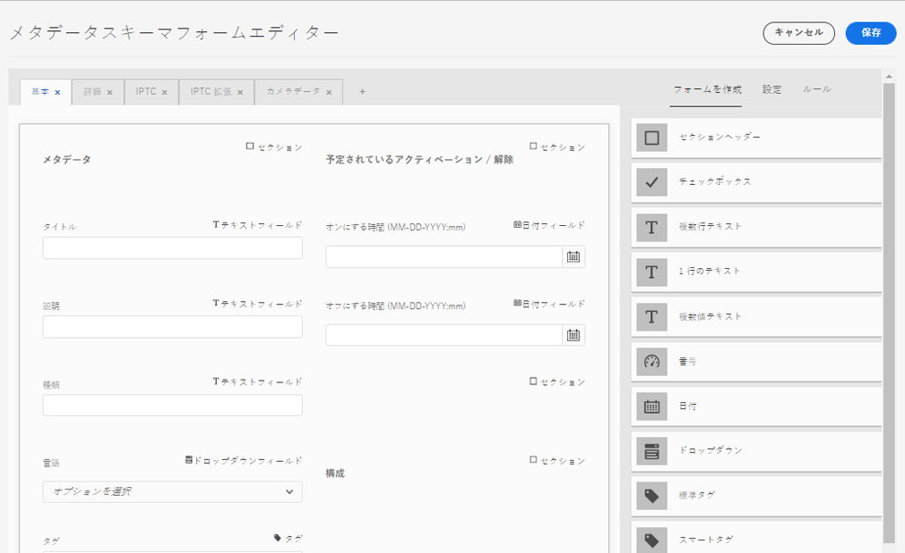

# メタデータスキーマ {#metadata-schemas}

| バージョン | 記事リンク |
| -------- | ---------------------------- |
| AEM 6.5 | [ここをクリックしてください](https://experienceleague.adobe.com/docs/experience-manager-65/assets/administer/metadata-schemas.html?lang=ja) |
| AEM as a Cloud Service | この記事 |

個々の組織では、アセットの検出、使用、相互運用性などを強化するメタデータモデルを用意します。正しいメタデータを適用することは、メタデータ駆動型のワークフローとプロセスを維持するために不可欠です。組織全体のメタデータ戦略および標準に準拠するには、DAM ユーザーの連携に役立つメタデータスキーマを使用します。[!DNL Adobe Experience Manager] では、メタデータスキーマの作成、維持管理、適用を簡単かつ柔軟に行えます。

[!DNL Adobe Experience Manager Assets] のスキーマには、入力する特定の情報の特定のフィールドが含まれています。また、メタデータフィールドをユーザーにわかりやすく表示するためのレイアウト情報も含まれています。メタデータプロパティには、タイトル、説明、MIME タイプ、タグなどがあります。既存のスキーマを変更したり、カスタムのメタデータスキーマを追加するには、[!UICONTROL メタデータスキーマフォーム]エディターを使用します。

アセットのプロパティページを表示して編集するには、次の手順に従います。

1. カード表示のアセットタイルのクイックアクションで、「**[!UICONTROL プロパティを表示]**」オプションをクリックします。または、アセットを選択し、ツールバーの「**[!UICONTROL プロパティ]**」（）をクリックします。

1. 使用可能なタブで、編集可能な様々なメタデータプロパティを編集できます。ただし、プロパティページの「[!UICONTROL 基本]」タブではアセット[!UICONTROL タイプ]を変更できません。

   

   *図：アセットの[!UICONTROL プロパティ]の「基本」タブ*

   アセットの MIME タイプを変更するには、カスタムメタデータスキーマフォームを使用するか、既存のフォームを変更します。詳しくは、[メタデータスキーマフォームの編集](#edit-metadata-schema-forms)を参照してください。ある MIME タイプのメタデータスキーマを変更すると、アセットおよびすべてのサブタイプのプロパティページレイアウトが変更されます。例えば、`default/image` 配下の jpeg スキーマを変更すると、MIME タイプが `image/jpeg` のアセットのメタデータのレイアウト（アセットプロパティ）のみが変更されます。ただし、デフォルトスキーマを編集する場合は、すべてのタイプのアセットのメタデータのレイアウトを変更します。

## メタデータスキーマフォーム {#default-metadata-schema-forms}

フォームやテンプレートのリストを表示するには、[!DNL Experience Manager] インターフェイスで&#x200B;**[!UICONTROL ツール]**／**[!UICONTROL アセット]**／**[!UICONTROL メタデータスキーマ]**&#x200B;に移動します。

[!DNL Experience Manager] には、次のメタデータスキーマフォームテンプレートが用意されています。

| テンプレート | | 説明 |
|---|---|---|
| [!UICONTROL default] | | アセットの基本メタデータスキーマフォーム |
| | 次の子フォームは、[!UICONTROL default] フォームのプロパティを継承します。 | |
| | <ul><li>[!UICONTROL dm_video]</li></ul> | Dynamic Media ビデオのスキーマフォーム |
| | <ul><li>[!UICONTROL 画像]</li></ul> | `image/jpeg` や `image/png` などの MIME タイプを持つ画像のスキーマフォーム [!UICONTROL 画像] フォームには、次の子フォームテンプレートがあります。 <ul><li> [!UICONTROL jpeg]：サブタイプが [!UICONTROL jpeg] であるアセットのスキーマフォーム</li> <li>[!UICONTROL tiff]：サブタイプが TIFF であるアセットのスキーマフォーム</li></ul> |
| | <ul><li>[!UICONTROL application]</li></ul> | `application/pdf` や `application/zip` などの MIME タイプを持つアセットのスキーマフォーム [!UICONTROL pdf]：サブタイプが PDF であるアセットのスキーマフォーム |
| | <ul><li>[!UICONTROL video]</li></ul> | `video/avi` や `video/mp4` などの MIME タイプを持つビデオアセットのスキーマフォーム |
| [!UICONTROL collection] | | コレクションのスキーマフォーム |
| [!UICONTROL contentfragment] | | コンテンツフラグメントのスキーマフォーム |
| [!UICONTROL forms] | | このスキーマフォームは [!DNL Adobe Experience Manager Forms] に関係しています。 |
| [!UICONTROL ugc_contentfragment] | | ソーシャルメディアから Experience Manager に統合されたユーザー生成コンテンツ断片およびアセットのスキーマフォーム |

>[!NOTE]
>
>スキーマフォームの子フォームを表示するには、スキーマフォーム名をクリックします。

## メタデータスキーマフォームの追加 {#add-a-metadata-schema-form}

メタデータスキーマフォームを追加するには、次の手順に従います。

1. リストにカスタムテンプレートを追加するには、ツールバーの「**[!UICONTROL 作成]**」をクリックします。

   >[!NOTE]
   >
   >編集されていないテンプレートにはロック記号が表示されます。テンプレートをカスタマイズした場合は、ロックされません（ は表示されません）。

1. ダイアログで、スキーマフォームのタイトルを入力し、「**[!UICONTROL 作成]**」をクリックして、フォーム作成プロセスを完了します。

## メタデータスキーマフォームの編集 {#edit-metadata-schema-forms}

新しく追加したメタデータスキーマフォームまたは既存のメタデータスキーマフォームを編集できます。メタデータスキーマフォームには、タブとタブ内のフォーム項目が含まれています。これらのフォーム項目を CRX リポジトリーのメタデータノード内のフィールドにマップしたり、フォーム項目を設定したりできます。タブまたはフォーム項目をメタデータスキーマフォームに追加できます。親から派生したタブおよびフォーム項目はロック状態です。子レベルではこれらを変更できません。

1. [!UICONTROL メタデータスキーマフォーム]ページで、フォームを選択し、ツールバーの「**[!UICONTROL 編集]**」をクリックします。

1. **[!UICONTROL メタデータスキーマフォームエディター]**&#x200B;ページで、メタデータフォームをカスタマイズします。必要なコンポーネントを「**[!UICONTROL フォームを作成]**」タブからいずれかのタブにドラッグします。

   

   *図：使用可能なタブを持つ[!UICONTROL メタデータスキーマフォームエディター]ページ*

1. コンポーネントを設定するには、コンポーネントを選択して、「**[!UICONTROL 設定]**」タブでそのプロパティを変更します。

### 「[!UICONTROL フォームを作成]」タブ内のコンポーネント  {#components-within-the-build-form-tab}

「**[!UICONTROL フォームを作成]**」タブには、スキーマフォーム内で使用するフォーム項目が表示されます。「**[!UICONTROL 設定]**」タブに、「**[!UICONTROL フォームを作成]**」タブで選択した各項目の属性が表示されます。「**[!UICONTROL フォームを作成]**」タブで使用できるフォーム項目を次の表に示します。

| コンポーネント名 | 説明 |
| -------------------------------- | ----------------------------------------------------------------------------------- |
| [!UICONTROL セクションヘッダー] | 共通コンポーネントのリストに対してセクションヘッダーを追加します。 |
| [!UICONTROL 1 行のテキスト] | 1 行のテキストプロパティを追加します。これは文字列として保存されます。 |
| [!UICONTROL 複数値テキスト] | 複数値テキストプロパティを追加します。これは文字列の配列として保存されます。 |
| [!UICONTROL 数値] | 数値コンポーネントを追加します。 |
| [!UICONTROL 日付] | 日付コンポーネントを追加します。 |
| [!UICONTROL ドロップダウン] | ドロップダウンリストを追加します。 |
| [!UICONTROL 標準タグ] | タグを追加します。 |
| [!UICONTROL スマートタグ] | メタデータタグを自動的に追加して、検索機能を強化します。 |
| [!UICONTROL 非表示のフィールド] | 非表示のフィールドを追加します。このフィールドは、アセットの保存時に POST パラメーターとして送信されます。 |
| [!UICONTROL アセットの参照元] | このアセットが参照しているアセットのリストを表示するには、このコンポーネントを追加します。 |
| [!UICONTROL アセットの参照] | このアセットを参照しているアセットのリストを表示するには、このコンポーネントを追加します。 |
| [!UICONTROL 製品リファレンス] | このアセットとリンクされている製品のリストを表示するには、このコンポーネントを追加します。 |
| [!UICONTROL コンテキストメタデータ] | アセットのプロパティページにある他のメタデータタブの表示を制御するために追加します。 |

<!-- TBD: Ratings are not available in Experience Manager as a Cloud Service. Removed via cqdoc-18089 ticket. 
| [!UICONTROL Asset Rating]        | Add to display options for rating the asset.                                       |
-->

#### メタデータコンポーネントの編集 {#edit-the-metadata-component}

フォームのメタデータコンポーネントのプロパティを編集するには、コンポーネントをクリックして、「**[!UICONTROL 設定]**」タブで次のすべてのプロパティまたはサブセットを編集します。1 つのフィールドのみをメタデータスキーマの指定のプロパティにマッピングすることをお勧めします。そうでない場合は、当該プロパティにマッピングされた最新の追加フィールドがシステムによって選択されます。

**フィールドラベル**：アセットのプロパティページに表示されるメタデータプロパティの名前。

**プロパティにマッピング**：このプロパティには、CRX リポジトリー内の保存先のアセットノードの相対パスまたは名前を指定します。この値は、パスがアセットのノードの配下にあることを示すために `./` で始まります。

プロパティの有効な値の例を次に示します。

* `./jcr:content/metadata/dc:title`：アセットのメタデータノードにある値を、プロパティ `dc:title` として格納します。

* `./jcr:created`:アセットの作成日時が格納されます。これは保護プロパティーです。これらのプロパティを設定する場合は、「編集を無効にする」とマークすることをお勧めします。そうしない場合、アセットのプロパティを保存したときに、「アセットの変更に失敗しました」というエラーが発生します。

コンポーネントがメタデータスキーマフォームに適切に表示されるように、プロパティのパスにはスペースを含めないでください。

* **プレースホルダー**：このプロパティを使用して、メタデータプロパティに関連するプレースホルダーテキストを指定します。
* **必須**：プロパティページでメタデータプロパティを必須としてマークするには、このプロパティを使用します。
* **編集を無効にする**：プロパティページでプロパティを編集不可にするには、このプロパティを使用します。
* **空白のフィールドを読み取り専用として表示**：プロパティページでメタデータプロパティに値がなくても表示するには、このプロパティをオンにします。デフォルトでは、メタデータプロパティに値がない場合、プロパティページには表示されません。
* **リストを並べ替えて表示**：選択肢のリストを並べ替えて表示するには、このプロパティを使用します。
* **選択肢**：リストの選択肢を指定するには、このプロパティを使用します。
* **説明**：メタデータコンポーネントの短い説明を追加するには、このプロパティを使用します。
* **クラス**：プロパティが関連付けられているオブジェクトクラス。
* **削除**：「[!UICONTROL 削除]」をクリックすると、スキーマフォームからコンポーネントが削除されます。

>[!NOTE]
>
>[!UICONTROL 非表示のフィールド]コンポーネントには、これらの属性は含まれていません。代わりに、属性の名前、値、フィールドラベル、説明などのプロパティが含まれています。非表示のフィールドコンポーネントの値は、アセットの保存時に常に POST パラメーターとして送信されます。この値は、アセットのメタデータとして保存されません。

「**[!UICONTROL 必須]**」オプションを選択した場合、必須のメタデータが設定されていないアセットを検索できます。**[!UICONTROL フィルター]**&#x200B;パネルで、「**[!UICONTROL メタデータの検証]**」述語を展開して、「**[!UICONTROL 無効]**」オプションを選択します。検索結果に、スキーマフォームで設定した必須のメタデータが設定されていないアセットが表示されます。

スキーマフォームのいずれかのタブにコンテキストメタデータコンポーネントを追加した場合、コンポーネントは、その特定のスキーマが適用されているアセットのプロパティページにリストとして表示されます。このリストには、コンテキストメタデータコンポーネントを適用したタブを除く、他のすべてのタブが含まれます。現在、この機能は、コンテキストに応じてメタデータの表示を制御する基本的な機能を提供しています。

コンテキストメタデータコンポーネントが適用されているタブに加えて、プロパティページに任意のタブを表示するには、リストからタブを選択します。タブがプロパティページに追加されます。

### JSON ファイルでのプロパティの指定 {#specify-properties-in-json-file}

「**[!UICONTROL 設定]**」タブのオプションでプロパティを指定する代わりに、対応するキーと値のペアを指定することで JSON ファイルでオプションを定義できます。「**[!UICONTROL JSON パス]**」フィールドに JSON ファイルのパスを指定します。

#### スキーマフォームでのタブの追加または削除 {#add-delete-a-tab-in-the-schema-form}

スキーマエディターで、タブを追加または削除できます。デフォルトのスキーマフォームには、「**[!UICONTROL 基本]**」、「**[!UICONTROL 詳細]**」、「**[!UICONTROL IPTC]**」および「**[!UICONTROL IPTC 拡張]**」の各タブが含まれています。

「`+`」をクリックすると、スキーマフォームにタブが追加されます。新しいタブにはデフォルトで「`Unnamed-1`」という名前が付けられます。この名前は、「**[!UICONTROL 設定]**」タブから編集できます。タブを削除するには、「`X`」をクリックします。

## メタデータスキーマフォームの削除 {#deleting-metadata-schema-forms}

Experience Manager では、カスタムのスキーマフォームのみを削除できます。デフォルトのスキーマフォームまたはテンプレートを削除することはできません。ただし、これらのフォームでのカスタムの変更内容は削除できます。

フォームを削除するには、フォームを選択して削除アイコンをクリックします。

>[!NOTE]
>
>デフォルトフォームに対して行ったカスタムの変更を削除すると、ロックアイコンがメタデータスキーマインターフェイスのデフォルトフォームの前に再度表示され、フォームがデフォルトの状態に戻ったことが示されます。

>[!NOTE]
>
>* デフォルトフォームに対するカスタムの変更を削除すると、ロック記号（）がフォームの前に再び表示されます。これは、フォームがデフォルトの状態に戻ったことを示します。
>* [!DNL Assets] 内のデフォルトのメタデータスキーマフォームは削除できません。

## MIME タイプ用のスキーマフォーム {#schema-forms-for-mime-types}

[!DNL Experience Manager] には、様々な MIME タイプですぐに使用できるデフォルトのフォームが用意されています。ただし、様々な MIME タイプのアセットにカスタムのフォームを追加することができます。

### MIME タイプ用の新しいフォームの追加 {#adding-new-forms-for-mime-types}

適切なフォームタイプの下でフォームを作成します。例えば、`image/png` サブタイプのテンプレートを追加するには、「image」フォームの下にフォームを作成します。スキーマフォームのタイトルはサブタイプ名です。この場合、タイトルは「`png`」です。

#### 様々な MIME タイプ用の既存スキーマテンプレートの使用 {#use-an-existing-schema-template-for-various-mime-types}

別の MIME タイプに対して既存のテンプレートを使用できます。例えば、MIME タイプ `image/png` のアセットに対して `image/jpeg` フォームを使用します。

この場合は、CRX リポジトリー内の `/etc/dam/metadataeditor/mimetypemappings` にノードを作成します。そのノードの名前を指定し、次のプロパティを定義します。

| 名前 | 説明 | タイプ | 値 |
|------|-------------|------|-------|
| `exposedmimetype` | マッピングする既存フォームの名前 | `String` | `image/jpeg` |
| `mimetypes` | `exposedmimetype` 属性で定義したフォームを使用する MIME タイプのリスト | `String` | `image/png` |

[!DNL Assets] では、次の MIME タイプとスキーマフォームがマッピングされます。

| スキーマフォーム | MIME タイプ |
|---|---|
| image/jpeg | image/pjpeg |
| image/tiff | image/x-tiff |
| application/pdf | application/postscript |
| application/x-ImageSet | Multipart/Related; type=application/x-ImageSet |
| application/x-SpinSet | Multipart/Related; type=application/x-SpinSet |
| application/x-MixedMediaSet | Multipart/Related; type=application/x-MixedMediaSet |
| video/quicktime | video/x-quicktime |
| video/mpeg4 | video/mp4 |
| video/avi | video/avi、video/msvideo、video/x-msvideo |
| video/wmv | video/x-ms-wmv |
| video/flv | video/x-flv |

## メタデータスキーマへのアクセス権の付与 {#grant-access-to-metadata-schemas}

メタデータスキーマ機能は、管理者のみが使用できます。ただし、管理者は一部の権限を変更して、管理者以外のユーザーにアクセス権を付与することができます。`/conf` フォルダーに対する作成、変更、削除の権限を管理者以外のユーザーに割り当てます。

## フォルダー固有のメタデータの適用 {#applying-folder-specific-metadata}

[!DNL Assets] では、メタデータスキーマのバリアントを定義して、それを特定のフォルダーに適用できます。

例えば、デフォルトのメタデータスキーマのバリアントを定義して、それをフォルダーに適用できます。変更したスキーマを適用すると、フォルダー内のアセットに適用されている元のデフォルトのメタデータスキーマがオーバーライドされます。

このスキーマが適用されているフォルダーにアップロードされたアセットのみが、バリアントのメタデータスキーマに定義されている変更されたメタデータに従います。元のスキーマが適用されている他のフォルダーにある [!DNL Assets] は、元のスキーマに定義されているメタデータに引き続き従います。

アセットごとのメタデータの継承は、階層の最上位フォルダーに適用されているスキーマに基づきます。サブフォルダーには同じスキーマが適用または継承されます。異なるスキーマがサブフォルダーレベルで適用されると、継承が停止します。

1. [!DNL Experience Manager] インターフェイスで、**[!UICONTROL ツール]**／**[!UICONTROL アセット]**／**[!UICONTROL メタデータスキーマ]**&#x200B;に移動します。**[!UICONTROL メタデータスキーマフォーム]**&#x200B;ページが表示されます。
1. フォーム（デフォルトのメタデータフォームなど）の前にあるチェックボックスをオンにし、「**[!UICONTROL コピー]**」をクリックして、カスタムフォームとして保存します。そのフォームに `my_default` などの名前を付けます。または、カスタムフォームを作成できます。

1. **[!UICONTROL メタデータスキーマフォーム]**&#x200B;ページで、`my_default` フォームを選択し、「**[!UICONTROL 編集]**」をクリックします。
1. **[!UICONTROL メタデータスキーマエディター]**&#x200B;ページで、スキーマフォームにテキストフィールドを追加します。例えば、「**[!UICONTROL カテゴリ]**」というラベルのフィールドを追加します。
1. 「**[!UICONTROL 保存]**」をクリックします。変更されたフォームは&#x200B;**[!UICONTROL メタデータスキーマフォーム]**&#x200B;ページにリストされます。
1. ツールバーの「**[!UICONTROL フォルダーに適用]**」を選択してカスタムメタデータをフォルダーに適用します。
1. 変更されたスキーマを適用するフォルダーを選択し、「**[!UICONTROL 適用]**」を選択します。
1. フォルダーに他のメタデータが適用されている場合は、既存のメタデータスキーマを上書きする旨の警告メッセージが表示されます。「**上書き**」をクリックします。
1. 「**OK**」をクリックして、成功メッセージを閉じます。
1. 変更したメタデータスキーマを適用したフォルダーに移動します。

## 必須のメタデータの定義 {#defining-mandatory-metadata}

必須フィールドをフォルダーレベルで定義すると、そのフォルダーにアップロードされるアセットに強制的に適用されます。事前に定義された必須フィールドのメタデータが欠落したアセットをアップロードすると、カード表示においてそのアセットのメタデータがないことが視覚的に示されます。

>[!NOTE]
>
>メタデータフィールドは、別のフィールドの値に基づいて、必須フィールドとして定義できます。Experience Manager のカード表示では、このような必須メタデータフィールドのメタデータがなくても警告メッセージは表示されません。

1. Experience Manager のロゴをクリックし、**[!UICONTROL ツール]**／**[!UICONTROL アセット]**／**[!UICONTROL メタデータスキーマ]**&#x200B;に移動します。**[!UICONTROL メタデータスキーマフォーム]**&#x200B;ページが表示されます。
1. デフォルトのメタデータフォームをカスタムフォームとして保存します。例えば、`my_default` として保存します。
1. カスタムフォームを編集します。必須フィールドを追加します。例えば、「**[!UICONTROL カテゴリ]**」フィールドを追加して、それを必須フィールドにします。
1. 「**[!UICONTROL 保存]**」をクリックします。変更されたフォームは&#x200B;**[!UICONTROL メタデータスキーマフォーム]**&#x200B;ページにリストされます。フォームを選択し、ツールバーの「**[!UICONTROL フォルダーに適用]**」を選択して、カスタムメタデータをフォルダーに適用します。
1. フォルダーに移動し、カスタムフォームに追加した必須フィールドにメタデータが指定されていないアセットをアップロードします。必須フィールドの指定されていないメタデータに関するメッセージが、アセットのカード表示に表示されます。
1. （オプション）`https://[server]:[port]/system/console/components/`にアクセスします。`com.day.cq.dam.core.impl.MissingMetadataNotificationJob` コンポーネントを設定して有効にします。このコンポーネントはデフォルトで無効になっています。Experience Manager がアセット上にあるメタデータの妥当性をチェックする頻度を設定します。

   この設定により、`hasValidMetadata` プロパティがアセットの `jcr:content` に追加されます。Experience Manager では、このプロパティを使用して検索の結果をフィルタリングできます。

   >[!NOTE]
   >
   >スケジュール済みチェックの後に追加されたアセットは、次回のスケジュール済みチェックが実行されるまでは `hasValidMetadata` のフラグが設定されません。こうしたアセットは中間の検索結果に表示されません。

   >[!CAUTION]
   >
   >メタデータの検証チェックは、大量のリソースを必要とするので、システムのパフォーマンスに影響を及ぼす可能性があります。検証チェックのスケジュール設定は、適切に行う必要があります。サーバーがチェックの負荷に対処できない場合は、このジョブを無効にしてください。

**関連情報**

* [アセットを翻訳](translate-assets.md)
* [Assets HTTP API](mac-api-assets.md)
* [AEM Assets as a Cloud Service でサポートされているファイル形式](file-format-support.md)
* [アセットを検索](search-assets.md)
* [接続されたアセット](use-assets-across-connected-assets-instances.md)
* [アセットレポート](asset-reports.md)
* [アセットをダウンロード](download-assets-from-aem.md)
* [メタデータを管理](manage-metadata.md)
* [検索ファセット](search-facets.md)
* [コレクションを管理](manage-collections.md)
* [メタデータの一括読み込み](metadata-import-export.md)
* [AEM および Dynamic Media へのアセットの公開](/help/assets/publish-assets-to-aem-and-dm.md)