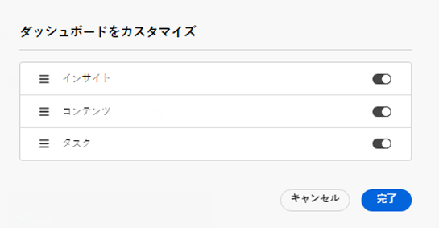

# Assets のマイワークスペース {#my-workspace}

>[!CONTEXTUALHELP]
>id="assets_my_workspace"
>title="マイワークスペース"
>abstract="Assets には、ウィジェットを提供するカスタマイズ可能なワークスペースが含まれるようになりました。このワークスペースは、Assets ユーザーインターフェイスの主要な領域と、最も関連性の高い情報に、簡単にアクセスできます。このページは、作業項目の概要を示し、主要なワークフローにすばやくアクセスできるワンストップソリューションとして機能します。"

Assets には、ウィジェットを提供するカスタマイズ可能なワークスペースが含まれるようになりました。このワークスペースは、Assets ユーザーインターフェイスの主要な領域と、最も関連性の高い情報に簡単にアクセスできます。このページは、作業項目の概要を示し、主要なワークフローにすばやくアクセスできるワンストップソリューションとして機能します。これらのオプションにより簡単にアクセスできるので、効率とコンテンツ速度が向上します。

マイワークスペースにアクセスするには、左側のナビゲーションパネルで使用可能な項目から「**[!UICONTROL マイワークスペース]**」をクリックします。マイワークスペースには、クイックアクセス、インサイト、タスクおよびコンテンツウィジェットを表示する様々なウィジェットが含まれています。環境設定に基づいて、ワークスペースでのこれらのウィジェットの表示方法を設定できます。

>[!NOTE]
>
>インサイトウィジェットは、管理者にのみ表示されます。

<!--

**New features coming soon**

Highlights upcoming features for Assets.

-->

**クイックアクセス**

ファイル、フォルダー、コレクションをピン留めして、後で必要になったときにすばやくアクセスできるようにします。ピン留めしたすべての項目は、マイワークスペースの「**クイックアクセス**」セクションに表示されます。リポジトリ内の保存場所に移動する代わりに、マイワークスペースを使用してこれらにアクセスできます。

アセット、フォルダーまたはコレクションを固定するには：

1. 項目を選択し、 **[!UICONTROL クイックアクセスに固定]**.

1. 自分用、組織全体用、または選択したグループ用に、項目を固定する必要がある場合は、「 」を選択します。 次を選択した場合、 **[!UICONTROL グループの場合]**」で、 **[!UICONTROL グループのピン留め]** フィールドに入力します。

   
1. クリック **[!UICONTROL ピン留め]**.

   選択した項目が **[!UICONTROL クイックアクセス]** を参照してください。
   

**インサイト**

管理者は、過去 30 日間に Assets 環境で実行されたダウンロードとアップロードの数の概要を表示できます。「**[!UICONTROL すべて表示]**」をクリックすると、インサイトページにすばやく移動し、より詳細なダッシュボードを表示できます。

また、マイワークスペースの「**インサイト**」セクションを使用して、上位に検索された用語と、アセットビューのデプロイメント内でこれらの用語が検索された回数を表示することもできます。また、詳細なインサイトに移動して、過去 30 日間または 12 か月間で上位の検索結果を表示することもできます。

**タスク**

「**[!UICONTROL マイタスク]**」タブに現在割り当てられているタスクのリスト、「**[!UICONTROL 割り当て済みタスク]**」タブに作成されたタスクのリストおよび「**[!UICONTROL 完了]**」タブに既に完了したタスクのリストが表示されます。タスクを選択し、「**[!UICONTROL タスクを完了]**」をクリックすると、タスクを承認または却下できます。タスクを選択し、「**[!UICONTROL タスクの詳細を開く]**」をクリックして、タスクを表示し、承認、却下、編集または削除することもできます。

>[!NOTE]
>
> アセット上のタスクを別のユーザーに割り当てる「**[!UICONTROL タスクを割り当て]**」オプションは、アセットを選択する場合や、アセット情報表示を開く場合に使用できます。

**コンテンツ**

最近表示したアセットのリストなど、アセットの様々な表示が表示されます。ウィジェット内のアセットをリスト表示、グリッド表示、ギャラリー表示、ウォーターフォール表示のいずれかを選択し、名前、サイズ、変更日でアセットを並べ替えることができます。また、アセットを選択して、アセットの詳細を表示したり、最近表示したアセットのリストから削除したりすることもできます。

「**[!UICONTROL 上位のダウンロード]**」タブには、アセットビュー環境で使用可能な最もダウンロードされたアセットの上位 10 件が表示されます。リスト表示またはグリッド表示でアセットを表示するように選択できます。どちらの表示にも、各アセットの形式タイプとダウンロード数が表示されます。また、アセットを選択し、「**[!UICONTROL 詳細]**」をクリックしてそのプロパティを表示することもできます。

## マイワークスペースのカスタマイズ {#configure-widgets}

デフォルトではすべてのウィジェットが表示されますが、マイワークスペースに表示されるウィジェットを有効または無効にすることができます。環境設定はユーザーごとに異なります。

1. 左側のナビゲーションパネルで使用可能な「**[!UICONTROL マイワークスペース]**」をクリックし、「**[!UICONTROL カスタマイズ]**」をクリックします。

1. ワークスペースに表示する必要のないウィジェットの切替スイッチをオフにします。また、ウィジェットを適切な場所にドラッグして、ワークスペースでの表示順序を更新することもできます。

1. 「**[!UICONTROL 完了]**」をクリックして、変更を保存します。

   
