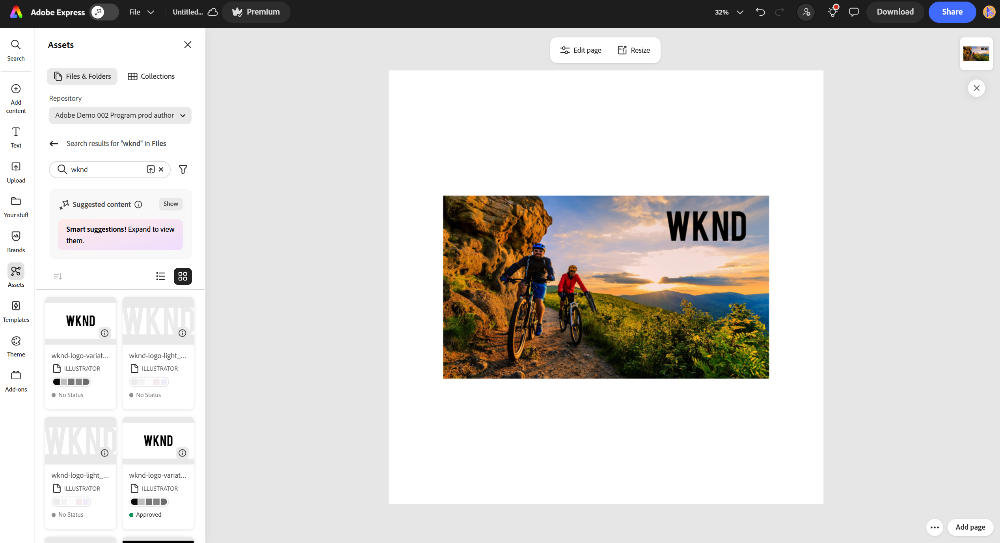
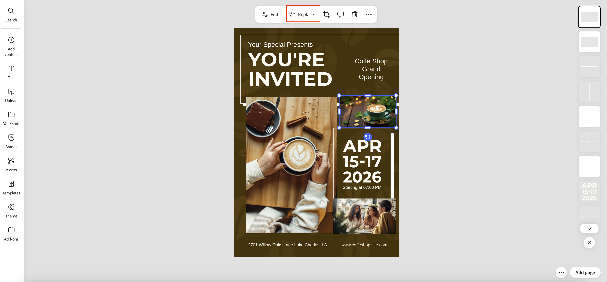
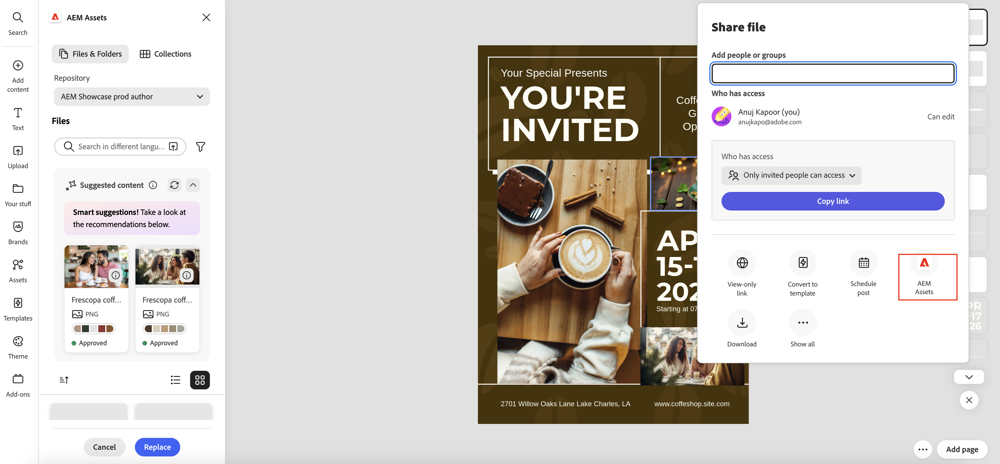
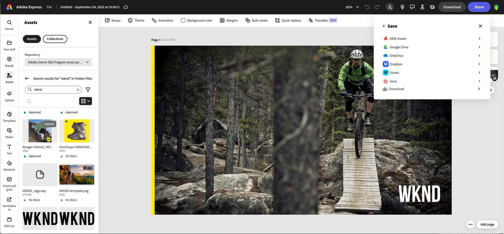

# Adobe Express とのネイティブ統合 {#native-integration-adobe-express}

AEM Assets は Adobe Express とネイティブに統合されているので、Adobe Express ユーザーインターフェイス内から AEM Assets に保存されているアセットに直接アクセスできます。AEM Assets で管理されているコンテンツを Express キャンバスに配置し、新しいコンテンツや編集したコンテンツを AEM Assets リポジトリに保存できます。この統合には、次のような主なメリットがあります。

* AEM での新しいアセットの編集と保存による、コンテンツ再利用の増加。

* 新しいアセットの作成や、既存のアセットの新しいバージョンの作成にかかる全体的な時間と労力の削減。

## 前提条件 {#prerequisites}

AEM Assets 内の Adobe Express と 1 つ以上の環境にアクセスする権限。環境は、Assets as a Cloud Service または Assets Essentials 内の任意のリポジトリでも構いません。

## Adobe Express エディターでの AEM Assets の使用 {#use-aem-assets-in-express}

Adobe Express エディターで AEM Assets の使用を開始するには、次の手順を実行します。

1. Adobe Express web アプリケーションを開きます。

2. 新しいテンプレートまたはプロジェクトを読み込むか、アセットを作成して、新しい空のキャンバスを開きます。

3. 左側のナビゲーションパネルで「**[!UICONTROL アセット]**」をクリックします。Adobe Express には、アクセス権が付与されたリポジトリのリストとルートレベルで使用可能なアセットおよびフォルダーのリストが表示されます。

4. リポジトリー内のアセットを参照または検索して、キャンバスにドラッグ&amp;ドロップします。 または、アセットをクリックしてキャンバスに配置します。 また、ファイルタイプ、MIME タイプ、サイズなど、様々な条件でアセットをフィルタリングすることもできます。

   >[!NOTE]
   >
   >ディメンションによるフィルターは、ビデオには適用されません。

   

### AEM アップロードを使用して画像を置換 {#replace-image-using-aem-upload}

さらに、**[!UICONTROL AEM アップロード]** を使用して、追加された画像を置き換えることができます。 これを行うには、次の手順を実行します。

1. アセットを参照または検索して、キャンバスにドラッグ&amp;ドロップします。

1. 置き換える画像を選択します。 「**[!UICONTROL 置換]**」をクリックして、他の様々なオプションの中から **[!UICONTROL 2}AEM Assets} を選択します。]**

   

1. **[!UICONTROL AEMのアップロード]** パネルが左側のナビゲーションパネルに開きます。 Adobe Expressには、アクセス権のあるリポジトリーのリストと、ルートレベルで使用可能なアセットおよびフォルダーのリストが表示されます。 ここからアセットを選択してキャンバスで置き換えをプレビューし、「**[!UICONTROL 置換]**」をクリックして確定します。

   >[!NOTE]
   >
   > SVG ファイルタイプはサポートされていません。

## AEM Assets での Adobe Express プロジェクトの保存 {#save-express-projects-in-assets}

Express キャンバスに適切な変更を組み込んだ後、AEM Assets リポジトリに保存できます。

1. 「**[!UICONTROL 共有]**」をクリックして、**[!UICONTROL 共有]**&#x200B;ダイアログを開きます。

   

2. 右側のパネルの「**[!UICONTROL 推奨]**」セクションから、「**AEM Assets**」を選択します。Adobe Express にアップロードダイアログが表示されます。

   

3. 「**現在のページ**」または「**すべてのページ**」を選択します。書き出すアセットの名前と形式を指定します。キャンバスのコンテンツは、PNG、JPEG、PDF、MP4、MP4+PNG、または MP4+JPEG 形式で書き出すことができます。形式は、キャンバスページのアセットに基づいて自動的に調整されます。
「**現在のページ**」を選択すると、現在のページのアセットが宛先フォルダーに保存されます。「**すべてのページ**」を選択し、書き出す形式が PDF でない場合、すべてのキャンバスページは、宛先フォルダー内の新しいフォルダーに個別のファイルとして保存されます。書き出す形式が PDF の場合、すべてのキャンバスページが 1 つの PDF ファイルとして宛先フォルダーに保存されます。

4. **宛先フォルダー**&#x200B;の下にあるフォルダーアイコンをクリックして場所を選択し、アセットを保存します。

   

5. オプション：「**プロジェクトまたはキャンペーン名**」フィールドを使用して、アップロード用のキャンペーンメタデータを追加できます。既存の名前を使用するか、新しい名前を作成できます。アップロードには、複数のプロジェクト名またはキャンペーン名を定義できます。名前を登録するには、名前を入力して Enter キーを押すだけです。
ベストプラクティスとして、アドビでは、アップロードしたアセットの検索エクスペリエンスを強化すると共に、残りのフィールドに値を指定することをお勧めします。

6. 同様に、「**[!UICONTROL キーワード]**」フィールドと「**[!UICONTROL チャネル]**」フィールドの値を定義します。

7. 「**[!UICONTROL アップロード]**」をクリックして、AEM Assets にアセットをアップロードします。

<table> 
    <tbody>
     <tr>
      <th><strong>サポートされる形式</strong></th>
      <th><strong>サイズ</strong></th>
     </tr>
    </tr>
    <tr>
        <td>[!UICONTROL JPEG]</td>
        <td> 65MP （例：8K x 8K または 16K x 4K） </td>
    </tr>
    <tr>
        <td>[!UICONTROL PNG]</td>
        <td> 65MP （例：8K x 8K または 16K x 4K） </td>
    </tr>
    <tr>
        <td>[!UICONTROL SVG]</td>
        <td> 最大 250 KB</td>
    </tr>
    <tr>
        <td>[!UICONTROL MP4]</td>
        <td> 3840 X 3840 ピクセル、最大 200 MB</td>
    </tr>
    <tr>
      <td colspan="2"> <i> アセットサイズは、デスクトップデバイスの場合は 80 MB 未満、モバイルデバイスの場合は 40 MB 未満にする必要があります。</i></td>
   </tr>
    </tbody>
</table>

## 制限事項 {#limitations}

1. 読み込みと書き出しの場合、サポートされるビデオファイルのタイプは MP4 です。

2. **MP4 ビデオの読み込み**&#x200B;の場合、背景が透明なビデオ（アルファチャンネル）はサポートされません。
   <!--
   1. The maximum file size supported is 200 MB. If this limit exceeds, an alert message displays.
   2. The maximum supported resolution is 3840 X 3840 pixels.
   3. Videos with transparent backgrounds (alpha channel) are not supported.
   -->

3. **MP4 ビデオの書き出し**&#x200B;の場合、サポートされる最大ファイルサイズは 200 MB です。 この制限を超えると、ビデオを 200 MB 以下にトリミングするか、ダウンロード後に AEM Assets の宛先フォルダーに手動でアップロードすることを提案するアラートが表示されます。

