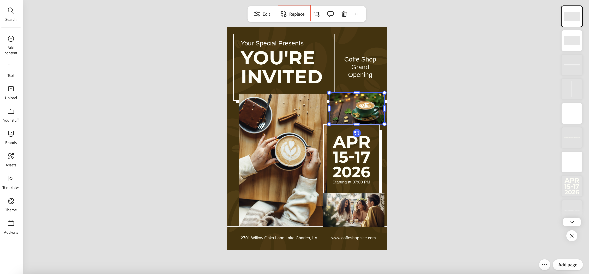

# コンテンツアドバイザーを使用してAdobe ExpressでAEM Assetsにアクセスする {#native-integration-adobe-express-using-content-advisor}

Adobe Experience Manager（AEM）Assetsは、Adobe Expressとネイティブに統合されているので、コンテンツアドバイザーを使用してAEM Assetsから直接アセットを検出、アクセス、使用できます。

コンテンツアドバイザーは、インテリジェントでコンテキストに対応したアセット検出をクリエイティブワークフローに直接提供することで、Adobe Expressでのアセットの検出および使用方法を変革します。 コンテンツアドバイザーでは、キーワードを入力してアセットを検索する代わりに、キャンバスコンテンツ、キャンペーンの概要および目的に基づいて関連性の高い承認済みアセットを表示するので、適切なアセットをすばやく見つけることができます。

コンテンツアドバイザーでは、スマートサジェスト、Dynamic Media レンディションへのアクセス、アセットメタデータの完全な可視性により、Adobe Expressを離れることなく、AEM Assetsからアセットを効率的に見つけ、評価し、使用できます。 これにより、コンテンツの作成が迅速化され、アセットの再利用が向上し、承認済みのブランドに準拠したアセットを一貫して使用できるようになります。


また、Express キャンバスにアセットを配置し、新しいコンテンツや編集したコンテンツをAEM Assetsに戻して、アセット管理とガバナンスの一元化を実現することもできます。 Adobe Expressとのネイティブ統合には、次のような主なメリットがあります。

* コンテキスト対応のアセット検出およびレコメンデーションによるコンテンツ作成の高速化。

* 既存のアセットを編集し、新しいアセットをAEM Assetsに保存することで、コンテンツの再利用を促進しました。

* チャネルに最適化された、承認済みの Dynamic Media レンディションにすばやくアクセスできます。

* ブランドの一貫性を維持しながら、新しいアセットや新しいバージョンを作成する時間と労力を削減します。

## 前提条件 {#prerequisites}

AEM Assets 内の Adobe Express と 1 つ以上の環境にアクセスする権限。任意のAssets as a Cloud Service リポジトリを環境にすることができます。

## Adobe Express エディターでの AEM Assets の使用 {#use-aem-assets-in-express}

Adobe Express エディターで AEM Assets の使用を開始するには、次の手順を実行します。

1. Adobe Express web アプリケーションを開きます。

2. 新しいテンプレートまたはプロジェクトを読み込むか、アセットを作成して、新しい空のキャンバスを開きます。

3. 左側のナビゲーションパネルで「**[!UICONTROL アセット]**」をクリックします。Adobe Expressに [ コンテンツアドバイザー ](#intelligent-asset-discovery-content-advisor) と表示され、アクセス権のあるリポジトリと、ルートレベルで使用可能なアセットおよびフォルダーのリストが表示されます。

4. [ コンテンツアドバイザー ](#intelligent-asset-discovery-content-advisor) を使用してリポジトリ内のアセットを参照または検索し、それらをキャンバスにドラッグ&amp;ドロップします。 または、アセットをクリックしてキャンバスに配置します。 また、承認ステータス、ファイルタイプ、MIME タイプ、サイズなど様々な条件で、アセットをフィルタリング  することもできます。

   >[!NOTE]
   >
   >ディメンションによるフィルターは、ビデオには適用されません。

   

## Content Advisor によるインテリジェントなアセット検出 {#intelligent-asset-discovery-content-advisor}

コンテンツアドバイザーは、キャンバスコンテンツやキャンペーンの概要に基づいてインテリジェントでコンテキストに対応したレコメンデーションを使用して、関連するアセットを見つけるのに役立ちます。 また、ユースケースに合わせて最適化された、チャネル対応の Dynamic Media レンディションを選択することもできます。


コンテンツ アドバイザは、ファイル、フォルダ、およびコレクションの一覧をリスト ビューとグリッド ビューで表示します。 PNG、JPEG、PSD、MP4、SVG、PDF形式のアセットを Express キャンバスに追加できます。 また、アセットカードにある  アイコンをクリックして、スクロール可能なPDF ファイルやその他の形式のファイルをプレビューすることもできます。

 アイコンをクリックすると、「**[!UICONTROL 基本]**」タブで使用可能なアセットメタデータ、または「[Dynamic Media](#dynamic-media-renditions-content-advisor)」タブで使用可能な Dynamic Media レンディションを表示することもできます。 候補のコンテンツをキャンバスにドラッグ&amp;ドロップします。 または、アセットをクリックして、キャンバスに自動的に配置します。


>[!IMPORTANT]
> 
>「**リポジトリ**」ドロップダウンリストから **オーサー** リポジトリを選択していることを確認します。 **配信** リポジトリにコンテンツアドバイザー機能が表示されない。
>
> また、**配信** リポジトリには、フォルダーとコレクション内にアセットを整理する機能はありません。 すべてのアセットは、フラット構造のルートレベルに表示されます。

コンテンツ アドバイザには、次の主な機能があります。

* [よりスマートなアセット検出のためのAI 検索](#content-advisor-ai-search)

* [コンテキストとインテントに基づくスマートな提案](#smart-suggestions-content-advisor)

* [関連するアセットを検出するためのキャンペーンブリーフ](#campaign-briefs-content-advisor)

* [Dynamic Media のアセットレンディションを使用可能](#dynamic-media-renditions-content-advisor)

* [Assets ビューと一致するアセットメタデータへのアクセス](#asset-metadata-content-advisor)

* [Assets ビューと一致するフィルターへのアクセス](#filters-content-advisor)

* [最近および保存済みの検索へのアクセスと再利用](#saved-searches-content-advisor)

* [コレクション全体およびコレクション内でのアセットの検索](#search-collections-content-advisor)

### よりスマートなアセット検出のためのAI 検索 {#content-advisor-ai-search}

コンテンツアドバイザーでは、キーワードの完全一致に依存するのではなく、ユーザーのクエリの意味や意図を理解できる高度な検索機能を使用します。 人工知能（AI）と機械学習を使用して、より正確でコンテキストに対応した結果を提供します。

厳密な用語を検索する従来のキーワードベースの検索とは異なり、AI 検索は、単語、概念、ユーザーの意図の間の関係を解釈します。 これにより、クエリの表現が異なる場合や、入力ミスが含まれる場合、別の言語である場合でも、ユーザーが探しているものを確実に見つけることができます。


主なメリットには、次のようなものがあります。

* 多言語サポート：正確な翻訳を必要とせずに、複数の言語で検索します。 ユーザーは、クエリ言語に関係なく、関連するコンテンツを見つけることができます。

* スペルミスの処理：入力ミスやスペルミスを解釈し、不完全な入力でも正確な結果を得ることができます。

* 同義語を理解する：関連する用語やフレーズの結果を提供するので、ユーザーは正しいキーワードを推測する必要はありません。

* コンテキスト対応検索：完全一致単語だけでなく、クエリの背後にある意図を認識します。

>[!IMPORTANT]
> 
>* コンテンツアドバイザー内のAI 検索にアクセスするために必要なAEM リリースバージョンの最小数は `21994` です。


### コンテキストとインテントに基づくスマートな提案 {#smart-suggestions-content-advisor}

コンテンツアドバイザーは、Express キャンバス内のコンテンツのコンテキストと目的に基づいてスマートな提案を表示します。 これにより、時間のかかる手動検索を行わずに、コンテンツニーズに合ったアセットをすばやく見つけて使用できます。


>[!IMPORTANT]
> 
>* コンテンツアドバイザーは、テキストレイヤーまたは Express キャンバスのタイトルで使用できるコンテンツのコンテキストと目的に基づいて、スマートな提案を表示します。 キャンバスで使用可能な画像に基づいた結果は表示されません。
>* コンテンツアドバイザーでこの機能にアクセスするには、GenAI ライダーに署名する必要があります。 GenAI ライダーに署名するには、Adobeの担当者にお問い合わせください。
>* この機能にアクセスするために必要なAEMの最小リリースバージョンは `21994` です。
>* スマート候補は、キャンバスを更新しても自動的に更新されません。 **候補コンテンツ** パネルの更新アイコンをクリックして、更新された候補リストを表示します。

### 関連するアセットを検出するためのキャンペーンブリーフ {#campaign-briefs-content-advisor}

コンテンツアドバイザーを使用すると、検索キーワードを手動で入力しなくても、キャンペーンの概要ドキュメントをアップロードして、関連するアセットを見つけることができます。 コンテンツアドバイザーは、キャンペーンブリーフの情報を分析してキャンペーンの意図を把握し、AEM Assetsで使用可能な関連アセットを推奨します。


>[!IMPORTANT]
>
>* コンテンツアドバイザーは、キャンペーンブリーフでテキストとして利用できる情報を分析し、関連するアセットを推奨します。 キャンペーン概要に画像として記載されている情報は分析されません。
>* キャンペーンの概要としてアップロードできるサポート対象のファイルタイプには、PDF、DOCX、TXT ドキュメントが含まれます。
>* コンテンツアドバイザーでこの機能にアクセスするには、GenAI ライダーに署名する必要があります。 GenAI ライダーに署名するには、Adobeの担当者にお問い合わせください。
>* この機能にアクセスするために必要なAEMの最小リリースバージョンは `21994` です。

### Dynamic Media のアセットレンディションを使用可能 {#dynamic-media-renditions-content-advisor}

Dynamic Media レンディションでは、チャネルに最適化された、すぐに使用できるバージョンのアセット（[ 画像プリセット ](/help/assets/dynamic-media/managing-image-presets.md)、[ スマート切り抜き ](/help/assets/dynamic-media/image-profiles.md)、形式タイプ、カラープロファイルなど）を提供します。 これらのレンディションにより、手動での編集やアセットの複製を行わなくても、選択したアセットがチャネルおよびデザインの要件を満たしていることを確認できます。

Dynamic Media 修飾子を適用して、レンディションを Express キャンバスに配置する前にリアルタイムで調整をプレビューすることもできます。これにより、アセットの一貫性と品質を維持しながら、最も適切なレンディションをすばやく選択できます。

アセットカードの  アイコンをクリックし、「**[!UICONTROL Dynamic Media]**」タブを選択して、アセットで使用可能なレンディションを表示します。 [Dynamic Media Scene7](/help/assets/dynamic-media/dynamic-media.md) レンディションまたは [Dynamic Media with OpenAPI](/help/assets/dynamic-media-open-apis-overview.md) レンディションの表示を選択できます。 アセットに対して **[!UICONTROL OpenAPI]** を選択すると、使用可能なレンディションは、アセットが承認され、OpenAPI で Dynamic Media で使用できる場合にのみ表示されます。

「Dynamic Media」タブを表示するには、有効なAEM Dynamic Media ライセンスが必要です。


 アイコンをクリックしてレンディションのプレビューを表示するか、レンディション名をクリックして自動的にキャンバスに配置します。 レンディションをプレビューしてからドラッグ&amp;ドロップして、キャンバスに画像を配置することもできます。


**[!UICONTROL 修飾子を追加]** をクリックし、テキストボックスで修飾子を指定して、Enter キーを押すと、レンディションにリアルタイムで変換を適用できます。 同様に、1 つのレンディションに複数の修飾子を追加して、それらの変換をプレビューできます。 プレビューからキャンバスにアセットをドラッグ&amp;ドロップします。 これらの修飾子を適用した後のレンディションは保存されません。 [Dynamic Media Scene7](https://experienceleague.adobe.com/ja/docs/dynamic-media-developer-resources/image-serving-api/image-serving-api/http-protocol-reference/command-reference/c-command-reference) および [Dynamic Media with OpenAPI](https://developer.adobe.com/experience-cloud/experience-manager-apis/api/stable/assets/delivery/#operation/getAssetSeoFormat) でサポートされる修飾子のリストを参照してください。

>[!IMPORTANT]
> 
>Dynamic Media は、大きなアセットの最適化されたレンディションを提供することで、Adobe Express（web）のアップロードのファイルサイズに関する 80 MB の制限を克服するのに役立ちます。 Dynamic Media レンディションは、画質を維持しながら、ファイルサイズを大幅に削減します。 例えば、300 MB のTIFF アセットを、画質を損なうことなく 2.5 MB のレンディションとして配信すると、Adobe Expressで高解像度のアセットを効率的に使用することができます。

### Assets ビューと一致するアセットメタデータへのアクセス {#asset-metadata-content-advisor}

コンテンツ アドバイザを使用すると、Assets ビューで使用可能なメタデータなど、AEM Assetsで定義されたアセット プロパティにアクセスできます。 コンテンツアドバイザーは、Assets ビューと同じメタデータ設定を使用し、Assets ビューアセットの詳細ページの「メタデータ」タブとコンテンツのリストをレプリケートします。 これにより、タイトル、説明、形式、サイズ、その他のメタデータなどの主要なアセットの詳細を、アセットを選択する前に確認できます。 アセットプロパティへのアクセスは、コンテンツに対して正しい、承認済みのアセットを選択するのに役立ちます。


アセットカードの  アイコンをクリックし、「**[!UICONTROL 基本]**」タブを選択して、アセットのメタデータを表示します。 また、Assets ビューに存在するアセットメタデータと一致するように、「製品」、「キャンペーン」、「タグ」などの他のアセットメタデータタブも表示されます。

コンテンツ アドバイザは、ファイルのプロパティ（メタデータ）を読み取り専用ビューで表示します。 プロパティは、コレクションやフォルダーには表示されません。

### Assets ビューと一致するフィルターへのアクセス {#filters-content-advisor}

コンテンツ アドバイザには、Assets ビューで使用できる Express と同じフィルタ機能があり、定義済みフィルタを使用してアセットを絞り込むことができます。 Assets ビューで使用可能なものと同じフィルター機能は、ファイル、フォルダー、コレクションなど、コンテンツタイプに固有のフィルターにも適用されます。 これにより、一貫したアセット検出エクスペリエンスが保証され、関連するアセットをAdobe Express内で効率的に見つけることができます。

フィルタースキーマを使用したAssets ビューでフィルターが設定されていない場合、ファイルタイプ、ファイル形式、アセットのステータス、ファイルサイズ、画像の幅、画像の高さ、変更日、作成日など、すぐに使用できるフィルターが表示されます。

### 最近および保存済みの検索へのアクセスと再利用 {#saved-searches-content-advisor}

Assets ビューで作成した保存済みの検索条件も使用でき、定義済みの検索条件を再利用できます。 保存した検索条件は、ブラウザー間でAssets ビューとコンテンツアドバイザーの間で一貫して機能します。 これにより、AEM AssetsとAdobe Expressをまたいで一貫した検索パターンを使用して、アセットを効率的に見つけることができます。

コンテンツ アドバイザを使用して頻繁に使用する検索を保存するには、次の操作を行います。

1. 検索語句（オプション）を指定して「フィルター」アイコンをクリックし、検索クエリを作成するための要件に基づいてオプションを選択します。

1. **[!UICONTROL 適用]** をクリックして結果を表示します。

1. フィルターアイコン/**保存済みの検索結果を管理**/**新しい保存済みの検索結果を作成** をクリックします。

1. 検索名を指定し、 をクリックして保存します。 検索が項目のリストに表示されます。

   

保存済みの検索項目を適用するには、フィルターアイコンをクリックし、「**[!UICONTROL 保存済みの検索結果]**」ドロップダウンリストから検索項目を選択して、「**[!UICONTROL 適用]**」をクリックします。

コンテンツ アドバイザでは最近の検索を保存し、頻繁に使用する検索を保存して後から素早くアクセスすることもできます。 最近の検索のリストは、Assets ビューとコンテンツアドバイザーの間で一致しません。 同じユーザーが、Assets ビューとコンテンツアドバイザーで最近検索した異なるセットを持つことができます。 匿名モードを使用してコンテンツアドバイザーにアクセスする場合、最近実行した検索のリストは使用できません。 また、最近の検索は、同じユーザーの異なるブラウザー間で共有されず、AEM環境固有です。


既定の保存済み検索条件の機能はAssets ビューでは使用できますが、コンテンツ アドバイザではまだ使用できません。

### コレクション全体およびコレクション内でのアセットの検索 {#search-collections-content-advisor}

コンテンツ アドバイザを使用すると、すべてのコレクションでアセットまたはコレクションを検索したり、検索を特定のコレクションに制限したりできます。 これにより、組織の意図したコンテキストを維持しながら、キュレーションされたコレクションからアセットをすばやく見つけて使用できます。

## AEM アップロードを使用して画像を置換 {#replace-image-using-aem-upload}

さらに、**[!UICONTROL AEM アップロード]** を使用して、追加された画像を置き換えることができます。 これを行うには、次の手順を実行します。

1. アセットを参照または検索して、キャンバスにドラッグ&amp;ドロップします。

1. 置き換える画像を選択します。 「**[!UICONTROL 置換]**」をクリックして、他の様々なオプションの中から **[!UICONTROL 2}AEM Assets} を選択します。]**

   

1. [ コンテンツ アドバイザ ](#intelligent-asset-discovery-content-advisor) が左側のナビゲーション ウィンドウに開きます。 Adobe Expressには、アクセス権のあるリポジトリーのリストと、ルートレベルで使用可能なアセットおよびフォルダーのリストが表示されます。 ここからアセットを選択してキャンバスで置き換えをプレビューし、「**[!UICONTROL 置換]**」をクリックして確定します。

   >[!NOTE]
   >
   > SVG ファイルタイプはサポートされていません。

## AEM Assets での Adobe Express プロジェクトの保存 {#save-express-projects-in-assets}

Express キャンバスに適切な変更を組み込んだ後、AEM Assetsに保存できます。

1. 「**[!UICONTROL 共有]**」をクリックして、**[!UICONTROL 共有]**&#x200B;ダイアログを開きます。

   

2. 「**AEM Assets**」を選択します。 Adobe Express にアップロードダイアログが表示されます。

3. 「**現在のページ**」または「**すべてのページ**」を選択します。書き出すアセットの名前と形式を指定します。キャンバスのコンテンツは、PNG、JPEG、PDF、MP4、MP4+PNG、または MP4+JPEG 形式で書き出すことができます。形式は、キャンバスページのアセットに基づいて自動的に調整されます。
「**現在のページ**」を選択すると、現在のページのアセットが宛先フォルダーに保存されます。「**すべてのページ**」を選択し、書き出す形式が PDF でない場合、すべてのキャンバスページは、宛先フォルダー内の新しいフォルダーに個別のファイルとして保存されます。書き出す形式が PDF の場合、すべてのキャンバスページが 1 つの PDF ファイルとして宛先フォルダーに保存されます。

4. **宛先フォルダー**&#x200B;の下にあるフォルダーアイコンをクリックして場所を選択し、アセットを保存します。

   

5. オプション：「**プロジェクトまたはキャンペーン名**」フィールドを使用して、アップロード用のキャンペーンメタデータを追加できます。既存の名前を使用するか、新しい名前を作成できます。アップロードには、複数のプロジェクト名またはキャンペーン名を定義できます。名前を登録するには、名前を入力して Enter キーを押すだけです。
ベストプラクティスとして、アドビでは、アップロードしたアセットの検索エクスペリエンスを強化すると共に、残りのフィールドに値を指定することをお勧めします。

6. 同様に、「**[!UICONTROL キーワード]**」フィールドと「**[!UICONTROL チャネル]**」フィールドの値を定義します。

7. 「**[!UICONTROL アップロード]**」をクリックして、AEM Assets にアセットをアップロードします。

   >[!NOTE]
   >
   > Content Hubの配信リポジトリーにアセットを保存する場合、「プロジェクト名」または「キャンペーン名」は必須フィールドです。 また、宛先フォルダーはメタデータから自動的に派生するので、このケースでは宛先フォルダーを選択する必要はありません。

## サポートされているファイル形式 {#supported-file-formats-import-assets}

Adobe Expressは、[ 最小画像要件のレビュー ](https://helpx.adobe.com/express/web/image-creation-and-editing/change-file-formats/image-requirements.html) で利用可能な形式をネイティブにサポートしています。 ただし、AEM Assetsでは次の形式タイプをサポートしています。

| サポートされる形式 | 最大ディメンション/解像度 | 最大ファイルサイズ |
|------------------|---------------------------------------------|---------------|
| JPEG | 65 MP （例：8K × 8K または 16K × 4K） | 80 MB デスクトップ、40 MB モバイル |
| PNG | 65 MP （例：8K × 8K または 16K × 4K） | 80 MB デスクトップ、40 MB モバイル |
| SVG | — | 250 KB |
| MP4 | 3840 × 3840 ピクセル | 200 MB |
| PSD | 65 MP （例：8K × 8K または 16K × 4K） | 80 MB デスクトップ、40 MB モバイル |
| PDF | — | — |


## 制限事項 {#limitations}

1. 読み込みと書き出しの場合、サポートされるビデオファイルのタイプは MP4 です。

2. **MP4 ビデオの読み込み**&#x200B;の場合、背景が透明なビデオ（アルファチャンネル）はサポートされません。
   <!--
   1. The maximum file size supported is 200 MB. If this limit exceeds, an alert message displays.
   2. The maximum supported resolution is 3840 X 3840 pixels.
   3. Videos with transparent backgrounds (alpha channel) are not supported.
   -->

3. **MP4 ビデオの書き出し**&#x200B;の場合、サポートされる最大ファイルサイズは 200 MB です。 この制限を超えると、ビデオを 200 MB 以下にトリミングするか、ダウンロード後に AEM Assets の宛先フォルダーに手動でアップロードすることを提案するアラートが表示されます。

<!--
## Content Advisor Properties {#content-advisor-props}

You can configure following properties for the content advisor:

* `featureSet` : This property enables the Content Advisor MFE.

    ```
    featureSet: [
        ...defaultFeatures, /* to include all default features */
        'advisor', /* enables Content Advisor features */
        'content-fragments', /* enables Content Fragments */
    ],
    ```

* `rail:true/false` : If marked true, Content Advisor is rendered in a left rail view. If it is marked false, the Content Advisor is rendered in modal view.

## Browse assets using Content Advisor {#browse-assets-content-advisor}

<!--In the Modal View of Content Advisor, you can access both [Assets](#using-assets-tab) and [Content Fragments](#using-content-fragments) within a unified interface.

### Assets tab{#assets-tab}

The **[!UICONTROL Assets]** tab allows you to browse or filter available assets, preview them before selection, and choose appropriate **[!UICONTROL Dynamic Media]** [renditions](renditions.md) or [smart crops](/help/assets/dynamic-media/image-profiles.md#creating-image-profiles) as needed. Assets, folders, and collections are presented together in a single, streamlined experience. The interface also provides contextual recommendations based on the integrated application context, helping you quickly identify relevant content.

Within assets tab, you can access content by browsing [Files and folders](#content-advisor-files-and-folders) or viewing [Collections](#content-advisor-collections).

### Files and Folders tab{#content-advisor-files-and-folders}

Browsing content using Files and Folders allows you navigate your assets in a familiar hierarchical structure, making it easy to locate assets within the repository. To browse assets within files and folders, navigate to the **[!UICONTROL Assets]** tab and select **[!UICONTROL Files & Folders]**. A hierarchical structure is then displayed, allowing you to easily locate and select the desired assets.


### Collections tab{#content-advisor-collections}

Browsing content using Collections allows you to access curated groups of assets within Collections. To browse assets within Collections, navigate to the **[!UICONTROL Assets]** tab and select **[!UICONTROL Collections]**. The interface then displays curated groups of assets, enabling you to browse the content you need.


<!--
### Content Fragments tab{#content-fragments}

The [Content Fragments](/help/assets/content-fragments/content-fragments.md) tab displays structured assets, allowing you to browse, search, and filter fragments efficiently within the same interface. To browse assets using Content Fragments, navigate to the **[!UICONTROL Content Fragments]** tab to access and explore the fragments available in the repository.


-->


