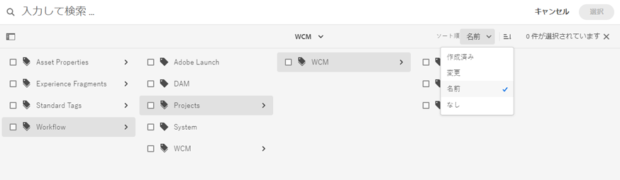

# デジタルアセットの整理 {#organize-digital-assets}

| バージョン | 記事リンク |
| -------- | ---------------------------- |
| AEM 6.5 | [ここをクリックしてください](https://experienceleague.adobe.com/docs/experience-manager-65/assets/managing/organize-assets.html?lang=ja) |
| AEM as a Cloud Service | この記事 |

Microsoft® Office および PDF ドキュメントのすべてのデジタルアセット、メタデータおよびコンテンツが抽出され、検索可能になります。検索することでアセットの高度なフィルター処理が可能になり、適切な権限を完全に活用できます。メタデータについて詳しくは、「デジタルアセット管理」の「メタデータ」で説明しています。

[!DNL Experience Manager Assets] では、コンテンツを整理するための方法が複数サポートされています。フォルダーを使用して階層的な方法で構成したり、順序のないアドホックな方法（タグなど）で構成したりできます。ユーザーは DAM アセットエディターでタグを編集でき、サブアセット、レンディションおよびメタデータが表示されます。

<!-- Commenting to pull down the existing content before applying changes wrt CQDOC-15930
## Create folders {#create-folders}

When organizing a collection of assets, for example, all *Nature* images, you can create folders to keep them together. You can use folders to categorize and organize your assets. [!DNL Assets] does not require you to organize assets in folders to work better.

>[!NOTE]
>
>Sharing an Assets folder (in Marketing Cloud) of the type `sling:OrderedFolder`, is not supported. If you want to share a folder, do not select Ordered when creating a folder.

1. Navigate to the place in your digital assets folder where you want to create a folder.
1. In the menu, click **[!UICONTROL Create]**. Select **[!UICONTROL New Folder]**.
1. In the **[!UICONTROL Title]** field, provide a folder name. By default, DAM uses the title that you provided as the folder name. Once the folder is created, you can override the default and specify another folder name.
1. Click **[!UICONTROL Create]**. Your folder is displayed in the digital assets folder.

## Add CUG properties to folders {#add-cug-properties-to-folders}

You can limit who can access certain folders in Assets by making the folder part of a closed user group (CUG). To make a folder part of a CUG:

1. In Assets, right-click the folder you want to add closed user group properties for and select **Properties**.  
1. Click the **CUG** tab.
1. Select the **Enabled** check box to make the folder and its assets available only to a closed user group.  
1. Browse to the login page, if there is one, to add that information. Add admitted groups by clicking **Add item**. If necessary, add the realm. Click **OK** to save your changes.

## Use tags to organize assets {#use-tags-to-organize-assets}

You can use folders or tags or both to organize assets. Adding tags to assets makes them easier to retrieve during a search. To add tags to an asset, follow these steps:

1. In the Digital Asset Manager, double-click the asset to open it.
1. In the **Tags** area, open the menu to reveal the available tags. Select tags as appropriate. To delete a tag, hover the pointer over the tag and click `X` to delete it.
1. Click **Save** to save any tags you added.

Date24/08/2021
-->

## フォルダー内のアセットの整理 {#organize-using-folders}

アセットを整理する最も基本的な方法は、アセットをフォルダーに保存することです。これは、ローカルファイルシステムでファイルをフォルダーに整理する場合と似ています。フォルダーの作成および管理方法について詳しくは、[アセットの管理](manage-digital-assets.md)を参照してください。ファイルおよびフォルダーの命名方法、サブフォルダーの配置およびこれらのフォルダー内にあるファイルの処理方法は、これらのアセットの処理方法に大きな影響を与える可能性があります。ファイルおよびフォルダーの一貫性のある適切な命名戦略を、優れたメタデータプラクティスと共に使用すると、デジタルアセットリポジトリーを最大限に活用できます。

* 通常、デジタルアセットリポジトリーは増大し続けます。したがって、コンテンツ作成サイクルの早い段階で、メタデータの使用方法、フォルダー構造およびファイル命名規則を標準化することが重要です。
* フォルダーは、デジタルアセットに対して一貫性のあるストレージ構造を適用する目的のみで使用します。一貫性をもたせることで、プロセスやアセットを管理しやすくなります。例えば、アセットを次の種類のフォルダーに配置することで、アセットを区別することができます。

   * **開発フォルダー**：現在作業中のデジタルアセットを格納します。
   * **クライアントフォルダー**：クライアント名またはプロジェクト名に応じてデジタルアセットを格納します。
   * **プライマリフォルダー**：オリジナルのソースデジタルアセットを格納します。
   * **レンディションフォルダー**：オリジナルのソースデジタルアセットのレンディションおよびコピーを格納します。
   * **ファイルサイズフォルダー**：ファイルサイズの大、中、小に応じてデジタルアセットを格納します。
   * **ステージングフォルダー**：Web サイトへの公開の準備ができたデジタルアセットを格納します。
   * **MIME タイプフォルダー**：画像、ドキュメント、マルチメディアなど MIME タイプ専用のデジタルア-セットを格納します。
   * **アーカイブフォルダー**：公開を終了したデジタルアセットを格納します。
   * **日付ベースのフォルダー**：作成日または最終変更日に基づいてデジタルアセットを格納します。

* カスタマイズや自動化が継続して機能するように、変更の可能性が低いフォルダーのディレクトリを作成します。例えば、割り当てられた処理プロファイルが引き続き機能するようにします。
* 公開済みのアセットを、[!DNL Experience Manager] を使用して別のフォルダーに移動し、新しい場所から再度公開するとします。こうすると、新しく再公開したアセットと共に、最初に公開したアセットの場所も引き続き使用できます。ただし、最初に公開したアセットは [!DNL Experience Manager] にとっては&#x200B;*消失*&#x200B;しているので、非公開にすることができません。したがって、ベストプラクティスとしては、まずアセットを非公開にしてから、別のフォルダーに移動します。

## タグを使用したアセットの整理 {#use-tags-to-organize-assets}

アセットにタグを追加すると、検索時にアセットを取得しやすくしたり、検索結果を使用してコレクションを作成したり、一部のアセットの検索ランキングを上げたり、アセット検出用に Adobe Sensei の AI アルゴリズムを適用したりできます。

[!DNL Adobe Experience Manager Assets] では、自己学習アルゴリズムを使用して、非常にわかりやすいタグが作成されるので、ユーザーは数回クリックするだけで適切なアセットを見つけることができます。スマートタグでは、Adobe Sensei、人工知能および機械学習フレームワークを使用します。これらは、標準タグとビジネス固有のタグの両方を認識して画像に適用するようにトレーニングできます。スマートタグでは、コンテンツや個々の単語またはフレーズを識別して、わかりやすいタグをアセットに自動的に適用することもできます。

アセットにタグを追加する手順は次のとおりです。

1. [!DNL Experience Manager Assets] にログインします。
1. **[!UICONTROL アセット]**／**[!UICONTROL ファイル]**&#x200B;をクリックし、アセットを選択して&#x200B;**[!UICONTROL プロパティ]**&#x200B;をクリックして、アセットのプロパティを開きます。
1. 「**[!UICONTROL 基本]**」タブで、**[!UICONTROL タグ]**&#x200B;メタデータのフォルダーアイコンをクリックします。ポップアップウィンドウが開きます。
1. `cq-tags` の既存のタグから適切なタグを検索または選択します。アセットには複数のタグを割り当てることができます。

   タグの構造は、**[!UICONTROL 名前]**（アルファベット順）、**[!UICONTROL 作成]**&#x200B;日、**[!UICONTROL 変更]**&#x200B;日を基準に、昇順または降順に並べ替えることができます。以下の図では、タグの構造を&#x200B;**[!UICONTROL 名前]**&#x200B;を基準にアルファベット順にソートしています。

   

1. 「**保存**」をクリックして、アセットメタデータの変更を更新します。

詳しくは、次の記事を参照してください。

* [アセットメタデータの編集](meta-edit.md)
* [アセットのスマートタグ](smart-tags.md)
* [検索パネルへのタグの述語の追加](/help/assets/search-facets.md#adding-a-tags-predicate)

## コレクションとして整理する {#organize-as-collections}

[!DNL Experience Manager Assets] のアセットコレクションを使用すると、アセットを作成、編集およびユーザー間で共有する機能を効率化できます。使用方法に基づいて複数のタイプのコレクションを作成できます。例えば、アセット、フォルダー、コレクションの静的な参照リストを含んだコレクションや、検索条件に基づいてアセットを取り込んだコレクションなどで作成できます。様々な場所のアセットでコレクションを作成し、様々なアクセスレベル、表示権限および編集権限を持つ複数のユーザーと共有できます。

詳しくは、[コレクションの管理](manage-collections.md)を参照してください。

## プロファイルを使用したアセットの整理 {#organize-to-use-profiles}

処理プロファイルには、事前定義済みフォルダーにアップロードされたアセットに適用される [!DNL Assets] 処理コマンドが含まれています。プロファイルは、フォルダーのコンテンツや新しくアップロードされたアセットの処理を自動化するために使用されます。プロファイルを使用すると、アセットをより良く整理することができます。

メタデータの使用方法、ファイル命名規則およびフォルダー構造を標準化することで、デジタルアセットのプールが拡大しても、より高い精度と一貫性を保って、フォルダーに処理プロファイルを適用できます。

**関連情報**

* [アセットを翻訳](translate-assets.md)
* [Assets HTTP API](mac-api-assets.md)
* [AEM Assets as a Cloud Service でサポートされているファイル形式](file-format-support.md)
* [アセットを検索](search-assets.md)
* [接続されたアセット](use-assets-across-connected-assets-instances.md)
* [アセットレポート](asset-reports.md)
* [メタデータスキーマ](metadata-schemas.md)
* [アセットをダウンロード](download-assets-from-aem.md)
* [メタデータを管理](manage-metadata.md)
* [検索ファセット](search-facets.md)
* [コレクションを管理](manage-collections.md)
* [メタデータの一括読み込み](metadata-import-export.md)
* [AEM および Dynamic Media へのアセットの公開](/help/assets/publish-assets-to-aem-and-dm.md)

>[!MORELIKETHIS]
>
>* [アセットマイクロサービスと処理プロファイルの使用](asset-microservices-configure-and-use.md)
>* [メタデータプロファイル](metadata-profiles.md)
>* [ビデオプロファイル](/help/assets/dynamic-media/video-profiles.md)
>* [Dynamic Media 画像プロファイル](/help/assets/dynamic-media/image-profiles.md)

