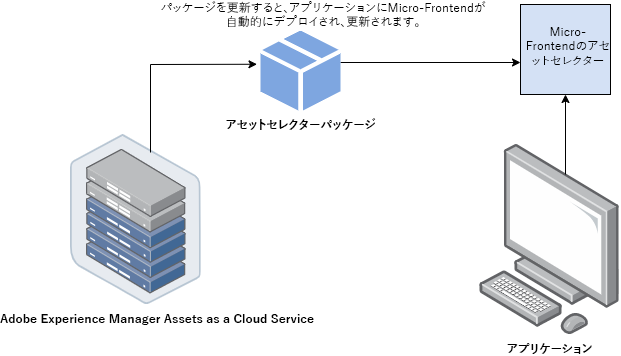
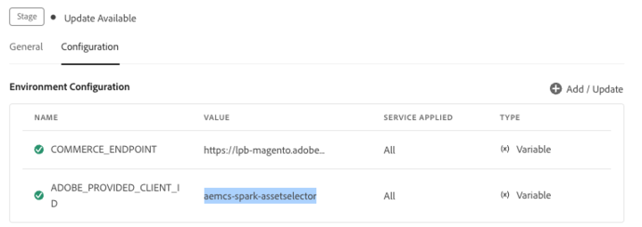
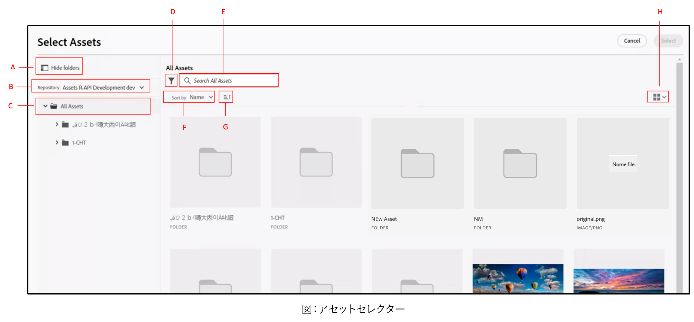
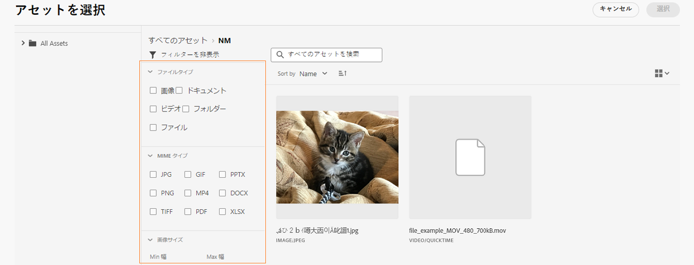

# マイクロフロントエンドアセットセレクター {#Overview}

<table>
    <tr>
        <td>
            <sup style= "background-color:#008000; color:#FFFFFF; font-weight:bold"><i>新規</i></sup> <a href="/help/assets/dynamic-media/dm-prime-ultimate.md"><b>Dynamic Media Prime と Ultimate</b></a>
        </td>
        <td>
            <sup style= "background-color:#008000; color:#FFFFFF; font-weight:bold"><i>新規</i></sup> <a href="/help/assets/assets-ultimate-overview.md"><b>AEM Assets Ultimate</b></a>
        </td>
        <td>
            <sup style= "background-color:#008000; color:#FFFFFF; font-weight:bold"><i>新規</i></sup> <a href="/help/assets/integrate-aem-assets-edge-delivery-services.md"><b>AEM Assets と Edge Delivery Services の統合</b></a>
        </td>
        <td>
            <sup style= "background-color:#008000; color:#FFFFFF; font-weight:bold"><i>新規</i></sup> <a href="/help/assets/aem-assets-view-ui-extensibility.md"><b>UI 拡張機能</b></a>
        </td>
          <td>
            <sup style= "background-color:#008000; color:#FFFFFF; font-weight:bold"><i>新規</i></sup> <a href="/help/assets/dynamic-media/enable-dynamic-media-prime-and-ultimate.md"><b>Dynamic Media Prime と Ultimate の有効化</b></a>
        </td>
    </tr>
    <tr>
        <td>
            <a href="/help/assets/search-best-practices.md"><b>検索のベストプラクティス</b></a>
        </td>
        <td>
            <a href="/help/assets/metadata-best-practices.md"><b>メタデータのベストプラクティス</b></a>
        </td>
        <td>
            <a href="/help/assets/product-overview.md"><b>コンテンツハブ</b></a>
        </td>
        <td>
            <a href="/help/assets/dynamic-media-open-apis-overview.md"><b>OpenAPI 機能を備えた Dynamic Media</b></a>
        </td>
        <td>
            <a href="https://developer.adobe.com/experience-cloud/experience-manager-apis/"><b>AEM Assets 開発者向けドキュメント</b></a>
        </td>
    </tr>
</table>

マイクロフロントエンドアセットセレクターは、[!DNL Experience Manager Assets] リポジトリと簡単に統合できるユーザーインターフェイスを提供します。ユーザーはこれにより、リポジトリで使用可能なデジタルアセットを参照または検索し、アプリケーションのオーサリングエクスペリエンスで使用できるようになります。

アセットセレクターパッケージを使用すると、マイクロフロントエンドのユーザーインターフェイスをアプリケーションエクスペリエンスで利用できるようになります。パッケージのアップデートはすべて自動的に読み込まれ、デプロイされた最新のアセットセレクターがアプリケーション内に自動的に読み込まれます。



アセットセレクターには、次のような多くの利点があります。

* Vanilla JavaScript ライブラリを使用して、あらゆる[アドビ](/help/assets/integrate-asset-selector-adobe-app.md)アプリケーションまたは[アドビ以外](/help/assets/integrate-asset-selector-non-adobe-app.md)のアプリケーションと簡単に統合できます。
* アセットセレクターパッケージのアップデートがアプリケーションで使用可能なアセットセレクターに自動的にデプロイされるため、管理が簡単です。最新の修正内容を読み込むために、アプリケーション内でアップデートを行う必要がありません。
* アプリケーション内のアセットセレクターの表示を制御するプロパティを利用できるため、カスタマイズが容易です。
* フルテキスト検索、標準のフィルターおよびカスタマイズされたフィルターを使用して、オーサリングエクスペリエンス内で使用するアセットにすばやく移動できます。
* IMS 組織内のリポジトリを切り替えて、アセットを選択できます。
* 名前、寸法、サイズでアセットを並べ替えたり、リスト、グリッド、ギャラリー、ウォーターフォールの各レイアウトでアセットを表示したりできます。

<!--Perform the following tasks to integrate and use Asset Selector with your [!DNL Experience Manager Assets] repository:

1. [Install Asset Selector](#installation)
2. [Integrate Asset Selector using Vanilla JS](#integration-using-vanilla-js)
3. [Use Asset Selector](#using-asset-selector)
-->

<!--
## Setting up Asset Selector {#asset-selector-setup}


-->

## 前提条件{#prereqs}

次の通信方法を確保する必要があります。

* ホストアプリケーションは HTTPS で実行されています。
* `localhost`でアプリケーションを実行することはできません。アセットセレクターをローカルマシンに統合する場合は、 `[https://<your_campany>.localhost.com:<port_number>]` などのカスタムドメインを作成し、このカスタムドメインを `redirectUrl list`に追加する必要があります。
* それぞれの `imsClientId` で、clientID を設定して AEM Cloud Service 環境 変数に追加できます。
<!--* You can configure and add `ADOBE_PROVIDED_CLIENT_ID` into the AEM Cloud Service environment variable with the respective `imsClientId`.
-->
* IMS 有効範囲のリストは、環境構成で定義する必要があります。
* アプリケーションの URL は、IMS クライアントのリダイレクト URL の許可リストにある。
* IMS ログインフローは、web ブラウザーのポップアップを使用して設定およびレンダリングされる。そのため、ターゲットブラウザーでポップアップを有効または許可する必要があります。

アセットセレクターの IMS 認証ワークフローが必要な場合は、上記の前提条件を使用します。または、IMS ワークフローで既に認証されている場合は、代わりに IMS 情報を追加できます。

**詳しくは、以下を参照してください**。

* [アセットセレクターとアドビアプリの統合](/help/assets/integrate-asset-selector-adobe-app.md)
* [アセットセレクターとアドビ以外のアプリの統合](/help/assets/integrate-asset-selector-non-adobe-app.md)
* [アセットセレクターダイナミックメディア 開く API の統合](/help/assets/integrate-asset-selector-dynamic-media-open-api.md)


>[!IMPORTANT]
>
> このリポジトリは、アセットセレクターを統合するために使用可能な API と使用例について説明した補足ドキュメントとして機能することを目的としています。アセットセレクターをインストールまたは使用する前に、Experience Manager Assets as a Cloud Service プロファイルの一部としてアセットセレクターへのアクセスがプロビジョニングされていることを確認します。プロビジョニングされていない場合、これらのコンポーネントを統合または使用することはできません。プロビジョニングをリクエストするには、プログラム管理者が Admin Console から P2 としてマークされたサポートチケットを発行し、次の情報を含める必要があります。
>
>* 統合アプリケーションがホストされるドメイン名。
>* プロビジョニング後、アセットセレクターの設定に不可欠な、リクエストされた環境に対応する `imsClientId`、`imsScope` および `redirectUrl` が組織に提供されます。これらの有効なプロパティがないと、インストール手順を実行できません。

## インストール {#installation}

アセットセレクターは、ESM CDN 経由（例：[esm.sh](https://esm.sh/)／[skypack](https://www.skypack.dev/)）および [UMD](https://github.com/umdjs/umd) バージョン経由のいずれでも使用できます。

**UMD バージョン**&#x200B;を使用しているブラウザー（推奨）：

```
<script src="https://experience.adobe.com/solutions/CQ-assets-selectors/static-assets/resources/assets-selectors.js"></script>

<script>
  const { renderAssetSelector } = PureJSSelectors;
</script>
```

**ESM CDN バージョン**&#x200B;を使用している `import maps` 対応ブラウザー：

```
<script type="module">
  import { AssetSelector } from 'https://experience.adobe.com/solutions/CQ-assets-selectors/static-assets/resources/@assets/selectors/index.js'
</script>
```

**ESM CDN バージョン**&#x200B;を使用している Deno/Webpack Module Federation：

```
import { AssetSelector } from 'https://experience.adobe.com/solutions/CQ-assets-selectors/static-assets/resources/@assets/selectors/index.js'
```

## アセットセレクターの使用 {#using-asset-selector}

アセットセレクターを設定し、[!DNL Adobe Experience Manager] as a [!DNL Cloud Service] アプリケーションでアセットセレクターの使用が認証されると、アセットを選択したり、その他の様々な操作を実行してリポジトリ内でアセットを検索したりできます。



* **A**：[パネルの非表示／表示](#hide-show-panel)
* **B**：[リポジトリスイッチャー](#repository-switcher)
* **C**：[アセット](#repository)
* **D**：[フィルター](#filters)
* **E**：[検索バー](#search-bar)
* **F**：[並べ替え](#sorting)
* **G**：[昇順または降順での並べ替え](#sorting)
* **H**：[表示](#types-of-view)

### パネルの非表示／表示 {#hide-show-panel}

左側のナビゲーションでフォルダーを非表示にするには、「**[!UICONTROL フォルダーを非表示]**」アイコンをクリックします。変更を元に戻すには、「**[!UICONTROL フォルダーを非表示]**」アイコンを再度クリックします。

### リポジトリスイッチャー {#repository-switcher}

アセットセレクターを使用すると、アセットを選択するためにリポジトリを切り替えることもできます。左側のパネルにあるドロップダウンから、目的のリポジトリを選択できます。ドロップダウンリストで使用できるリポジトリオプションは、`index.html` ファイルで定義されている `repositoryId` プロパティに基づいています。これは、ログインしているユーザーがアクセスする、選択された IMS 組織の環境に基づいています。消費者は優先する `repositoryID` を渡すことができ、その場合、アセットセレクターはリポジトリスイッチャーのレンダリングを停止し、指定されたリポジトリからのみアセットをレンダリングします。

### アセットリポジトリ

操作の実行に使用できるアセットフォルダーのコレクションです。

### 標準のフィルター {#filters}

アセットセレクターには、検索結果を絞り込むための標準のフィルターオプションも用意されています。次のフィルターを使用できます。

* **[!UICONTROL ステータス]：**&#x200B;アセットの現在の状態（`all`、`approved`、`rejected`、`no status`）が含まれます。
* **[!UICONTROL ファイルタイプ]：**`folder`、`file`、`images`、`documents`、`video` が含まれます。
* **[!UICONTROL 有効期限ステータス]：**&#x200B;有効期限に基づいてアセットに言及します。`[!UICONTROL Expired]`チェックボックスをオンにして有効期限切れのアセットをフィルタリングするか、アセットの `[!UICONTROL Expiration Duration]` を設定し、有効期限に基づいてアセットを表示できます。アセットの有効期限が既に切れている場合や、有効期限切れが近い場合は、その旨を示すバッジが表示されます。さらに、有効期限切れのアセットの使用状況（またはドラッグ＆ドロップ）を許可するかどうかを制御できます。詳しくは、[有効期限切れのアセットのカスタマイズ](/help/assets/asset-selector-customization.md#customize-expired-assets)を参照してください。デフォルトでは、今後 30 日以内に有効期限が切れるアセットに対して&#x200B;**間もなく期限切れ**&#x200B;バッジが表示されます。ただし、`expirationDate` プロパティを使用して有効期限を設定できます。

  >[!TIP]
  >
  > 将来の有効期限に基づいてアセットを表示またはフィルタリングする場合は、「`[!UICONTROL Expiration Duration]`」フィールドに将来の日付範囲を指定します。これにより、**間もなく期限切れ**&#x200B;バッジが付いたアセットが表示されます。

* **[!UICONTROL MIME タイプ]：**`JPG`、`GIF`、`PPTX`、`PNG`、`MP4`、`DOCX`、`TIFF`、`PDF`、`XLSX` が含まれます。
* **[!UICONTROL 画像サイズ]：**&#x200B;画像の最小／/最大の幅、最小／最大の高さが含まれます。

  

### カスタム検索

フルテキスト検索の他に、アセットセレクターでは、カスタマイズされた検索を使用してファイル内のアセットを検索できます。カスタム検索フィルターは、モーダル表示モードとパネル表示モードの両方で使用できます。


また、デフォルトの検索フィルターを作成して、頻繁に検索するフィールドを保存し、後で使用することもできます。アセットのカスタム検索を作成するには、`filterSchema` プロパティを使用できます。

### 検索バー {#search-bar}

アセットセレクターを使用すると、選択したリポジトリ内のアセットに対してフルテキスト検索を実行できます。例えば、検索バーにキーワード「`wave`」を入力すると、メタデータプロパティのいずれかでキーワード「`wave`」が記述されているアセットがすべて表示されます。

### 並べ替え {#sorting}

アセットセレクター内のアセットを、アセットの名前、寸法、サイズで並べ替えることができます。アセットを昇順または降順で並べ替えることもできます。

### 表示の種類 {#types-of-view}

アセットセレクターを使用すると、次の 4 つの異なるビューでアセットを表示できます。

*  [!UICONTROL **リスト表示**]：リスト表示では、スクロール可能なファイルとフォルダーが 1 列に表示されます。
*  [!UICONTROL **グリッド表示**]：グリッド表示では、スクロール可能なファイルとフォルダーは、行と列のグリッド形式で表示されます。
*  [!UICONTROL **ギャラリー表示**]：ギャラリー表示では、ファイルやフォルダーは、中央に固定された水平リストに表示されます。
*  [!UICONTROL **ウォーターフォール**&#x200B;表示]：ウォーターフォール表示では、ファイルやフォルダーがブリッジ図形式で表示されます。

## 主な機能の詳細 {#key-capabilities-asset-selector}

<table>
<tr>
    <td>
        <br/>
        <a href="integrate-asset-selector.md">アセットセレクターの統合</a>
        <p>
        <em>アセットセレクターを複数のアプリケーションと統合する様々な機能について説明します。
        </p>
     </td>
    <td>
        <br/>
        <a href="integrate-asset-selector.md">アセットセレクターとアドビアプリケーションの統合</a>
        <p>
        <em>アセットセレクターを様々なアドビアプリケーションと統合する方法について説明します。</em>
        </p>
    </td>
    <td>
        <br/>
        <a href="integrate-asset-selector.md">アセットセレクターとサードパーティアプリケーションの統合</a>
        <p>
        <em>アセットセレクターをアドビ以外のアプリケーションと統合する機能について説明します。</em>
        </p>
    </td>
    <td>
        <br/>
        <a href="integrate-asset-selector.md">アセットセレクターと Dynamic Media Open API の統合</a>
        <p>
        <em>アセットセレクターと Dynamic Media Open API を統合する方法について説明します。</em>
        </p>
     </td>
     <td>
        <br/>
        <a href="asset-selector-customization.md">アセットセレクターのプロパティ</a>
        <p>
        <em>フィルター、アセットの選択、有効期限切れのアセットなど、アセットセレクターの様々なコンポーネントをカスタマイズする基本について説明します。</em>
        </p>
    </td>
</tr>
<tr>
    <td>
        <br/>
        <a href="asset-selector-customization.md">アセットセレクターの例</a>
        <p>
        <em>実際的な方法でプロパティの使用方法について説明します。</em>
        </p>
    </td>
    <td>
        <br/>
        <a href="asset-selector-customization.md">アセットセレクターのカスタマイズ</a>
        <p>
        <em>ユーザビリティに基づいて、アセットセレクターの様々なコンポーネントを設定およびカスタマイズします。</em>
        </p>
    </td>
    <td>
        <br/>
        <a href="asset-selector-upload.md">アセットセレクターのアップロード</a>
        <p>
        <em>ローカルまたはサードパーティのファイルシステムからアセットセレクターにファイルまたはフォルダーをアップロードする方法について説明します。</em>
        </p>
    </td>
     <td>
        <br/>
        <a href="asset-selector-collections.md">アセットセレクターのコレクション</a>
        <p>
        <em>Experience Manager リポジトリを使用してアセットセレクター内でコレクションを使用する方法について説明します。</em>
        </p>
    </td>
    <td>
    </td>
</tr>
</table>

>[!MORELIKETHIS]
>
>* [アセットセレクターのカスタマイズ](/help/assets/asset-selector-customization.md)
>* [アセットセレクターと様々なアプリケーションの統合](/help/assets/integrate-asset-selector.md)
>* [アセットセレクターのプロパティ](/help/assets/asset-selector-properties.md)
>* [OpenAPI 機能を備えた Dynamic Media とのアセットセレクターの統合](/help/assets/integrate-asset-selector-dynamic-media-open-api.md)
