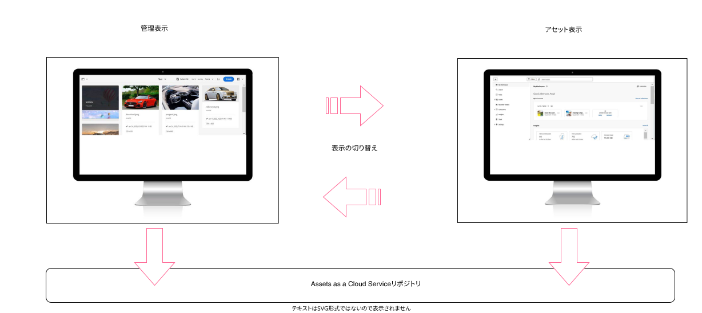

# AEM でのデジタルアセット管理のための Assets as a [!DNL Cloud Service] の概要 {#assets-cloud-service-introduction}

<!-- Need review information from gklebus -->

Adobe Experience Manager Assets as a [!DNL Cloud Service] は、クラウドネイティブな PaaS ソリューションです。企業がデジタルアセット管理と Dynamic Media 操作を迅速かつ効果的に行うためだけでなく、常に最新で常に可用性が高く常に学習可能なシステム内から AI や機械学習などの次世代スマート機能を使用するうえでも役に立ちます。

大量のアセットや複雑なアセットを同時に取り込む作業は、Experience Manager オーサーインスタンスにとってリソースを消費することになります。アセットの追加、処理、移行時に、プライマリインスタンスは CPU の処理能力、メモリ容量、I/O リソースを大量に消費します。このようなパフォーマンス上の問題は、エンドユーザーのオーサリングおよび閲覧操作に影響を与えます。

企業では、マルチデバイス、地域横断、多言語の使用例について、様々なファイル形式とコンテンツ解像度をサポートする必要があります。アセットの処理とストレージの要件に基づいて必要になるリソースと機能によっては、従来のソリューションに過度の負担がかかるおそれがあります。また、アセット処理の技術的な制限事項によって、望ましい結果が得られないこともあれば、ストレージのコストが利益率の低下を招くこともあります。

まず、デジタルアセット管理のための[クラウドネイティブ製品のメリット](#solution-benefits)を理解します。[Experience Manager as a [!DNL Cloud Service]](/help/release-notes/aem-cloud-changes.md) の主な変更点を確認します。これらの変更は Experience Manager Assets にも影響を及ぼします（[Assets の主な変更点](/help/assets/assets-cloud-changes.md)を参照）。

[新しい Assets の機能の詳細](#whats-new-assets)と[既知の問題](/help/release-notes/maintenance/latest.md)を理解します。[非推奨（廃止予定）または削除された機能](/help/release-notes/deprecated-removed-features.md)リストを参照して、このリリースで削除された機能を確認してください。最後に、この[用語集](/help/overview/terminology.md)を利用して Experience Manager の用語を理解します。

## ソリューションのメリット {#solution-benefits}

デジタルアセット管理のための Assets as a [!DNL Cloud Service] の主なメリットは次のとおりです。詳しくは、[Adobe Experience Manager as a [!DNL Cloud Service]](/help/overview/introduction.md) の概要を参照してください。

* **アセット処理のための最新のクラウドサービス**：新しいアセットマイクロサービスは、クラウドベースで、拡張性と信頼性に優れ、手間のかからないアセット処理サービスです。
* **高い拡張性**：あらゆるタイプのデプロイメントに対応できる柔軟な拡張性があります。必要に応じて、実質的に無制限のリソースをオンデマンドで利用できます。従来のシステムと比較して、必要以上に高機能な設計にならないようにすることで設計のコストを削減できます。
* **最新のソフトウェア**：常に最新で、常に更新されています。すべてのユーザーが、利用できるすべてのパッチ、機能、セキュリティ、バグ修正を含んだ最新のソフトウェアだけを使用します。開発者とインテグレーターは最新の API セットを使用して作業し、マルチバージョンのサポートに関する問題を回避できます。
* **常にオンライン**：バックアップと冗長性を備えたクラスターにデプロイされたインスタンスのおかげで、ダウンタイムなし（0dt）を実現しています。アップグレードも 0dt です。
* **継続的な監視**：システムの監視は自動化され、組み込みのチェックとトリガーがパフォーマンス、可用性、全体的な堅牢性の維持に役立ちます。
* **手間のかからないデプロイメント**：Experience Manager as a Cloud Service の操作は完全に自動化されており、手動の介入は不要です。自動デプロイメントを行うために、カスタムコードを含んだデプロイ可能な Docker イメージのビルドを Cloud Manager（CM）コンポーネントで自動化します。

## デジタルアセット管理で使用可能なペルソナベースのエクスペリエンス {#persona-based-experiences}

アドビでは、デジタルアセットを最大限に活用するための堅牢なデジタルアセット管理（DAM）ソリューションを提供しています。Adobe Experience Manager Assets には、同じ Cloud Services リポジトリを使用する 2 つの異なるエクスペリエンスがあります。

* **管理ビュー**：既存の Assets as a Cloud Service ユーザーインターフェイス。管理ビューは、統合、ワークフロー、コンテンツの自動化、公開など、すべての高度なデジタルアセット管理機能に使用できます。

* **アセットビュー**：アドビの軽量なアセット管理エクスペリエンスで、デジタルアセットの保存、管理、検出および使用が実現します。合理化されたユーザーインターフェイスには、重要なデジタルアセット管理機能が含まれます。アップロード、メタデータの管理、検索、ダウンロードおよび共有に重点を置いた軽量な DAM ユーザー向けに設計されています。

管理ビューへのアクセス権を持つユーザーは、アセットビューにもアクセスできます。アセットビューのシンプルなユーザーインターフェイスにより、デジタルアセットの管理、検出、配布が容易になります。クリエイティブ、マーケティング、事業部門のチームなど、異なる部門をまたいだ幅広いユーザーが、アセットで共同作業を行い、必要に応じて適切な承認済みアセットにアクセスできます。多くの一般的な DAM ユーザーは、機能のサブセットのみを含むアセットビューを好みます。このエクスペリエンスの対象は、クリエイティブ、読み取り専用アセットの消費者、より軽量な DAM ユーザーです。

DAM ライブラリ担当者、開発者およびスーパーユーザーは、必要に応じて、引き続き管理ビューを使用したり、ユーザーインターフェイスを切り替えたりできます。自分の役割に最適なエクスペリエンスを選択できます。

アセットビューへのアクセス方法および管理ビューで提供される簡略化について詳しくは、[アセットビューの概要](/help/assets/assets-view-introduction.md)を参照してください。

## Edge Delivery Services 向けのドキュメントベースのオーサリングとの統合 {#integrate-doc-authoring-edge-and-assets}

Edge 配信を使用すると、作成者がコンテンツをすばやく更新および公開でき、新しいサイトを迅速に起動できる、魅力的な迅速な web サイトを作成できます。

AEM Assets を Edge Delivery Services のドキュメントベースのオーサリングと統合すると、web サイト作成者は Microsoft Word または Google Docs でドキュメントをオーサリングしながら、AEM Assets リポジトリで使用可能な画像を使用できます。詳しくは、[AEM Assets とドキュメントベースのオーサリングの統合](/help/edge/using.md#integrate-assets-edge)を参照してください。

## Adobe Journey Optimizer との統合 {#integration-with-ajo}

[Adobe Journey Optimizer](https://business.adobe.com/jp/products/journey-optimizer/adobe-journey-optimizer.html) では、お客様のジャーニー管理を簡素化し、オムニチャネルキャンペーンにインテリジェントな意思決定とインサイトを提供します。Journey Optimizer を使用してメッセージをデザインする際、Journey Optimizer インターフェイス内から Assets as a Cloud Service リポジトリに直接アクセスできます。ユーザーは、Experience Manager Assets の組み込みユーザーインターフェイスを使用して、アセットにアクセスできます。詳しくは、[Experience Manager Assets を使用したアセットの作成と管理](https://experienceleague.adobe.com/docs/journey-optimizer/using/content-management/assets-images/assets.html?lang=ja)を参照してください。

## 新しい Assets の機能 {#whats-new-assets}

重要な新機能は次のとおりです。

* [アセットマイクロサービス](/help/assets/asset-microservices-overview.md)
* [アセットのアップロード方法](/help/assets/add-assets.md)

**関連情報**

* [アセットを翻訳](translate-assets.md)
* [Assets HTTP API](mac-api-assets.md)
* [AEM Assets as a Cloud Service でサポートされているファイル形式](file-format-support.md)
* [アセットを検索](search-assets.md)
* [接続されたアセット](use-assets-across-connected-assets-instances.md)
* [アセットレポート](asset-reports.md)
* [メタデータスキーマ](metadata-schemas.md)
* [アセットをダウンロード](download-assets-from-aem.md)
* [メタデータを管理](manage-metadata.md)
* [検索ファセット](search-facets.md)
* [コレクションを管理](manage-collections.md)
* [メタデータの一括読み込み](metadata-import-export.md)
* [AEM および Dynamic Media へのアセットの公開](/help/assets/publish-assets-to-aem-and-dm.md)
