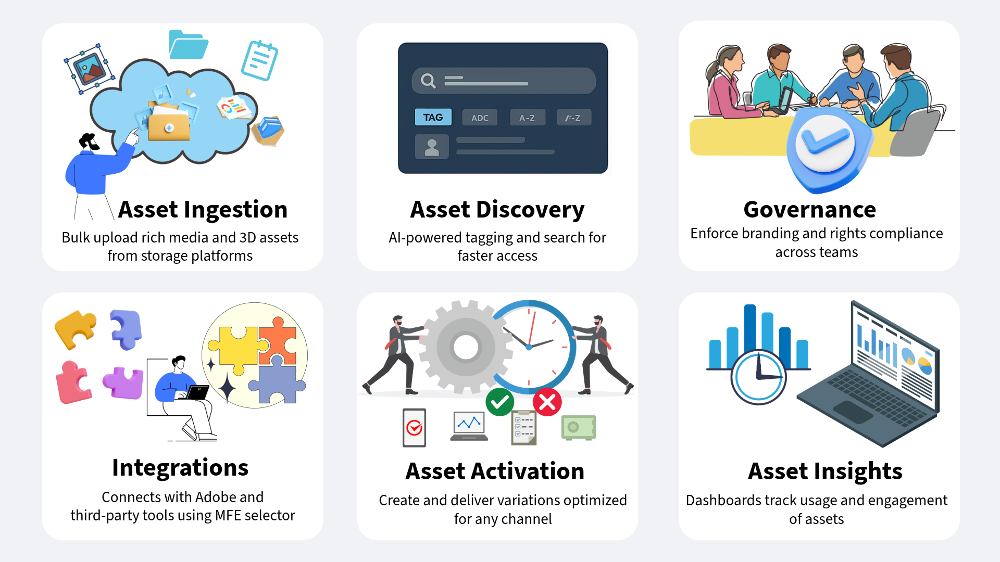

# AEMでのデジタルアセット管理のためのAssets as a Cloud Serviceの概要 {#assets-as-cloud-service-digital-asset-management-aem}

Adobe Experience Manager Assets as a Cloud Service は、クラウドネイティブな PaaS ソリューションです。企業がデジタルアセット管理と Dynamic Media 操作を迅速かつ効果的に行うだけでなく、常に最新で常に可用性が高く常に学習可能なシステム内から AI や機械学習などの次世代スマート機能を使用するうえでも役に立ちます。

アドビでは、デジタルアセットを最大限に活用するための堅牢なデジタルアセット管理（DAM）ソリューションを提供しています。Adobe Experience Manager Assetsには、要件に合わせて同じ Cloud Services リポジトリを使用する 2 つの異なるエクスペリエンスがあります。 AEM Assetsのペルソナベースのエクスペリエンスについては、[Available persona based experience for Digital Asset Management](#persona-based-experiences) を参照してください。

AEM Assets UltimateおよびAEM Assets Primeのサービスについて詳しくは、[Assets as a Cloud Service Ultimate](/help/assets/assets-ultimate-overview.md) および [Assets as a Cloud Service Prime](/help/assets/assets-prime.md) を参照してください。

Adobe Digital Asset Management の主な機能には、次のようなものがあります。

>[!BEGINTABS]

>[!TAB  アセットの取得 ]

## アセットの取り込み {#asset-ingestion}

一括読み込み機能を使用すると、Azure、AWS、Google Cloud、Dropbox、OneDrive などのデータソースからAssets as a Cloud Serviceに多数のアセットを直接読み込むことができます。

管理者ビューまたはAssets ビューを使用して、一括読み込み操作を実行できます。 Assets ビューには、管理者ビューよりも多くのデータソースオプションが用意されています。

Adobe Experience Manager では、Web ブラウザーユーザーインターフェイスに加えて、デスクトップ上の他のクライアントもサポートしています。Web ブラウザーを使用しなくても、これらのクライアントでアップロード操作をおこなうことができます。

* Adobe Asset Link を使用すると、Adobe Photoshop、Adobe IllustratorおよびAdobe InDesign デスクトップアプリケーションのExperience Managerからアセットにアクセスできます。 これらのデスクトップアプリケーション内からAdobe Asset Link ユーザーインターフェイスで現在開いているドキュメントを直接Experience Managerにアップロードできます。

* Experience Manager デスクトップアプリケーションを使用すると、ファイルタイプやアセットを処理するネイティブアプリケーションに依存せずに、デスクトップ上でアセットを簡単に操作できます。 ブラウザーアップロードではフラットなファイルリストのアップロードのみサポートしているので、ネストされたフォルダー階層内のファイルをローカルファイルシステムからアップロードする際に便利です。

次のリンクを使用して、アセット取り込みツールに関する詳細なドキュメントにアクセスします。

<table>
<td>
   
   

      <a href="/help/assets/bulk-import-assets-view.md">
      <strong> 一括読み込みツールの使用 </strong>
      </a>
   

   

      <em> データソースから直接大量のアセットを読み込む方法を説明します </em>
   

</td>

<td>
   
   

      <a href="https://experienceleague.adobe.com/ja/docs/experience-manager-desktop-app/using/using">
      <strong>AEM デスクトップアプリケーションの使用 </strong>
      </a>
   

   

      <em>AEM デスクトップアプリケーションを使用して、ネストされたフォルダー階層内のファイルをローカルファイルシステムからアップロードする方法を説明します。</em>
   

</td>
<td>
   
   

      <a href="https://helpx.adobe.com/jp/enterprise/using/adobe-asset-link.html">
      <strong>Adobe Asset Link の使用 </strong>
      </a>
   

   

      <em>Creative Cloud アプリケーションを使用してExperience Managerにアセットをアップロードする方法について説明します </em>。
   

</td>
</table>

>[!TAB AI を活用した機能 ]

**スマートタグ**：スマートタグでは、Adobe Senseiの人工知能フレームワークを使用して、タグ構造とビジネス上の分類に基づいて画像認識アルゴリズムのトレーニングを行います。 その後、このコンテンツインテリジェンスを使用して、アセットの個々のセットに関連性の高いタグが適用されます。デフォルトでは、AEM は、アップロードされたアセットにスマートタグを自動的に適用します。

**インテリジェントカラーベースのタグ付けと検索**:AEM Assetsは、Adobe Sensei AI 機能を使用して、画像内のカラーを識別し、取り込み時に自動的にタグとして適用します。 これらのタグを使用すると、画像のカラー構成に基づいて検索エクスペリエンスを強化できます。

**AI で生成されたメタデータ**:AEM Assetsでは、AI を使用して、タイトル、説明、キーワードなどのメタデータを自動生成します。 これらの AI で生成されたフィールドは、メタデータの精度を高め、アセットの検索、分類および推奨を容易にします。このアプローチでは、手動でのタグ付けが不要なために効率が向上するだけでなく、大量のデジタルコンテンツ間の一貫性とスケーラビリティも確保できます。

**AI を活用したアセットの一括名前変更**:[Assetsビューでは、人工知能を使用して、複数のアセットの名前を一度に変更できます ](/help/assets/bulk-rename-assets-view.md)。 複数のファイルを一度に選択し、それらをまとめて名前を変更できます。 会話型の名前変更プロンプトの例としては、*すべてのファイルを「my-file」に変更して、増分番号を追加する* や *ファイルに 001、002 などのプレフィックスを付ける、などがあります。 そして英語に翻訳する*。

<table>
<td>
   
   

      <a href="/help/assets/smart-tags.md">
      <strong> アセットへの AI スマートタグの追加 </strong>
      </a>
   

   

      <em> アップロードしたアセットにスマートタグを自動的に適用する方法について説明します </em>。
   

</td>

<td>
   
   

      <a href="/help/assets/manage-notifications-assets-view.md">
      <strong> インテリジェントカラーベースのタグを追加 </strong>
      </a>
   

   

      <em> 取り込み時にカラーベースのタグを自動的に適用する方法を説明します。</em>
   

</td>
<td>
   
   

      <a href="/help/assets/metadata-assets-view.md">
      <strong>AI が生成したメタデータ </strong>
      </a>
   

   

      <em>AI を使用して、タイトルや説明などのアセットメタデータを生成します。</em>
   

</td>
</table>

**コンテキスト検索**:AEM Assetsでは、テキストプロンプトを定義して、リポジトリで使用可能なアセットを検索できます。 Experience Manager Assets は、これらのテキストプロンプトを検索フィルターに自動変換し、検索結果を表示します。フィルターペインを使用して自動フィルターを表示および変更し、検索結果をさらに絞り込むことができます。 会話型テキストプロンプトの例には、*高さが 200 ピクセル以上、幅が 100 ピクセル以上、ビーチと澄んだ空の画像* および *高さが 1500 ピクセルと 2500 ピクセルで、過去 1 か月に作成された、有効期限が切れていない承認済みの青空の画像が必要です* などがあります。

**AEM内でAdobe Fireflyを使用したアセットの生成**:AEM Assetsでは、検索クエリが結果を返さない場合に、Adobe Fireflyをリアルタイムで使用してアセットを生成できます。 また、AEM Assetsを使用すると、AEM Assets ユーザーインターフェイス内からAEM Assets リポジトリに、生成された画像をアップロードできます。

**Adobe Expressとの統合**:AEM Assetsは、Adobe Expressとネイティブに統合されており、Adobe Express ユーザーインターフェイス内から、AEM Assetsに保存されたアセットに直接アクセスできます。 また、Express 内でAdobe Firefly Artifical Intelligence を使用して、簡単なテキストプロンプトを使用して画像を生成し、Express Canvas に配置することもできます。 その後、新しいコンテンツや編集したコンテンツをAEM Assets リポジトリーに保存できます。

<table>
<td>
   
   

      <a href="/help/assets/search-assets-view.md#contextual-search">
      <strong> コンテキスト検索 </strong>
      </a>
   

   

      <em> 簡単なテキストプロンプトを使用してアセットを検索する方法を説明します。</em>
   

</td>

<td>
   
   

      <a href="/help/assets/search-assets-view.md#search-firefly">
      <strong>Adobe Fireflyを使用したアセットの生成 </strong>
      </a>
   

   

      <em>Adobe Fireflyを使用したリアルタイムのアセット生成 </em>
   

</td>
<td>
   
   

      <a href="/help/assets/native-integration-adobe-express.md">
      <strong>Adobe Expressとの統合 </strong>
      </a>
   

   

      <em>AEM Assets ユーザーインターフェイス内でAdobe Express AI 機能を使用します。</em>
   

</td>
</table>

**スマートイメージング**：スマートイメージングは、顧客のブラウザー機能に応じて画像の形式とファイルサイズを自動的に最適化することで、画像アセット配信のパフォーマンスをさらに向上させます。 既存の画像プリセットと連携し、配信時にインテリジェンスを使用します。 このインテリジェンスにより、ブラウザーとネットワーク接続速度に応じて、画像ファイルのサイズがさらに縮小されます。

**スマート切り抜き**:Adobe Sensei AI 機能で、あらゆる画像やビデオの焦点位置を自動検出し、切り抜いて維持管理します。 画面サイズに関係なく、意図した目標地点をキャプチャして、面倒な手動タスクを排除し、あらゆるデバイスや画面で整った高品質の高速読み込み画像やビデオを配信します。

**AI 生成ビデオキャプション**:Adobeの AI 生成ビデオキャプション Dynamic Media では、人工知能を使用して、ビデオコンテンツのキャプションを自動生成します。 この機能は、正確なキャプションを提供することで、アクセシビリティを向上させ、ユーザーエクスペリエンスを強化するように設計されています。キャプションは、元のオーディオ、追加のオーディオトラック、または追加のキャプションから生成され、ビデオのプロパティページの「`Captions and Audio`」タブで提供されます。 60 を超える言語がサポートされているので、ビデオを公開する前にキャプションを確認およびプレビューできます。
<table>
<td>
   
   

      <a href="/help/assets/dynamic-media/imaging-faq.md">
      <strong> スマートイメージング </strong>
      </a>
   

   

      <em> ユーザーのブラウザー機能とネットワーク速度に応じて画像の形式とファイルサイズを最適化します。</em>
   

</td>

<td>
   
   

      <a href="https://experienceleague.adobe.com/en/docs/experience-manager-learn/assets/dynamic-media/images/smart-crop-feature-video-use.html">
      <strong> スマート切り抜 </strong>
      </a>
   

   

      <em>AI を使用して、あらゆる画像やビデオの焦点位置を自動的に検出し、トリミングして維持 </em>
   

</td>
<td>
   
   

      <a href="/help/assets/dynamic-media/video.md">
      <strong>AI が生成するビデオキャプション </strong>
      </a>
   

   

      <em> 人工知能を使用して、ビデオコンテンツのキャプションを自動生成します。</em>
   

</td>
</table>

>[!TAB  アセットの検出 ]

## アセットの検出 {#asset-discovery}

アセットをAEM Assetsに読み込んだ後、そのような巨大なコレクションから適切なアセットをすばやく見つけることが課題です。

AEM Assetsには、AI 生成のタグ付け（スマートタグ）、カスタマイズされたメタデータ、検索エクスペリエンスを向上させる機能など、適切なアセットをすぐに取得できる機能が用意されています。

**メタデータ管理**：メタデータは、アセット管理ジャーニーを開始する際の最も重要な側面です。 アセットがユーザーに配布されると、メタデータの管理は管理者の管理下から完全に外されます。 効果的なアセットメタデータにより、あらゆる DAM ツールの最終的な宛先である検索が向上します。

**メタデータForms**:Assets as a Cloud Serviceには、多数の標準メタデータフィールドがデフォルトで用意されています。 追加のメタデータニーズがあり、ビジネス固有のメタデータを追加するためにさらにメタデータフィールドが必要な場合。 メタデータフォームを使用すると、ビジネスごとにアセットの詳細ページにカスタムメタデータフィールドを追加できます。ビジネス固有のメタデータにより、アセットのガバナンスと検出が向上します。フォームは、ゼロから作成することも、既存のフォームを再利用することもできます。

<table>
<td>
   
   

      <a href="/help/assets/metadata-assets-view.md">
      <strong>Assets ビューでのメタデータの管理 </strong>
      </a>
   

   

      <em>Assets ビューを使用してメタデータとメタデータフォームを管理する方法について説明します </em>。
   

</td>

<td>
   
   

      <a href="https://experienceleaguecommunities.adobe.com/t5/adobe-experience-manager-blogs/how-to-manage-metadata-before-and-after-migrating-to-aem-assets/ba-p/744298?profile.language=ja">
      <strong> メタデータ管理のベストプラクティス </strong>
      </a>
   

   

      <em> アセットをAEMに移行する前と後にメタデータを管理する方法について説明します </em>。
   

</td>
<td>
   
   

      <a href="/help/assets/manage-metadata.md">
      <strong> 管理ビューでのメタデータの管理 </strong>
      </a>
   

   

      <em> 管理者表示を使用してメタデータとメタデータフォームを管理する方法について説明します。</em>
   

</td>
</table>

**スマートタグ**：スマートタグでは、Adobe Senseiの人工知能フレームワークを使用して、タグ構造とビジネス上の分類に基づいて画像認識アルゴリズムのトレーニングを行います。 その後、このコンテンツインテリジェンスを使用して、アセットの個々のセットに関連性の高いタグが適用されます。デフォルトでは、AEM は、アップロードされたアセットにスマートタグを自動的に適用します。

**アセットを検索**：適切なメタデータを用意すると、AEM Assetsで様々な演算子、ワイルドカード、高度なクエリ、カスタムフィルターを使用して検索を実行できます。

**コンテキスト検索**:AEM Assetsには、テキストプロンプトを定義してリポジトリで使用可能なアセットを検索できるコンテキスト検索機能も用意されています。 Experience Manager Assets は、これらのテキストプロンプトを検索フィルターに自動変換し、検索結果を表示します。フィルターペインを使用して自動フィルターを表示および変更すると、検索結果をさらに絞り込むことができます。

<table>
<td>
   
   

      <a href="/help/assets/smart-tags.md">
      <strong> アセットへのスマートタグの追加 </strong>
      </a>
   

   

      <em> アップロードしたアセットにスマートタグを自動的に適用する方法について説明します </em>。
   

</td>

<td>
   
   

      <a href="/help/assets/search-assets-view.md">
      <strong>Assets ビューでのアセットの検索 </strong>
      </a>
   

   

      <em>Assets ビューでコンテキスト検索やその他の検索機能を効果的に使用する方法について説明します </em>。
   

</td>
<td>
   
   

      <a href="/help/assets/search-best-practices.md">
      <strong> 検索のベストプラクティス </strong>
      </a>
   

   

      <em>AEM ユーザーが基本的なレベルから高度なレベルまでの検索を実行するのに役立つ様々なシナリオについて説明します。</em>
   

</td>
</table>

>[!TAB  資産のガバナンス ]

## アセットの管理とガバナンス {#asset-management-governance}

アセットをAEM Assetsにアップロードし、メタデータを設定して検出性を高めると、操作しやすいAssets ビューのインターフェイスを使用して、様々なデジタルアセット管理タスクを実行できます。

**アセット管理タスク**：一部の基本的なタスクには、検索、ダウンロード、移動、コピー、名前変更、削除、更新、編集の操作が含まれます。

また、アセットのバージョンの管理、アセットのステータスの設定、アセットの有効期限の設定も行えます。

**マイWorkspace**:Assets ビューには、ウィジェットを提供するカスタマイズ可能なワークスペースも含まれています。このワークスペースは、Assets ユーザーインターフェイスの主要な領域と、最も関連性の高い情報に簡単にアクセスできます。 このページは、作業項目の概要を示し、主要なワークフローにすばやくアクセスできるワンストップソリューションとして機能します。

**Content Credentials**: AEM Assetsがサポートするもう 1 つの強力な機能は、Content Credentialsです。 ブランドは、コンテンツの透明性、AI の開示、アセットの改ざん防止について、これまで以上に関心を寄せています。AdobeのContent Authenticity Initiative（CAI）は、Coalition for Content Provenance and Authenticity （C2PA）技術標準に準拠したツールを構築します。 新しい種類の暗号化された改ざん防止メタデータである Content Credentials は、閲覧者がコンテンツの系統を理解し、ブランドアセットの整合性を確保するのに役立ちます。これらには、デジタルアセットの履歴に関するインサイトを提供する様々な来歴データを含めることができます。

<table>
<td>
   
   

      <a href="/help/assets/manage-organize-assets-view.md">
      <strong> アセット管理タスク </strong>
      </a>
   

   

      <em> アセット管理に関する基本的なタスクと高度なタスクの実行方法について説明します。</em>
   

</td>

<td>
   
   

      <a href="/help/assets/my-workspace-assets-view.md">
      <strong> マイWorkspace</strong>
      </a>
   

   

      <em>My Workspaceを使用して、Assets ユーザーインターフェイスの主要な領域にすばやくアクセスする方法を説明します。</em>
   

</td>
<td>
   
   

      <a href="/help/assets/content-credentials.md">
      <strong>Content Credentials</strong>
      </a>
   

   

      <em>Content Credentialsを使用してデジタルアセットの履歴に関するインサイトを取得します。</em>
   

</td>
</table>

**コレクション**:AEM Assetsでは、アセットをコレクションに整理することもできます。 コレクションとは、Adobe Experience Manager Assets ビュー内の一連のアセット、フォルダーまたはその他のコレクションのことです。コレクションを使用して、ユーザー間でアセットを共有します。フォルダーとは異なり、1 つのコレクションに異なる複数の場所のアセットを含めることができます。1 人のユーザーと複数のコレクションを共有できます。各コレクションには、アセットへの参照が含まれます。アセットの参照整合性はコレクション間で維持されます。

**通知**:Assetsのビュー通知を使用すると、リポジトリで使用可能なアセット、フォルダーまたはコレクションで実行された操作を監視できます。 通知を送信するコンテンツを選択し、購読する必要があります。また、通知を受け取るカテゴリを設定することもできます。

**重複アセットの検出**:AEM Assetsでは重複アセットの検出もサポートしています。 DAM ユーザーがリポジトリーに既に存在する 1 つ以上のアセットをアップロードした場合、Experience Managerは重複を検出し、ユーザーに通知します。

<table>
<td>
   
   

      <a href="/help/assets/manage-collections-assets-view.md">
      <strong> コレクションの管理 </strong>
      </a>
   

   

      <em> アセットをコレクションに整理して、アセットを効率的に共有する方法を説明します。</em>
   

</td>

<td>
   
   

      <a href="/help/assets/manage-notifications-assets-view.md">
      <strong> 通知の設定 </strong>
      </a>
   

   

      <em> アセット、フォルダーまたはコレクションで実行された操作を監視する通知を設定する方法について説明します。</em>
   

</td>
<td>
   
   

      <a href="/help/assets/detect-duplicate-assets.md">
      <strong> 重複アセットの検出 </strong>
      </a>
   

   

      <em>AEM Assetsにアップロードされた重複アセットを検出し、ユーザーに通知します。</em>
   

</td>
</table>

>[!TAB  統合 ]

## Adobe アプリケーションおよびAdobe以外のアプリケーションとの統合 {#integration-adobe-non-adode-apps}

AEM Assetsは、様々なAdobe アプリケーションやAdobe以外のアプリケーションとシームレスに統合できます。 使用可能な統合の概要を次に示します。

+++**Adobe アプリケーションおよびAdobe以外のアプリケーションとの統合**

* **OpenAPI 機能を備えた Dynamic Media**: [OpenAPI 機能を備えた Dynamic Media](/help/assets/dynamic-media-open-apis-overview.md) は、[ 検索 ](/help/assets/search-assets-api.md) および [ 配信 ](/help/assets/deliver-assets-apis.md) API の包括的なセットを提供します。 これにより、開発者は、アセットの配信をアプリケーションと簡単に統合できます。 アプリケーションには、アドビおよびサードパーティのアプリケーションが含まれます。承認済みアセットを検索して選択するためのマイクロフロントエンドアセットセレクターのユーザーインターフェイスを提供します。 セレクターは、React JS、Angular JS、Vanilla JS などの JavaScript フレームワークに基づくすべてのアプリケーションと簡単に統合できます。

* **マイクロフロントエンドアセットセレクター**：マイクロフロントエンドアセットセレクターは、Experience Manager Assets リポジトリと簡単に統合できるユーザーインターフェイスを提供します。ユーザーはこれにより、リポジトリで使用可能なデジタルアセットを参照または検索し、アプリケーションのオーサリングエクスペリエンスで使用できるようになります。
アセットセレクターは、AdobeまたはAdobe以外のアプリケーションと統合できます。

<table>
<td>
   
   

      <a href="/help/assets/dynamic-media-open-apis-overview.md">
      <strong>Dynamic Media と OpenAPI 機能の概要 </strong>
      </a>
   

   

      <em> 主なメリットと、有効にして有効にする方法を説明します。</em>
   

</td>

<td>
   
   

      <a href="/help/assets/restrict-assets-delivery.md">
      <strong>Experience Manager でのアセットへのアクセスの制限</strong>
      </a>
   

   

      <em> 承認されたアセットへのアクセスを制限するには、「役割を設定」をクリックします。</em>
   

</td>
<td>
   
   

      <a href="/help/assets/overview-asset-selector.md">
      <strong> マイクロフロントエンドアセットセレクター </strong>
      </a>
   

   

      <em> マイクロフロントエンドアセットセレクターをAdobeまたはAdobe以外のアプリケーションと統合する方法を説明します。</em>
   

</td>
</table>

+++

+++**Adobe アプリケーションとのネイティブ統合**

* **Adobe Workfrontとの統合**:[!DNL Adobe Workfront] は作業管理アプリケーションで、作業のライフサイクル全体を一元的に管理するのに役立ちます。 [!DNL Workfront] と [!DNL Adobe Experience Manager Assets] の統合により、組織は、作業とデジタルアセット管理を本質的に関連付けることで、コンテンツベロシティを向上させ市場投入までの時間を短縮することができます。Workfront での作業を管理するコンテキスト内で、ユーザーは必要なドキュメントと画像にアクセスできます。

  Adobeでは、[ 統合  [!DNL Workfront]  ネイティブ  [!DNL Adobe Experience Manager Assets]  を提供 ](https://experienceleague.adobe.com/docs/workfront/using/documents/wf-aem-integrations/wf-aem-essentials/aem-asset-integrations.html?lang=ja) ています。

* **Figma との統合**:AEM Assetsは Figma とネイティブに統合されており、デザイナーは Figma ユーザーインターフェイス内からAEM Assetsに保存されたアセットに直接アクセスできます。 AEM Assets で管理されているコンテンツを Figma キャンバスに配置し、新しいコンテンツや編集したコンテンツを AEM Assets リポジトリに保存できます。Figma コミュニティページで利用可能な AEM Assets コネクタにアクセスするには、[ここ](https://www.figma.com/community/plugin/1512561378275712210/adobe-experience-manager-aem-assets-connector)をクリックします。

* **Adobe Expressとのネイティブ統合**:AEM Assetsは、Adobe Expressとネイティブに統合されており、Adobe Express ユーザーインターフェイス内から、AEM Assetsに保存されたアセットに直接アクセスできます。 AEM Assets で管理されているコンテンツを Express キャンバスに配置し、新しいコンテンツや編集したコンテンツを AEM Assets リポジトリに保存できます。

* **AEM AssetsをCreative Cloudに接続**:Experience Manager Assetsには、別の IMS 組織にプロビジョニングされたCreative Cloud使用権に接続する機能があります。これにより、Express やCreative Cloud Librariesなど、AEM Assetsの最新のCreative Cloud統合を簡単に使用できます。 Creative Cloud 製品と AEM Assets が別の IMS 組織にプロビジョニングされている場合は、異なる Creative Cloud 組織に接続して、2 つのソリューション間で統合されたワークフローを実行できます。

<table>
<td>
   
   

      <a href="/help/assets/workfront-integrations.md">
      <strong>Adobe Workfrontとの統合 </strong>
      </a>
   

   

      <em>Adobe Workfrontと統合して、作業ライフサイクル全体を一元的に管理 </em>
   

</td>
<td>
   
   

      <a href="/help/assets/manage-collections-assets-view.md">
      <strong>Figma との統合 </strong>
      </a>
   

   

      <em>Figma ユーザーインターフェイス内からAEM Assetsに保存されているアセットにアクセスする </em>
   

</td>
<td>
   
   

      <a href="/help/assets/native-integration-adobe-express.md">
      <strong>Adobe Expressとのネイティブ統合 </strong>
      </a>
   

   

      <em>AEM Assets内で使用可能なアセットを Express キャンバスに配置し、更新したアセットをAEMに保存します。</em>
   

</td>

</table>

* **Adobe Journey Optimizerとの統合**:Adobe Experience Manager Assetsを使用してマーケティングワークフローとクリエイティブワークフローを統合します。 Adobe Journey Optimizerとネイティブに統合されているAssets as a Cloud Serviceにアクセスして、デジタルアセットの保存、管理、検出、配布を行います。 メッセージへの入力に使用できる、アセットの一元的な集中リポジトリを提供します。

* **Commerceとの統合**:Adobe Experience Manager（AEM）CommerceのAssets統合は、AEM as a Digital Asset Management （DAM）システムの堅牢な機能とAdobe Commerceを組み合わせて、e コマースエクスペリエンスを強化します。 これらの機能は、Commerce プロジェクトをAEMの強力なアセット管理環境に接続することで提供され、コマースストアフロントをまたいでアセットを管理および配信するための、シームレスでスケーラブルかつ効率的な方法を提供します。
* **AEM AssetsとEdge Delivery Servicesのドキュメントベースのオーサリングフローとの統合**:[!DNL AEM Assets] が [!DNL Microsoft Word] や [!DNL Google Docs] などのドキュメントベースのオーサリングツールと統合すると、オーサリングツールでアセットセレクターが提供されます。 このアセットセレクターを使用してア [!DNL AEM Assets] ットにアクセスし、承認済みのアセットをコンテンツに挿入します。
既に [!DNL Edge Delivery Services] web サイトがある場合は、[[!DNL AEM Assets]  プラグイン ](https://github.com/adobe-rnd/aem-assets-plugin/blob/main/README.md) のドキュメントを参照して、既存の [!DNL AEM Assets] プロジェクト [!DNL AEM] 統合する方法を確認してください。

* **[!DNL AEM Assets] 向けの [!DNL Universal Editor] ベースのオーサリングフローと[!DNL Edge Delivery Services]** の統合：[!DNL Universal Editor] と統合する [!DNL AEM Assets] を設定する。 この統合により、[!DNL Dynamic Media with OpenAPI capabilities] を使用してアセットを配信できるようになります。

   * [ でカスタムアセットピッカー機能を追加する方法については、 [!DNL Edge Delivery] Site](https://developer.adobe.com/uix/docs/extension-manager/extension-developed-by-adobe/configurable-asset-picker/#configuration-in-edge-delivery-site) の設定 [!DNL Universal Editor] を参照してください。 カスタムのアセットピッカーを使用すると、[!DNL Universal Editor] コンテンツに直接アセットを挿入できます。
   * [ でのオーサリング中に ](https://developer.adobe.com/uix/docs/extension-manager/extension-developed-by-adobe/configurable-asset-picker/#extension-overview) にアクセスしてアセットを挿入する方法については、[!DNL AEM Assets] 拡張機能の概要 [!DNL Universal Editor] を参照してください。

<table>
<td>
   
   

      <a href="https://experienceleague.adobe.com/ja/docs/journey-optimizer/using/content-management/combine/assets">
      <strong>Adobe Journey Optimizerとの統合 </strong>
      </a>
   

   

      <em>AJOとの統合を使用してマーケティングワークフローとクリエイティブワークフローを統合する </em>
   

</td>
<td>
   
   

      <a href="https://experienceleague.adobe.com/ja/docs/commerce-admin/content-design/aem-asset-management/aem-assets-integration">
      <strong>Commerceとの統合 </strong>
      </a>
   

   

      <em>AEM AssetsとCommerceを統合して、e コマースエクスペリエンスを強化します </em>。
   

</td>
<td>
   
   

      <a href="/help/assets/integrate-aem-assets-edge-delivery-services.md">
      <strong>AEM Assetsと EDS の統合 </strong>
      </a>
   

   

      <em>AEM Assetsをドキュメントベースおよびユニバーサルエディターベースのオーサリングフローに統合する </em>
   

</td>
</table>

+++

>[!TAB  アセットのアクティベーション ]

## アセットの有効化 {#asset-activation}

強力な OpenAPI 機能を含む、Content Hub to Dynamic Media を使用したAEM Assetsで、デジタルアセットの可能性を最大限に引き出します。 AEM Assetsは、アセット変換を効率化し、様々なチャネルにわたって配信を最適化するように設計された包括的なソリューションスイートを提供します。

+++**コンテンツハブ**

コンテンツハブは、Experience Manager Assets as a Cloud Service の一部として使用でき、組織とそのビジネスパートナーがオンブランドのコンテンツに簡単にアクセスできます。これは、大規模なアクティベーション用のアセットの配布と、マーケティングの俊敏性を向上させるオンブランドのコンテンツバリアントの作成に焦点を当てています。

コンテンツハブには、次のような主なメリットがあります。

* **直感的なポータルで利用可能な、すべてのブランド承認済みアセットの検索と共有**:AEM Assetsは唯一の情報源として機能し、すべての承認済みアセットはContent Hubで自動的にフラット階層で利用できるようになり、検索エクスペリエンスが向上します。

* **設定可能なユーザーインターフェイス**:Content Hub内の最も一般的なプロパティ（検索のフィルター、アセットの追加または読み込み時に使用できるフィールド、アセットプロパティ、ブランディングのバナーコンテンツなど）は設定可能で、管理者は要件に基づいてContent Hub ユーザーインターフェイスを簡単に設定できます。

* **クリエイティブ以外のユーザーが、ブランドを維持しながらコンテンツを編集およびリミックスできるようにする**: Content Hubでは、Adobe Expressを使用して新しいコンテンツを作成できます（Adobe Expressの権限がある場合）。 使いやすいツールを使用して既存のコンテンツを編集し、テンプレートとブランド要素を使用してオンブランドのバリエーションを作成し、Adobe Firefly の最新の生成 AI 機能を使用して新しいコンテンツを作成できます。

* **チーム間でのコンテンツの使用方法に関するインサイトを得る**:[!DNL Content Hub] は、マーケティングキャンペーン、チャネル、様々な地域で使用されるアセットの使用状況の統計など、マーケティング関係者が頻繁に発生する一般的な課題に対処して、アセットに関する貴重なインサイトを提供します。 アセットのパフォーマンスと人気を明確に把握することで、ユーザーエクスペリエンスの向上に不可欠な実用的なインサイトが得られます。

<table>
<td>
   
   

      <a href="/help/assets/product-overview.md">
      <strong>Content Hubの概要 </strong>
      </a>
   

   

      <em>Content Hub、その主なメリット、アクセス方法の詳細について説明します。</em>
   

</td>

<td>
   
   

      <a href="/help/assets/configure-content-hub-ui-options.md">
      <strong>Content Hub ユーザーインターフェイスの設定 </strong>
      </a>
   

   

      <em>Content Hub ユーザーインターフェイスで使用できるオプションの設定方法を説明します </em>。
   

</td>
<td>
   
   

      <a href="/help/assets/edit-images-content-hub.md">
      <strong>Adobe Expressを使用して編集 </strong>
      </a>
   

   

      <em>Adobe Expressを使用してContent Hubで画像を編集する方法を説明します </em>。
   

</td>
</table>

+++

+++**Dynamic Media**

Dynamic Media は、マーチャンダイジングおよびマーケティング用のリッチなビジュアルアセットをオンデマンドで配信するのに役立ちます。また、ズーム、360 度スピン、ビデオなどのインタラクティブな視聴エクスペリエンスの作成と提供にも役立ちます。アセットは、web サイト、モバイルサイトおよびソーシャルサイトでの利用に合わせて動的に拡大縮小されます。Dynamic Media では、画像、ビデオ、3D などの一連のプライマリソースアセットを使用し、パフォーマンスが最適化されスケーラビリティに優れたグローバルな CDN（コンテンツ配信ネットワーク）経由で、リッチコンテンツの複数のバリエーションをリアルタイムで生成および配信します。

Dynamic Media には次の主な機能があります。

* **スマートイメージング**：スマートイメージングは、顧客のブラウザー機能に応じて画像の形式とファイルサイズを自動的に最適化することで、画像アセット配信のパフォーマンスをさらに向上させます。 既存の画像プリセットと連携し、配信時にインテリジェンスを使用します。 このインテリジェンスにより、ブラウザーとネットワーク接続速度に応じて、画像ファイルのサイズがさらに縮小されます。

* **アダプティブビデオセット**：アダプティブビデオセットは、同じビデオを様々なビットレートおよび形式でエンコードしたバージョンをグループ化したものです。 まずオリジナルのプライマリビデオをシステムにアップロードします。Dynamic Media は、ビデオを複数のビデオに自動的にサイジングつまりトランスコードします。 次に、使用するビデオ画面、画質および形式を配信時にインテリジェントに決定し、携帯電話、タブレット、デスクトップコンピューターなどにビデオを配信します。

* **スマート切り抜き**:Adobe Sensei AI 機能で、あらゆる画像やビデオの焦点位置を自動検出し、切り抜いて維持管理します。 画面サイズに関係なく、意図した目標地点をキャプチャして、面倒な手動タスクを排除し、あらゆるデバイスや画面で整った高品質の高速読み込み画像やビデオを配信します。

* **Dynamic Media テンプレート**:WYSIWYG テンプレートエディターである Dynamic Media テンプレートを使用して、バナーやチラシ用にリアルタイムのカスタマイズ可能なテンプレートを作成します。 Dynamic Media テンプレートを公開し、ダウンストリームアプリケーションで使用します。 Dynamic Media テンプレートには、画像レイヤーとテキストレイヤーが含まれます。 テンプレートの画像レイヤーとテキストレイヤーにパラメーターを追加し、Dynamic Media URL を使用してレイヤーの位置やサイズを変更し、リアルタイムでコンテンツを更新します。

* **マルチオーディオとキャプション**：プライマリビデオに複数のキャプションと複数のオーディオトラックを追加します。 この機能により、グローバルなオーディエンスがビデオにアクセスできるようになります。1 つの公開済みプライマリビデオを複数の言語でグローバルオーディエンスに向けてカスタマイズし、様々な地理的地域のアクセシビリティガイドラインに従うことができます。また、作成者は、ユーザーインターフェイスの 1 つのタブからキャプションとオーディオトラックを管理することもできます。

* **HTTP （DASH）による動的アダプティブストリーミングのサポート**:Dynamic Media では、Dynamic Media ビデオ配信でのアダプティブストリーミングをサポートしており（CMAF を有効にして）、ビデオを視聴する際のユーザーのエクスペリエンスを向上させることができます。 DASH はアダプティブビデオストリーミングの国際標準プロトコルであり、業界で広く採用されています。

* **AI 生成ビデオキャプション**:Adobeの AI 生成ビデオキャプション Dynamic Media では、人工知能を使用して、ビデオコンテンツのキャプションを自動生成します。 60 を超える言語がサポートされているので、ビデオを公開する前にキャプションを確認およびプレビューできます。

使用可能な Dynamic Media 製品について詳しくは、[Dynamic Media PrimeとUltimate](/help/assets/dynamic-media/dm-prime-ultimate.md) を参照してください。

<table>
<td>
   
   

      <a href="/help/assets/dynamic-media/dynamic-media.md">
      <strong>Dynamic Media の操作 </strong>
      </a>
   

   

      <em>Web サイト、モバイルサイト、ソーシャルサイトで使用するためにアセットを配信する方法を説明します。</em>
   

</td>

<td>
   
   

      <a href="/help/assets/dynamic-media/dm-journey-part1.md">
      <strong>Dynamic Media ジャーニー</strong>
      </a>
   

   

      <em>Dynamic Media を使用して作業に価値を生み出す方法を説明します。</em>
   

</td>
<td>
   
   

      <a href="/help/assets/dynamic-media/dm-best-practices.md">
      <strong>Dynamic Media のベストプラクティス </strong>
      </a>
   

   

      <em> 画像、ビデオ、ビューアを操作する際のベストプラクティス </em>
   

</td>
</table>

+++

+++**OpenAPI 機能を備えた Dynamic Media**

今日の急速に変化するデジタルの世界では、ブランドのデジタルアセットの潜在能力を最大限に引き出すことが、競争で優位に立つために不可欠です。総合的なデジタルアセット管理（DAM）ソリューションは、アセットガバナンスを容易にし、ブランドの一貫性を促進し、コンテンツ配信を高速化すると共に、ブランドの整合性と優れたカスタマーエクスペリエンスを確保します。

OpenAPI 機能を備えた Dynamic Media では、DAM をアジャイルで効率的なコンテンツサプライチェーンエコシステムのコアに置き、アセットのガバナンスと配信を確実に行います。

OpenAPI 機能を備えた Dynamic Media には、次のような主なメリットがあります。

* **シームレスな統合**：OpenAPI 機能を備えた Dynamic Media は、包括的な検索および配信 API セットを提供します。これにより、開発者は簡単に[アセットの配信をアプリケーションと統合](/help/assets/integrate-dynamic-media-open-apis.md)できます。アプリケーションには、アドビおよびサードパーティのアプリケーションが含まれます。承認済みアセットを検索および選択する[マイクロフロントエンドのアセットセレクターのユーザーインターフェイス](/help/assets/overview-asset-selector.md)を提供します。セレクターは、React JS、Angular JS、Vanilla JS などの JavaScript フレームワークに基づくすべてのアプリケーションと簡単に統合できます。

* **デジタルアセットの一元管理**：DAM は、すべてのデジタルアセットに対して信頼できる唯一の情報源です。デジタルアセットは AEM Assets で一元管理され、アセットバイナリをコピーすることなく、配信 URL を使用した参照によって消費アプリケーションに配信されます。

* **リアルタイムの更新**：バージョンの更新やメタデータの変更など、DAM 内の承認済みアセットに行われた変更は、配信 URL に自動的に反映されます。CDN 経由の OpenAPI 機能を備えた Dynamic Media に 10 分という短い有効期限（TTL）値を設定すると、更新は 10 分以内にすべてのオーサリングインターフェイスと公開済みインターフェイスに表示されます。

* **ブランドの一貫性**：[ブランド承認済みアセット](/help/assets/approve-assets.md)のみがダウンストリームアプリケーションに公開されます。[ブランドマネージャーとマーケターは、ブランドアセットを厳密に管理します](/help/assets/restrict-assets-delivery.md)。承認済みの最新バージョンのアセットのみが使用できるので、すべてのチャネルとアプリケーションでブランドの一貫性が確保されます。

* **Web に最適化された配信**：デジタルアセットは、web に最適化された形式で配信され、デジタルエクスペリエンスのコア web バイタルを強化します。これには、画像の WebP レンディション、ビデオの HLS または DASH プロトコルによるアダプティブストリーミング、ドキュメントの元のレンディションのサポートが含まれます。

* **動的アセット変換**：当社のシステムでは、画像修飾子と呼ばれる URL パラメーターを使用して、その場で画像を変換できます。[例えば、幅、高さ、回転、反転、画質、切り抜き、形式、スマート切り抜きなどです](/help/assets/deliver-assets-apis.md)。変換したレンディションは動的に生成され、CDN 経由でシームレスに配信されます。

* **アセットの安全な配信**：OpenAPI 機能を備えた Dynamic Media は、デジタルアセットへのアクセスを制御するメカニズムを提供します。セキュリティ保護対象のアセットのメタデータとしてユーザーの役割またはグループを指定し、[承認済みユーザーのみがこれらのアセットにアクセスできる](/help/assets/restrict-assets-delivery.md)定義済みの期間を設定できます。制限期間中、セキュリティ保護対象のアセットの配信 URL は、承認されていないユーザーに対しては解決されません。

使用可能な Dynamic Media 製品について詳しくは、[Dynamic Media PrimeとUltimate](/help/assets/dynamic-media/dm-prime-ultimate.md) を参照してください。

<table>
<td>
   
   

      <a href="/help/assets/dynamic-media-open-apis-overview.md">
      <strong>Dynamic Media と OpenAPI 機能の概要 </strong>
      </a>
   

   

      <em> 主なメリットと、有効にして有効にする方法を説明します。</em>
   

</td>

<td>
   
   

      <a href="/help/assets/restrict-assets-delivery.md">
      <strong>Experience Manager でのアセットへのアクセスの制限</strong>
      </a>
   

   

      <em> 承認されたアセットへのアクセスを制限するには、「役割を設定」をクリックします。</em>
   

</td>
<td>
   
   

      <a href="/help/assets/integrate-remote-approved-assets-with-sites.md">
      <strong>リモート AEM Assets と AEM Sites の統合</strong>
      </a>
   

   

      <em> リモート AEM AssetsをAEM Sites環境と統合します。</em>
   

</td>
</table>

+++

>[!TAB インサイト]

## アセットインサイト {#asset-insights}

アセットレポートを使用すると、管理者は Adobe Experience Manager Assets ビュー環境のアクティビティを視覚的に確認できます。このデータは、ユーザーがコンテンツや製品とどのようにやり取りするかについての有用な情報を提供します。 すべてのユーザーが Insights ダッシュボードにアクセスでき、管理者の製品プロファイルに割り当てられたユーザーはユーザー定義レポートを作成できます。

アップロード、ダウンロード、Dynamic Media 配信など、様々なタイプのレポートを生成できます。

* **Assets ビューのインサイト**:Assets ビューでは、Assets ビュー環境のリアルタイムデータをインサイトダッシュボードで表示できます。 過去 30 日間または過去 12 か月間のリアルタイムイベント指標を表示できます。 イベントには、ダウンロード、アップロード、ストレージ使用状況、上位検索、サイズ別のアセット数、アセットタイプ別のアセット数が含まれます。

* **管理ビューでのAdobe Analytics統合**:Assetsのインサイト機能を使用すると、サードパーティの Web サイト、マーケティングキャンペーン、Adobeのクリエイティブソリューションで使用される画像のユーザーのレーティングと使用状況統計を追跡できます。 画像のパフォーマンスと人気に関するインサイトを提供するのに役立ちます。 アセットインサイトでは、画像の評価回数、クリック数、インプレッション数（画像が Web サイトに読み込まれた回数）など、ユーザーのアクティビティの詳細を取得します。これらの統計情報に基づいて画像にスコアを割り当てます。スコアとパフォーマンス統計を使用して、人気が高い画像を選び、カタログやマーケティングキャンペーンなどに含めることができます。これらの統計に基づいて、アーカイブやライセンス更新のポリシーを策定することもできます。 Assets Insights でアセットの使用状況統計を表示できるようにするには、最初にAdobe Analyticsからのレポートデータをフェッチするようにこの機能を設定します。

* **Content Hub インサイト**:Content Hubは、マーケティングキャンペーン、チャネル、様々な地域で使用されるアセットの使用状況の統計など、マーケティング関係者が頻繁に発生する一般的な課題に対処して、アセットに関する貴重なインサイトを提供します。 アセットのパフォーマンスと人気を明確に把握することで、ユーザーエクスペリエンスの向上に不可欠な実用的なインサイトが得られます。

<table>
<td>
   
   

      <a href="/help/assets/manage-reports-assets-view.md">
      <strong>Assets ビューでのレポートの管理 </strong>
      </a>
   

   

      <em>Assets ビューを使用して、主要な成功指標に関するインサイトを導き出します。</em>
   

</td>

<td>
   
   

      <a href="/help/assets/asset-reports.md">
      <strong> 管理ビューでのレポートの管理 </strong>
      </a>
   

   

      <em> 管理ビューでAdobe Analytics統合レポートを管理する方法を説明します </em>。
   

</td>
<td>
   
   

      <a href="/help/assets/insights-content-hub.md">
      <strong>Content HubのAssetsのインサイト </strong>
      </a>
   

   

      <em>Content Hubでアセットインサイトを表示する方法を説明します </em>。
   

</td>
</table>

>[!ENDTABS]

## デジタルアセット管理で使用可能なペルソナベースのエクスペリエンス {#persona-based-experiences}

アドビでは、デジタルアセットを最大限に活用するための堅牢なデジタルアセット管理（DAM）ソリューションを提供しています。Adobe Experience Manager Assets には、同じ Cloud Services リポジトリを使用する 2 つの異なるエクスペリエンスがあります。

* **管理ビュー**：既存の Assets as a Cloud Service ユーザーインターフェイス。管理ビューは、統合、ワークフロー、コンテンツの自動化、公開など、すべての高度なデジタルアセット管理機能に使用できます。

* **アセットビュー**：アドビの軽量なアセット管理エクスペリエンスで、デジタルアセットの保存、管理、検出および使用が実現します。合理化されたユーザーインターフェイスには、重要なデジタルアセット管理機能が含まれます。アップロード、メタデータの管理、検索、ダウンロードおよび共有に重点を置いた軽量な DAM ユーザー向けに設計されています。

管理ビューへのアクセス権を持つユーザーは、アセットビューにもアクセスできます。アセットビューのシンプルなユーザーインターフェイスにより、デジタルアセットの管理、検出、配布が容易になります。クリエイティブ、マーケティング、事業部門のチームなど、異なる部門をまたいだ幅広いユーザーが、アセットで共同作業を行い、必要に応じて適切な承認済みアセットにアクセスできます。多くの一般的な DAM ユーザーは、機能のサブセットのみを含むアセットビューを好みます。このエクスペリエンスの対象は、クリエイティブ、読み取り専用アセットの消費者、より軽量な DAM ユーザーです。

DAM ライブラリ担当者、開発者およびスーパーユーザーは、必要に応じて、引き続き管理ビューを使用したり、ユーザーインターフェイスを切り替えたりできます。自分の役割に最適なエクスペリエンスを選択できます。

アセットビューへのアクセス方法および管理ビューで提供される簡略化について詳しくは、[アセットビューの概要](/help/assets/assets-view-introduction.md)を参照してください。
