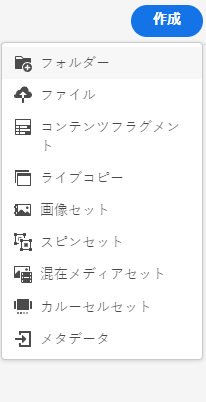
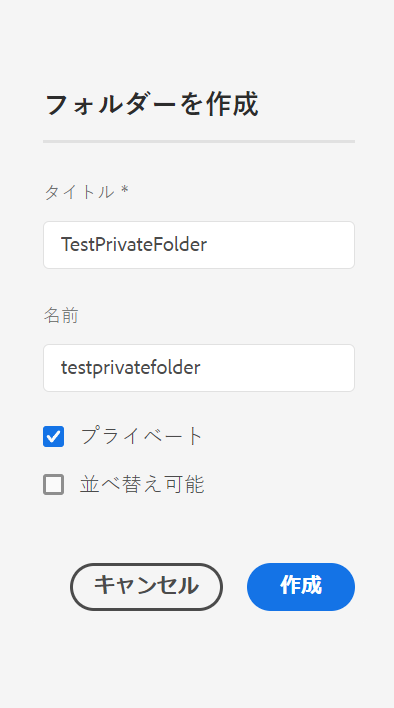
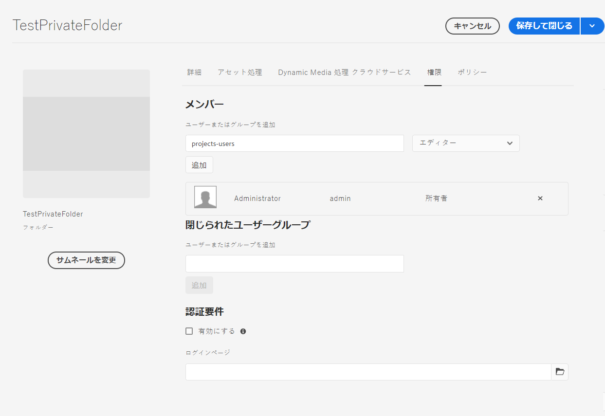
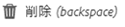

# [!DNL Adobe Experience Manager Assets] のプライベートフォルダー {#private-folder}

| バージョン | 記事リンク |
| -------- | ---------------------------- |
| AEM 6.5 | [ここをクリックしてください](https://experienceleague.adobe.com/docs/experience-manager-65/assets/managing/private-folder.html?lang=ja) |
| AEM as a Cloud Service | この記事 |

[!DNL Adobe Experience Manager Assets] のユーザーインターフェイスに、自分だけが使用できるプライベートフォルダーを作成できます。このプライベートフォルダーを他のユーザーと共有して、他のユーザーに様々な権限を割り当てることができます。割り当てられる権限のレベルに応じて、ユーザーはフォルダーに対する様々なタスク（フォルダー内のアセットの表示、アセットの編集など）を実行できます。

>[!NOTE]
>
>プライベートフォルダーには、所有者の役割を持つメンバーが少なくとも 1 人含まれています。
>
>プライベートフォルダーを作成するには、プライベートフォルダーを作成する親フォルダーに対する `Read` 権限と `Modify` 権限が必要です。管理者でない場合、これらの権限は `/content/dam` でデフォルトでは有効になっていません。この場合、プライベートフォルダーを作成する前に、ユーザー ID またはグループ用にそれらの権限を取得します。

## プライベートフォルダーの作成と共有  {#create-share-private-folder}

プライベートフォルダーを作成して共有するには：

1. [!DNL Assets] コンソールで、ツールバーの「**[!UICONTROL 作成]**」ボタンをクリックし、メニューから「**[!UICONTROL フォルダー]**」を選択します。

   

1. **[!UICONTROL フォルダーの作成]** ダイアログで、フォルダーの `Title` と `Name`（オプション）を入力します。

   「**[!UICONTROL プライベート]**」チェックボックスをオンにして、「**[!UICONTROL 作成]**」をクリックします。

   

   プライベートフォルダーが作成されます。フォルダーに [アセットを追加](add-assets.md#upload-assets) して、他のユーザーやグループとフォルダーを共有できるようになりました。フォルダーを共有して権限を割り当てるまで、他のユーザーにはそのフォルダーが表示されません。

1. フォルダーを共有するには、フォルダーを選択し、ツールバーの「**[!UICONTROL プロパティ]**」をクリックします。

1. **[!UICONTROL フォルダーのプロパティ]** ページで、 **[!UICONTROL ユーザーの追加]** リストからユーザーまたはグループを選択し、プライベートフォルダーに役割（`Viewer`、`Editor` または `Owner`）を割り当て、「**[!UICONTROL 追加]**」をクリックします。

   

   フォルダーを共有するユーザーには、`Editor`、`Owner`、`Viewer` など、様々な役割を割り当てることができます。ユーザーに `Owner` の役割を割り当てると、そのユーザーはフォルダー対して `Editor` 権限を持ちます。さらに、フォルダーを他のユーザーと共有できるようになります。`Editor` の役割を割り当てると、ユーザーがプライベートフォルダーのアセットを編集できるようになります。閲覧者の役割を割り当てると、ユーザーがプライベートフォルダーのアセットを表示できるようになります。

   >[!NOTE]
   >
   >プライベートフォルダーには、`Owner` の役割を持つメンバーが 1 人以上含まれています。したがって、管理者は所有者メンバーをプライベートフォルダーからすべて削除することはできません。 ただし、プライベートフォルダーから既存の所有者（および管理者自体）を削除するには、管理者は別のユーザーを所有者として追加する必要があります。

1. 「**[!UICONTROL 保存して閉じる]**」をクリックします。割り当てた役割に応じて、ユーザーが [!DNL Assets] にログインしたときに、プライベートフォルダーに対する一連の権限が割り当てられます。
1. 「**[!UICONTROL OK]**」をクリックして、確認メッセージを閉じます。
1. フォルダーを共有するユーザーは、ユーザーインターフェイスで共有通知を受け取ります。

1. 「[!UICONTROL 通知]」をクリックすると、通知のリストが開きます。

   

1. 管理者によって共有されたプライベートフォルダーのエントリをクリックして、フォルダーを開きます。

## プライベートフォルダーの削除 {#delete-private-folder}

フォルダーを選択してトップメニューから「[!UICONTROL 削除]」オプションを選択するか、キーボードの Backspace キーを使用して、フォルダーを削除できます。

>[!CAUTION]
>
>CRXDE Lite からプライベートフォルダーを削除すると、リポジトリに冗長なユーザーグループが残ります。

>[!NOTE]
>
>上記の方法を使用してユーザーインターフェイスからフォルダーを削除すると、関連するユーザーグループも削除されます。
>
>ただし、既存の冗長ユーザーグループ、未使用のユーザーグループ、自動生成されたユーザーグループは、作成者インスタンス（`http://[server]:[port]/system/console/jmx/com.day.cq.dam.core.impl.team%3Atype%3DClean+redundant+groups+for+Assets`）の JMX で `clean` メソッドを使用してリポジトリから削除できます。

**関連情報**

* [アセットを翻訳](translate-assets.md)
* [Assets HTTP API](mac-api-assets.md)
* [AEM Assets as a Cloud Service でサポートされているファイル形式](file-format-support.md)
* [アセットを検索](search-assets.md)
* [接続されたアセット](use-assets-across-connected-assets-instances.md)
* [アセットレポート](asset-reports.md)
* [メタデータスキーマ](metadata-schemas.md)
* [アセットをダウンロード](download-assets-from-aem.md)
* [メタデータを管理](manage-metadata.md)
* [検索ファセット](search-facets.md)
* [コレクションを管理](manage-collections.md)
* [メタデータの一括読み込み](metadata-import-export.md)
* [AEM および Dynamic Media へのアセットの公開](/help/assets/publish-assets-to-aem-and-dm.md)
