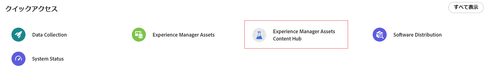

# コンテンツハブの概要 {#overview-content-hub}

| [検索のベストプラクティス](/help/assets/search-best-practices.md) | [メタデータのベストプラクティス](/help/assets/metadata-best-practices.md) | [OpenAPI 機能を備えた Dynamic Media](/help/assets/dynamic-media-open-apis-overview.md) | [AEM Assets 開発者向けドキュメント](https://developer.adobe.com/experience-cloud/experience-manager-apis/) |
| ------------- | --------------------------- |----|-----|

>[!AVAILABILITY]
>
>Content Hub ガイドがPDF形式で利用できるようになりました。 ガイド全体をダウンロードし、Adobe Acrobat AI アシスタントを使用して質問に答えます。
>
>[!BADGE Content Hub ガイドのPDF]{type=Informative url="https://helpx.adobe.com/content/dam/help/en/experience-manager/aem-assets/content-hub.pdf"}

コンテンツハブは、Experience Manager Assets as a Cloud Service の一部として使用でき、組織とそのビジネスパートナーがオンブランドのコンテンツに簡単にアクセスできます。これは、大規模なアクティベーション用のアセットの配布と、マーケティングの俊敏性を向上させるオンブランドのコンテンツバリアントの作成に焦点を当てています。

## コンテンツハブを使用する理由

コンテンツハブには、次のような主なメリットがあります。

**直感的なポータルで使用可能なすべてのブランド承認済みアセットを検索して共有**

AEM Assets は信頼できる唯一の情報源として機能し、すべての承認済みアセットはコンテンツハブでフラットな階層で自動的に使用できるので、検索エクスペリエンスが向上します。

**設定可能なユーザーインターフェイス**

検索用のフィルター、アセットの追加または読み込み時に使用可能なフィールド、アセットのプロパティ、ブランディング用のバナーコンテンツなど、コンテンツハブ内の最も一般的なプロパティは設定可能で、管理者は要件に基づいてコンテンツハブのユーザーインターフェイスを簡単に設定できます。

**オンブランドを維持しながら、クリエイティブ以外のユーザーがコンテンツを編集およびリミックスできるようにする**

コンテンツハブを使用すると、Adobe Express を使用して新しいコンテンツを作成できます（Adobe Express 権限がある場合）。使いやすいツールを使用して既存のコンテンツを編集し、テンプレートとブランド要素を使用してオンブランドのバリエーションを作成し、Adobe Firefly の最新の生成 AI 機能を使用して新しいコンテンツを作成できます。

**チーム間でのコンテンツの使用方法に関するインサイトを取得**

[!DNL Content Hub] は、アセットに関する貴重なインサイトを提供し、マーケティング関係者が頻繁に直面する一般的な課題点、つまりマーケティングキャンペーン、チャネル、様々な地域で使用されるアセットの使用状況統計に対処します。アセットのパフォーマンスと人気を明確に把握することで、ユーザーエクスペリエンスの向上に不可欠な実用的なインサイトが得られます。

## 前提条件 {#prerequisites-content-hub}

コンテンツハブには、Experience Manager as a Cloud Service の 2024.6 リリース以降（最小バージョンは 2024.6.16799）の実稼動オーサー環境が必要です。

## コンテンツハブへのアクセス方法 {#access-content-hub}

[コンテンツハブを設定](/help/assets/deploy-content-hub.md)し、[コンテンツハブ製品プロファイル](/help/assets/deploy-content-hub.md#content-hub-instance-product-profile)にユーザーを追加した後、次の方法でコンテンツハブにアクセスできます。

* 次のリンクを使用して、コンテンツハブにアクセスします。

  `https://experience.adobe.com/#/assets/contenthub`

* experience.adobe com にログオンし、「**[!UICONTROL クイックアクセス]**」セクションで使用可能な **[!UICONTROL Experience Manager Assets コンテンツハブ]**をクリックします。
  

* experience.adobe com にログオンし、製品スイッチャーで使用可能な **[!UICONTROL Experience Manager Assets コンテンツハブ]**をクリックします。
  

## コンテンツハブに関するフィードバックの提供 {#provide-content-hub-feedback}

製品関連の改善を推奨するには、コンテンツハブユーザーインターフェイスの上部にある組織名の横にある「**[!UICONTROL フィードバック]**」をクリックします。

件名、推奨する内容の説明を指定し、必要に応じてファイルを添付します。「**[!UICONTROL 送信]**」をクリックして、アドビにフィードバックを送信します。

## チーム用のコンテンツハブの設定 {#setup-content-hub}

チーム用のコンテンツハブを設定するには、次の手順に従います。

1. [Cloud Manager を使用して Experience Manager Assets のコンテンツハブを有効にします](deploy-content-hub.md#enable-content-hub)。

1. [コンテンツハブ管理者をオンボードします](deploy-content-hub.md#onboard-content-hub-administrator)。

1. [主なコンテンツハブユーザーを追加します](deploy-content-hub.md#onboard-content-hub-consumer-users)。

1. [DAM 作成者または管理者は、Experience Manager Assets を使用してアセットを承認します](approve-assets.md)。

1. [管理者は、他のユーザーのコンテンツハブユーザーインターフェイスを設定できます](configure-content-hub-ui-options.md)。

1. [チームからより多くのユーザーにコンテンツハブへのアクセス権を付与します](deploy-content-hub.md#onboard-content-hub-consumer-users)。

1. [コンテンツハブポータルにアクセスします](#access-content-hub)。

1. [コンテンツハブに関するフィードバックを提供します](#provide-content-hub-feedback)。

## 主な機能の詳細 {#key-capabilities-content-module}

<table>
<td>
   
   

      <a href="/help/assets/configure-content-hub-ui-options.md">
      <strong>コンテンツハブユーザーインターフェイスの設定</strong>
      </a>
   

   

      <em>管理者がコンテンツハブユーザーインターフェイスを設定する方法について説明します。</em>
   

</td>

<td>
   
   

      <a href="/help/assets/search-assets-content-hub.md">
      <strong>コンテンツハブでの使用可能なアセットの検索</strong>
      </a>
   

   

      <em>様々な機能を使用して検索結果を絞り込む方法について説明します。</em>
   

</td>
<td>
   
   

      <a href="/help/assets/edit-images-content-hub.md">
      <strong>Adobe Express を使用した画像の編集</strong>
      </a>
   

   

      <em>Adobe Expressを使用してコンテンツハブで画像のバリアントを作成する方法について説明します。</em>
   

</td>
</table>
<table>
<td>
   
   

      <a href="/help/assets/share-assets-content-hub.md">
      <strong>コンテンツハブでの使用可能なアセットの共有</strong>
      </a>
   

   

      <em>1 つまたは複数のアセットをリンクとして共有し、アクセスする方法について説明します。</em>
   

</td>
<td>
   
   

      <a href="/help/assets/collections-content-hub.md">
      <strong>コンテンツハブでのコレクションの管理</strong>
      </a>
   

   

      <em>アセットを使用してコレクションを作成し、管理する方法について説明します。</em>
   

</td>
<td>
   
   

      <a href="/help/assets/insights-content-hub.md">
      <strong>コンテンツハブのアセットインサイトの表示</strong>
      </a>
   

   

      <em>コンテンツモジュールは、アセットに関する貴重なインサイトを提供し、マーケティング関係者が頻繁に直面する一般的な課題に対処します。</em>
   

</td>
</table>
