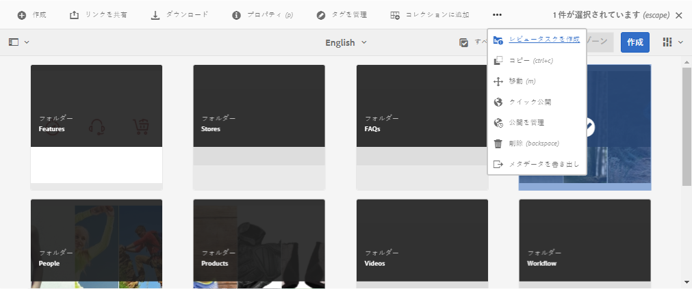
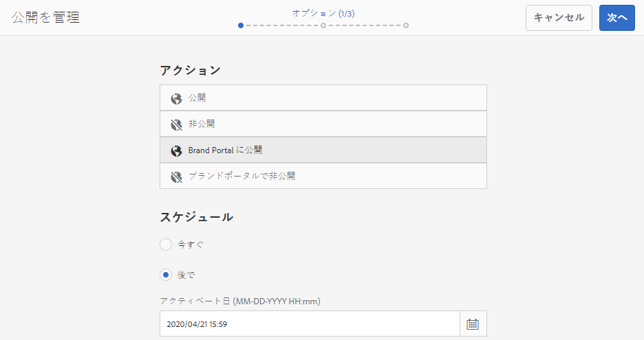
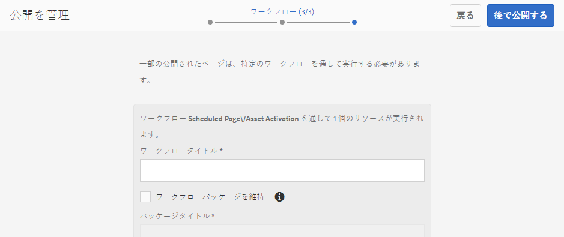
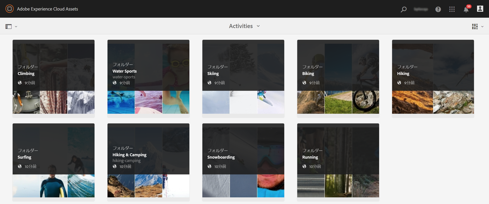
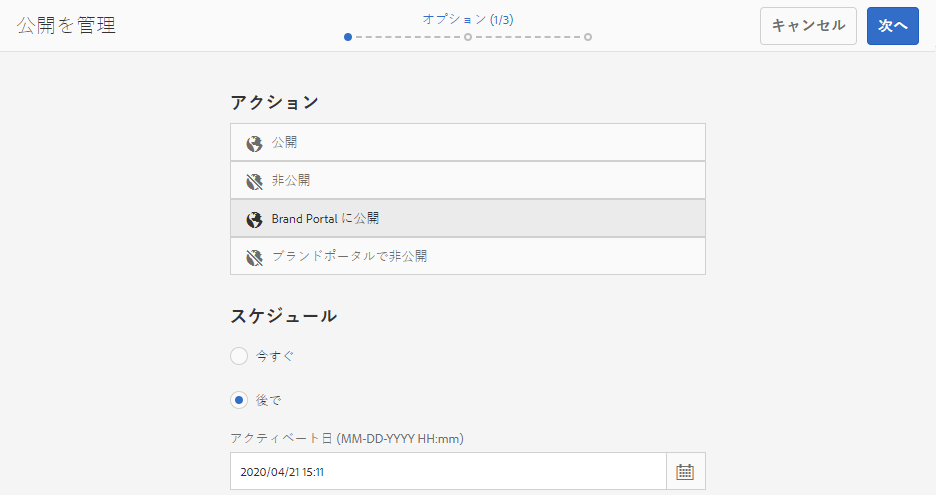
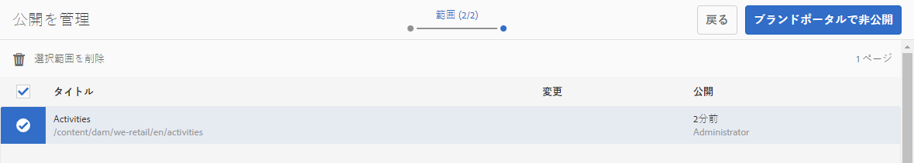
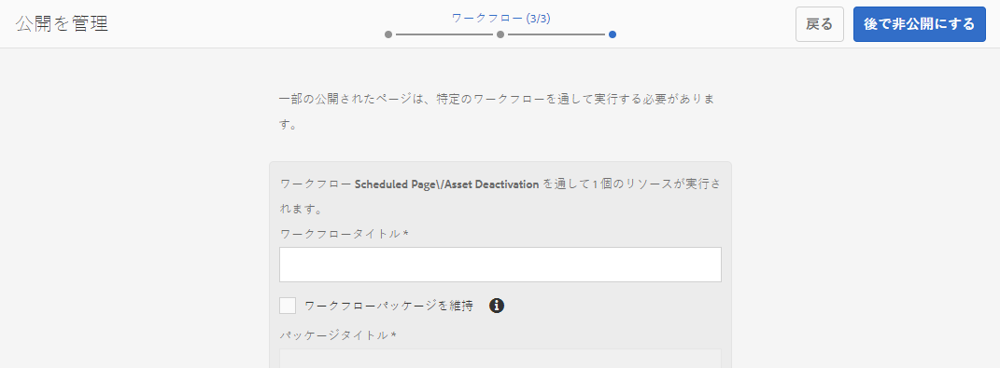
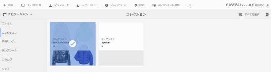
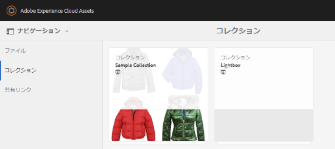

# Brand Portal へのアセットの公開 {#publish-assets-to-brand-portal}

Adobe Experience Manager（AEM）Assets 管理者の場合、アセット、フォルダー、およびコレクションを AEM Assets Brand Portal インスタンスに公開できます。また、アセットまたはフォルダの公開ワークフローを後の日時にスケジューリングすることもできます。公開すると、Brand Portal ユーザーはアセット、フォルダーおよびコレクションにアクセスでき、さらに他のユーザーに配布できます。

ただし、最初に AEM Assets を Brand Portal と連携するように設定する必要があります。詳しくは [AEM Assets と Brand Portal の連携の設定](configure-aem-assets-with-brand-portal.md)を参照してください。

その後、AEM Assets でオリジナルのアセット、フォルダー、コレクションに変更を加えても、AEM Assets から再び公開しない限り、変更内容は Brand Portal に反映されません。このため、作業中の変更が Brand Portal に提供されることがありません。管理者が公開した承認済みの変更のみが Brand Portal で提供されます。

* [Brand Portal へのアセットの公開](#publish-assets-to-bp)
* [Brand Portal へのフォルダーの公開](#publish-folders-to-brand-portal)
* [Brand Portal へのコレクションの公開](#publish-collections-to-brand-portal)

>[!NOTE]
>
>AEM オーサーが過剰なリソースを占有しないように、できればピーク時を避け、時間をずらして公開することをお勧めします。

## Brand Portal へのアセットの公開 {#publish-assets-to-bp}

AEM Assets から Brand Portal にアセットを公開する手順を次に示します。

1. アセットコンソールで、親フォルダーを開き、公開するすべてのアセットを選択し、ツールバーの「**[!UICONTROL クイック公開]**」オプションをクリックします。

   

1. アセットを公開する方法は次の 2 つです。
   * [今すぐ公開](#publish-to-bp-now)（アセットをただちに公開）
   * [後で公開](#publish-to-bp-later)（アセットの公開をスケジュール）

### アセットを今すぐ公開 {#publish-to-bp-now}

選択したアセットを Brand Portal に公開するには、次のいずれかを実行します。

* ツールバーで「**[!UICONTROL クイック公開]**」を選択します。次に、メニューから「**[!UICONTROL Brand Portal に公開]**」を選択します。

* ツールバーで「**[!UICONTROL 公開を管理]**」を選択します。

   1. 「**[!UICONTROL アクション]**」から「**[!UICONTROL Brand Portal に公開]**」を選択します。

      「**[!UICONTROL スケジュール]**」から「**[!UICONTROL 今すぐ]**」を選択します。

      「**[!UICONTROL 次へ]**」をクリックします。

   2. 「**[!UICONTROL 範囲]**」の選択を確認し、「**[!UICONTROL Brand Portal に公開]**」をクリックします。

アセットが Brand Portal への公開用のキューに入れられたことを示すメッセージが表示されます。Brand Portal のインターフェイスにログインして、公開されたアセットを確認します。

### アセットを後で公開 {#publish-to-bp-later}

アセットを Brand Portal に公開するスケジュールを後の日時に設定するには、次の手順を実行します。

1. 公開のスケジュールを設定するアセットを選択し、上部のツールバーの「**[!UICONTROL 公開を管理]**」をクリックします。

1. **[!UICONTROL 公開を管理]**&#x200B;ページで、「**[!UICONTROL アクション]**」から「**[!UICONTROL Brand Portal に公開]**」を選択します。

   「**[!UICONTROL スケジュール]**」から「**[!UICONTROL 後で]**」を選択します。

   

1. 「**[!UICONTROL アクティベート日]**」を選択して時刻を指定します。「**[!UICONTROL 次へ]**」をクリックします。

1. 「**アクティベート日**」を選択して時刻を指定します。「**次へ**」をクリックします。

1. 「**[!UICONTROL ワークフロー]**」で&#x200B;**[!UICONTROL ワークフロータイトル]**&#x200B;を指定します。「**[!UICONTROL 後で公開する]**」をクリックします。

   

Brand Portal インターフェイスにログインして、公開されたアセットを確認します（スケジュールを設定した日時に応じて異なります）。

## Brand Portal へのフォルダーの公開 {#publish-folders-to-brand-portal}

アセットフォルダーは、直ちに公開または非公開にしたり、後の日付や時間にスケジュールを設定したりできます。

### Brand Portal へのフォルダーの公開 {#publish-folders-to-bp}

1. アセットコンソールで、公開するフォルダーを選択し、ツールバーの「**[!UICONTROL クイック公開]**」オプションをクリックします。

   

1. **フォルダーを今すぐ公開**

   選択したフォルダーを Brand Portal に公開するには、次のいずれかを実行します。

   * ツールバーで「**[!UICONTROL クイック公開]**」を選択します。

      メニューから「**[!UICONTROL Brand Portal に公開]**」を選択します。

   * ツールバーで「**[!UICONTROL 公開を管理]**」を選択します。

      1. 「**[!UICONTROL アクション]**」から「**[!UICONTROL Brand Portal に公開]**」を選択します。

         「**[!UICONTROL スケジュール]**」から「**[!UICONTROL 今すぐ]**」を選択します。

         「**次へ**」をクリックします。

      1. 「**[!UICONTROL 範囲]**」の選択を確認し、「**[!UICONTROL Brand Portal に公開]**」をクリックします。

   フォルダーが Brand Portal への公開用のキューに入れられたことを示すメッセージが表示されます。Brand Portal のインターフェイスにログインして、公開されたフォルダーを確認します。

1. **フォルダーを後で公開**

   アセットフォルダーを後で公開するようにスケジュールを設定するには、次の手順を実行します。

   1. 公開のスケジュールを設定するフォルダーを選択し、上部のツールバーから「**[!UICONTROL 公開を管理]**」を選択します。
   1. 「**[!UICONTROL アクション]**」から「**[!UICONTROL Brand Portal に公開]**」を選択します。

      「**[!UICONTROL スケジュール]**」から「**[!UICONTROL 後で]**」を選択します。

   1. 「**[!UICONTROL アクティベート日]**」を選択して時刻を指定します。「**[!UICONTROL 次へ]**」をクリックします。

      

   1. 「**[!UICONTROL 範囲]**」で選択内容を確認します。「**[!UICONTROL 次へ]**」をクリックします。

   1. 「**[!UICONTROL ワークフロー]**」でワークフロータイトルを指定します。「**[!UICONTROL 後で公開する]**」をクリックします。

      

### Brand Portal へのフォルダーの非公開 {#unpublish-folders-from-brand-portal}

AEM Assets インスタンスから非公開にすることで、Brand Portal に公開されているアセットフォルダーを削除できます。元のフォルダーを非公開にすると、Brand Portal ユーザーはそのコピーを使用できなくなります。

アセットフォルダーを Brand Portal から直ちに非公開にしたり、日時を指定してスケジュールを設定したりできます。

Brand Portal へのアセットフォルダーを非公開にするには、次の手順を実行します。

1. アセットコンソールで、公開するアセットフォルダーを選択し、ツールバーの「**[!UICONTROL 公開を管理]**」オプションをクリックします。

   

1. **アセットフォルダーの非公開**

   選択したアセットフォルダーを Brand Portal から直ちに非公開にするには、次の手順を実行します。

   1. ツールバーで「**[!UICONTROL 公開を管理]**」を選択します。

   1. 「**[!UICONTROL アクション]**」から「**[!UICONTROL Brand Portal から非公開]**」を選択します。

      「**[!UICONTROL スケジュール]**」から「**[!UICONTROL 今すぐ]**」を選択します。

      「**[!UICONTROL 次へ]**」をクリックします。

   1. 「**[!UICONTROL 範囲]**」の選択を確認し、「**[!UICONTROL Brand Portal から非公開]**」をクリックします。

      

1. **アセットフォルダーを後で非公開にする**

   アセットフォルダーを後で非公開にするようにスケジュールを設定するには、次の手順を実行します。

   1. ツールバーで「**[!UICONTROL 公開を管理]**」を選択します。

   1. 「**[!UICONTROL アクション]**」から「**[!UICONTROL Brand Portal から非公開]**」を選択します。

      「**[!UICONTROL スケジュール]**」から「**[!UICONTROL 後で]**」を選択します。

   1. 「**[!UICONTROL アクティベート日]**」を選択して時刻を指定します。「**[!UICONTROL 次へ]**」をクリックします。

   1. 「**[!UICONTROL 範囲]**」で選択内容を確認し、「**[!UICONTROL 次へ]**」をクリックします。

   1. 「**[!UICONTROL ワークフロー]**」で&#x200B;**[!UICONTROL ワークフロータイトル]**&#x200B;を指定します。「**[!UICONTROL 後で非公開にする]**」をクリックします。

      

## Brand Portal へのコレクションの公開 {#publish-collections-to-brand-portal}

AEM Assets クラウドインスタンスからコレクションを公開または非公開にできます。

>[!NOTE]
>
>コンテンツフラグメントは Brand Portal に公開できません。したがって、AEM Assets インスタンスでコンテンツフラグメントを選択している場合は、「**[!UICONTROL Brand Portal に公開]**」アクションを使用できません。
>
>コンテンツフラグメントを含むコレクションを AEM Assets インスタンスから Brand Portal へ公開した場合は、そのフォルダー内のコンテンツフラグメントを除く全コンテンツが Brand Portal インターフェイスにレプリケートされます。

### コレクションの公開 {#publish-collections}

AEM Assets から Brand Portal にコレクションを公開する手順を次に示します。

1. AEM Assets の UI で AEM のロゴをクリックします。

1. **ナビゲーション**&#x200B;ページで、**[!UICONTROL アセット]**／**[!UICONTROL コレクション]**&#x200B;に移動します。

1. **コレクション**&#x200B;コンソールで Brand Portal に公開するコレクションを選択します。

   

1. ツールバーで「**[!UICONTROL Brand Portal に公開]**」をクリックします。

1. 確認ダイアログで「**[!UICONTROL 公開]**」をクリックします。

1. 確認メッセージを閉じます。

   管理者として Brand Portal にログインします。公開したコレクションがコレクションインターフェイスで利用できます。

   

### コレクションを非公開にする {#unpublish-collections}

AEM Assets インスタンスから非公開にすることで、Brand Portal に公開されているコレクションを削除できます。元のコレクションを非公開にすると、Brand Portal のユーザーはそのコピーを使用できなくなります。

コレクションを非公開にする手順は次のとおりです。

1. AEM Assets インスタンスの&#x200B;**コレクション**&#x200B;コンソールから、非公開にしたいコレクションを選択します。

   

1. ツールバーで「**[!UICONTROL Brand Portal から削除]**」アイコンをクリックします。
1. 確認ダイアログで「**[!UICONTROL 非公開]**」をクリックします。
1. 確認メッセージを閉じます。コレクションが Brand Portal インターフェイスから削除されます。

上記に加えて、AEM Assets のメタデータスキーマ、画像プリセット、検索ファセット、タグを Brand Portal に公開することもできます。

* [Brand Portal へのプリセット、スキーマ、ファセットの公開](https://docs.adobe.com/content/help/ja-JP/experience-manager-brand-portal/using/publish/publish-schema-search-facets-presets.html)
* [Brand Portal へのタグの公開](https://docs.adobe.com/content/help/ja-JP/experience-manager-brand-portal/using/publish/brand-portal-publish-tags.html)

詳しくは、[Brand Portal ドキュメント](https://docs.adobe.com/content/help/ja-JP/experience-manager-brand-portal/using/home.html)を参照してください。

<!--
   Comment Type: draft

   <li> </li>
   -->

<!--
   Comment Type: draft

   <li>Step text</li>
   -->
