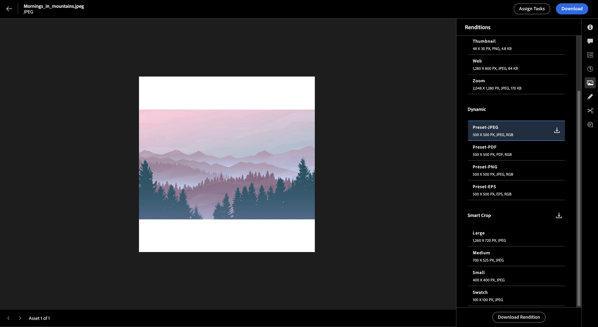

# Experience Manager Assetsでのレンディションの表示と管理{#renditions}

| [ 検索のベストプラクティス ](/help/assets/search-best-practices.md) | [ メタデータのベストプラクティス ](/help/assets/metadata-best-practices.md) | [コンテンツハブ](/help/assets/product-overview.md) | [OpenAPI 機能を備えたDynamic Media](/help/assets/dynamic-media-open-apis-overview.md) | [AEM Assets開発者向けドキュメント ](https://developer.adobe.com/experience-cloud/experience-manager-apis/) |
| ------------- | --------------------------- |---------|----|-----|

Adobe Experience Manager（AEM）のレンディションは、画像などのデジタルアセットのカスタマイズバージョンで、最適なパフォーマンスを確保するために様々なデバイスやプラットフォーム向けに設計されています。 AEMを使用すると、これらのレンディションを簡単に作成および管理し、ユーザーエクスペリエンスを向上させることができます。 サムネールの作成、web またはモバイル用の画像の最適化、透かしの追加、動的レンディションやスマート切り抜きレンディションの表示とダウンロードなどを行うことができます。

Dynamic Media画像プリセットおよびスマート切り抜きレンディションは、ブランド標準に準拠した体系的な画像管理を促進し、ブランドの結束を最大限に高めます。 これにより、管理者アクセス権を持たずに、必要に応じて動的画像レンディションをすばやく見つけて使用するプロセスが簡略化されます。

レンディションは静的レンディションと動的レンディションに分類され、それぞれのタイプは独自の機能を提供しますが、これらについてさらに詳しく説明します。

## 静的レンディション {#static-renditions}

静的レンディションは、デジタルアセットの事前生成バージョンで、通常はアセットの取り込みまたは変更時に作成されます。 これらのレンディションは、web サムネール、レスポンシブデザイン用のモバイルに対応した形式、印刷用の高解像度バージョンなど、特定の目的とプラットフォーム用に最適化され、効率的で一貫したエクスペリエンスを確保します。
[!DNL Experience Manager Assets] の静的レンディション [ 表示およびダウンロード方法 ](#view-dynamic-renditions) について説明します。

## 動的レンディション {#dynamic-renditions}

動的レンディションは、特定のニーズを満たすためにリアルタイムで作成されるアセットのカスタマイズバージョンです。例えば、デバイスの解像度に基づく画像のサイズ変更や、様々な縦横比に合わせた切り抜きなどです。
これらのレンディションにより、組織は、パーソナライズされ最適化されたエクスペリエンスを、様々なオーディエンスのニーズに提供できます。 [!DNL Experience Manager Assets] で動的レンディションを表示およびダウンロードできます。

### 事前準備

* ライセンスを取得したAEM Dynamic Media ユーザーである必要があります。

* [!UICONTROL  管理者表示 ] を使用して次の設定を行います。
   * [ スマート切り抜き画像プロファイル ](/help/assets/dynamic-media/image-profiles.md#creating-image-profiles)
   * [画像プリセット](/help/assets/dynamic-media/managing-image-presets.md)

  後で [ ビューを切り替えて ](/help/assets/assets-view-introduction.md#how-to-access-assets-view)Assets ビューで動的レンディションをプレビューできます。

### 動的レンディションの表示とダウンロード {#view-renditions}

[!DNL Experience Manager Assets] で画像の動的レンディションを表示またはダウンロードするには、次の手順に従います。

1. **[!UICONTROL Assets Management]** / **[!UICONTROL Assets]** に移動します。

1. 該当するアセットフォルダーに移動します。

1. 表示する画像をクリックし、「**[!UICONTROL 詳細]**」をクリックします。

1. 右側のメニューで、「**[!UICONTROL レンディション]**」をクリックします。 **[!UICONTROL レンディション]** パネル  、使用可能な **[!UICONTROL 動的]** レンディションと **[!UICONTROL スマート切り抜き]** レンディションで開きます。

   
   <!--  -->

1. 表示またはダウンロードする必要があるレンディションをクリックします。

1. ダウンロードする必要がある動的レンディションの横にある  アイコンをクリックします。   または、画像レンディションを選択して、下部にある「**[!UICONTROL レンディションをダウンロード]**」オプションをクリックすることもできます。

   「 レンディション」セクションの上部にある「**[!UICONTROL ダウンロードアイコン]** アイコンをクリックすると、そのアセットで使用可能なすべてのスマート切り抜きレンディションをダウンロードできます。

>[!NOTE]
>
>動的レンディションは、アセットが管理者表示からアップロードされた場合にのみ表示されます。
