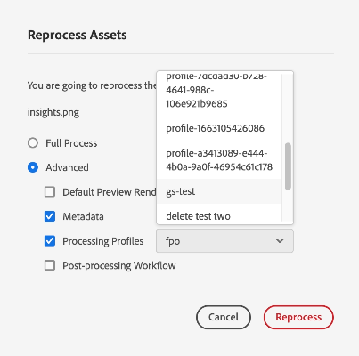

# デジタルアセットの再処理 {#reprocessing-digital-assets}

<table>
    <tr>
        <td>
            <i> 新規 </i>Dynamic Media Prime<a href="/help/assets/dynamic-media/dm-prime-ultimate.md"><b>Ultimate</b></a>
        </td>
        <td>
            <i> 新規 </i> <a href="/help/assets/assets-ultimate-overview.md"><b>AEM AssetsUltimate</b></a>
        </td>
        <td>
            <i> 新規 </i> <a href="/help/assets/integrate-aem-assets-edge-delivery-services.md"><b>AEM AssetsとEdge Delivery Servicesの統合 </b></a>
        </td>
        <td>
            <i> 新規 </i><a href="/help/assets/aem-assets-view-ui-extensibility.md"><b>UI 拡張機能 </b></a>
        </td>
          <td>
            <i>Dynamic Media Prime</i>Ultimateの新 <a href="/help/assets/dynamic-media/enable-dynamic-media-prime-and-ultimate.md"><b> 能 </b></a>
        </td>
    </tr>
    <tr>
        <td>
            <a href="/help/assets/search-best-practices.md"><b>検索のベストプラクティス</b></a>
        </td>
        <td>
            <a href="/help/assets/metadata-best-practices.md"><b>メタデータのベストプラクティス</b></a>
        </td>
        <td>
            <a href="/help/assets/product-overview.md"><b>コンテンツハブ</b></a>
        </td>
        <td>
            <a href="/help/assets/dynamic-media-open-apis-overview.md"><b>OpenAPI 機能を備えた Dynamic Media</b></a>
        </td>
        <td>
            <a href="https://developer.adobe.com/experience-cloud/experience-manager-apis/"><b>AEM Assets 開発者向けドキュメント</b></a>
        </td>
    </tr>
</table>

後で変更した既存のメタデータプロファイルが存在するフォルダー内のアセットを再処理できます。新しく編集したプリセットをフォルダー内の既存のアセットに再適用する場合は、フォルダーを再処理する必要があります。必要な数のアセットを再処理できます。

次の 2 つのシナリオのいずれかが発生した場合は、フォルダー内のアセットを再処理します。

* 既にアセットがアップロードされている既存のアセットフォルダーに対して、バッチセットプリセットを実行する場合。
* アセットのフォルダーに以前適用した既存のバッチセットプリセットを後で編集する場合。

## アセットの再処理 {#reprocessing-steps}

フォルダー内のアセットを再処理するには、次の手順に従います。

1. [!DNL Experience Manager] で、新しく追加されたアセットまたは再処理するアセットを Assets ページから選択します。
フォルダーを選択する場合は、次の手順に従います。

   * 選択したフォルダー内のすべてのファイルがワークフローで再帰的に考慮されます。
   * 選択したメインフォルダー内にアセットを含んだ 1 つ以上のサブフォルダーが存在する場合、ワークフローはフォルダー階層内のあらゆるアセットを再処理します。
   * ベストプラクティスとしては、1,000 個を超えるアセットを含んだフォルダー階層に対しては、このワークフローを実行しないでください。

1. 「**[!UICONTROL アセットを再処理]**」を選択します。次の 2 つのオプションのどちらかを選択します。

   

   * **[!UICONTROL 完全なプロセス]：**&#x200B;デフォルトのプロファイル、カスタムプロファイル、動的処理（設定されている場合）、後処理ワークフローを含むプロセス全体を実行する場合にこのオプションを選択します。
   * **[!UICONTROL 詳細]：**&#x200B;このオプションを選択して、詳細な再処理を選択します。

     

     次の詳細オプションの中から選択します。

      * **[!UICONTROL デフォルトのプレビューレンディション]：**&#x200B;デフォルトでプレビューされるレンディションを再処理する場合に、このオプションを選択します。

      * **[!UICONTROL メタデータ]：**&#x200B;選択したアセットのメタデータ情報とスマートタグを抽出する場合は、このオプションを選択します。

      * **[!UICONTROL 処理プロファイル]：**&#x200B;選択したプロファイルを再処理する場合は、このオプションを選択します。「**[!UICONTROL 完全なプロセス]**」オプションを選択して、デフォルトの処理およびフォルダーレベルで割り当てられたカスタムプロファイルを含めることができます。
        <!--When assets are uploaded to a folder, [!DNL Experience Manager] checks the containing folder's properties for a processing profile. If none is applied, a parent folder in the hierarchy is checked for a processing profile to apply.-->

      * **[!UICONTROL 後処理ワークフロー]：**&#x200B;処理プロファイルを使用して達成できない追加のアセット処理が必要な場合は、このオプションを選択します。追加の後処理ワークフローを設定に追加できます。後処理では、アセットマイクロサービスを使用して、設定可能な処理の上に、完全にカスタマイズされた処理を追加できます。

処理プロファイルと後処理プロセスワークフローについて詳しくは、[アセットマイクロサービスと処理プロファイルの使用](https://experienceleague.adobe.com/docs/experience-manager-cloud-service/content/assets/manage/asset-microservices-configure-and-use.html?lang=ja)を参照してください。

適切なオプションを選択したら、「**[!UICONTROL 再処理]**」をクリックします。成功メッセージが表示されます。

## デジタルアセットの再処理のシナリオ {#scenarios-reprocessing}

[!DNL Experience Manager] では、次のコンポーネントのデジタルアセットを再処理できます。

### スマートタグ {#reprocessing-smart-tags}

デジタルアセットを扱う組織では、アセットメタデータで分類に基づく統制語彙を使用することがますます多くなっています。これには、基本的に、従業員、パートナーおよび顧客が特定のクラスのデジタルアセットを参照したり、検索したりする場合によく使用するキーワードのリストが含まれます。分類に基づく統制語彙を使用してアセットをタグ付けすると、アセットを簡単に識別し、取得することができます。

自然言語語彙と比較して、ビジネス上の分類に基づいたデジタルアセットのタグ付けでは、デジタルアセットを会社のビジネスと容易に連携させることができ、関連性の最も高いアセットが検索で表示されるようになります。

詳しくは、[ビデオアセットのスマートタグ](https://experienceleague.adobe.com/docs/experience-manager-cloud-service/content/assets/manage/smart-tags-video-assets.html?lang=ja)を参照してください。

詳しくは、[DAM での既存画像のカラータグの再処理](https://experienceleague.adobe.com/docs/experience-manager-cloud-service/content/assets/manage/color-tag-images.html?lang=ja#color-tags-existing-images)を参照してください。

### スマート切り抜き {#reprocessing-smart-crop}

詳しくは、アップロードしたアセットに、特定の切り抜き（**[!UICONTROL スマート切り抜き]**&#x200B;およびピクセル切り抜き）やシャープの設定を適用できる [Dynamic Media スマート切り抜き](https://experienceleague.adobe.com/docs/experience-manager-cloud-service/content/assets/dynamicmedia/image-profiles.html?lang=ja)を参照してください。

### メタデータ {#reprocessing-metadata}

[!DNL Adobe Experience Manager Assets] では、あらゆるアセットのメタデータを保持します。したがって、アセットの分類と編成が容易にでき、特定のアセットを検索しやすくなります。メタデータ管理は、Experience Manager Assets にアップロードされるファイルからメタデータを抽出する機能と共に、クリエイティブワークフローに統合されます。アセットの任意のメタデータを保持して管理する機能によって、メタデータに基づいてアセットを自動的に編成および処理できます。

詳しくは、[メタデータプロファイルの再処理](https://experienceleague.adobe.com/docs/experience-manager-cloud-service/content/assets/manage/metadata-profiles.html?lang=ja)を参照してください。

### フォルダー内の Dynamic Media アセットの再処理 {#reprocessing-dynamic-media}

後で変更した既存の Dynamic Media イメージプロファイルまたは Dynamic Media ビデオプロファイルが存在するフォルダー内のアセットを再処理できます。詳しくは、[フォルダー内の Dynamic Media アセットの再処理](https://experienceleague.adobe.com/docs/experience-manager-cloud-service/content/assets/admin/about-image-video-profiles.html?lang=ja)を参照してください。

>[!NOTE]
>
>Dynamic Media ダイアログボックスを有効にするには、環境で [!DNL Dynamic Media] を設定する必要があります。
>

### ワークフロー

詳しくは、[処理プロファイルと後処理ワークフロー](https://experienceleague.adobe.com/docs/experience-manager-cloud-service/content/assets/manage/asset-microservices-configure-and-use.html?lang=ja)を参照してください。
