# MSM for を使用したアセットの再利用[!DNL Assets] {#reuse-assets-using-msm-for-assets}

<table>
    <tr>
        <td>
            <i> 新規 </i>Dynamic Media Prime<a href="/help/assets/dynamic-media/dm-prime-ultimate.md"><b>Ultimate</b></a>
        </td>
        <td>
            <i> 新規 </i> <a href="/help/assets/assets-ultimate-overview.md"><b>AEM AssetsUltimate</b></a>
        </td>
        <td>
            <i> 新規 </i> <a href="/help/assets/integrate-aem-assets-edge-delivery-services.md"><b>AEM AssetsとEdge Delivery Servicesの統合 </b></a>
        </td>
        <td>
            <i> 新規 </i><a href="/help/assets/aem-assets-view-ui-extensibility.md"><b>UI 拡張機能 </b></a>
        </td>
          <td>
            <i>Dynamic Media Prime</i>Ultimateの新 <a href="/help/assets/dynamic-media/enable-dynamic-media-prime-and-ultimate.md"><b> 能 </b></a>
        </td>
    </tr>
    <tr>
        <td>
            <a href="/help/assets/search-best-practices.md"><b>検索のベストプラクティス</b></a>
        </td>
        <td>
            <a href="/help/assets/metadata-best-practices.md"><b>メタデータのベストプラクティス</b></a>
        </td>
        <td>
            <a href="/help/assets/product-overview.md"><b>コンテンツハブ</b></a>
        </td>
        <td>
            <a href="/help/assets/dynamic-media-open-apis-overview.md"><b>OpenAPI 機能を備えた Dynamic Media</b></a>
        </td>
        <td>
            <a href="https://developer.adobe.com/experience-cloud/experience-manager-apis/"><b>AEM Assets 開発者向けドキュメント</b></a>
        </td>
    </tr>
</table>

| バージョン | 記事リンク |
| -------- | ---------------------------- |
| AEM 6.5 | [ここをクリックしてください](https://experienceleague.adobe.com/docs/experience-manager-65/assets/using/reuse-assets-using-msm.html?lang=ja) |
| AEM as a Cloud Service | この記事 |

[!DNL Adobe Experience Manager] のマルチサイトマネージャー（MSM）機能を使用すると、一度作成したコンテンツを複数の Web サイトで再利用できます。デジタルアセットに対しても、MSM for [!DNL Assets] の名前で同じ機能が利用可能です。MSM for [!DNL Assets] を使用すると、次のことが可能になります。

* 一度アセットを作成した後、そのアセットのコピーを作成して、サイトの他の領域で再利用する。
* 複数のコピーを同期させ、元のプライマリコピーの変更を子コピーにプッシュする。
* 親アセットと子アセットの間のリンクを一時的または永続的に休止してローカルに変更を行う。

>[!NOTE]
>
>MSM for [!DNL Assets] の機能にはコンテンツフラグメントが含まれており、[!DNL Assets] として保存されています（ただし Sites の機能と見なされます）。

>[!CAUTION]
>
>MSM for Content Fragments は、**[!UICONTROL Assets]** コンソールからコンテンツフラグメントを使用している際にのみ使用できます。
>
>MSM の機能は、**[!UICONTROL コンテンツフラグメント]**&#x200B;コンソールを使用している際は&#x200B;*使用できません*。

## MSM の利点と概念について {#concepts}

### 仕組みと利点 {#how-it-works-and-the-benefits}

複数の web サイトで同じコンテンツ（テキストとアセット）を再利用するための使用シナリオを理解するには、[考えられる MSM シナリオ](/help/sites-cloud/administering/msm/overview.md)を参照してください。[!DNL Experience Manager] では、元のアセットとそのリンクコピーとのリンクを維持します。このコピーはライブコピー（LC）と呼ばれます。リンクが維持されるので、変更を一元的に管理し、多くのライブコピーにプッシュできます。これにより、重複コピー管理の制限を排除しながら、更新を迅速化できます。変更の伝播はエラーを伴わず、一元化されています。この機能により、選択した一部のライブコピーのみを更新することもできます。ユーザーは、リンクを分離つまり継承を解除したうえでローカル編集を行い、次回プライマリコピーが更新されて変更がロールアウトされたときに編集が上書きされないようにすることができます。分離は、選択した一部のメタデータフィールドまたはアセット全体に対して行うことができます。これにより、元々プライマリコピーから継承されていたアセットをローカルに更新する柔軟性が得られます。

MSM では、ソースアセットとそのライブコピーとのライブ関係を次の目的で維持します。

* ソースアセットの変更がライブコピーにも適用（ロールアウト）されます。つまり、ライブコピーはソースと同期しています。
* ライブ関係を休止してライブコピーを更新することも、一部の限られたフィールドについて継承を解除することもできます。ソースに対する変更はライブコピーに適用されなくなります。

### MSM for [!DNL Assets] の用語集 {#glossary}

**ソース**：元のアセットまたはフォルダー。ライブコピーの派生元となるプライマリコピー。

**ライブコピー**：ソースと同期されている、ソースアセット／フォルダーのコピー。ライブコピーは、さらに別のライブコピーのソースになることができます。LC の作成方法を参照してください。

**継承**：ライブコピーアセット／フォルダーとそのソースとのリンク／参照で、更新内容の送信先を記憶するためにシステムで使用されるもの。メタデータフィールドや、コンテンツフラグメントのバリエーションおよびフィールドの継承は詳細なレベルで存在します。ソースとそのライブコピーとのライブ関係を維持しながら、選択した項目の継承を解除することができます。

**ロールアウト**：ソースに加えられた変更をそのライブコピーにプッシュするアクション。ロールアウトアクションを使用して、一度に 1 つ以上のライブコピーを更新することができます。ロールアウトを参照してください。

**ロールアウト設定**：同期するプロパティと同期の方法およびタイミングを決定する:ルール。これらの設定はライブコピーの作成時に適用され、後で編集できます。子は親アセットからロールアウト設定を継承できます。MSM for [!DNL Assets] の場合は、標準ロールアウト設定のみ使用します。それ以外のロールアウト設定は、MSM for [!DNL Assets] では使用できません。

**同期**：ソースからライブコピーに更新内容を送信することでソースとライブコピーの同等性を維持する、ロールアウト以外のアクション。特定のライブコピーに対して同期が開始され、このアクションでソースから変更内容が取得されます。このアクションを使用すると、ライブコピーの 1 つだけを更新することができます。同期アクションを参照してください。

**休止**：ライブコピーとソースアセット／フォルダーとのライブ関係を:一時的に解除します。関係は再開できます。休止アクションを参照してください。

**再開**：ライブ関係を再開して、ライブコピーがソースからの更新内容の受け取りを再び開始するようにします。再開アクションを参照してください。

**リセット**：リセットアクションは、ローカルの変更を上書きしてライブコピーをソースのレプリカに戻します。また、継承のキャンセルを削除し、すべてのメタデータフィールドの継承をリセットします。後でローカルに変更を加えるには、特定のフィールドの継承を再度キャンセルする必要があります。LC に対するローカルの変更を参照してください。

**デタッチ**：ライブコピーアセット／フォルダーのライブ関係を完全に解除します。分離アクションの後、ライブコピーはソースから更新内容を受け取ることができなくなり、ライブコピーではなくなります。関係の解除を参照してください。

## アセットのライブコピーの作成 {#create-livecopy}

1 つ以上のソースアセットまたはフォルダーからライブコピーを作成するには、次のいずれかを実行します。

* 方法 1：ソースアセットを選択し、上部のツールバーで&#x200B;**[!UICONTROL 作成]**／**[!UICONTROL ライブコピー]**&#x200B;をクリックします。
* 方法 2：[!DNL Experience Manager] ユーザーインターフェイスの右上隅で、**[!UICONTROL 作成]**／**[!UICONTROL ライブコピー]**&#x200B;をクリックします。

アセットまたはフォルダーのライブコピーを 1 つずつ作成できます。それ自体がライブコピーであるアセットまたはフォルダーから派生したライブコピーを作成できます。

最初の方法でライブコピーを作成するには、次の手順に従います。

1. ソースアセットまたはフォルダーを選択します。ツールバーで&#x200B;**[!UICONTROL 作成]**／**[!UICONTROL ライブコピー]**&#x200B;をクリックします。

   ![[!DNL Experience Manager] インターフェイスでのライブコピーの作成](assets/create_lc1.png)

   *図：[!DNL Experience Manager] インターフェイスでのライブコピーの作成*

1. 宛先フォルダーを選択します。「**[!UICONTROL 次へ]**」をクリックします。
1. タイトルと名前を入力します。アセットに子はありません。フォルダーのライブコピーを作成する場合は、子を含めるか含めないかを選択できます。
1. ロールアウト設定を選択します。「**[!UICONTROL 作成]**」をクリックします。

2 番目の方法でライブコピーを作成するには、次の手順に従います。

1. [!DNL Experience Manager] インターフェイスの右上隅で&#x200B;**[!UICONTROL 作成]**／**[!UICONTROL ライブコピー]**&#x200B;をクリックします。

   ![[!DNL Experience Manager] インターフェイスでのライブコピーの作成](assets/create_lc2.png)

   *図：[!DNL Experience Manager] インターフェイスでのライブコピーの作成*

1. ソースアセットまたはソースフォルダーを選択します。「**[!UICONTROL 次へ]**」をクリックします。
1. 宛先フォルダーを選択します。「**[!UICONTROL 次へ]**」をクリックします。
1. タイトルと名前を入力します。アセットに子はありません。フォルダーのライブコピーを作成する場合は、子を含めるか含めないかを選択できます。
1. ロールアウト設定を選択します。「**[!UICONTROL 作成]**」をクリックします。

>[!NOTE]
>
>ソースまたはライブコピーを移動しても、関係は維持されます。ライブコピーが削除されると、関係は解除されます。

## ソースおよびライブコピーの各種プロパティおよびステータスの表示 {#properties}

[!DNL Experience Manager] ユーザーインターフェイスの様々な領域で、ライブコピーの情報や MSM 関連ステータス（関係、同期、ロールアウトなど）を表示できます。

アセットとフォルダーに対しては次の 2 通りの方法があります。

* ライブコピーアセットを選択し、そのプロパティページで情報を確認します。
* ソースフォルダーを選択し、[!UICONTROL ライブコピーコンソール]から各ライブコピーの詳細情報を確認します。

>[!TIP]
>
>少数のライブコピーについて別個にステータスを確認するには、第 1 の方法を使用して、**[!UICONTROL プロパティ]**&#x200B;ページを確認します。多数のライブコピーのステータスを確認するには、第 2 の方法を使用して、**[!UICONTROL 関係ステータス]**&#x200B;ページを確認します。

### ライブコピーの情報とステータス {#status-lc-asset}

ライブコピーアセットまたはライブコピーフォルダーの情報とステータスを確認するには、次の手順に従います。

1. ライブコピーアセットまたはライブコピーフォルダーを選択します。ツールバーの「**[!UICONTROL プロパティ]**」をクリックします。または、キーボードショートカット `p` を使用します。
1. 「**[!UICONTROL ライブコピー]**」をクリックします。ソースのパス、休止ステータス、同期ステータス、前回のロールアウト日、前回のロールアウトを行ったユーザーを確認できます。

   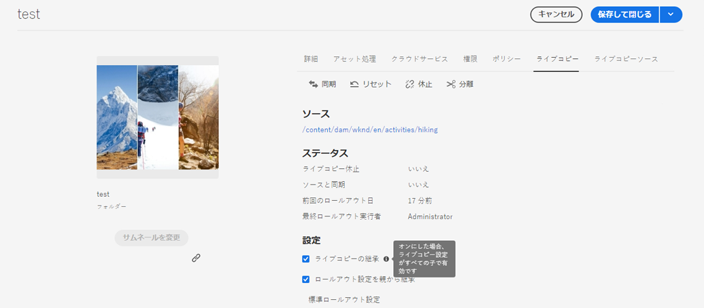

   *図：ライブコピーの情報とステータス*

1. 子アセットがライブコピー設定を借用するかどうかを選択できます。

1. ライブコピーがロールアウト設定を親から継承するか、設定を変更するかを指定するオプションを選択できます。

### フォルダーのすべてのライブコピーの情報とステータス {#status-lc-folder}

[!DNL Experience Manager] には、ソースフォルダーの全ライブコピーのステータスを確認できるコンソールが用意されています。このコンソールには、すべての子アセットのステータスが表示されます。

1. ソースフォルダーを選択します。ツールバーの「**[!UICONTROL プロパティ]**」をクリックします。または、キーボードショートカット `p` を使用します。
1. 「**[!UICONTROL ライブコピーのソース]**」をクリックします。コンソールを開くには、「**[!UICONTROL ライブコピーの概要]**」をクリックします。このダッシュボードには、すべての子アセットの最上位ステータスが表示されます。

   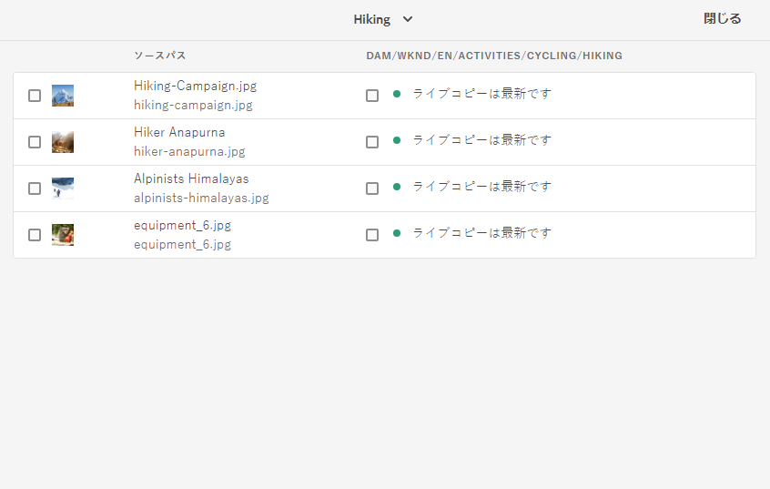

   *図：ソースの[!UICONTROL ライブコピーコンソール]におけるライブコピーステータスの表示*

1. ライブコピーフォルダー内の各アセットに関する詳細情報を表示するには、アセットを選択し、ツールバーの「**[!UICONTROL 関係ステータス]**」をクリックします。

   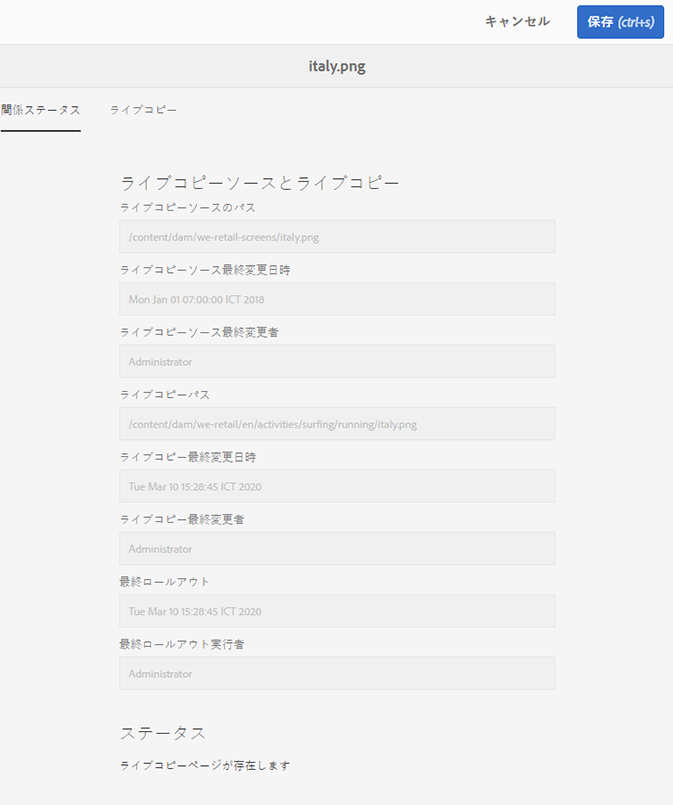

   フォルダー内のライブコピー子アセットの詳細情報とステータス

>[!TIP]
>
>他のフォルダーのライブコピーについては、手軽にステータスを確認できます。**[!UICONTROL ライブコピーの概要]**&#x200B;インターフェイスの上部中央にあるフォルダーを変更します。

### ソースの参照パネルのクイックアクション {#ref-rail-source}

ソースアセットまたはフォルダーの場合は、参照パネルから以下の情報を参照したり以下のアクションを直接実行したりできます。

* ライブコピーのパスを参照する。
* 特定のライブコピーを [!DNL Experience Manager] ユーザーインターフェイスで開くまたは表示する。
* 更新内容を特定のライブコピーに同期する。
* 特定のライブコピーについて、関係を休止したりロールアウト設定を変更したりする。
* ライブコピーの概要コンソールにアクセスする。

ソースアセットまたはフォルダーを選択し、左側のパネルを開いて「**[!UICONTROL 参照]**」をクリックします。あるいは、アセットまたはフォルダーを選択し、キーボードショートカット `Alt + 4` を使用します。

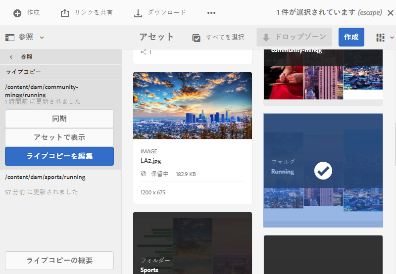

*図：選択したソースの参照パネルで使用可能なアクションと情報*

特定のライブコピーの場合は、「**[!UICONTROL ライブコピーを編集]**」をクリックすると、関係を休止したり、ロールアウト設定を変更したりできます。

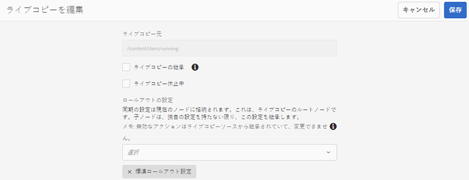

*図：特定ライブコピーの関係の休止やロールアウト設定の変更*

### ライブコピーの参照パネルのクイックアクション {#ref-rail-lc}

ライブコピーアセットまたはフォルダーの場合は、参照パネルから以下の情報を参照したり以下のアクションを直接実行したりできます。

* ソースのパスを参照する。
* 特定のライブコピーを [!DNL Experience Manager] ユーザーインターフェイスで開くまたは表示する。
* 更新内容をロールアウトする。

ライブコピーアセットまたはフォルダーを選択し、左側のパネルを開いて「**[!UICONTROL 参照]**」をクリックします。あるいは、アセットまたはフォルダーを選択し、キーボードショートカット `Alt + 4` を使用します。

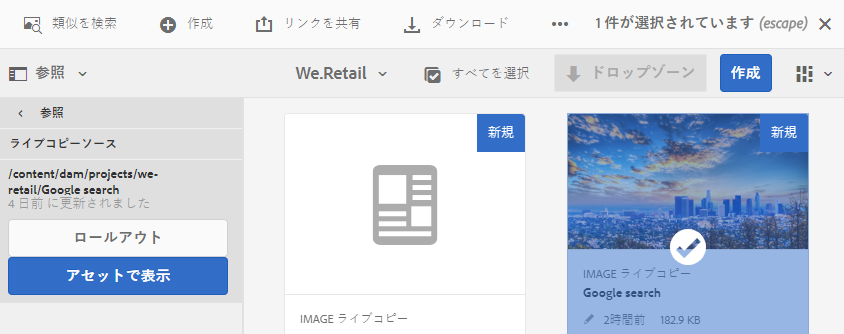

*図：選択したライブコピーの参照パネルで使用可能なアクション*

## ソースからライブコピーへの変更の伝播 {#rollout-sync}

ソースが変更されると、同期アクションまたはロールアウトアクションを使用して、変更内容をライブコピーに伝播させることができます。両方のアクションの違いを理解するには、[用語集](#glossary)を参照してください。

### ロールアウトアクション {#rollout}

ソースアセットからロールアウトアクションを開始して、すべてまたは選択した一部のライブコピーを更新できます。

1. ライブコピーアセットまたはライブコピーフォルダーを選択します。ツールバーの「**[!UICONTROL プロパティ]**」をクリックします。または、キーボードショートカット `p` を使用します。
1. 「**[!UICONTROL ライブコピーのソース]**」をクリックします。ツールバーの「**[!UICONTROL ロールアウト]**」をクリックします。
1. 更新するライブコピーを選択します。「**[!UICONTROL ロールアウト]**」をクリックします。
1. 子アセットに対する更新内容をロールアウトするには、「**[!UICONTROL ソースとすべての子をロールアウト]**」をオンにします。

   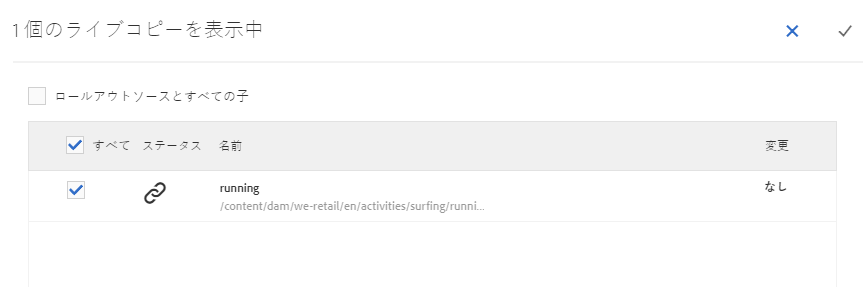

   *図：一部または全部のライブコピーへのソース変更のロールアウト*

>[!NOTE]
>
>ソースアセットで行われた変更は、直接関係するライブコピーにのみロールアウトされます。ライブコピーが別のライブコピーから派生したものである場合、派生したライブコピーには変更内容はロールアウトされません。

または、特定のライブコピーを選択した後で参照パネルからロールアウトアクションを開始することもできます。詳しくは、[ライブコピーの参照パネルのクイックアクション](#ref-rail-lc)を参照してください。このロールアウト方法では、選択したライブコピーとその子（任意指定）のみ更新されます。

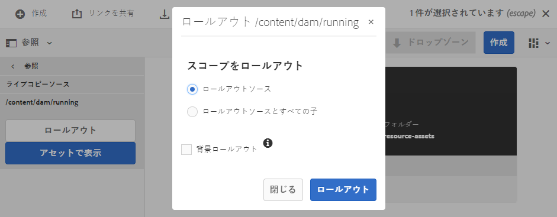

*図：選択したライブコピーへのソース変更のロールアウト*

### 同期アクションについて {#about-sync}

同期アクションは、ソースの変更内容を取り込んで、選択したライブコピーにのみ適用します。同期アクションでは、継承のキャンセル後に行われたローカルの変更を尊重して維持します。ローカルの変更は上書きされず、キャンセルした継承は復元されません。同期アクションは 3 通りの方法で開始できます。

| [!DNL Experience Manager] インターフェイス内の場所 | 使用するタイミングと理由 | 使用方法 |
|---|---|---|
| [!UICONTROL 参照パネル] | ソースが既に選択されているときにすばやく同期させます。 | [ソースの参照パネルのクイックアクション](#ref-rail-source)を参照 |
| [!UICONTROL プロパティ]ページのツールバー | ライブコピーのプロパティが既に開いているときに同期を開始します。 | [ライブコピーの同期](#sync-lc)を参照 |
| [!UICONTROL ライブコピーの概要コンソール] | ソースフォルダーが選択されている場合や、[!UICONTROL ライブコピーの概要]コンソールが既に開いている場合は、複数のアセット（必ずしもすべてではない）をすばやく同期させます。同期アクションは一度に 1 つのアセットに対して開始されますが、複数のアセットの同期を一度に実行する手軽な方法です。 | [ライブコピーフォルダー内の多数のアセットに対するアクション](#bulk-actions)を参照 |

### ライブコピーの同期 {#sync-lc}

同期アクションを開始するには、ライブコピーの&#x200B;**[!UICONTROL プロパティ]**&#x200B;ページを開き、「**[!UICONTROL ライブコピー]**」をクリックして、ツールバーで目的のアクションをクリックします。

同期アクションに関連するステータスと情報を確認するには、[ライブコピーの情報とステータス](#status-lc-asset)および[フォルダーのすべてのライブコピーの情報とステータス](#status-lc-folder)を参照してください。

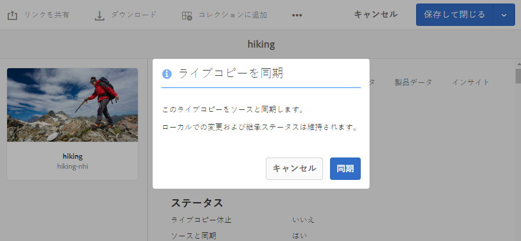

*図：同期アクションによるソースの変更内容の取り込み*

>[!NOTE]
>
>関係が休止されている場合は、ツールバーの同期アクションは使用できません。参照パネルでは同期アクションを使用できますが、ロールアウトが正常に完了しても変更内容は伝播しません。

## 個々の項目の継承のキャンセルと再有効化 {#canceling-reenabling-inheritance-individual-items}

次の項目のライブコピーの継承をキャンセルできます。

* メタデータフィールド
* [コンテンツフラグメントのバリエーション](/help/assets/content-fragments/content-fragments-variations.md#inheritance)
* [コンテンツフラグメントのデータフィールド](/help/assets/content-fragments/content-fragments-variations.md#inheritance)

これは、項目がソースコンポーネントと同期されなくなることを意味します。必要に応じて、後で継承を有効にすることができます。

### 継承をキャンセル {#cancel-inheritance}

継承をキャンセルするには：

1. 必要な項目の横にある&#x200B;**継承をキャンセル**&#x200B;アイコンを選択します。

   

1. 継承をキャンセルダイアログボックスで、「はい」を使用してアクションを確定します。

### 継承を再度有効にする {#reenable-inheritance}

継承を再度有効にするには：

1. 項目の継承を有効にするには、必要な項目の隣にある&#x200B;**継承を再度有効にする**&#x200B;アイコンを選択します。

   

   >[!NOTE]
   >
   >継承を再度有効にしても、項目はソースと自動的には同期されません。必要な場合は、手動で同期をリクエストできます。

## 関係の休止と再開 {#suspend-resume}

関係を一時的に休止して、ソースアセットまたはソースフォルダーの変更内容をライブコピーが受け取らないようにすることができます。また、関係を再開して、ソースの変更内容をライブコピーが受け取るようにすることもできます。

関係を休止または再開するには、ライブコピーの&#x200B;**[!UICONTROL プロパティ]**&#x200B;ページを開き、「**[!UICONTROL ライブコピー]**」をクリックして、ツールバーで目的のアクションをクリックします。

または、**[!UICONTROL ライブコピーの概要]**&#x200B;コンソールから、ライブコピーフォルダー内の複数のアセットについて、関係をすばやく休止または再開することができます。[ライブコピーフォルダー内の多数のアセットに対するアクションの実行](#bulk-actions)を参照してください。

## ライブコピーのローカル編集 {#local-mods}

ライブコピーは、元のソースの作成時のレプリカです。ライブコピーのメタデータ値はソースから継承されます。メタデータフィールドは、ソースアセットの各フィールドとの継承を個別に維持します。

ただし、ライブコピーをローカルに変更して、一部の限定されたプロパティを変更する柔軟性があります。ローカルに変更するには、目的のプロパティの継承をキャンセルします。1 つ以上のメタデータフィールドの継承がキャンセルされても、アセットのライブ関係と他のメタデータフィールドの継承は保持されます。同期やロールアウトでローカルの変更内容が上書きされることはありません。継承をキャンセルするには、ライブコピーアセットの&#x200B;**[!UICONTROL プロパティ]**&#x200B;ページを開き、メタデータフィールドの横にある「**[!UICONTROL 継承をキャンセル]**」オプションをクリックします。

ローカルの変更をすべて取り消して、アセットをソースの状態に戻すことができます。リセットアクションは、ローカルの変更をすべて完全かつ即座に無効にし、すべてのメタデータフィールドの継承を復元します。元に戻すには、ライブコピーアセットの&#x200B;**[!UICONTROL プロパティ]**&#x200B;ページでツールバーの「**[!UICONTROL リセット]**」クリックします。

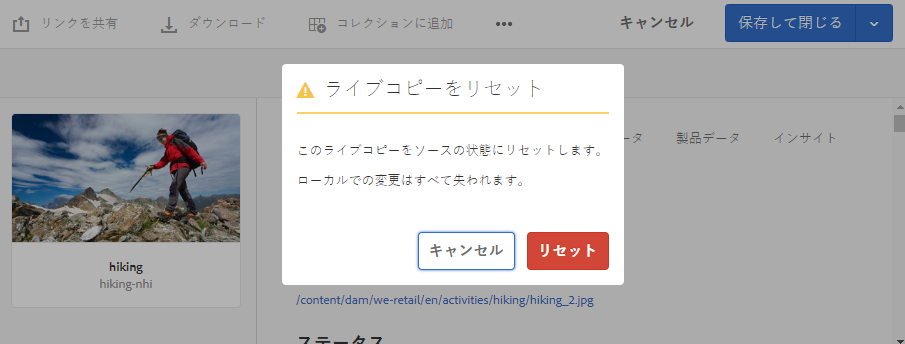

*図：リセットアクションでローカルの編集内容が上書きされ、ライブコピーがソースの状態に戻る*

## ライブ関係の削除 {#detach}

分離アクションを使用して、ソースとライブコピーとの関係を完全に解除できます。ライブコピーは、分離された後、スタンドアロンのアセットまたはフォルダーになります。分離後直ちに、新しいアセットとして [!DNL Experience Manager] インターフェイスに表示されます。ソースからライブコピーを分離するには、次の手順に従います。

1. ライブコピーアセットまたはフォルダーを選択します。 ツールバーの「**[!UICONTROL プロパティ]**」をクリックします。または、キーボードショートカット `p` を使用します。

1. 「**[!UICONTROL ライブコピー]**」をクリックします。ツールバーの「**[!UICONTROL 分離]**」をクリックします。表示されるダイアログで「**[!UICONTROL 分離]**」クリックします。

   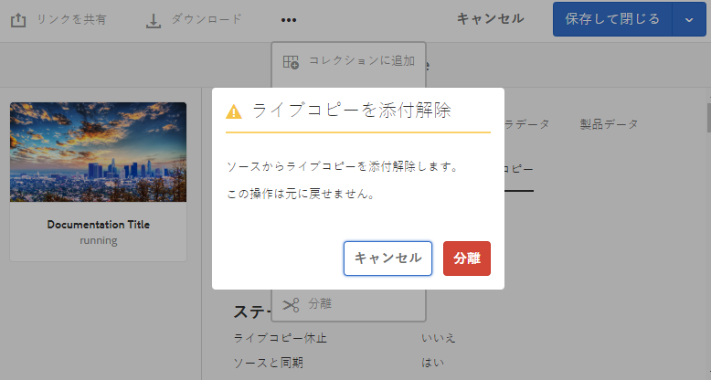

   *図：分離アクションによって、ソースとライブコピーとの関係が完全に解除される*

   >[!CAUTION]
   >
   >ダイアログで「**[!UICONTROL 分離]**」をクリックするとすぐに、関係が解除されます。プロパティページで「**[!UICONTROL キャンセル]**」をクリックしても、関係を元に戻すことはできません。

または、**[!UICONTROL ライブコピーの概要]**&#x200B;コンソールでライブコピーフォルダー内の複数のアセットをすばやく分離することができます。[ライブコピーフォルダー内の多数のアセットに対するアクションの実行](#bulk-actions)を参照してください。

## ライブコピーフォルダーでの一括アクション {#bulk-actions}

ライブコピーフォルダーに複数のアセットがある場合、アセットごとにアクションを開始するのは面倒なことがあります。[!UICONTROL ライブコピーコンソール]から、多数のアセットに対して基本アクションをすばやく開始できます。上記の方法は、個々のアセットに対して引き続き機能します。

1. ソースフォルダーを選択します。ツールバーの「**[!UICONTROL プロパティ]**」をクリックします。または、キーボードショートカット `p` を使用します。
1. 「**[!UICONTROL ライブコピーのソース]**」をクリックします。コンソールを開くには、「**[!UICONTROL ライブコピーの概要]**」をクリックします。
1. このダッシュボードで、ライブコピーフォルダーからライブコピーアセットを選択します。ツールバーで目的のアクションをクリックします。使用可能なアクションは、**[!UICONTROL 同期]**、**[!UICONTROL リセット]**、**[!UICONTROL 休止]**、**[!UICONTROL 分離]**&#x200B;です。選択したソースフォルダーとライブ関係にある任意の数のライブコピーフォルダーに含まれている任意のアセットに対して、これらの操作をすばやく開始できます。

   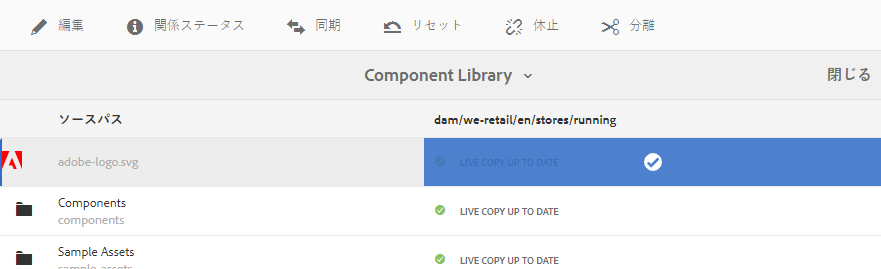

   *図：[!UICONTROL ライブコピーの概要]コンソールからライブコピーフォルダー内の多数のアセットを容易に更新できる*

<!-- TBD: Can MSM be extended using Java APIs in CS?

## Extend MSM for [!DNL Assets] {#extend-api}

[!DNL Experience Manager] lets you extend the functionality using the MSM Java APIs. For [!DNL Assets], the extending works just the same as it works with MSM for [!DNL Sites]. For details, see [Extending the MSM](/help/sites-developing/extending-msm.md) and the following for information about specific tasks:

* [Overview of APIs](/help/sites-developing/extending-msm.md#overview-of-the-java-api)
* [Create a synchronization action](/help/sites-developing/extending-msm.md#creating-a-new-synchronization-action)
* [Create a rollout configuration](/help/sites-developing/extending-msm.md#creating-a-new-rollout-configuration)
* [Create and use a simple LiveActionFactory class](/help/sites-developing/extending-msm.md#creating-and-using-a-simple-liveactionfactory-class)

-->

## ライブコピーに対するアセット管理タスクの影響 {#manage-assets}

ライブコピーとソースは、ある程度までデジタルアセットとして管理できるアセットまたはフォルダーです。[!DNL Experience Manager] における一部のアセット管理タスクは、ライブコピーに特定の影響を及ぼします。

* ライブコピーをコピーすると、最初のライブコピーと同じソースのライブコピーアセットが作成されます。
* ソースまたはソースのライブコピーを移動しても、ライブ関係は保持されます。
* 編集アクションはライブコピーアセットには機能しません。ライブコピーのソース自体がライブコピーである場合、編集アクションはそのソースには機能しません。
* チェックアウトアクションはライブコピーアセットには使用できません。
* ソースフォルダーの場合は、レビュータスクを作成するオプションを使用できます。
* アセットリストをリスト表示および列表示で表示する場合、ライブコピーアセットまたはフォルダーには「ライブコピー」と表示されます。これにより、フォルダー内のライブコピーを識別しやすくなります。

## MSM for [!DNL Assets] と MSM for [!DNL Sites] の比較 {#comparison}

多くのシナリオで、MSM for [!DNL Assets] の機能は MSM for Sites の機能と同様に動作します。注意すべき重要な違いは次のとおりです。

* MSM for [!DNL Sites] におけるブループリントは、MSM for [!DNL Assets] ではライブコピーソースと呼ばれます。
* MSM for Sites ではブループリントとそのライブコピーを比較できますが、MSM for [!DNL Assets] ではソースとそのライブコピーを比較することはできません。
* MSM for [!DNL Assets] ではライブコピーを編集できません。
* MSM for Sites の場合は子があるのが普通ですが、MSM for [!DNL Assets] の場合はそうではありません。個々のアセットのライブコピーを作成する際に、子を含めるか含めないかを選択するオプションはありません。
* サイトを作成ウィザードでの章ステップの削除は、MSM for [!DNL Assets] ではサポートされていません。
* ページプロパティに対する MSM ロックの設定は、MSM for [!DNL Assets] ではサポートされていません。
* MSM for [!DNL Assets] の場合は、**[!UICONTROL 標準ロールアウト設定]**&#x200B;のみ使用します。それ以外のロールアウト設定は、MSM for [!DNL Assets] では使用できません。

>[!NOTE]
>
>MSM for Content Fragments（**[!UICONTROL Assets]** コンソールから利用）は Assets の機能を使用することに注意してください。これは、Assets として保存されるからです（ただし Sites の機能と見なされます）。

## MSM for の制限事項と既知の問題 [!DNL Assets] {#limitations}

MSM for [!DNL Assets] の制限事項を次に示します。

* MSM for Assets は、メタデータの書き戻しが有効になっている場合には機能しません。書き戻し時に、継承が解除されます。

**関連情報**

* [アセットを翻訳](translate-assets.md)
* [Assets HTTP API](mac-api-assets.md)
* [AEM Assets as a Cloud Service でサポートされているファイル形式](file-format-support.md)
* [アセットを検索](search-assets.md)
* [接続されたアセット](use-assets-across-connected-assets-instances.md)
* [アセットレポート](asset-reports.md)
* [メタデータスキーマ](metadata-schemas.md)
* [アセットをダウンロード](download-assets-from-aem.md)
* [メタデータを管理](manage-metadata.md)
* [検索ファセット](search-facets.md)
* [コレクションを管理](manage-collections.md)
* [メタデータの一括読み込み](metadata-import-export.md)
* [コンテンツフラグメントの操作](/help/assets/content-fragments/content-fragments.md)
* [AEM および Dynamic Media へのアセットの公開](/help/assets/publish-assets-to-aem-and-dm.md)