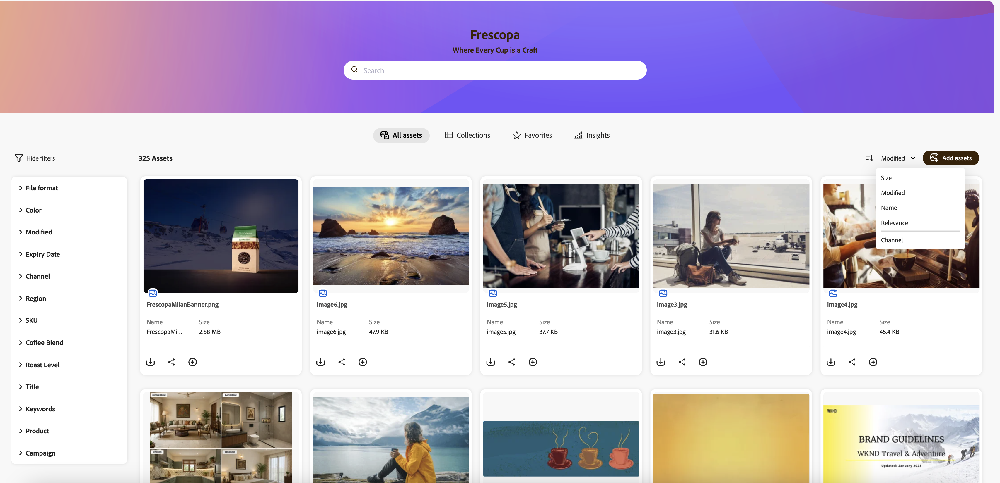

# [!DNL Content Hub] でアセットを検索する {#search-assets}

リポジトリ内に多数のアセットがある場合、適切なアセットの検索には時間がかかります。 [!DNL The Content Hub] 検索には、承認済みアセットを検索する機能が備わっており、ダウンロード、共有、コレクションの作成などの追加アクションを実行できます。 テキストベースの検索、フィルターの使用、タグまたはスマートタグ固有の検索の実行、特定のファイル形式の検索など、様々な機能を使用して検索結果を絞り込むことができます。

## 前提条件 {#prerequisites}

[コンテンツハブユーザー](deploy-content-hub.md#onboard-content-hub-users)は、この記事で説明されているアクションを実行できます。

## 検索対象  {#what-you-can-search}

[!DNL Content Hub] 検索では、以下に基づいて結果が提供されます。

* **一致するテキスト：**&#x200B;[!DNL Content Hub] 検索では、名前または説明を使用してアセットを検索できます。 キーワードベースの検索を実行して、キーワードをアセットのプロパティで使用可能なテキストと比較することができます。

* **一致するコンテキスト：**&#x200B;[!DNL Content Hub] の検索結果リストには、一致するコンテキストに基づいて取得されたアセットの近似結果が含まれます。 例えば、検索バーに「`cool`」と入力すると、`winter`、`snow`、`cold surroundings` に関連するアセットが検索リストに表示されます。

* **アセット情報（タイトル、タグ、スマートタグ）：**&#x200B;[!DNL Content Hub] は、スマート検索アルゴリズムを使用して、検索結果を正確かつ可能な限り関連性に基づいてランク付けします。 [メタデータ](#asset-properties.md)は、アセットに使用可能なすべてのデータのコレクションですが、必ずしもそのアセットに含まれているとは限りません。 [アセットをより細かく分類するのに役立ち、デジタル情報量が多くなるにつれて有用になります。](/help/assets/configure-content-hub-ui-options.md##configure-metadata-search-content-hub)

* **最終変更日：**&#x200B;最近変更したアセットが検索結果リストの上部に表示されます。 また、要件に応じて、日付範囲をフィルタリングすることもできます。

* **使用状況：**&#x200B;一般的に使用されているアセットが検索リストの上位に表示されます。

* **検索履歴：**&#x200B;検索履歴を取得するには、文字を入力せずに検索ボックス内をクリックします。 また、履歴から特定のキーワードを削除することもできます。 検索履歴は web ブラウザーのキャッシュメモリに保存されるので、別のブラウザーで [!DNL Content Hub] の検索にアクセスしたり、ブラウザーのキャッシュメモリをクリアしたりすると、検索履歴を表示できなくなります。

* **入力中に検索：**&#x200B;[!DNL Content Hub] 検索では、入力を開始するとオートコンプリートの候補が表示されるので、検索エクスペリエンスが向上します。

## 基本検索 {#basic-search}

[!DNL the Content Hub] で基本検索を実行するには、検索バーに移動し、検索する必要があるキーワードを指定します。 左側のパネルで使用可能なフィルターに移動して適用し、検索結果を絞り込みます。

例えば、過去 1 年以内に変更されたキーワード `architect` を含むすべての **[!UICONTROL JPEG]** 画像を検索します。 このシナリオを実行するには、次の手順を実行します。

1. 検索キーワードとして `architect` を指定します。

1. フィルターパネル／**[!UICONTROL 形式]**&#x200B;に移動し、「**[!UICONTROL JPEG]**」を選択します。

1. 「**[!UICONTROL 変更]**」に移動し、日付範囲を指定します。

   

## フィルターを使用した検索結果の絞り込み {#narrow-down-search-results}

フィルターパネルを使用して、メタデータに基づいてアセットを検索します。 様々な検索述語に基づいて、検索結果をフィルタリングできます。 適切な述語をすべて選択して、検索結果を最小限に抑えたり、絞り込んだりすることができます。 検索結果をフィルタリングする際に、10 個を超える述語を選択できます。 フィルター内で複数のオプションを選択すると、コンテンツハブには、フィルター内で選択したオプションのいずれかに一致するアセットが表示されます。 ただし、フィルター全体で複数のオプションを選択した際、コンテンツハブには、フィルター全体で選択したすべてのオプションに一致するアセットのみが表示され、検索結果が絞り込まれます。

デフォルトのフィルターには、ファイル形式、承認者、承認日、有効期限切れのアセットと有効期限切れでないアセット、有効期限が含まれます。 また、管理者は、フィルターのリストに表示されるフィルターを設定することもできます。 詳しくは、[コンテンツハブユーザーインターフェイスの設定](configure-content-hub-ui-options.md#configure-filters-content-hub)を参照してください。

## Content HubのAI 検索 {#ai-search-aem-assets-content-hub}

AEM Assets Content HubのAI 検索機能は、キーワードの一致を正確に把握するのではなく、クエリの背後にある意味と意図を理解できる高度な検索機能です。 AI （人工知能）とマシンラーニング（機械学習）を利用して、より正確でコンテキストに即した検索結果を提供します。

従来のキーワードベースの検索では、正確な用語を検索しますが、AI 検索は、単語、概念、ユーザーの意図の間の関係を解釈します。 これにより、クエリの表現が異なる場合や、入力ミスが含まれる場合、別の言語である場合でも、ユーザーが探しているものを確実に見つけることができます。

主なメリットには、次のようなものがあります。

* **多言語サポート**：正確な翻訳を必要とせずに複数の言語をまたいで検索します。 ユーザーは、クエリ言語に関係なく、関連するコンテンツを見つけることができます。

* **誤字を処理**：入力ミスやスペルミスを解釈し、入力ミスがあったとしても正確な結果を得ることができます。

* **同義語の理解**：関連する用語やフレーズの結果を提供するので、ユーザーは正しいキーワードを推測する必要がありません。

* **文脈的に関連する検索**：正確な単語だけでなく、クエリの背後にある意図を認識します。

### Content HubでのAI 検索の例 {#examples-ai-search-aem-assets-content-hub}

**プロンプトの例**：*コーヒーを飲む女性*

従来のキーワードベースの検索では、`Woman`、`drinking`、`Coffee`など、アセットメタデータと完全に一致する検索が行われ、メタデータにこれらすべての用語が含まれているアセットが返されます。

ただし、AI 検索は、`Woman`の場合は`Girl`、`Lady`、`Coffee`の場合は`Cappuccino`および`Latte`などの似た単語と一致します。

同様に、このプロンプトをスペイン語で指定したり、`Woman` を `Wman` とスペルミスしたりしても、同じ結果が得られます。

### Content HubでAI 検索を有効または無効にする {#enable-disable-ai-search-content-hub}

Content HubでAI 検索を有効または無効にするには、次の手順を実行します。

1. ユーザープロファイルアイコンに移動し、**[!UICONTROL 設定]**&#x200B;をクリックします。

1. 「**[!UICONTROL 検索]**」タブで、「**[!UICONTROL AI 検索]**」を選択してContent HubのAI 検索を有効にするか、「**[!UICONTROL キーワード]**」を選択して無効にします。

   

1. 「**[!UICONTROL 保存]**」をクリックします。

<!--

<table>
    <tbody>
     <tr>
      <th><strong>Search Predicate</strong></th>
      <th><strong>Description</strong></th>
      <th><strong>Properties</strong></th>
     </tr>
     <tr>
      <td> Campaigns </td>
      <td> Allows you to search using planned activity performed to take any particular action. For example, advertisement campaign run on Ferrari to know the understand the interests of people using number of clicks people perform.</td>
      <td>NA</td>
     </tr>
     <tr>
      <td> Channels </td>
      <td> Helps you to understand the path from where the asset is coming from. For example, web, social media, books, catalog, etc.</td>
      <td>NA</td>
     </tr>
     <tr>
      <td> Region </td>
      <td> Helps you to understand the location where the asset is created. For example, Japan, EMEA, Worldwide, etc.</td>
      <td>NA</td>
     </tr>
     <tr>
      <td> Keywords </td>
      <td> Keyword helps you search using terms or the words that you enter based on the topic. For example, images, low-resolution, etc.</td>
      <td>NA</td>
     </tr>
     <tr>
      <td> Timeframe </td>
      <td> Helps you search assets using timeline. For example, search by year 2024, Q3 2023, etc.</td>
      <td>NA</td>
     </tr>
     <tr>
      <td>File format</td>
      <td>Composition of an asset. The supported assets include image, document, video, printable media, and so on.</td>
      <td>
        <ul>
            <li>[!UICONTROL JPEG]</li> 
            <li>[!UICONTROL Quicktime]</li> 
            <li>[!UICONTROL PNG]</li> 
            <li>[!UICONTROL WebP]</li> 
            <li>[!UICONTROL MP4]</li> 
            <li>[!UICONTROL Plain]</li> 
            <li>[!UICONTROL PDF]</li>
            <li>[!UICONTROL SVG + XML]</li>
        </ul>
      </td>
     </tr>
     <tr>
      <td>Tags</td>
      <td>Tags help you categorize assets that can be browsed and searched more efficiently based on hierarchical taxonomies.</td>
      <td>
        <ul>
            <li>Field label</li>
            <li>Property name</li>
            <li>Path</li>
            <li>Description</li>
        </ul>
      </td>
     </tr>
     <tr>
      <td>Subject</td>
      <td>Classification of assets based on their theme. For example, colorful, hiking, outdoors.</td>
      <td>NA</td>
     </tr>
          <tr>
      <td>Last modified</td>
      <td>Search assets based on their last modification. Specify the date range using the Start date and End date fields.</td>
      <td>
        <ul>
            <li>Range text (From)</li> 
            <li>Range text (To) </li>
        </ul>
      </td>
     </tr>    
     <tr>
      <td>Asset ID</td>
      <td>Unique number that identifies the asset.</td>
      <td>NA</td>
     </tr>
     <tr>
      <td> Colors </td>
      <td> Helps you search assets using colors that are automatically identified in an asset using Adobe's AI capabilities.</td>
      <td>NA</td>
     </tr>  
    </tbody>
   </table>

-->

## 一括検索 {#bulk-search}

アセットの一括検索では、識別子（名前、ファイル形式、カラー、タグなど）のリストを入力して、複数のアセットを同時に検索できます。 [!DNL Content Hub] の一括検索では、アセットを 1 つずつ検索する代わりに、必要なアセットをすばやく見つけることができます。 この機能を使用すると、任意のフィルタープロパティに複数の値（区切り文字で区切られた値、例えば、複数の SKU ID）を入力し、1 回の検索で一致するすべてのアセットを即座に取得できます。

複数のアセットを一度に検索するには、区切り文字 ` [ , | \t | \r | \n | \r\n ]` で区切って、1 つのクエリに複数の値を入力します。 また、ユースケースに応じて、さらに区切り文字を追加することもできます。 [一括検索の設定](configure-content-hub-ui-options.md#bulk-search-configuration)を参照してください。

[!DNL Content Hub] で一括検索を実行するには、次の手順を実行します。

1. 一括検索を[設定](configure-content-hub-ui-options.md#bulk-search-configuration)すると、設定した [!DNL Content Hub] フィルタープロパティに一括検索切替スイッチが表示されます。 要件に応じて、有効または無効にすることができます。

1. 設定で指定した区切り文字を含む検索クエリを追加します。 検索クエリには、複数のコンマ区切りの値が含まれた文字列を含める必要があります。

## Content Hubでの並べ替えの設定 {#configure-sorting-aem-assets-content-hub}

Content Hubには、アセットの検索結果を整理するのに役立つ、すぐに使用できる並べ替えオプションが用意されています。 また、管理者は、カスタムメタデータフィールドをソートオプションとして有効にすることで、ユーザーがチャネル、地域、SKU、Campaignなどの企業固有のメタデータにもとづいてアセットをソートできるようにすることもできます。

### デフォルトの並べ替えオプション {#default-sorting-options}

Content Hubのデフォルトでは、Content Hub ホームページに次の並べ替えオプションが含まれています。

* サイズ

* 変更

* 名前

* 関連性

### カスタムメタデータフィールドを並べ替えオプションとして追加 {#add-custom-metadata-fields-for-sorting}

管理者は、追加のメタデータフィールドを設定して、並べ替えメニューに表示できます。

並べ替えのメタデータフィールドを有効にするには：

1. ユーザープロファイルアイコンをクリックし、**設定**&#x200B;を選択します。
1. 「**フィルター**」タブに移動します。
1. 並べ替えに使用するメタデータフィールドを見つけます。
1. 特定のメタデータフィールドで使用できる編集アイコンをクリックします。
1. フィルターを編集ダイアログで、**並べ替え** オプションを有効にします。
1. 「**確認**」をクリックし、設定を保存します。 メタデータ フィールドの&#x200B;**Status** フィールド値が`Active`として表示されると、更新が有効になります。

例えば、チャネル メタデータ フィールドの並べ替えを有効にすると、ユーザーはチャネル値を使用してアセットの結果を並べ替えることができます。

### Content Hubのホームページでカスタムソートオプションを使用する {#use-custom-sorting-options}

メタデータフィールドの並べ替えを有効にした後：

* このフィールドは、Content Hub ホームページの並べ替えメニューに表示されます。
* カスタム並べ替えフィールドは、並べ替えメニューの区切り線の下に表示されます。
* 区切り記号は、デフォルトのすぐに使用できる並べ替えオプションから、管理者設定のカスタムフィールドを視覚的に区別します。

例えば、「チャネル メタデータ」フィールドで並べ替えが有効になっている場合、並べ替えメニューに次の情報が表示されます。

* サイズ、変更済み、名前、関連性などのデフォルトフィールド
* 区切り線
* カスタムフィールドのチャネル

この区別により、組織固有のメタデータベースの並べ替えオプションではなく、標準の並べ替えオプションをすばやく特定できます。

## 検索をさらに活用 {#do-more-with-search}

[!DNL The Content Hub] は検索だけでなく、検索またはプレビューインターフェイスから直接、[ダウンロード](download-assets-content-hub.md)、[共有](share-assets-content-hub.md)、[コレクションへのアセットの追加](collections-content-hub.md)などの追加アクションを実行できます。 これらのオプションを表示するには、検索結果ページでアセットを選択します。

詳しくは、[&#x200B; [!DNL Content Hub]](configure-content-hub-ui-options.md) でのアセットの設定を参照してください。

## よくある質問 {#faqs-deploy-content-hub}

### AEM Assets Content Hubで検索結果を絞り込むにはどうすればよいですか？

AEM Assets Content Hubでは、テキストベースの検索、様々なフィルター（ファイル形式、承認ステータス、変更日など）、タグまたはスマートタグによる検索、フィルターパネルを使用して、検索結果を絞り込むことができます。 複数の述語やフィルターオプションを組み合わせることで、必要なアセットを正確にターゲティングできます。

### AEM Assets Content Hubで一度に複数のアセットを一括検索することはできますか？

はい。AEM Assets Content Hubでは、指定した区切り文字で区切られた複数の値（名前、ファイル形式、タグなど）を入力して、一括検索を実行できます。 一括検索機能を使用すると、1つのクエリで複数のアセットをすばやく検索できるため、アセットを1つずつ検索するよりも効率的です。

### 管理者は、AEM Assets Content Hubの検索で使用できるフィルターをカスタマイズできますか？

はい。管理者は、AEM Assets Content Hub設定ユーザーインターフェイスを使用して、検索インターフェイスで使用できるフィルターを設定できます。 デフォルトのフィルターには、ファイル形式、承認ステータス、有効期限などが含まれますが、管理者は組織のニーズに合わせてこれらのオプションを調整できます。

**関連情報**

* [アセットを翻訳](/help/assets/translate-assets.md)
* [Assets HTTP API](/help/assets/mac-api-assets.md)
* [AEM Assets as a Cloud Service でサポートされているファイル形式](/help/assets/file-format-support.md)
* [アセットを検索](/help/assets/search-assets.md)
* [接続されたアセット](/help/assets/use-assets-across-connected-assets-instances.md)
* [アセットレポート](/help/assets/asset-reports.md)
* [メタデータスキーマ](/help/assets/metadata-schemas.md)
* [アセットをダウンロード](/help/assets/download-assets-from-aem.md)
* [メタデータを管理](/help/assets/manage-metadata.md)
* [Dynamic Media テンプレートの管理](/help/assets/dynamic-media/manage-dynamic-media-templates.md)
* [レポートの管理](/help/assets/manage-reports-assets-view.md)
* [検索ファセット](/help/assets/search-facets.md)
* [コレクションを管理](/help/assets/manage-collections.md)
* [メタデータの一括読み込み](/help/assets/metadata-import-export.md)
* [AEM および Dynamic Media へのアセットの公開](/help/assets/publish-assets-to-aem-and-dm.md)

