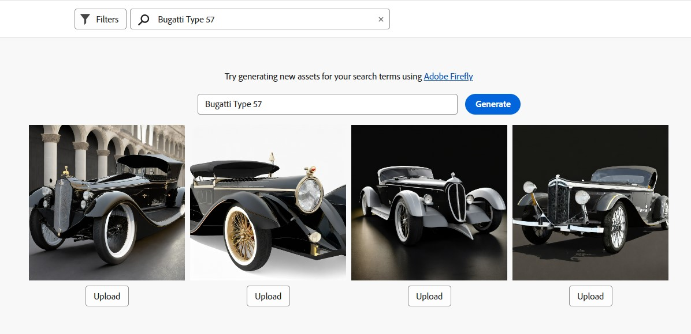

# [!DNL Assets view] でアセットを検索 {#search-assets}

>[!CONTEXTUALHELP]
>id="assets_search"
>title="アセットの検索"
>abstract="検索バーでキーワードを指定するか、ステータス、ファイルタイプ、MIME タイプ、サイズ、作成日、変更日および有効期限に基づいてアセットをフィルタリングして、アセットを検索します。標準フィルターに加えて、カスタムフィルターを適用することもできます。フィルタリングした結果は、保存した検索条件またはスマートコレクションとして保存できます。"
>additional-url="https://experienceleague.adobe.com/docs/experience-manager-assets-essentials/help/manage-collections.html?lang=ja#manage-smart-collection" text="スマートコレクションを作成"

[!DNL Assets view] では効果的な検索が可能です。この検索はデフォルトで機能します。フルテキスト検索なので、網羅的に検索できます。この強力な検索機能を使用すると、適切なアセットをすばやく発見できるので、コンテンツベロシティ（コンテンツ創出の速度）の向上に役立ちます。[!DNL Assets view] では、フルテキスト検索を行えるほか、スマートタグ、タイトル、作成日、著作権などのメタデータを検索することもできます。

アセットを検索するには、

* ページ上部の検索ボックスをクリックします。デフォルトでは、現在参照しているフォルダー内を検索します。次のいずれかの操作を行います。

  

   * キーワードを使用して検索します。オプションで、フォルダーを変更することもできます。Return キーを押します。

   * 最近表示されたアセットを直接検索して、操作を開始します。検索ボックス内をクリックし、最近表示されたアセットを候補から選択します。

## 検索結果のフィルタリング {#refine-search-results}

以下のパラメーターに基づいて検索結果をフィルタリングできます。

*図：検索したアセットを様々なパラメーターに基づいてフィルタリング*

* アセットステータス：`Approved`、`Rejected`、または `No Status` アセットステータスを使用した検索結果のフィルタリング。

* ファイルタイプ：サポートされているファイルタイプ（`Images`、`Documents`、`Videos`）で検索結果をフィルタリングします。
* MIME タイプ：サポートされている 1 つ以上のファイル形式でフィルタリングします。<!-- TBD:  [supported file formats](/help/assets/supported-file-formats-assets-view.md). -->
* 画像サイズ：画像をフィルタリングするための最小サイズと最大サイズのどちらか一方または両方を指定します。サイズはピクセル単位で指定され、画像のファイルサイズではありません。
* 作成日：アセットの作成日（メタデータで指定されたもの）。標準の日付形式は `yyyy-mm-dd` です。
* 変更日：アセットの最終変更日。標準の日付形式は `yyyy-mm-dd` です。

* 有効期限：アセットの `Expired` ステータスに基づいて検索結果をフィルタリングできます。また、アセットの有効期限の日付範囲を指定して、検索結果をさらにフィルタリングすることもできます。

* カスタムフィルター：アセットビューのユーザーインターフェイスに[カスタムフィルターを追加](#custom-filters)できます。標準フィルターに加えて、カスタムフィルターを適用し、検索結果を絞り込むことができます。

検索したアセットを、`Name`、`Relevancy`、`Size`、`Modified` および `Created` の昇順または降順に並べ替えることができます。

## カスタムフィルターの管理 {#custom-filters}

**必要な権限：** `Can Edit`、`Owner` または管理者。

また、アセットビューで、ユーザーインターフェイスにカスタムフィルターを追加できます。[標準フィルター](#refine-search-results)に加えて、カスタムフィルターを適用し、検索結果を絞り込むことができます。

アセットビューが提供するカスタムフィルターは次のとおりです。

<table>
    <tbody>
     <tr>
      <th><strong>カスタムフィルター名</strong></th>
      <th><strong>説明</strong></th>
     </tr>
     <tr>
      <td>タイトル</td>
      <td>アセットタイトルを使用してアセットをフィルタリングします。大文字と小文字を区別する検索条件で指定するタイトルは、結果に表示されるアセットの正確なタイトルと一致する必要があります。</td>
     </tr>
     <tr>
      <td>名前</td>
      <td>アセットファイル名を使用してアセットをフィルタリングします。大文字と小文字を区別する検索条件で指定する名前は、結果に表示されるアセットの正確なファイル名と一致する必要があります。</td>
     </tr>
     <tr>
      <td>アセットサイズ</td>
      <td>アセットをフィルタリングするには、検索条件でアセットに表示するサイズ範囲をバイト単位で指定します。</td>
     </tr>
     <tr>
      <td>予測されるタグ</td>
      <td>アセットスマートタグを使用してアセットをフィルタリングします。大文字と小文字を区別する検索条件で指定するスマートタグ名は、結果に表示されるアセットの正確なスマートタグ名と一致する必要があります。検索条件に複数のスマートタグを指定することはできません。</td>
     </tr>    
    </tbody>
   </table>

<!--
   You can use a wildcard operator (*) to enable Assets view to display assets in the results that partially match the search criteria. For example, if you define <b>ma*</b> as the search criteria, Assets view displays assets with title, such as, market, marketing, man, manchester, and so on in the results.

   You can use a wildcard operator (*) to enable Assets view to display assets in the results that partially match the search criteria.

   You can use a wildcard operator (*) to enable Assets view to display assets in the results that partially match the search criteria. You can specify multiple smart tags separated by a comma in the search criteria.

   -->

### カスタムフィルターの追加 {#add-custom-filters}

カスタムプロパティを追加する手順は次のとおりです。

1. 「**[!UICONTROL フィルター]**」をクリックします。

1. 「**[!UICONTROL カスタムフィルター]**」セクションで、「**[!UICONTROL 編集]**」または「**[!UICONTROL フィルターを追加]**」をクリックします。

   

1. **[!UICONTROL カスタムフィルター管理]**&#x200B;ダイアログボックスで、既存のフィルターのリストに追加するフィルターを選択します。「**[!UICONTROL カスタムフィルター]**」を選択して、すべてのフィルターを選択します。

1. 「**[!UICONTROL 確認]**」をクリックして、ユーザーインターフェイスにフィルターを追加します。

### カスタムフィルターの削除 {#remove-custom-filters}

カスタムフィルターを削除する手順は次のとおりです。

1. 「**[!UICONTROL フィルター]**」をクリックします。

1. 「**[!UICONTROL カスタムフィルター]**」セクションで、「**[!UICONTROL 編集]**」をクリックします。

1. **[!UICONTROL カスタムフィルター管理]**&#x200B;ダイアログボックスで、既存のフィルターのリストから削除するフィルターを選択解除します。

1. 「**[!UICONTROL 確認]**」をクリックして、ユーザーインターフェイスからフィルターを削除します。

## 次を使用したアセットの検索 [!DNL Adobe Firefly] {#search-firefly}

どのアセットフォルダーにもないアセットを検索するには、 [!DNL Adobe Firefly] 内のアセット検索機能 [!DNL Experience Manager Assets]. これにより、アセットフォルダーに保存されていないアセットをリアルタイムで効率的に生成できます。

### 事前準備

アクティブなが必要です [!DNL Adobe Express] 購読。

### アセットを生成

を使用して新しいアセットを生成するには [!DNL Adobe Firefly]:

1. 次に移動： [!DNL AEM Assets] ワークスペース。
1. ページ上部の検索バーにアセット名を入力します。 
例えば、キーワードを使用してアセットを検索できます `Bugatti Type 57`. アセットを検索する際に、どのアセットフォルダーにもアセットが存在しないので、結果は見つかりません。
1. ページの中央にある検索バーにアセット名を入力し、 **[!UICONTROL 生成]**.
   
   *図：アセットフォルダーの Bugatti Type 57 に対する結果が見つかりませんでした。*  
新しいアセットが正常に生成されました。
   
   *図：を使用して検索された参照アセット [!DNL Adobe Firefly] アセット検索機能。*  
これらのアセットを目的のフォルダーにアップロードして、アクセスしやすくすることができます。

### アセットのアップロード

生成したアセットをアセットリポジトリーにアップロードするには：

1. 「**[!UICONTROL アップロード]**」をクリックします。
1. アセットのアップロード先のアセットフォルダーを選択し、「 **[!UICONTROL フォルダーを選択]**.
   
   *図：アセットをアップロードするフォルダーを選択します。*

## 保存済みの検索 {#saved-search}

[!DNL Assets view] の検索機能は非常に使いやすくなっています。検索ボックス内に、キーワードを入力し、Return キーを押せば結果を表示できるます。あるいは、最近検索したキーワードを 1 回クリックするだけですばやく再検索することができます。

また、アセットのメタデータやタイプに関する特定の条件に基づいて検索結果をフィルタリングすることもできます。特定のフィルターを頻繁に使用する場合、[!DNL Assets view] では、検索性を向上させるために、検索パラメーターを保存できます。その場合、保存済みの検索を選択し、1 回クリックするだけで検索してフィルターを適用することができます。

保存した検索条件を作成するには、アセットを検索し、1 つ以上のフィルターを適用して、[!UICONTROL フィルター]パネルの&#x200B;**[!UICONTROL 別名で保存]**／**[!UICONTROL 保存した検索条件]**&#x200B;をクリックします。また、「**[!UICONTROL 別名で保存]**」をクリックし、「**[!UICONTROL スマートコレクション]**」を選択して、結果をスマートコレクションとして保存することもできます。詳しくは、[スマートコレクションの作成](manage-collections-assets-view.md#create-a-smart-collection)を参照してください。

<!-- TBD: Search behavior. Full-text search. Ranking and rank boosts. Hidden assets.
Report poor UX that users can only save a filtered search and not a simple search.
.
Are other supported files fully indexed and support full-text search? Eg. audio/videos files can at best have metadata indexed.
Anything about ranking of assets displayed in search results?

What about temporarily hiding an asset (suspending search on it) from the search results? If an asset is undergoing review collaboration, should it be used by others? Should it be hidden in search?

When userA is searching and userB add an asset that matches search results, will the asset display in search as soon as userA refreshes the page? Assuming indexing is near real-time. May not be so for bulk uploads.
-->

## 検索結果の操作 {#work-with-search-results}

検索結果に表示するアセットを選択し、次の操作を実行できます。

* **類似画像を検索**：メタデータとスマートタグに基づいて、Assets UI で類似の画像アセットを見つけます。

* **詳細**：アセットのプロパティを表示および編集します。

* **ダウンロード**：アセットをダウンロードします。

* **コレクションに追加**：選択したアセットをコレクションに追加します。

* **クイックアクセスにピン留め**：[アセットをピン留め](my-workspace-assets-view.md)すると、後で必要になった際に、すばやくアクセスできるようになります。ピン留めしたすべての項目は、マイワークスペースの「**クイックアクセス**」セクションに表示されます。

* **「開く」Adobe Express**:Experience Manager Assets画面から統合Adobe Expressで画像を編集します。

* **編集**:「 」オプションを使用して画像をAdobe Expressします。

* **リンクを共有**：他のユーザーとアセットの[リンクを共有](share-links-for-assets-view.md)して、アセットにアクセスしてダウンロードできるようにします。

* **削除**：アセットを削除します。

* **コピー**：別のフォルダーの場所にアセットをコピーします。

* **移動**：アセットを別のフォルダーの場所に移動します。

* **名前を変更**：アセットの名前を変更します。

* **ライブラリにコピー**：アセットをライブラリに追加します。

* **タスクを割り当て**：アセットのユーザーにタスクを割り当てます。

* **監視**：アセットに対して実行される[操作を監視](manage-notifications-assets-view.md)します。

## 最初のホームページを検索する設定 {#configuring-search-first-homepage}

Experience Manager Assetsを使用すると、組織のデフォルトのランディングページを選択できます。 「最初に検索」をホームページとして使用する場合、ブランドに合わせて背景画像とロゴ画像を設定し、ページのブランディングをカスタマイズするオプションもあります。

検索用の最初のホームページを設定するには、次の手順を実行します。

1. に移動します。 **[!UICONTROL 設定]** > **[!UICONTROL 一般設定]**.
1. 選択 **[!UICONTROL 最初に検索]**. さらに、検索に関連する最初の設定が開きます。 次の設定が可能です。 [整列](#setting-alignment-search-bar) または [背景とロゴの画像を設定](#setting-background-image-and-logo) 」をクリックします。

### 検索バーの配置を設定しています {#setting-alignment-search-bar}

[!DNL Assets view] 検索バーの配置を変更できます。 検索バーは中央または上部に表示できます。 適切な位置揃えを選択し、 **[!UICONTROL 保存]**.

### ホームページの背景とロゴイメージを設定しています {#setting-background-image-and-logo}

検索最初のホームページにブランドのロゴと背景画像を追加できます。 以下の手順を実行します。

1. に移動します。 **[!UICONTROL 背景とロゴの画像]** の下のセクション **[!UICONTROL ホームページ]**.
1. クリック **[!UICONTROL 置換]** 既存のアセットリポジトリーから画像を参照する場合。
1. 「**[!UICONTROL 保存]**」をクリックします。[プレビュー](#preview-configured-homepage) 変更をレビューします。

### 設定済みのホームページをプレビュー {#preview-configured-homepage}

プレビューを使用して、検索最初のホームページのレイアウトや書式を確認できます。 使用 **[!UICONTROL プレビュー]**&#x200B;を使用すると、レイアウトを修正したり、必要に応じて変更したりできます。 設定済みのホームページをプレビューするには、次の手順を実行します。

1. クリック **[!UICONTROL 一般設定]** を選択し、 **[!UICONTROL 最初に検索]**.
1. に移動します。 **[!UICONTROL 最初のホームページで検索をカスタマイズ]** をクリックします。 **[!UICONTROL プレビュー]**. 切り替え **[!UICONTROL ダークテーマ]** ボタンをクリックして、ホームページを暗いテーマまたは明るいテーマでプレビューします。
1. クリック **[!UICONTROL 閉じる]** をクリックして、プレビュー画面を閉じます。

   

## 次の手順 {#next-steps}

* [ビデオを試聴してアセットビューでのアセットの検索を学ぶ](https://experienceleague.adobe.com/docs/experience-manager-learn/assets-essentials/basics/using.html?lang=ja)

* アセットビューのユーザーインターフェイスの「[!UICONTROL フィードバック]」オプションを使用して製品に関するフィードバックを提供する

* 右側のサイドバーにある「[!UICONTROL このページを編集]」（）または「[!UICONTROL 問題を記録] 」（）を使用してドキュメントに関するフィードバックを提供する

* [カスタマーケア](https://experienceleague.adobe.com/?support-solution=General&amp;lang=ja#support)に問い合わせる
